# 9.1.1.4 Turkish Payment System Architecture (with Mandatory BKM Integration)

> **Taxonomy Reference**: §9.1.1 Financial Services Architecture, §2.1 Application Architecture Styles, §3 Integration & Communication, §6 Security Architecture (see [architecture_taxonomy_reference.md](../../10-practicality-taxonomy/architecture_taxonomy_reference.md))

## Table of Contents

1. [Overview](#overview)
2. [Turkish Payment Regulatory Landscape](#turkish-payment-regulatory-landscape)
   - [Key Regulatory Bodies](#key-regulatory-bodies)
   - [Mandatory BKM Connection Requirements](#mandatory-bkm-connection-requirements)
3. [High-Level System Architecture](#high-level-system-architecture)
4. [BKM Integration Layer](#bkm-integration-layer)
   - [Troy Domestic Card Network](#troy-domestic-card-network)
   - [BKM Express Digital Wallet](#bkm-express-digital-wallet)
   - [3D Secure via BKM (3DS-TR)](#3d-secure-via-bkm-3ds-tr)
   - [BKM Clearing & Settlement](#bkm-clearing--settlement)
5. [Core Platform Components](#core-platform-components)
   - [API Gateway](#api-gateway)
   - [Payment Processing Engine](#payment-processing-engine)
   - [Fraud Detection Engine](#fraud-detection-engine)
   - [Card Vault & Tokenization](#card-vault--tokenization)
   - [Financial Ledger](#financial-ledger)
6. [Payment Processing Flows](#payment-processing-flows)
   - [Troy Card Payment Flow](#troy-card-payment-flow)
   - [International Card Payment Flow (Visa/Mastercard)](#international-card-payment-flow-visamastercard)
   - [FAST (Instant Payment) Flow](#fast-instant-payment-flow)
   - [BKM Express Payment Flow](#bkm-express-payment-flow)
7. [Local Payment Methods Support](#local-payment-methods-support)
8. [Compliance Architecture](#compliance-architecture)
   - [PCI DSS Requirements](#pci-dss-requirements)
   - [KVKK (Turkish GDPR) Compliance](#kvkk-turkish-gdpr-compliance)
   - [BDDK & TCMB Regulatory Obligations](#bddk--tcmb-regulatory-obligations)
9. [Security Architecture](#security-architecture)
   - [HSM Integration](#hsm-integration)
   - [Key Management](#key-management)
   - [Network Security Zones](#network-security-zones)
10. [Data Residency & Sovereignty](#data-residency--sovereignty)
11. [High Availability Architecture](#high-availability-architecture)
12. [Observability & Audit Trail](#observability--audit-trail)
13. [Transactional Integrity](#transactional-integrity)
    - [Core Integrity Mechanisms](#core-integrity-mechanisms)
    - [Corner Case Analysis](#corner-case-analysis)
    - [Integrity Guarantees by Layer](#integrity-guarantees-by-layer)
14. [Key Architectural Trade-offs](#key-architectural-trade-offs)
15. [Related Topics](#related-topics)

---

## Overview

This document describes the reference architecture for a Turkish payment service provider (PSP) or payment institution operating under Turkish financial regulations. The central architectural constraint is the **mandatory connection to BKM (Bankalararası Kart Merkezi — Interbank Card Center)**, which governs domestic card network operations, clearing, and settlement for all card-based payment participants in Turkey.

**Turkish payment market characteristics that drive architecture decisions**:

| Characteristic | Detail | Architectural Impact |
|----------------|--------|---------------------|
| Mandatory BKM connectivity | All card-acquiring PSPs must connect to BKM | Dedicated BKM integration layer; ISO 8583 message processing |
| Troy domestic card network | National card scheme operated by BKM | Dual routing: Troy vs. Visa/MC for co-badged cards |
| FAST instant payments | TCMB-operated 7/24 real-time fund transfer | Async messaging pipeline for FAST rails |
| KVKK (Law No. 6698) | Turkish Personal Data Protection Law | Data residency; consent management; local storage mandate |
| BDDK licensing | Banking Regulation & Supervision Agency | Strict audit, capital requirements, operational controls |
| PCI DSS | Global card data security standard | Card vault isolation; HSM for key management |
| High instalment culture | Taksit (instalment) payments are common | Instalment calculation engine; split settlement |

**Design goals**:

| Goal | Architectural Consequence |
|------|--------------------------|
| BKM compliance by regulation | BKM integration module is a first-class architectural component, not an afterthought |
| < 500 ms end-to-end latency for card authorisation | Synchronous BKM/ISO 8583 path optimised; circuit breakers for degraded mode |
| 99.99% availability | Active-active dual data center in Turkey; TCMB requires domestic DC presence |
| PCI DSS Level 1 compliance | Card data isolated in a separate vault behind HSMs |
| KVKK data residency | All PII and cardholder data stored in Turkey-domiciled data centers |
| Fraud prevention | Real-time scoring before BKM authorisation request |

---

## Turkish Payment Regulatory Landscape

### Key Regulatory Bodies

```
┌─────────────────────────────────────────────────────────────────┐
│                   Turkish Regulatory Stack                      │
├──────────────┬──────────────────────────────────────────────────┤
│ TCMB         │ Central Bank of Turkey — FAST payment system,     │
│              │ payment institution licensing (Law 6493)          │
├──────────────┼──────────────────────────────────────────────────┤
│ BDDK         │ Banking Regulation & Supervision Agency —         │
│              │ bank-owned PSPs, acquiring bank oversight         │
├──────────────┼──────────────────────────────────────────────────┤
│ BKM          │ Interbank Card Center — mandatory clearing hub    │
│              │ for domestic card transactions; operates Troy     │
├──────────────┼──────────────────────────────────────────────────┤
│ KVKK (KVK)   │ Personal Data Protection Authority — GDPR-       │
│              │ equivalent, data residency mandate                │
├──────────────┼──────────────────────────────────────────────────┤
│ PCI SSC      │ PCI DSS — international card security standard   │
└──────────────┴──────────────────────────────────────────────────┘
```

### Mandatory BKM Connection Requirements

Under Turkish banking regulations and BKM membership rules, any entity that acquires or processes domestic card transactions **must**:

1. **Establish a direct technical connection to BKM's clearing network** — typically via dedicated leased-line or VPN over MPLS to BKM's data center in Istanbul.
2. **Implement ISO 8583 message formatting** — BKM's clearing interface is ISO 8583-based; all authorisation, clearing, and settlement messages must conform to BKM's message specification.
3. **Support Troy card scheme** — All terminals and payment pages must be capable of accepting Troy-branded cards and routing them through BKM's Troy network.
4. **Participate in BKM clearing cycles** — Daily clearing files must be generated and submitted to BKM in the prescribed format (BKM File Format Specification).
5. **Implement BKM 3D Secure (3DS-TR)** — BKM operates the 3DS directory server for Turkish-issued cards; all online card transactions must integrate with BKM's 3DS infrastructure.
6. **Connect to BKM Express** — BKM Express is the national digital wallet; PSPs serving e-commerce merchants must support it as a payment method.
7. **Maintain BKM-mandated HSM standards** — Cryptographic key exchange for PIN and MAC operations must use HSMs certified to BKM specifications.

---

## High-Level System Architecture

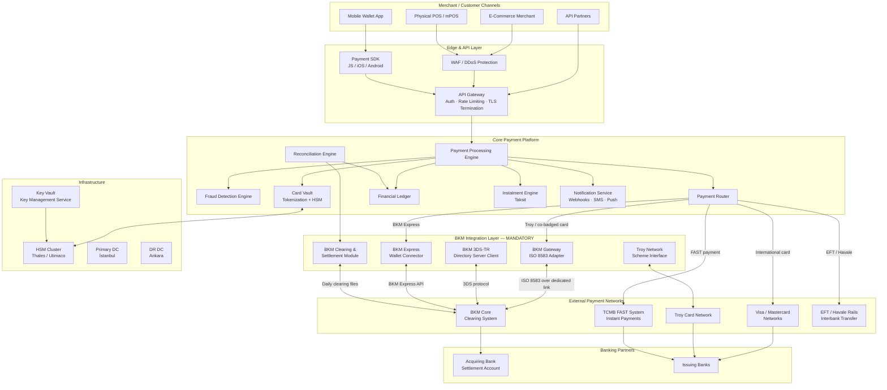

---

## BKM Integration Layer

The BKM Integration Layer is the most critical mandatory component. It encapsulates all protocols and interfaces required to comply with BKM's technical standards.

### Troy Domestic Card Network

**Troy** is Turkey's national card network, launched in 2016 and operated by BKM. Any acquiring PSP must support Troy card transactions end-to-end.

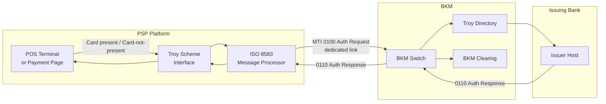

**Key technical requirements for Troy integration**:

| Requirement | Detail |
|-------------|--------|
| BIN ranges | Troy BINs starting with `9` (e.g., 9792xx); must be detected before routing |
| ISO 8583 version | BKM's extended ISO 8583:1993 with proprietary TLV extensions |
| Network connectivity | Dedicated leased line or MPLS-VPN to BKM; minimum 2 redundant links |
| Message authentication | MAC (Message Authentication Code) generated via HSM using BKM-provisioned keys |
| Authorisation timeout | 10 seconds maximum; automatic reversal on timeout |
| Co-badged card routing | Preference given to Troy for domestic transactions per regulation |

### BKM Express Digital Wallet

BKM Express is the Turkish national digital wallet, mandatory for e-commerce PSPs.

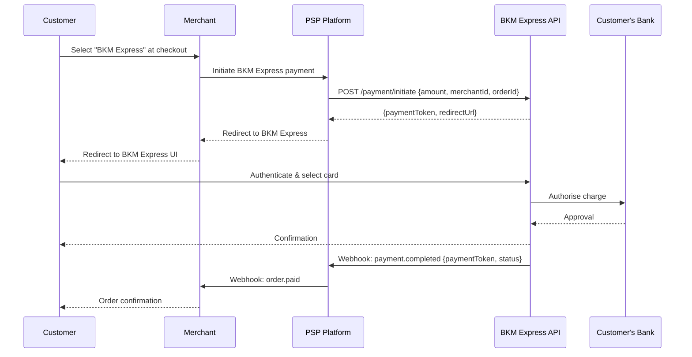

### 3D Secure via BKM (3DS-TR)

BKM operates the **3DS Directory Server** for all Turkish-issued cards. All card-not-present transactions processed by Turkish PSPs must pass through BKM's 3DS-TR infrastructure.

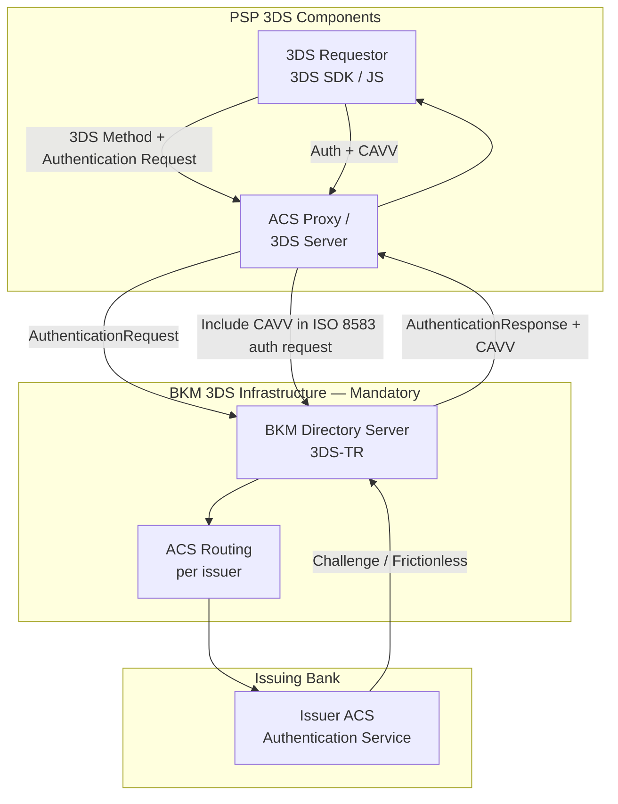

**3DS-TR specifics**:
- BKM's DS supports both **3DS 1.0** (legacy) and **3DS 2.x** (EMV 3DS)
- PSPs must register their merchant categories and domains with BKM's DS
- CAVV (Cardholder Authentication Verification Value) must be included in the ISO 8583 authorisation request forwarded to BKM

### BKM Clearing & Settlement

BKM acts as the central clearing house for all domestic card transactions. The clearing cycle is as follows:

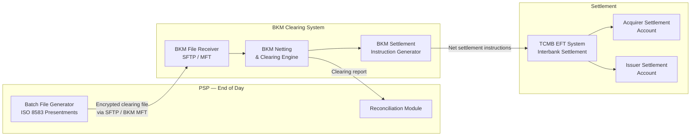

**Clearing schedule**:

| Cycle | Time (Turkey local) | Content |
|-------|---------------------|---------|
| T+0 Intraday | 09:00, 13:00, 17:00 | Partial clearing files |
| T+0 Final | 23:00 | Complete day's transactions |
| T+1 Settlement | 08:00 next day | Net settlement via TCMB EFT |

---

## Core Platform Components

### API Gateway

The API Gateway is the single entry point for all merchant and partner integrations.

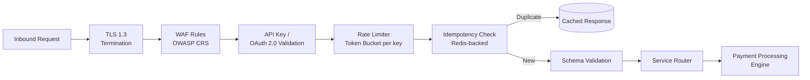

**Key responsibilities**:
- **Authentication**: API key (HMAC-signed) for server-to-server; OAuth 2.0 for partner integrations
- **Idempotency**: All mutating requests accept an `X-Idempotency-Key` header; Redis-backed deduplication with 24-hour TTL
- **Rate limiting**: Token-bucket per merchant API key; separate limits for authorisation vs. reporting endpoints
- **TLS 1.3 only**: Older TLS versions disabled; certificate pinning for POS terminal connections

### Payment Processing Engine

The PPE orchestrates the full payment lifecycle as an explicit state machine:

```mermaid
stateDiagram-v2
    [*] --> Created: Payment intent created
    Created --> FraudCheck: Fraud scoring initiated
    FraudCheck --> Blocked: Fraud score above threshold
    FraudCheck --> ThreeDSRequired: CNP transaction
    ThreeDSRequired --> ThreeDSCompleted: Customer authenticated via BKM 3DS
    ThreeDSRequired --> ThreeDSFailed: Authentication failed
    ThreeDSCompleted --> AuthorisationPending: ISO 8583 0100 sent to BKM
    Created --> AuthorisationPending: POS present; fraud OK
    AuthorisationPending --> Authorised: BKM 0110 approved
    AuthorisationPending --> Declined: BKM 0110 declined
    Authorised --> Captured: Capture requested
    Authorised --> Reversed: Reversal requested
    Captured --> Cleared: Included in BKM clearing batch
    Cleared --> Settled: TCMB settlement confirmed
    Settled --> [*]
    Reversed --> [*]
    Blocked --> [*]
    ThreeDSFailed --> [*]
    Declined --> [*]
```

### Fraud Detection Engine

Real-time scoring must occur **before** the BKM authorisation request is sent to avoid unnecessary network usage and potential fraud losses.

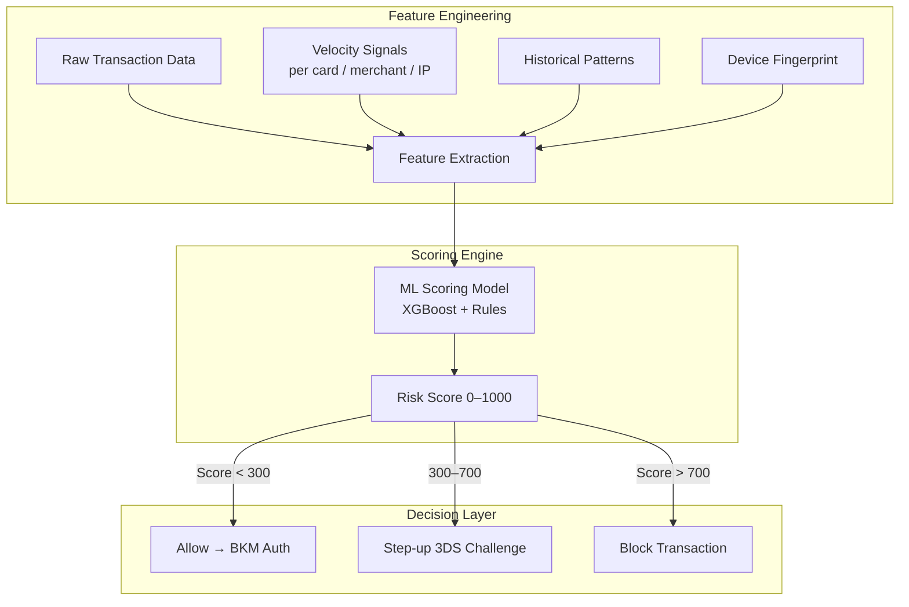

### Card Vault & Tokenization

All Primary Account Numbers (PANs) are stored exclusively in the Card Vault, never in the main application database. This is required for PCI DSS compliance.

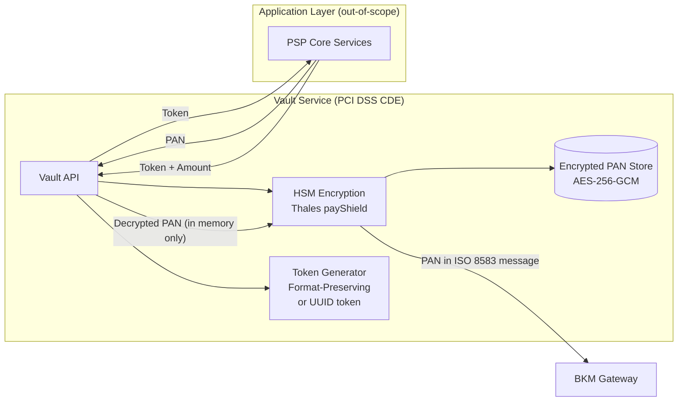

**Tokenization scheme**:

| Token Type | Use Case | Format |
|------------|----------|--------|
| Network Token (BKM/Visa/MC) | Recurring, subscription | 16-digit, scheme-issued |
| PSP Internal Token | Stored cards, one-click | UUID v4, opaque |
| Format-Preserving Token | POS display (last 4 digits) | 16-digit, Luhn-valid |

### Financial Ledger

Double-entry accounting ledger supporting multi-currency and instalment (taksit) operations:

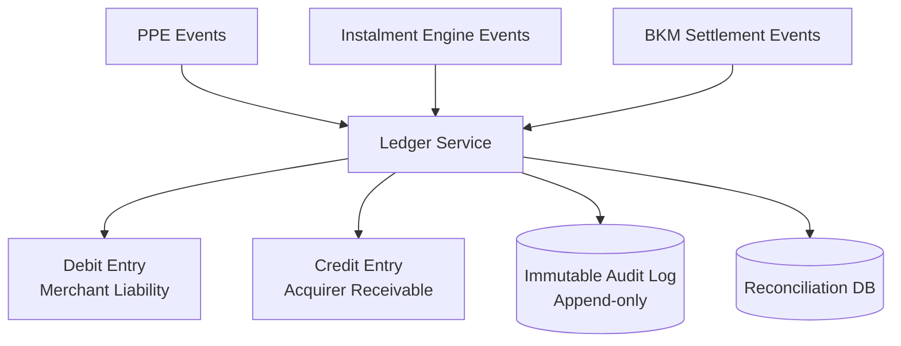

---

## Payment Processing Flows

### Troy Card Payment Flow

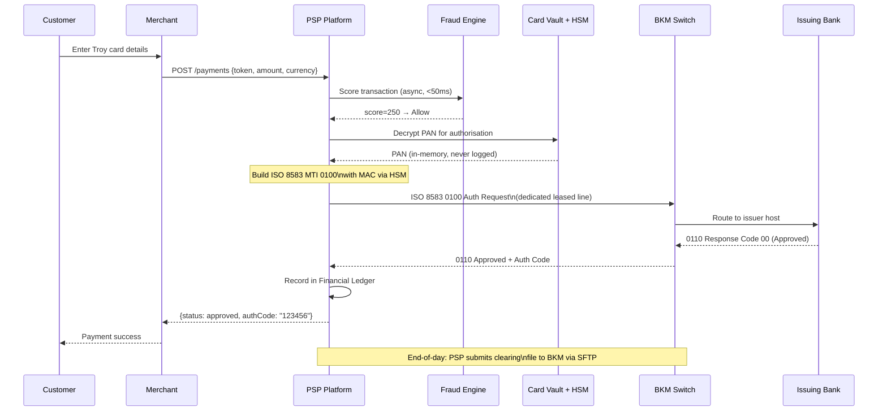

### International Card Payment Flow (Visa/Mastercard)

For international cards, BKM is **not** in the direct authorisation path, but co-badged cards (Troy + Visa/MC) must prefer Troy domestically per regulation.

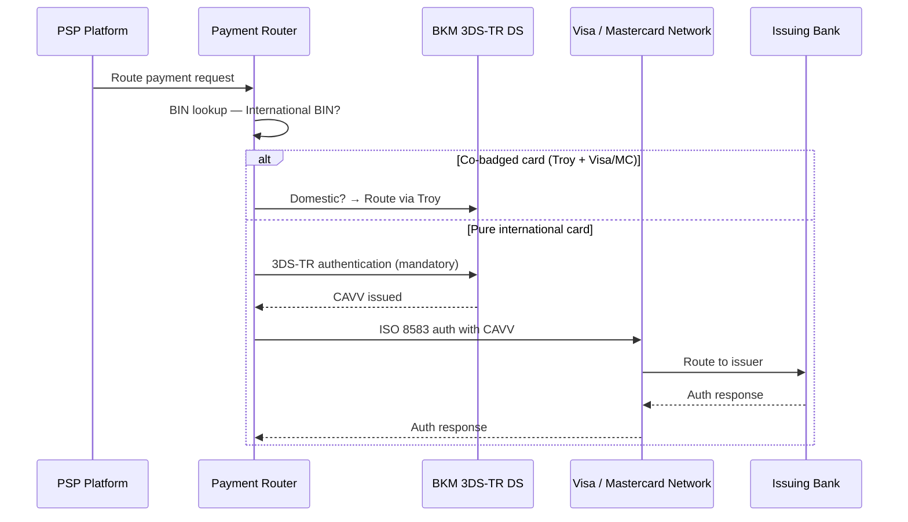

### FAST (Instant Payment) Flow

TCMB's FAST system (Fonların Anlık ve Sürekli Transferi) enables 7/24 instant money transfers. PSPs must integrate for account-to-account payment acceptance.

```mermaid
sequenceDiagram
    participant Customer
    participant PSP as PSP Platform
    participant FAST_ADAPTER as FAST Adapter
    participant TCMB_FAST as TCMB FAST System
    participant CUST_BANK as Customer's Bank

    Customer->>PSP: Initiate payment via IBAN / QR
    PSP->>FAST_ADAPTER: Create FAST payment request
    FAST_ADAPTER->>TCMB_FAST: ISO 20022 pacs.008 message
    TCMB_FAST->>CUST_BANK: Payment instruction
    CUST_BANK-->>TCMB_FAST: pacs.002 acceptance
    TCMB_FAST-->>FAST_ADAPTER: pacs.002 confirmation
    FAST_ADAPTER-->>PSP: Payment confirmed
    PSP->>PSP: Credit merchant ledger
    PSP-->>Customer: Payment success (< 5 seconds)
    Note over FAST_ADAPTER,TCMB_FAST: 7/24 availability;\nno clearing cycle; instant settlement
```

### BKM Express Payment Flow

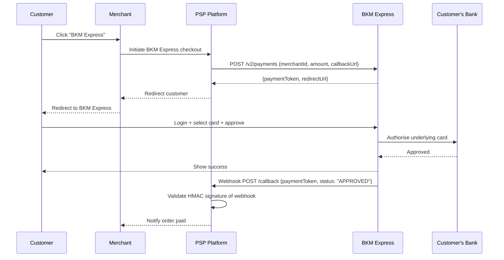

---

## Local Payment Methods Support

| Payment Method | Operator | Integration | Settlement |
|---------------|----------|-------------|------------|
| **Troy Card** | BKM | ISO 8583 direct to BKM | T+1 via BKM |
| **BKM Express** | BKM | BKM Express REST API | T+1 via BKM |
| **Visa / Mastercard** | Visa / MC | Via acquiring bank + BKM 3DS | T+1 via acquiring bank |
| **FAST (7/24 instant)** | TCMB | ISO 20022 via FAST adapter | Instant |
| **EFT / Havale** | TCMB | EFT rails (business hours) | T+0 / T+1 |
| **Taksit (instalment)** | PSP + Banks | Card payment + instalment plan DB | Monthly splits |
| **QR Payment (Karekod)** | TCMB | TCMB QR standard (TR QR) | FAST-backed |

---

## Compliance Architecture

### PCI DSS Requirements

The Cardholder Data Environment (CDE) is strictly segmented:

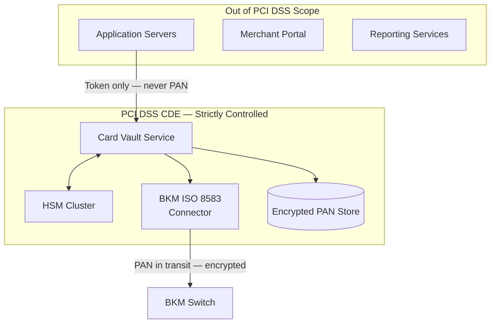

**PCI DSS controls checklist**:

| Control Area | Implementation |
|-------------|----------------|
| Network segmentation | VLAN + firewall rules; CDE on isolated network segment |
| Encryption at rest | AES-256-GCM; keys in HSM |
| Encryption in transit | TLS 1.3 for APIs; encrypted ISO 8583 for BKM link |
| Key management | HSM-based; dual-control key ceremony; annual rotation |
| Access control | Role-based; MFA for all CDE access |
| Logging & monitoring | All CDE access logged; SIEM alerts for anomalies |
| Vulnerability management | Quarterly ASV scans; annual penetration test |
| Incident response | Documented IR plan; 24-hour breach notification |

### KVKK (Turkish GDPR) Compliance

Turkey's **Kişisel Verilerin Korunması Kanunu** (Law No. 6698) imposes data residency and consent requirements:

| Requirement | Implementation |
|-------------|----------------|
| Data residency | All PII (name, IBAN, card details) stored in Turkey-domiciled data centers |
| Explicit consent | Consent recorded at onboarding; stored in Consent Management DB |
| Data minimization | Only collect data fields required for payment processing |
| Right to erasure | Soft-delete with legal hold override for financial records |
| Cross-border transfer | Prohibited without KVK Board approval or adequacy decision |
| Data breach notification | 72-hour notification to KVK Authority |

### BDDK & TCMB Regulatory Obligations

| Obligation | Responsible Body | Implementation |
|------------|-----------------|----------------|
| Payment institution license (Law 6493) | TCMB | Maintain license; report suspicious transactions |
| Capital adequacy | BDDK | Ring-fenced capital in settlement account |
| Transaction reporting | TCMB | Daily transaction reports via TCMB's reporting portal |
| AML / KYC | MASAK (Financial Intelligence Unit) | KYC at merchant onboarding; transaction monitoring |
| Operational resilience | BDDK / TCMB | RTO < 4h; RPO < 1h; annual DR test required |

---

## Security Architecture

### HSM Integration

Hardware Security Modules are mandatory for PIN processing, MAC generation, and key storage per both PCI DSS and BKM requirements.

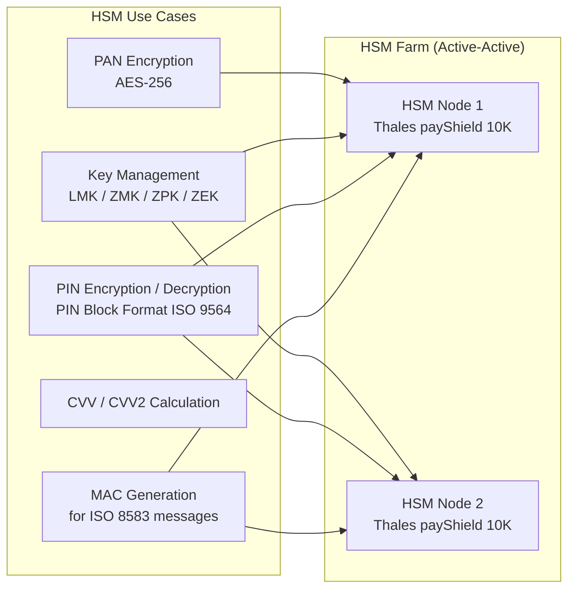

**Key hierarchy**:

```
Local Master Key (LMK) — stored in HSM hardware; never leaves device
  └── Zone Master Key (ZMK) — exchanged with BKM under dual-control ceremony
        └── Zone PIN Key (ZPK) — encrypts PINs in transit
        └── Zone MAC Key (ZMK) — authenticates ISO 8583 messages
        └── Zone Encryption Key (ZEK) — encrypts sensitive data fields
```

### Network Security Zones

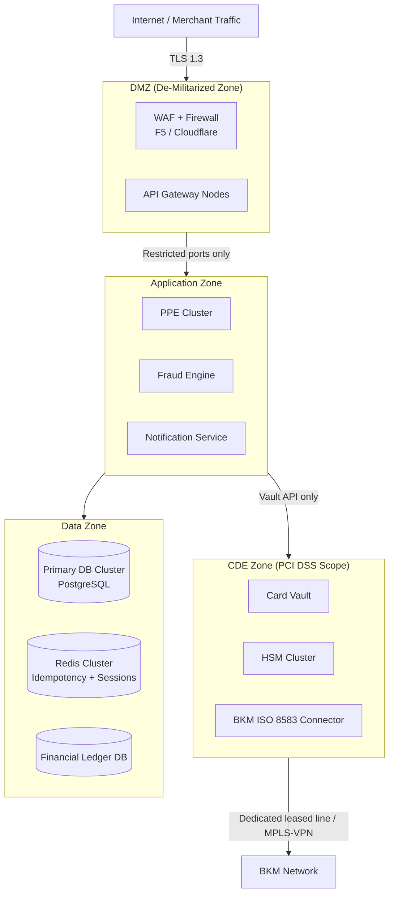

---

## Data Residency & Sovereignty

A critical architectural constraint: **all data containing PII or cardholder data must remain in Turkey**.

| Data Category | Storage Location | Justification |
|--------------|-----------------|---------------|
| Cardholder data (PAN, CVV) | Turkey DC — encrypted in HSM-backed vault | PCI DSS + KVKK |
| Transaction records | Turkey DC — primary + DR | KVKK data residency |
| Merchant PII | Turkey DC | KVKK |
| Audit logs | Turkey DC — immutable | BDDK audit requirements |
| Fraud model training data | Turkey DC | KVKK — PII in features |
| Anonymized analytics | May be processed offshore if PII-stripped | KVKK exemption |

**Active-Active dual data center setup** (both centers in Turkey):

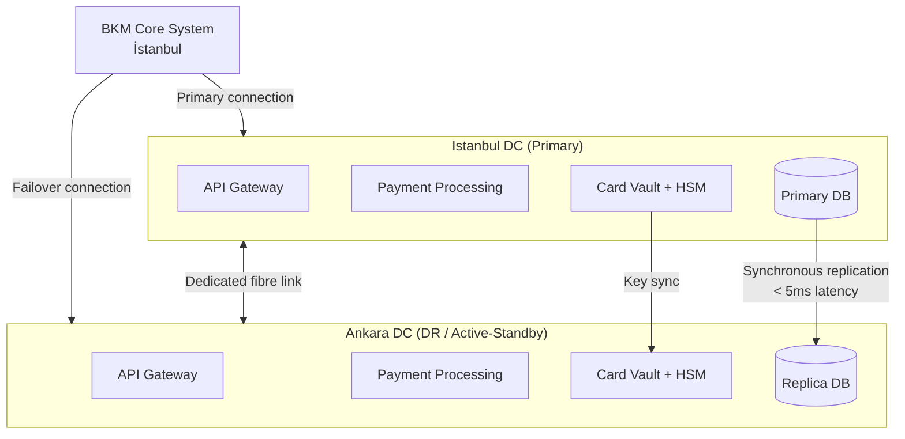

---

## High Availability Architecture

| Component | HA Strategy | RTO | RPO |
|-----------|------------|-----|-----|
| API Gateway | Active-active, N+2 | < 30s | 0 |
| Payment Processing Engine | Active-active across DCs | < 60s | 0 |
| Card Vault | Active-standby; HSM sync | < 120s | 0 |
| BKM ISO 8583 Link | Dual links (primary + backup) | < 30s | 0 |
| Financial Ledger DB | Sync replication; auto-failover | < 60s | 0 |
| FAST Adapter | Active-active | < 30s | 0 |
| Fraud Engine | Degrade gracefully (default-allow) | N/A | N/A |

**Circuit breaker pattern for BKM connectivity**:

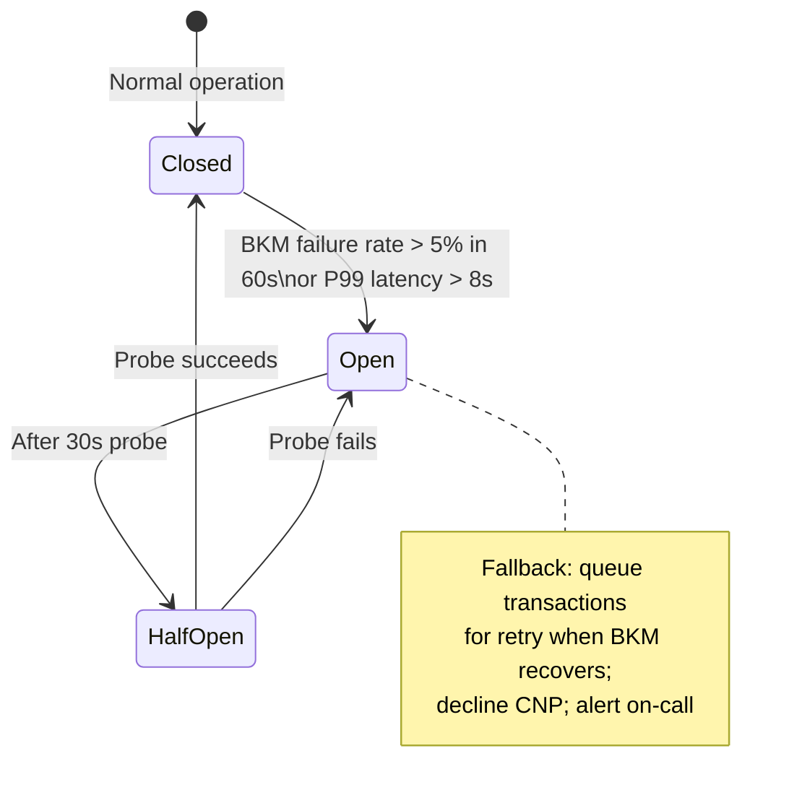

---

## Observability & Audit Trail

All payment events generate immutable audit records, required by both BDDK and PCI DSS.

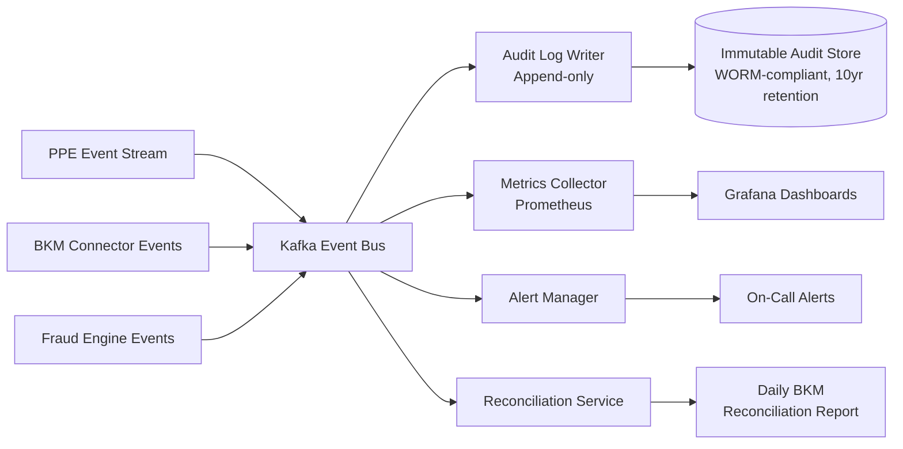

**Key metrics to monitor**:

| Metric | Alert Threshold | Reason |
|--------|----------------|--------|
| BKM link latency P99 | > 5 seconds | Regulatory SLA risk |
| BKM authorisation success rate | < 95% | Operational degradation |
| 3DS-TR completion rate | < 90% | Chargeback liability risk |
| Fraud block rate | > 5% sustained | Possible fraud wave or model drift |
| Clearing file submission success | Any failure | BKM compliance breach |
| FAST payment completion | < 99% | TCMB SLA requirement |

---

## Transactional Integrity

The Turkish payment architecture deliberately avoids a single distributed ACID transaction spanning all participants. Instead, integrity is enforced through **four interlocking layers**: an idempotency gate at the API boundary, a row-locked state machine in the PPE, ACID-compliant shard writes backed by synchronous replication, and an append-only event log as the authoritative audit trail. Turkish-specific requirements (mandatory BKM leased-line, BDDK audit obligations, KVKK data residency, taksit instalment plans, FAST instant transfers) introduce additional corner cases beyond those found in generic payment platforms.

### Core Integrity Mechanisms

| Pillar | Technology | Guarantee |
|--------|-----------|----------|
| Idempotency | Redis-backed `X-Idempotency-Key` dedup (24-hour TTL) | Same logical operation is never executed twice |
| State machine | PPE PaymentIntent states in PostgreSQL (row-level `SELECT FOR UPDATE`) | Illegal state transitions are structurally impossible |
| ACID intra-shard writes | PostgreSQL with synchronous 2-node replication before ACK | Each merchant's shard is internally consistent; no write is lost on single-node failure |
| Append-only event log | Kafka + immutable audit store (WORM, 10-year retention) | Full reconstruction of any object's history; satisfies BDDK and PCI DSS audit requirements |
| ISO 8583 message authentication | HSM-generated MAC per BKM message | Tamper detection on every BKM authorisation and clearing message |
| Double-entry ledger | Ledger Service with deterministic event IDs | Every debit has a matching credit; no unbalanced entries possible |

```mermaid
flowchart TB
    subgraph "API Boundary"
        IDEM[Idempotency Gate\nRedis X-Idempotency-Key]
    end
    subgraph "PPE State Machine"
        SM[PaymentIntent\nrow-locked transitions]
    end
    subgraph "Storage"
        PG[(PostgreSQL\nACID + sync replication)]
        KAFKA[Kafka\nAppend-only event log]
    end
    subgraph "Financial Ledger"
        LEDGER[Double-entry\nLedger Service]
    end
    subgraph "BKM Link"
        HSM_MAC[HSM MAC\nper ISO 8583 message]
    end

    IDEM -->|New request| SM
    IDEM -->|Duplicate| CACHED[(Cached Response)]
    SM --> PG
    SM --> KAFKA
    KAFKA --> LEDGER
    SM --> HSM_MAC
    HSM_MAC --> BKM[BKM Switch]
```

### Corner Case Analysis

#### 1. Network Timeout on the BKM Leased Line During Authorisation

**Scenario**: The PSP sends an ISO 8583 `0100` authorisation request to BKM. The leased line drops, and no `0110` response arrives within the timeout window. The merchant's client retries with the same `X-Idempotency-Key`.

**How handled**:
- The idempotency gate in Redis checks the key before touching the PPE. If the original request never reached the state-change phase (i.e., the PPE write had not yet started), the retry is treated as a new request — correct behaviour.
- If the PPE had already transitioned to `AuthorisationPending` and written to PostgreSQL before the BKM timeout, the retry hits Redis and returns the in-progress state, preventing a second `0100` from being sent.
- The BKM connector has its own **reversal logic**: if a `0100` was sent but no `0110` was received within the ISO 8583 timeout, it issues an automatic `0400` reversal message to BKM before declaring the transaction declined. This prevents a ghost authorisation hold at the issuer.
- The dual BKM links (primary + backup MPLS-VPN) mean the leased line failure triggers automatic failover within < 30 seconds before the reversal path is needed.

**Risk if both links fail**: The circuit breaker opens; CNP transactions are declined; POS transactions are queued for retry. No double charge is possible because the reversal is sent on recovery.

---

#### 2. BKM Returns Approved but PSP Crashes Before Writing to PostgreSQL

**Scenario**: BKM sends `0110` with response code `00` (Approved). The PPE receives it in memory and begins the DB write. The process crashes before `COMMIT`.

**How handled**:
- PostgreSQL rolls back the incomplete transaction automatically. The PaymentIntent remains in `AuthorisationPending`.
- On process restart, the BKM connector replays the unacknowledged `0110` from its **durable gateway journal** (a write-ahead log of received BKM responses). The PPE re-applies the state transition and retries the COMMIT.
- The authorisation at the issuer is valid. The PSP captures it normally once the state is restored.
- If the gateway journal is also lost (catastrophic crash), the authorisation code is visible in BKM's reconciliation report. The daily BKM reconciliation process flags the mismatch and triggers a manual recovery workflow, satisfying BDDK audit requirements.

**Financial risk**: Cardholder has a temporary authorisation hold. If recovery fails, the hold lapses after the network timeout period (typically 7 days). No double charge occurs.

---

#### 3. Two Concurrent Authorisation Requests for the Same Payment

**Scenario**: A buggy merchant client sends two concurrent `POST /payments` requests with **different** `X-Idempotency-Key` values for the same logical order.

**How handled**:
- Both requests pass the idempotency gate (different keys).
- Both attempt to transition the same PaymentIntent from `Created` → `FraudCheck`.
- PostgreSQL's `SELECT FOR UPDATE` on the PaymentIntent row serialises the two writers. The first writer wins the lock and completes the transition; the second writer sees the updated state (`FraudCheck` or beyond) and returns a `409 Conflict` to the API layer before any ISO 8583 message is generated.
- Result: exactly one `0100` is sent to BKM.

**Prevention recommendation**: Merchants should derive the idempotency key deterministically from their order ID (`sha256(order_id + merchant_id)`) to ensure same-key retries, making the idempotency gate the primary guard.

---

#### 4. 3DS-TR Authentication Abandonment

**Scenario**: A customer is redirected to the BKM 3DS-TR authentication page and closes the browser tab without completing the challenge.

**How handled**:
- The PaymentIntent remains in `ThreeDSRequired` state indefinitely (no forward transition occurs without a CAVV from BKM's Directory Server).
- A background TTL job transitions abandoned `ThreeDSRequired` intents to `Declined` after a configurable timeout (e.g. 15 minutes), freeing any reserved resources.
- No ISO 8583 message is sent to BKM; no authorisation hold is placed at the issuer.
- The PPE state machine makes this safe by design: the `ThreeDSRequired → AuthorisationPending` transition is only valid on receipt of a valid CAVV, not on timeout.

---

#### 5. BKM Clearing File Submission Failure (End-of-Day Batch)

**Scenario**: The end-of-day SFTP upload of the clearing file to BKM fails (network error, SFTP timeout, file format error).

**How handled**:
- The Clearing File Submission Service retries with exponential backoff. The clearing file is idempotent — BKM deduplicates on the STAN (System Trace Audit Number) embedded in each ISO 8583 record.
- The clearing file is generated from the **immutable Kafka event log**, not from a mutable staging table. Even if the process crashes mid-retry, the file can be regenerated exactly from the event log.
- Any failure triggers a `Clearing file submission success` alert (zero-tolerance threshold in the monitoring table). On-call engineers have a manual submission procedure for BDDK compliance.
- **BDDK consequence**: Failure to clear within the mandated window is a regulatory breach. The architecture therefore treats the clearing alert as P1/SEV1.

---

#### 6. FAST Payment: `pacs.002` Received but PSP Crashes Before Crediting the Ledger

**Scenario**: The FAST Adapter receives an ISO 20022 `pacs.002` (payment accepted) from TCMB, but the process crashes before the Ledger Service writes the credit entry.

**How handled**:
- The FAST Adapter publishes the `pacs.002` event to Kafka **before** invoking the Ledger Service. Kafka's durable log guarantees the event survives the crash.
- On recovery, the Kafka consumer (Ledger Service) reprocesses the event. Each event carries a deterministic `transaction_id` derived from the TCMB UETR (Unique End-to-end Transaction Reference).
- The Ledger Service uses `INSERT ... ON CONFLICT (transaction_id) DO NOTHING` — reprocessing the event is a no-op if the credit was already written.
- FAST settlement is real-time (no clearing cycle), so the credit must be posted before the merchant is notified. The FAST Adapter holds the customer-facing response until the Ledger write is confirmed (synchronous commit before ACK).

---

#### 7. Taksit (Instalment) Plan Partial Write

**Scenario**: A 12-month taksit plan is being created. The authorisation succeeds and the first ledger entry is written, but the process crashes before all 12 instalment schedule records are written to the instalment engine's database.

**How handled**:
- The instalment plan creation is wrapped in a **single PostgreSQL transaction** on the instalment engine's shard. All 12 instalment records are written atomically; a partial write rolls back entirely.
- The PPE's PaymentIntent remains in `Authorised` (not `Captured`) until the instalment plan write is confirmed. Only after the atomic instalment commit does the PPE advance to `Captured`.
- On crash and retry, the idempotency key prevents a second authorisation. The instalment creation is retried cleanly from the same `Authorised` state.
- If the instalment write permanently fails, the PSP issues a reversal (`0400`) to BKM and returns an error to the merchant. The customer is not charged.

---

#### 8. BKM Express Webhook Delivery Failure

**Scenario**: BKM Express sends a `POST /callback` webhook to the PSP, but the PSP's webhook endpoint is temporarily unavailable. BKM Express retries and the PSP receives the event twice.

**How handled**:
- The PSP validates the **HMAC signature** on every inbound webhook before processing (prevents spoofed callbacks).
- The webhook handler checks the `paymentToken` against the PaymentIntent state. If the PaymentIntent is already in `Authorised`, the second delivery is a no-op (`200 OK` returned to BKM Express to stop retries).
- This is identical to Kafka's at-least-once delivery pattern: idempotent consumer with `ON CONFLICT DO NOTHING` keyed on `paymentToken`.

---

#### 9. Co-badged Card Routed to Visa/MC Instead of Troy (Regulatory Breach)

**Scenario**: A Turkish-issued co-badged card (Troy + Visa) is routed to the Visa network due to a BIN table cache miss.

**How handled**:
- The BIN routing table is loaded into a local Redis cache with a TTL and a background refresh job. A cache miss falls back to a **synchronous BIN database query** before routing — the payment is delayed rather than misrouted.
- The router enforces a hard rule: if the BIN lookup returns `co-badged`, the Troy path is **always** chosen. This is not a preference; it is a regulatory requirement (BDDK mandates Troy preference for domestic debit).
- An alert fires on any payment routed via Visa/MC for a BIN that should have gone to Troy. This feeds the daily compliance report submitted to BDDK.
- **Risk if BIN database is stale**: The payment succeeds (via Visa) but the PSP is exposed to a BDDK compliance finding. The architecture mitigates this with BIN database refresh frequency monitoring as an SLO.

---

#### 10. Database Failover During Authorisation Write

**Scenario**: The PostgreSQL primary for a merchant's shard fails mid-write during an authorisation commit.

**How handled**:
- Writes are committed to **≥ 2 synchronous replicas** before ACKing the PPE. A primary failure after the synchronous quorum is achieved cannot lose the write; the replica is promoted and the data is intact.
- If the primary fails **before** the quorum write completes, PostgreSQL rolls back the transaction. The PPE receives a write error and the PaymentIntent stays in `AuthorisationPending`. The BKM connector issues a `0400` reversal.
- Auto-failover (< 60 seconds RTO, 0 RPO) means the window for this scenario is narrow. The idempotency key ensures no duplicate ISO 8583 messages are sent during the failover window.

---

#### 11. Cross-DC Split-Brain (Both Data Centres in Turkey)

**Scenario**: The inter-DC link between the two Turkey-based data centres fails. Both DCs continue accepting writes for the same merchant shard.

**How handled**:
- PostgreSQL synchronous replication **stops accepting writes** on the primary when the replica is unreachable (rather than continuing and diverging). This is a CP choice: availability is sacrificed to preserve consistency.
- The API Gateway's circuit breaker detects the DB write failures and routes new requests to the secondary DC, which is promoted to primary. Conflicting writes cannot occur because the original primary stopped accepting writes before the secondary was promoted.
- Active-active across DCs is only safe because **shard affinity** is used: each merchant's shard has one authoritative primary DC at any given time. True concurrent dual-primary is not used for the transactional write path.

---

#### 12. Refund Issued After BKM Settlement Has Already Transferred Funds

**Scenario**: A merchant issues a refund for a payment whose settlement funds have already been transferred from BKM to the PSP's bank account.

**How handled**:
- A refund is always a **compensating transaction** — a new, separate ISO 8583 `0200`/`0420` reversal or a credit transaction sent to BKM. The original payment record is never modified.
- The Ledger Service records a credit entry against the merchant's balance. If the merchant's Stripe-equivalent balance (PSP Balance) is insufficient, the PSP debits the merchant's registered bank account via EFT/ACH pull, or suspends future payouts until the deficit is covered.
- BDDK requires all refund transactions to appear in the audit log with a reference to the original authorisation STAN, creating an immutable audit chain.
- **KVKK note**: Refund processing accesses the original payment's PII (cardholder name, card token). This access is logged in the KVKK audit trail as a separate data-processing event.

---

### Integrity Guarantees by Layer

| Layer | Guarantee Type | Mechanism |
|-------|---------------|-----------|
| API boundary | Idempotency | Redis `X-Idempotency-Key`; 24-hour TTL; keyed by `{api_key}:{idempotency_key}` |
| PPE state transitions | Mutual exclusion | PostgreSQL `SELECT FOR UPDATE` on PaymentIntent row; state machine rejects invalid transitions |
| Intra-shard writes | ACID | PostgreSQL; synchronous 2-node replication before ACK; 0 RPO |
| BKM message integrity | Tamper detection | HSM-generated MAC on every ISO 8583 0100/0110/0200/0400 message |
| BKM timeout / no-response | Reversal | Automatic `0400` reversal if no `0110` within ISO 8583 timeout window |
| Cross-service orchestration | Saga + compensating transactions | Explicit cancel / reversal / refund flows; no distributed XA |
| Async event pipeline | At-least-once + consumer idempotency | Kafka + deterministic `transaction_id` + `ON CONFLICT DO NOTHING` |
| Taksit instalment creation | Atomic multi-row write | Single PostgreSQL transaction for all instalment schedule records |
| FAST payment crediting | Publish-before-process | `pacs.002` event published to Kafka before Ledger write; UETR-keyed idempotency |
| BKM clearing batch | Idempotent SFTP + event log regeneration | STAN-deduplicated clearing records; file rebuilt from immutable Kafka log on retry |
| Refunds / payouts | Double-entry ledger + compensating transactions | Original entry immutable; refund = separate credit entry with audit reference to original STAN |
| Cross-DC consistency | CP (write path) | Synchronous replication stops writes before split-brain; shard-primary affinity prevents dual-primary |
| Regulatory audit trail | Immutability + WORM retention | Append-only audit store; 10-year retention; BDDK and PCI DSS compliant |

---

## Key Architectural Trade-offs

| Decision | Option A (chosen) | Option B (alternative) | Rationale |
|----------|-------------------|----------------------|-----------|
| BKM connectivity | Dedicated MPLS-VPN leased line | Internet-based VPN | Regulation mandates dedicated link; lower latency for ISO 8583 | | Dedicated MPLS-VPN leased line | Internet-based VPN | Regulation mandates dedicated link; lower latency for ISO 8583 |
| Card vault isolation | Separate vault microservice + HSM | Encrypted columns in app DB | PCI DSS scope reduction; simpler audit; HSM mandatory for BKM |
| Troy routing preference | Route to Troy first for domestic BINs | Always offer both and let customer choose | Turkish regulation requires Troy preference on co-badged cards |
| Fraud engine placement | Pre-auth (before BKM call) | Post-auth (after approval) | Prevents fraudulent BKM network traffic; reduces interchange fees |
| Data center location | Both DCs in Turkey | One DC abroad | KVKK data residency; BDDK operational resilience requirement |
| FAST integration | Direct TCMB participant | Through acquiring bank | Lower cost; no latency added by intermediary; required for PSP license |
| Instalment (taksit) management | PSP-owned instalment engine | Delegated to acquiring bank | Flexibility to offer cross-bank instalment plans; merchant negotiations |

---

## Related Topics

- [9.1.1 Financial Services Architecture](../9.1.1-financial-services-architecture.md)
- [9.1.1.1 Credit Card Transaction System Architecture](./9.1.1.1-credit-card-transaction-system-architecture.md)
- [9.1.1.2 HSM in Payment Systems](./9.1.1.2-hsm-in-payment-systems-architecture.md)
- [9.1.1.3 Stripe Payment System Architecture](./9.1.1.3-stripe-payment-system-architecture.md)
- [§3 Integration & Communication Architecture](../../03-integration-communication-architecture/)
- [§6 Security Architecture](../../06-security-architecture/)
- **External references**:
  - [BKM — Official website](https://bkm.com.tr)
  - [Troy card scheme](https://troyodeme.com)
  - [TCMB FAST payment system](https://www.tcmb.gov.tr)
  - [KVKK (KVK Authority)](https://www.kvkk.gov.tr)
  - [BDDK (Banking Regulation)](https://www.bddk.org.tr)
  - PCI DSS v4.0 — PCI Security Standards Council
