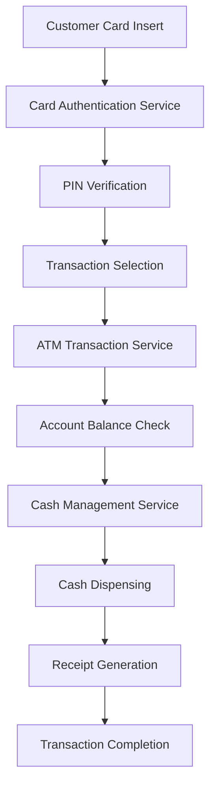

# ATM Subdomain - Payment Systems

## Overview

The ATM (Automated Teller Machine) subdomain manages all ATM-related operations including cash withdrawals, deposits, balance inquiries, and mini-statement generation. This domain ensures secure, reliable, and efficient self-service banking operations across an ATM network.

## Key Components

### Core Services
- **ATM Transaction Service**: Processes withdrawal, deposit, and inquiry transactions
- **Cash Management Service**: Monitors cash levels and dispensing operations
- **Card Authentication Service**: Validates cards and PINs for ATM access
- **Receipt Generation Service**: Creates transaction receipts and mini-statements
- **ATM Monitoring Service**: Real-time monitoring of ATM status and health

### Data Models
- **ATM Device**: Location, status, cash levels, operational capabilities
- **ATM Transaction**: Transaction type, amount, timestamp, customer account
- **Cash Cassette**: Denomination, count, capacity, refill schedules
- **Device Status**: Operational state, error codes, maintenance requirements

## Architecture Patterns

## Transaction Types

### Cash Withdrawal
- Account balance verification
- Daily withdrawal limit enforcement
- Cash availability confirmation
- **Multi-denomination dispensing**: ATM capability to dispense cash using multiple bill denominations (e.g., $100s, $50s, $20s, $10s, $5s) to optimize cash utilization, enhance customer experience with convenient bill combinations, and support flexible withdrawal amounts through intelligent denomination selection algorithms

### Cash Deposit
- Cash counting and validation
- Deposit confirmation processes
- Account crediting procedures
- Receipt generation for deposits

### Balance Inquiry
- Real-time account balance retrieval
- Available balance calculations
- Recent transaction history display
- Account status information

### Mini-Statement
- Last 10 transaction summary
- Current account balance display
- Transaction date and amount details

## Security Features

### Physical Security
- Tamper detection mechanisms
- Surveillance camera integration
- Secure cash storage compartments
- Anti-skimming device protection

### Transaction Security
- Encrypted PIN transmission
- Secure key management
- Transaction encryption protocols
- Fraud detection algorithms

## Operational Management

### Cash Management
- Automated cash level monitoring
- Predictive refill scheduling
- Multi-denomination optimization
- Cash reconciliation processes

### Device Monitoring
- Real-time health status monitoring
- Proactive maintenance scheduling
- Error detection and alerting
- Performance metrics tracking

## Integration Points

- **Debit Card Subdomain**: Account balance verification and fund transfers
- **Credit Card Subdomain**: Cash advance processing
- **Card Issue Operations**: Card activation and status verification
- **Clearing Subdomain**: Transaction settlement and reconciliation

## Network Architecture

### ATM Network Connectivity
- Secure VPN connections to central systems
- Redundant communication channels
- Offline transaction capability
- Network failure recovery procedures

### Communication Protocols
- ISO 8583 message formatting
- TCP/IP secure communications
- SSL/TLS encryption standards
- Message queuing for reliability

## Performance Requirements

- Transaction processing within 10-15 seconds
- 99.5% ATM availability target
- Maximum 30-second cash dispensing time
- Real-time transaction authorization

## Compliance Requirements

- **PCI DSS**: Secure payment processing standards
- **ADA Compliance**: Accessibility requirements for ATM design
- **Banking Regulations**: Cash handling and reporting requirements
- **Security Standards**: Physical and electronic security measures

## Key Metrics

- Transaction success rates by ATM location
- Average transaction completion time
- ATM availability and uptime statistics
- Cash replenishment frequency and costs
- Customer satisfaction scores

## Common Issues and Solutions

### Hardware Issues
- Cash jam resolution procedures
- Card retention protocols
- Receipt printer maintenance
- Network connectivity problems

### Operational Challenges
- Peak usage time management
- Cash forecasting accuracy
- Maintenance scheduling optimization
- Security incident response

## Technology Stack

- Real-time transaction processing systems
- Secure communication protocols
- Robust hardware monitoring tools
- Predictive maintenance algorithms
- Mobile device integration capabilities

## Future Enhancements

- Contactless card and mobile wallet support
- Biometric authentication integration
- Video teller assistance capabilities
- Advanced cash forecasting using AI
- Enhanced accessibility features

## Related Subdomains

- [Debit Card Subdomain](debit-card-subdomain.md)
- [Credit Card Subdomain](credit-card-subdomain.md)
- [Terminal Operations Subdomain](terminal-operations-subdomain.md)
