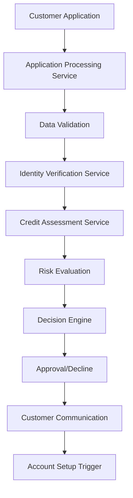

# Card Application Subdomain - Payment Systems

## Overview

The Card Application subdomain manages the complete customer journey from initial card application through approval, verification, and account setup. This domain handles credit assessments, identity verification, regulatory compliance, and seamless customer onboarding experiences.

## Key Components

### Core Services
- **Application Processing Service**: Captures and validates customer application data
- **Credit Assessment Service**: Evaluates creditworthiness and determines approval decisions
- **Identity Verification Service**: Validates customer identity and prevents fraud
- **Document Management Service**: Handles application documents and compliance records
- **Customer Communication Service**: Manages notifications and status updates

### Data Models
- **Card Application**: Personal information, financial data, requested products
- **Credit Report**: Credit history, scores, and bureau information
- **Identity Verification**: KYC documents, verification status, compliance flags
- **Application Decision**: Approval status, credit limits, terms and conditions

## Architecture Patterns

## Application Process Flow

### Pre-Application
- Product information and comparison tools
- Eligibility checkers and pre-qualification
- Marketing campaign tracking
- Customer acquisition analytics

### Application Submission
- Multi-channel application capture (web, mobile, branch)
- Real-time data validation and error handling
- Document upload and verification
- Application progress tracking

### Processing and Decision
- Automated credit scoring and assessment
- Manual underwriting for complex cases
- Compliance and regulatory checks
- Final approval or decline decision

### Post-Decision
- Customer notification and communication
- Account setup and card production initiation
- Welcome package and activation instructions
- Customer service handoff

## Credit Assessment Framework

### Automated Decision Engine
- Credit bureau data integration
- Proprietary scoring models
- Income verification processes
- Debt-to-income ratio calculations

### Risk Categories
- **Prime**: Excellent credit, standard approval
- **Near-Prime**: Good credit, conditional approval
- **Subprime**: Fair credit, higher rates/lower limits
- **Decline**: Poor credit or insufficient information

### Manual Underwriting
- Complex financial situations
- Thin credit files
- High-value applications
- Exception processing

## Identity Verification

### KYC (Know Your Customer) Process
- Government-issued ID verification
- Social Security Number validation
- Address verification services
- Employment and income verification

### Fraud Prevention
- Identity theft detection
- Application fraud screening
- Synthetic identity identification
- Behavioral analysis and anomaly detection

### Compliance Checks
- OFAC (Office of Foreign Assets Control) screening
- PEP (Politically Exposed Persons) identification
- Sanctions and watchlist verification
- Anti-money laundering (AML) compliance

## Integration Points

- **Card Issue Operations**: Account setup and card production
- **Credit Card Subdomain**: Credit line establishment
- **Debit Card Subdomain**: Account linking and setup
- **Customer Service Systems**: Support and inquiry handling

## Application Channels

### Digital Channels
- Online web application portal
- Mobile application with document capture
- Social media and digital advertising integration
- API-based partner integrations

### Traditional Channels
- Branch-based applications
- Paper application processing
- Phone-based applications
- Mail-in applications

## Compliance and Regulatory

### Regulatory Requirements
- **Fair Credit Reporting Act (FCRA)**: Credit report usage and disclosure
- **Equal Credit Opportunity Act (ECOA)**: Non-discriminatory lending practices
- **Truth in Lending Act (TILA)**: Terms and conditions disclosure
- **Bank Secrecy Act**: Customer identification and reporting

### Data Protection
- **PCI DSS**: Secure handling of payment card data
- **GDPR/CCPA**: Data privacy and consumer rights
- **SOX**: Financial reporting and internal controls
- **State Privacy Laws**: Region-specific data protection

## Performance Metrics

### Application Metrics
- Application completion rates by channel
- Time from application to decision
- Approval rates by customer segment
- Application abandonment rates

### Quality Metrics
- Identity verification success rates
- Credit assessment accuracy
- Fraud detection effectiveness
- Customer satisfaction scores

## Technology Stack

### Core Technologies
- Real-time decision engines
- Machine learning for credit scoring
- Document processing and OCR
- API gateway for integrations
- Mobile-responsive web frameworks

### Third-Party Integrations
- Credit bureau APIs (Experian, Equifax, TransUnion)
- Identity verification services
- Income verification platforms
- Fraud detection services
- Communication platforms (SMS, email)

## Customer Experience

### Application Journey
- Intuitive user interface design
- Progress indicators and status updates
- Real-time validation and error messaging
- Mobile-optimized experience
- Accessibility compliance (ADA/WCAG)

### Communication Strategy
- Multi-channel notification preferences
- Transparent status updates
- Clear explanation of decisions
- Next steps and action items
- Customer support availability

## Challenges and Solutions

### Common Challenges
- High application abandonment rates
- Lengthy processing times
- Complex regulatory requirements
- Fraud and identity theft concerns

### Solution Approaches
- Streamlined user experience design
- Automated processing and decision-making
- Comprehensive compliance frameworks
- Advanced fraud detection technologies

## Future Enhancements

- AI-powered credit assessment models
- Biometric identity verification
- Instant approval and virtual card issuance
- Open banking data integration
- Blockchain-based identity verification

## Related Subdomains

- [Card Issue Operations Subdomain](card-issue-operations-subdomain.md)
- [Credit Card Subdomain](credit-card-subdomain.md)
- [Debit Card Subdomain](debit-card-subdomain.md)
