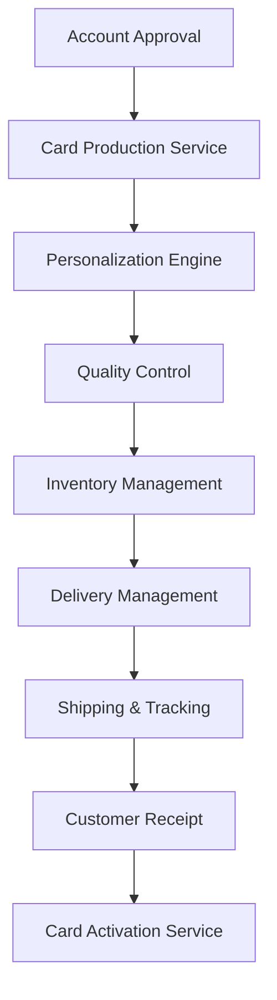

# Card Issue Operations Subdomain - Payment Systems

## Overview

The Card Issue Operations subdomain manages the physical and digital issuance of payment cards, including production, personalization, delivery, activation, and lifecycle management. This domain ensures secure card manufacturing and distribution while maintaining operational efficiency and customer satisfaction.

## Key Components

### Core Services
- **Card Production Service**: Manages card manufacturing and personalization
- **Inventory Management Service**: Tracks card stock levels and production planning
- **Delivery Management Service**: Handles card shipping and delivery tracking
- **Card Activation Service**: Manages card activation and customer verification
- **Card Lifecycle Service**: Handles renewals, replacements, and cancellations

### Data Models
- **Card Order**: Production specifications, personalization data, delivery requirements
- **Card Inventory**: Stock levels, batch information, expiration dates
- **Card Status**: Production status, delivery status, activation status
- **Production Batch**: Manufacturing details, quality control, completion tracking

## Architecture Patterns

## Card Production Process

### Manufacturing Pipeline
- **Blank Card Production**: Base card manufacturing with security features
- **Personalization**: Customer name, account number, expiry date printing
- **Chip Programming**: EMV chip initialization and key injection
- **Magnetic Stripe Encoding**: Account data encoding for legacy systems
- **Security Features**: Hologram application, signature panels

### Quality Control
- Visual inspection protocols
- Functional testing procedures
- Security feature validation
- Data accuracy verification
- Batch quality assurance

## Card Types and Specifications

### Credit Cards
- Standard credit card specifications
- Premium card materials and designs
- Contactless payment capabilities
- Security chip and magnetic stripe

### Debit Cards
- Standard debit card specifications
- EMV chip technology
- ATM and POS functionality
- PIN-based authentication

### Prepaid Cards
- Gift card variations
- Reloadable prepaid cards
- Corporate expense cards
- Government benefit cards

## Personalization Services

### Standard Personalization
- Cardholder name embossing/printing
- 16-digit card number assignment
- Expiry date calculation and printing
- CVV/CVC generation and printing

### Enhanced Personalization
- Custom card designs and branding
- Photo personalization capabilities
- Multi-language support
- Special characters and symbols

### Digital Elements
- Mobile wallet provisioning
- Digital card creation
- Virtual card number generation
- Instant issuance capabilities

## Delivery and Logistics

### Delivery Methods
- Standard mail delivery (5-7 business days)
- Expedited shipping options (1-3 business days)
- Branch pickup services
- Secure courier delivery for premium cards

### Tracking and Monitoring
- Real-time delivery status updates
- Customer notification systems
- Delivery confirmation and proof
- Failed delivery management

### Security Measures
- Tamper-evident packaging
- Delivery address verification
- Signature requirements for premium cards
- Secure destruction of undelivered cards

## Card Activation Process

### Activation Methods
- Phone-based activation with IVR system
- Online web portal activation
- Mobile app activation
- ATM-based activation
- Branch-assisted activation

### Verification Procedures
- Customer identity verification
- Account information validation
- PIN setup and confirmation
- Security question establishment
- Terms and conditions acceptance

## Inventory Management

### Stock Management
- Raw material inventory tracking
- Finished goods inventory control
- Expiry date management
- Demand forecasting and planning

### Production Planning
- Batch size optimization
- Production scheduling
- Resource allocation
- Capacity planning

### Waste Management
- Defective card handling
- Secure destruction processes
- Environmental compliance
- Cost optimization

## Integration Points

- **Card Application Subdomain**: New card orders and specifications
- **Credit/Debit Card Subdomains**: Account setup and linking
- **Customer Service Systems**: Status inquiries and issue resolution
- **Fraud Management**: Suspicious activity and card blocking

## Security and Compliance

### Manufacturing Security
- Secure facility access controls
- Employee background checks
- Production environment monitoring
- Chain of custody procedures

### Data Security
- Encryption of personalization data
- Secure key management systems
- PCI DSS compliance
- Data retention and disposal policies

### Regulatory Compliance
- Payment card industry standards
- International shipping regulations
- Data protection and privacy laws
- Environmental regulations

## Performance Metrics

### Production Metrics
- Cards produced per day/week/month
- Production quality rates
- Personalization accuracy rates
- Manufacturing defect rates

### Delivery Metrics
- On-time delivery performance
- Delivery success rates
- Customer satisfaction with delivery
- Average delivery times by region

### Activation Metrics
- Card activation rates
- Time from delivery to activation
- Activation method preferences
- Customer support interactions

## Technology Infrastructure

### Production Systems
- Card personalization equipment
- Quality control systems
- Inventory management systems
- Production planning software

### Integration Systems
- ERP system integration
- Shipping partner APIs
- Customer notification systems
- Tracking and monitoring platforms

## Challenges and Solutions

### Operational Challenges
- Production capacity constraints
- Quality control consistency
- Delivery logistics complexity
- Technology obsolescence

### Solution Strategies
- Automated production processes
- Statistical quality control methods
- Partner network optimization
- Technology refresh programs

## Future Enhancements

- Instant digital card issuance
- Biometric card technology
- Sustainable card materials
- AI-powered quality control
- Blockchain-based authentication

## Related Subdomains

- [Card Application Subdomain](card-application-subdomain.md)
- [Terminal Operations Subdomain](terminal-operations-subdomain.md)
- [Credit Card Subdomain](credit-card-subdomain.md)
