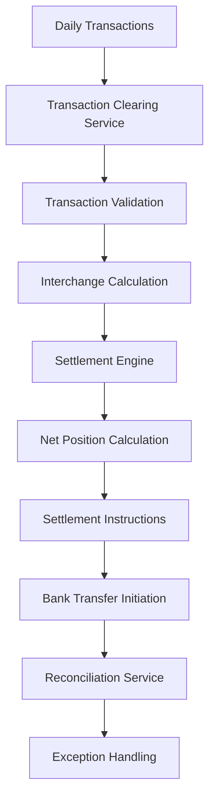

# Clearing Subdomain - Payment Systems

## Overview

The Clearing subdomain manages the settlement and reconciliation of payment transactions between financial institutions, merchants, and cardholders. This domain ensures accurate fund transfers, transaction matching, and regulatory compliance in the payment ecosystem's back-office operations.

## Key Components

### Core Services
- **Transaction Clearing Service**: Processes and routes transactions for settlement
- **Settlement Engine**: Calculates net positions and initiates fund transfers
- **Reconciliation Service**: Matches transactions across multiple systems
- **Dispute Management Service**: Handles chargebacks and transaction disputes
- **Reporting Service**: Generates regulatory and operational reports

### Data Models
- **Clearing Transaction**: Transaction details, routing information, settlement status
- **Settlement Batch**: Aggregated transactions, net amounts, settlement instructions
- **Reconciliation Record**: Transaction matching status, discrepancies, adjustments
- **Dispute Case**: Chargeback details, reason codes, resolution status

## Architecture Patterns

## Clearing Process Flow

### Transaction Collection
- Daily transaction file generation
- Multi-format data ingestion (ISO 8583, CSV, XML)
- Transaction validation and formatting
- Duplicate detection and handling
- Data quality checks and corrections

### Interchange Processing
- Interchange fee calculations
- Network assessment fees
- Merchant discount rate applications
- Currency conversion (for international transactions)
- Tax and regulatory fee computations

### Settlement Preparation
- Net position calculations by institution
- Settlement instruction generation
- Risk assessment and exposure monitoring
- Settlement timing optimization
- Liquidity management coordination

### Fund Transfer Execution
- ACH and wire transfer initiation
- Real-time gross settlement (RTGS) processing
- Cross-border payment handling
- Settlement confirmation and tracking
- Failed settlement recovery procedures

## Settlement Models

### Gross Settlement
- Individual transaction settlement
- Real-time fund transfers
- Higher liquidity requirements
- Immediate finality
- Lower counterparty risk

### Net Settlement
- Batch processing of multiple transactions
- Reduced fund transfer volumes
- Lower operational costs
- End-of-day or periodic settlement
- Multilateral netting benefits

### Hybrid Models
- Real-time for high-value transactions
- Batch processing for retail payments
- Risk-based settlement decisions
- Flexible timing options
- Optimized liquidity usage

## Reconciliation Framework

### Transaction Matching
- Automated matching algorithms
- Multi-criteria matching rules
- Exception identification and routing
- Manual review processes
- Match rate optimization

### Discrepancy Resolution
- Root cause analysis
- Systematic error correction
- Exception escalation procedures
- Adjustment processing
- Audit trail maintenance

### Reporting and Analytics
- Daily reconciliation reports
- Exception analysis and trends
- Performance metrics tracking
- Regulatory reporting compliance
- Management dashboard analytics

## Dispute Management

### Chargeback Processing
- Reason code classification
- Timeline management
- Evidence collection and review
- Response preparation and submission
- Outcome tracking and analysis

### Representment Handling
- Dispute response preparation
- Supporting documentation compilation
- Submission to card networks
- Follow-up and status tracking
- Win/loss analysis and optimization

### Pre-arbitration and Arbitration
- Case escalation procedures
- Evidence preparation for arbitration
- Network arbitration process management
- Decision implementation
- Cost allocation and recovery

## Integration Points

- **Credit/Debit Card Subdomains**: Transaction data feeds
- **Merchant Subdomain**: Settlement and fee calculations
- **ATM Subdomain**: ATM transaction settlement
- **External Networks**: Visa, MasterCard, ACH networks

## Regulatory Compliance

### Financial Regulations
- **Regulation E**: Electronic fund transfer rules
- **Regulation Z**: Credit card transaction regulations
- **Dodd-Frank Act**: Interchange fee regulations
- **Basel III**: Capital and liquidity requirements

### Reporting Requirements
- **Bank Secrecy Act**: Large transaction reporting
- **OFAC**: Sanctions screening and reporting
- **FinCEN**: Suspicious activity reporting
- **Card Network Rules**: Compliance with network regulations

### International Standards
- **ISO 20022**: Financial messaging standards
- **SWIFT**: International payment messaging
- **PCI DSS**: Data security in payment processing
- **AML/KYC**: Anti-money laundering compliance

## Risk Management

### Settlement Risk
- Counterparty risk assessment
- Exposure limit monitoring
- Collateral management
- Default procedures
- Recovery and resolution planning

### Operational Risk
- System failure contingencies
- Data integrity controls
- Processing error prevention
- Fraud detection and prevention
- Business continuity planning

### Liquidity Risk
- Cash flow forecasting
- Funding source diversification
- Intraday liquidity management
- Stress testing scenarios
- Emergency funding procedures

## Technology Infrastructure

### Core Systems
- High-performance transaction processing
- Real-time settlement engines
- Automated reconciliation platforms
- Enterprise data warehouses
- Business intelligence and analytics

### Integration Technologies
- Message queuing systems
- API gateways and management
- ETL and data integration tools
- Real-time streaming platforms
- Microservices architecture

### Security Technologies
- End-to-end encryption
- Digital signatures and certificates
- Access control and authentication
- Audit logging and monitoring
- Intrusion detection systems

## Performance Metrics

### Processing Metrics
- Daily transaction volumes
- Processing accuracy rates
- Settlement timeliness
- System availability and uptime
- Error rates and resolution times

### Financial Metrics
- Net settlement amounts
- Interchange revenue
- Operating cost ratios
- Risk-adjusted returns
- Liquidity utilization efficiency

### Quality Metrics
- Reconciliation match rates
- Dispute win rates
- Customer satisfaction scores
- Regulatory compliance ratings
- Audit findings and resolutions

## Challenges and Solutions

### Common Challenges
- High transaction volumes and complexity
- Multiple data formats and standards
- Regulatory compliance complexity
- Real-time processing requirements
- Cross-border payment complications

### Solution Approaches
- Scalable cloud-based architectures
- Standardized data processing pipelines
- Automated compliance monitoring
- Event-driven processing models
- Partnership with global payment networks

## Future Enhancements

- Real-time settlement capabilities
- Blockchain-based clearing systems
- AI-powered reconciliation engines
- Central bank digital currency (CBDC) integration
- Enhanced cross-border payment solutions

## Related Subdomains

- [Merchant Subdomain](merchant-subdomain.md)
- [Credit Card Subdomain](credit-card-subdomain.md)
- [Debit Card Subdomain](debit-card-subdomain.md)
