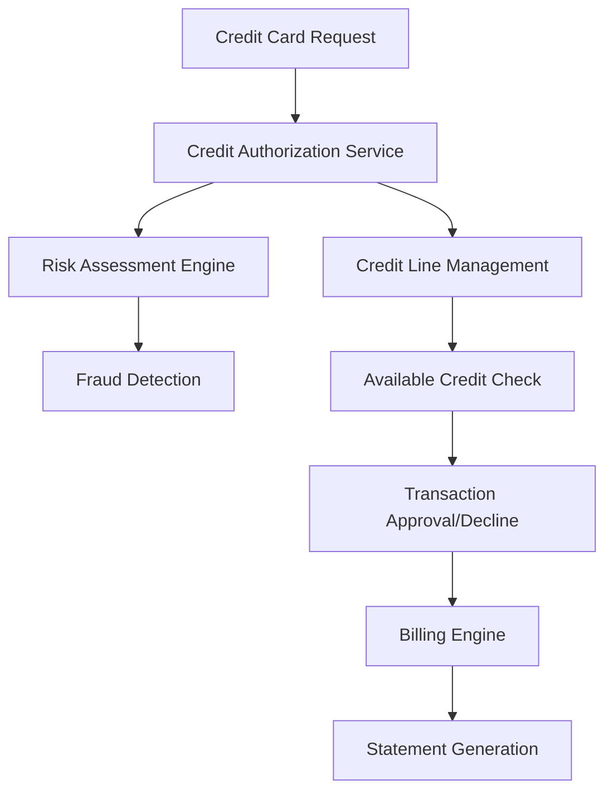

# Credit Card Subdomain - Payment Systems

## Overview

The Credit Card subdomain manages the complete lifecycle of credit card operations within a payment ecosystem. This domain handles credit line management, transaction authorization, billing cycles, and credit risk assessment.

## Key Components

### Core Services
- **Credit Authorization Service**: Real-time credit limit verification and transaction approval
- **Credit Line Management**: Credit limit adjustments, increases, and decreases
- **Billing Engine**: Monthly statement generation and payment processing
- **Interest Calculation Service**: APR calculations, late fees, and penalty assessments
- **Risk Assessment Engine**: Credit scoring and fraud detection for credit transactions

### Data Models
- **Credit Account**: Account holder information, credit limits, balances
- **Credit Transaction**: Purchase details, authorization codes, merchant information
- **Billing Statement**: Monthly charges, payments, interest calculations
- **Credit History**: Payment history, credit utilization patterns

## Architecture Patterns

## Business Rules

### Authorization Rules
- Credit limit validation against available balance
- Merchant category code restrictions
- Geographic spending controls
- Daily/monthly spending limits

### Billing Rules
- Monthly statement generation on cycle dates
- Minimum payment calculations
- Interest rate application on outstanding balances
- Late payment fee assessments

## Integration Points

- **ATM Subdomain**: Cash advance transactions
- **Merchant Subdomain**: Point-of-sale transaction processing
- **Clearing Subdomain**: Settlement and reconciliation
- **Card Issue Operations**: Account setup and card delivery

## Compliance Requirements

- **PCI DSS**: Secure handling of cardholder data
- **Regulation Z**: Truth in Lending Act compliance
- **Fair Credit Reporting Act**: Credit bureau reporting
- **Anti-Money Laundering (AML)**: Transaction monitoring

## Key Metrics

- Transaction approval rates
- Average authorization response time
- Credit utilization ratios
- Default rates and charge-offs
- Customer acquisition costs

## Technology Stack Considerations

- High-availability transaction processing
- Real-time fraud detection capabilities
- Secure data encryption for cardholder information
- Scalable billing and statement generation
- Integration with external credit bureaus

## Future Enhancements

- AI-powered spending insights
- Real-time credit limit adjustments
- Enhanced fraud detection algorithms
- Mobile-first account management
- Cryptocurrency integration considerations

## Related Subdomains

- [Debit Card Subdomain](debit-card-subdomain.md)
- [Merchant Subdomain](merchant-subdomain.md)
- [Clearing Subdomain](clearing-subdomain.md)
