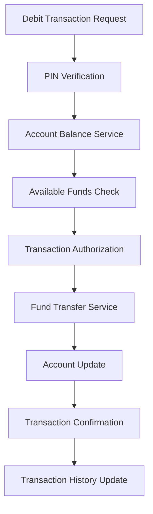

# Debit Card Subdomain - Payment Systems

## Overview

The Debit Card subdomain manages debit card transactions, account balance verification, and real-time fund transfers within a payment ecosystem. This domain ensures immediate debiting of customer accounts while maintaining transaction integrity and security.

## Key Components

### Core Services
- **Account Balance Service**: Real-time balance checking and hold management
- **Transaction Authorization Service**: PIN verification and transaction approval
- **Fund Transfer Service**: Immediate account debiting and crediting
- **Transaction History Service**: Real-time transaction logging and retrieval
- **Account Overdraft Service**: Overdraft protection and fee management

### Data Models
- **Debit Account**: Account holder information, current balance, overdraft settings
- **Debit Transaction**: Transaction details, timestamps, authorization status
- **Account Hold**: Temporary holds for pending transactions
- **Transaction Log**: Comprehensive audit trail of all account activities

## Architecture Patterns

## Business Rules

### Authorization Rules
- Sufficient balance verification before transaction approval
- PIN validation and retry limits
- Daily withdrawal limits enforcement
- Account status verification (active, frozen, closed)

### Transaction Processing
- Real-time fund deduction from customer accounts
- Immediate transaction confirmation or decline
- Overdraft handling based on customer preferences
- Transaction reversal capabilities for failed transactions

## Integration Points

- **ATM Subdomain**: Cash withdrawal and deposit transactions
- **Merchant Subdomain**: Point-of-sale debit transactions
- **Clearing Subdomain**: Settlement and reconciliation processes
- **Card Issue Operations**: Debit card activation and management

## Security Features

- **PIN Encryption**: Secure PIN transmission and storage
- **Chip and PIN Technology**: EMV compliance for enhanced security
- **Fraud Detection**: Real-time transaction monitoring for suspicious activity
- **Account Lockout**: Automatic account protection after failed attempts

## Performance Requirements

- Transaction authorization within 2-3 seconds
- 99.9% system availability
- Real-time balance updates across all channels
- Concurrent transaction handling capabilities

## Compliance Requirements

- **PCI DSS**: Secure payment card processing
- **Regulation E**: Electronic fund transfer protections
- **Bank Secrecy Act**: Transaction reporting requirements
- **Know Your Customer (KYC)**: Customer identification procedures

## Key Metrics

- Transaction success rates
- Average authorization response time
- Account balance accuracy
- Customer dispute resolution time
- System availability and uptime

## Technology Considerations

- High-performance transaction processing engines
- Real-time database synchronization
- Secure communication protocols
- Load balancing for peak transaction volumes
- Disaster recovery and business continuity

## Common Challenges

- Network connectivity issues during transactions
- Balance synchronization across multiple channels
- Handling of duplicate transaction requests
- Managing peak transaction volumes
- Ensuring data consistency in distributed systems

## Future Enhancements

- Contactless payment capabilities
- Biometric authentication integration
- Real-time spending notifications
- Advanced fraud detection using machine learning
- Integration with digital wallet platforms

## Related Subdomains

- [Credit Card Subdomain](credit-card-subdomain.md)
- [ATM Subdomain](atm-subdomain.md)
- [Merchant Subdomain](merchant-subdomain.md)
