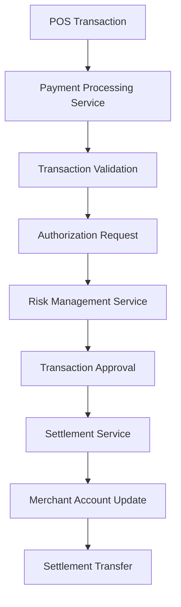

# Merchant Subdomain - Payment Systems

## Overview

The Merchant subdomain manages all merchant-related operations including merchant onboarding, payment processing, settlement, and relationship management. This domain serves as the bridge between merchants and the payment ecosystem, ensuring efficient transaction processing and business growth.

## Key Components

### Core Services
- **Merchant Onboarding Service**: New merchant registration and verification
- **Payment Processing Service**: Real-time transaction authorization and processing
- **Settlement Service**: Daily/batch settlement calculations and transfers
- **Merchant Portal Service**: Self-service merchant management platform
- **Risk Management Service**: Merchant risk assessment and monitoring

### Data Models
- **Merchant Profile**: Business information, contact details, banking information
- **Merchant Transaction**: Sales data, transaction amounts, processing fees
- **Settlement Record**: Daily settlement amounts, fees, net transfers
- **Risk Assessment**: Credit scores, transaction patterns, compliance status

## Architecture Patterns

## Business Processes

### Merchant Onboarding
- Business verification and documentation
- Risk assessment and underwriting
- Pricing and fee structure setup
- Terminal and integration configuration
- Account activation and testing

### Transaction Processing
- Real-time payment authorization
- Transaction routing and switching
- Fee calculation and application
- Chargeback and dispute handling
- Refund and void processing

### Settlement Operations
- Daily transaction aggregation
- Fee and reserve calculations
- Net settlement amount determination
- Bank transfer initiation
- Settlement reporting and reconciliation

## Integration Points

- **Credit Card Subdomain**: Credit card transaction processing
- **Debit Card Subdomain**: Debit card payment handling
- **Terminal Operations**: POS terminal management and support
- **Clearing Subdomain**: Inter-bank settlement and clearing

## Merchant Categories

### Retail Merchants
- Physical point-of-sale locations
- In-person card-present transactions
- Inventory management integration
- Customer loyalty program support

### E-commerce Merchants
- Online payment gateway integration
- Card-not-present transaction processing
- Fraud detection and prevention
- Digital receipt and confirmation systems

### Mobile Merchants
- Mobile payment solutions
- Location-based services
- Quick payment processing
- Offline transaction capabilities

## Risk Management

### Merchant Risk Assessment
- Business type and industry analysis
- Financial stability evaluation
- Transaction volume projections
- Compliance and regulatory checks

### Ongoing Monitoring
- Transaction pattern analysis
- Chargeback ratio monitoring
- Compliance status tracking
- Financial performance review

## Fee Structure

### Transaction Fees
- Interchange fee pass-through
- Processing markup fees
- Network assessment fees
- Monthly service charges

### Additional Services
- Terminal rental or purchase
- PCI compliance services
- Fraud protection services
- Reporting and analytics tools

## Compliance Requirements

- **PCI DSS**: Payment card industry security standards
- **KYC/AML**: Know Your Customer and Anti-Money Laundering
- **SOX**: Sarbanes-Oxley financial reporting requirements
- **GDPR**: Data protection and privacy regulations

## Technology Integration

### Payment Gateway APIs
- RESTful API endpoints
- Real-time transaction processing
- Webhook notifications
- Comprehensive error handling

### POS Integration
- Terminal certification programs
- Software development kits (SDKs)
- Plugin architectures
- Cloud-based solutions

## Performance Metrics

- Transaction authorization success rates
- Average transaction processing time
- Merchant satisfaction scores
- Settlement accuracy and timeliness
- System availability and uptime

## Customer Support

### Merchant Support Services
- 24/7 technical support hotline
- Online help desk and ticketing
- Training and onboarding assistance
- Account management services

### Self-Service Tools
- Merchant portal dashboard
- Real-time transaction reporting
- Settlement and fee statements
- Dispute management tools

## Challenges and Solutions

### Common Challenges
- High chargeback ratios
- Fraud and security threats
- Regulatory compliance complexity
- Integration technical difficulties

### Mitigation Strategies
- Advanced fraud detection systems
- Comprehensive merchant education
- Proactive compliance monitoring
- Dedicated technical integration support

## Future Enhancements

- AI-powered risk assessment
- Real-time settlement capabilities
- Advanced analytics and reporting
- Blockchain integration exploration
- Enhanced mobile payment solutions

## Related Subdomains

- [Terminal Operations Subdomain](terminal-operations-subdomain.md)
- [Clearing Subdomain](clearing-subdomain.md)
- [Card Issue Operations Subdomain](card-issue-operations-subdomain.md)
