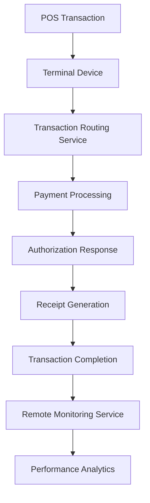

# Terminal Operations Subdomain - Payment Systems

## Overview

The Terminal Operations subdomain manages the deployment, configuration, monitoring, and maintenance of payment terminals across merchant locations. This domain ensures reliable point-of-sale (POS) operations, seamless transaction processing, and comprehensive terminal lifecycle management.

## Key Components

### Core Services
- **Terminal Management Service**: Configuration, deployment, and lifecycle management
- **Remote Monitoring Service**: Real-time terminal health and performance monitoring
- **Software Update Service**: Firmware and application updates distribution
- **Transaction Routing Service**: Payment processing and network routing
- **Support and Maintenance Service**: Technical support and field service coordination

### Data Models
- **Terminal Device**: Hardware specifications, location, configuration settings
- **Terminal Status**: Operational state, connectivity, transaction capabilities
- **Software Version**: Firmware, applications, security patches, update history
- **Transaction Log**: Terminal-specific transaction history and performance metrics

## Architecture Patterns

## Terminal Types and Capabilities

### Traditional POS Terminals
- Countertop payment terminals
- PIN pad integration
- Receipt printer capabilities
- Magnetic stripe and chip readers
- Contactless payment support

### Mobile Payment Devices
- Portable payment solutions
- Bluetooth and Wi-Fi connectivity
- Battery-powered operations
- Smartphone/tablet integration
- Cloud-based processing

### Integrated POS Systems
- All-in-one terminal solutions
- Touchscreen interfaces
- Inventory management integration
- Customer display screens
- Advanced reporting capabilities

### Self-Service Kiosks
- Unattended payment processing
- Customer-operated interfaces
- Multi-payment method support
- Receipt and change dispensing
- Security monitoring features

## Terminal Deployment Process

### Pre-Deployment
- Site survey and requirements analysis
- Network connectivity assessment
- Hardware selection and configuration
- Merchant training preparation
- Installation scheduling

### Installation and Setup
- Physical terminal installation
- Network configuration and testing
- Software installation and updates
- Payment processing configuration
- User acceptance testing

### Go-Live Support
- Initial transaction testing
- Merchant training delivery
- Technical support availability
- Performance monitoring activation
- Issue resolution protocols

## Remote Management Capabilities

### Configuration Management
- Remote parameter updates
- Transaction routing configuration
- Security settings management
- Display and interface customization
- Network connectivity settings

### Software Distribution
- Automated firmware updates
- Application deployment
- Security patch management
- Feature rollouts and rollbacks
- Version control and tracking

### Monitoring and Diagnostics
- Real-time health monitoring
- Performance metrics collection
- Error detection and alerting
- Predictive maintenance indicators
- Usage analytics and reporting

## Transaction Processing

### Payment Methods Support
- Credit and debit card processing
- Contactless payments (NFC)
- Mobile wallet integration
- Gift card and loyalty card processing
- Alternative payment methods

### Transaction Flow
- Card reading and validation
- PIN entry and verification
- Transaction authorization requests
- Response processing and display
- Receipt generation and printing

### Security Features
- End-to-end encryption (E2EE)
- Point-to-point encryption (P2PE)
- EMV chip and PIN support
- Tokenization capabilities
- PCI PTS validation

## Network Infrastructure

### Connectivity Options
- Ethernet/broadband connections
- Dial-up backup connections
- Wireless (Wi-Fi) connectivity
- Cellular/mobile data connections
- Satellite communications (remote areas)

### Network Security
- VPN tunnel establishment
- SSL/TLS encryption protocols
- Firewall configuration
- Intrusion detection systems
- Network access control

### Redundancy and Failover
- Multiple connection methods
- Automatic failover capabilities
- Offline transaction processing
- Store-and-forward mechanisms
- Network monitoring and recovery

## Integration Points

- **Merchant Subdomain**: Merchant account management and settlement
- **Credit/Debit Card Subdomains**: Transaction authorization and processing
- **ATM Subdomain**: Shared infrastructure and security protocols
- **Clearing Subdomain**: Transaction settlement and reconciliation

## Maintenance and Support

### Preventive Maintenance
- Regular health checks and diagnostics
- Software update scheduling
- Hardware inspection protocols
- Performance optimization
- Security assessment and updates

### Reactive Support
- 24/7 technical support hotline
- Remote troubleshooting capabilities
- Field service dispatch coordination
- Hardware replacement procedures
- Emergency response protocols

### Performance Optimization
- Transaction speed improvements
- Network latency reduction
- User interface enhancements
- Battery life optimization
- Memory and storage management

## Compliance and Security

### Industry Standards
- **PCI PTS**: Payment Card Industry PIN Transaction Security
- **EMV**: Europay, MasterCard, and Visa chip specifications
- **PCI DSS**: Data security standards compliance
- **FIPS 140-2**: Cryptographic module validation

### Security Measures
- Tamper detection and response
- Secure key management
- Certificate-based authentication
- Audit logging and monitoring
- Physical security assessments

## Performance Metrics

### Operational Metrics
- Terminal uptime and availability
- Transaction success rates
- Average transaction processing time
- Network connectivity reliability
- Customer satisfaction scores

### Technical Metrics
- Software update success rates
- Remote monitoring effectiveness
- Support ticket resolution times
- Hardware failure rates
- Security incident frequency

## Technology Trends

### Current Technologies
- Android-based POS systems
- Cloud-based terminal management
- AI-powered fraud detection
- Biometric authentication
- Blockchain integration

### Emerging Trends
- IoT-enabled smart terminals
- Augmented reality interfaces
- Voice-activated payments
- Cryptocurrency support
- Quantum-resistant encryption

## Challenges and Solutions

### Common Challenges
- Network connectivity issues
- Hardware compatibility problems
- Software update failures
- Security vulnerability management
- Merchant adoption resistance

### Solution Strategies
- Redundant connectivity options
- Standardized hardware platforms
- Automated rollback mechanisms
- Proactive security monitoring
- Comprehensive training programs

## Future Roadmap

- Next-generation payment terminals
- Enhanced mobile payment solutions
- Advanced analytics and reporting
- Improved security technologies
- Sustainable and eco-friendly designs

## Related Subdomains

- [Merchant Subdomain](merchant-subdomain.md)
- [ATM Subdomain](atm-subdomain.md)
- [Card Issue Operations Subdomain](card-issue-operations-subdomain.md)
