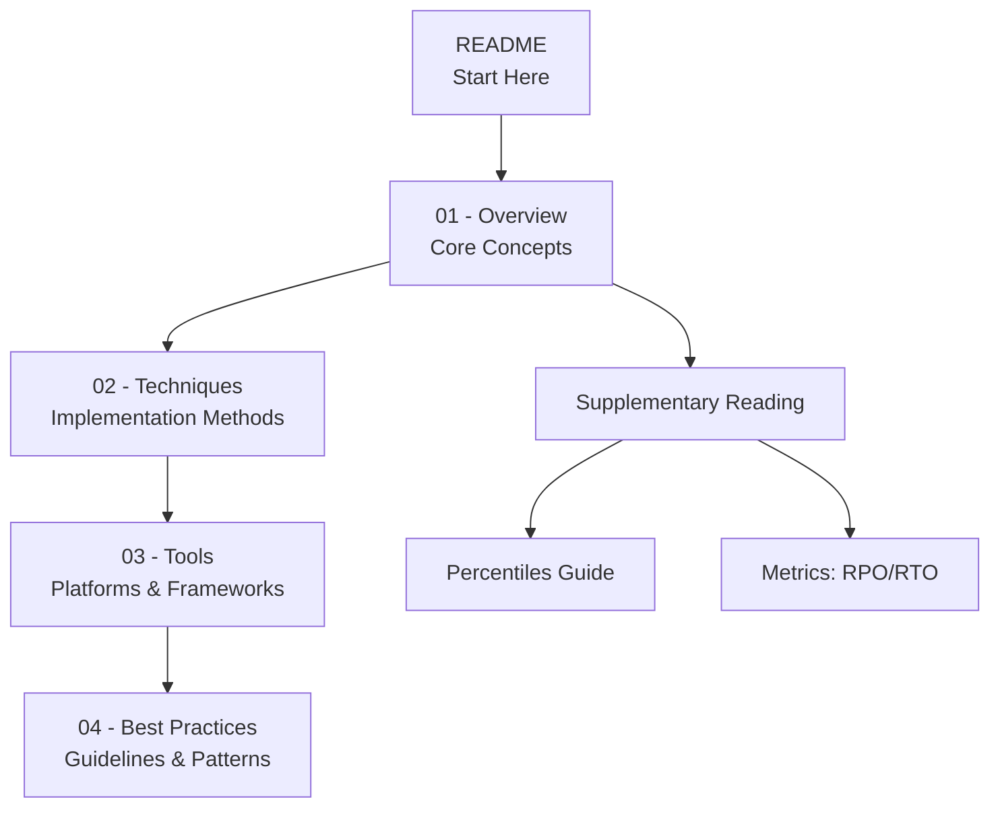

# Observability Documentation

## Introduction

Welcome to the **Observability** documentation section. This guide provides comprehensive coverage of observability concepts, techniques, tools, and best practices for building and operating reliable distributed systems.

**Observability** is the ability to understand the internal state of a system by examining its external outputs. It enables teams to diagnose issues, understand system behavior, and optimize performance—especially in complex, distributed architectures where traditional debugging is impractical.

## Why Observability Matters

In modern distributed systems:

- **Microservices** create complex interdependencies
- **Cloud infrastructure** introduces dynamic and ephemeral components
- **User expectations** demand high availability and performance
- **Failures** are inevitable—understanding them quickly is critical

Observability transforms operations from reactive firefighting to proactive system understanding.

## Learning Path

This documentation is organized as a progressive learning journey. Follow the recommended reading order:

## Documentation Structure

### Core Documents (Recommended Order)

| Order | Document | Description |
|-------|----------|-------------|
| 1 | [01-observability-overview.md](01-observability-overview.md) | Foundation concepts: three pillars (metrics, logs, traces), monitoring vs. observability, and core principles |
| 2 | [02-observability-techniques.md](02-observability-techniques.md) | Deep dive into distributed tracing, log aggregation, metric collection, and correlation strategies |
| 3 | [03-observability-tools.md](03-observability-tools.md) | Tools and platforms: OpenTelemetry, Prometheus, Grafana, Jaeger, and cloud-native solutions |
| 4 | [04-best-practices.md](04-best-practices.md) | Production-ready guidelines: instrumentation patterns, alerting strategies, and operational excellence |

### Supplementary Reading

| Document | Description |
|----------|-------------|
| [percentiles-in-software-architecture.md](percentiles-in-software-architecture.md) | Understanding percentiles (P50, P95, P99) for performance measurement, SLAs, and alerting |
| [metrics/rpo-rto-overview.md](metrics/rpo-rto-overview.md) | Recovery metrics: RPO and RTO for disaster recovery and business continuity planning |

## Quick Reference: The Three Pillars

| Pillar | Purpose | Example |
|--------|---------|---------|
| **Metrics** 📊 | Numerical measurements over time | CPU: 75%, Error rate: 0.5%, P99 latency: 250ms |
| **Logs** 📝 | Discrete events with context | `ERROR: Payment failed for user-123, reason: insufficient_funds` |
| **Traces** 🔗 | Request flow across services | Request → API Gateway → Auth Service → Payment Service → Database |

## Key Concepts You'll Learn

### In the Overview Document
- Monitoring vs. Observability distinction
- High cardinality data and correlation
- The three pillars: Metrics, Logs, and Traces
- When to use each pillar

### In the Techniques Document
- Distributed tracing with trace context propagation
- Log aggregation and structured logging
- Metric collection strategies
- Context correlation across services

### In the Tools Document
- OpenTelemetry framework and instrumentation
- Prometheus for metrics collection
- Grafana for visualization
- Jaeger and Zipkin for distributed tracing
- Cloud provider observability solutions

### In the Best Practices Document
- Instrumentation strategies
- Effective alerting and on-call practices
- Dashboard design principles
- Cost optimization for telemetry data
- Observability-driven development

## Related Documentation

- [Reliability and Operations Patterns](../reliability-performance-operations-patterns.md) - Broader reliability concepts
- [Azure Monitor Documentation](../../../architecture-azure/observability/) - Azure-specific observability implementations

## Getting Started

**New to observability?** Start with [01-observability-overview.md](01-observability-overview.md) to build a strong foundation.

**Already familiar with basics?** Jump to [02-observability-techniques.md](02-observability-techniques.md) for implementation details.

**Looking for tooling guidance?** Head to [03-observability-tools.md](03-observability-tools.md) for platform comparisons.

**Ready for production?** Review [04-best-practices.md](04-best-practices.md) for operational excellence.

---

> 💡 **Tip**: Observability is a journey, not a destination. Start with basic instrumentation and progressively enhance your observability posture as your system matures.
