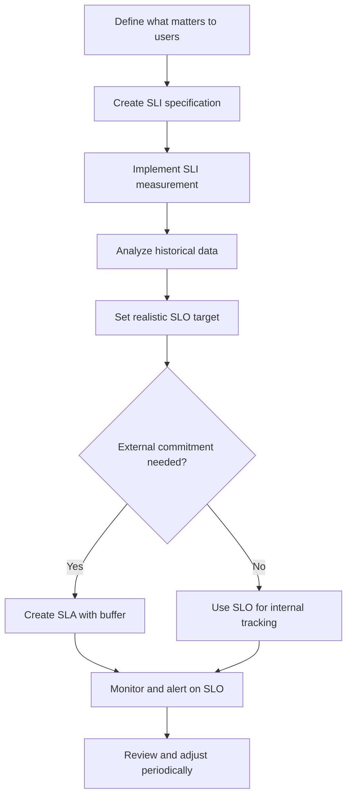

# SLI, SLO, and SLA: Service Level Metrics

## Table of Contents

- [Overview](#overview)
- [Service Level Indicator (SLI)](#service-level-indicator-sli)
- [Service Level Objective (SLO)](#service-level-objective-slo)
- [Service Level Agreement (SLA)](#service-level-agreement-sla)
  - [Understanding Service Credits](#understanding-service-credits)
- [The Hierarchy Relationship](#the-hierarchy-relationship)
- [Common SLI Categories](#common-sli-categories)
- [Setting Effective SLOs](#setting-effective-slos)
- [SLA Best Practices](#sla-best-practices)
- [Implementation Examples](#implementation-examples)
- [Anti-Patterns to Avoid](#anti-patterns-to-avoid)
- [Tools and Monitoring](#tools-and-monitoring)

---

## Overview

SLI, SLO, and SLA form the foundation of **Service Level Management** in Site Reliability Engineering (SRE). They provide a structured approach to defining, measuring, and communicating service reliability.

```
┌─────────────────────────────────────────────────────────────────┐
│                         SLA                                      │
│  ┌───────────────────────────────────────────────────────────┐  │
│  │                       SLO                                  │  │
│  │  ┌─────────────────────────────────────────────────────┐  │  │
│  │  │                     SLI                              │  │  │
│  │  │              (What you measure)                      │  │  │
│  │  └─────────────────────────────────────────────────────┘  │  │
│  │                  (Your internal target)                    │  │
│  └───────────────────────────────────────────────────────────┘  │
│                (Your external commitment)                        │
└─────────────────────────────────────────────────────────────────┘
```

| Term | Definition | Audience |
|------|------------|----------|
| **SLI** | A quantitative measure of service behavior | Engineering teams |
| **SLO** | A target value or range for an SLI | Engineering & Product |
| **SLA** | A contract defining consequences for missing SLOs | Business & Customers |

---

## Service Level Indicator (SLI)

### Definition

An **SLI** (Service Level Indicator) is a carefully defined quantitative measure of some aspect of the level of service being provided.

### Characteristics of Good SLIs

1. **Measurable**: Can be quantified objectively
2. **User-centric**: Reflects what users actually experience
3. **Meaningful**: Indicates service health that matters
4. **Actionable**: Deviations can be investigated and fixed

### SLI Formula

Most SLIs are expressed as a ratio:

```
         Good Events
SLI = ─────────────────── × 100%
        Total Events
```

### Common SLI Types

| SLI Type | Formula | Example |
|----------|---------|---------|
| **Availability** | Successful requests / Total requests | 99.95% |
| **Latency** | Requests < threshold / Total requests | 95% of requests < 200ms |
| **Throughput** | Successful operations / Time period | 10,000 req/sec |
| **Error Rate** | Failed requests / Total requests | 0.1% errors |
| **Quality** | Correct responses / Total responses | 99.9% accurate |

### SLI Specification vs. Implementation

| Aspect | SLI Specification | SLI Implementation |
|--------|-------------------|-------------------|
| Focus | What to measure | How to measure it |
| Example | "Proportion of requests served successfully" | "HTTP 200 responses / All HTTP responses measured at load balancer" |
| Stability | Rarely changes | May evolve with infrastructure |

---

## Service Level Objective (SLO)

### Definition

An **SLO** (Service Level Objective) is a target value or range of values for a service level that is measured by an SLI.

### SLO Structure

```
SLO = SLI + Target + Time Window

Example:
"99.9% of HTTP requests will complete successfully over a 30-day rolling window"
```

### Components of an SLO

| Component | Description | Example |
|-----------|-------------|---------|
| **SLI** | The metric being measured | Request success rate |
| **Target** | The threshold to achieve | 99.9% |
| **Time Window** | Period over which SLI is measured | 30-day rolling window |
| **Measurement Location** | Where the SLI is captured | At the load balancer |

### Choosing SLO Targets

| Target | Downtime/Month | Use Case |
|--------|----------------|----------|
| 99% | 7.3 hours | Internal tools, batch systems |
| 99.5% | 3.6 hours | Business applications |
| 99.9% | 43.8 minutes | Customer-facing services |
| 99.95% | 21.9 minutes | Critical services |
| 99.99% | 4.4 minutes | Financial, healthcare |
| 99.999% | 26 seconds | Life-critical systems |

### Multi-Window SLOs

Use different time windows for different purposes:

```
┌─────────────────────────────────────────────────────────────┐
│                    Multi-Window SLO Strategy                 │
├─────────────────────────────────────────────────────────────┤
│                                                              │
│  Short Window (1 hour):   Alert on acute problems           │
│  ════════════════════════════════════════════════           │
│  • Fast detection                                            │
│  • May have false positives                                  │
│  • Triggers immediate investigation                          │
│                                                              │
│  Medium Window (1 day):   Trend detection                   │
│  ════════════════════════════════════════════════           │
│  • Smooths short-term noise                                  │
│  • Good for daily reviews                                    │
│  • Identifies degradation patterns                           │
│                                                              │
│  Long Window (30 days):   Overall health & reporting        │
│  ════════════════════════════════════════════════           │
│  • SLA compliance tracking                                   │
│  • Capacity planning                                         │
│  • Business reporting                                        │
│                                                              │
└─────────────────────────────────────────────────────────────┘
```

---

## Service Level Agreement (SLA)

### Definition

An **SLA** (Service Level Agreement) is a contract between a service provider and a customer that defines the expected level of service and the consequences of failing to meet that level.

### SLA Components

| Component | Description |
|-----------|-------------|
| **Service Description** | What service is covered |
| **Performance Metrics** | SLOs that will be measured |
| **Responsibilities** | Provider and customer duties |
| **Remedies** | Compensation for SLA breaches |
| **Exclusions** | What's not covered |
| **Reporting** | How compliance is communicated |

### SLA vs. SLO Relationship

```
                    ┌──────────────────────┐
                    │      SLA: 99.9%      │  ◄── External commitment
                    │   (with penalties)   │      to customers
                    └──────────┬───────────┘
                               │
                    ┌──────────▼───────────┐
                    │      SLO: 99.95%     │  ◄── Internal target
                    │   (engineering goal) │      (buffer for safety)
                    └──────────┬───────────┘
                               │
                    ┌──────────▼───────────┐
                    │   Actual: 99.97%     │  ◄── What we actually
                    │   (measured SLI)     │      achieved
                    └──────────────────────┘
```

**Best Practice**: Set internal SLOs stricter than external SLAs to provide a safety buffer.

### Common SLA Remedy Structures

| Availability | Service Credit |
|--------------|----------------|
| ≥ 99.9% | 0% (SLA met) |
| 99.0% - 99.9% | 10% credit |
| 95.0% - 99.0% | 25% credit |
| < 95.0% | 50% credit |

### Understanding Service Credits

A **service credit** is the financial compensation a service provider gives you when they fail to meet their SLA commitments. It's typically a percentage discount applied to your next bill—**not a cash refund**.

#### How Service Credits Work

```
┌─────────────────────────────────────────────────────────────────────────────┐
│                        SERVICE CREDIT MECHANISM                              │
├─────────────────────────────────────────────────────────────────────────────┤
│                                                                              │
│   SLA Commitment: 99.9% uptime                                              │
│                                                                              │
│   ┌──────────────────┬─────────────────────┬──────────────────────────┐    │
│   │  Actual Uptime   │   SLA Breach?       │   Service Credit         │    │
│   ├──────────────────┼─────────────────────┼──────────────────────────┤    │
│   │  99.95%          │   No ✅             │   0%                     │    │
│   │  99.85%          │   Yes ❌            │   10% of monthly bill    │    │
│   │  99.0%           │   Yes ❌            │   25% of monthly bill    │    │
│   │  < 95%           │   Yes ❌            │   100% of monthly bill   │    │
│   └──────────────────┴─────────────────────┴──────────────────────────┘    │
│                                                                              │
│   Important: Credits ≠ Refunds                                              │
│   • Applied to FUTURE bills, not cash back                                  │
│   • Usually capped (won't exceed monthly fee)                               │
│   • You must FILE A CLAIM to receive them                                   │
│                                                                              │
└─────────────────────────────────────────────────────────────────────────────┘
```

#### Real-World Cloud Provider SLA Examples

**Microsoft Azure:**

| Monthly Uptime % | Service Credit |
|------------------|----------------|
| < 99.9% | 10% |
| < 99% | 25% |
| < 95% | 100% |

**Amazon Web Services (AWS):**

| Monthly Uptime % | Service Credit |
|------------------|----------------|
| < 99.99% (some services) | 10% |
| < 99.0% | 30% |
| < 95% | 100% |

**Google Cloud Platform (GCP):**

| Monthly Uptime % | Service Credit |
|------------------|----------------|
| 99.0% - 99.9% | 10% |
| 95.0% - 99.0% | 25% |
| < 95.0% | 50% |

#### Service Credit Calculation Example

```
Scenario:
─────────────────────────────────────────────
Service:          Azure SQL Database
Monthly bill:     $10,000
SLA commitment:   99.99% uptime
Allowed downtime: 4.32 minutes/month

Actual incident:
─────────────────────────────────────────────
Downtime:         2 hours (99.7% uptime)
SLA breached:     Yes (99.7% < 99.99%)
Credit tier:      10% (below 99.99% but above 99%)

Calculation:
─────────────────────────────────────────────
Service Credit = $10,000 × 10% = $1,000

This $1,000 is applied to your NEXT month's bill.
```

#### Key Characteristics of Service Credits

| Aspect | Reality | Why It Matters |
|--------|---------|----------------|
| **Automatic?** | Usually **NO** | You must file a claim within 30-60 days |
| **Cash refund?** | **NO** | Credit toward future services only |
| **Covers business losses?** | **NO** | Doesn't compensate for revenue loss, reputation damage |
| **Maximum amount** | Capped at 100% | Won't exceed the affected service's monthly fee |
| **Claim deadline** | 30-60 days | Miss it and you forfeit the credit |
| **Proof required** | Often **YES** | You may need to provide evidence of the outage |

#### The Gap: Service Credits vs. Business Impact

```
Example: E-commerce site down for 2 hours during peak sales

Your actual business impact:
───────────────────────────────────────────────────
Lost revenue:                    $50,000
Emergency engineering overtime:   $5,000
Customer compensation:           $10,000
Customer churn (long-term):      $25,000
Reputation damage:               Incalculable
───────────────────────────────────────────────────
TOTAL BUSINESS IMPACT:           $90,000+

What the SLA gives you:
───────────────────────────────────────────────────
Service credit:                   $1,000
───────────────────────────────────────────────────

⚠️  Service credits are NOT insurance!
    They're a goodwill gesture, not damage recovery.
```

#### Common SLA Exclusions (No Credit Given)

Most SLAs exclude these scenarios from service credit eligibility:

| Exclusion | Example |
|-----------|---------|
| **Scheduled maintenance** | Provider-announced maintenance windows |
| **Customer-caused issues** | Your code bugs, misconfigurations |
| **Force majeure** | Natural disasters, wars, pandemics |
| **Third-party failures** | ISP issues, DNS provider outages |
| **Beta/Preview services** | Features not yet generally available |
| **Free tier services** | No SLA for free offerings |
| **Exceeding quotas** | Going over your service limits |
| **Security attacks** | DDoS attacks on your resources |

#### Best Practices for Managing Service Credits

1. **Don't rely solely on SLA credits**
   - Build redundancy and multi-region failover
   - Credits won't cover your business losses

2. **Track uptime independently**
   - Use external monitoring (Pingdom, UptimeRobot)
   - Provider metrics may differ from your measurements

3. **Know the claim process**
   - Set calendar reminders after incidents
   - Document outages with timestamps and evidence

4. **Read the exclusions carefully**
   - Understand what's NOT covered
   - Many outages don't qualify for credits

5. **Consider business interruption insurance**
   - For mission-critical workloads
   - Covers actual business losses, not just hosting costs

6. **Build internal SLO buffer**
   ```
   External SLA:    99.9%  (customer commitment)
   Internal SLO:    99.95% (engineering target)
   
   This buffer catches issues before SLA breach
   ```

---

## The Hierarchy Relationship

### How SLI, SLO, and SLA Work Together

```
┌─────────────────────────────────────────────────────────────────────────┐
│                                                                          │
│   MEASUREMENT          TARGET              COMMITMENT                    │
│   ═══════════          ══════              ══════════                    │
│                                                                          │
│   ┌─────────┐      ┌───────────┐      ┌─────────────────┐              │
│   │   SLI   │ ───► │    SLO    │ ───► │       SLA       │              │
│   │         │      │           │      │                 │              │
│   │ 99.97%  │      │  ≥ 99.95% │      │    ≥ 99.9%     │              │
│   │ success │      │  internal │      │   contractual   │              │
│   │  rate   │      │   target  │      │   commitment    │              │
│   └─────────┘      └───────────┘      └─────────────────┘              │
│        │                 │                    │                          │
│        ▼                 ▼                    ▼                          │
│   "What is our     "What should      "What do we promise               │
│    actual          our target be?"    our customers?"                   │
│    performance?"                                                         │
│                                                                          │
└─────────────────────────────────────────────────────────────────────────┘
```

### Decision Flow



---

## Common SLI Categories

### 1. Availability SLIs

```python
# Availability = Successful requests / Total requests
availability_sli = (
    count(http_status >= 200 AND http_status < 500)
    / count(all_requests)
) * 100

# Example SLO: 99.9% availability over 30 days
```

### 2. Latency SLIs

```python
# Latency = Requests under threshold / Total requests
latency_sli = (
    count(response_time_ms < 200)
    / count(all_requests)
) * 100

# Often measured at multiple percentiles:
# - P50 < 100ms (median experience)
# - P95 < 300ms (most users)
# - P99 < 1000ms (tail latency)
```

### 3. Throughput SLIs

```python
# Throughput = Operations completed / Time period
throughput_sli = count(successful_operations) / time_window_seconds

# Example: 10,000 messages processed per second
```

### 4. Quality/Correctness SLIs

```python
# Quality = Correct responses / Total responses
quality_sli = (
    count(response_matches_expected)
    / count(all_responses)
) * 100

# Example: 99.99% of search results are relevant
```

### 5. Freshness SLIs

```python
# Freshness = Data updates within threshold / Total data points
freshness_sli = (
    count(data_age < threshold)
    / count(all_data_points)
) * 100

# Example: 99% of dashboard data is < 1 minute old
```

### Category Summary Table

| Category | What It Measures | Example SLO |
|----------|------------------|-------------|
| Availability | System is operational | 99.9% of requests succeed |
| Latency | Response speed | 95% of requests < 200ms |
| Throughput | Processing capacity | > 10K requests/sec sustained |
| Quality | Correctness of output | 99.99% accurate responses |
| Freshness | Data currency | 99% of data < 1 min old |
| Durability | Data persistence | 99.999999999% (11 nines) |

---

## Setting Effective SLOs

### Step-by-Step Process

```
Step 1: Identify User Journeys
═══════════════════════════════
• What are the critical user interactions?
• What does "working" mean for each journey?
• Map technical components to user experience

Step 2: Define SLIs for Each Journey
═══════════════════════════════════════
• Choose metrics that reflect user experience
• Avoid vanity metrics
• Ensure measurability

Step 3: Analyze Historical Performance
════════════════════════════════════════
• Review past SLI values
• Identify patterns and outliers
• Understand current capability

Step 4: Set Achievable Targets
═══════════════════════════════
• Balance aspiration with reality
• Consider cost of higher reliability
• Get stakeholder buy-in

Step 5: Document and Communicate
═════════════════════════════════
• Write clear SLO definitions
• Explain measurement methodology
• Share with all stakeholders

Step 6: Monitor and Iterate
════════════════════════════
• Track SLO compliance continuously
• Alert on burn rate, not just breaches
• Review and adjust quarterly
```

### SLO Setting Considerations

| Factor | Guidance |
|--------|----------|
| **User Expectations** | Match or exceed what users need |
| **Historical Performance** | Set targets based on achievable levels |
| **Cost** | Higher reliability = higher cost |
| **Dependencies** | Can't exceed dependency SLOs |
| **Business Impact** | Critical services need stricter SLOs |

---

## SLA Best Practices

### Do's ✅

1. **Build in a buffer**: SLAs should be less strict than internal SLOs
2. **Define clear measurement**: Specify exactly how SLIs are calculated
3. **Include exclusions**: Planned maintenance, force majeure, customer issues
4. **Make remedies meaningful**: Credits should incentivize reliability
5. **Review regularly**: Adjust SLAs as services mature

### Don'ts ❌

1. **Don't promise what you can't measure**: If you can't track it, don't commit to it
2. **Don't set arbitrary targets**: Base on data, not wishful thinking
3. **Don't ignore dependencies**: Your SLA can't exceed your cloud provider's
4. **Don't make SLAs too complex**: Simple, clear commitments are enforceable
5. **Don't forget to communicate breaches**: Proactive notification builds trust

---

## Implementation Examples

### Example 1: E-Commerce API

```yaml
service: Product Catalog API
version: 1.0

slis:
  - name: availability
    description: "Proportion of successful HTTP responses"
    formula: "count(status < 500) / count(all_requests)"
    
  - name: latency_p95
    description: "95th percentile response time"
    formula: "percentile(response_time_ms, 95)"
    
  - name: latency_p99
    description: "99th percentile response time"
    formula: "percentile(response_time_ms, 99)"

slos:
  - sli: availability
    target: 99.9%
    window: 30d
    
  - sli: latency_p95
    target: 200ms
    window: 30d
    
  - sli: latency_p99
    target: 1000ms
    window: 30d

sla:
  availability: 99.5%
  latency_p95: 500ms
  credits:
    - threshold: 99.5%
      credit: 0%
    - threshold: 99.0%
      credit: 10%
    - threshold: 95.0%
      credit: 25%
```

### Example 2: Data Pipeline

```yaml
service: Event Processing Pipeline
version: 2.1

slis:
  - name: throughput
    description: "Events processed per second"
    formula: "count(events_processed) / time_seconds"
    
  - name: freshness
    description: "Events processed within latency SLO"
    formula: "count(processing_time < 60s) / count(all_events)"
    
  - name: completeness
    description: "Events successfully processed"
    formula: "count(events_processed) / count(events_received)"

slos:
  - sli: throughput
    target: ">= 50000 events/sec"
    window: 1h
    
  - sli: freshness
    target: 99%
    window: 24h
    
  - sli: completeness
    target: 99.99%
    window: 30d
```

### Example 3: Prometheus SLO Recording Rules

```yaml
# SLI Recording Rules
groups:
  - name: sli_recording_rules
    rules:
      # Availability SLI
      - record: sli:api_availability:ratio_rate5m
        expr: |
          sum(rate(http_requests_total{status!~"5.."}[5m]))
          /
          sum(rate(http_requests_total[5m]))

      # Latency SLI (requests under 200ms)
      - record: sli:api_latency:ratio_rate5m
        expr: |
          sum(rate(http_request_duration_seconds_bucket{le="0.2"}[5m]))
          /
          sum(rate(http_request_duration_seconds_count[5m]))

  - name: slo_alerting_rules
    rules:
      # Alert when error budget is being consumed too fast
      - alert: HighErrorBudgetBurn
        expr: |
          (
            1 - sli:api_availability:ratio_rate5m
          ) > (14.4 * 0.001)  # 14.4x burn rate for 99.9% SLO
        for: 5m
        labels:
          severity: critical
        annotations:
          summary: "High error budget burn rate detected"
```

---

## Anti-Patterns to Avoid

### 1. Measuring the Wrong Thing

```
❌ Bad SLI: Server CPU utilization
   (Doesn't reflect user experience)

✅ Good SLI: Request success rate
   (Directly measures what users care about)
```

### 2. Setting Unachievable Targets

```
❌ Bad: "We want 99.999% availability" 
   (Without resources/architecture to support it)

✅ Good: "Based on our current architecture and 
   historical data, we can achieve 99.9%"
```

### 3. Too Many SLOs

```
❌ Bad: 50 different SLOs for one service
   (Impossible to track, alert fatigue)

✅ Good: 3-5 carefully chosen SLOs per service
   (Focused on critical user journeys)
```

### 4. Ignoring Dependencies

```
❌ Bad: SLO of 99.99% when your database 
   provider only offers 99.9%

✅ Good: SLO accounts for dependency limits
   (Your SLO ≤ Weakest dependency SLO)
```

---

## Tools and Monitoring

### SLO Monitoring Platforms

| Tool | Type | Key Features |
|------|------|--------------|
| **Google Cloud SLO Service** | Cloud | Native GCP integration, error budgets |
| **Datadog SLOs** | SaaS | Multi-cloud, composite SLOs |
| **Prometheus + Grafana** | Open Source | Flexible, customizable |
| **Nobl9** | SaaS | SLO-focused platform |
| **Dynatrace** | Enterprise | AI-powered, auto-discovery |
| **Honeycomb** | SaaS | High-cardinality, SLO burn alerts |

### Essential SLO Dashboards

```
┌─────────────────────────────────────────────────────────────┐
│                    SLO Dashboard Template                    │
├─────────────────────────────────────────────────────────────┤
│                                                              │
│  ┌─────────────────┐  ┌─────────────────┐                  │
│  │ Current SLI     │  │ SLO Target      │                  │
│  │    99.97%       │  │    99.9%        │                  │
│  │    ✅ HEALTHY   │  │                 │                  │
│  └─────────────────┘  └─────────────────┘                  │
│                                                              │
│  Error Budget Remaining: ████████████░░░░ 78%               │
│                                                              │
│  ┌─────────────────────────────────────────────────────┐   │
│  │  SLI Trend (30 days)                                 │   │
│  │  100% ─────────────────────────────────────────      │   │
│  │                      ╱╲                               │   │
│  │   99% ─────────────╱──╲──────────────────────        │   │
│  │                   ╱    ╲                              │   │
│  │   98% ───────────╱──────╲────────────────────        │   │
│  │         Day 1                              Day 30     │   │
│  └─────────────────────────────────────────────────────┘   │
│                                                              │
└─────────────────────────────────────────────────────────────┘
```

---

## Summary

| Concept | Purpose | Owner |
|---------|---------|-------|
| **SLI** | Measure service performance | Engineering |
| **SLO** | Set reliability targets | Engineering + Product |
| **SLA** | Make external commitments | Business + Legal |

### Key Takeaways

1. **SLIs measure user experience**, not system internals
2. **SLOs should be achievable** and based on data
3. **SLAs need buffers** between commitment and capability
4. **Fewer, better metrics** beat many unfocused ones
5. **Error budgets** turn SLOs into actionable decisions

---

## Related Documentation

- [Error Budget](02-error-budget.md) - Using SLOs to balance reliability and velocity
- [Golden Signals](03-golden-signals.md) - What metrics to track
- [MTTR/MTTF/MTBF](06-mttr-mttf-mtbf.md) - Reliability time metrics
