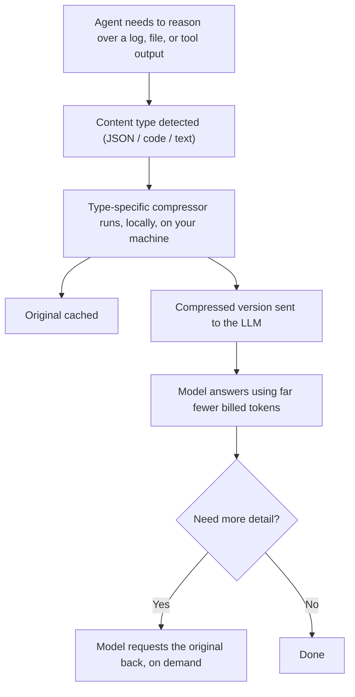

# Headroom — Content-Aware Token Compression for AI Agents

> **Source**: [Medium — The Latency Gambler](https://medium.com/@kanishks772/a-netflix-engineer-may-have-just-saved-ai-companies-millions-3a7d905bea98)
> **Repository**: [headroomlabs-ai/headroom](https://github.com/headroomlabs-ai/headroom)

*The most expensive part of running AI agents was never the model. It was the noise you were feeding it.*

An engineer at a large streaming company is debugging a production issue late at night. He points an AI agent at a ten-thousand-token log file and asks it to find the one line that explains the failure. The agent gets there eventually. The bill, though, reflects all ten thousand tokens, even though the actual answer needed something closer to twelve hundred. He stares at the invoice and says, out loud, to nobody: *we're paying to read garbage so the model can find one sentence.*

Most teams facing high AI costs reach for the obvious lever — swap to a cheaper model, or trim the prompt by hand. This engineer did something different: he stopped assuming the model needed to see everything in the first place, and built a layer that decides that for you.

## The Problem Nobody Priced Correctly

Token costs scale with volume, not relevance, and most AI pipelines were never designed around that fact:

- **Tool outputs, logs, and retrieval chunks are verbose by default.** They're built for humans skimming a terminal, not for a model paying per token to read them.
- **Bigger context windows didn't lower spend — they raised the ceiling.** Providers made it possible to send more, which mostly meant people sent more, not less.
- **Nobody budgets for the gap between "sent" and "needed."** A ten-thousand-token log and a twelve-hundred-token answer are treated as the same line item on an invoice.

## What Actually Changes Structurally

The fix isn't a smarter prompt. It's a layer that sits between your agent and the model, and reduces what reaches the model before it's billed:

- **Content gets routed by type, not treated uniformly.** Structured data, source code, and plain text each get compressed differently, because they compress differently.
- **Compression is reversible, not destructive.** The original stays cached locally; the model can request the full version if the compressed one isn't enough.
- **Nothing about the agent's code has to change.** The layer wraps the existing call path instead of requiring a rewrite.

## The Philosophy, in Code

The actual implementation is content-aware and non-trivial. The idea behind it is simple enough to sketch in a few lines:

```python
# Illustrative only — captures the philosophy, not the real library.

def prepare_for_model(payload, content_type):
    # Don't send raw noise just because it's convenient to grab.
    # Compress by type, keep the original recoverable, and only
    # pay (in tokens) for what the model actually needs to reason over.
    compressed = compress_by_type(payload, content_type)  # JSON, code, text, etc.
    cache_original(payload)  # nothing is thrown away
    return compressed  # this is what actually gets billed
```

The philosophy: token spend should track relevance, not the size of whatever happened to be lying around.

## How a Request Actually Flows



## What This Costs You

This isn't a free win, and treating it like one undersells it:

- **It's a new dependency to trust and maintain**, sitting directly in your critical path.
- **It adds a processing step**, which means a small latency cost before every request.
- **Compression quality varies by content type** — a compressor tuned for JSON won't behave identically on free-form prose.
- **It treats a symptom, not the root habit.** Pipelines that over-fetch and over-log will still over-fetch and over-log; this just makes the bill smaller.

## How to Apply This in a Normal Team

- **Audit one pipeline's token spend this week** and separate what was sent from what the final answer actually used.
- **Identify your worst offenders first** — usually logs, tool outputs, or RAG chunks, not the prompt text itself.
- **Pilot compression on a single low-risk workflow** before wiring it into anything customer-facing.
- **Set an accuracy gate before you trust it broadly** — run your existing eval set through the compressed path and compare, don't assume parity.

If the model was never the expensive part — the noise around it was — how much of your current AI bill is actually paying for content nobody asked it to read?

## References

- **Repository**: [headroomlabs-ai/headroom](https://github.com/headroomlabs-ai/headroom)
- **Original Article**: [Medium — The Latency Gambler](https://medium.com/@kanishks772/a-netflix-engineer-may-have-just-saved-ai-companies-millions-3a7d905bea98)
