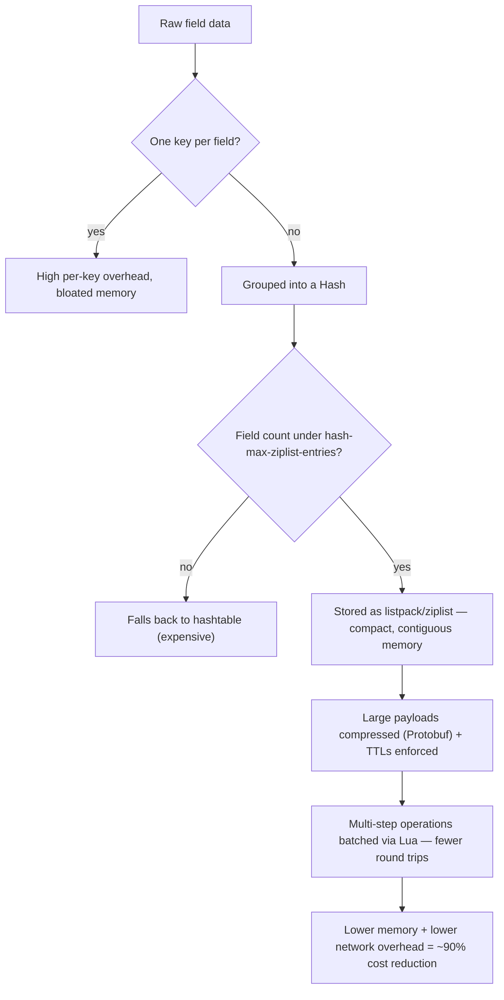

# A 90% Redis Cost Reduction Sounds Impossible Until You Look Under the Hood

> **Source**: [Medium — The Latency Gambler](https://medium.com/@kanishks772/a-90-redis-cost-reduction-sounds-impossible-until-you-look-under-the-hood-4e1702b4aae8)
> **Published**: 2026-07-22

*Most teams solve a Redis bill by adding more Redis. Meesho's engineering team solved it by reading the manual instead.*

A platform engineer at Meesho is staring at a Redis bill that's climbed steadily as the platform scaled to serve users across India's smaller cities. The obvious move is the industry's default move: add nodes, bump memory, let the cluster absorb the growth. Instead, the team stops and asks a smaller, more annoying question: are we storing this data the way Redis actually wants it stored, or did we just start writing keys on day one and never come back to it?

That question, followed all the way through, is reportedly how Meesho cut its Redis infrastructure cost by close to 90%. Most teams treat a caching layer as a black box you feed and forget. Meesho's team treated it as a system with internals worth understanding — and that difference is the entire story.

## The Habit That Was Quietly Inflating the Bill

Meesho's setup started the way most Redis deployments do:

- **Every field lived as its own key.** A user's name, age, and city were three separate `SET` calls instead of one grouped record.
- **Per-key overhead added up at scale.** Redis carries metadata for every key — pointers, encoding headers — and that overhead is invisible until you're storing tens of millions of keys.
- **Nobody had checked which internal encoding Redis was actually using.** Redis silently picks between a compact, memory-efficient format and a heavier, pointer-based one, and that choice was never audited.

## Fix One: Group Fields Into Hashes

Instead of:

```c
SET user:1001:name "Asha"
SET user:1001:age 29
SET user:1001:city "Bengaluru"
```

Meesho's team moved to:

```c
HSET user:1001 name "Asha" age 29 city "Bengaluru"
```

One key, one piece of metadata overhead, three fields living together. At the scale Meesho operates — tens of millions of user and catalog records — that alone reclaims a meaningful chunk of memory.

## Fix Two: Tune the Encoding Threshold

Small hashes aren't stored as full hash tables internally. Redis keeps them as a compact, contiguous structure historically called a `ziplist`, now `listpack` in newer versions — as long as the hash stays under a configurable size:

```c
# redis.conf
hash-max-ziplist-entries 128   # switch to hashtable above this many fields
hash-max-ziplist-value 64      # switch above this field size, in bytes
```

Cross that threshold, and Redis silently converts the hash to the heavier, pointer-based encoding — same data, several times the memory. Meesho's team tuned this ceiling to match their actual field counts, so hashes stayed in the cheap encoding instead of quietly tipping over into the expensive one. You can check which encoding a given key is using directly:

```c
OBJECT ENCODING user:1001
"listpack"    # cheap — this is what you want
"hashtable"   # correct, but memory-heavy
```

## Fix Three: Batch Round Trips With Lua

Every network round trip to Redis costs time and, at scale, compute. Meesho's team moved multi-step operations into small Lua scripts that run directly on the Redis server, replacing several client-to-server calls with one:

```lua
-- Combine a read, a conditional increment, and a TTL refresh
-- into a single atomic round trip instead of three separate calls.
local current = redis.call('HGET', KEYS[1], 'count')
if not current then
  redis.call('HSET', KEYS[1], 'count', 1)
else
  redis.call('HINCRBY', KEYS[1], 'count', 1)
end
redis.call('EXPIRE', KEYS[1], ARGV[1])
return redis.call('HGET', KEYS[1], 'count')
```

Fewer round trips means lower network overhead and less time holding connections open under load.

## Fix Four: Compress Before You Store, and Set Real TTLs

For larger payloads, Meesho's team serialized data with Protobuf before writing it to Redis — a binary format that's substantially smaller than storing raw JSON strings — and paired that with deliberate Time-To-Live settings so stale data actually expired instead of sitting in memory indefinitely.

## Where the Savings Actually Stack Up



## What This Costs You

This wasn't a one-afternoon fix, and it isn't free of trade-offs:

- **It requires reading Redis internals**, not just its API — most teams never budget that time.
- **The ziplist/listpack threshold is workload-specific.** Set it wrong and you get no benefit, or worse, slower writes.
- **Lua scripts add operational surface area.** They need version control, testing, and someone who remembers they exist six months later.
- **Compression trades memory for CPU.** You're not eliminating cost — you're moving it to wherever it's cheaper for your workload.

## How to Apply This in a Normal Team

- **Run `OBJECT ENCODING` against your busiest keys this week** and confirm you know which format Redis actually chose.
- **Count how many separate keys represent one logical record**, and estimate what grouping them into a Hash would save.
- **Read the `hash-max-ziplist-entries` (or `hash-max-listpack-entries`) docs once, deliberately** — not mid-incident — and tune it against your real field counts.
- **Audit your TTLs.** Data with no expiry is a slow, invisible memory leak that looks like "normal growth" until someone checks.

If Meesho's team found a 90% cost reduction just by reading Redis's internals more carefully, what's still sitting unexamined in your own caching layer?
