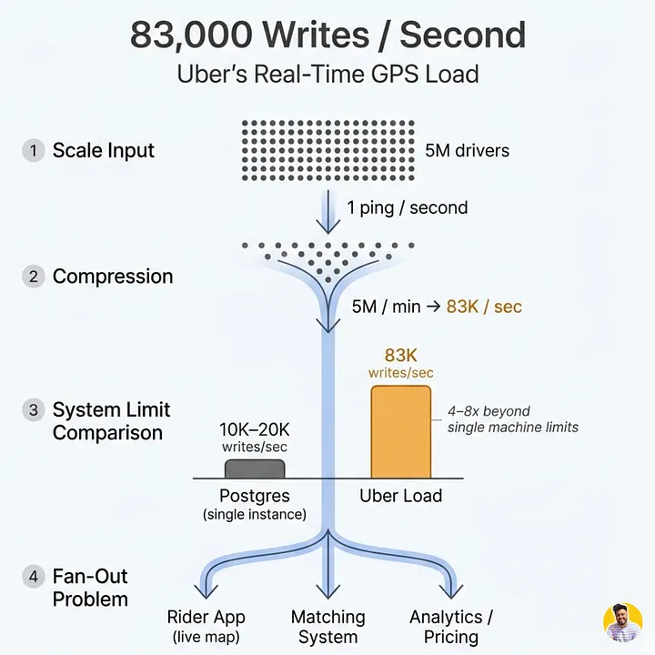
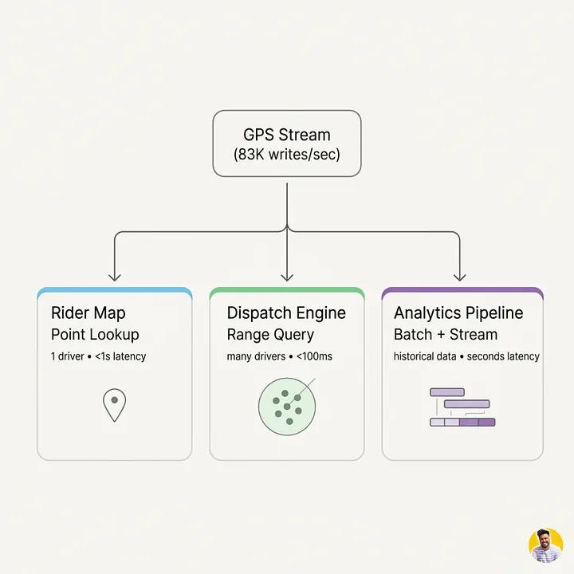
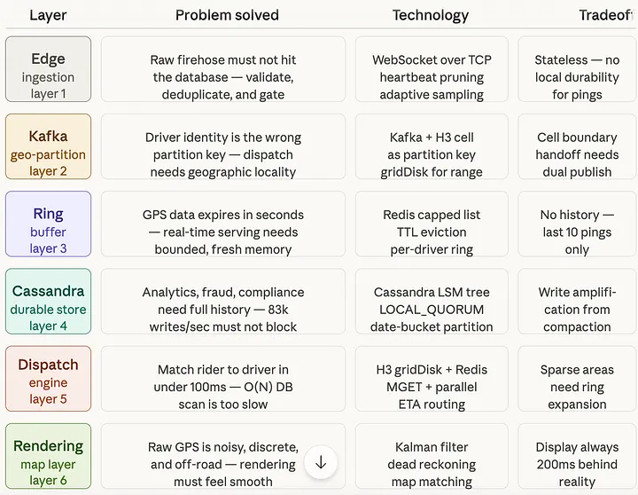

# Uber Architecture – Part 1: Why Tracking 5 Million Drivers Every Second Is One of Tech's Hardest Problems

*By Simranjeet Singh · 8 min read · Mar 19, 2026*

> **Source**: Originally published on [Medium — CodeToDeploy](https://medium.com/codetodeploy/uber-architecture-part-1-why-tracking-5-million-drivers-every-second-is-one-of-techs-hardest-problems)
> **Series**: [Part 2 — The Ingestion Edge →](https://medium.com/codetodeploy/uber-architecture-part-2-the-ingestion-edge-840456c40f01)

---

Every second, 83,000 drivers tap their GPS chip.

Every second, Uber's servers receive, validate, route, store, and render those 83,000 locations across hundreds of cities on a map that updates smoothly on your phone.

**Every. Single. Second.**

Before we talk about databases, message queues, or hexagonal grids, let's talk about why this problem is genuinely hard. Not "hard to implement" hard. Hard in the way that makes experienced engineers pause, reach for a whiteboard, and start drawing tradeoff triangles.

Because the first instinct every engineer has when they hear this problem is **exactly wrong**. And understanding why it's wrong is the entire foundation of what comes next.

---

## Series Overview

| Part | Title |
|------|-------|
| Part 1 | **Why Tracking 5 Million Drivers Every Second Is One of Tech's Hardest Problems** |
| Part 2 | The Ingestion Edge |
| Part 3 | Kafka Partitioning by Geography and the Hexagonal Grid |
| Part 4 | The Ring Buffer and Cassandra: Two Stores, One Stream |
| Part 5 | The Dispatch Engine and Map Rendering |

---

## The Lie Every Junior Engineer Tells Themselves

> "It's just a lat/long coordinate. Store it in a database. Done."

It sounds reasonable. A GPS ping is two floating-point numbers, a timestamp, and a driver ID. That's maybe 50 bytes of data. How hard can it be?

**Here is how hard it can be.**

The raw math, before we even talk about architecture.

Uber has roughly **5 million active drivers** globally during peak hours. Each driver's app pings the server once every second while the app is active. That is **5 million writes per minute**, which collapses to **83,000 writes every single second**. Not during a burst. Not during a spike. As a sustained, baseline, 24-hours-a-day, 7-days-a-week floor.

For context, a well-tuned single Postgres instance on good hardware maxes out at roughly 10,000 to 20,000 writes per second under ideal conditions, with a simple schema and no indexes. A single database handling Uber's GPS load would need to be **four to eight times faster** than the best single machine you can buy — before you account for reads, before you account for replication, and before you account for the fact that GPS coordinates are nearly useless unless you can query them geospatially.

So the "just store it" instinct hits a wall almost immediately.

But the write volume is only half the problem. The deeper problem is something most engineers don't see coming.

---

## The Real Problem: Three Masters, One Stream

Every single GPS ping has **three completely different consumers**, each needing it right now, for entirely different reasons.

### Consumer 1: The Rider's Map

When you open Uber and watch a little car icon glide toward you, that is a live GPS ping rendered on your screen, usually with **less than one second** of end-to-end latency. This consumer needs the freshest possible data, with extremely low read latency, but it only cares about **one driver at a time**: yours. It is a **point lookup**. Fast, narrow, and extremely latency-sensitive.

### Consumer 2: The Dispatch Engine

This is the brain that matches incoming ride requests to available drivers. When you request a ride, the dispatch engine needs to find every available driver within a reasonable radius of your pickup point, rank them by ETA and other signals, and assign the best one — all in **under 100 milliseconds**. This consumer needs to read many drivers at once within a geographic area. It is a **range query**, not a point lookup. The freshness requirement is still high, but the access pattern is completely different from the map rendering case.

### Consumer 3: The Analytics Pipeline

Uber's data science teams continuously analyze driver movement patterns to power surge pricing models, demand forecasting, city-level heatmaps, and driver earnings predictions. This consumer can tolerate a few seconds of latency, but it needs to store and query enormous amounts of historical GPS data efficiently. It is a **batch and stream processing** workload that cares about retention and throughput, not millisecond freshness.

### Summary

| Consumer | Access Pattern | Latency Tolerance | Freshness Need |
|----------|---------------|-------------------|----------------|
| Rider's Map | Point lookup (single driver) | < 1 second | Real-time |
| Dispatch Engine | Range query (geographic area) | < 100 ms | Real-time |
| Analytics Pipeline | Batch/stream processing | Seconds+ | Near real-time |

Three consumers. Three completely different access patterns. Three completely different latency tolerances. **One incoming stream of 83,000 writes per second.**

---

## The Core Tension: The Tradeoff Triangle

In distributed systems, there is a fundamental tradeoff triangle that every engineer eventually internalizes:

You can optimize for **write throughput** — the ability to ingest data as fast as it arrives. You can optimize for **read latency** — the ability to query data back instantly. And you can optimize for **storage cost** — keeping your infrastructure bills from being astronomical. The problem is that **naive architectures force you to pick at most two**.

- If you optimize writes by buffering everything in memory, you get fast ingestion and fast reads, but a **catastrophic data loss risk**.
- If you optimize reads by pre-indexing every coordinate in a spatial index, you can query instantly, but **writes become slow** because every insert has to update multiple index structures.
- If you optimize storage by aggressively compressing and archiving old GPS data, your **analytics pipeline is happy**, but your **real-time consumers starve**.

A single storage system cannot elegantly solve all three sides of this triangle for the same data stream simultaneously. This is not a hardware problem you can throw money at. It is a **fundamental architectural problem**.

> **Analogy**: Think of it like a restaurant kitchen during lunch rush. The expediter calling orders to cooks needs information instantly. The manager tracking which tables to seat next needs a broader view updated every few minutes. The accountant tallying the day's covers needs accurate totals by end of day. All three people need the same underlying information, but at completely different speeds, granularities, and freshness levels. A single chalkboard in the kitchen cannot serve all three simultaneously. You need different systems for different consumers, fed from the same source.

---

## A Brief Note on Architecture Patterns

This tradeoff has a name in distributed systems literature. It is classically called the **Lambda Architecture** problem, first articulated by Nathan Marz:

- A **fast path** handles real-time, low-latency reads.
- A **batch path** handles high-throughput, high-accuracy historical queries.
- A **serving layer** merges the two.

Modern teams at Uber have largely moved to a **Kappa Architecture** variant, where a single streaming pipeline — Kafka plus Flink — powers both real-time and batch consumers, eliminating the operational complexity of maintaining two separate processing paths. We'll see exactly what that looks like in Parts 3 and 4.

---

## The Insight That Changes Everything

So what does Uber actually do?

**They decompose the problem.**

Rather than building one system that tries to handle ingestion, routing, storage, dispatch serving, and map rendering all at once, they build **six purpose-built layers**, each solving one sub-problem excellently and handing off cleanly to the next.

That **decomposition is the entire insight**. And each layer is its own engineering story.

### The Six Layers

| Layer | Name | Responsibility |
|-------|------|----------------|
| 1 | **The Ingestion Edge** | Validates, deduplicates, and rate-controls every incoming ping before anything downstream ever sees it. |
| 2 | **Kafka, Partitioned by Geography** | Routes pings to the right consumers based on where the driver physically is, not who they are. |
| 3 | **The Ring Buffer (Redis)** | Stores only the last few positions per driver, in memory, for sub-millisecond real-time reads. |
| 4 | **Cassandra for Durable Storage** | Stores every ping durably and efficiently, optimized for sequential writes and time-range reads. |
| 5 | **The Dispatch Engine** | Uses all of the above to match riders to drivers in under 100 milliseconds. |
| 6 | **Map Rendering** | Transforms noisy, discrete GPS data into the smooth animation you actually see. |

Six layers. Each solving exactly one problem. Each making the next layer's job tractable.

---

## Why This Framing Matters Before the Architecture

Most system design content skips straight to the technology choices — Kafka, Redis, Cassandra, H3. And those choices are fascinating. But if you learn the tools before you understand the problem, the tools feel arbitrary. You end up memorizing "Uber uses Cassandra" without understanding **why** Cassandra, or more importantly, **why not something else**.

The argument being made here is simpler and more durable than any specific technology:

> **When a problem seems impossibly large, it is usually because you are looking at it as one problem.**

The 83,000-writes-per-second problem is not **one** problem. It is at minimum **three problems** — one per consumer — each with different constraints, different acceptable tradeoffs, and different ideal solutions. The moment you see it that way, the architecture almost draws itself. Each layer exists because someone looked at the handoff from the previous layer and asked, *"What is the hardest sub-problem that starts here?"* Then they built something specific for exactly that.

---

## Final Thoughts

Before a single line of architecture is drawn, the hardest insight is simply admitting the problem can't be solved as one problem. The data has **three masters with three completely different needs**. The moment you stop trying to satisfy all three with one system and instead ask, *"What does each consumer actually need?"*, the architecture starts to become obvious.

> **The decomposition is not the implementation detail. The decomposition is the architecture.**

---

## Preview of Part 2

83,000 GPS pings hit Uber's servers every second. If you can never let them touch a database directly, what do you put in front? And how do you validate, deduplicate, and control the rate of incoming data without ever slowing down a driver's app?

**Next: [Part 2 — The Ingestion Edge](https://medium.com/codetodeploy/uber-architecture-part-2-the-ingestion-edge-840456c40f01)**

---

*Originally published by Simranjeet Singh on [Medium — CodeToDeploy](https://medium.com/codetodeploy).*

> **Source URL**: [Part 1](https://medium.com/codetodeploy/uber-architecture-part-1-why-tracking-5-million-drivers-every-second-is-one-of-techs-hardest-problems) | [Part 2](https://medium.com/codetodeploy/uber-architecture-part-2-the-ingestion-edge-840456c40f01)

> **Taxonomy Reference**: §3.3 Event-Driven & Messaging Architecture  
> **General Pattern**: [Event-Driven Architecture](../../../architecture-general/03-integration-communication-architecture/)  
> **Azure Implementation**: See [Event Hubs](../../../architecture-azure/integration/event-hubs/), [Azure Cache for Redis](../../../architecture-azure/data/redis/), and [Azure Cosmos DB](../../../architecture-azure/data/databases/)
