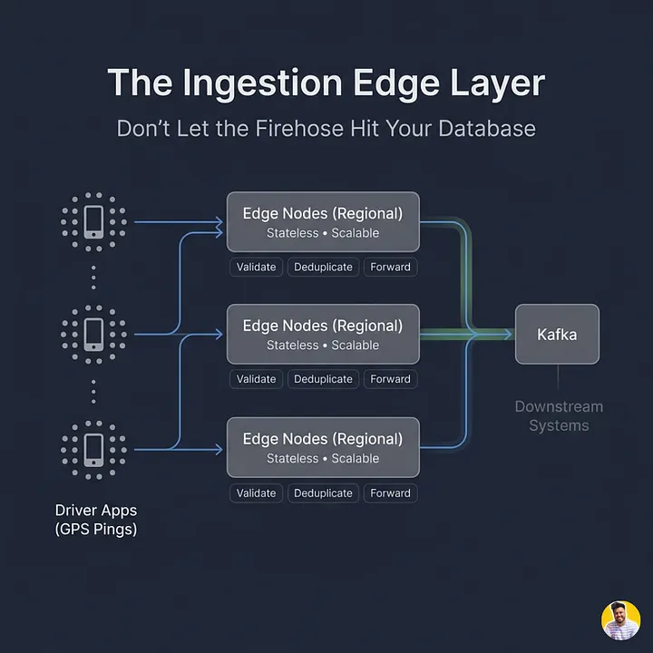
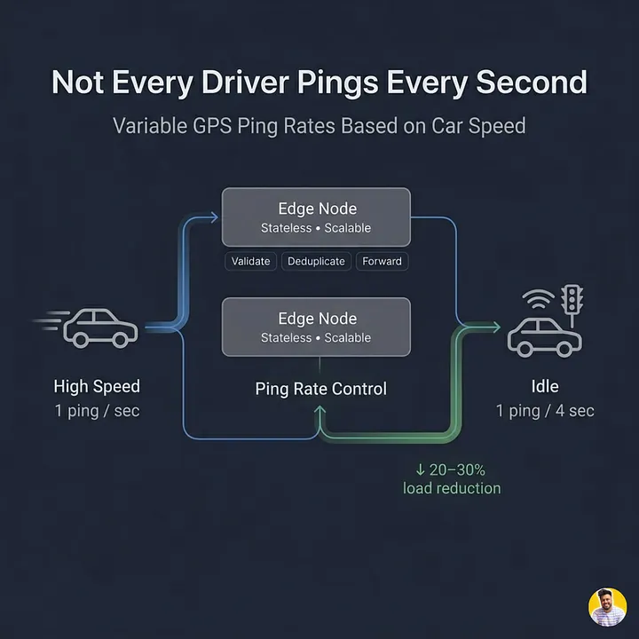
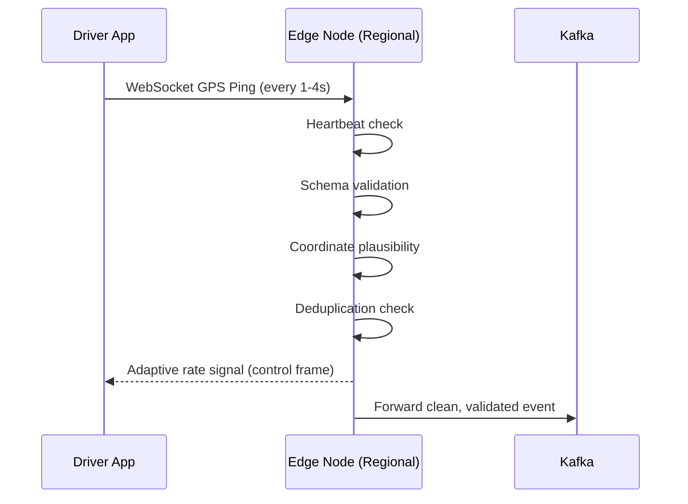

# Uber Architecture – Part 2: The Ingestion Edge

*By Simranjeet Singh · 12 min read · Mar 22, 2026*

> **Source**: Originally published on [Medium — CodeToDeploy](https://medium.com/codetodeploy/uber-architecture-part-2-the-ingestion-edge-840456c40f01)
> **Series**: [← Part 1: Why Tracking 5 Million Drivers Is Hard](01-why-tracking-5-million-drivers-is-hard.md) | [Part 3 — Kafka & Hexagonal Grid →](https://medium.com/codetodeploy/uber-architecture-part-3-kafka-partitioning-geography-hexagonal-grid)

---

**Don't let the firehose hit your database.**

In [Part 1](01-why-tracking-5-million-drivers-is-hard.md), we established the uncomfortable truth: 83,000 GPS pings arrive every second, and a single database cannot handle them. Three completely different consumers need the same data, at different speeds, for different purposes, with different tolerances for staleness.

The solution is decomposition. Six purpose-built layers, each solving one sub-problem completely.

But before any of those layers can do their job, **something has to stand at the door**.

Something that sees every single ping first. That decides what's worth keeping and what gets dropped. That controls how fast data flows into the rest of the system. That absorbs shocks so that a problem in one city doesn't cascade into every other city on Earth.

That something is the **ingestion edge**, and understanding what it does — and more importantly what it **refuses to do** — is the foundation of the entire architecture.

---

## Series Overview

| Part | Title |
|------|-------|
| Part 1 | [Why Tracking 5 Million Drivers Every Second Is One of Tech's Hardest Problems](01-why-tracking-5-million-drivers-is-hard.md) |
| Part 2 | **The Ingestion Edge** |
| Part 3 | Kafka Partitioning by Geography and the Hexagonal Grid |
| Part 4 | The Ring Buffer and Cassandra: Two Stores, One Stream |
| Part 5 | The Dispatch Engine and Map Rendering |

---

## The First Rule of GPS Infrastructure at Scale

> **Your database should never see a raw ping.**

This sounds counterintuitive. Data arrives, you store it. That's what databases are for. But when data arrives at 83,000 writes per second, sending it directly to a database is like routing a fire hydrant through a kitchen tap. The physics simply don't work.

And more importantly, the problem isn't just volume. It's that **most of those 83,000 pings per second are not yet worth storing**.

- Some are **malformed** — missing a field, carrying an impossible timestamp.
- Some are **duplicates** from a flaky mobile network that sent the same packet twice.
- Some carry **impossible coordinates** because the driver's phone GPS briefly thought it was in the middle of the Pacific Ocean.

Sending all of that garbage directly into your database, at full firehose speed, is how you corrupt your data pipeline and wake up to a production incident at 3am.

So Uber's first architectural decision is to put a dedicated **ingestion layer** between the raw ping stream and everything else. This is the **edge layer**.

---

## Why the Edge Node Lives Close to the Driver, Not the Database

Every Uber driver app maintains a persistent connection — not to Uber's central datacenter, but to the **nearest regional edge node**. If you're a driver in Mumbai, your app connects to an edge node in Mumbai, not to a server in Virginia. If you're in São Paulo, your edge node is in São Paulo.

This is not just a latency optimization (though it does meaningfully reduce round-trip time). The deeper reason is **blast radius control**.

If Uber's central processing systems have an incident, the edge nodes keep accepting connections and buffering events independently. The driver apps stay connected. Pings keep flowing. The edge layer absorbs the shock while the core systems recover.

This is the principle of **bulkheads** in distributed systems: isolate failure domains so that a problem in one part of the system doesn't cascade into every other part. A fire in the engine room shouldn't flood the hull. A spike in São Paulo shouldn't degrade drivers in Mumbai.

Each regional edge node is **stateless** and **horizontally scalable**. Add more drivers in a city, spin up more edge node capacity in that region. No coordination required between edge nodes. They don't talk to each other. They each independently accept connections, process pings, and forward to Kafka.

> **Analogy**: Think of edge nodes as regional post offices. When you send a letter, you don't drive to the national sorting facility yourself. You drop it at your local post office, which is close to you, fast to reach, and handles the first pass of processing before handing it up the chain. The national facility never has to deal with every individual person walking through its door.

---

## The Protocol Decision: Why Not UDP?

When you're designing a system that ingests 83,000 messages per second, the temptation is to use **UDP**.

UDP is a connectionless protocol. There is no handshake, no acknowledgment, no guaranteed delivery. You fire a packet and forget. It's faster, lighter, and simpler than TCP for pure data blasting.

Engineers at this scale seriously consider UDP. The argument goes: GPS data is inherently lossy-tolerant. If you miss one ping out of sixty in a minute, the map still works. Dead reckoning fills in the gap. So why pay the overhead of TCP's reliability guarantees for data that doesn't strictly need them?

The argument sounds compelling **until you think about it from the other direction**.

UDP's loss-tolerance only works if the receiver has a way to handle gaps gracefully. But the ingestion edge isn't just forwarding data — it's also the layer responsible for **deduplication**, **schema validation**, and **connection lifecycle management**. All of those functions require knowing which driver sent what, in what order, and whether the connection is still alive. UDP gives you none of that. You'd have to rebuild a significant portion of TCP's reliability semantics on top of UDP to make it production-safe, at which point you have invented a worse version of TCP.

More practically: mobile networks are not clean, low-loss pipes. A driver in a dense urban area with poor signal can see packet loss rates high enough that a UDP-based system would start producing visible map degradation for riders. The perceived latency of watching a car icon freeze and then jump is worse, from a user experience perspective, than the theoretical throughput gains of UDP.

### What Uber Actually Uses

Uber uses **WebSocket over TCP**. This gives you:

- A persistent, full-duplex connection with reliable delivery
- Natural mapping to "push config updates to the driver app" use case over the same connection
- Heartbeat-based dead connection pruning: every N seconds, the edge expects a heartbeat frame; if it stops, the connection is declared dead, resources are cleaned up, and the driver's presence is marked stale

This is far cleaner than the alternative — accumulating ghost connections from drivers who dropped into a tunnel and never reconnected.

> **Future direction**: Some high-throughput telemetry systems use **QUIC** instead of TCP + WebSocket. QUIC is the transport protocol underlying HTTP/3. It gives you reliability and ordering guarantees like TCP, but with dramatically faster connection establishment and better behavior under packet loss (individual streams within a QUIC connection don't block each other). It's plausible that Uber's next-generation ingestion layer moves in this direction, particularly for markets with high mobile network jitter.

---

## Adaptive Sampling: The Server Tells the Client How Often to Ping

Here is one of the most elegant decisions in the entire architecture, and the one most engineers miss when they first think through this problem.

> **Not every driver needs to ping every second.**

### Velocity-Based Ping Intervals

| Driver State | Speed | Ping Interval | Rationale |
|-------------|-------|---------------|-----------|
| Highway cruising | ~100 km/h (~28 m/s) | **1 second** (1 Hz) | Needs continuous tracking; missing a ping causes visible map jerk |
| Stop-and-go traffic | Low, variable | **2 seconds** (0.5 Hz) | Lower rate of meaningful position change |
| Stationary (red light) | 0 km/h | **4 seconds** (0.25 Hz) | No movement = no new information |

A driver sitting stationary at a red light has moved zero meters since the last ping. The ping you are about to send is **identical** to the ping you sent one second ago. Storing it is pure waste. Processing it is pure waste. The rider's map doesn't move. The dispatch engine doesn't change its ranking. The analytics pipeline doesn't learn anything new.

### Server-Side Client-Rate Control

Uber's edge layer solves this with **server-side adaptive sampling signals**. The driver app does **not** decide its own ping rate autonomously. The edge node continuously monitors each driver's velocity (computed from the last few received coordinates) and sends back a control frame telling the app how frequently to ping.

This is the principle of **client-rate control from the server side**. The client is not trusted to make this decision efficiently because the client doesn't have visibility into overall system load. The server does. If a major event causes a spike in active drivers across a city, the edge layer can globally throttle ping rates to protect downstream systems — without pushing a code update to a single driver app.

### The Numbers Matter

Dropping stationary drivers from 1 Hz to 0.25 Hz during a typical mix of driving states can **reduce overall write volume by 20–30%**. At 83,000 pings per second, that is **17,000 to 25,000 fewer writes every second** — purely from a rate control signal. That's the difference between needing 40 servers and needing 30 servers in a given region.

> **Analogy**: Your phone's battery app does something similar. When you're actively using your screen, it samples battery level frequently. When the screen is off and nothing is running, it samples less often. Adaptive sampling is about matching your measurement frequency to the rate of change of what you're measuring.

> **Control Theory**: This is a **closed-loop feedback system**. The server is the controller. The client is the plant. The ping rate is the actuator. Velocity is the sensor. As driver state changes, the server adjusts the signal, the client adjusts its behavior, and the server re-observes the new state. Google's fleet tracking systems use a nearly identical pattern.

---

## What the Edge Node Does — and What It Absolutely Does Not Do

This is where most system design answers go wrong.

Engineers, correctly identifying that the edge node sees all the data first, start loading it with responsibilities: cache driver locations here, compute ETAs here, index coordinates here, run geo-queries here.

**No.**

The edge node has exactly **three jobs**:

### The Three Responsibilities

| # | Job | Description |
|---|-----|-------------|
| 1 | **Validate** | Does the ping have a driver ID? Is the timestamp within an acceptable range? Are the coordinates physically plausible (not in the middle of an ocean, not at lat/lng 0,0 — a common GPS chip error)? Does the schema match downstream expectations? If any check fails, the ping is **silently dropped** and a metric is incremented. No back-pressure signal to the driver app. |
| 2 | **Deduplicate** | Mobile networks sometimes deliver the same packet twice. The edge node keeps a lightweight in-memory deduplication cache (keyed by driver ID + timestamp, TTL of a few seconds). Duplicates are silently dropped. |
| 3 | **Forward** | Valid, deduplicated pings are forwarded to Kafka. That's it. |

The edge node does **not** query anything. It does **not** compute anything. It does **not** store anything permanently. It is a **stateless, high-throughput processing gate**.

### Why Narrow Scope = Infinite Scale

Keeping the edge node's responsibilities this narrow is precisely what makes it scalable:

- A stateless node can be replicated **infinitely**
- No coordination between instances needed
- No distributed locks
- No consensus protocols
- Add capacity by adding nodes; a load balancer distributes connections across them

The moment you give the edge node a stateful responsibility (like maintaining a driver position cache), you've introduced coordination overhead that fundamentally limits how fast you can scale it.

> **Analogy**: The edge node is a **bouncer**. It checks IDs and lets people in. It doesn't seat anyone. The moment a bouncer starts taking reservations, managing table assignments, and running the kitchen, the line outside gets longer. Keep the door separate from everything behind it.

---

## Putting It Together: The Edge Layer in Full

Here is the complete picture of what happens between a driver's GPS chip firing and a clean ping reaching Kafka:

The entire process — receipt, validation, dedup, rate signal, forward — happens in **under 2 milliseconds per ping**.

The driver's app never waits. The database never sees garbage. The downstream layers never receive a duplicate. And the edge fleet can scale horizontally to any ping volume by simply adding more stateless nodes.

---

## Why This Layer Deserves More Credit Than It Gets

In most technical write-ups about Uber's architecture, the edge layer gets one paragraph before the author rushes to talk about Kafka and H3. That's understandable — those are more architecturally novel. But **the edge layer is what makes them possible**.

| Without the Edge Layer... | Consequence |
|---------------------------|-------------|
| Without validation | Kafka consumers spend CPU rejecting malformed events |
| Without deduplication | The ring buffer fills with repeated positions; dispatch makes decisions on stale data |
| Without adaptive sampling | Downstream absorbs 20–30% more load than needed — every second, forever |
| Without regional deployment | Central ingestion becomes a single point of failure for the entire global fleet |

> **The edge node is invisible when it works. It only becomes visible when it's missing.**

That invisibility is the point. The best infrastructure layers are the ones that do their job so completely that nobody downstream ever has to think about the problems they prevent.

---

## Final Thoughts

The edge node's superpower is its **restraint**. Every responsibility you add to it — caching, computing, geo-indexing — costs you the ability to scale it horizontally without coordination overhead. A stateless gate that validates, deduplicates, and forwards is a gate you can clone infinitely. The moment it "knows" anything about drivers beyond this single ping, you've built a bottleneck.

The same principle will appear in every layer of this architecture: **the best systems are the ones that know exactly what they are not responsible for**.

---

## Preview of Part 3

Clean pings are now flowing into Kafka at scale. But a river of clean data is still just a river if you can't route it intelligently.

If you partition by driver ID — the most intuitive choice — the dispatch engine breaks completely. Why? And what does partitioning by geography actually look like when the "geographic key" has to be deterministic, constant-time to compute, and work at a planetary scale?

**Next: [Part 3 — Kafka Partitioning by Geography and the Hexagonal Grid →](https://medium.com/codetodeploy/uber-architecture-part-3-kafka-partitioning-geography-hexagonal-grid)**

---

*Originally published by Simranjeet Singh on [Medium — CodeToDeploy](https://medium.com/codetodeploy).*

> **Source URL**: [Part 2](https://medium.com/codetodeploy/uber-architecture-part-2-the-ingestion-edge-840456c40f01)
>
> **Taxonomy Reference**: §3.3 Event-Driven & Messaging Architecture  
> **General Pattern**: [Event-Driven Architecture](../../../architecture-general/03-integration-communication-architecture/)  
> **Azure Implementation**: See [Event Hubs](../../../architecture-azure/integration/event-hubs/), [Azure Cache for Redis](../../../architecture-azure/data/redis/), [Azure Web PubSub](../../../architecture-azure/integration/), and [Azure Kubernetes Service](../../../architecture-azure/compute/aks/) for edge workloads
