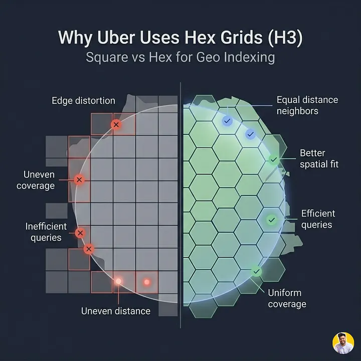
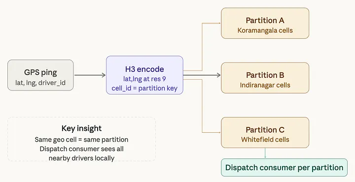
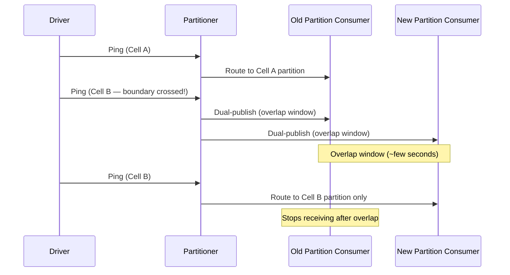

# Uber Architecture – Part 3: Kafka Partitioning by Geography and the Hexagonal Grid

*By Simranjeet Singh · 14 min read · Mar 25, 2026*

> **Source**: Originally published on [Medium — CodeToDeploy](https://medium.com/codetodeploy/uber-architecture-part-3-kafka-partitioning-geography-hexagonal-grid)
> **Series**: [← Part 2: The Ingestion Edge](02-the-ingestion-edge.md) | [Part 4 — Ring Buffer & Cassandra →](https://medium.com/codetodeploy/uber-architecture-part-4-ring-buffer-cassandra)

---

**The routing brain. The first instinct is wrong. And it will cost you.**

In [Part 2](02-the-ingestion-edge.md), we built the edge layer — a stateless, regional gate that validates every ping, kills duplicates, controls the rate of incoming data, and forwards clean events to Kafka in under two milliseconds. The database never sees garbage. The driver app never waits. The edge fleet scales by simply adding nodes.

Now the clean pings are in Kafka. **83,000 of them, every second**, from drivers scattered across hundreds of cities on six continents.

And here is where most engineers make their first serious architectural mistake.

Because the next question seems obvious: *how do you partition a Kafka topic with 83,000 events per second?* And the obvious answer — partition by driver ID — is the answer that **breaks the most important downstream consumer in the entire system**.

Understanding exactly why it breaks and what you build instead is what this part is about.

---

## Series Overview

| Part | Title |
|------|-------|
| Part 1 | [Why Tracking 5 Million Drivers Every Second Is One of Tech's Hardest Problems](01-why-tracking-5-million-drivers-is-hard.md) |
| Part 2 | [The Ingestion Edge](02-the-ingestion-edge.md) |
| Part 3 | **Kafka Partitioning by Geography and the Hexagonal Grid** |
| Part 4 | The Ring Buffer and Cassandra: Two Stores, One Stream |
| Part 5 | The Dispatch Engine and Map Rendering |

---

## The Instinct That Fails

When most engineers first design a Kafka pipeline for GPS data, they reach for the most natural partition key available: the **driver ID**.

It makes intuitive sense. Each driver has a unique ID. Kafka guarantees ordering within a partition. Partitioning by driver ID means all events for a given driver land in order, in the same partition, readable by the same consumer. Clean. Predictable. Textbook Kafka usage.

**It is also completely wrong for this use case.**

To understand why, you have to understand what the dispatch engine actually needs to do.

### What the Dispatch Engine Really Needs

The dispatch engine — the most latency-sensitive consumer of GPS data in the entire system — does **not** think about individual drivers. It thinks about **neighborhoods**.

When a rider in Koramangala requests a ride, the dispatch engine needs to answer one question: *which available drivers are currently within a reasonable radius of this pickup point?* That is a **geospatial range query**, not a point lookup. It needs to see all drivers in a geographic area simultaneously, right now, from a single coherent view of the data.

If you partition by driver ID, drivers who are physically next to each other on the same street end up **scattered across dozens of different Kafka partitions**, consumed by dozens of different consumer instances with no shared state. The dispatch engine now has to aggregate across all of those partitions to answer a single "who is nearby" question.

| Approach | Query Type | Complexity |
|----------|-----------|------------|
| Partition by driver ID | Distributed scatter-gather | O(N) — must query all partitions |
| Partition by geography | Local memory read | O(1) — single partition has all data |

You have turned an O(1) spatial lookup into a distributed scatter-gather operation, with all the latency and coordination overhead that implies. At 83,000 events per second, with thousands of concurrent ride requests, **this does not work in practice**.

> **Analogy**: Imagine a library where books are shelved by the author's birthday instead of by subject. Want to find all books about astrophysics? You have to check every shelf in the entire library, because astrophysics books could be anywhere depending on when their authors were born. Partitioning by driver ID is the same mistake. You have indexed by **identity** when you need to index by **location**.

---

## The Breakthrough: Partition by Geography, Not Identity

The architectural pivot that makes Kafka viable for Uber's dispatch problem is this:

> **Partition by where the driver is, not who the driver is.**

Every GPS ping gets assigned to a partition based on the driver's **physical location** at the moment the ping was sent, not their identity. Drivers in the same neighborhood land in the same partition. The dispatch engine can consume that partition and immediately have a coherent, locally complete view of all driver positions in that area — without talking to any other partition.

**The spatial query becomes a local memory read.**

The dispatch consumer for Koramangala's partition has a complete, current picture of every driver in Koramangala without ever needing to query another partition. The dispatch consumer for Indiranagar has the same complete picture for Indiranagar. They are independent, horizontally scalable, and they never need to coordinate with each other for the common case of a local dispatch query.

This is the power of **geographic pre-sorting**: the data is organized by space at the point of ingestion, which means spatial access patterns are cheap for every system downstream.

### The Sub-Problem: Discretizing Continuous Space

But this pivot immediately creates a new sub-problem: **how do you turn a continuous geographic space into discrete, manageable partition keys?**

You cannot partition by raw latitude and longitude. Floating-point coordinates are essentially infinite in resolution and terrible as hash keys. You need a way to discretize the Earth's surface into a finite set of cells, each of which can serve as a stable, deterministic partition key.

This is exactly the problem that Uber's **H3 library** was built to solve.

---

## H3: The Hexagonal Grid That Changed Geospatial Engineering

H3 is Uber's open-source hierarchical geospatial indexing system. At its core, it does one thing: it divides the entire surface of the Earth into a grid of hexagons, assigns every hexagon a unique 64-bit integer identifier, and provides fast functions to convert any lat/lng coordinate into the ID of the hexagon that contains it.

### Why Hexagons? The Geometry Problem with Squares

The first question engineers ask is: *why hexagons?* Why not squares, which map neatly to a standard latitude/longitude grid and are far simpler to reason about?

The answer is **geometry**. And it matters more than you might expect.

In a square grid, a cell has eight neighbors: four sharing a full edge and four sharing only a corner. The center-to-center distance to an edge-sharing neighbor is different from the center-to-center distance to a corner-sharing neighbor by a factor of $\sqrt{2} \approx 1.41$.

This means that when you ask "which cells are within one step of this cell," you get **two distinct classes of neighbor**: close ones and diagonally further ones. For spatial proximity queries, this creates **aliasing errors**. A driver sitting just inside the corner boundary of your query is treated identically to a driver sitting right in the center of your query cell, even though they are meaningfully different distances from the pickup point you care about.

| Grid Type | Neighbors | Edge Distance | Aliasing |
|-----------|-----------|---------------|----------|
| **Square** | 8 (4 edge + 4 corner) | Two classes (1× and ~1.41×) | Yes — diagonal neighbors skew proximity |
| **Hexagon** | 6 (all edge) | All equidistant | No — uniform neighbor distance |

A hexagon, by contrast, has exactly **six neighbors**, all sharing a full edge, all **equidistant** from the center. There are no corner neighbors. There are no two classes of proximity. Every cell in a hexagonal grid is equally adjacent to every one of its neighbors.

When you ask "give me all drivers within one ring of cells around this point," every driver you get back is within the same bounded distance band. The spatial query is **geometrically clean** in a way that a square grid query structurally cannot be.

This is not a minor convenience. For a dispatch system that is matching millions of riders to drivers per day based on proximity, the difference between correct and slightly-incorrect spatial proximity calculations compounds into meaningfully worse ETAs, worse match quality, and worse driver utilization at scale.

### Resolution Levels: Multiple Zoom Levels Simultaneously

H3 is not a single grid. It is a **hierarchy of grids** at 16 different resolution levels, numbered 0 through 15.

| Resolution | Hexagon Area | Use Case |
|-----------|-------------|----------|
| 0 | Millions of km² | Entire continents |
| **5** | ~250 km² | City-district demand aggregation, surge pricing, macro heatmaps |
| **9** | ~0.1 km² (~few city blocks) | **Dispatch queries** — street-level proximity |
| 15 | < 1 m² | Hyper-precise location |

The resolutions Uber uses operationally sit in the middle of that range, and they use **multiple resolutions at the same time** for different purposes.

The elegant property of H3 is that cells at different resolutions are **hierarchically nested**. Every resolution 9 cell is entirely contained within exactly one resolution 5 cell. This means you can aggregate data from fine-grained cells into coarse-grained cells with a **simple bitwise operation on the cell ID**, without any spatial math. Moving between zoom levels is essentially free computationally.

> **Analogy**: Think of H3 like a postal code system, but for the entire world and at multiple levels simultaneously. Your full street address maps to a very specific small area. Your city maps to a broader postal region. Your state maps to an even broader zone. All three levels describe the same location, just at different granularities, and you can move between them cheaply. H3 is the same idea applied to hexagonal cells instead of arbitrary postal regions.

> **Technical note**: H3 cell IDs are 64-bit integers with the resolution encoded in specific bits of the integer itself. This means containment checks and parent-cell lookups are bitwise operations rather than geometric computations. The entire hierarchy is implicit in the integer representation. This is one of the more beautiful design decisions in the library and is a key reason it is fast enough to use on every incoming GPS ping without meaningful CPU overhead.

---

## The Partition Strategy: Geography as the Hash Function

With H3 in hand, the partition strategy becomes clear in concept, though nuanced in practice.

Each incoming GPS ping, after being validated by the edge node, is transformed: the lat/lng coordinates are converted to an H3 cell ID at the dispatch-relevant resolution. That cell ID becomes the Kafka partition key. Kafka's partitioner hashes the key to determine which physical partition receives the message.

The result: all GPS pings from drivers physically located in the same H3 cell land in the **same Kafka partition**, consumed by the **same dispatch consumer instance**. That consumer instance maintains an in-memory position table for all drivers in its geographic territory. When a dispatch query arrives for a pickup in that territory, the consumer already has all the relevant data locally. **No cross-partition aggregation. No distributed coordination.** The spatial query is a local memory lookup.

### Real-World Nuance

At Uber's actual scale, the partition-to-H3-cell mapping is **not one-to-one**. A single Kafka partition may own many H3 cells at resolution 9, grouped into a logical territory based on expected driver density. The mapping itself is stored in a metadata service that the partitioner reads at startup. When driver density shifts — a new neighborhood develops, a major venue opens — Uber can **re-balance partition assignments** by updating this metadata table without changing the Kafka topic structure. This gives the team more operational control than Kafka's native partition rebalancing.

---

## The Handoff Problem: What Happens When a Driver Crosses a Cell Boundary

This is the edge case that every engineer misses in a system design interview. And it is genuinely tricky.

A driver moving through a city will continuously cross H3 cell boundaries. The moment they cross from one cell into another:

1. Their pings start being routed to a **different Kafka partition**
2. Consumed by a **different dispatch consumer instance**
3. The old consumer no longer receives their pings
4. The new consumer starts receiving them — but has **no history**: no velocity vector, no previous position

The naive outcome is a brief window where the driver appears in **neither consumer's state table** with full fidelity. For a dispatch system making sub-100ms match decisions, even a brief state gap can cause the driver to be **skipped in dispatch ranking entirely**.

### Solution: Dual-Publish at Boundaries

Uber handles this with a **dual-publish strategy** at cell boundaries:

The partitioner, which knows both the driver's current cell and their previous cell, detects a boundary crossing and **temporarily publishes the ping to both** the old partition and the new partition for a short overlap window (typically a few seconds). This gives the new consumer time to build up state for the driver before the old consumer fully stops receiving their pings.

There is also a complementary approach on the consumer side: the dispatch consumer can **ring-query neighboring cells** when building its candidate driver list. Rather than strictly owning only its assigned cells, it expands its query to include cells at the immediate boundary. The extra candidates are cheap to consider because H3 ring queries are O(1) operations on cell IDs.

> **Analogy**: Think of it like a phone call being handed off between cell towers as you drive. There is a brief moment where both the old tower and the new tower are handling your signal simultaneously to ensure continuity. Uber's geographic partition handoff works on the same principle: brief overlap at the boundary prevents dropped state.

---

## Why This Is the Most Consequential Decision in the Architecture

It is worth pausing here to appreciate the full downstream impact of this single decision — partitioning by geography instead of by driver ID.

| Downstream System | Benefit of Geographic Partitioning |
|-------------------|-------------------------------------|
| **Dispatch Engine** | O(1) candidate lookup instead of O(N) scatter-gather. The difference between a 100ms dispatch budget being achievable — and not. |
| **Ring Buffer** | Pre-organized data for free. Spatially coherent in-memory position store without additional sorting/indexing. |
| **Analytics Pipeline** | Natural geographic sharding. City-level aggregations map directly to partition boundaries. |
| **Scaling** | Horizontal scaling aligns with natural unit of load. A denser city scales its partitions independently. |

Every single downstream benefit is a direct inheritance of one upstream decision: **sort by space at ingestion**. The data is organized the way it will be queried, before it is ever stored. Queries become cheap because locality is free.

> **Get the partition key wrong at ingestion, and you pay the cost everywhere else, forever.**

---

## A Complete Picture of the Kafka Layer

Let's put all the pieces together.

A GPS ping leaves the driver's phone, travels to the regional edge node, is validated and deduplicated, and arrives at the Kafka partitioner. The partitioner calls a single H3 function — `latLngToCell(lat, lng, resolution)` — which returns a 64-bit integer in microseconds. That integer is the partition key. Kafka hashes it, routes the event to the corresponding partition.

On the consumer side, a dispatch consumer instance owns a geographic territory: a set of H3 cells at resolution 9. Every ping that arrives for a driver in that territory updates the consumer's local in-memory state. Every ride request that arrives for a pickup in that territory is answered from that local state, with **no cross-partition coordination**.

When a driver crosses a cell boundary, the partitioner detects the transition and briefly dual-publishes, ensuring the new consumer builds state before the old consumer goes silent. The boundary case is handled cleanly and automatically.

The entire Kafka layer — ingestion, routing, consumption — is organized around one idea:

> **The most important query in the system is "who is nearby right now," and that query should be a local read, not a distributed search.**

H3 is what makes that possible. The hexagonal grid is not an implementation detail. It is the architectural backbone that everything downstream rests on.

---

## Final Thoughts

The partition key is the most consequential single decision in the entire GPS architecture. Get it right and spatial queries become local memory reads. Get it wrong and every dispatch decision becomes a distributed scatter-gather that cannot fit inside a 100-millisecond budget.

H3 gives you a partition key that is:
- **Deterministic** — same input always yields same output
- **Constant-time** — microsecond computation per ping
- **Hierarchically nestable** — free aggregation across zoom levels
- **Geometrically correct** — uniform neighbor distances, no aliasing

It's rare in engineering to find a data structure that solves a hard problem this cleanly, and it's even rarer to find one where the solution unlocks performance benefits at every layer downstream without any of those layers having to know about it.

The same principle from Part 2 applies here, just at a different level: **the best architectural decisions are the ones that make every downstream consumer's job easier by default, without asking anything of them**.

---

## Preview of Part 4

Clean, geo-partitioned pings are now flowing to the right consumers. But two completely different consumers need them simultaneously, and they need completely different things. One needs the last 10 seconds of every driver's location in microseconds. The other needs every single ping stored durably for months.

Can one database serve both? If not, how do you design a system where each layer is optimized for exactly one job, and what happens to all that data after the first 30 seconds of its life?

**Next: [Part 4 — The Ring Buffer and Cassandra →](https://medium.com/codetodeploy/uber-architecture-part-4-ring-buffer-cassandra)**

---

*Originally published by Simranjeet Singh on [Medium — CodeToDeploy](https://medium.com/codetodeploy).*

> **Source URL**: [Part 3](https://medium.com/codetodeploy/uber-architecture-part-3-kafka-partitioning-geography-hexagonal-grid)
>
> **Taxonomy Reference**: §3.3 Event-Driven & Messaging Architecture  
> **General Pattern**: [Event-Driven Architecture](../../../architecture-general/03-integration-communication-architecture/)  
> **Azure Implementation**: See [Event Hubs](../../../architecture-azure/integration/event-hubs/) (Kafka-compatible), [Azure Cosmos DB](../../../architecture-azure/data/databases/) (geospatial indexing), and [H3 on GitHub](https://github.com/uber/h3)
