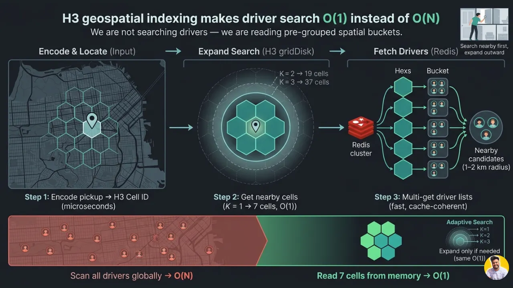
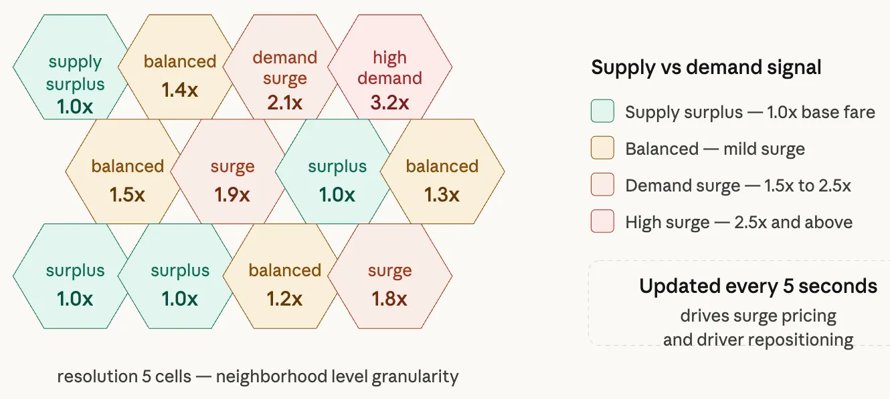
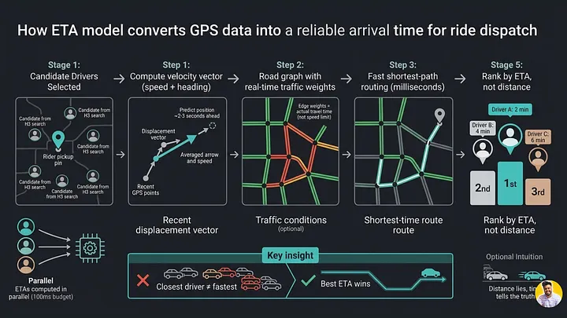
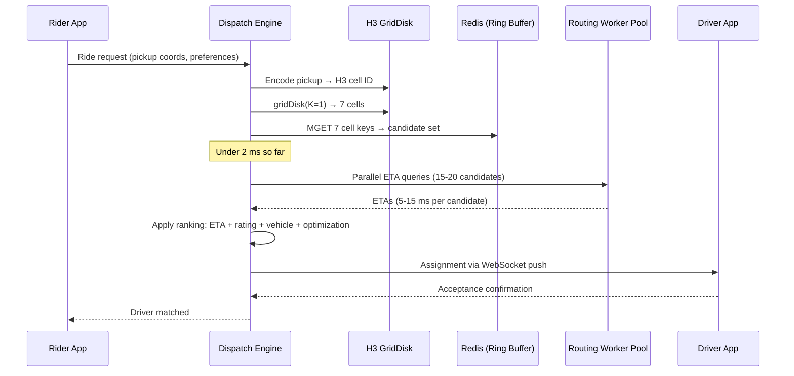
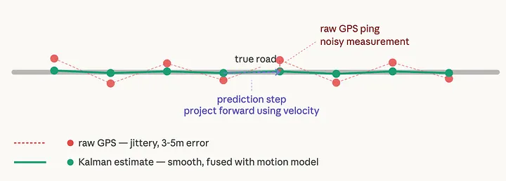
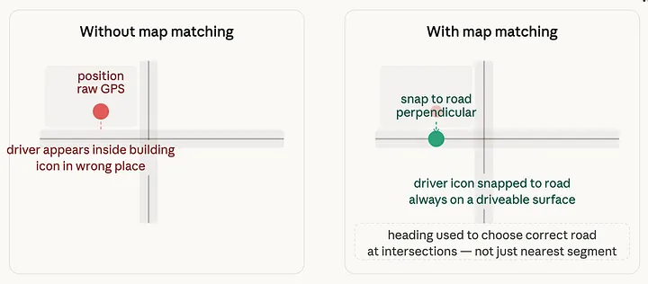

# Uber Architecture – Part 5: The Dispatch Engine and Map Rendering

*By Simranjeet Singh · 29 min read · Mar 30, 2026*

> **Source**: Originally published on [Medium — CodeToDeploy](https://medium.com/codetodeploy/uber-architecture-part-5-dispatch-engine-map-rendering)
> **Series**: [← Part 4: Ring Buffer & Cassandra](04-ring-buffer-and-cassandra-two-stores-one-stream.md)

---

**Real-time matching at scale. Every ride request is a race against a 100-millisecond clock.**

In [Part 4](04-ring-buffer-and-cassandra-two-stores-one-stream.md), we built two storage layers that together cover the full time spectrum of GPS data utility. Redis holds the present — the last 10 positions per driver, served in microseconds. Cassandra holds the past — every ping, stored durably for months. A single Kafka event feeds both simultaneously, through independent consumers that share nothing except the upstream stream.


Five layers of infrastructure now exist. Hundreds of engineering decisions have been made. 83,000 pings per second are being validated, routed, buffered, and stored — correctly, reliably, at a global scale.

**And yet the user has seen none of it.**

The user sees one thing: a small car icon on a map, gliding smoothly toward a pin.

Everything built so far was preparation for this moment. The dispatch engine that finds the right driver in under 100 milliseconds. The rendering pipeline that transforms noisy, discrete, delayed GPS data into something that looks smooth, continuous, and real.

This is the final part — where all six layers converge into the two experiences that make Uber work: **matching** and **rendering**.

Both are harder than they look. Both rely directly on the infrastructure built in the previous four parts. And both contain engineering decisions that are, in their own way, as elegant as anything in the layers below them.

---

## Series Overview

| Part | Title |
|------|-------|
| Part 1 | [Why Tracking 5 Million Drivers Every Second Is One of Tech's Hardest Problems](01-why-tracking-5-million-drivers-is-hard.md) |
| Part 2 | [The Ingestion Edge](02-the-ingestion-edge.md) |
| Part 3 | [Kafka Partitioning by Geography and the Hexagonal Grid](03-kafka-partitioning-geography-hex-grid.md) |
| Part 4 | [The Ring Buffer and Cassandra: Two Stores, One Stream](04-ring-buffer-and-cassandra-two-stores-one-stream.md) |
| Part 5 | **The Dispatch Engine and Map Rendering** |

---

## Layer 5: The Dispatch Engine

### Every Ride Request Is a Race Against a 100-Millisecond Clock

The moment you tap the Uber app and confirm a pickup, a timer starts inside Uber's infrastructure. The dispatch engine has roughly **100 milliseconds** to take your pickup coordinates, search through potentially thousands of nearby available drivers, evaluate each one on multiple signals, select the optimal match, and send an assignment to the winning driver's app.

Miss that window and the perceived latency of the app degrades. The loading spinner runs too long. The experience feels broken.

100 milliseconds sounds like a lot until you realize what has to happen inside it:

- Read current driver positions — changing at **83,000 updates per second** across the entire fleet
- Compute ETAs from each candidate driver to the pickup point — requiring **road graph traversal**, not just straight-line distance
- Apply eligibility filters: driver ratings, vehicle type matching, surge zone membership
- Do all of this for potentially dozens of candidate drivers **simultaneously**
- Handle thousands of concurrent ride requests arriving from across the city at the same moment

This is not a database query problem. This is a **real-time search problem**. And the distinction matters enormously for how you architect it.

---

### Why Naive Database Queries Fail Immediately

The first instinct — and the wrong one — is to model this as a SQL spatial query:

```sql
SELECT driver_id, lat, lng
FROM active_drivers
WHERE ST_Distance(location, pickup_point) < 2000
  AND status = 'available'
ORDER BY ST_Distance(location, pickup_point)
LIMIT 10;
```

This query has a fundamental problem at scale that no amount of indexing fully solves. It is a **radius scan across all active drivers**, comparing every driver's location to your pickup point. Even with a PostGIS spatial index, this is an O(log N) operation at best, where N is the total number of active drivers globally. During peak hours in a large city, N could be hundreds of thousands. The query plans well on a test database with 500 rows. It buckles under real production load.

More critically, spatial database queries have **unpredictable tail latency under write contention**. The active driver positions table is being written to at 83,000 updates per second. The read queries for dispatch are competing with those writes for database I/O. Under peak load — when you most need dispatch to be fast — the database is also most heavily written to. This contention causes the exact tail latency spikes that break the 100-millisecond budget.

> **Key insight**: The dispatch engine does not touch a database at all for the candidate search step. It operates entirely on data that already lives in memory.

---

### How H3 Makes the Search Problem Tractable

The key insight from Part 3 is that all driver position data in the ring buffer layer is already organized by **H3 cell**. Every driver's current position maps to a known H3 cell ID at the dispatch resolution. The Redis store is effectively a spatial index that was **built for free** as a side effect of the partitioning strategy.

When a ride request arrives, the dispatch engine performs three operations in immediate sequence:

| Step | Operation | Time |
|------|-----------|------|
| 1 | Encode pickup coordinates → H3 cell ID | A few microseconds |
| 2 | Compute `gridDisk` (K=1): center cell + 6 neighbors = 7 cells | O(1), microseconds |
| 3 | Redis `MGET` pipelined read for all 7 cell keys | Sub-millisecond |



The result: a candidate set containing **every available driver** within roughly one to two city blocks of the pickup point. The search went from *"scan all active drivers globally"* to *"read seven specific buckets from memory."* That is the difference between **O(N) and O(1)**.

#### Adaptive Ring Expansion

There is an important subtlety in how the ring size K is chosen:

| K | Cells | Use Case |
|---|-------|----------|
| 1 | 7 (center + 6 neighbors) | Dense urban rush hour — typically enough candidates |
| 2 | 19 | Medium density |
| 3 | 37 | Sparse suburban / late night |

In a dense urban center like Mumbai or Manhattan during evening rush hour, K=1 typically returns more than enough candidates. In a sparse suburban area at 3am, it might return zero. The dispatch engine handles this dynamically by **expanding K and retrying** if the initial query returns fewer than a minimum viable candidate count. Each expansion is still an O(1) H3 operation followed by a batched Redis read. The search radius grows adaptively without any change in algorithmic complexity.

> **Analogy**: Imagine you lost your keys somewhere in your house. You start by checking the room you were last in. If they're not there, you check the adjacent rooms. If still nothing, you expand to the whole floor. You don't search the entire house all at once from the beginning.

---

### The Supply and Demand Heatmap: The City as a Live Data Structure

The dispatch engine does not only react to ride requests as they arrive. It continuously maintains a city-wide picture of supply and demand that drives two of Uber's most important business systems: **surge pricing** and **driver repositioning**.

Every five seconds, a background aggregation process reads the current positions of all active drivers from the ring buffer layer, bucketed into H3 cells at a coarser resolution (typically resolution 5 or 6 — neighborhood-level granularity). For each cell, it computes:

1. Current driver count
2. Pending ride requests
3. The **ratio** between them = the supply-demand signal

| Condition | Signal | Action |
|-----------|--------|--------|
| Many drivers, few requests | **Excess supply** | Surge multiplier decreases |
| Few drivers, many requests | **Excess demand** | Surge multiplier increases |



The driver repositioning feature uses the same signal in the opposite direction. When a driver completes a trip and becomes available, the dispatch engine looks at the supply-demand heatmap and suggests nearby cells with high demand ratios as recommended destinations. The driver is not forced to go there — but the suggestion increases the probability that drivers move toward demand concentrations naturally, reducing wait times without requiring central command and control.

> **Analogy**: Think of the supply-demand heatmap as a weather map, except instead of temperature it shows driver scarcity. Just as a weather map lets you see at a glance where it's cold or hot, the heatmap lets the dispatch engine, the pricing engine, and the driver app all see at a glance where drivers are needed and where they are abundant.

At Uber's scale, the heatmap aggregation runs as a **streaming aggregation** over the same Kafka topics that feed the ring buffer layer. A Flink or Spark Streaming job consumes the GPS event stream, maintains per-cell driver counts in a stateful operator keyed by H3 cell ID, and emits updated cell-level aggregates to a separate Redis hash every five seconds. The surge pricing engine reads from that Redis hash, applies fare multiplier curves, and writes updated multipliers back to a configuration store. The latency from a real-world supply change to a fare multiplier update visible in the app is typically **10 to 20 seconds** end to end.

---

### Why the Dispatch Engine Reads from Redis and Never from Cassandra

This distinction is worth being explicit about because it's the point where many system design answers go wrong.

| | Cassandra | Redis |
|---|-----------|-------|
| **Role** | Durable, complete historical record | Real-time position cache |
| **Authority** | Ground truth — replicated, survives node failures | Ephemeral — opinionated, fast |
| **Read path** | MemTable → block cache → SSTables (potentially disk) | RAM only |
| **Read latency** | 1–5 ms (disk hit), 10+ ms under compaction | < 1 ms |
| **100ms budget?** | No — a single read could consume 20%+ | Yes — entire MGET fits easily |

Cassandra is not designed for the read pattern that dispatch requires. A dispatch query needs the current position of every driver in a geographic area, right now, with sub-millisecond read latency. Cassandra's read path involves checking the MemTable, checking the block cache, potentially reading from one or more SSTables on disk, and merging results across multiple storage levels.

Redis reads are a different class of operation entirely. Every read hits RAM, not disk. A Redis `MGET` fetching the position lists for seven H3 cells over a local network connection completes in **under a millisecond**.

The tradeoff is that Redis is not durable in the same sense as Cassandra. A Redis node restart without persistence flushes its data. But the dispatch engine doesn't care about historical positions. It only cares about **now**. If Redis loses its data during a brief outage, the ring buffers refill from incoming GPS pings within seconds. The dispatch engine experiences a brief degradation — not a permanent data loss.

> **Freshness always wins over durability when the data has a useful lifetime measured in seconds.**

---

### The ETA Model: From Three GPS Pings to a Number Your Rider Trusts

Once the dispatch engine has its candidate set from the Redis ring query, it needs to rank those candidates. The primary ranking signal is **ETA**: how long would it take each candidate driver to reach the rider's pickup point? A driver who is technically closer but stuck in traffic could have a worse ETA than a driver who is slightly farther away on a clear road.

Computing ETA accurately requires combining **three inputs**:

| Input | Source | Purpose |
|-------|--------|---------|
| **Velocity vector** | Last 3 GPS positions from Redis ring buffer | Current speed & heading; project position forward |
| **Road graph** | City street network as a directed weighted graph with live traffic edge weights | Actual travel time, not straight-line distance |
| **Routing algorithm** | Bidirectional Dijkstra with precomputed contraction hierarchies | Fastest path through the road graph |



#### The Velocity Vector

The dispatch engine reads the last three GPS positions for each candidate driver from Redis. Two consecutive position pairs give two displacement vectors. Averaging them yields a **smoothed instantaneous velocity**: current speed and heading.

#### The Road Graph

The road graph is a data structure that represents the city's street network as a directed weighted graph:

- **Nodes** = intersections
- **Edges** = road segments
- **Edge weights** = travel time (continuously updated with real-time traffic data from the aggregated movement of all active Uber drivers)

A road segment that 200 drivers traversed in the last 60 seconds with an average speed of 5 km/h has a very different weight than the same segment's posted speed limit would suggest.

#### The Routing Algorithm

Uber uses a **bidirectional version of Dijkstra's algorithm** with **precomputed contraction hierarchies** — a technique that preprocesses the road graph offline to dramatically accelerate online shortest-path queries. A query that would take several seconds on a raw road graph completes in milliseconds on a precomputed contraction hierarchy.

#### The Key Subtlety: Projected Position

The routing query does **not** start from the driver's current GPS position. It starts from the driver's **projected position**: where they will likely be by the time the dispatch system finishes its decision, the driver accepts the request, and starts navigating. Using the velocity vector to project forward by a small time delta (typically 2–3 seconds) means the ETA calculation is predicting travel time from a more accurate starting point.

The ETA for each candidate driver is computed **in parallel**, not sequentially. A single dispatch decision for one ride request may involve computing ETAs for 15–20 candidate drivers simultaneously, each requiring a road graph query. Uber maintains a pool of routing workers that handle these queries concurrently, with results collected and ranked within the 100-millisecond budget.

> **Analogy**: Think of the ETA model as a combination of a speedometer and a navigation app. The speedometer (derived from the last few GPS pings) tells you how fast the driver is moving and in what direction. The navigation app (powered by the road graph) tells you how long the fastest route to the pickup point will take given current traffic. The ETA is the navigation app's answer — but starting from where the driver will be in two seconds, not where they are right now.

The road graph itself is a data product maintained by a separate team at Uber. It is rebuilt from a combination of GPS trace analysis, map data providers, and manual edits, and is **versioned like software**. The routing engine loads a specific version of the contraction hierarchy at startup and hot-swaps to a new version during off-peak hours.

---

### The Full Dispatch Sequence, End to End

A single dispatch decision, from ride request arrival to driver assignment, unfolds in this sequence:



The entire process, from request arrival to driver confirmation, typically completes in **2 to 10 seconds of wall-clock time**, with the dispatch computation itself consuming **well under 100 milliseconds**.

> **Dispatch is a nearest-neighbor search constrained to a hexagonal neighborhood.** H3 turns "find me a driver" into "look in this box and its 6 neighbors." That is O(1) lookup, not O(N) scan. Every optimization in the layers below — the edge node, the geo-partitioned Kafka topics, the ring buffer, the Redis serving layer — exists specifically to make this single operation fast.

---

## Layer 6: Rendering on the Rider's Map

### The Carefully Constructed Lie

Five layers of infrastructure. Hundreds of engineering decisions. 83,000 writes per second processed, partitioned, buffered, matched, and dispatched. All of it exists to support one deceptively simple experience: a small car icon gliding smoothly toward a pin on a map.

> **That icon is a lie. A carefully constructed, mathematically rigorous, perceptually essential lie.**

The raw GPS data arriving from the driver's phone is **not** smooth. It is **not** accurate to the meter. It does **not** arrive at perfectly timed one-second intervals. It jitters, jumps, arrives late, arrives early, sometimes doesn't arrive at all. If the rider's app rendered raw GPS coordinates directly to the screen, the driver icon would twitch erratically, skip several meters sideways without warning, occasionally teleport half a block, and freeze whenever the driver passes through a building's GPS shadow.

This transformation is not cosmetic. It is a **signal processing problem**, and it is solved with real mathematics.

There are **four distinct techniques** working in concert inside the rider's app to produce the smooth animation you take for granted. Each one addresses a different failure mode of raw GPS rendering.

---

### Failure Mode One: GPS Noise and the Kalman Filter

Real GPS hardware on a consumer smartphone does not produce perfect coordinates. It produces estimates, based on trilateration from satellite signals that have traveled through atmosphere, bounced off nearby surfaces, and been processed by a chip optimized for battery efficiency rather than raw accuracy. The resulting position estimate carries an error that is typically **3 to 5 meters** under good conditions, and can reach **20 to 50 meters** in dense urban environments where signal multipath is severe.

At 3–5 meters of random error per ping, a driver traveling in a straight line at constant speed will appear to zigzag slightly on every update. The icon moves forward, then slightly left, then forward again, then slightly right. At normal map zoom levels for ride tracking, 3–5 meters of jitter is **perceptible** and looks wrong.



The standard solution in signal processing is the **Kalman filter**, developed by Rudolf Kalman in 1960 and used in everything from Apollo navigation computers to modern autopilot systems.

The intuition behind a Kalman filter is elegant: rather than trusting each new measurement at face value, it maintains a statistical model of what it believes the true state to be, and it **blends each new measurement with that belief** in proportion to how reliable each source is.

```
Kalman Filter = Prediction Step + Update Step
                     ↑                   ↑
              "Where I think          "How much do I
               you are now"          trust the new data?"
```

| Component | Description |
|-----------|-------------|
| **Position estimate** | The filter's best guess at where the driver actually is |
| **Covariance estimate** | How uncertain the filter is about that guess |
| **Prediction step** | Projects previous estimate forward using velocity & heading (physics-based) |
| **Update step** | Fuses new GPS measurement with prediction using **Kalman gain** |
| **Kalman gain** | High when measurement is trustworthy vs prediction; low when prediction is trustworthy |

Examples:
- Driver at constant speed on highway → reliable prediction → **low Kalman gain** → filter barely moves toward GPS reading
- Driver just made a sharp turn → unreliable prediction → **high Kalman gain** → filter moves substantially toward GPS reading

The specific variant used for GPS smoothing is typically a **linear Kalman filter** with a constant-velocity motion model. For vehicles that are accelerating, decelerating, or turning, a more accurate model is the **Extended Kalman Filter** (EKF) or **Unscented Kalman Filter** (UKF).

> **Analogy**: Imagine tracking a friend walking through a park via walkie-talkie every few seconds. You combine what they said with where you expected them to be based on their walking direction and speed. If the report seems consistent with your expectation, you adjust your belief slightly toward the report. If it seems wildly inconsistent, you trust your expectation more. That blending process is exactly what a Kalman filter does, formalized into mathematics.

---

### Failure Mode Two: The Gap Between Pings and Dead Reckoning

Even with Kalman filtering, there is still the problem of discreteness. GPS pings arrive at most once per second. At 40 km/h, a driver covers **11 meters per second**. If the rider's app only updated the driver icon once per second, the animation would be a series of discrete 11-meter jumps rather than smooth motion.

The solution is **dead reckoning**: between real GPS updates, the app locally simulates the driver's continued motion using the last known velocity vector.

| Step | Action |
|------|--------|
| 1 | Kalman filter produces a smoothed position estimate from the latest batch |
| 2 | App extracts current speed and heading from the estimate |
| 3 | Local animation loop runs at **60 frames per second** |
| 4 | Each frame advances the icon ~0.18 meters forward (at 40 km/h) |
| 5 | Motion is imperceptibly smooth — continuous glide, not discrete jumps |

When the next real GPS update arrives, the app computes the difference between where dead reckoning predicted the driver would be and where the Kalman-filtered measurement says they actually are:

- **Small difference** (normal GPS noise) → smooth correction over several frames, no snap
- **Large difference** (genuine direction change or GPS outage) → aggressive correction + velocity recalibration

> **Analogy**: A movie plays at 24 frames per second. The subject doesn't actually move between frames, but your brain fills in the gaps and perceives continuous motion. Dead reckoning does the same thing for the driver icon — 60 intermediate frames between real updates.

---

### Failure Mode Three: The Map-Matching Problem

Kalman filtering smooths the GPS noise. Dead reckoning fills the gaps between pings. But there is a third failure mode that neither technique fully addresses: GPS coordinates that land in **physically impossible places**.

| Problem | Example |
|---------|---------|
| Road offset | Kalman-filtered position sits 4 meters left of the actual road (inside a building) |
| Elevation ambiguity | Driver on a flyover appears to be on the surface road below |
| Corner cutting | Driver rounding a tight corner appears to cut diagonally across |



**Map matching** is the process of constraining the displayed driver position to the nearest plausible road segment. Rather than rendering the raw Kalman-filtered coordinate, the app queries a local road geometry model and finds the closest point on the closest road segment to the estimated position.

For straight roads, the snap is trivial: project the estimate perpendicularly onto the road line. For intersections and curves, the matching logic needs to consider which road segment is most consistent with the driver's heading and recent trajectory — not just which segment is geometrically nearest.

At Uber's scale, this matching logic runs **locally on the rider's device** rather than being computed server-side. The rider app ships with a compact local road geometry dataset covering the current city, sufficient for rendering-level snapping. The full routing-quality road graph used by the dispatch engine for ETA computation remains server-side.

> **Production detail**: Map matching at scale uses a **Hidden Markov Model** (HMM), not just simple perpendicular projection. The HMM treats the true road segment as a hidden state and the noisy GPS observation as an emitted observation. The **Viterbi algorithm** finds the most likely sequence of road segments. This is significantly more robust than single-point snapping at intersections and on parallel roads.

---

### Failure Mode Four: Network Latency and the Push Batching Strategy

The final rendering challenge is delivery latency. The total end-to-end latency from GPS chip firing to the rider's app receiving the coordinate is typically **200 to 800 milliseconds** under normal network conditions, and can spike higher during congestion.

If the server pushed every single GPS update to the rider's app as it arrived, two problems would emerge:

1. **Jitter**: Updates arrive at irregular intervals, causing dead reckoning correction to stutter
2. **Battery drain**: High-frequency event stream for dozens of visible drivers drains rider's battery

The **server-side batching strategy** addresses both:

| Aspect | Detail |
|--------|--------|
| **Accumulation** | WebSocket push server collects position updates for all drivers relevant to a given rider |
| **Cadence** | Single batched message at a fixed **one-second interval** |
| **Content** | Latest known position for each nearby driver |
| **Benefit** | Predictably uniform update intervals → stable dead reckoning |

The tradeoff: the rider's app is always seeing data that is **slightly stale** — the batch interval delay plus upstream processing latency. In practice, the displayed driver position lags real-world position by 200–800 milliseconds. Dead reckoning projects the icon forward to partially compensate, but cannot fully close a variable gap.

> **This is not a bug.** It is an explicit design choice: stable, predictable rendering at the cost of a sub-second display lag that human perception does not consciously register.

The WebSocket push server maintains a **per-rider subscription** — a set of driver IDs whose positions the rider is currently tracking. This subscription changes as the ride progresses:

| Phase | Subscription |
|-------|-------------|
| Before pickup | Rider tracks their assigned driver |
| During ride | Tracking display shifts to ETA at destination |
| After drop-off | Subscription is cancelled |

The subscription model means the push server does **not** broadcast all driver positions globally. It computes a relevance set per rider and only pushes positions within that set.

---

### All Four Techniques Together: The Rendering Stack

No single technique is sufficient on its own. Together, they form a rendering stack where each layer hands off its output to the next:

| Technique | Solves | Limitation |
|-----------|--------|------------|
| **Kalman Filter** | GPS noise/jitter | Doesn't fill gaps between pings |
| **Dead Reckoning** | Gaps between pings (discreteness) | Drifts without correction |
| **Map Matching** | Off-road coordinate errors | Doesn't smooth noise or fill gaps |
| **Server-Side Batching** | Delivery cadence & jitter | Introduces 200–800ms staleness |

The complete rendering pipeline:

```
Server batch (1s interval) → WebSocket push → Rider app receives
  → Kalman filter smooths → Map matching snaps to road
    → Dead reckoning loop animates at 60fps
      → Icon glides smoothly until next batch arrives
```

The icon you see on screen is the output of this entire pipeline: rendered 60 times per second, updated with real data once per second, **never directly reflecting a raw GPS coordinate** at any point in its journey from driver's phone chip to your screen.

> **What you see on your Uber map is not reality.** It is a prediction, smoothed by a Kalman filter, animated by dead reckoning, and snapped to a road graph. Reality arrives 200 milliseconds later. The rendering stack displays a mathematically justified estimate of what is happening right now, constructed from what happened 200 milliseconds ago.

---

## The Full Stack in One Breath

From GPS chip to gliding icon, the complete picture. **One second. Here is everything that happened inside it:**

```
GPS chip fires → WebSocket → Regional Edge Node (validate, dedup, <2ms)
  → Kafka (H3 cell partition key, geo-routed)
    → Redis Ring Buffer: last 10 positions, TTL refresh
    → Cassandra: (driver_id, date_bucket) + timestamp, LOCAL_QUORUM, LSM sequential write
      → Dispatch Engine: H3 encode pickup → gridDisk(7 cells) → Redis MGET (<1ms)
        → Parallel ETA: velocity vectors + live traffic road graph + contraction hierarchies
          → Rank & assign → WebSocket push to driver
            → Push Server: 1-second batched update → Rider app
              → Kalman filter → Map match → Dead reckoning (60fps) → Smooth icon
```

**Total elapsed time**: 200–800 milliseconds from GPS chip to icon update on your screen.

**Total engineering required**: six distinct layers, each solving a problem the others cannot.

---

## The Six Layers, Side by Side


| Layer | Problem It Solves | Technology | Deliberate Tradeoff |
|-------|------------------|------------|-------------------|
| **1. Ingestion Edge** | Raw pings contain garbage (malformed, duplicates, impossible coords) | WebSocket/TCP, stateless regional nodes | No local durability — data exists only in transit |
| **2. Kafka + H3** | Dispatch needs all drivers in an area, not one driver's history | Kafka, H3 hexagonal grid | Dual-publish overhead at cell boundaries |
| **3. Ring Buffer** | Dispatch needs sub-ms reads; Cassandra is too slow for real-time | Redis, capped linked list per driver | Only 10 pings of history; data lost on restart |
| **4. Cassandra** | Analytics needs durable, queryable history | Cassandra, LSM trees, time-partitioned | Write amplification from compaction |
| **5. Dispatch Engine** | Matching riders to drivers in <100ms | H3 gridDisk, Redis MGET, parallel routing pool | Ring expansion in sparse areas adds latency |
| **6. Map Rendering** | Raw GPS is noisy, discrete, and delayed | Kalman filter, dead reckoning, map matching, batching | 200–800ms display lag behind real-world position |

Read the tradeoffs column carefully — that column is where the **real engineering lives**. Every layer accepted a deliberate limitation. None of these are accidents or oversights. They are conscious choices where the engineers looked at the tradeoff and decided the benefit was worth the cost.

---

## The Meta-Lesson: Decomposition Is the Architecture

There is a pattern in how senior engineers at companies like Uber talk about large-scale systems that junior engineers sometimes mistake for false modesty. When you ask how Uber tracks 5 million GPS pings per minute, the honest answer is not *"we use Kafka"* or *"we use Cassandra"* or *"we use H3."* The honest answer is that there is **no single technology** that solves this problem.

> **The architecture is the composition. The insight is the decomposition.**

Every layer in this system was built because the previous layer created a handoff point — a clean output that became another layer's clean input — and at that handoff point someone asked *"what is the hardest sub-problem that starts here?"* and built something specific for it.

| Layer | Why It Exists |
|-------|--------------|
| **Edge Node** | Kafka topic should never receive malformed data |
| **Geo-Partition** | Dispatch engine should never do cross-partition scatter-gather |
| **Ring Buffer** | Cassandra should never be in the critical path of a real-time query |
| **Dispatch Engine** | Rider's app should never compute nearest-neighbor search itself |
| **Rendering** | WebSocket push layer should never think about smoothness or GPS noise |

**Each layer is a gift to the layer that comes after it.**

> **Analogy**: Think of a professional kitchen brigade. There is a person who preps the ingredients. A different person who controls the heat. A different person who plates the dish. A different person who runs it to the table. No single person does everything. Each role is optimized for exactly what it does and hands off cleanly to the next. Uber's GPS architecture is a kitchen brigade. The output — a smooth gliding icon on your map — is the dish.

The decomposition pattern described here has a name in distributed systems literature: **Staged Event-Driven Architecture (SEDA)**, proposed by Matt Welsh in 2001. SEDA argues that complex systems should be decomposed into a network of stages connected by queues, where each stage is independently tunable and can shed load gracefully under pressure. Kafka is the queue. Each processing layer is a stage.

---

## Final Thoughts

Every smooth map animation you have ever watched — the little car gliding toward you on a Saturday night, the delivery icon rounding the corner two streets away, the friend's location pin drifting along a highway — **none of it is real**.

It is a prediction, fused from noisy satellite signals, smoothed by a filter invented for moon landings, projected forward by dead reckoning, snapped to a road that the GPS never actually touched, batched by a server, pushed through a WebSocket, and rendered 60 times per second on a screen that refreshes faster than your eyes can resolve.

> **Reality is 200 milliseconds behind. It always has been.**

What you see is not where the driver is. It is where six layers of distributed systems, working silently in concert, have calculated the driver **probably is, right now**, given everything they knew 200 milliseconds ago.

The deeper principle behind all of it is simpler and more durable than any specific technology:

> **When a problem seems impossibly large, it is usually because you are looking at it as one problem. Break it into the smallest problem that a single excellent system can solve completely, build that system, define its output contract precisely, and hand off to the next layer. Repeat until the original problem is solved.**

That is what separates a system that works in a demo from a system that works at 5 million pings per minute.

**It is a beautiful lie. And the fact that you never noticed it is the highest compliment you can pay to the engineers who built it.**

---

## A Question to Carry Forward

Uber solved GPS tracking at meter-level accuracy. But self-driving cars need **centimeter-level accuracy** — in real time, in the rain, in a tunnel, at 100 km/h. What comes after GPS? How do systems like LiDAR, HD maps, and sensor fusion push location tracking to the next order of magnitude of precision? And what new layers of architecture does that level of accuracy demand?

---

*Originally published by Simranjeet Singh on [Medium — CodeToDeploy](https://medium.com/codetodeploy).*

> **Source URL**: [Part 5](https://medium.com/codetodeploy/uber-architecture-part-5-dispatch-engine-map-rendering)
>
> **Taxonomy Reference**: §2.1 Application Architecture Patterns, §3.3 Event-Driven & Messaging Architecture  
> **General Pattern**: [CQRS & Event Sourcing](../../../architecture-general/02-application-software-architecture/), [Real-Time Data Processing](../../../architecture-general/04-data-analytics-ai-architecture/)  
> **Azure Implementation**: See [Azure Cache for Redis](../../../architecture-azure/data/redis/), [Azure Cosmos DB](../../../architecture-azure/data/databases/) (Cassandra API), [Event Hubs](../../../architecture-azure/integration/event-hubs/), [Azure Maps](https://azure.microsoft.com/en-us/products/azure-maps/), and [Azure Kubernetes Service](../../../architecture-azure/compute/aks/)
