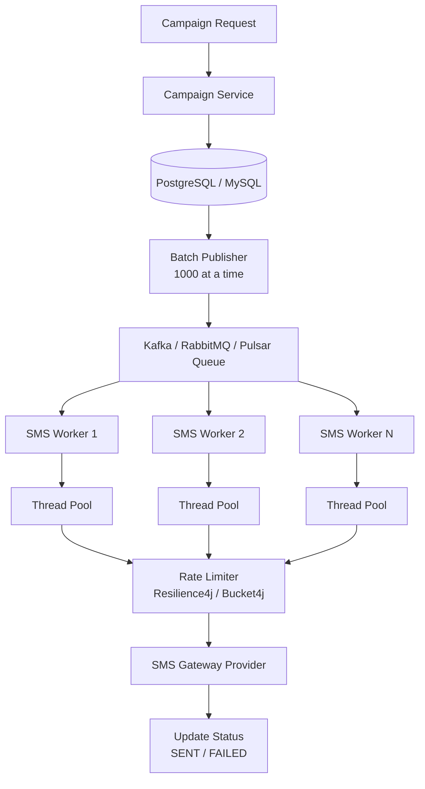

# How Would You Design a Thread Pool to Send 10 Million SMS Messages in One Hour

> ***"You call this thread pool tuning?"** *

That one sentence completely changed how I think about concurrency.

I thought I knew Java thread pools. I knew the difference between `corePoolSize` and `maximumPoolSize`. I knew every `RejectedExecutionHandler`. I had used `Executors.newFixedThreadPool()` dozens of times.

Then came the interview.

## The Interview Question

The interviewer asked:

> ***"We need to send 10 million marketing SMS messages within one hour. How would you design the thread pool?"** *

My immediate answer was:

- 10 million / 3600 seconds ≈ **2778 messages/sec**
- Create a `FixedThreadPool`
- Increase threads to 500
- Increase queue size
- Done.

The interviewer smiled. Then destroyed my answer with three questions:

> ***1. Your FixedThreadPool uses an unbounded LinkedBlockingQueue. What happens when millions of tasks are queued?** *
>
> ***2. If the SMS gateway becomes slow or unavailable, how do you prevent OutOfMemoryError?** *
>
> ***3. If the application crashes after processing only 8 million messages, how do you guarantee the remaining 2 million are still delivered?** *

At that moment I realized: this wasn't a thread pool question. It was a **distributed systems and resource management** question.

## The Biggest Mistake Developers Make

Many developers still write something like this:

```java
ExecutorService executor =
    Executors.newFixedThreadPool(500);
```

Looks harmless. It isn't.

Internally this creates:

```java
new LinkedBlockingQueue<>();
```

which is essentially `Integer.MAX_VALUE` capacity. If your producer keeps generating tasks faster than workers consume them, millions of tasks accumulate in memory. Eventually:

```java
java.lang.OutOfMemoryError
```

Game over.

## Why Executors Are Discouraged in Production

The Java concurrency utilities are excellent. The convenience factory methods are not.

Production systems should **always** create `ThreadPoolExecutor` manually.

```java
ThreadPoolExecutor executor =
        new ThreadPoolExecutor(
                16,
                64,
                60,
                TimeUnit.SECONDS,
                new ArrayBlockingQueue<>(5000),
                new ThreadPoolExecutor.CallerRunsPolicy()
        );
```

Now you control:

- Core threads
- Maximum threads
- Queue capacity
- Rejection strategy
- Thread factory

Everything is explicit.

## Step 1 — Calculate the Initial Thread Count

One mistake interviewers hate is hearing numbers like "Use 300 threads" with no justification.

Instead, classify the workload. Sending SMS is primarily:

- Network I/O
- Waiting for gateway response
- Very little CPU work

This makes it an **I/O-bound** workload.

The commonly used sizing formula is:

```text
Threads = CPU Cores × Target CPU Utilization × (1 + Wait Time / Compute Time)
```

Example — Machine with:

- 16 CPU cores
- CPU utilization target = 80%
- Wait/Compute ratio = 8

```text
16 × 0.8 × (1 + 8) ≈ 115 threads
```

This is only the **starting point**. Real production values should always come from **load testing**, not guesses.

## Step 2 — Never Push Millions of Tasks Into Memory

This is where many systems fail.

**Bad architecture:**

```text
Database
      ↓
Load 10 Million Records
      ↓
Create 10 Million Runnable Objects
      ↓
Submit All → Memory explodes
```

**Better approach — batching:**

```text
Database
      ↓
Fetch 1000 Rows
      ↓
Submit to Thread Pool
      ↓
Wait
      ↓
Fetch Next 1000
```

```java
while (true) {
    List<SmsTask> batch =
            repository.fetchBatch(1000);
    if (batch.isEmpty()) {
        break;
    }
    for (SmsTask task : batch) {
        executor.execute(() ->
                smsService.send(task));
    }
}
```

Only a small number of tasks stay in memory at any time.

## Step 3 — Choose the Right Queue

For batch processing, a bounded queue is usually the safest option:

```java
BlockingQueue<Runnable> queue =
        new ArrayBlockingQueue<>(5000);
```

**Queue type comparison:**

| Queue Type | Capacity | When to Use | Risk |
|:---|:---|:---|:---|
| `LinkedBlockingQueue` (default) | Unbounded (`Integer.MAX_VALUE`) | Never in production | OutOfMemoryError |
| `ArrayBlockingQueue` | Fixed, bounded | Batch processing, controlled memory | Tasks rejected when full |
| `SynchronousQueue` | Zero — hand-off only | Real-time, direct hand-off | Requires immediate consumer availability |
| `PriorityBlockingQueue` | Unbounded | Prioritized task execution | Memory risk + ordering overhead |

## Step 4 — Rejection Policy Matters More Than Thread Count

When the queue becomes full, what should happen? Java provides four built-in strategies:

### AbortPolicy

Throws `RejectedExecutionException`. Good for testing, terrible for large batch jobs.

### DiscardPolicy

Silently drops tasks. Almost never acceptable in production.

### DiscardOldestPolicy

Removes older tasks from the queue. Dangerous for SMS — older messages disappear.

### CallerRunsPolicy (Recommended for batch)

```java
new ThreadPoolExecutor.CallerRunsPolicy()
```

When the queue is full, instead of rejecting work, the **producer thread executes the task itself**. This naturally slows task generation:

```text
Producer → Queue Full → Producer Sends SMS → Producer Can't Produce More
```

This creates **automatic backpressure** — no extra code required.

### But Don't Use CallerRunsPolicy Everywhere

**Great for:**
- Offline batch jobs
- Scheduled processing
- Data migration
- Report generation
- SMS campaigns

**Terrible for:**
- REST APIs
- Spring MVC controllers
- Web requests

If Tomcat threads begin executing SMS work, they stop accepting HTTP requests — your website freezes. Context matters.

## Step 5 — Dynamic Thread Pools

Traffic isn't constant. SMS gateways may suddenly slow down. Hardcoded thread counts become useless.

Modern production systems integrate with configuration centers like Nacos, Apollo, or Spring Cloud Config. Instead of hardcoding `corePoolSize = 32`, operations teams can adjust parameters without redeploying.

Several mature open-source libraries support this:

- **DynamicTp** — Runtime thread pool tuning with dashboards and alerting
- **Hippo4J** — Dynamic thread pool management with monitoring

## Step 6 — Monitor Everything

A thread pool without monitoring is a time bomb. Important metrics include:

- Active thread count
- Queue utilization (%)
- Task completion rate
- Rejection count
- Average execution time
- SMS gateway latency
- Error rate

```java
ThreadPoolExecutor pool = ...

System.out.println(pool.getActiveCount());
System.out.println(pool.getQueue().size());
System.out.println(pool.getCompletedTaskCount());
```

Expose these metrics through **Micrometer** and visualize them in **Prometheus** and **Grafana**.

**Set alerts when:**
- Queue exceeds 80%
- Rejections occur
- Gateway latency spikes
- Thread utilization stays at 100%

## Step 7 — Prevent Task Loss

Suppose the JVM crashes. Two million SMS messages remain unsent. If tasks exist only in memory, they disappear forever.

Production systems should maintain **task state** in a durable store:

```text
PENDING → PROCESSING → SENT
```

Before sending:

```sql
UPDATE sms SET status = 'PROCESSING' WHERE id = ?;
```

After success:

```sql
UPDATE sms SET status = 'SENT' WHERE id = ?;
```

A scheduled recovery job periodically scans for:

```sql
SELECT * FROM sms
WHERE status = 'PROCESSING'
AND updated_at < NOW() - INTERVAL '10 minutes';
```

Those records are retried. No SMS is permanently lost.

## The Better Architecture (Recommended)

A thread pool alone should **not** be responsible for handling 10 million messages. A production-grade architecture decouples ingestion, processing, persistence, and rate limiting.



### Why this architecture is better

Instead of loading millions of tasks into memory:

- Tasks are **persisted first** — no data loss on crash
- A **message broker** buffers traffic and provides durability
- Multiple **workers process tasks independently** — horizontal scaling
- Failed messages remain **durable** in the broker
- **Backpressure** is naturally handled by the queue
- The SMS provider is protected using **rate limiting**

This approach is significantly more resilient than relying on a single application's thread pool.

## Example Worker Implementation

```java
ThreadPoolExecutor executor =
        new ThreadPoolExecutor(
                16,
                64,
                60,
                TimeUnit.SECONDS,
                new ArrayBlockingQueue<>(5000),
                new ThreadPoolExecutor.CallerRunsPolicy()
        );

while (true) {
    SmsTask task = queueConsumer.receive();
    executor.execute(() -> {
        try {
            smsGateway.send(task);
            repository.markSent(task.id());
        } catch (Exception ex) {
            repository.markFailed(task.id());
        }
    });
}
```

## Handling Multiple Servers

Suppose you have five application servers. How do you prevent duplicate SMS delivery?

One approach is **task claiming**:

```sql
UPDATE sms_tasks
SET status = 'PROCESSING',
    worker = 'server-3'
WHERE id = ?
AND status = 'PENDING';
```

If zero rows are updated, another worker already owns the task. This guarantees only one server processes each SMS.

For large-scale systems, message brokers like **Kafka** make this even easier by assigning partitions to consumers, ensuring each message is processed by only one consumer in a consumer group.

## Key Takeaways for Interviews

If asked this question again, the answer would be:

> *"I wouldn't solve this problem by simply increasing the thread count. Sending 10 million SMS messages is a reliability and scalability problem, not just a concurrency problem.*
>
> *I would use a manually configured `ThreadPoolExecutor` with a bounded queue, calculate an initial thread count using the I/O-bound sizing formula, apply `CallerRunsPolicy` for natural backpressure in offline processing, continuously monitor thread pool metrics, persist task states to prevent data loss, and, for production, decouple the system with a durable message broker like Kafka or RabbitMQ.*
>
> *This architecture supports horizontal scaling, controlled throughput, retries, and exactly-once task ownership while protecting both the JVM and the SMS gateway."*

## Final Thoughts

The biggest lesson wasn't about thread pools. It was about **thinking beyond code**.

Anyone can increase the thread count. Senior engineers think about:

- Resource limits
- Backpressure
- Failure recovery
- Observability
- Scalability
- Reliability
- Distributed coordination

In real-world systems, thread pools are just one component of a much larger architecture. The best engineers don't optimize for **maximum throughput** — they optimize for **predictable, reliable throughput** under real production constraints.

> **Source**: [Medium — Umesh Kumar Yadav](https://medium.com/@umeshcapg/interviewer-how-would-you-design-a-thread-pool-to-send-10-million-sms-messages-in-one-hour-04c69e1d4e1c)
