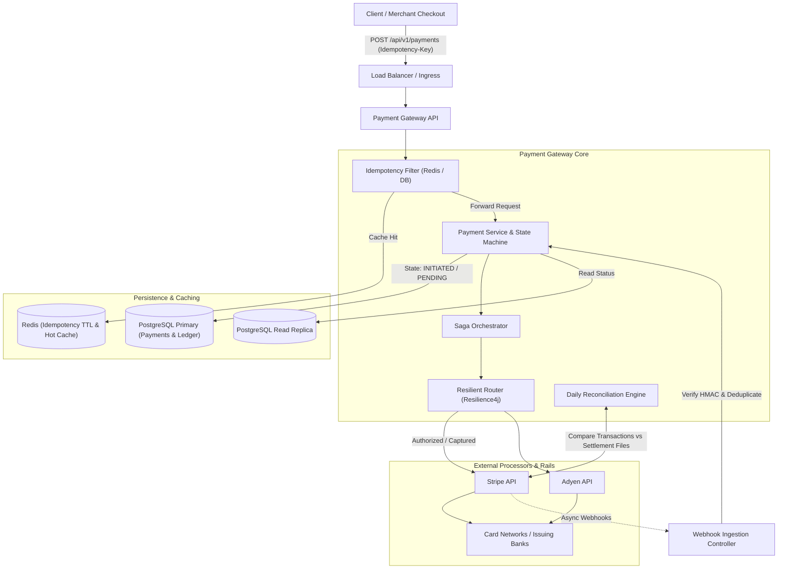

# System Design: Build a Stripe-Style Payment Gateway (Real Spring Boot Code)

> **Source**: <https://medium.com/@hianupamsinha/system-design-build-a-stripe-style-payment-gateway-real-spring-boot-code-09864252375c>  
> **Author**: Anupam Sinha  
> **Published**: 2026-09-12  
> **Takeaways**: [Stripe-Style Payment Gateway — Key Takeaways](../../system-design-architecture/cqrs-fintech/stripe-payment-gateway-takeaways.md)

---

Design and implement a payment gateway from scratch. Covers idempotency, retry logic with exponential backoff, webhook handling, distributed transactions using the saga pattern, payment status state machine, and reconciliation — all with working Spring Boot code.

## The Problem

In payments, a single bug means you either charge someone twice or lose money you can’t get back — and the interviewer knows it. That’s why payment gateway design is a top-3 fintech system design question: it tests consistency guarantees, failure handling, distributed state, and security all at once. Most articles stop at a whiteboard box labelled “Payment Service.” This one shows the actual patterns I run in production for a Singapore fintech processing thousands of transactions a day.

We’ll cover:

- High-level architecture
- Payment status state machine
- Idempotency implementation
- Retry logic with exponential backoff
- Webhook processing
- Distributed transactions with the Saga pattern
- Reconciliation

## Requirements

### Functional Requirements

1 — Process payments (charge, authorise, capture, refund)

2 — Support multiple payment methods (card, bank transfer, wallet)

3 — Idempotent payment processing (same request never charged twice)

4 — Webhook notifications to merchants

5 — Transaction history and reporting

6 — Refund processing (full and partial)

### Non-Functional Requirements

1 — Exactly-once payment execution (never double-charge)

2–99.99% availability for payment processing

3 — Sub-second latency for payment authorisation

4 — Strong consistency for payment state

5 — Audit trail for every state transition

6 — PCI-DSS compliance considerations

## High-Level Architecture

A production payment gateway sits between client applications (merchant checkouts, mobile apps) and downstream payment processors or acquiring banks (Stripe, Adyen, card networks). The gateway coordinates end-to-end payment lifecycles, enforces strict idempotency guarantees, abstracts diverse processor APIs, safeguards against transient network interruptions, and processes asynchronous webhook callbacks with deterministic consistency.



## Payment Status State Machine

The state machine is the heart of any payment system. Getting this wrong means inconsistent state, double charges, or lost money.

```text
┌──────────┐
        │ INITIATED│
        └────┬─────┘
             │ validate()
             ▼
       ┌──────────┐
┌───── │ PENDING  │ ─────┐
│      └────┬─────┘      │
│           │            │ fail()
│           │ authorize()│
│           ▼            ▼
│      ┌──────────┐  ┌────────┐
│      │AUTHORIZED│  │ FAILED │
│      └────┬─────┘  └────────┘
│           │
│           │ capture()
│           ▼
│      ┌──────────┐
│      │ CAPTURED │
│      └────┬─────┘
│           │
│           │ refund()
│           ▼
│      ┌──────────┐
└─────▶│ REFUNDED │
       └──────────┘
```

### State Machine Implementation

```java
public enum PaymentStatus {
    INITIATED,
    PENDING,
    AUTHORIZED,
    CAPTURED,
    FAILED,
    REFUNDED,
    PARTIALLY_REFUNDED;

private static final Map<PaymentStatus, Set<PaymentStatus>> VALID_TRANSITIONS = Map.of(
        INITIATED, Set.of(PENDING, FAILED),
        PENDING, Set.of(AUTHORIZED, FAILED),
        AUTHORIZED, Set.of(CAPTURED, FAILED, REFUNDED),
        CAPTURED, Set.of(REFUNDED, PARTIALLY_REFUNDED),
        PARTIALLY_REFUNDED, Set.of(REFUNDED, PARTIALLY_REFUNDED)
    );
    public boolean canTransitionTo(PaymentStatus target) {
        Set<PaymentStatus> allowed = VALID_TRANSITIONS.get(this);
        return allowed != null && allowed.contains(target);
    }
    public PaymentStatus transitionTo(PaymentStatus target) {
        if (!canTransitionTo(target)) {
            throw new InvalidStateTransitionException(
                "Cannot transition from %s to %s".formatted(this, target));
        }
        return target;
    }
}
```

### Payment Entity

```java
@Entity
@Table(name = "payments")
@EntityListeners(AuditingEntityListener.class)
public class Payment {
    @Id
    @GeneratedValue(strategy = GenerationType.UUID)
    private UUID id;
    @Column(nullable = false, unique = true)
    private String idempotencyKey;
    @Column(nullable = false)
    private String merchantId;
    @Column(nullable = false)
    private Long amountInCents;
    @Column(nullable = false, length = 3)
    private String currency;
    @Enumerated(EnumType.STRING)
    @Column(nullable = false)
    private PaymentStatus status;
    @Enumerated(EnumType.STRING)
    @Column(nullable = false)
    private PaymentMethod paymentMethod;
    private String processorTransactionId;
    private String failureReason;
    private String failureCode;
    @Column(nullable = false)
    private Long refundedAmountInCents = 0L;
    @CreatedDate
    private Instant createdAt;
    @LastModifiedDate
    private Instant updatedAt;
    @Version
    private Long version; // Optimistic locking
    @OneToMany(mappedBy = "payment", cascade = CascadeType.ALL)
    @OrderBy("createdAt ASC")
    private List<PaymentStatusHistory> statusHistory = new ArrayList<>();
    public void transitionTo(PaymentStatus newStatus, String reason) {
        PaymentStatus previous = this.status;
        this.status = previous.transitionTo(newStatus);
        // Record history for audit trail
        statusHistory.add(new PaymentStatusHistory(
            this, previous, newStatus, reason, Instant.now()));
    }
}
```

## Idempotency — The Most Critical Piece

Idempotency ensures that if a client retries a payment request (due to timeout, network failure, etc.), the payment is only processed once.

### The Idempotency Key Strategy

```java
@Entity
@Table(name = "idempotency_keys")
public class IdempotencyRecord {
    @Id
    private String idempotencyKey;
    @Column(nullable = false)
    private String requestHash; // SHA-256 of request body
    @Enumerated(EnumType.STRING)
    private IdempotencyStatus status; // IN_PROGRESS, COMPLETED, FAILED
    @Column(columnDefinition = "jsonb")
    private String responseBody;
    private Integer responseStatusCode;
    private Instant createdAt;
    private Instant expiresAt; // TTL for cleanup
    @Version
    private Long version;
}
public enum IdempotencyStatus {
    IN_PROGRESS,
    COMPLETED,
    FAILED
}
```

### Idempotency Filter

```java
@Component
@RequiredArgsConstructor
@Order(1) // Execute before other filters
public class IdempotencyFilter extends OncePerRequestFilter {
    private final IdempotencyService idempotencyService;
    private final ObjectMapper objectMapper;
    @Override
    protected void doFilterInternal(HttpServletRequest request,
                                     HttpServletResponse response,
                                     FilterChain chain) throws ServletException, IOException {
        String idempotencyKey = request.getHeader("Idempotency-Key");
        // Only apply to payment creation endpoints
        if (idempotencyKey == null || !isPaymentEndpoint(request)) {
            chain.doFilter(request, response);
            return;
        }
        // Read and cache request body
        CachedBodyHttpServletRequest cachedRequest = new CachedBodyHttpServletRequest(request);
        String requestHash = computeHash(cachedRequest.getBody());
        Optional<IdempotencyRecord> existing = idempotencyService
            .findByKey(idempotencyKey);
        if (existing.isPresent()) {
            handleExistingKey(existing.get(), requestHash, response);
            return;
        }
        // Attempt to claim the idempotency key
        boolean claimed = idempotencyService.claimKey(idempotencyKey, requestHash);
        if (!claimed) {
            // Another request is already processing this key
            response.setStatus(HttpStatus.CONFLICT.value());
            response.getWriter().write(
                "{\"error\": \"Request with this idempotency key is already being processed\"}");
            return;
        }
        // Process the request and capture the response
        ContentCachingResponseWrapper responseWrapper =
            new ContentCachingResponseWrapper(response);
        try {
            chain.doFilter(cachedRequest, responseWrapper);
            // Store the response for future replay
            idempotencyService.completeKey(
                idempotencyKey,
                responseWrapper.getStatus(),
                new String(responseWrapper.getContentAsByteArray())
            );
            responseWrapper.copyBodyToResponse();
        } catch (Exception e) {
            idempotencyService.failKey(idempotencyKey);
            throw e;
        }
    }
    private void handleExistingKey(IdempotencyRecord record,
                                    String requestHash,
                                    HttpServletResponse response) throws IOException {
        // Verify the request body matches (prevent misuse of idempotency keys)
        if (!record.getRequestHash().equals(requestHash)) {
            response.setStatus(HttpStatus.UNPROCESSABLE_ENTITY.value());
            response.getWriter().write(
                "{\"error\": \"Idempotency key already used with different request body\"}");
            return;
        }
        switch (record.getStatus()) {
            case COMPLETED -> {
                // Replay the original response
                response.setStatus(record.getResponseStatusCode());
                response.setContentType("application/json");
                response.getWriter().write(record.getResponseBody());
            }
            case IN_PROGRESS -> {
                response.setStatus(HttpStatus.CONFLICT.value());
                response.getWriter().write(
                    "{\"error\": \"Request is still being processed\"}");
            }
            case FAILED -> {
                // Allow retry on failed requests
                response.setStatus(HttpStatus.CONFLICT.value());
                response.getWriter().write(
                    "{\"error\": \"Previous attempt failed, please use a new idempotency key\"}");
            }
        }
    }
    private String computeHash(byte[] body) {
        return Hex.toHexString(
            MessageDigest.getInstance("SHA-256").digest(body));
    }
}
```

### Database-Level Idempotency (Belt and Suspenders)

Even with the filter, we add database-level protection:

```java
@Service
@RequiredArgsConstructor
public class PaymentService {
    private final PaymentRepository paymentRepository;
    private final PaymentRouter paymentRouter;
    private final PaymentEventPublisher eventPublisher;
    @Transactional
    public PaymentResponse processPayment(PaymentRequest request) {
        // Double-check: has this idempotency key been processed?
        Optional<Payment> existing = paymentRepository
            .findByIdempotencyKey(request.idempotencyKey());
        if (existing.isPresent()) {
            return toResponse(existing.get());
        }
        // Create payment record FIRST (marks intent)
        Payment payment = Payment.builder()
            .idempotencyKey(request.idempotencyKey())
            .merchantId(request.merchantId())
            .amountInCents(request.amountInCents())
            .currency(request.currency())
            .paymentMethod(request.paymentMethod())
            .status(PaymentStatus.INITIATED)
            .build();
        payment = paymentRepository.save(payment);
        payment.transitionTo(PaymentStatus.PENDING, "Payment initiated");
        return toResponse(paymentRepository.save(payment));
    }
}
```

## Retry Logic with Exponential Backoff

When calling external payment processors (Stripe, Adyen, etc.), network failures happen. Retry logic must be careful: retry reads, never blindly retry charges.

```java
@Service
@RequiredArgsConstructor
@Slf4j
public class PaymentProcessorClient {
    private final RestClient restClient;
    private final RetryTemplate retryTemplate;
    @Bean
    RetryTemplate paymentRetryTemplate() {
        return RetryTemplate.builder()
            .maxAttempts(3)
            .exponentialBackoff(
                Duration.ofMillis(500),  // initial interval
                2.0,                      // multiplier
                Duration.ofSeconds(5)     // max interval
            )
            .retryOn(TransientPaymentException.class)
            .notRetryOn(List.of(
                PaymentDeclinedException.class,      // Don't retry declines
                InvalidPaymentRequestException.class, // Don't retry bad requests
                FraudDetectedException.class          // Don't retry fraud blocks
            ))
            .build();
    }
    public ProcessorResponse chargePayment(ProcessorChargeRequest request) {
        return retryTemplate.execute(context -> {
            int attempt = context.getRetryCount() + 1;
            log.info("Payment charge attempt {}/3 for idempotency_key={}",
                attempt, request.idempotencyKey());
            try {
                ResponseEntity<ProcessorResponse> response = restClient.post()
                    .uri("/v1/charges")
                    .header("Idempotency-Key", request.idempotencyKey())
                    .body(request)
                    .retrieve()
                    .toEntity(ProcessorResponse.class);
                return response.getBody();
            } catch (HttpClientErrorException e) {
                if (e.getStatusCode() == HttpStatus.TOO_MANY_REQUESTS) {
                    throw new TransientPaymentException("Rate limited", e);
                }
                if (e.getStatusCode().is4xx()) {
                    // Client errors are not retryable
                    throw new InvalidPaymentRequestException(e.getResponseBodyAsString());
                }
                throw new TransientPaymentException("Processor error", e);
            } catch (ResourceAccessException e) {
                // Network timeout - retryable
                throw new TransientPaymentException("Network timeout", e);
            }
        });
    }
}
```

## Circuit Breaker for Processor Failures

```java
@Service
public class ResilientPaymentRouter {
    private final CircuitBreakerRegistry circuitBreakerRegistry;
    private final Map<String, PaymentProcessorClient> processors;
    public ProcessorResponse route(Payment payment) {
        String processorName = resolveProcessor(payment.getPaymentMethod());
        CircuitBreaker breaker = circuitBreakerRegistry
            .circuitBreaker(processorName);
        return breaker.executeSupplier(() ->
            processors.get(processorName).chargePayment(toProcessorRequest(payment))
        );
    }
}
```

## Webhook Handling

Webhooks are how payment processors notify you about asynchronous events (3DS completion, bank transfers, disputes).

### Webhook Controller

```java
@RestController
@RequestMapping("/webhooks")
@RequiredArgsConstructor
@Slf4j
public class WebhookController {
    private final WebhookVerificationService verificationService;
    private final WebhookProcessingService processingService;
    @PostMapping("/stripe")
    public ResponseEntity<Void> handleStripeWebhook(
            @RequestBody String payload,
            @RequestHeader("Stripe-Signature") String signature) {
        // 1. Verify signature FIRST (reject forged webhooks)
        if (!verificationService.verifyStripeSignature(payload, signature)) {
            log.warn("Invalid webhook signature received");
            return ResponseEntity.status(HttpStatus.UNAUTHORIZED).build();
        }
        // 2. Parse the event
        WebhookEvent event = parseStripeEvent(payload);
        // 3. Idempotent processing (webhooks can be delivered multiple times)
        boolean processed = processingService.processWebhook(event);
        // 4. Always return 200 to prevent retries (even if we've seen this event)
        return ResponseEntity.ok().build();
    }
}
```

### Idempotent Webhook Processing

```java
@Service
@RequiredArgsConstructor
@Slf4j
public class WebhookProcessingService {
    private final WebhookEventRepository eventRepository;
    private final PaymentService paymentService;
    @Transactional
    public boolean processWebhook(WebhookEvent event) {
        // Deduplicate: check if we've already processed this event
        if (eventRepository.existsByEventId(event.id())) {
            log.info("Webhook event {} already processed, skipping", event.id());
            return false;
        }
        // Record the event (claims processing)
        WebhookEventRecord record = WebhookEventRecord.builder()
            .eventId(event.id())
            .eventType(event.type())
            .payload(event.rawPayload())
            .receivedAt(Instant.now())
            .status(ProcessingStatus.PROCESSING)
            .build();
        eventRepository.save(record);
        try {
            // Route to appropriate handler
            switch (event.type()) {
                case "payment_intent.succeeded" -> handlePaymentSucceeded(event);
                case "payment_intent.payment_failed" -> handlePaymentFailed(event);
                case "charge.dispute.created" -> handleDisputeCreated(event);
                case "charge.refunded" -> handleRefundCompleted(event);
                default -> log.info("Unhandled webhook type: {}", event.type());
            }
            record.setStatus(ProcessingStatus.COMPLETED);
            record.setProcessedAt(Instant.now());
            eventRepository.save(record);
            return true;
        } catch (Exception e) {
            record.setStatus(ProcessingStatus.FAILED);
            record.setErrorMessage(e.getMessage());
            eventRepository.save(record);
            throw e;
        }
    }
    private void handlePaymentSucceeded(WebhookEvent event) {
        String processorTxId = event.data().get("id").toString();
        Payment payment = paymentService
            .findByProcessorTransactionId(processorTxId)
            .orElseThrow(() -> new PaymentNotFoundException(
                "No payment found for processor tx: " + processorTxId));
        payment.transitionTo(PaymentStatus.CAPTURED, "Payment confirmed by processor");
        paymentService.save(payment);
        // Notify merchant via their webhook
        merchantWebhookDispatcher.dispatch(payment.getMerchantId(),
            new PaymentCompletedWebhook(payment));
    }
}
```

## Distributed Transactions — The Saga Pattern

A payment flow often spans multiple services: payment processing, inventory reservation, order confirmation, notification. We use the Saga pattern instead of distributed transactions.

### Orchestration-Based Saga for Payment Flow

```java
@Service
@RequiredArgsConstructor
@Slf4j
public class PaymentSagaOrchestrator {
    private final PaymentService paymentService;
    private final InventoryService inventoryService;
    private final OrderService orderService;
    private final NotificationService notificationService;
    @Transactional
    public PaymentSagaResult executeSaga(PaymentSagaRequest request) {
        List<SagaStep> completedSteps = new ArrayList<>();
        try {
            // Step 1: Reserve inventory
            InventoryReservation reservation = inventoryService
                .reserve(request.items());
            completedSteps.add(new SagaStep("INVENTORY_RESERVED", reservation.id()));
            // Step 2: Process payment
            PaymentResponse payment = paymentService
                .processPayment(request.paymentRequest());
            completedSteps.add(new SagaStep("PAYMENT_PROCESSED", payment.id()));
            // Step 3: Confirm order
            OrderConfirmation order = orderService
                .confirm(request.orderId(), payment.id());
            completedSteps.add(new SagaStep("ORDER_CONFIRMED", order.id()));
            // Step 4: Send notification (non-critical, don't fail saga)
            try {
                notificationService.sendPaymentConfirmation(
                    request.userId(), payment.id());
            } catch (Exception e) {
                log.warn("Notification failed, saga continues", e);
            }
            return PaymentSagaResult.success(payment, order);
        } catch (Exception e) {
            // Compensate in reverse order
            compensate(completedSteps, request);
            throw new PaymentSagaFailedException(
                "Saga failed at step " + (completedSteps.size() + 1), e);
        }
    }
    private void compensate(List<SagaStep> completedSteps,
                            PaymentSagaRequest request) {
        // Reverse order compensation
        Collections.reverse(completedSteps);
        for (SagaStep step : completedSteps) {
            try {
                switch (step.name()) {
                    case "ORDER_CONFIRMED" ->
                        orderService.cancelOrder(step.resourceId());
                    case "PAYMENT_PROCESSED" ->
                        paymentService.refundPayment(step.resourceId(), "Saga compensation");
                    case "INVENTORY_RESERVED" ->
                        inventoryService.releaseReservation(step.resourceId());
                }
                log.info("Compensated step: {}", step.name());
            } catch (Exception e) {
                // Log and continue compensation - don't let one failure stop others
                log.error("Compensation failed for step: {}", step.name(), e);
                // Store for manual reconciliation
                deadLetterService.store(step, e);
            }
        }
    }
}
```

### Event-Driven Saga with Kafka

For more complex scenarios, I prefer event-driven sagas:

```java
@Service
@RequiredArgsConstructor
@Slf4j
public class PaymentSagaEventHandler {
    private final PaymentService paymentService;
    private final KafkaTemplate<String, Object> kafkaTemplate;
    @KafkaListener(topics = "inventory.reserved")
    public void onInventoryReserved(InventoryReservedEvent event) {
        log.info("Inventory reserved for order {}, proceeding with payment",
            event.orderId());
        try {
            PaymentResponse payment = paymentService.processPayment(
                new PaymentRequest(
                    event.orderId(),
                    event.totalAmount(),
                    event.currency(),
                    event.paymentMethod(),
                    UUID.randomUUID().toString() // idempotency key
                ));
            kafkaTemplate.send("payment.completed",
                event.orderId(),
                new PaymentCompletedEvent(payment.id(), event.orderId()));
        } catch (PaymentDeclinedException e) {
            // Publish failure event - triggers inventory release
            kafkaTemplate.send("payment.failed",
                event.orderId(),
                new PaymentFailedEvent(event.orderId(), e.getDeclineReason()));
        }
    }
    @KafkaListener(topics = "payment.failed")
    public void onPaymentFailed(PaymentFailedEvent event) {
        // This triggers inventory compensation
        kafkaTemplate.send("inventory.release-requested",
            event.orderId(),
            new InventoryReleaseRequestedEvent(event.orderId()));
    }
}
```

## Reconciliation

No payment system is complete without reconciliation — verifying that your records match the processor’s records.

```java
@Service
@RequiredArgsConstructor
@Slf4j
public class PaymentReconciliationService {
    private final PaymentRepository paymentRepository;
    private final ProcessorReconciliationClient processorClient;
    private final ReconciliationReportRepository reportRepository;
    @Scheduled(cron = "0 0 3 * * *") // Run daily at 3 AM
    public void dailyReconciliation() {
        LocalDate yesterday = LocalDate.now().minusDays(1);
        reconcileDate(yesterday);
    }
    public ReconciliationReport reconcileDate(LocalDate date) {
        log.info("Starting reconciliation for {}", date);
        // Get our records
        List<Payment> ourPayments = paymentRepository
            .findByDateAndStatusIn(date,
                List.of(PaymentStatus.CAPTURED, PaymentStatus.REFUNDED));
        // Get processor records
        List<ProcessorTransaction> processorRecords =
            processorClient.getTransactions(date);
        ReconciliationReport report = new ReconciliationReport(date);
        // Find discrepancies
        Map<String, Payment> ourMap = ourPayments.stream()
            .collect(Collectors.toMap(
                Payment::getProcessorTransactionId, Function.identity()));
        Map<String, ProcessorTransaction> theirMap = processorRecords.stream()
            .collect(Collectors.toMap(
                ProcessorTransaction::id, Function.identity()));
        // Check: in our system but not in processor
        for (Payment payment : ourPayments) {
            if (!theirMap.containsKey(payment.getProcessorTransactionId())) {
                report.addDiscrepancy(new Discrepancy(
                    DiscrepancyType.MISSING_AT_PROCESSOR,
                    payment.getId().toString(),
                    payment.getAmountInCents(),
                    null
                ));
            }
        }
        // Check: in processor but not in our system
        for (ProcessorTransaction tx : processorRecords) {
            if (!ourMap.containsKey(tx.id())) {
                report.addDiscrepancy(new Discrepancy(
                    DiscrepancyType.MISSING_IN_OUR_SYSTEM,
                    null,
                    null,
                    tx.amountInCents()
                ));
            }
        }
        // Check: amount mismatches
        for (Payment payment : ourPayments) {
            ProcessorTransaction processorTx =
                theirMap.get(payment.getProcessorTransactionId());
            if (processorTx != null &&
                !payment.getAmountInCents().equals(processorTx.amountInCents())) {
                report.addDiscrepancy(new Discrepancy(
                    DiscrepancyType.AMOUNT_MISMATCH,
                    payment.getId().toString(),
                    payment.getAmountInCents(),
                    processorTx.amountInCents()
                ));
            }
        }
        report.setTotalOurTransactions(ourPayments.size());
        report.setTotalProcessorTransactions(processorRecords.size());
        report.setReconciledAt(Instant.now());
        reportRepository.save(report);
        if (report.hasDiscrepancies()) {
            log.warn("Reconciliation found {} discrepancies for {}",
                report.getDiscrepancies().size(), date);
            alertService.sendReconciliationAlert(report);
        }
        return report;
    }
}
```

## API Design

### Payment Creation Endpoint

```java
@RestController
@RequestMapping("/api/v1/payments")
@RequiredArgsConstructor
public class PaymentController {
    private final PaymentService paymentService;
    @PostMapping
    public ResponseEntity<PaymentResponse> createPayment(
            @RequestBody @Valid CreatePaymentRequest request,
            @RequestHeader("Idempotency-Key") String idempotencyKey,
            @RequestHeader("X-Merchant-Id") String merchantId) {
        PaymentResponse response = paymentService.processPayment(
            request.toPaymentRequest(idempotencyKey, merchantId));
        return ResponseEntity
            .status(HttpStatus.CREATED)
            .body(response);
    }
    @PostMapping("/{paymentId}/capture")
    public ResponseEntity<PaymentResponse> capturePayment(
            @PathVariable UUID paymentId,
            @RequestBody @Valid CaptureRequest request) {
        PaymentResponse response = paymentService.capture(paymentId, request);
        return ResponseEntity.ok(response);
    }
    @PostMapping("/{paymentId}/refund")
    public ResponseEntity<RefundResponse> refundPayment(
            @PathVariable UUID paymentId,
            @RequestBody @Valid RefundRequest request,
            @RequestHeader("Idempotency-Key") String idempotencyKey) {
        RefundResponse response = paymentService.refund(
            paymentId, request, idempotencyKey);
        return ResponseEntity.ok(response);
    }
    @GetMapping("/{paymentId}")
    public ResponseEntity<PaymentResponse> getPayment(@PathVariable UUID paymentId) {
        return ResponseEntity.ok(paymentService.getPayment(paymentId));
    }
}
```

### Request/Response DTOs

```java
public record CreatePaymentRequest(
    @NotNull @Positive Long amountInCents,
    @NotBlank @Size(min = 3, max = 3) String currency,
    @NotNull PaymentMethod paymentMethod,
    @NotBlank String customerEmail,
    Map<String, String> metadata
) {
    public PaymentRequest toPaymentRequest(String idempotencyKey, String merchantId) {
        return new PaymentRequest(
            idempotencyKey, merchantId, amountInCents,
            currency, paymentMethod, customerEmail, metadata
        );
    }
}

public record PaymentResponse(
    UUID id,
    String status,
    Long amountInCents,
    String currency,
    String paymentMethod,
    String processorTransactionId,
    Instant createdAt,
    String failureReason
) {}
public record RefundRequest(
    @NotNull @Positive Long amountInCents,
    @NotBlank String reason
) {}
```

## Database Schema

```sql
CREATE TABLE payments (
    id UUID PRIMARY KEY DEFAULT gen_random_uuid(),
    idempotency_key VARCHAR(255) NOT NULL UNIQUE,
    merchant_id VARCHAR(100) NOT NULL,
    amount_in_cents BIGINT NOT NULL,
    currency VARCHAR(3) NOT NULL,
    status VARCHAR(30) NOT NULL,
    payment_method VARCHAR(30) NOT NULL,
    processor_transaction_id VARCHAR(255),
    failure_reason TEXT,
    failure_code VARCHAR(50),
    refunded_amount_in_cents BIGINT DEFAULT 0,
    customer_email VARCHAR(255),
    metadata JSONB,
    version BIGINT DEFAULT 0,
    created_at TIMESTAMP WITH TIME ZONE DEFAULT NOW(),
    updated_at TIMESTAMP WITH TIME ZONE DEFAULT NOW()
);

CREATE INDEX idx_payments_merchant ON payments(merchant_id);
CREATE INDEX idx_payments_status ON payments(status);
CREATE INDEX idx_payments_processor_tx ON payments(processor_transaction_id);
CREATE INDEX idx_payments_created_at ON payments(created_at);
CREATE TABLE payment_status_history (
    id UUID PRIMARY KEY DEFAULT gen_random_uuid(),
    payment_id UUID NOT NULL REFERENCES payments(id),
    previous_status VARCHAR(30) NOT NULL,
    new_status VARCHAR(30) NOT NULL,
    reason TEXT,
    created_at TIMESTAMP WITH TIME ZONE DEFAULT NOW()
);
CREATE INDEX idx_status_history_payment ON payment_status_history(payment_id);
CREATE TABLE idempotency_keys (
    idempotency_key VARCHAR(255) PRIMARY KEY,
    request_hash VARCHAR(64) NOT NULL,
    status VARCHAR(20) NOT NULL,
    response_body TEXT,
    response_status_code INTEGER,
    created_at TIMESTAMP WITH TIME ZONE DEFAULT NOW(),
    expires_at TIMESTAMP WITH TIME ZONE NOT NULL
);
CREATE INDEX idx_idempotency_expires ON idempotency_keys(expires_at);
CREATE TABLE webhook_events (
    event_id VARCHAR(255) PRIMARY KEY,
    event_type VARCHAR(100) NOT NULL,
    payload JSONB NOT NULL,
    status VARCHAR(20) NOT NULL,
    error_message TEXT,
    received_at TIMESTAMP WITH TIME ZONE DEFAULT NOW(),
    processed_at TIMESTAMP WITH TIME ZONE
);
```

## Scaling Considerations

### Read/Write Separation

Payment reads (status checks, history) vastly outnumber writes (new payments). Use read replicas:

```yaml
spring:
  datasource:
    primary:
      url: jdbc:postgresql://primary-db:5432/payments
    replica:
      url: jdbc:postgresql://replica-db:5432/payments
```
```java
@Service
public class PaymentQueryService {
    @Transactional(readOnly = true)
    @TargetDataSource("replica")
    public PaymentResponse getPayment(UUID paymentId) {
        return paymentRepository.findById(paymentId)
            .map(this::toResponse)
            .orElseThrow(() -> new PaymentNotFoundException(paymentId));
    }
}
```

### Partitioning Strategy

For high-volume systems, partition the payments table by creation date:

```sql
CREATE TABLE payments (
    -- same columns as above
) PARTITION BY RANGE (created_at);
CREATE TABLE payments_2025_q1 PARTITION OF payments
    FOR VALUES FROM ('2025-01-01') TO ('2025-04-01');
CREATE TABLE payments_2025_q2 PARTITION OF payments
    FOR VALUES FROM ('2025-04-01') TO ('2025-07-01');
```

### Caching Hot Data

Recent payments are queried frequently. Cache with Redis:

```java
@Service
@RequiredArgsConstructor
public class CachedPaymentService {
    private final PaymentRepository paymentRepository;
    private final RedisTemplate<String, PaymentResponse> redisTemplate;
    private static final Duration CACHE_TTL = Duration.ofMinutes(5);
    public PaymentResponse getPayment(UUID paymentId) {
        String cacheKey = "payment:" + paymentId;
        PaymentResponse cached = redisTemplate.opsForValue().get(cacheKey);
        if (cached != null) {
            return cached;
        }
        Payment payment = paymentRepository.findById(paymentId)
            .orElseThrow(() -> new PaymentNotFoundException(paymentId));
        PaymentResponse response = toResponse(payment);
        // Only cache terminal states (won't change)
        if (payment.getStatus().isTerminal()) {
            redisTemplate.opsForValue().set(cacheKey, response, CACHE_TTL);
        }
        return response;
    }
}
```

## Interview Tips

When discussing this system in an interview:

Start with requirements — Always clarify functional and non-functional requirements first

Emphasise idempotency — This is the #1 concern interviewers look for. Explain why it matters (network retries, client timeouts, duplicate submissions)

Discuss failure modes — What happens when the processor is down? What about partial failures in the saga? How do you handle webhook delivery failures?

Mention reconciliation — Most candidates forget this. Real payment systems reconcile daily. Mention it to stand out.

Trade-off discussion — Sync vs async processing, consistency vs availability, single DB vs event sourcing. Show that you understand the tradeoffs.

Security surface — PCI-DSS, tokenisation (never store raw card numbers), webhook signature verification, rate limiting

## Key Takeaways

- The payment status state machine prevents invalid transitions and provides an audit trail
- Idempotency must be implemented at multiple layers (API filter + database constraint)
- Retry logic needs careful categorisation of retryable vs non-retryable errors
- Webhook handlers must be idempotent — processors guarantee at-least-once delivery
- Saga pattern with compensation handles distributed transactions without 2PC
- Reconciliation catches drift between your system and the payment processor
- Optimistic locking prevents concurrent modifications to payment state

*If you found this system design deep dive valuable, give a clap and follow* [*@hianupamsinha*](https://medium.com/@hianupamsinha) *for more practical Spring Boot, Java, and System Design content.*