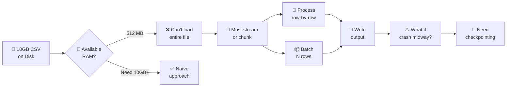
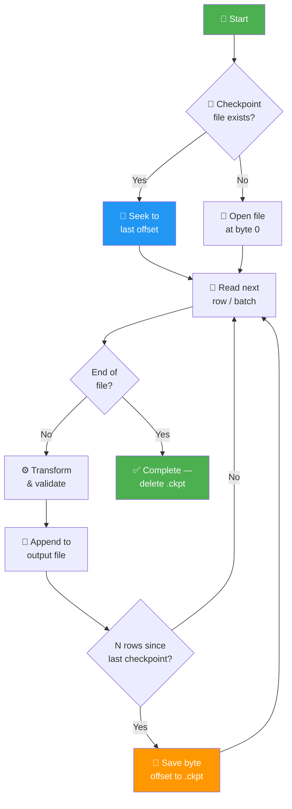
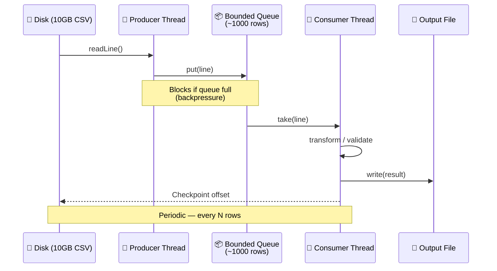
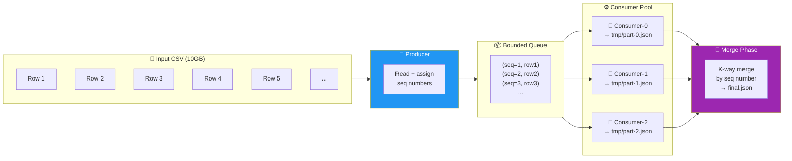
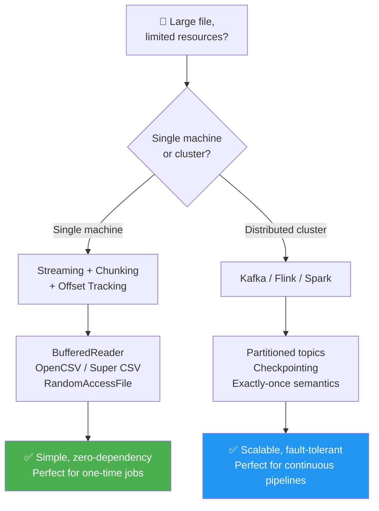

# "I Have a 10GB CSV File and Only 512MB RAM" — The Interview Question That Stumped Me

> *And how a desperate mention of Kafka saved my answer (sort of).*

I was in a Java developer interview. Things were going well — I had answered questions about Spring Boot, microservices, and even a few LeetCode-style problems.

Then the interviewer leaned back and asked:

“Suppose you have a very large file — say 10GB of CSV data. You have very limited computational resources — maybe just 512MB of RAM and a single CPU core. How would you process this file to pre‑process the data and store it in a different format?”

I paused. My mind raced.

“Just read the file line by line?” — too obvious, probably wrong.
“Use multithreading?” — but resources are limited.
“Load it into a database?” — but then the database would also need memory.

I knew I had to say something intelligent.

> **🧠 What the Interviewer Is Really Testing:** This question isn't about CSV parsing — it's about **systems thinking under constraints**. The interviewer wants to see if you understand memory management, I/O efficiency, fault tolerance, and the difference between single-machine and distributed solutions.



## My First Answer (Spoiler: It Wasn't Great)
I asked for clarification: “What kind of data? Is it structured?”

Interviewer: “It’s a CSV file — rows and columns. You need to clean it, transform some columns, and save it as JSON or Parquet.”

After a few seconds of thinking, I answered:

“We can divide the rows into chunks and process each chunk iteratively. We’ll keep track of the byte offset of each chunk — for example, read 10,000 rows at a time, process them in memory, write the result to a new file, then move to the next offset. That way, we never load the whole file at once.”

The interviewer nodded slowly, but his face said: “That’s still too naive.”

He pushed back: “Even reading 10,000 rows at once might be heavy if each row is large. And what about fault tolerance? What if the process fails in the middle? How do you resume?”

I was stuck. I knew my answer was incomplete.

Then, out of desperation, I said:

“I’m not 100% sure about the low‑level implementation, but I know this kind of problem is typically solved with stream processing frameworks like Apache Kafka or Apache Flink. They handle exactly‑once semantics, partitioning, and fault tolerance out of the box.”

The interviewer’s eyebrows raised slightly. He didn’t say I was wrong. But he also didn’t say I was right.

I left the room feeling that I had survived, but not truly answered the question.

> **🔍 Why My First Answer Fell Short:**
>
> | What I Said | What Was Missing |
> |---|---|
> | "Read 10,000 rows at a time" | No memory budget — what if each row is 1MB? |
> | "Process in memory, write to file" | No fault tolerance — crash = restart from zero |
> | Mentioned Kafka/Flink | Overkill for a single-machine, one‑time job |
>
> **The missing pillar:** *Resumability*. The interviewer's follow-up about failure mid‑process was the real test.

## What I Learned After the Interview
After the interview, I went home and researched. The problem is actually a classic one: processing large files with limited memory.

The ideal answer is not about Kafka or Flink — those are overkill for a single file on a single machine. The real solution is much simpler and more elegant.

Here’s what I should have said.

## The Ideal Answer: Streaming + Chunking + Offset Tracking

### Step 1: Never load the whole file into memory
Use a streaming CSV reader that reads one row at a time.
In Java, libraries like OpenCSV or Super CSV support this. Even plain BufferedReader with String.split(",") works for simple cases.

```java
try (BufferedReader reader = new BufferedReader(new FileReader("large.csv"))) {
    String line;
    while ((line = reader.readLine()) != null) {
        processLine(line);   // transform, validate, etc.
        writeToOutput(line); // append to a new file
    }
}
```
This uses almost no memory — just enough for one line.

### Step 2: If you must batch (for performance), do it smartly
If the CSV parsing itself is expensive (e.g., complex validations), you can batch 1000–5000 rows at a time. But never more than a small fraction of your RAM.

```java
List<String> batch = new ArrayList<>(5000);
while ((line = reader.readLine()) != null) {
    batch.add(line);
    if (batch.size() == 5000) {
        processBatch(batch);
        batch.clear(); // free memory
    }
}
```
### Step 3: Track progress for fault tolerance
If the process fails, you don’t want to restart from the beginning. Keep a record of the last processed line number or byte offset.

You can write a tiny checkpoint file:

```text
offset = 1048576   # bytes processed so far
```
If the program crashes, read the checkpoint, seek to that offset, and resume.

In Java, you can use RandomAccessFile to seek to a specific byte position.

```java
RandomAccessFile raf = new RandomAccessFile("large.csv", "r");
raf.seek(lastKnownOffset);   // resume from here
```
### Step 4: Use producer‑consumer pattern (optional)
If you have a single CPU but still want to overlap I/O and processing, use two threads:

Thread 1 (Producer) — reads lines from the file and puts them into a small queue.
Thread 2 (Consumer) — takes lines from the queue and processes them.
This keeps the disk busy while the CPU works. But with very limited resources, even this may be overkill.



> **📋 Key Takeaway — The Streaming Checklist:**
>
> | Principle | Why It Matters |
> |---|---|
> | **Stream, don't load** | O(1) memory regardless of file size |
> | **Batch smartly** | Trade off between I/O calls and memory pressure |
> | **Checkpoint often** | Crash → resume from last checkpoint, not row 0 |
> | **Backpressure** | A bounded queue prevents the producer from overwhelming the consumer |

### Step 5: Parallelize writes with multiple consumers (while keeping order)

If your transform step is CPU‑heavy (e.g., complex parsing, validation, compression), a single consumer becomes the bottleneck. The natural instinct is to add more consumer threads — but how do you preserve the original line order?

The trick: **each consumer writes to its own temporary file, tagging every output line with its original sequence number. A final merge pass sorts by sequence number and produces the ordered output.**



**How it works in Java:**

```java
// --- Producer: assigns a sequence number to each row ---
AtomicLong counter = new AtomicLong(0);
BlockingQueue<IndexedRow> queue = new LinkedBlockingQueue<>(2000);

// One producer thread
Thread producer = new Thread(() -> {
    try (BufferedReader reader = new BufferedReader(new FileReader("large.csv"))) {
        String line;
        while ((line = reader.readLine()) != null) {
            long seq = counter.getAndIncrement();
            queue.put(new IndexedRow(seq, line));  // blocks if queue is full
        }
    }
    // Send poison pills to signal consumers to stop
    for (int i = 0; i < NUM_CONSUMERS; i++) {
        queue.put(IndexedRow.POISON);
    }
});

// --- Consumer pool: each writes to its own temp file ---
int NUM_CONSUMERS = Runtime.getRuntime().availableProcessors();
ExecutorService consumers = Executors.newFixedThreadPool(NUM_CONSUMERS);

for (int i = 0; i < NUM_CONSUMERS; i++) {
    final int consumerId = i;
    consumers.submit(() -> {
        try (BufferedWriter writer = new BufferedWriter(
                new FileWriter("tmp/part-" + consumerId + ".json"))) {
            while (true) {
                IndexedRow row = queue.take();
                if (row.isPoison()) break;
                String processed = transform(row.line);
                // Write { "seq": N, "data": ... } — seq is key for ordered merge
                writer.write("{\"seq\":" + row.seq + ",\"data\":" + processed + "}");
                writer.newLine();
            }
        }
    });
}

producer.start();
consumers.shutdown();
consumers.awaitTermination(1, TimeUnit.HOURS);

// --- Merge phase: K-way merge of sorted temp files ---
// Since each temp file is written in seq order, we just need a
// min-heap to merge them — classic external merge-sort final pass.
mergeTempFiles("tmp/", "final.json");
```

> **⚠️ Trade‑offs to be aware of:**
>
> | Pros | Cons |
> |---|---|
> | CPU‑bound transforms scale to `N` cores | More disk I/O (N temp files + 1 merge pass) |
> | Order is 100% preserved via seq numbers | Merge phase is single‑threaded (but cheap — just reads & writes) |
> | Independent consumer failures don't lose progress | Checkpointing gets more complex — need to track per‑consumer offsets |
> | Works on a single machine — no distributed framework needed | If disk is the bottleneck (not CPU), parallelism won't help |

> **💡 When does this actually help?** If your transform is *compute‑bound* — JSON serialization, compression (gzip/snappy), regex validation, converting to Parquet — then 4 consumers can give you ~3.5× throughput. But if your bottleneck is *disk I/O* (spinning HDD), adding more consumers just creates contention. Profile first.

## Wait — Could Kafka or Flink Be the Right Answer?
Yes, but only if the problem is distributed.

If the “limited computational resource” means a single small machine, Kafka and Flink are not the answer — they add overhead.

However, if the file is on a distributed file system (HDFS) and you have a cluster of small nodes, then Kafka + Flink (or Spark Streaming) makes perfect sense. They partition the data, process in parallel, and provide exactly‑once guarantees.

The interviewer might have been hinting at stream processing as a concept, not necessarily the specific tools.

My mistake was mentioning tools without explaining the principles:

- Partitioning
- Checkpointing
- Exactly‑once semantics



> **📋 Key Takeaway — When to Use What:**
>
> | Scenario | Solution | Overhead |
> |---|---|---|
> | One‑time 10GB CSV on a laptop | Streaming + checkpointing | Zero dependencies |
> | Daily 50GB ingest on a single server | Batch with offset tracking + cron | Minimal |
> | Continuous stream of files on a cluster | Kafka + Flink / Spark Streaming | Significant — Zookeeper, brokers, JVM |
> | Real‑time event processing at scale | Kafka Streams / Flink | Justified by throughput needs |

## The Correct One‑Sentence Answer
If I could go back, I would say:

“I would use a streaming CSV reader to process the file line by line, batching only a few thousand rows at a time to avoid memory overload. I would also implement checkpointing by saving the byte offset periodically, so that if the process fails, it can resume from where it left off — not from the beginning.”

And if the interviewer asked about distributed systems:

“If the file is spread across multiple machines, I would use a stream processing framework like Kafka + Flink to partition the data, process each partition independently, and use checkpointing for fault tolerance.”

## What This Taught Me

- Don't jump to big frameworks before understanding the core problem.
- Always ask about scale — is this a one‑time job on a single machine, or a continuous pipeline on a cluster?
- Fault tolerance and resumability are often more important than raw speed.
- Even a wrong answer can be valuable — it pushed me to learn the right one.

> **🎯 Interview Cheat Sheet — The 3‑Layer Answer:**
>
> When you get this question, structure your answer in three escalating layers:
>
> | Layer | What to Say | Signals You Understand |
> |---|---|---|
> | **1. Core** | "Stream row‑by‑row with a `BufferedReader`, never load the full file." | Memory constraints |
> | **2. Resilience** | "Track byte offsets in a checkpoint file so a crash can resume from the last safe point." | Fault tolerance & production readiness |
> | **3. Scale** | "If this were a distributed pipeline, I'd reach for Kafka + Flink for partitioning and exactly‑once semantics — but for a single machine, that's overkill." | You know the right tool for the right scale — and when NOT to over‑engineer |

## Your Turn: How Would You Answer?
Have you ever faced a “large file, small memory” question? What was your answer?

Drop a comment — I’d love to hear your approach.

If this article helped you, clap 👏 and follow for more real‑world interview stories.