# SQL for System Design: From Fresher to Staff Engineer

Everything you need to make intelligent decisions about when, why, and how to use SQL in production systems.

There's a pattern that repeats itself in engineering interviews and on-call rotations alike: someone reaches for a NoSQL database because it "scales better," and six months later the team is writing application-level joins, struggling with data consistency, and quietly wishing they had just used Postgres.


SQL is not legacy. It's the most battle-tested storage abstraction in software engineering. This article walks through SQL from first principles to high-level design decisions — the kind of depth that lets you defend your choices in a Staff-level system design discussion.

---

## 1. The Mental Model: What SQL Actually Gives You

Before indexes or sharding, understand why SQL exists.

SQL databases give you:

- **ACID guarantees** — Atomicity, Consistency, Isolation, Durability
- **Relational integrity** — Foreign keys, constraints, no orphaned data
- **Declarative querying** — Describe what you want, not how to get it
- **Schema enforcement** — Bad data doesn't enter the system silently

These aren't free. They cost latency, vertical scaling limits, and operational complexity at the extreme end. The job of a senior engineer is knowing when those tradeoffs are worth it.

---

## 2. Core SQL Concepts with Real Context

### Tables, Normalization, and Why It Matters

```sql
-- Denormalized (fast reads, but duplicated data everywhere)
CREATE TABLE orders_flat (
  order_id     BIGINT PRIMARY KEY,
  user_id      BIGINT,
  user_email   VARCHAR(255),   -- duplicated on every row
  product_name VARCHAR(255),   -- duplicated on every row
  quantity     INT,
  created_at   TIMESTAMP
);

-- Normalized (3NF) - the right default
CREATE TABLE users (
  id    BIGINT PRIMARY KEY,
  email VARCHAR(255) UNIQUE NOT NULL
);

CREATE TABLE products (
  id    BIGINT PRIMARY KEY,
  name  VARCHAR(255) NOT NULL,
  price NUMERIC(10,2)
);

CREATE TABLE orders (
  id         BIGINT PRIMARY KEY,
  user_id    BIGINT REFERENCES users(id),
  created_at TIMESTAMP DEFAULT NOW()
);

CREATE TABLE order_items (
  order_id   BIGINT REFERENCES orders(id),
  product_id BIGINT REFERENCES products(id),
  quantity   INT NOT NULL,
  PRIMARY KEY (order_id, product_id)
);
```

> **When to denormalize deliberately:** Read-heavy analytics tables, data warehouses, or when join latency becomes measurable. Always denormalize intentionally, not by accident.

### Indexes: The Single Biggest Performance Lever

```sql
-- B-Tree index — great for equality and range queries
CREATE INDEX idx_orders_user_id ON orders(user_id);

-- Composite index - column order matters
-- Helps: WHERE user_id = ? AND created_at > ?
-- Does NOT help: WHERE created_at > ? alone
CREATE INDEX idx_orders_user_created ON orders(user_id, created_at);

-- Partial index - index only the rows you query
CREATE INDEX idx_pending_orders ON orders(created_at)
  WHERE status = 'PENDING';

-- Covering index - includes all columns needed (no table lookup)
CREATE INDEX idx_orders_covering ON orders(user_id, created_at, status);
```

> **Rule of thumb:** Every foreign key needs an index. Columns in `WHERE`/`ORDER BY`/`JOIN` are candidates. Too many indexes slow writes — profile before adding.

```sql
-- Always EXPLAIN before optimizing
EXPLAIN ANALYZE
SELECT o.id, o.created_at, u.email
FROM orders o
JOIN users u ON u.id = o.user_id
WHERE o.created_at > NOW() - INTERVAL '7 days'
  AND o.status = 'COMPLETED';
```

> **Seq Scan on a large table = your next index target.**

### Transactions and Isolation Levels

```sql
BEGIN;
  UPDATE accounts SET balance = balance - 500 WHERE id = 1;
  UPDATE accounts SET balance = balance + 500 WHERE id = 2;
COMMIT;
-- If anything fails before COMMIT, nothing happens
```

Isolation levels control what concurrent transactions can see:

| Level | Behavior | When to Use |
|-------|----------|-------------|
| `READ UNCOMMITTED` | Dirty reads possible | Almost never use |
| `READ COMMITTED` | Sees committed data only | Default in Postgres, MySQL |
| `REPEATABLE READ` | Consistent reads within txn | Prevents phantom reads in Postgres |
| `SERIALIZABLE` | Full isolation | Highest consistency, highest cost |

```sql
SET TRANSACTION ISOLATION LEVEL REPEATABLE READ;
```

`SERIALIZABLE` prevents phantom reads but adds significant overhead. Most OLTP systems run `READ COMMITTED` and handle edge cases in application logic or with optimistic locking.

### Locking: Optimistic vs Pessimistic

```sql
-- Pessimistic — lock the row on read
SELECT * FROM inventory WHERE product_id = 42 FOR UPDATE;
UPDATE inventory SET stock = stock - 1 WHERE product_id = 42;
COMMIT;
```

```sql
-- Optimistic - detect conflict on write using a version column
ALTER TABLE inventory ADD COLUMN version INT DEFAULT 0;

UPDATE inventory
SET stock = stock - 1, version = version + 1
WHERE product_id = 42 AND version = 5;
-- 0 rows updated → conflict detected → retry in application
```

> Use **pessimistic** when contention is high and conflicts are expensive (financial transactions). Use **optimistic** when contention is rare and retries are cheap (shopping carts).

---

## 3. System Design: Where SQL Fits

```text
┌──────────────────────────────────────────────┐
│             CLIENT / API LAYER               │
│        (REST, GraphQL, gRPC services)        │
└─────────────────────┬────────────────────────┘
                      │
         ┌────────────▼────────────┐
         │    APPLICATION LAYER    │
         │  (Business logic, ORM)  │
         └────────────┬────────────┘
                      │
        ┌─────────────┼──────────────┐
        │             │              │
   ┌────▼────┐  ┌─────▼─────┐  ┌────▼──────┐
   │  CACHE  │  │  PRIMARY  │  │   READ    │
   │ (Redis) │  │  SQL (RW) │  │ REPLICAS  │
   └─────────┘  └─────┬─────┘  └───────────┘
                      │ async replication
               ┌──────▼──────┐
               │  ANALYTICS  │
               │ (Warehouse) │
               └─────────────┘
```

- **Primary** handles writes and consistency-critical reads
- **Replicas** absorb reports and non-critical reads
- **Cache** fronts hot repeated reads
- **Analytics warehouse** handles OLAP — never run heavy analytics on your primary

---

## 4. Scaling SQL: The Honest Sequence

### The Scaling Ladder: Complexity vs. Necessity

Every step increases operational complexity. The rule is simple: **don't climb until the current step breaks.** Most systems never reach Step 7.

```mermaid
flowchart TD
    S1["<b>Step 1: Single Instance</b><br/>One DB, one connection<br/>⏱️ 0 operational overhead"]
    S2["<b>Step 2: Connection Pooling</b><br/>PgBouncer / RDS Proxy<br/>⏱️ +1 config file"]
    S3["<b>Step 3: Query Optimization</b><br/>Indexes, EXPLAIN, N+1 fixes<br/>⏱️ +0 ops, +big perf gains"]
    S4["<b>Step 4: Caching Layer</b><br/>Redis / Memcached<br/>⏱️ +1 service to manage"]
    S5["<b>Step 5: Read Replicas</b><br/>Async replication, read routing<br/>⏱️ +N servers, +lag monitoring"]
    S6["<b>Step 6: Vertical Scaling</b><br/>Bigger instance, more RAM/IOPS<br/>⏱️ +downtime or live migration"]
    S7["<b>Step 7: Partitioning</b><br/>Table splits within one DB<br/>⏱️ +schema complexity"]
    S8["<b>Step 8: Sharding</b><br/>Hash/range across multiple DBs<br/>⏱️ +router, +cross-shard hell"]
    S9["<b>Step 9: Multi-Region</b><br/>Geo-replication, failover<br/>⏱️ +consistency nightmares"]

    S1 -->|"connections<br/>exhausted"| S2
    S2 -->|"queries<br/>still slow"| S3
    S3 -->|"indexes<br/>maxed out"| S4
    S4 -->|"read volume<br/>saturates DB"| S5
    S5 -->|"write volume<br/>too high"| S6
    S6 -->|"single instance<br/>ceiling hit"| S7
    S7 -->|"partitions<br/>not enough"| S8
    S8 -->|"global<br/>latency reqs"| S9

    style S1 fill:#2e7d32,color:#fff
    style S2 fill:#388e3c,color:#fff
    style S3 fill:#43a047,color:#fff
    style S4 fill:#f9a825,color:#000
    style S5 fill:#f57c00,color:#fff
    style S6 fill:#ef6c00,color:#fff
    style S7 fill:#e65100,color:#fff
    style S8 fill:#c62828,color:#fff
    style S9 fill:#b71c1c,color:#fff
```



> **Color key**: 🟢 Green = Low complexity, do early. 🟡 Yellow = Moderate, do when needed. 🟠 Orange = Significant complexity. 🔴 Red = Last resort, most systems never need.

### When to Climb Each Step

| Step | Trigger | Symptom | You Are Here If... |
|:---|:---|:---|:---|
| **1. Single Instance** | Project starts | — | One app, one DB. It works. |
| **2. Connection Pooling** | `too many connections` errors | App servers exhaust DB connection slots | You have >10 app instances connecting to one DB |
| **3. Query Optimization** | Queries take >100ms | Seq Scan on large tables, missing indexes | `EXPLAIN` shows `Seq Scan` where it shouldn't |
| **4. Caching Layer** | Same queries hit DB repeatedly | DB CPU at 70%+ serving identical data | Hot data that changes infrequently (config, catalogs) |
| **5. Read Replicas** | Read volume saturates primary | DB CPU at 80%+ with mostly SELECTs | Read:write ratio > 10:1, non-critical reads (reports, dashboards) |
| **6. Vertical Scaling** | Write volume outgrows current instance | Write throughput ceiling, IOPS limit | Need 2-4× more power; horizontal isn't yet justified |
| **7. Partitioning** | Large tables slowing queries | Multi-GB tables, time-based access patterns | Most queries filter on a partitionable column (date, tenant_id) |
| **8. Sharding** | Write volume exceeds single instance | Single DB can't keep up with writes | Thousands of writes/sec; single instance ceiling reached after step 6 |
| **9. Multi-Region** | Global user base, latency requirements | Users on another continent see 300ms+ p95 | Active users on 2+ continents; regulatory data-residency |

### The Golden Rule

```text
BEFORE YOU ADD INFRASTRUCTURE, ASK:
┌────────────────────────────────────────────────────────────┐
│  "Can I fix this with better SQL instead of more servers?" │
└────────────────────────────────────────────────────────────┘
```

A single well-tuned Postgres instance on modern hardware handles:
- **~10 TB** of data
- **~10,000 writes/sec**
- **~100,000 reads/sec**

Most applications never exceed these limits. Steps 1–3 solve 90% of problems. Steps 4–6 solve the next 9%. Steps 7–9 are for the remaining 1%.

---

### Connection Pooling (Step Zero)

Every new DB connection costs ~5–10ms and memory. Without pooling, you'll hit connection limits before you hit DB capacity.

```text
App Pods (each wants 50 conns)    PgBouncer     Postgres
┌──────────┐                      ┌─────────┐   ┌──────────────┐
│ Pod 1    │──┐                   │         │   │              │
│ Pod 2    │──┼──────────────────►│  Pool   │──►│  ~200 conns  │
│ Pod 3    │──┘                   │         │   │  max         │
└──────────┘                      └─────────┘   └──────────────┘
  200 logical connections          multiplexed     stays healthy
```

PgBouncer in transaction mode turns 200 logical connections into ~20 real ones with zero application changes.

### Read Replicas

```text
              ┌──────────────────┐
Writes ──────►│  PRIMARY (RW)    │
              └────────┬─────────┘
           async repl  │  (typical lag: ms to low seconds)
         ┌─────────────┼─────────────┐
         │             │             │
    ┌────▼───┐   ┌─────▼──┐   ┌─────▼──┐
    │Replica1│   │Replica2│   │Replica3│
    └────────┘   └────────┘   └────────┘
    Reports      Dashboard    API reads
```

> **Watch replication lag.** A user writes then immediately reads — if that read hits a replica, they may not see their own write. Fix: route write+immediate reads to primary, or implement read-your-writes in the app layer.

### Partitioning (Before Sharding)

```sql
CREATE TABLE events (
  id         BIGINT,
  user_id    BIGINT,
  created_at TIMESTAMP NOT NULL
) PARTITION BY RANGE (created_at);

CREATE TABLE events_2024_q1 PARTITION OF events
  FOR VALUES FROM ('2024-01-01') TO ('2024-04-01');

CREATE TABLE events_2024_q2 PARTITION OF events
  FOR VALUES FROM ('2024-04-01') TO ('2024-07-01');

-- Postgres automatically prunes partitions from query plans
-- A WHERE created_at BETWEEN Jan-Mar never touches Q2 table
```

Partitioning stays within one DB instance — it's much simpler than sharding. Use it for tables where most queries filter on date range or tenant ID.

### Sharding: Last Resort

```text
              ┌─────────────────────────┐
              │      Shard Router       │
              │   hash(user_id) % 4     │
              └──┬──────┬──────┬────┬───┘
                 │      │      │    │
            ┌────▼─┐ ┌──▼──┐ ┌▼──┐ ┌▼────┐
            │Shard0│ │Shard│ │Sh2│ │Shard│
            │      │ │  1  │ │   │ │  3  │
            └──────┘ └─────┘ └───┘ └─────┘
```

```sql
-- Always include shard key — otherwise you hit all shards
SELECT * FROM orders WHERE user_id = 12345;    -- one shard
SELECT * FROM orders WHERE status = 'PENDING'; -- all shards (scatter-gather, bad)
```

> **Before sharding, exhaust in order:** query optimization → connection pooling → caching → read replicas → vertical scaling → partitioning. Reference the [Scaling Ladder diagram](#the-scaling-ladder-complexity-vs-necessity) above. Most systems never need to shard.

---

## 5. SQL vs NoSQL: The Decision Framework

```text
            Does your data have complex relationships?
                    /                    \
                  YES                    NO
                   │                      │
          Need ACID transactions?    Schema flexible/unpredictable?
          /             \             /                \
        YES              NO         YES                NO
         │                │           │                  │
    Use SQL          Evaluate       Document DB        Key-Value /
  (Postgres,        by access      (MongoDB)          Column Store
    MySQL)          patterns                     (Cassandra, DynamoDB)
```
---

## 6. Advanced Patterns

### CQRS with SQL

```text
  ┌─────────┐  Commands  ┌──────────────┐
  │ Client  │───────────►│ Write Model  │──► SQL Primary (normalized)
  │         │            └──────┬───────┘
  │         │  Queries          │ async projection
  │         │◄─────────  ┌──────▼───────┐
  └─────────┘            │  Read Model  │──► Materialized View / Replica
                         │(denormalized)│
                         └──────────────┘
```

```sql
-- Write: normalized, ACID
INSERT INTO orders(user_id, status) VALUES (42, 'PLACED');

-- Read: pre-aggregated materialized view
CREATE MATERIALIZED VIEW order_summary AS
SELECT
  u.email,
  COUNT(o.id)                AS total_orders,
  SUM(oi.quantity * p.price) AS total_spent
FROM users u
JOIN orders o ON o.user_id = u.id
JOIN order_items oi ON oi.order_id = o.id
JOIN products p ON p.id = oi.product_id
GROUP BY u.email;

REFRESH MATERIALIZED VIEW CONCURRENTLY order_summary;
```

### Event Sourcing with SQL

```sql
-- Store state changes as immutable events, not current state
CREATE TABLE domain_events (
  id           BIGSERIAL PRIMARY KEY,
  aggregate_id UUID NOT NULL,
  type         VARCHAR(100) NOT NULL,
  payload      JSONB NOT NULL,
  created_at   TIMESTAMP DEFAULT NOW()
);

-- Rebuild current state by replaying events in order
SELECT * FROM domain_events
WHERE aggregate_id = 'order-uuid-123'
ORDER BY id ASC;
```

Events are source of truth. Projections (materialized views, read models) are derived and rebuildable.

### Row-Level Security for Multi-tenancy

```sql
ALTER TABLE orders ENABLE ROW LEVEL SECURITY;

CREATE POLICY tenant_isolation ON orders
  USING (tenant_id = current_setting('app.current_tenant')::BIGINT);

-- Set per connection in middleware
SET app.current_tenant = '42';

-- Every query now automatically scoped - even if app code has a bug
SELECT * FROM orders; -- only sees tenant 42's data
```

DB-level enforcement is safer than application-level filtering.

---

## 7. SQL in Microservices

### ❌ WRONG — Shared database (tight coupling)

```text
┌──────────┐  ┌──────────┐  ┌──────────┐
│Service A │  │Service B │  │Service C │
└────┬─────┘  └────┬─────┘  └────┬─────┘
     └──────────────┼──────────────┘
                ┌───▼────┐
                │ One DB │  ← any schema change risks all services
                └────────┘
```

### ✅ RIGHT — Database per service

```text
┌──────────┐  ┌──────────┐  ┌──────────┐
│Service A │  │Service B │  │Service C │
└────┬─────┘  └────┬─────┘  └────┬─────┘
┌────▼─────┐  ┌────▼─────┐  ┌────▼─────┐
│  DB A    │  │  DB B    │  │  DB C    │
└──────────┘  └──────────┘  └──────────┘
```

Services communicate via APIs or events — no cross-DB joins.

For cross-service transactions, use the **Saga pattern**:

```text
Order Service        Payment Service      Inventory Service
     │                     │                     │
 Create order              │                     │
 (PENDING)                 │                     │
     │──event:OrderCreated──►                    │
     │                     │                     │
     │              Charge payment                │
     │                     │──event:PaymentDone──►│
     │                     │                     │
     │                     │             Reserve stock
     │◄────────────────────│◄──event:StockReserved┘
     │
 Mark CONFIRMED
```

Each step is a local ACID transaction. Failed steps trigger compensating transactions (refund, release stock). No distributed lock needed.

---

## 8. Performance Checklist

### Query Level

- [ ] `EXPLAIN ANALYZE` every slow query — look for Seq Scan on large tables
- [ ] No `SELECT *` in production code
- [ ] N+1 query patterns eliminated — batch with `JOIN`s or `WHERE IN (...)`
- [ ] Keyset (cursor) pagination instead of `OFFSET`

```sql
-- ❌ Slow at page 500 (scans and discards 10,000 rows)
SELECT * FROM orders ORDER BY id LIMIT 20 OFFSET 10000;

-- ✅ Fast regardless of page (uses index, no scan)
SELECT * FROM orders WHERE id > :last_seen_id ORDER BY id LIMIT 20;
```

### Schema Level

- [ ] Every foreign key has an index
- [ ] Composite indexes match actual query patterns
- [ ] Unused indexes dropped (each one costs write performance)
- [ ] JSONB query columns have GIN indexes

### Infrastructure Level

- [ ] Connection pooler in front of DB (PgBouncer or RDS Proxy)
- [ ] Read replicas handling reports and dashboards
- [ ] Autovacuum configured (Postgres) — prevents table bloat
- [ ] `work_mem` tuned for sort/hash-heavy queries
---

## 9. The Staff Engineer Perspective

At Staff level, the conversation is about system properties, not just query syntax.

### Five questions before picking any database:

1. **What's the consistency requirement?** Financial transactions need strong consistency (ACID). Social feed rankings can tolerate eventual consistency. This single question eliminates most alternatives.

2. **What's the read/write ratio?** 80% reads → optimize reads (indexes, replicas, cache). Predominantly writes (event ingestion, logging) → write-optimized stores become competitive.

3. **What are the access patterns?** Lookups by primary key → any DB. Range scans by time → partitioned SQL or Cassandra. Complex graph traversals → dedicated graph DB. Describe the query before picking the engine.

4. **What does the team know how to operate?** A database nobody on the team knows how to tune, backup, or recover is an operational risk. Boring and well-understood beats exotic and powerful.

5. **What's the realistic data scale in 2 years?** If you're not approaching hundreds of millions of rows or thousands of writes per second, you almost certainly don't need a distributed store. A well-tuned Postgres instance on modern hardware handles terabytes. The cost of premature optimization is high.

> **The most common mistake at every level:** Choosing NoSQL for scale that never arrives, then spending years fighting the absence of joins and transactions. SQL handles more than most systems will ever demand.

---

## Summary

| Concept | What to Know |
|---------|-------------|
| **ACID** | The reason SQL is trustworthy for money, orders, and state |
| **Indexes** | B-Tree default, partial for filtered rows, composite for multi-column WHERE, covering to eliminate heap fetches |
| **Isolation** | Default to READ COMMITTED; use SERIALIZABLE only when necessary |
| **Locking** | Pessimistic for high contention; optimistic for low contention |
| **Read Replicas** | First scaling step — simple, effective |
| **Partitioning** | Logical table splits within one DB; use before sharding |
| **Sharding** | Last resort; requires shard key discipline; most systems don't need it |
| **CQRS** | Separate write and read models for complex, high-read domains |
| **Microservices** | DB per service; Saga pattern for cross-service consistency |
| **SQL vs NoSQL** | Workload fit, not hype — choose based on access patterns and consistency needs |

SQL has been the foundation of production systems for decades because the problems it solves — consistency, integrity, and queryability — are fundamental to most software. Knowing how to use it well, and knowing precisely when to step outside it, is one of the highest-leverage skills in backend engineering.

---

*Source: [The Latency Gambler on Medium](https://medium.com) — Mar 6, 2026*

**Tags:** `#Database` `#SQL` `#SystemDesign` `#SoftwareEngineering`
