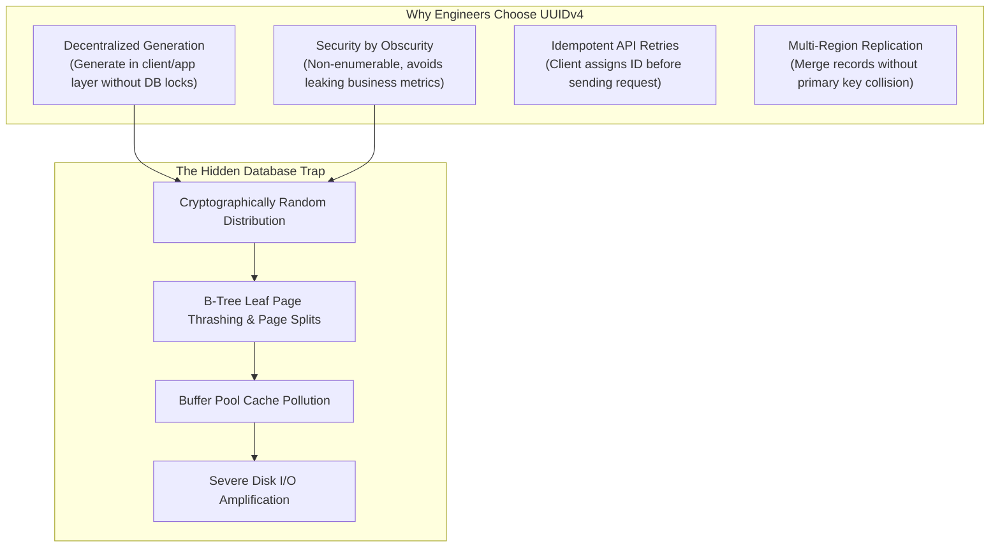
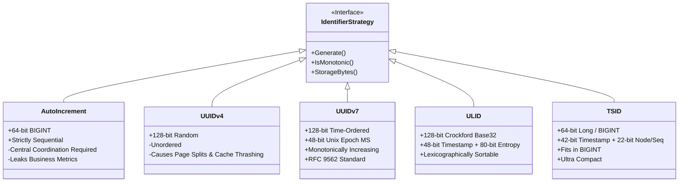

# The Database Architecture Trap Almost Everyone Falls For

> **Author**: [Cloud With Azeem](https://medium.com/@cloudwithazeem)  
> **Published**: August 8, 2026  
> **Source**: [Medium](https://medium.com/@cloudwithazeem/the-database-architecture-trap-almost-everyone-falls-for-6867a540a3fc)  
> **Domain**: Databases, B-Tree Indexing, Distributed ID Generation, Performance Tuning  
> **Related Takeaways**: [36. Database ID Architecture & Key Selection — Key Takeaways](../../system-design-architecture/databases/36-db-key-takeaways.md)

---

Database architectural mistakes rarely show up on day one. They accumulate quietly under the surface, waiting for your data footprint to outgrow your system memory.

Evaluating your key selection strategy before reaching production scale is one of the highest-leverage engineering decisions you can make. What appears to be an industry-standard "modern best practice" often turns into a crippling performance cliff that causes multi-second query latency and catastrophic disk I/O under scale.

---

## 1. The Incident: The 15ms Query That Became a 4-Second Bottleneck

Consider a scenario common in modern distributed architectures:

An e-commerce and logistics platform launched with a microservices topology. During development and initial launch, every single-record lookup executed instantaneously:
- `GET /api/v1/orders/{order_id}` consistently completed in **8ms to 15ms**.
- Query execution plans showed crisp `Index Scan using orders_pkey`.
- All database metrics were green.

Six months later, table volume grew from 50,000 rows to 45,000,000 rows (approximately 45 GB with indexes). Hardware had not changed (64 GB RAM, provisioned IOPS SSDs), but single-record lookups by primary key suddenly spiked to **3,800ms – 4,200ms**.

```text
QUERY PLAN:
Index Scan using orders_pkey on orders  (cost=0.56..8.58 rows=1 width=420) (actual time=3842.124..3842.128 rows=1 loops=1)
  Index Cond: (id = '9b1deb4d-3b7d-4bad-9bdd-2b0d7b3dcb6d'::uuid)
  Buffers: shared hit=4 read=94120
Planning Time: 0.182 ms
Execution Time: 3842.165 ms
```

To fetch a **single row by its primary key**, PostgreSQL had to perform **94,120 disk block reads**.

The root cause was not missing indexes, unoptimized SQL joins, CPU throttling, or connection exhaustion. The root cause was the primary key data type: **UUIDv4 (Universally Unique Identifier Version 4)**.

---

## 2. Why Developers Fall for the UUIDv4 Trap

UUIDv4 (randomly generated 128-bit numbers formatted as `xxxxxxxx-xxxx-4xxx-yxxx-xxxxxxxxxxxx`) became the de facto default for modern architectures for very compelling reasons:



### The Perceived Advantages:
1. **Decentralized Generation**: Application services generate IDs independently without network round-trips to the database or central sequence generators.
2. **Business Intelligence Protection**: Auto-incrementing integers (`101`, `102`, `103`) leak order volumes and customer acquisition velocity to competitors.
3. **Defense Against Scraping**: Enumerable IDs allow attackers to iterate `GET /users/1`, `GET /users/2` to crawl an entire database.
4. **Idempotency**: Clients generate the ID locally before submitting a transaction, enabling seamless retry deduplication.

These benefits are real. But applying UUIDv4 as a **database primary key (clustered index)** introduces severe storage and indexing pathologies that surface when data exceeds RAM.

---

## 3. The Mechanics of the B-Tree Performance Cliff

Relational database engines—including PostgreSQL, MySQL (InnoDB), SQL Server, and Oracle—organize tables and primary key indexes as **B+ Trees** (or B-Trees).

```text
               [ Root Node ]
              /             \
      [ Branch Node ]     [ Branch Node ]
      /             \     /             \
[ Leaf 1 ]    [ Leaf 2 ] [ Leaf 3 ]    [ Leaf 4 ] (Data Pages on Disk / Buffer Pool)
```

### Sequential Insertion vs. Random Insertion

When a table uses a monotonically increasing identifier (such as `BIGINT AUTO_INCREMENT` or `IDENTITY`):
- New records are always appended to the **rightmost leaf page**.
- The active rightmost page stays cached in memory (in the database **Buffer Pool** / `shared_buffers`).
- Once a page fills to 100%, a clean new leaf page is allocated on disk sequentially.
- **Cache Hit Ratio**: ~99.9%. **Disk Writes**: Sequential and batched.

```text
Sequential Inserts (Append-Only Locality):
[ Page 1 (Full) ] -> [ Page 2 (Full) ] -> [ Page 3 (Filling at tail...) ]
```

When a table uses **UUIDv4**:
- Every incoming ID is uniformly random across the entire 128-bit key space.
- An insert is equally likely to land on Leaf Page #1, Leaf Page #50,000, or Leaf Page #1,000,000.
- As the index grows larger than the RAM allocated to the Buffer Pool:
  1. The target leaf page is almost certainly **not in memory**.
  2. The engine must issue a **synchronous random disk read** to fetch the target page into RAM.
  3. The engine inserts the row.
  4. If the target page is full (which happens constantly), the engine must trigger an expensive **B-Tree Page Split**.

```text
Random UUIDv4 Inserts (Scatter Gun):
 Insert 1 -> [ Page 42 ]   (Cache Miss -> Disk Read)
 Insert 2 -> [ Page 8921 ] (Cache Miss -> Disk Read)
 Insert 3 -> [ Page 12 ]   (Cache Miss -> Disk Read)
```

---

## 4. The Pathologies of Random Primary Keys

### A. B-Tree Page Splits and Space Bloat
When an insert lands in a full 8 KB (or 16 KB) leaf page, the database cannot simply shift bytes. It must:
1. Allocate a new empty leaf page.
2. Move approximately 50% of the existing rows from the original page to the new page.
3. Update parent branch pointers.
4. Log write-ahead log (WAL) entries for both modified pages and the parent pointer.

**Result**: Average B-Tree page fill factor drops from ~90–95% down to **50–60%**. The physical index on disk consumes **nearly double the storage** it actually requires.

### B. Buffer Pool Thrashing
In PostgreSQL, `shared_buffers` caches active pages. In MySQL InnoDB, the `innodb_buffer_pool` performs the same role.
- With sequential IDs, working memory needs only to hold the *latest* active pages and frequently accessed root/branch nodes.
- With UUIDv4, the working set is the **entire index across all time**. Every single insert or point lookup evicts useful cached pages, destroying cache hit rates for the entire database.

### C. Secondary Index Bloat
In storage engines with clustered tables (like MySQL InnoDB or SQL Server), secondary indexes do not store physical disk pointers—they store a copy of the **primary key value** in every secondary index record.
- If your primary key is a 36-byte UUID string (or 16-byte raw binary), every secondary index on `email`, `created_at`, `status`, or `tenant_id` balloons in size, consuming precious RAM and multiplying disk I/O across every query.

---

## 5. Architectural Evaluation: Modern Key Design Alternatives

To solve the conflict between decentralized generation and B-Tree indexing efficiency, modern database engineering has converged on **time-ordered (lexicographically sortable) identifiers**.



### 1. UUIDv7 (RFC 9562) — The Modern Universal Standard
Published in RFC 9562, **UUIDv7** replaces UUIDv4 as the recommended general-purpose identifier.

**Structure (128 bits)**:
```text
 0                   1                   2                   3
 0 1 2 3 4 5 6 7 8 9 0 1 2 3 4 5 6 7 8 9 0 1 2 3 4 5 6 7 8 9 0 1
+-+-+-+-+-+-+-+-+-+-+-+-+-+-+-+-+-+-+-+-+-+-+-+-+-+-+-+-+-+-+-+-+
|                           unix_ts_ms                          |
+-+-+-+-+-+-+-+-+-+-+-+-+-+-+-+-+-+-+-+-+-+-+-+-+-+-+-+-+-+-+-+-+
|          unix_ts_ms           |  ver  |       rand_a          |
+-+-+-+-+-+-+-+-+-+-+-+-+-+-+-+-+-+-+-+-+-+-+-+-+-+-+-+-+-+-+-+-+
|var|                        rand_b                             |
+-+-+-+-+-+-+-+-+-+-+-+-+-+-+-+-+-+-+-+-+-+-+-+-+-+-+-+-+-+-+-+-+
|                            rand_b                             |
+-+-+-+-+-+-+-+-+-+-+-+-+-+-+-+-+-+-+-+-+-+-+-+-+-+-+-+-+-+-+-+-+
```
- **Bits 0–47**: 48-bit Unix timestamp in milliseconds.
- **Bits 48–51**: Version `7` (`0111`).
- **Bits 52–63**: 12 bits of sub-millisecond precision or sequence counter.
- **Bits 64–65**: Variant (`10`).
- **Bits 66–127**: 62 bits of cryptographically secure random entropy.

**Why it wins**:
- Native `UUID` data type compatibility in PostgreSQL, MySQL, CockroachDB, and Cassandra.
- Sequential leading bits ensure **append-only B-Tree locality**, virtually eliminating page splits.
- Retains 62+ bits of entropy per millisecond, preventing collision across distributed workers.

---

### 2. ULID (Universally Unique Lexicographically Sortable Identifier)
- **128 bits** total (48-bit timestamp + 80-bit randomness).
- Encoded as a **26-character string** using Crockford's Base32 (`0123456789ABCDEFGHJKMNPQRSTVWXYZ` — excluding `I`, `L`, `O`, `U` to avoid human transcription errors).
- Ideal for URLs, human-readable IDs, and document stores.

---

### 3. TSID (Time-Sorted Unique Identifier)
- **64 bits** total (42-bit millisecond timestamp + 10-bit Node ID + 12-bit sequence counter).
- Stores in a native SQL `BIGINT` (8 bytes) instead of 16 bytes.
- Generates up to 4,096 IDs per millisecond per node.
- Ideal when secondary index storage and foreign key compactness are primary engineering constraints.

---

### 4. The Dual-Layer ID Architecture Pattern
For systems that cannot adopt UUIDv7 immediately:

```text
[ Client / Public API ]  <--->  [ API Gateway / Application ]  <--->  [ Database Engine ]
   Uses: public_id (UUIDv4/v7)        Resolves public_id -> id           Uses: id BIGINT AUTO_INCREMENT (PK)
   (Non-enumerable, secure)                                             (Compact, fast clustered index)
```

- **Internal Primary Key**: `id BIGINT PRIMARY KEY AUTO_INCREMENT` (Used for internal `JOIN`s and foreign keys).
- **Public External Identifier**: `public_id UUID UNIQUE NOT NULL` (Exposed in REST/GraphQL APIs).

---

## 6. Comprehensive Strategy Comparison Matrix

| Identifier Type | Size (Bytes) | B-Tree Locality | Decentralized Generation | Non-Enumerable | Standard Support | Ideal Use Case |
|:---|:---|:---|:---|:---|:---|:---|
| **Auto-Increment BIGINT** | 8 bytes | Excellent (Append) | No (Single DB Coordinator) | No (Vulnerable to enumeration) | Universal | Internal single-database tables, data warehouses |
| **UUIDv4** | 16 bytes | Terrible (Random Scatter) | Yes | Yes | Universal | Ephemeral tokens, correlation IDs, non-indexed fields |
| **UUIDv7** | 16 bytes | Excellent (Time-ordered) | Yes | Yes | RFC 9562 Standard | **Recommended Default** for modern relational DB PKs |
| **ULID** | 16 bytes | Excellent (Time-ordered) | Yes | Yes | Community libraries | API URLs, NoSQL keys, human-safe string representations |
| **TSID / Snowflake** | 8 bytes | Excellent (Time-ordered) | Yes (Requires Worker ID) | Yes | High-throughput distributed | High-volume financial transactions, high-QPS tables |

---

## 7. Step-by-Step Migration: Upgrading UUIDv4 to UUIDv7 in Production

If your production database is already suffering from UUIDv4 fragmentation, follow this zero-downtime migration playbook:

```sql
-- Step 1: Install UUIDv7 generator function (PostgreSQL 17 and below, or native in PG 18+)
CREATE OR REPLACE FUNCTION generate_uuid_v7() 
RETURNS uuid AS $$
DECLARE
  v_time timestamp with time zone := clock_timestamp();
  v_millis bigint := (EXTRACT(EPOCH FROM v_time) * 1000)::bigint;
  v_uuid bytea := gen_random_bytes(16);
BEGIN
  -- Set 48-bit timestamp
  v_uuid := set_byte(v_uuid, 0, (v_millis >> 40)::int);
  v_uuid := set_byte(v_uuid, 1, (v_millis >> 32)::int);
  v_uuid := set_byte(v_uuid, 2, (v_millis >> 24)::int);
  v_uuid := set_byte(v_uuid, 3, (v_millis >> 16)::int);
  v_uuid := set_byte(v_uuid, 4, (v_millis >> 8)::int);
  v_uuid := set_byte(v_uuid, 5, (v_millis)::int);
  -- Set version 7 (0111 in high nibble of byte 6)
  v_uuid := set_byte(v_uuid, 6, (get_byte(v_uuid, 6) & 15) | 112);
  -- Set variant 10 (10 in high bits of byte 8)
  v_uuid := set_byte(v_uuid, 8, (get_byte(v_uuid, 8) & 63) | 128);
  RETURN encode(v_uuid, 'hex')::uuid;
END;
$$ LANGUAGE plpgsql VOLATILE;

-- Step 2: Switch table default value for new inserts (zero downtime)
ALTER TABLE orders ALTER COLUMN id SET DEFAULT generate_uuid_v7();

-- Step 3: Schedule background index rebuild to reclaim fragmented pages
REINDEX TABLE CONCURRENTLY orders;
```

---

## 8. Summary & Architectural Takeaways

1. **Random UUIDs (UUIDv4) destroy B-Tree efficiency**: Inserting random keys into a B-Tree forces frequent page splits, drops page fill factor to ~50%, and causes cache thrashing once data exceeds RAM.
2. **Sequential leading bits restore append locality**: Embedding a Unix timestamp in high-order bits (UUIDv7, ULID, TSID) ensures inserts append to the rightmost leaf page, sustaining sub-10ms lookup times.
3. **Adopt UUIDv7 as the modern standard**: With RFC 9562 standardization, UUIDv7 provides the privacy and decentralization of UUIDs with the indexing performance of integers.
4. **Consider 64-bit TSID for extreme scale**: When secondary index footprint and foreign-key join bandwidth dominate, 64-bit TSID offers half the storage overhead of 128-bit UUIDs.
