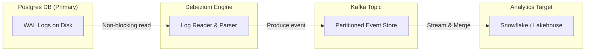

# Why Most CDC Pipelines Break at Scale (And How Senior Engineers Build Them Right)

> **Author**: [Cloud With Azeem](https://cloudwithazeem.medium.com/)  
> **Published**: August 11, 2026  
> **Source**: [Medium](https://cloudwithazeem.medium.com/why-most-cdc-pipelines-break-at-scale-and-how-senior-engineers-build-them-right-e31f49533b5b)  
> **Domain**: Databases, Change Data Capture (CDC), Event Streaming, Kafka, Data Warehouse  
> **Related Takeaways**: [38. CDC Pipeline Scale Failures & Resilient Change Streams — Key Takeaways](../../system-design-architecture/databases/38-db-key-takeaways.md)  

---

Beyond simple log parsing: The real-world traps of Change Data Capture across databases, Kafka, and data warehouses.


When I first implemented **Change Data Capture (CDC)**, I thought it was a solved problem. The pitch behind tools like **Debezium**, [**Apache Kafka**](https://medium.com/@cloudwithazeem/senior-engineers-dont-start-with-kafka-they-start-with-this-69d61f0f3152), and modern cloud warehouses makes streaming database changes look almost effortless: hook into the write-ahead log, stream row-level mutations into an event broker, run an idempotent `MERGE` query into your warehouse, and enjoy near-real-time analytics.

Then production reality hit.

Six months after turning on our first log-based pipeline, edge cases began surfacing across our analytical stacks. Finance dashboards drifted out of alignment with production Postgres replicas. Hard-deleted orders lingered indefinitely as “zombie records” in our data lake. Out-of-order events caused historical rows to overwrite fresh updates, and schema migrations upstream silently broke downstream parser consumers.

Through extensive research, incident post-mortems, and architectural iterations, I realized something fundamental: **CDC is not a single tool setup — it is a chain of distributed state reconciliations.** Each CDC pattern evolved to fix specific scale failures, yet each brings its own failure modes if you don’t engineer for edge cases.

Here is what I have learned about how CDC techniques fail in production, why popular approaches break, and how to design resilient, production-grade change streams.

## Capturing State vs. Capturing Mutations

At its core, database synchronization forces a choice between two paradigms:

1. **State Polling (Capturing Snapshots):** Querying the current state of a database table at fixed intervals.
2. **Mutation Streaming (Capturing Events):** Tailing low-level transaction logs to record every `INSERT`, `UPDATE`, and `DELETE` as an immutable event.


Choosing the wrong approach — or failing to handle its inherent edge cases — inevitably leads to data drift. Let’s break down how these five patterns behave under real production load.

## 1. Timestamp-Based Polling

Almost every organization starts with SQL-level polling. It requires no specialized infrastructure, works across any relational engine, and uses familiar syntax:

```sql
SELECT order_id, customer_id, status, total_amount, updated_at
FROM orders
WHERE updated_at > :last_watermark;
```

While clean in theory, this pattern harbors three hidden failure modes that consistently corrupt downstream data.

### The Out-of-Order Transaction Commit Problem

Consider a long-running checkout transaction that opens at `10:08:00` and assigns its rows an `updated_at` timestamp of `10:08:00`. If this transaction takes 5 minutes to complete due to external payment gateway latency, it commits at `10:13:00`.

If your polling batch runs at `10:10:00`, its query grabs all rows with `updated_at <= 10:10:00` and advances the high watermark to `10:10:00`. When the slow transaction finally commits at `10:13:00`, its timestamp (`10:08:00`) is already older than the watermark (`10:10:00`).

The next batch at `10:15:00` queries `WHERE updated_at > 10:10:00`. **The uncommitted row is skipped forever.**

### The Silent Hard-Delete Trap

When an operator or microservice issues a physical deletion (`DELETE FROM orders WHERE order_id = 42;`), no row remains to update an `updated_at` column. The record simply vanishes upstream, while remaining permanently active in your data warehouse.

## 2. Trigger-Based CDC: The Application-Layer Workaround

When database transaction logs are locked down by strict DBA policies or third-party vendor platforms, engineers often resort to database triggers.

```sql
CREATE OR REPLACE FUNCTION capture_order_changes()
RETURNS TRIGGER AS $$
BEGIN
    INSERT INTO orders_cdc_audit (
        order_id, operation_type, old_status, new_status, changed_at
    ) VALUES (
        COALESCE(NEW.order_id, OLD.order_id),
        TG_OP,
        OLD.status,
        NEW.status,
        CLOCK_TIMESTAMP()
    );
    RETURN NEW;
END;
$$ LANGUAGE plpgsql;
```

While triggers capture physical deletes and bypass log access restrictions, they introduce **write amplification**. Every application `UPDATE` now triggers a synchronous secondary write inside the same transaction scope.

Under heavy traffic, this secondary write doubles I/O overhead, increases lock contention on index pages, and introduces latency directly into user-facing API responses. In high-throughput systems, trigger-based capture quickly degrades transactional performance.

## 3. Log-Based CDC

To avoid querying active tables altogether, modern event-driven architectures tail the database’s write-ahead log (**WAL** in Postgres, **Binlog** in MySQL, or **Oplog** in MongoDB).

By deploying tools like **Debezium** alongside **Apache Kafka**, every committed transaction is read from disk asynchronously with near-zero overhead on the primary database engine.



A raw log event emitted by Debezium contains rich metadata detailing state transitions:

```json
{
  "before": { "order_id": 1042, "status": "PENDING" },
  "after": { "order_id": 1042, "status": "SHIPPED" },
  "source": { "db": "production", "table": "orders", "lsn": 248901238 },
  "op": "u",
  "ts_ms": 1771120200000
}
```

However, log-based CDC introduces distinct distributed systems challenges that require deliberate handling.

### Challenge A: The Bootstrapping Dilemma and Non-Blocking Snapshots

When initializing CDC on an existing table containing millions of rows, streaming the WAL is not enough — the log only records mutations from the moment the connector attaches. You must first capture a consistent baseline snapshot of existing data.

Historically, capturing a snapshot meant taking explicit table locks (`LOCK TABLE orders IN SHARE MODE;`), blocking writes and degrading application traffic.

Modern production setups rely on **non-blocking incremental snapshots** (pioneered by [Netflix’s DBLog algorithm](https://netflixtechblog.com/building-a-resilient-data-platform-with-write-ahead-log-at-netflix-127b6712359a)). By writing low-watermark and high-watermark signals directly to a dedicated control table, the connector reads primary key chunks in the background while concurrently processing the real-time WAL stream, deduplicating windowed events dynamically without blocking application writes.

### Challenge B: Event Reordering Across Partition Boundaries

Distributed event streaming platforms like Kafka guarantee strict ordering **only within a single partition**.

If your Kafka topic uses a random or round-robin partitioning strategy, an initial `INSERT` event for `order_id = 42` may land on Partition 0, while a subsequent `UPDATE` lands on Partition 2. If the consumer for Partition 2 processes its queue faster, the system attempts to process an update for a record that does not yet exist downstream.

> **The Fix:** Always use the source table’s primary key (`order_id`) as the Kafka message key. This guarantees that all state mutations for a specific entity land in the exact same partition, preserving sequence integrity.

## 4. Snapshot + Diffing: The Batch Recovery Fallback

In legacy architectures or file-based data lake ingestions where neither live log parsing nor query triggers are viable, teams often revert to periodic full extraction and differential comparison.

```python
import pandas as pd

# Load previous and current daily full snapshots
df_yesterday = pd.read_parquet("s3://data-lake/orders/date=2026-08-10/")
df_today = pd.read_parquet("s3://data-lake/orders/date=2026-08-11/")

# Identify modified or newly added records
merged = df_today.merge(
    df_yesterday, on="order_id", how="left", suffixes=("", "_prev")
)
changed_records = merged[
    (merged["updated_at"] > merged["updated_at_prev"]) | 
    (merged["_merge"] == "left_only")
]
```

While effective as a brute-force recovery fallback, diffing full datasets scales poorly. Computing outer joins across massive tables requires significant compute infrastructure, incurs storage costs, and restricts data freshness to batch intervals (often daily or multi-hour schedules).

## 5. Modern Warehouse Reconciliation: Building Idempotent MERGE Pipelines

Regardless of how events are captured, they ultimately land in a landing tier or staging table inside a cloud warehouse (such as Snowflake, BigQuery, or Databricks).

The target table must be updated deterministically using idempotent `MERGE` logic. Merely running a naive `UPDATE SET status = staging.status` leaves pipelines vulnerable to late-arriving events overwriting newer records.

### Production-Grade Ingestion Pattern

To ensure correctness, include CDC ingestion metadata — specifically the operation type (`_cdc_op`) and source commit timestamp (`_cdc_ts`) — directly in your event payload.

```sql
MERGE INTO analytics.dim_orders AS target
USING (
    -- Deduplicate staging records: keep only the latest event per primary key
    SELECT order_id, customer_id, status, total_amount, _cdc_op, _cdc_ts
    FROM (
        SELECT *,
               ROW_NUMBER() OVER (
                   PARTITION BY order_id 
                   ORDER BY _cdc_ts DESC
               ) AS rank_idx
        FROM staging.stg_orders_cdc
    )
    WHERE rank_idx = 1
) AS source
ON target.order_id = source.order_id
-- 1. Handle Hard Deletes via Tombstones
WHEN MATCHED AND source._cdc_op = 'D' THEN
    DELETE
-- 2. Handle Updates (Protect against out-of-order stale events)
WHEN MATCHED AND source._cdc_ts > target._cdc_last_updated THEN
    UPDATE SET
        target.customer_id = source.customer_id,
        target.status = source.status,
        target.total_amount = source.total_amount,
        target._cdc_last_updated = source._cdc_ts
-- 3. Handle New Insertions
WHEN NOT MATCHED AND source._cdc_op != 'D' THEN
    INSERT (order_id, customer_id, status, total_amount, _cdc_last_updated)
    VALUES (source.order_id, source.customer_id, source.status, source.total_amount, source._cdc_ts);
```

### Why This Logic Holds Under Pressure

- **Windowed Deduplication:** The `ROW_NUMBER()` subquery flattens multiple intermediate state changes in a batch, selecting only the latest event per key.
- **Monotonic Timestamp Guard:** The conditional clause `source._cdc_ts > target._cdc_last_updated` prevents late-arriving network retries from overwriting fresh warehouse state.
- **Explicit Tombstone Processing:** Deletes marked with `_cdc_op = 'D'` are propagated as physical target deletions (or converted into soft-delete flags), clearing out zombie records safely.

## Practical Lessons for Production CDC

After implementing and scaling these pipelines across various systems, several operational best practices consistently apply:

- **Treat Schema Drift as an Event:** Upstream schema changes (`ALTER TABLE ... ADD COLUMN`) can break rigid downstream ingestion jobs. Schema registries (such as Confluent Schema Registry) help enforce backward compatibility rules before messages enter the broker.
- **Monitor LSN Lag Over Consumer Lag:** Tracking Kafka consumer offsets tells only half the story. Monitor your database’s Write-Ahead Log **LSN (Log Sequence Number) lag** to detect replication slot bloat before disk space fills up upstream.
- **Isolate OLTP and OLAP Load:** Avoid running raw CDC queries directly against primary application databases. Point log extractors toward read-replicas or dedicated standby nodes whenever possible.

CDC design involves trade-offs across complexity, latency, and system cost. By understanding how each pattern handles edge cases, you can build streaming data architectures that remain reliable and consistent at scale.
