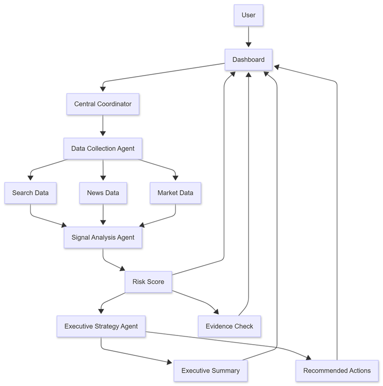
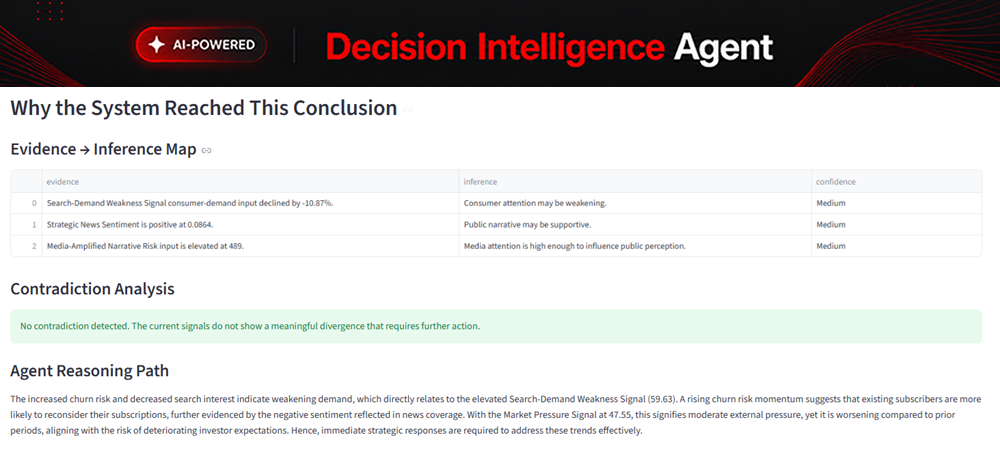
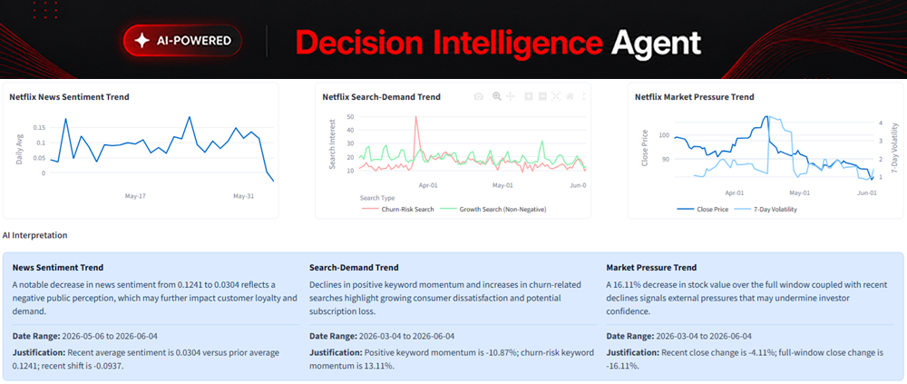

# Building an Agentic AI System for Enterprise Strategic Intelligence

> **Author**: [Oktay Selcuk](https://www.linkedin.com/in/oktay-selcuk/) — Decision-Focused Applied AI | Multi-Agent Systems | AI Strategy  
> **Published**: June 4, 2026 · ~8 min read  
> **Source**: [LinkedIn](https://www.linkedin.com/)  
> **Domain**: Agentic AI, Multi-Agent Systems, Enterprise Architecture, Decision Intelligence  
> **Related**: [AI Applications](../../architecture-general/12-ai-applications/)  
> **Taxonomy**: §12 AI Applications, §2 Application Software Architecture

---

## Table of Contents

1. [Introduction](#introduction)
2. [Why Strategic Intelligence Is Different](#why-strategic-intelligence-is-different)
3. [From One AI Assistant to Multiple Specialized Roles](#from-one-ai-assistant-to-multiple-specialized-roles)
4. [Agentic AI Is More Than LLM Calls](#agentic-ai-is-more-than-llm-calls)
5. [One of the Hardest Problems: Contradictory Signals](#one-of-the-hardest-problems-contradictory-signals)
6. [From Data Visualization to AI Interpretation](#from-data-visualization-to-ai-interpretation)
7. [Lessons Learned: Building an Applied AI System](#lessons-learned-building-an-applied-ai-system)
8. [Where Agentic Enterprise AI May Be Heading](#where-agentic-enterprise-ai-may-be-heading)

---

## Introduction

When most people think about AI systems, they imagine a single chatbot answering questions.

That approach works well for many use cases.

But as I began exploring how AI could support enterprise strategic intelligence, I quickly encountered a limitation:

> Real-world business problems rarely resemble a single question-and-answer interaction.

Strategic intelligence requires:

- Collecting signals
- Validating information
- Interpreting context
- Identifying contradictions
- Assessing risk
- Communicating insights to decision-makers

Expecting a single AI agent to perform all of those responsibilities effectively felt increasingly unrealistic.

That realization led AI enthusiasts to explore a different architectural pattern: **Agentic AI**.

---

## Why Strategic Intelligence Is Different

Organizations operate in environments filled with constantly changing signals:

- Market sentiment shifts.
- Customer behavior evolves.
- Competitive dynamics change.
- External events influence business performance.

The challenge is **not** simply gathering information. The challenge is **transforming fragmented signals into meaningful intelligence**.

For a strategic monitoring system, this creates a **multi-step reasoning problem**:

1. Collect signals
2. Evaluate signal quality
3. Detect meaningful changes
4. Assess risk
5. Validate confidence
6. Interpret implications
7. Communicate findings

These responsibilities naturally lend themselves to specialization — and specialization is one of the core ideas behind agentic systems.

---

## From One AI Assistant to Multiple Specialized Roles

Rather than building one large AI assistant responsible for everything, the author experimented with a collection of specialized AI and intelligence roles inside the **Decision Intelligence Agent (DIA)** platform.

*Figure 1 — Agentic AI: Agent Interactions*

At a high level, different components focus on:

| Role | Responsibility |
|:---|:---|
| Signal Collection | Gathering raw signals from multiple sources |
| Signal Interpretation | Making sense of raw data patterns |
| Business Sentiment Evaluation | Assessing market and business sentiment |
| Strategic Reasoning | Connecting signals to strategic implications |
| Confidence Assessment | Evaluating reliability of intelligence |
| Contradiction Detection | Identifying conflicting signals |
| Executive Communication | Translating findings for decision-makers |

Each role contributes a different perspective to the overall intelligence process.

> **Key Insight**: This design mirrors something we often see inside organizations — strategic decisions rarely emerge from a single individual. They emerge from multiple specialists contributing different forms of expertise. Agentic systems can be designed in a similar way.

---

## Agentic AI Is More Than LLM Calls

One lesson that became clear during development is that enterprise AI systems require **more than language generation**.

Many discussions about Agentic AI focus primarily on LLM orchestration. In practice, effective enterprise systems often require a combination of:

- Deterministic logic
- Business rules
- Scoring systems
- Signal processing
- Validation layers
- AI reasoning

Within DIA, **AI is not responsible for every decision**. Some responsibilities remain deterministic and transparent by design:

| Component | Approach |
|:---|:---|
| Risk scores | Deterministic calculation |
| Signal calculations | Deterministic processing |
| Confidence measures | Rule-based evaluation |
| Validation mechanisms | Transparent checks |
| AI-generated reasoning | LLM-based interpretation |

This creates a **hybrid intelligence model** rather than a purely generative one.

> ⚠️ **Architectural Note**: Although fully autonomous systems may seem very appealing at times, given the unique circumstances of every project within an organisation, hybrid solutions can yield more efficient and reliable results in certain situations. This suggests that hybrid solutions might be pre-steps before full autonomous solutions.

---

## One of the Hardest Problems: Contradictory Signals

Business signals frequently disagree with each other. For example:

| Signal A | Signal B | Contradiction |
|:---|:---|:---|
| Search interest declining | Market performance strong | Interest vs. performance diverge |
| News sentiment weakening | Demand remaining stable | Sentiment vs. demand conflict |
| External narratives negative | Quantitative indicators positive | Narrative vs. data mismatch |

These situations create uncertainty.

Rather than hiding that uncertainty, the system explicitly surfaces it — leading to one of the most interesting parts of the architecture: **Contradiction Detection and Confidence Evaluation**.

*Figure 2 — Agentic AI: Contradiction Detection and Confidence Evaluation*

Instead of presenting intelligence as absolute truth, the platform attempts to:

1. **Identify conflicting evidence** across signal sources
2. **Communicate confidence levels** alongside conclusions
3. **Surface uncertainty** rather than hiding it

> **Key Insight**: This becomes increasingly important as organizations rely more heavily on AI-assisted decision support. Transparency about uncertainty builds trust.

---

## From Data Visualization to AI Interpretation

Another area worth exploring is moving beyond simple visualization. Most dashboards stop at displaying information.

The DIA platform experiments with a different concept: **AI Interpretation**.

*Figure 3 — Agentic AI: AI Interpretations for every chart with justifications*

Rather than forcing users to manually analyze every chart and signal, the system generates contextual explanations designed to answer:

| Question | Purpose |
|:---|:---|
| What is changing? | Detect anomalies and trends |
| Why does it matter? | Connect signals to business impact |
| Which risks may be emerging? | Proactive risk identification |
| What deserves attention? | Prioritization of signals |
| How confident should we be? | Confidence calibration |

> The objective is **not** replacing human analysis. The objective is **accelerating understanding**.

This transforms AI from a reporting tool into a **Reasoning Partner**.

---

## Lessons Learned: Building an Applied AI System

Perhaps the biggest lesson from this project is that enterprise AI is rarely about a single model. **It is about system design.**

The most valuable challenges often involve:

1. **Coordinating multiple intelligence roles** — specialization over monolithic design
2. **Combining deterministic and AI reasoning** — hybrid intelligence models
3. **Handling uncertainty** — explicit contradiction detection and confidence scoring
4. **Validating conclusions** — transparent validation mechanisms
5. **Translating signals into actionable business context** — from data to decision

> **Key Takeaway**: These are architectural challenges as much as they are AI challenges. They may become increasingly important as organizations move beyond experimentation and toward production-grade AI systems.

---

## Where Agentic Enterprise AI May Be Heading

We are still in the early stages of Agentic AI.

| Today's Focus | Tomorrow's Focus |
|:---|:---|
| Productivity | Continuous environment monitoring |
| Task execution | Intelligence synthesis |
| Single-agent systems | Multi-agent coordination |
| Generative output | Signal validation at scale |
| Human-in-the-loop | Human-in-the-decision |

The next wave may involve AI systems capable of:

- Continuously monitoring environments
- Synthesizing intelligence
- Validating signals
- Assisting human decision-makers at scale

> That future will require more than powerful models. It will require **thoughtful architecture**.

The **Decision Intelligence Agent** project represents one exploration of that direction — not as an attempt to replace human judgment, but as a step toward **AI-assisted strategic reasoning**.

---

> **Taxonomy**: §12 AI Applications · §2.7 Language & Framework Selection (Hybrid Intelligence)  
> **See also**: [AI Applications](../../architecture-general/12-ai-applications/) · [System Design — AI/ML Infrastructure](../../system-design-architecture/11-ai-ml-infrastructure.md)

