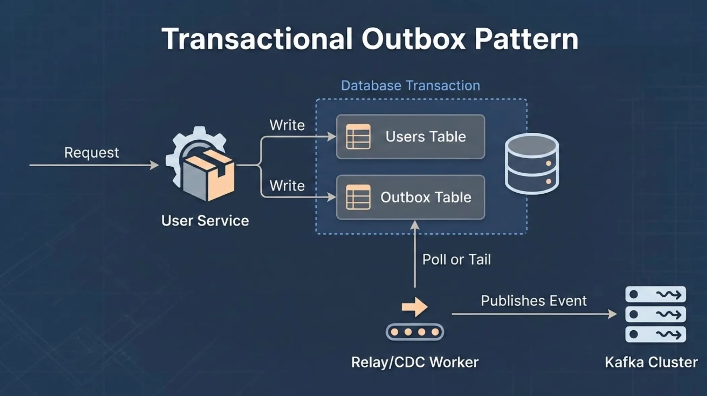
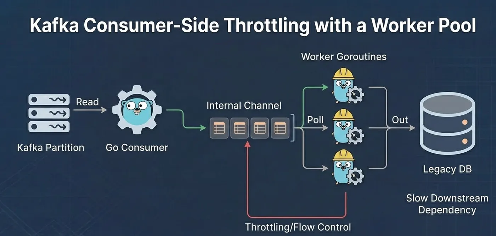
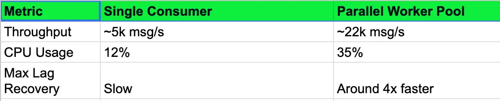

# 5 Kafka Design Patterns Every Backend Engineer Should Know

*By Abhinav · 4 min read · Mar 12, 2026*  
[Read on Medium](https://medium.com/@codingplainenglish/5-kafka-design-patterns-every-backend-engineer-should-know-e7544b26e4b5)

---

I'm staring at a laggy consumer group that's been falling behind for three hours. The ops channel is quiet, but the lag metrics are screaming.

This is usually the moment you realize your "simple" pub-sub architecture is actually a ticking time bomb of unhandled edge cases.

I've spent the last five years bouncing between Go and Java, wrestling with high-throughput systems. If there's one thing I've learned, it's that Kafka isn't a database, and it's definitely not just a "fast queue." It's a distributed commitment to complexity.

Here are the five patterns that actually saved my sleep schedule.

---

## 1. The Outbox Pattern: Consistency Without Distributed Transactions

We've all been there: you update a user's balance in Postgres, but the network blips before you can emit the `payment_processed` event to Kafka. Now your database and your downstream analytics are out of sync.

The Outbox pattern is the only way I've found to stay sane. Instead of hitting Kafka directly from your service, you write the event to a dedicated outbox table in your local DB within the same transaction as your business logic.

- **The Go Way:** Use a sidecar or a simple background worker using `pglogrepl` to tail the WAL (Write Ahead Log) and push to Kafka.
- **The Java Way:** Debezium is the industry standard here, but a simple polled outbox works if you don't need sub-second latency.

---

## 2. Dead Letter Shifting (The Retry Topic)

Blocking a partition because of one bad message is a rookie mistake. If a message fails, don't just retry in a loop — you'll blow up your processing latency.

I usually implement a tiered retry system:

- **`Topic A`:** Main processing.
- **`Topic A_Retry_5m`:** If it fails, produce here with a 5-minute delay.
- **`Topic A_DLQ`:** The "human intervention" bin.

In a recent Go service, shifting failed jobs to a retry topic reduced our p99 processing time by about 40% during peak bursts because one poisoning message couldn't bottleneck the entire consumer.

---

## 3. The "Smart" Compaction: Log Compaction for State

Most engineers think of Kafka as a stream of events, but I prefer to think of it as a distributed hash map that never forgets.

If you're building a microservice that needs a local cache of "Product Prices," don't call a REST API 10,000 times a second.

Use a **Compacted Topic**. Kafka will keep only the latest value for any given key. When your service boots up, it reads the topic from the beginning to hydrate a local `SyncMap` or Caffeine cache.

---

## 4. Consumer-Side Throttling with Concurrency

In Go, it's tempting to just spin up a goroutine for every Kafka message. Don't. You'll overwhelm your downstream DB or external APIs.

I've found that using a worker pool pattern is essential.

**The Setup:** Pull a batch of messages, distribute them across $N$ workers using a keyed-hash (to maintain order per ID), and commit offsets only when the batch is done.

---

## 5. The Saga Pattern (Orchestration vs. Choreography)

In a distributed world, you can't roll back a transaction across three microservices. You have to "undo" it.

I prefer **Choreography** for simple flows (Service A emits, Service B listens). But for complex checkouts? Use **Orchestration**.

Build a "Coordinator" service in Go that manages the state machine and emits commands to Kafka, listening for "Success" or "Failure" events to trigger compensating transactions.

---

## The Benchmark Reality Check

I ran a test last month comparing a standard "Consumer-per-Partition" model vs. a "Parallel-Worker" model in Go.

The trade-off is always complexity. Parallel workers make offset management significantly harder. If you lose a worker, you might end up processing messages out of order unless you're careful with your partitioning strategy.

---

## The Math: What Is This Costing You?

Let's look at the infrastructure bill. If you're running on Managed Kafka (like Confluent or MSK), you aren't just paying for the brokers — you're paying for throughput and retention.

**Scenario:** 1 TB of data per month, 7-day retention.

| Cost Item | Detail |
|---|---|
| Standard Storage | ~$0.10/GB = $100 |
| Inter-AZ Data Transfer | ~$0.01/GB — the silent killer if producers and brokers are in different AZs |
| "Oops" scenario | Double-produce or noisy retries can balloon a $100 bill to $800+ |

> **Pro-tip:** Enable `zstd` compression. It's slightly heavier on the CPU than `snappy`, but I've seen it reduce storage costs by 30–50% for JSON payloads.

---

## Final Decision

Kafka is a beast, but it's a predictable one if you respect it.

- Use **Outbox** if you care about data integrity.
- Use **Compaction** to avoid hitting your DB for "read-only" config data.
- Use **Retry Topics** to keep the pipeline moving.

If you're just starting a project with low traffic, honestly? Just use a Postgres queue or RabbitMQ. But if you're hitting 10k+ events per second, these patterns aren't optional — they're your survival guide.

I'm heading to bed. My lag alerts haven't fired in twenty minutes, so I think the worker pool is holding up.
