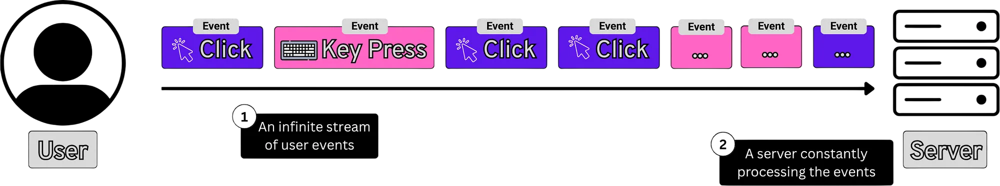
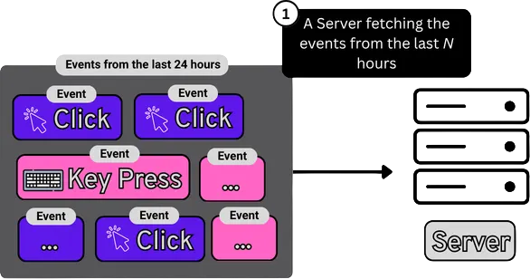
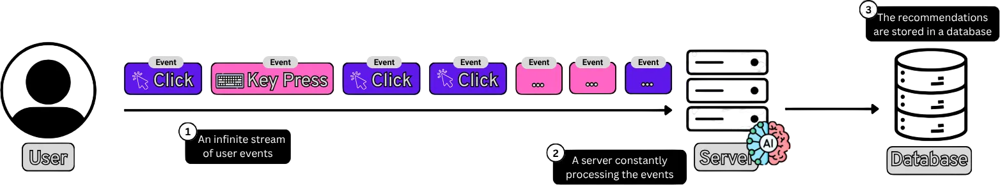
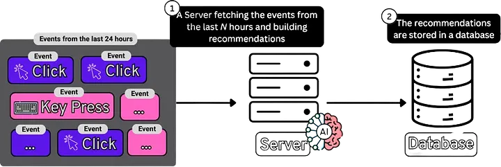
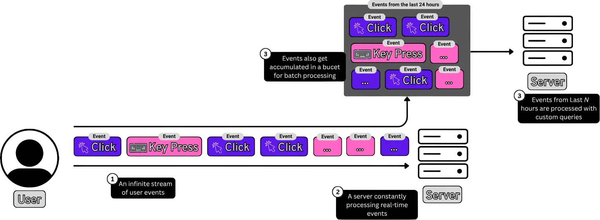
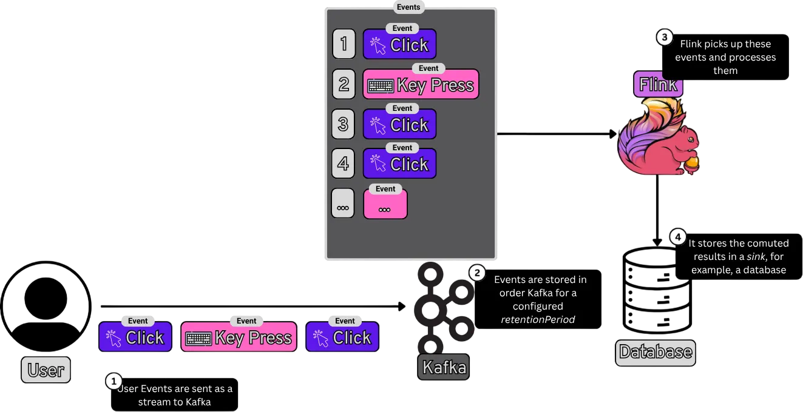
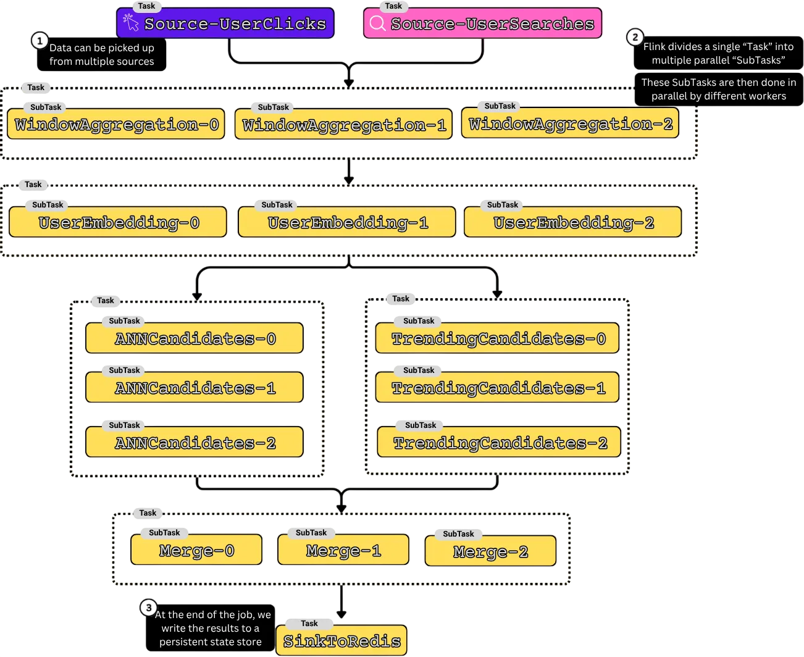
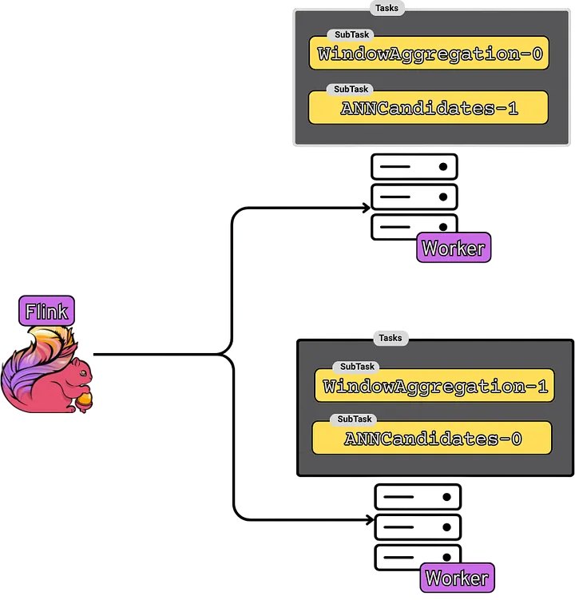

# System Design Series: Apache Flink from 10,000 Feet — Building a Flink-Powered Recommendation Engine

*By Sanil Khurana · 14 min read · May 1, 2026*

> **Source**: Originally published on [Medium](https://medium.com/@sanilkhurana/system-design-series-apache-flink-from-10000-feet)

---

For a while now, I've had Apache Flink on my "things I really need to understand properly" list. I'd seen it mentioned alongside Kafka, heard it come up in conversations about real-time pipelines, and sort-of understood the use case. But I'd never actually sat down and learned it properly.

If you feel the same way, you're in good company. Netflix uses it for near-real-time anomaly detection in their streaming infrastructure. Alibaba reportedly runs one of the largest Flink deployments in the world — processing hundreds of billions of events per day across tens of thousands of machines. Uber built their analytical platform around it. Flink has become the backbone of how some of the most data-intensive companies in the world process information as it happens.

So I dove in. And I was honestly surprised — not just by what Flink is, but by **why it exists** and **how it's built**. The story of Flink is really the story of a much deeper idea: how to understand high-scale, constantly streaming data. This post is my attempt to explain that idea from the ground up.


---

## Before We Start: Two Key Concepts

Two concepts come up constantly in this post that are worth clarifying upfront.

### What is a Stream?

A **stream** is a continuous, potentially never-ending sequence of records arriving over time. Think about a user browsing a website — every page view, every click, every scroll is an event being produced. One after another, in real time. There's no natural "end" to this — as long as the user is active, events keep coming. That's a stream.



### What is Batch Processing?

**Batch processing** means taking a finite, bounded collection of data and processing it all at once. Instead of reacting to each event as it arrives, you collect events for a period of time — say, an hour — and then run a computation over all of them together. The computation has a clear start and a clear end.



Both are legitimate ways to process data. The tension between them is what Flink was built to resolve.

---

## The Problem: How We Actually Produce Data

Let me make this concrete with an example we'll use throughout this post.

Imagine you're building a **recommendation engine** — the kind that shows users "you might also like these" based on what they've been viewing. To do this well, your system needs to know:

- What has this user been clicking on in the last few minutes?
- What items are trending right now across all users?
- Which products did this user view but not purchase in the last session?

Now, where does that data come from? Every time a user opens a product page, you record an event. Every click, every purchase, every search — your application is continuously writing records like this:

```json
{ "user_id": "u-8821", "item_id": "p-443", "event_type": "view",     "timestamp": "2024-03-10T14:32:01Z" }
{ "user_id": "u-1042", "item_id": "p-117", "event_type": "purchase", "timestamp": "2024-03-10T14:32:03Z" }
{ "user_id": "u-8821", "item_id": "p-501", "event_type": "click",    "timestamp": "2024-03-10T14:32:07Z" }
```

One record every few seconds for every user, across millions of concurrent users, continuously. That's your data. Not a file. Not a table that refreshes once a day. A **stream** — an ongoing, never-ending sequence of events.



And yet the dominant paradigm for years was to take that stream and… **ignore the fact that it was a stream**. Dump the events into files every hour. Wait for the batch job to run. Then serve recommendations based on what users were doing last hour.



Why? Because batch processing is conceptually simple. You know exactly what data you have. You can reason about the computation clearly — it starts, it runs, it finishes. Systems like Hadoop and MapReduce were built around this model and scaled to enormous data sizes.

But there's a fundamental cost: **latency**. If your batch job runs every hour, then at worst case, a user's behavior right now won't influence their recommendations for up to an hour. The user searched for a hiking rucksack — you need to show them tents and hiking poles on the next page load, not one hour later.

| Domain | Cost of Hourly Batch Latency |
|--------|------------------------------|
| **Recommendations** | User who just searched hiking gear gets shown laptop accessories |
| **Fraud Detection** | Fraudulent transactions go undetected for an hour |
| **Live Dashboards** | "Real-time" metrics can be up to 59 minutes stale |

So as data volumes grew and latency requirements tightened, engineers started building **streaming systems** alongside their batch systems — Apache Storm, Amazon Kinesis, LinkedIn's Samza.



But now you had **two systems** to maintain. Your streaming pipeline computed approximate, real-time results. Your batch pipeline ran overnight and produced accurate, complete results. You had to write the same business logic twice — once for each system, in different frameworks, kept in sync manually. When the batch job and the streaming job disagreed on a number (and they always disagreed eventually), you had to figure out which one was wrong.

> **Two codebases. Two deployment pipelines. Two sets of bugs. One serving layer trying to reconcile them.**

---

## The Key Insight: Batch Is Just a Special Case of Streaming

Here's the idea at the heart of Flink:

> **A bounded data set is just a special case of an unbounded data stream that happens to end.**

Your historical database of 5 years of user events — that's a stream that started 5 years ago and stopped today. Your log files from last month — that's a stream with a beginning and an end. The difference between "batch data" and "streaming data" is not a fundamental distinction about the nature of the data. The question is whether the stream is still flowing or has stopped.

| Processing Mode | Time Window | Data |
|----------------|-------------|------|
| Nightly batch job | Records from 6 months ago | Same JSON events |
| Streaming pipeline | Records from 6 seconds ago | Same JSON events |

If you build a system that processes streams natively — and handles both infinite streams and finite ones — you don't need separate systems. You have **one engine, one set of logic**, and you point it at whatever slice of the stream you need.

**That's what Flink tries to do.**

---

## What Is Apache Flink?

Apache Flink is a **distributed stream processing framework**. It takes a potentially unbounded stream of data (or a bounded batch of data — same thing), processes it in parallel across a cluster of machines, and produces results continuously as data flows through.



Internally, Flink jobs are written in code and converted to a **DAG** (Directed Acyclic Graph). Here's what a Flink job for a recommendation engine looks like:

```java
// ── 1. SOURCES ──────────────────────────────────────────────
searches = readFromKafka("search-events");
clicks   = readFromKafka("click-events");

// ── 2. PER-USER ACTIVITY (windowed aggregation) ─────────────
// group events by user, compute rolling features over last 30 min
userActivity = (searches + clicks)
    .keyBy(userId)
    .window(slidingWindow(size = 30, TimeUnit.MINUTES, slide = 1, TimeUnit.MINUTES))
    .aggregate(activityAggregator);
    // → { userId, recentQueries, recentClicks, categories, ... }

// ── 3. USER EMBEDDING (call user-tower model) ───────────────
// turn the activity features into a vector
userState = userActivity.asyncMap(callUserTowerModel);
    // → { userId, embedding[128], features }

// ── 4. CANDIDATE GENERATION (2 sources, then merge) ─────────
annCandidates      = userState.asyncMap(vectorAnnLookup);      // ~500 items
trendingCandidates = userState.asyncMap(trendingLookup);       // ~200 items

allCandidates = (annCandidates + trendingCandidates)
    .keyBy(userId)
    .window(2, TimeUnit.SECONDS)
    .reduce(mergeAndDedupe);
    // → { userId, candidates: ~1000 itemIds }

// ── 5. FETCH ITEM FEATURES (batched lookup) ─────────────────
scoringInputs = allCandidates
    .joinWith(userState, on = userId)
    .asyncMap(fetchItemFeatures);
    // → { userId, userFeatures, [(itemId, itemFeatures) × ~1000] }

// ── 6. RANKING (call ranking model) ─────────────────────────
ranked = scoringInputs.asyncMap(callRankingModel);
    // → { userId, top 100 (itemId, score) pairs }

// ── 7. SINK ─────────────────────────────────────────────────
ranked.writeTo(redis);
```

Flink breaks down this code into a graph of physical tasks, and breaks those tasks into smaller parallel **subtasks**:



Flink pushes tasks to worker nodes. Each worker runs its assigned tasks continuously, sends periodic heartbeats, and reports failures so Flink can restart them:



---

## Core Concepts

### Streams and Operators

Every Flink program is a **dataflow graph**: a set of operators connected by data streams.

| Component | Role | Example |
|-----------|------|---------|
| **Source** | Produces data | Kafka topic, file, database |
| **Operator** | Transforms data | Filter, map, aggregate, enrich |
| **Sink** | Consumes output | Database, Kafka topic, dashboard |

An **operator** is a unit of processing logic. For the recommendation engine, an operator might filter out bot traffic, enrich an event with product metadata, or count how many times each product was viewed.

A **stream** is the sequence of records flowing between operators — view events, click events, purchase events, one after another.

---

### Parallelism

A single machine can process events fast — but if you're handling millions of users, a single machine isn't enough. Flink solves this by running every operator in **parallel**: each operator is split into multiple **subtasks** that run simultaneously on different machines.

| Parallelism Level | What It Means |
|-------------------|---------------|
| `parallelism: 1` | One instance processing the entire stream |
| `parallelism: 4` | Four instances, each processing a portion |
| `parallelism: N` | N instances — add more machines, handle higher volumes |

For a recommendation engine with 10 million users, the window aggregation isn't running sequentially on one machine — it's split across dozens of workers.

---

### State

When a user views a product, that single event on its own tells you almost nothing. You need **context**:

- What else has this user been viewing in the past few minutes?
- Have they been looking at products in the same category?
- Did they almost purchase something similar last session?

To answer these questions, your system needs **memory** — it needs to remember what happened before.

| Stateless Operator | Stateful Operator |
|--------------------|-------------------|
| Sees event → transforms → moves on | Sees event → reads accumulated state → updates state → emits result |
| No memory of what came before | Maintains context across events |
| OK for: filtering, enrichment | Needed for: aggregations, patterns, recommendations |

Flink makes state a **first-class concept**. An operator can declare state explicitly — a counter, a hash map keyed by user ID, a sorted list of recent events. For the recommendation engine, the state might be a hash map from user ID to "list of item IDs viewed in the last 10 minutes."

**Fault tolerance**: Flink periodically snapshots all operator state to durable storage. On recovery, it restores everything to where it was before the failure. And it guarantees that state updates are applied **exactly once** — even if a machine crashes and events are replayed, your counts won't be doubled.

---

### Windows

You want to compute "the 10 most viewed products in the last 5 minutes" to power a "trending now" section. You have an operator counting views per product. But your stream is **infinite**. When do you emit a result? You can't wait until "all the events" arrive — they never stop arriving.

You need a way to slice the infinite stream into finite pieces. That's a **window**.

| Window Type | Description |
|-------------|-------------|
| **Tumbling** | Fixed-size, non-overlapping (e.g., every 5 minutes) |
| **Sliding** | Fixed-size, overlapping (e.g., last 5 min, recompute every 1 min) |
| **Session** | Activity-based, with a gap timeout |
| **Global** | All events, ended only by a custom trigger |

A window is a bounded chunk of your stream. You define it, Flink groups the events into that chunk, and when the chunk is "complete," it runs your aggregation and emits a result.

---

## Tidbits from the Original Paper

I spent some time reading the **2015 Apache Flink paper** — *"Apache Flink: Stream and Batch Processing in a Single Engine"* by Carbone, Katsifodimos, Ewen, Markl, Haridi, and Tzoumas.

### On Fault Tolerance and Exactly-Once Guarantees

> *"Flink offers strict exactly-once-processing consistency guarantees for stateful operators through a combination of distributed snapshots and partial re-execution upon recovery."*

The key phrase is **partial** re-execution — when a machine fails, Flink doesn't restart the entire job. It rolls back to the last snapshot and replays only the input from that point forward. The maximum reprocessing is bounded by the checkpoint interval — a tunable parameter.

The mechanism is called **Asynchronous Barrier Snapshotting (ABS)**:

```
Events flowing → [barrier] → Operator snapshots state → forwards barrier downstream
                                                                              ↓
                                                            Continues processing records
                                                             (no pause, no freeze)
```

Flink injects special "barrier" markers into the data stream. When an operator receives a barrier, it snapshots its state to durable storage and forwards the barrier downstream — **all while continuing to process records**. No pause, no freeze, no missed events.

### On Unified Batch and Stream Processing

> *"A bounded data set is a special case of an unbounded data stream."*

There is no separate batch engine in Flink. Batch jobs run on the **exact same distributed dataflow runtime** that processes your Kafka streams. The only difference is *how data moves between operators*.

#### Streaming Mode (Pipelined Exchange)

```
Operator 1  ████████████████████████████ (runs continuously)
              ↓  events flow one at a time, immediately
Operator 2  ████████████████████████████ (runs simultaneously)
              ↓
Operator 3  ████████████████████████████ (runs simultaneously)
```

All three operators run **at the same time**. Event #1 enters Op1, gets processed, flows to Op2, then Op3 — while Event #2 is already entering Op1. Everything is pipelined. This is how Kafka streams work.

#### Batch Mode (Blocked Exchange)

```
Phase 1:  Op1  ████████████████ DONE  → writes ALL output to intermediate storage
Phase 2:  Op2                    ████████████████ DONE  → writes ALL output
Phase 3:  Op3                                      ████████████████ DONE
```

Operator 2 **doesn't even start** until Operator 1 has finished processing **every single record**. The data is dammed up between phases — this is **blocked data exchange**. It's slower to start, but more efficient for massive volumes because each operator can optimize its work knowing the complete dataset is fixed.

#### Same Code, Two Modes

| | Streaming | Batch |
|---|---|---|
| **Operators run** | Simultaneously (pipelined) | Sequentially (blocked) |
| **Data exchange** | Records flow immediately | All records held until upstream finishes |
| **Latency** | Milliseconds | Minutes (but more efficient for large volumes) |
| **Operator code** | `userActivity.aggregate(...)` | Same `userActivity.aggregate(...)` |
| **State management** | Same checkpointing | Same checkpointing |
| **Serialization** | Same | Same |

> **Analogy**: Think of a restaurant. Streaming is an **assembly line** — the prep cook, grill chef, and plating chef all work simultaneously, passing dishes forward the moment each step is done. Batch is a **catering kitchen** — the prep team finishes ALL chopping for 500 meals first, THEN the cooking team fires up all burners, THEN the plating team packages everything. Same ingredients, same recipes — just different timing.

For the recommendation engine: the job that counts real-time view trends and the job that processes 6 months of historical events can share the **same operators, same cluster, same codebase**. The Lambda Architecture — with its two systems and two codebases — is simply no longer necessary.

---

## Wrapping Up

| # | Key Takeaway |
|---|-------------|
| 1 | Data is produced as **continuous streams**, but we've historically forced it into batches — creating latency and the operational pain of maintaining two systems |
| 2 | Flink is built on the insight that **batch is just a special case of streaming** — and unifies both in a single engine |
| 3 | Core building blocks: **operators** (processing logic), **streams** (data in motion), **state** (memory that persists across records), and **windows** (bounded slices for computation) |
| 4 | **Fault tolerance** with exactly-once guarantees is built in via Asynchronous Barrier Snapshotting |

---

*Originally published by Sanil Khurana on [Medium](https://medium.com/@sanilkhurana).*

> **Source URL**: [Apache Flink from 10,000 Feet](https://medium.com/@sanilkhurana/system-design-series-apache-flink-from-10000-feet)
>
> **Taxonomy Reference**: §4.1 Data & Analytics Architecture (Stream Processing), §3.3 Event-Driven & Messaging Architecture  
> **Related**: [Kafka Concepts Every Architect Must Master](kafka-concepts-that-every-architect-should-master.md) | [Azure Stream Analytics](https://learn.microsoft.com/en-us/azure/stream-analytics/) | [Apache Flink on Azure HDInsight](https://learn.microsoft.com/en-us/azure/hdinsight/hdinsight-apache-flink-overview)
