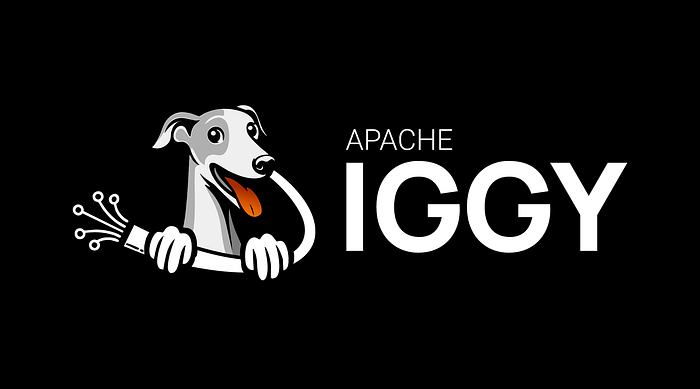

# I Thought Apache Iggy Was Just Another Kafka Clone. I Was Wrong.

## What I discovered after researching one of the fastest streaming platforms being built today 🚀

A few weeks ago, I stumbled across a discussion about a project called **Apache Iggy**.

My first reaction?

*“Great, another Kafka alternative.”*

At this point, the data infrastructure world seems to produce a new “Kafka killer” every few months. Some focus on cloud-native architecture. Others promise easier operations. A few claim better performance.

Most eventually settle into a niche.

But the more I researched Apache Iggy, the more I realized this project is different.

Not because it claims to process millions of messages per second.

Not because it’s written in Rust.

And not because it recently entered the Apache Incubator.

What caught my attention was that Apache Iggy represents a larger shift happening across modern infrastructure software. It’s part of a new generation of systems being designed around modern hardware, low-level efficiency, and simplicity rather than decades of accumulated complexity.

After spending time studying its architecture, ecosystem, and roadmap, I came away with one conclusion:

**Apache Iggy might be one of the most interesting streaming projects to watch in 2026.**

## Why We Keep Looking for Kafka Alternatives

Before talking about Iggy, it’s important to understand the problem it is trying to solve.

I have worked with teams running Kafka in production, and while Kafka is an incredible piece of engineering, nobody would describe it as simple.

Kafka offers:

- Massive scalability
- Proven reliability
- Rich ecosystem integrations
- Strong community support

But it also comes with operational overhead. Running Kafka clusters often means managing:

- Brokers
- Storage
- Replication
- Partition balancing
- Monitoring
- Capacity planning

The first time I helped troubleshoot a Kafka deployment, I felt like I was trying to maintain a Formula 1 car just to deliver messages between services.

Powerful?

Absolutely.

Simple?

Not exactly. 😅

That’s why projects like Redpanda, WarpStream, and now Apache Iggy have started attracting attention.

They’re asking an important question:

**Can we build a modern streaming platform without inheriting all the complexity of the past?**

## So What Exactly Is Apache Iggy?

At its core, Apache Iggy is a **message streaming platform**.

If you’ve used Kafka before, the concepts will feel familiar:

- Streams
- Topics
- Partitions
- Producers
- Consumers

Messages are written into streams and consumed by applications later. Think of it like a highly organized digital post office. Applications drop messages into designated mailboxes, and other applications retrieve them when needed.

The difference lies beneath the surface.

Instead of building on the Java ecosystem like Kafka, Apache Iggy was built from scratch in **Rust**.

That design decision changes almost everything.

## Why Rust Matters More Than Most People Realize

Over the last few years, I’ve noticed a fascinating trend.

Many of the most exciting infrastructure projects are being written in Rust.

Examples include:

- Databases
- Observability tools
- Network systems
- AI infrastructure
- Streaming platforms

Initially, I assumed this was simply developer enthusiasm.

After digging deeper, I realized there are legitimate technical advantages.

Rust provides:

- Memory safety
- High performance
- Zero-cost abstractions
- Predictable resource usage
- No garbage collection pauses

For systems that process enormous volumes of data, these benefits are significant.

Imagine running a logistics company.

One approach hires workers who occasionally stop everything to reorganize the warehouse.

The other keeps inventory moving continuously without interruption.

That difference becomes very noticeable at scale.

By avoiding a garbage collector and focusing on efficient memory management, Iggy is designed to squeeze every bit of performance from modern hardware.

And performance appears to be one of its strongest selling points.

## The Numbers That Made Me Pay Attention

Whenever I see benchmark claims, I become skeptical.

I’ve been burned before.

Every vendor’s benchmark somehow manages to outperform every other vendor’s benchmark. Funny how that works.

Still, Apache Iggy reports some impressive figures:

- Millions of messages per second
- Multi-gigabyte throughput
- Sub-millisecond latency
- Efficient CPU utilization

The architecture behind those numbers is particularly interesting.

Rather than relying heavily on traditional asynchronous runtimes, recent versions leverage modern Linux capabilities such as `io_uring`, allowing applications to interact with storage and networking more efficiently.

Without diving too deep into operating system internals, the goal is straightforward:

**Reduce overhead. Move data faster. Waste fewer resources.**

And in the streaming world, those optimizations matter.

## What I Found Most Interesting: It’s Not Trying to Be Kafka

One thing I appreciate about Apache Iggy is that it isn’t pretending to be Kafka.

Many modern projects market themselves as “Kafka-compatible.”

That’s a reasonable strategy because organizations already have Kafka-based tooling and workflows.

Apache Iggy took a different route.

Instead of mimicking Kafka’s protocols and APIs, it built its own architecture.

That choice carries risks.

Organizations can’t simply swap Kafka out overnight.

But it also creates freedom.

The project isn’t constrained by decisions made more than a decade ago.

It’s free to optimize around today’s hardware and today’s workloads.

Sometimes innovation happens because you improve an existing system.

Other times it happens because you’re willing to start over.

Apache Iggy falls into the second category.

## Where I Can See Apache Iggy Shining

While researching the project, I kept asking myself:

> *“Who would actually use this?”*

Several use cases immediately came to mind.

### Real-Time Analytics

Applications generating massive event streams need systems capable of ingesting and processing data quickly.

Examples include:

- Clickstream tracking
- Application telemetry
- User behavior analytics
- Gaming events

### AI and Machine Learning Pipelines

This area particularly caught my attention.

Modern AI systems generate and consume enormous volumes of data.

Streaming platforms increasingly sit between:

- Data collection
- Feature engineering
- Model training
- Inference pipelines

The fact that Apache Iggy is already exploring integrations relevant to AI workloads suggests the team is thinking ahead.

### IoT Systems

Imagine thousands of devices continuously sending sensor data.

In these environments:

- Throughput matters
- Latency matters
- Resource efficiency matters

Those are exactly the areas where Iggy is attempting to differentiate itself.

## The Biggest Limitation Nobody Should Ignore

Now for the reality check.

Every exciting project has tradeoffs.

Apache Iggy’s biggest challenge today isn’t performance.

It’s clustering.

At the time of my research, the platform remains focused on single-node operation while distributed clustering capabilities continue to evolve.

For experimentation, development environments, edge deployments, and certain production workloads, that may be perfectly acceptable.

But many enterprises require:

- High availability
- Multi-node replication
- Automatic failover
- Geographic redundancy

Without those capabilities, replacing Kafka in large-scale enterprise environments becomes difficult.

That doesn’t mean the project is flawed.

It simply means it’s earlier in its journey.

And honestly, I’d rather see a team perfect the fundamentals before rushing complex distributed features into production.

I’ve witnessed enough distributed system disasters to appreciate patience. 😄

## What Apache Iggy Reveals About the Future of Infrastructure

The longer I studied Apache Iggy, the more I realized the story isn’t really about Iggy.

It’s about a broader industry trend.

For years, infrastructure software prioritized compatibility.

Today, we’re seeing a growing focus on:

- Efficiency
- Simplicity
- Resource optimization
- Developer experience
- Modern hardware utilization

Projects like:

- Redpanda
- WarpStream
- Iggy

are all exploring different approaches to the same question:

**What would we build if we started from scratch today?**

That’s a fascinating question.

Because the answers could define the next decade of infrastructure software.

## My Biggest Takeaway

I don’t believe Apache Iggy is about to replace Kafka.

Not this year.

Maybe not even in the next few years.

Kafka remains deeply entrenched and battle-tested.

But I also think dismissing Apache Iggy as “just another Kafka alternative” would be a mistake.

The project demonstrates what becomes possible when engineers rethink assumptions instead of inheriting them.

It’s ambitious.

It’s fast.

It’s modern.

And perhaps most importantly, it’s exploring ideas that many larger platforms can’t easily pursue.

Whether Apache Iggy ultimately becomes a dominant streaming platform or simply influences the next generation of infrastructure software, I think it’s already serving an important purpose.

It’s forcing the industry to ask better questions.

And sometimes that’s how the most interesting innovations begin.

## Final Thoughts

When I first encountered Apache Iggy, I expected another familiar story.

A new streaming platform.  
A few benchmark charts.  
Some bold claims.

What I found instead was a thoughtfully engineered project that reflects where modern infrastructure appears to be heading.

If you’re a software engineer, platform architect, data engineer, or simply someone who enjoys following emerging technologies, Apache Iggy deserves a spot on your radar.

Not because it’s trying to replace Kafka tomorrow.

But because it offers a glimpse of what the next generation of streaming systems might look like.

And that’s a conversation worth paying attention to. 🚀
