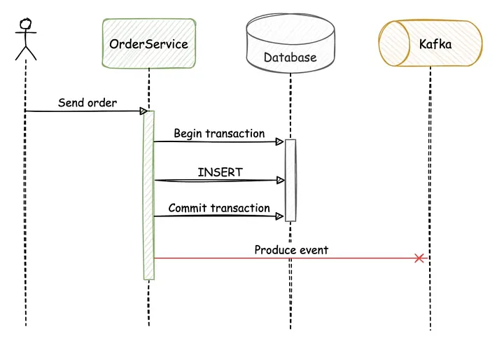
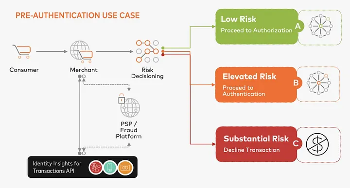
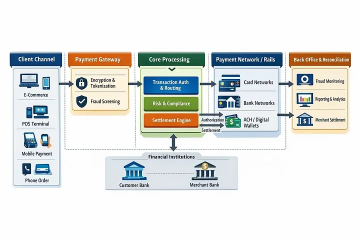

# CQRS For Fintech In 2026: Ledgers, Limits, Risk, And The Fight Over Truth

> *The most dangerous fintech bug in 2026 is not a failed payment. It is a successful response from a system that no longer knows the truth.*

**By The Atomic Architect** · 22 min read · Apr 25, 2026 · [Original on Medium](https://medium.com/@the_atomic_architect/cqrs-fintech-2026-ledger-truth-bdbbcfeb65dc)

The most dangerous fintech bug is not the one that fails loudly.
It is the one that succeeds.

The API returns 200 OK.
The customer sees “Transfer successful.”
The dashboard shows a clean available balance.
The support screen shows another number.

Then someone opens the ledger and says the sentence that makes every backend engineer go silent.

“Wait… why is this different?”


That sentence can ruin your whole week.

I have seen versions of this problem in real money-facing systems. Not always as a dramatic outage. Sometimes it starts quietly. One balance looks slightly stale. One retry creates confusion. One read model updates before another. One operation team screen tells a different story from the customer app.

And suddenly the team is not debugging code anymore.
They are arguing about truth.
That is where CQRS stops being a design pattern and starts becoming a survival boundary.

Because in fintech, the problem is not only whether your system is fast.

The real problem is whether your system can explain itself when money, limits, risk, and customer trust all collide.

And in 2026, that collision is becoming normal.
Instant payments are everywhere.
Risk checks are becoming smarter.

Customers expect real-time balance updates.
Fraud teams want immediate decisions.
Compliance teams want audit trails.

Product teams want beautiful dashboards.
Engineers want clean services.
And somewhere in the middle, one old question keeps coming back:
What is the truth?

## The Lie That Looks Simple
The biggest lie in fintech is this:

“We just need one account table.”
No, you do not.
You need a ledger.
You need limit decisions.
You need risk decisions.
You need customer-facing views.
You need operational history.
You need reconciliation.
You need auditability.

And you need all of them to stop pretending they are the same thing.
A balance column may be fine for a demo wallet.
It is not enough for a real fintech system where retries, holds, reversals, disputes, settlement delays, fraud checks, and customer complaints exist at the same time.

This is where many systems slowly become dangerous.

Not because the engineers are bad.
Not because the database is weak.
Not because Java, Kafka, Redis, or PostgreSQL failed.
The system becomes dangerous because one model is asked to answer too many questions.

Can this money move?
What should the customer see?
Has the bank settled it?
Is the transaction risky?
Has the daily limit been consumed?
Can support reverse it?
Can operations reconcile it?
Can finance report it?
Can compliance audit it?

These questions look related.
But they are not the same question.
And when you force one table, one entity, one service, and one response model to answer all of them, your system begins to lie.

Not loudly.
Politely.
Professionally.
With clean JSON.

## CQRS Is Not Fancy Here


CQRS stands for Command Query Responsibility Segregation.
That sounds heavy.
But the basic idea is simple.

A command changes something.
A query reads something.
That is all.

The problem is that most systems start simple and then slowly forget this boundary.

One endpoint begins by doing a basic transfer.
Then it checks risk.
Then it checks limits.
Then it updates balance.
Then it builds dashboard data.
Then it sends an event.
Then it calls a third party.
Then it returns a complete customer summary.
Then another team adds a support flag.
Then another team adds fraud metadata.
Then another team adds a reconciliation status.

After some time, the endpoint is no longer an endpoint.
It is a courtroom with HTTP headers.

In fintech, CQRS is not about looking modern.
It is about protecting the command side from the noise of the read side.
The command side should be strict.
Almost boring.
Almost rude.
It should ask:

Can this request be accepted?
Is it duplicate?
Is the customer allowed?
Is the account active?
Is the limit available?
Is the risk acceptable?
Can the ledger entries balance?
Can this decision be defended later?

The query side can be more flexible.
It can show dashboards.
It can use caching.
It can denormalize data.
It can build timelines.
It can serve mobile screens quickly.
It can help support teams search.
It can help operations investigate.
But it must never become the source of financial truth.

That is the heart of the whole article.
Commands protect truth.
Queries explain truth.
Never confuse the two.

## The Ledger Is Not A Balance Table


A balance table feels comforting.
It looks simple.
account_id
balance
updated_at
Done.

But fintech does not live in simple updates.
Money does not just “change.”
Money moves.

A proper ledger is not just a table that stores the latest number.
A proper ledger records financial movement.

One side is debited.
Another side is credited.

The total must balance.
Every movement should leave evidence.
If something was wrong, you do not quietly edit the past.
You post a correction.

If a payment was reversed, you do not delete the original payment.
You post a reversal.

If a fee was charged wrongly, you do not pretend it never existed.
You add another entry that explains what happened.
This is not old-school accounting drama.

This is survival.
Because in fintech, history is not garbage.

History is evidence.
A normal product system can sometimes overwrite a row and move on.
A fintech system cannot casually rewrite the past.
The past may be needed by support.
The past may be needed by reconciliation.

The past may be needed by finance.
The past may be needed by compliance.
The past may be needed by the customer.
The past may be needed by you, sitting in front of logs, trying to understand why one customer is angry and one dashboard is wrong.

That is why I do not trust fintech systems where the balance table is treated as the source of truth.

The ledger is the truth.
The balance is a derived view.
That sentence should be written on the wall of every money-facing engineering team.

## The Architecture I Would Actually Trust
Here is the hand-drawn version.
Not the conference version.
Not the version made to impress leadership.
The version I would actually want near money.

CUSTOMER / APP
                              |
                              v
                    +-------------------+
                    |  Command API      |
                    |  Move Money       |
                    +---------+---------+
                              |
                              v
                    +-------------------+
                    | Idempotency Guard |
                    | Seen Before?      |
                    +---------+---------+
                              |
                              v
          +-------------------+-------------------+
          |                                       |
          v                                       v
+-------------------+                   +-------------------+
| Limit Decision    |                   | Risk Decision     |
| Daily / Monthly   |                   | Fraud / Exposure  |
+---------+---------+                   +---------+---------+
          |                                       |
          +-------------------+-------------------+
                              |
                              v
                    +-------------------+
                    | Ledger Command    |
                    | Debit = Credit    |
                    | Append Entries    |
                    +---------+---------+
                              |
                              v
                    +-------------------+
                    | Transaction DB    |
                    | Ledger Entries    |
                    | Outbox Events     |
                    +---------+---------+
                              |
                              v
                    +-------------------+
                    | Event Publisher   |
                    | Kafka / Queue     |
                    +---------+---------+
                              |
              +---------------+---------------+
              |               |               |
              v               v               v
      +---------------+ +---------------+ +---------------+
      | Balance View  | | Risk View     | | Ops View      |
      | Fast Reads    | | Exposure      | | Reconciliation|
      +---------------+ +---------------+ +---------------+
              |
              v
        CUSTOMER DASHBOARD
        "Show Me What Happened"
The command path is narrow.
The read path is wide.
That is the point.

The command side protects correctness.
The query side protects experience.

If the read model is delayed, that is a product and communication problem.
If the ledger is wrong, that is a trust problem.

Those two problems are not equal.
A delayed dashboard can be explained.
A wrong ledger can destroy confidence.

## The Fight Over Truth
Most fintech teams do not fight because they lack data.
They fight because they have too many versions of truth.

The app team says the available balance is truth.
The ledger team says posted entries are truth.
The risk team says exposure is truth.
The limit service says remaining allowance is truth.
The payment rail says settlement status is truth.
The support tool says the customer-facing timeline is truth.

Everyone is partially right.
That is the problem.

Fintech systems need different truths for different jobs.
But they also need one final authority for financial history.

That authority should not be Redis.
It should not be Elasticsearch.
It should not be a dashboard table.
It should not be a [projection](https://github.com/gurkanindibay/azure_learning/blob/main/system-design-architecture/reference-dictionary.md#projection) worker.
It should not be a customer timeline.

It should not be an event sitting alone in a broker.
It should be the ledger.

The read model can tell the story.
The ledger must hold the truth.

When this boundary is clear, teams move faster.

When this boundary is unclear, teams spend days arguing over which table is “correct.”

That is not a technical debate.
That is architectural debt becoming emotional debt.

## The Customer Does Not Care About Your Consistency Model
This is the part engineers sometimes forget.
The customer does not care that your projection was delayed.
They do not care that Kafka retried.
They do not care that Redis had stale data.

They do not care that your system is eventually consistent.
They do not care that one service processed the event and another service was still catching up.

They ask one question:
“Where is my money?”
That question is heavier than any design pattern.
Because behind that question there may be rent.
A hospital bill.
A school fee.
A salary transfer.
A loan payment.
A family emergency.
A business payout.

For us, it is an incident.
For the customer, it may be panic.
That is why fintech architecture needs humility.

We are not just moving rows.
We are moving trust.
And trust does not come from a beautiful dashboard.
Trust comes from a system that can explain exactly what happened.

## Why Fintech CQRS Feels Different In 2026
CQRS was never invented only for fintech.
But fintech gives it a different weight.

In many apps, stale reads are annoying.
In fintech, stale reads can become support calls, disputes, wrong decisions, and customer anxiety.
In many apps, duplicate actions are irritating.
In fintech, duplicate actions can move money twice.
In many apps, failed background jobs create delay.
In fintech, failed background jobs can make one system believe a transaction happened while another system does not.

In many apps, audit logs are helpful.
In fintech, audit logs are part of the product’s backbone.

This is why 2026 fintech architecture feels different.
Payments are faster.
Fraud is faster.
Customers are less patient.
Regulation is stricter.
Data moves through more systems.

AI risk models want more context.
Operations teams want better investigation screens.
Product teams want instant everything.

But truth still needs discipline.
And that discipline cannot be added later with a dashboard.

It has to be designed into the write path.

## The Command Side Should Be Boring
A good fintech command side should not be exciting.
It should not be clever.
It should not do ten unrelated things because “the data is already there.”
It should be boring in the best possible way.
Receive command.
Check duplicate request.
Validate account.
Check risk.
Reserve limit.
Create ledger entries.
Validate debit equals credit.
Commit transaction.
Save event for publishing.
Return a clear result.
That is not glamorous.

But it is the kind of boring that lets people sleep.
The command side should not build rich dashboard responses.
It should not perform search queries.
It should not return every possible customer summary field.
It should not depend on a read model to approve money movement.
It should not ask a cache whether money can move.
It should make the decision using the strongest source available.

This is where many systems go wrong.

They use the read side because it is faster.
They use cached balance because it is convenient.
They use a projection because it already has the number.

Then one day, the projection is late.
And a wrong decision looks like a valid transaction.
Fast and wrong is still wrong.

## The Query Side Should Be Helpful
The query side has a different personality.
It should be helpful.
It should be fast.
It should be shaped around humans.

A customer does not want raw ledger entries.
A customer wants to know whether the payment is pending, successful, failed, reversed, or under review.

A support agent does not want to inspect five tables.
A support agent wants a clear timeline.
A risk analyst does not want a mobile dashboard.
A risk analyst wants exposure by account, customer, device, beneficiary, region, and behavior.

An operations team does not want the customer app response.

They want reconciliation status, failure reason, settlement reference, and correction history.

This is where CQRS becomes powerful.
The read side can create different views for different people.
The customer view can be simple.
The support view can be detailed.
The risk view can be analytical.
The operations view can be reconciliation-friendly.
The finance view can be reporting-friendly.

But all of those views should be replaceable.

Rebuildable.
Questionable.
The ledger should not be.
That is the difference.

## Idempotency Is A Fintech Seatbelt
Retries are normal.
Users double tap.
Mobile networks fail.
Payment providers timeout.
Load balancers retry.
Workers crash.

A service writes to the database but fails before returning a response.
A third-party provider receives the request but your system never receives the final answer.

So the customer tries again.
Or the app tries again.
Or your worker tries again.
Without idempotency, retries become financial danger.

The same customer intent can become two money movements.
That is not an edge case.
That is the kind of bug that makes everyone ask why the system was allowed to do that.

Idempotency is simple in idea.
A client sends a unique key for a business action.

The server remembers that key.
If the same key comes again, the server does not perform the action again.
It returns the original result.

But in fintech, the detail matters.

The idempotency key must belong to the business action.
Not just the HTTP request.
Not just the session.
Not just the customer.
The system should know:

I have seen this exact transfer request before.
I already accepted it.
I already rejected it.
I already know the result.

I will not move money again.

That is why idempotency should sit before the ledger command.
Not after.
Not somewhere in the UI.
Not as a best-effort check in logs.
Before the dangerous part.

Before money moves.

## The Code I Would Put Near The Money
This is not a full production system.
This is not a copy-paste banking engine.
This is the shape of a command path I would trust near real money.
The important thing is not Java.
The important thing is the order of decisions.

```java
@Slf4j
@Service
@RequiredArgsConstructor
public class MoneyCommandService {

    private final IdempotencyRepository idempotencyRepository;
    private final LimitService limitService;
    private final RiskService riskService;
    private final LedgerEntryRepository ledgerEntryRepository;
    private final OutboxEventRepository outboxEventRepository;

    @Transactional
    public TransferResult transfer(TransferCommand command) {
        var existing = idempotencyRepository.findByKeyForUpdate(command.idempotencyKey());
        if (existing.isPresent()) {
            log.info("Duplicate transfer ignored. key={}", command.idempotencyKey());
            return existing.get().toTransferResult();
        }
        riskService.assertAllowed(
                command.customerId(),
                command.amount(),
                command.toAccountId()
        );
        limitService.reserve(
                command.customerId(),
                command.amount(),
                command.idempotencyKey()
        );
        var debit = LedgerEntry.debit(
                command.fromAccountId(),
                command.amount(),
                command.currency(),
                command.idempotencyKey()
        );
        var credit = LedgerEntry.credit(
                command.toAccountId(),
                command.amount(),
                command.currency(),
                command.idempotencyKey()
        );
        LedgerEntry.assertBalanced(List.of(debit, credit));
        ledgerEntryRepository.saveAll(List.of(debit, credit));
        var result = TransferResult.accepted(
                command.idempotencyKey(),
                "TRANSFER_ACCEPTED"
        );
        idempotencyRepository.save(
                IdempotencyRecord.completed(command.idempotencyKey(), result)
        );
        outboxEventRepository.save(
                OutboxEvent.of("MoneyTransferred", command.idempotencyKey(), result)
        );
        return result;
    }
}
```

This code is intentionally not magical.
That is the point.

The write path should be understandable.

First, check whether the same command already happened.
Then ask risk.
Then reserve limit.
Then build balanced ledger entries.
Then persist the result.
Then store an outbox event.
Then let a separate publisher send the event to the outside world.

The event is not the source of truth.
The ledger transaction is.
The event tells other systems what the ledger already accepted.
That order matters.
A lot.

## The Outbox Is Boring Until It Saves You



A common bug hides inside this flow:
Save ledger entry.
Publish event.
Return success.
Looks fine.

Until the service saves the ledger entry and crashes before publishing the event.

Now the ledger knows the transfer happened.
The read model does not.
The customer dashboard may be wrong.
Support may be confused.
Operations may not see the event.
Or the opposite happens.

The event is published.

Another system consumes it.
But the database transaction rolls back.
Now the read side believes in a transfer that never became ledger truth.

That is why the outbox pattern is so useful.
Inside the same database transaction, save the ledger entries and the event record.

Then a separate process publishes that event safely.
This does not make distributed systems painless.

Nothing does.
But it removes one very ugly gap.
It stops your system from saying one thing in the database and another thing in the event stream.
And in fintech, reducing ways to lie is a big win.

## Limits Are Not Just Numbers



Limits sound easy until real life enters the room.
A customer can transfer a certain amount per day.
Simple.

Now ask the real questions.
Does a pending transfer consume the limit?
Does a failed transfer release it?
Does a reversed transfer restore it?
Does a scheduled transfer reserve it?
Does the day follow customer location or product rules?

Do card payments, bank transfers, and wallet payouts share the same limit?
What happens if two transfers arrive at almost the same moment?
What happens if risk rejects the transaction after the limit was reserved?
What happens if the payment provider times out?
This is why limits should not be treated as a casual read-side calculation.

A displayed remaining limit is useful.
But the displayed number should not be the final authority.

The command-side limit decision should be.
The customer screen can say, “You have this much remaining.”
But when money actually moves, the command side must make the final decision using strong rules and safe concurrency.

The read model can inform the customer.
The command model must protect the system.
That boundary matters.

## Risk Is Not The Ledger
Risk is powerful.
Risk can block a transaction.
Risk can ask for extra verification.
Risk can delay a payout.
Risk can flag a beneficiary.
Risk can put an account under review.
Risk can change its mind as new signals arrive.

That is normal.

But risk should not silently rewrite financial history.
If risk later discovers something suspicious, create a new action.

Freeze.
Reverse.
Review.
Dispute.
Recover.
Investigate.
Do not pretend the original event never happened.

A system that deletes or mutates uncomfortable financial history is not clean.
It is unsafe.

The better system tells the story clearly.
This happened.

Then this was detected.
Then this decision was made.
Then this correction was posted.

That is how fintech systems earn trust.
Not by hiding mess.
By making the mess explainable.

## Reconciliation Is Where Architecture Meets Reality
Every fintech architecture diagram looks perfect before reconciliation.
Then real money movement arrives.
A provider times out.
A settlement file arrives late.
A transaction is pending longer than expected.
A reversal comes after the customer has already seen success.
A payout succeeds externally but the internal worker fails.
An event is delayed.
A projection is stale.
A support agent sees one status and operations sees another.

This is why reconciliation cannot be an afterthought.
Reconciliation is not just a nightly job.
It is the system asking itself:
Do my records match the outside world?
Does my ledger match the payment rail?
Do my customer-visible states match my financial states?
Do my reversals make sense?
Do my failed transactions have clear final outcomes?
Do my pending transactions eventually resolve?

A serious fintech system should expect mismatch.
Not because engineers are careless.
Because distributed systems are messy.
The goal is not to pretend mismatch will never happen.
The goal is to detect it, explain it, and correct it without damaging ledger truth.

That is another reason CQRS helps.
The operations view can be designed for reconciliation.
The customer view can be designed for clarity.
The ledger can remain the source of truth.

One model does not need to carry every burden.

## The Read Model Can Be Ugly
This may sound strange, but it is freeing.
The read model can be ugly.

It can duplicate data.
It can store display-friendly status.
It can precompute balances.
It can keep a customer transaction timeline.
It can store merchant names.
It can keep daily spending summaries.

It can maintain support search fields.
It can keep risk exposure snapshots.
It can be rebuilt.
It can be replaced.
It can be optimized for one screen.

The read model is not sacred.
The ledger is sacred.

Once you accept this, product changes become less scary.
A new dashboard card does not require changing ledger design.
A new support screen does not require polluting the command model.
A new risk view does not require turning the account table into a monster.
A new mobile timeline does not require adding random display fields to
financial records.

You build the view that humans need.
But you do not let that view become the authority.
That is the power.

## The Balance Screen Is A Story
A balance screen feels like truth.
But technically, it is a story.

It is a useful story.
It is a customer-friendly story.
It may be a very accurate story.
But it is still a story built from financial facts.

A customer may see:
Available balance.
Pending amount.
Recent transaction.
Hold amount.
Failed transfer.
Reversed payment.
Upcoming debit.
Daily limit remaining.
All of this helps the customer understand their money.
But the screen itself should not decide money movement.

That decision belongs to the command side.
This is where many teams accidentally cross the line.
They build a fast read model.
Then they use it for display.
Good.

Then they use it for support.
Still okay.

Then they use it for limit checks.
Danger.

Then they use it for final transfer approval.
Now the read side is no longer a view.
It has become a hidden authority.
That is when CQRS collapses.
Not because the pattern failed.
Because the boundary was not respected.

## Kafka Does Not Fix A Confused Ledger
Kafka is useful.
Queues are useful.
Events are useful.
Streaming is useful.
But event-driven architecture does not automatically create correctness.
If your financial model is confused, events will spread that confusion faster.

A bad event is not better than a bad API response.
It is just easier to distribute.
This is why teams should be careful when they say:

“Let us make it event-driven.”

The better question is:
“What exactly is the source of truth?”

If the answer is unclear, adding events will not help.
It may make the confusion harder to debug.
Events are excellent after a trusted command has committed.
They are dangerous when used to avoid making the command boundary clear.

In fintech, the ledger should not be a side effect of a random event.
The event should describe a ledger decision that already happened.
That difference is everything.

## The Most Dangerous Architecture Is Almost Correct
The scariest fintech systems are not obviously broken.

They are almost correct.
Most transfers work.
Most balances look right.
Most retries are fine.
Most events publish.
Most read models catch up.
Most customers never complain.
That “most” is where the danger lives.
Because fintech does not only need to work on normal days.

It needs to behave under retry storms.
Under provider timeouts.
Under duplicate requests.
Under partial failures.
Under delayed events.
Under reconciliation mismatch.
Under fraud review.
Under reversal flows.
Under angry customer calls.
Under audit questions.
Under production pressure.
Architecture is not judged by the happy path.

It is judged by the day when everything is half-working and everyone wants an answer.
That is the day your CQRS boundary either protects you or exposes you.

## The Emotional Cost Of Bad Boundaries
Bad architecture does not only create bugs.
It creates stress.
It creates blame.
It creates late calls.
It creates confused support teams.
It creates product anxiety.
It creates customer anger.
It creates engineers afraid to touch old code.
It creates meetings where everyone has a dashboard, but nobody has confidence.

I think this is why fintech engineering feels different.
In many domains, a wrong screen is embarrassing.
In fintech, a wrong screen can feel personal to the customer.

They trusted you with money.
That trust is not abstract.

It is emotional.

When a customer opens the app and sees something wrong, they do not think in terms of eventual consistency.

They think, “Can I trust this company?”
That is why the architecture has to carry emotional weight.

Not just technical weight.

A strong CQRS boundary is not just cleaner code.
It is a way to protect trust from confusion.

## Where Teams Overdo CQRS
There is another side to this.
Some teams overreact.

They hear CQRS and suddenly every feature becomes a distributed system.
Every change needs an event.
Every table gets a projection.
Every query gets its own database.
Every service owns a version of truth.
Every developer needs three diagrams to explain one button.

That is not maturity.

That is architecture becoming theater.
Most fintech teams do not need full event sourcing on day one.
They do not need to replay the universe before they have clean ledger entries.

They do not need twelve projections before they have one reliable command boundary.

They do not need a complex platform before they can explain a reversal.
The first goal is simpler.

Separate money decisions from money displays.
Protect the ledger.
Make retries safe.
Make limits consistent.
Make risk decisions traceable.
Make read models rebuildable.
Make customer states honest.
That is enough to change the quality of the system.

You can grow from there.
But do not start by building a cathedral when the front door is missing.

## Where Teams Underdo CQRS
The opposite mistake is also common.
Some teams avoid CQRS because they think it is too complex.

So they keep everything in one model.
One Account entity.
One Transaction table.
One service doing everything.
One response object for every screen.
One balance field carrying too much meaning.

It feels simple.
Until it is not.
Then every new feature becomes risky.

A new limit type breaks an old query.
A dashboard field affects command logic.
A support flag changes customer behavior.
A risk update touches ledger code.
A reversal flow becomes a special case.
A pending status means five different things.
At that point, the team usually says:

“We need to refactor.”
But what they really mean is:

“We lost the truth boundary.”
CQRS is not always needed everywhere.

But in fintech, around money movement, it often becomes the cleanest way to stop one model from becoming a junk drawer for the whole company.

## The One Rule I Trust
After dealing with money-facing systems, I now trust one simple rule:
If the data can decide whether money moves, it belongs near the command side.

If the data helps humans understand what happened, it belongs on the query side.

That rule is not perfect.
But it is useful.
Available balance display belongs on the query side.

Final debit decision belongs on the command side.
Transaction timeline belongs on the query side.
Ledger posting belongs on the command side.
Risk dashboard belongs on the query side.
Risk approval belongs on the command side.

Remaining limit screen belongs on the query side.
Limit reservation belongs on the command side.
Customer notification belongs after the command result.
Financial correction belongs on the command side.

This rule keeps systems honest.
It stops a dashboard from becoming a bank.
It stops a cache from becoming a judge.
It stops a projection from becoming the ledger.
And it gives engineers a simple way to discuss architecture without turning every meeting into theory.

## The Words Matter Too
One underrated part of fintech architecture is language.

Words like “success,” “failed,” “pending,” “posted,” “settled,” “reversed,” and “available” must mean something precise.

If product, engineering, support, and operations use the same word differently, confusion becomes part of the system.

“Success” should not mean “we accepted the request but settlement may fail.”

“Available” should not mean “available unless a delayed hold arrives.”
“Failed” should not mean “failed for the customer but maybe still pending externally.”

“Reversed” should not mean “deleted.”
“Pending” should not mean “we have no idea.”

This is not just copywriting.
This is domain modeling.

A fintech system with unclear words becomes unclear code.
Unclear code becomes unclear behavior.
Unclear behavior becomes customer mistrust.
Good CQRS design should make language sharper.

The command side should define financial states.
The query side should translate those states for humans.
But translation should never become fiction.

## What A Strong Fintech Flow Feels Like
A strong flow has a certain calmness.

The customer sends a transfer request.
The system checks whether this exact request was already handled.

Risk makes a decision.
Limits are reserved safely.
Ledger entries are created.
The transaction is committed.
An outbox event is stored.

The customer receives a clear accepted response.
The read model updates.
The app shows a useful status.

If the payment rail is still processing, the app says that.
If the transfer is under review, the app says that.
If the transfer is reversed, the reversal is visible.
If support opens the case, they can see the story.
If operations checks reconciliation, they can see the evidence.
If engineering checks logs, they can follow the same command across systems.

No magic.
No hidden truth.
No dashboard pretending to be accounting.
That is what good architecture feels like.

Not fancy.
Calm.
And calm systems are rare.

## The Real Reason This Matters
The real reason CQRS matters in fintech is not performance.
Performance matters, yes.
But performance is not the soul of this pattern.

The real reason is responsibility.
A command carries responsibility.
It changes the financial world.
A query carries explanation.
It helps people understand the financial world.
When these two responsibilities are mixed without discipline, systems become fragile.

You start making financial decisions from display data.
You start displaying financial states that were never fully committed.
You start treating events as truth before the ledger agrees.
You start using cache because it is fast, not because it is authoritative.
You start solving customer confusion with more UI text instead of better architecture.

Then one day, a customer asks where their money went.
And the team has five answers.

That is the failure CQRS is meant to prevent.
Not every inconsistency.
Not every delay.
Not every bug.
But the worst kind of confusion:

A system that cannot tell you what it believes.

## The Brutal Truth About Viral Architecture Writing



A lot of architecture content online is too clean.
It shows perfect diagrams.
Perfect services.
Perfect event streams.
Perfect databases.
Perfect names.

Real fintech systems are not perfect.

They have old flows.
Manual operations.
Provider quirks.
Settlement delays.
Fraud rules.
Legacy tables.
Unclear statuses.
Retry jobs.
Support exceptions.
Customer anger.
That is why I do not trust architecture advice that sounds like it has never been in production.

Production does not ask whether your diagram is elegant.
Production asks whether your system can survive an ugly day.
CQRS for fintech should be judged by that standard.
Can it protect the ledger?

Can it prevent duplicate money movement?
Can it explain risk decisions?
Can it keep limits safe?
Can it rebuild read models?
Can it help support tell the customer the truth?
Can it help operations reconcile?
Can it help engineers debug without guessing?

If yes, it is useful.
If not, it is decoration.

## The Final Thought
The customer does not care that your projection was late.
They do not care that your worker retried.
They do not care that your cache was stale.
They do not care that your broker had a delay.
They do not care that one service was eventually consistent and another service was strongly consistent.

They ask one question:
“Where is my money?”
That question is why fintech architecture needs more humility than hype.

CQRS is not magic.
Event sourcing is not magic.
Kafka is not magic.

A beautiful dashboard is not truth.
A fast API is not truth.
A cached balance is not truth.
A search index is not truth.
The ledger is truth.

The read model is the story you tell about that truth.
And in fintech, the story must never be allowed to rewrite the truth.

That is the fight over truth.
That is why CQRS still matters.

Not everywhere.
Not blindly.
Not because it sounds impressive.
But exactly where money decisions and money explanations must stop pretending to be the same thing.

Because when trust breaks in fintech, it does not break like a normal bug.

It breaks like a promise.
And once a customer feels that promise break, no architecture diagram can repair it quickly.

So keep the command side strict.
Keep the query side useful.
Keep the ledger honest.
Keep the language clear.
Keep the history explainable.

And never let the system become fast enough to lie.
That is CQRS for fintech in 2026.

---

> **📖 Reference Dictionary**: Key terms used in this article — [projection](https://github.com/gurkanindibay/azure_learning/blob/main/system-design-architecture/reference-dictionary.md#projection), [read model](https://github.com/gurkanindibay/azure_learning/blob/main/system-design-architecture/reference-dictionary.md#read-model), [ledger](https://github.com/gurkanindibay/azure_learning/blob/main/system-design-architecture/reference-dictionary.md#ledger), [CQRS](https://github.com/gurkanindibay/azure_learning/blob/main/system-design-architecture/reference-dictionary.md#cqrs), [idempotency](https://github.com/gurkanindibay/azure_learning/blob/main/system-design-architecture/reference-dictionary.md#idempotency), [outbox pattern](https://github.com/gurkanindibay/azure_learning/blob/main/system-design-architecture/reference-dictionary.md#outbox-pattern), [reconciliation](https://github.com/gurkanindibay/azure_learning/blob/main/system-design-architecture/reference-dictionary.md#reconciliation) — are defined in the [Reference Dictionary](https://github.com/gurkanindibay/azure_learning/blob/main/system-design-architecture/reference-dictionary.md).