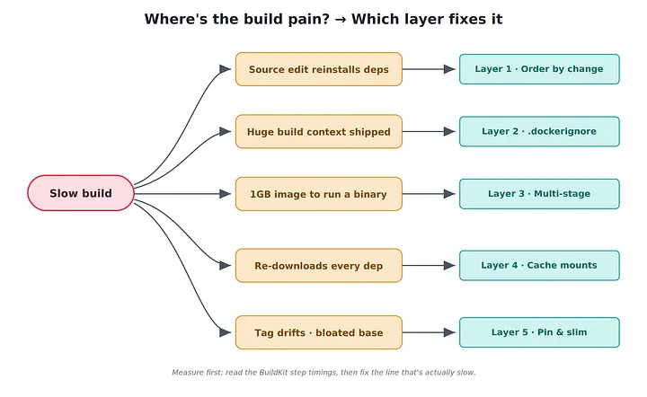
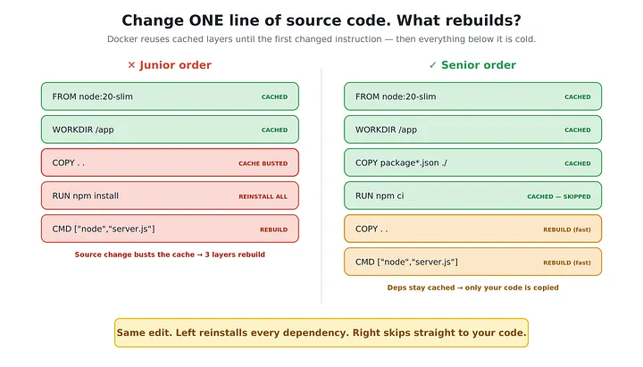

# Junior Devs Write Dockerfiles. Senior Devs Write These 5 Layers That Cut Build Time by 70%

*By The Atomic Architect · 10 min read · May 29, 2026*

---

A Dockerfile that builds in 14 minutes isn’t a build step. It’s a tax your whole team pays, every push, forever.



The first time I watched a senior engineer cut a build from 14 minutes to under 4, he didn’t add a single tool. He didn’t upgrade the CI runner. He didn’t pay for a bigger machine.

He reordered eleven lines.

I was three months into my first real backend job. Our deploy pipeline was a running joke — you’d push a one-line fix, then go make coffee, answer Slack, water a plant, and the build still wouldn’t be green when you got back. Forty engineers, dozens of pushes a day, each one waiting on the same fourteen-minute Docker build. Nobody had measured what that cost. I did the math later. It was most of an engineer’s salary, evaporating into a progress bar.

Then Marcus, who’d been writing containers since before most of us could spell `FROM`, opened the `Dockerfile` during a Friday cleanup, made a face, and said the line I've never forgotten:

> “This thing rebuilds the entire world every time you change a comment.”

He was right. And the fix wasn’t clever. It was structural. Junior devs write Dockerfiles that work. Senior devs write Dockerfiles that work and never do the same work twice.

Here’s exactly what that looks like in code.

---

## Why Junior Dockerfiles Are Slow (It’s Always the Same Reason)

Almost every slow Dockerfile is slow for one reason: it busts the build cache on every change.

Docker builds in layers. Each instruction — `COPY`, `RUN`, `ENV` — creates a layer, and Docker caches each one. On the next build, it walks down your `Dockerfile` and reuses every cached layer until it hits the first instruction whose inputs changed. From that point down, everything rebuilds. Every layer after the break is cold.

So the entire game is this: put the things that rarely change at the top, and the things that change constantly at the bottom. Get that ordering wrong and you reinstall your entire dependency tree because you fixed a typo in a route handler.

That single idea powers the first three patterns below. The other two are about what the cache can’t save you from.

---

## Layer 1: Order by Change Frequency, Not by What Feels Natural

This is the one Marcus fixed in eleven lines. It’s responsible for the majority of the speedup, and it’s the one juniors get wrong almost universally — because the wrong way reads more logically.

### ❌ WRONG — copy everything, then install

```dockerfile
FROM node:20-slim
WORKDIR /app
COPY . .
RUN npm install
CMD ["node", "server.js"]
```

This looks fine. It is fine — until you change one line of source code. `COPY . .` copies your whole project, so the moment any file changes, that layer's cache is invalidated, and the `npm install` underneath it reruns from scratch. Every time. You reinstall five hundred packages because you renamed a variable.

### ✅ CORRECT — copy the manifest first, install, THEN copy source

```dockerfile
FROM node:20-slim
WORKDIR /app
# These change rarely - cache them aggressively
COPY package.json package-lock.json ./
RUN npm ci
# This changes constantly - keep it last
COPY . .
CMD ["node", "server.js"]
```



Now `npm ci` only reruns when `package.json` or the lockfile actually changes. Edit your source a hundred times a day and the dependency install stays frozen in cache. The build skips straight to copying your code.

The same shape works in every ecosystem:

```dockerfile
# Go — copy go.mod/go.sum and download before the source
COPY go.mod go.sum ./
RUN go mod download
COPY . .

# Java/Maven - copy the pom and resolve before the source
COPY pom.xml ./
RUN mvn dependency:go-offline
COPY src ./src
```

**The Rule:** If editing one source file reinstalls your dependencies, your layers are ordered wrong. Manifest first, dependencies second, source last — always.

---

## Layer 2: A `.dockerignore` That Actually Does Its Job

Before Docker runs a single instruction, it ships your entire build context to the daemon. No `.dockerignore`, and you're tarring up `.git`, `node_modules`, build artifacts, local `.env` files, and that 400MB folder of test fixtures someone committed in 2023 — and sending all of it over, every build.

### ❌ WRONG — no `.dockerignore` at all

```text
# Docker uploads .git/, node_modules/, dist/, coverage/, *.log...
# "Sending build context to Docker daemon  847MB"
```

### ✅ CORRECT — `.dockerignore` in the project root

```text
.git
node_modules
dist
build
coverage
*.log
.env
.env.*
Dockerfile
.dockerignore
README.md
**/*.test.js
```

Two wins here, not one. The obvious one: less data shipped means a faster context upload. The subtle one, and the bigger one: excluding `node_modules` means your local install doesn't sneak into the image and silently break the `COPY . .` cache from Layer 1. A `node_modules` folder that changes on your laptop will invalidate that layer even when your actual source didn't.

**The Rule:** No `.dockerignore` is a bug, not an omission. If you wouldn't `git add` it, Docker shouldn't see it.

---

## Layer 3: Multi-Stage Builds — Throw Away the Toolchain

Here’s a question juniors rarely ask: why is my production image shipping a C compiler?

Because the single-stage build that compiles your app also bakes in everything used to compile it — build tools, dev dependencies, intermediate files. You ship a 1.2GB image to run a 30MB binary.

### ❌ WRONG — one stage, everything ships

```dockerfile
FROM node:20
WORKDIR /app
COPY package.json package-lock.json ./
RUN npm ci                 # includes devDependencies
COPY . .
RUN npm run build          # needs the dev toolchain
CMD ["node", "dist/server.js"]
# Final image: ~1.1GB, full of build-time junk
```

### ✅ CORRECT — build in one stage, ship from a clean one

```dockerfile
# ---- build stage ----
FROM node:20 AS builder
WORKDIR /app
COPY package.json package-lock.json ./
RUN npm ci
COPY . .
RUN npm run build && npm prune --production

# ---- runtime stage ----
FROM node:20-slim
WORKDIR /app
COPY --from=builder /app/node_modules ./node_modules
COPY --from=builder /app/dist ./dist
CMD ["node", "dist/server.js"]
# Final image: ~180MB, runtime only
```

The runtime stage starts fresh and copies in only the artifacts it needs. The compiler, the dev dependencies, the source — none of it makes the trip. For compiled languages the difference is brutal in your favor:

```dockerfile
# Go — from a 900MB build image to a near-empty runtime
FROM golang:1.22 AS builder
WORKDIR /src
COPY go.mod go.sum ./
RUN go mod download
COPY . .
RUN CGO_ENABLED=0 go build -o /app/server .

FROM gcr.io/distroless/static-debian12
COPY --from=builder /app/server /server
ENTRYPOINT ["/server"]
# Final image: ~15MB. No shell, no package manager, tiny attack surface.
```

Smaller images don’t just build faster to push and pull — they cut your registry costs, speed up every deploy and autoscale event, and shrink your security surface. And with BuildKit, independent stages build in parallel.

**The Rule:** Your production image should contain what runs, not what built it. If you can `cat` a compiler in your running container, you're shipping too much.

---

## Layer 4: Cache Mounts — Persist Caches the Layer Cache Can’t

Layers 1–3 are about keeping the cache. But sometimes the cache legitimately breaks — you bump one dependency, and the whole `npm ci` layer goes cold. Now you're redownloading every package over the network, even the 499 that didn't change.

This is where most engineers stop, because they think the layer cache is all there is. It isn’t. BuildKit gives you cache mounts — a persistent directory that survives across builds, independent of layer caching.

### ❌ WRONG — every dependency change redownloads everything

```dockerfile
COPY package.json package-lock.json ./
RUN npm ci
```

### ✅ CORRECT — mount a persistent package cache

```dockerfile
# syntax=docker/dockerfile:1
FROM node:20-slim
WORKDIR /app
COPY package.json package-lock.json ./
RUN --mount=type=cache,target=/root/.npm \
    npm ci
```

Now even when the layer is invalidated, `npm` pulls from the warm cache on disk instead of the network. The first build fills the cache; every build after that reuses it. It works everywhere package managers keep a download cache:

```dockerfile
# Go module + build cache
RUN --mount=type=cache,target=/go/pkg/mod \
    --mount=type=cache,target=/root/.cache/go-build \
    go build -o /app/server .

# Maven local repository
RUN --mount=type=cache,target=/root/.m2 \
    mvn package -DskipTests

# pip wheel cache
RUN --mount=type=cache,target=/root/.cache/pip \
    pip install -r requirements.txt
```

One catch worth knowing: cache mounts live on the build machine, so in CI you need a runner that persists the BuildKit cache between jobs (or export it explicitly with `--cache-to` / `--cache-from`). On a stateless runner with no cache persistence, this layer does nothing — which is exactly the kind of detail that separates "I read about cache mounts" from "I've actually shipped them."

**The Rule:** The layer cache protects you from re-running steps. Cache mounts protect you from re-fetching data. You want both.

---

## Layer 5: Pin the Base Image and Stop Splitting RUN

The last layer is two small habits that quietly cost juniors minutes and reproducibility.

First, the base image. `FROM node:20` looks pinned. It isn't — that tag moves, so your "identical" build pulls a different image next month and your cache silently invalidates. And the full image is enormous compared to its slim variant.

### ❌ WRONG — moving tag, bloated base

```dockerfile
FROM node:20            # ~1.1GB, and "20" changes under you
```

### ✅ CORRECT — slim variant, pinned by digest for reproducibility

```dockerfile
FROM node:20.11.1-slim@sha256:1c1...   # ~250MB, byte-for-byte stable
```

Second, the `RUN` splitting that quietly poisons your image size:

### ❌ WRONG — each RUN is its own layer; the cleanup does nothing

```dockerfile
RUN apt-get update
RUN apt-get install -y curl
RUN rm -rf /var/lib/apt/lists/*   # too late — the files are baked into earlier layers
```

### ✅ CORRECT — one layer, cleanup in the same layer it's created

```dockerfile
RUN apt-get update && \
    apt-get install -y --no-install-recommends curl && \
    rm -rf /var/lib/apt/lists/*
```

Layers are immutable. Deleting a file in a later `RUN` doesn't shrink the image — the bytes still live in the earlier layer. To actually remove weight, you create and clean up in the same instruction.

**The Rule:** Pin what you depend on, slim what you ship, and clean up in the same layer you made the mess.

---

## The 70% Is a Lie (When You Skip This Part)

I promised 70%, and on our pipeline it was closer to 73% — fourteen minutes to under four. But I’d be doing exactly what the demo-merchants do if I let you believe these five layers always deliver that. They don’t, and the cases where they fail are the ones worth knowing.

If your CI runner is stateless and wipes the cache between jobs, Layers 1 and 4 give you almost nothing — there’s no warm cache to hit. You’ll need to export the cache to your registry with `--cache-from` / `--cache-to`, or use a runner that persists the BuildKit volume, before the ordering tricks pay off at all. Plenty of teams reorder their layers beautifully and see no improvement, then conclude "caching doesn't work," when the real problem is they're throwing the cache away every single build.

If your build is dominated by a genuinely heavy compile step — a large Rust workspace, a webpack build over thousands of modules — layer ordering won’t touch the slow part. There you want incremental compilation caches (cache mounts on the build cache directory) and parallel stages, not manifest reordering.

And if your image is slow to deploy rather than slow to build, none of this is your bottleneck — that’s an image-size and registry problem, which is what Layers 3 and 5 are quietly for.

The point isn’t that five tricks fix everything. It’s that almost nobody measures which part of their build is actually slow before they start optimizing. Profile first. `docker build` with BuildKit prints timing for every step. Read it. Optimize the line that's actually costing you, not the one that's easiest to change.

---

## The Mental Model That Changes Everything

Junior devs see a `Dockerfile` as a setup script — a list of commands to get the app running. Senior devs see it as a cache strategy that happens to produce an image.

Every line you write is answering one question: how often does this change, and what does it cost to redo when it does? Put that question at the center and the five layers stop being tricks to memorize. They become obvious:

- Stable things go up top (ordering).
- Don’t ship what you don’t need (`.dockerignore`, multi-stage).
- Persist what’s expensive to fetch (cache mounts).
- Pin what must not drift (digests).

Marcus never memorized a list. He just refused to let the build do the same work twice. Once you start seeing your `Dockerfile` that way, you’ll never write `COPY . .` on line three again.

---

## Your Action Plan for Monday

Don’t refactor every `Dockerfile` you own. Pick one — your slowest — and do these in order:

1. Run the build twice and read the BuildKit step timings. Find the single slowest step. Measure before you touch anything.
2. Move your manifest copy and dependency install above `COPY . .`. (Layer 1 — biggest win, smallest change.)
3. Add a real `.dockerignore` with `node_modules` and `.git` in it. (Layer 2.)
4. Split it into a build stage and a slim runtime stage. (Layer 3.)
5. Add a cache mount to the dependency install — and confirm your CI actually persists it. (Layer 4.)

Each change makes the build more honest about what work actually needs doing. That honesty — not cleverness — is the real line between a junior `Dockerfile` and a senior one.
