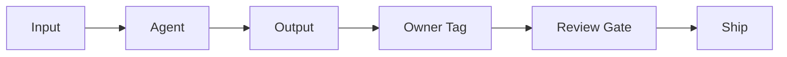

*What a viral AWS tweet reveals about the real cost of AI-generated output*

There’s a line circulating in engineering circles right now that cuts through a lot of noise:

> **“If you don’t want your name on it, it’s probably not good work.”**

AWS shared it in the context of AI-generated code. But the real weight of it lands when you apply it to AI agents — the things teams are shipping into production right now, at speed, often without asking who actually owns the output.


## The Accountability Gap Nobody Wants to Talk About

Every production agent returns an output. An answer, a recommendation, a generated report. And someone’s name is always on it — an engineer, a lead, a product team.

The problem? When an agent reasons from stale context, or retrieves an answer that’s already outdated, most teams haven’t decided who owns that failure.

The model doesn’t.  
The API doesn’t.  
The person who put it into production does.

This isn’t a philosophical point. It’s an operational one. And most teams haven’t wired their systems to reflect it.

## The Real Bottleneck Was Never Writing Code

Here’s the uncomfortable truth AWS put plainly: more AI-generated code doesn’t make your team faster. It might actually slow you down.

The bottleneck was never writing code. It’s releasing it, debugging it, and keeping it running well. Shipping volume without accountability creates debt — technical and organizational.

Honeycomb CTO Charity Majors understood this when she set a productivity target. She didn’t chase 10x. She chose **2x**, and built from there.

That’s a leadership decision, not a technology one.

## What “Quality First” Looks Like in Practice

Her team skipped mandates. Instead they built a set of AI values, the most important being:

**Every AI output has to have a human owner.**

Here’s what that looks like at the system design level:



Every output gets tagged. Every tag maps to a human. Before anything ships, a review gate asks: *would this person put their name on this?*

Simple. Hard to argue with. Easy to implement.

## A Lightweight Ownership Pattern

Here’s a practical code pattern teams can adopt. Attach ownership metadata at the point of generation, not after the fact:

```python
def generate_with_owner(prompt: str, owner: str, context_date: str):
    response = agent.run(prompt)

    return {
        "output": response,
        "owner": owner,
        "context_as_of": context_date,
        "reviewed": False  # must flip to True before shipping
    }

# Example call
result = generate_with_owner(
    prompt="Summarize Q2 competitive landscape",
    owner="priya.sharma@company.com",
    context_date="2026-06-01"
)
```

This forces two things: a named owner, and an explicit context timestamp. Stale context is now visible, not hidden.

## The Arch-Level View

At a higher level, quality-first AI systems look like this:

```mermaid
flowchart TD
    Request --> Freshness[Context Freshness Check<br/>(date-tagged)]
    Freshness --> AgentRuns[Agent Runs]
    AgentRuns --> Output[Output + Owner + Date]
    Output --> HumanReview[Human Review]
    HumanReview --> Ship

    note["Required, not optional"] -.-> HumanReview
```

No review gate, no ship. The system enforces it, not team culture alone.

## Why 2x Beats 10x

Chasing 10x output with AI is a trap. It optimizes for volume. It produces outputs nobody wants their name on.

2x with accountability means:

- Fewer incidents caused by stale or hallucinated outputs
- Clearer post-mortems (there’s always a named owner)
- Teams that actually trust the tools they build

Quality first isn’t slower. It’s just honest about what “fast” actually costs.

## The One Rule Worth Borrowing

You don’t need a new framework. You need one rule applied consistently across every agent, every pipeline, every shipped output:

**Would you put your name on it?**

If the answer is no — stop, fix the context, fix the prompt, fix the review process. Then ship.

That’s it. That’s the whole lesson.
