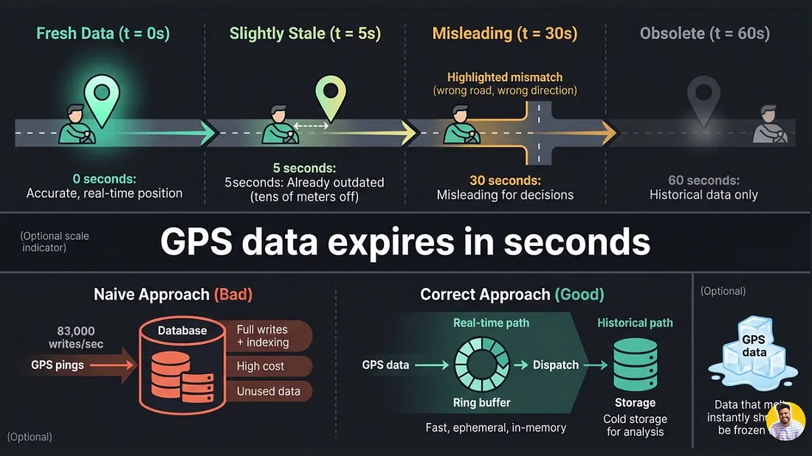
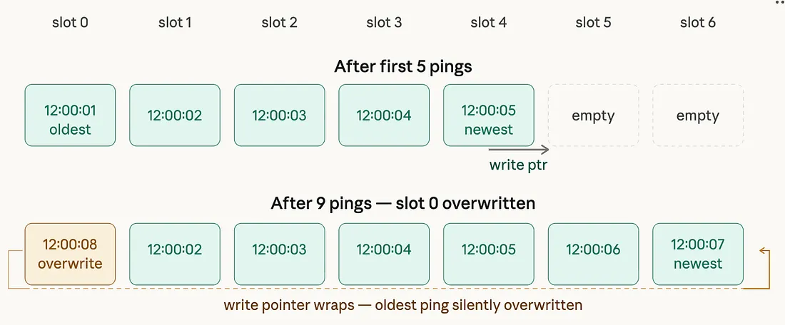
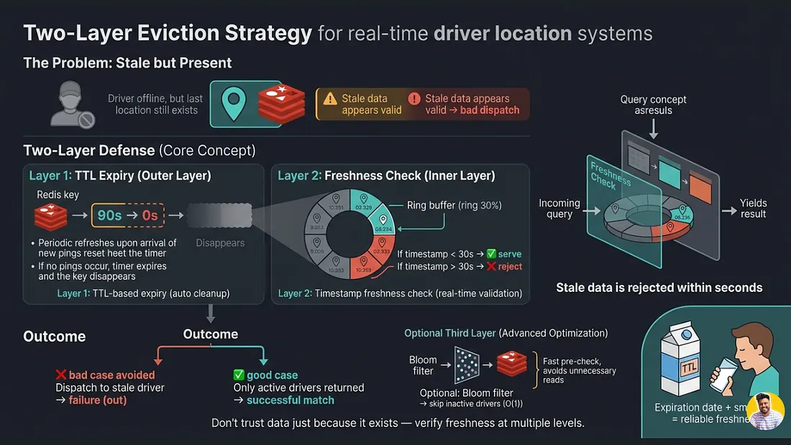
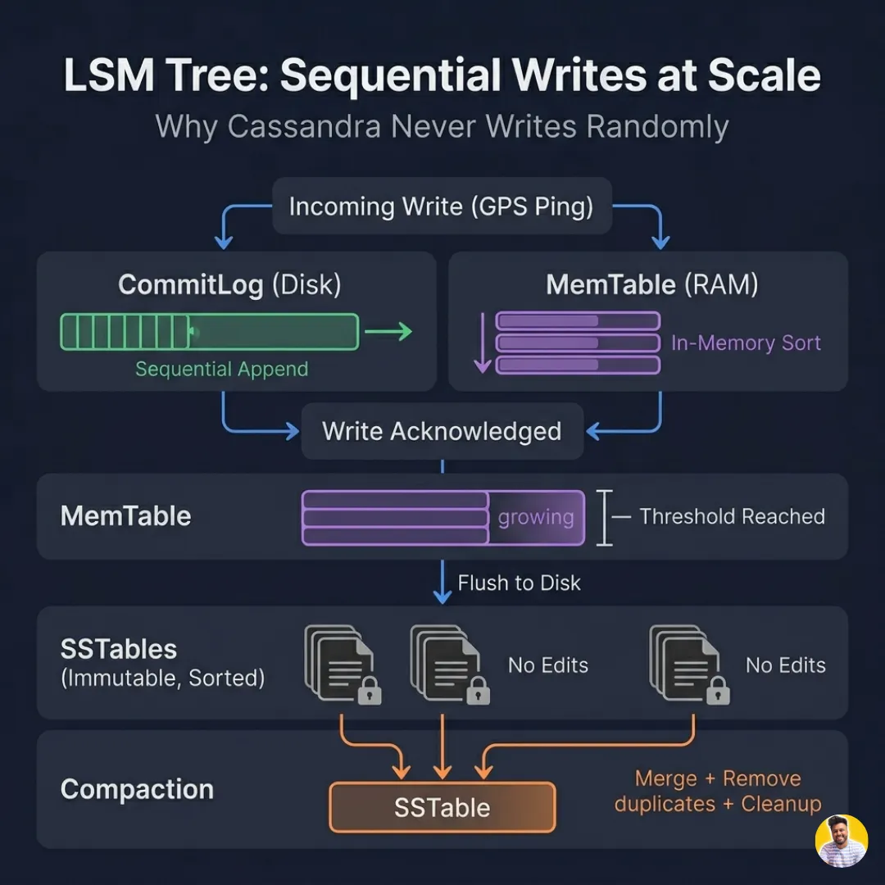
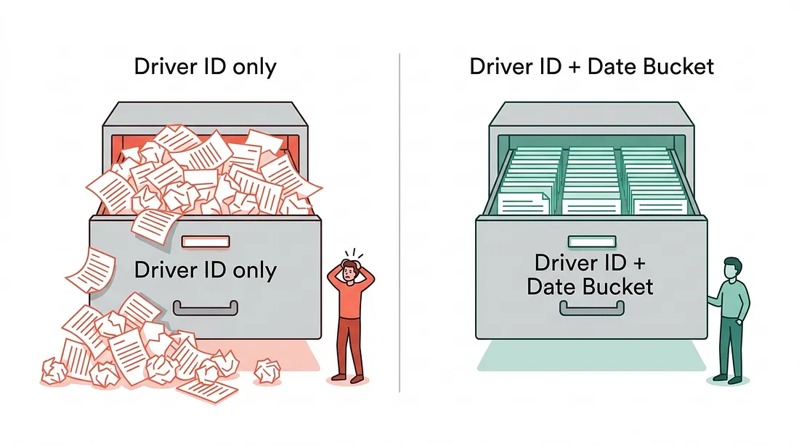
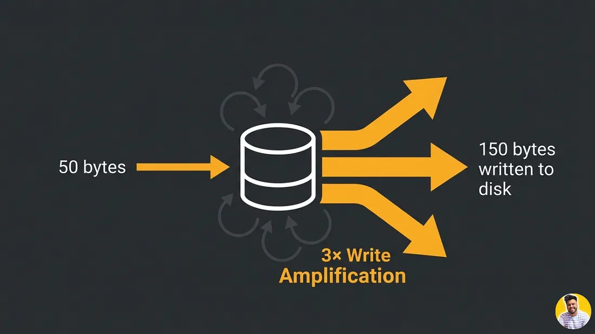
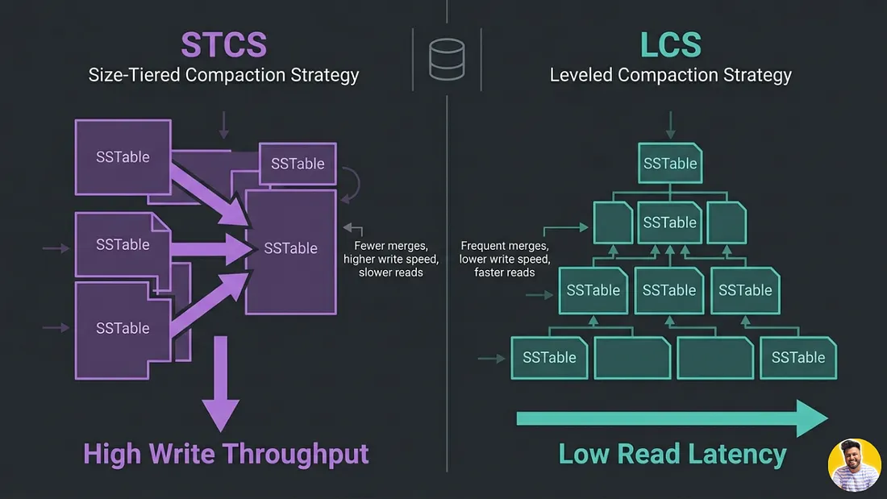
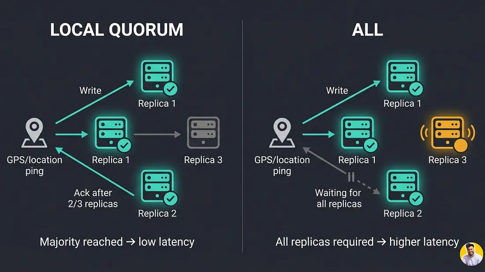
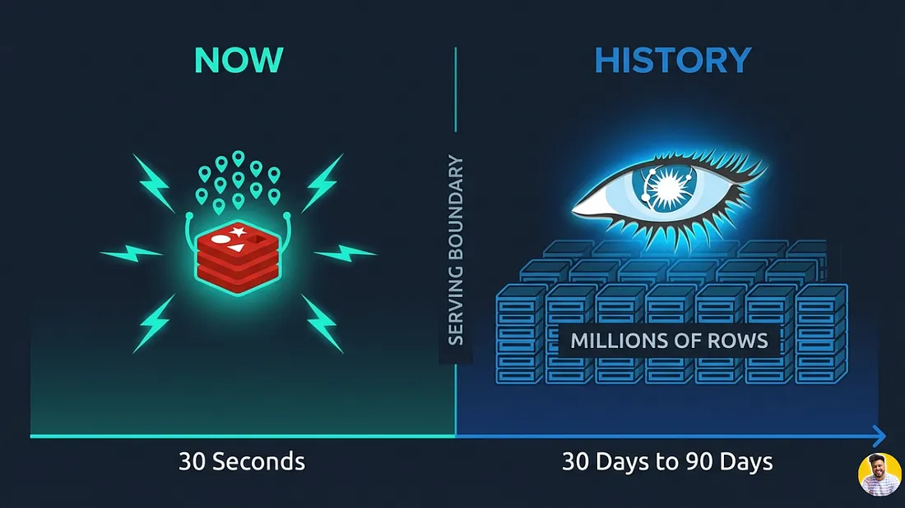

# Uber Architecture — Part 4: The Ring Buffer and Cassandra: Two Stores, One Stream

*By Simranjeet Singh · 24 min read · Mar 28, 2026*

> **Source**: Originally published on [Medium — CodeToDeploy](https://medium.com/codetodeploy/uber-architecture-part-4-the-ring-buffer-and-cassandra-two-stores-one-stream)
> **Series**: [← Part 3 — Kafka Partitioning](https://medium.com/codetodeploy) | [Part 5 — The Dispatch Engine →](https://medium.com/codetodeploy)

---

*Throw away the past. Keep the present.*

Most of what Uber receives is immediately worthless. The architecture is built around accepting that.

In Part 3, we solved the routing problem. Every GPS ping is now landing in the right Kafka partition, organized by geography rather than identity. The dispatch consumer for a given neighborhood has a complete, coherent view of every driver in its territory, without ever talking to another partition.


But now two completely different consumers are waiting at the other end of that Kafka topic. And they want the same data for completely opposite reasons.

The first consumer needs the last 10 seconds of each driver’s location. It needs to answer in microseconds. It will never look at anything older than a minute. It doesn’t care whether the data survives a server restart.

The second consumer needs every single ping, going back months. It can wait seconds for a response. It needs the data to survive anything, node failures, datacenter outages, software bugs. It will be queried by data scientists, fraud investigators, and regulatory auditors who may not show up for weeks.

> The natural instinct is to find one database that can do both. A fast, durable, geospatially-aware, high-throughput, historically-rich, sub-millisecond-read, write-optimized, infinitely-scalable database.

**That database does not exist.** And trying to build it, or pretending something close to it exists, is the next mistake most engineers make.

The correct answer is to accept that these are two fundamentally different problems, and build two fundamentally different systems. One for the present. One for the past. Both fed from the same Kafka event stream, independently, in parallel.

This part is about both of those systems: the ring buffer in Redis, and Cassandra for durable history. How they work, why they are each perfectly matched to their job, and why the boundary between them is one of the cleanest architectural decisions in the entire stack.

---

## Series Overview

| Part | Title |
|------|-------|
| Part 1 | Why Tracking 5 Million Drivers Every Second Is One of Tech's Hardest Problems |
| Part 2 | The Ingestion Edge |
| Part 3 | Kafka Partitioning by Geography and the Hexagonal Grid |
| Part 4 | **The Ring Buffer and Cassandra: Two Stores, One Stream** |
| Part 5 | The Dispatch Engine and Map Rendering |

---

## Why Most GPS Data Is Worthless Within 30 Seconds
Before talking about systems, it’s worth sitting with an uncomfortable truth that the entire storage strategy is built around.

The value of a GPS ping decays almost instantly.

Consider what a GPS ping actually represents: a driver’s location at a specific moment in time. The moment that time passes, the driver has moved. The coordinate is already stale. After five seconds, the driver is dozens of meters away from where that ping said they were. After thirty seconds, they could be hundreds of meters away, on a different road, past a junction, in a completely different H3 cell. The coordinate is now not just stale but actively misleading if used to make a dispatch decision. After sixty seconds, it is archaeological data. Useful for analytics and historical replay, but completely useless for any real-time operation.




*Why Is Most GPS Data Worthless Within 30 Seconds?*
The implication is uncomfortable but unavoidable: the vast majority of GPS data that Uber ingests has a useful lifetime measured in seconds. Sending it to a durable, indexed, queryable database as the first stop, before you have done anything with it, is an engineering category error. You are paying full database write costs, full index maintenance costs, and full storage costs for data that will never be read again after the first thirty seconds.

At 83,000 writes per second, that waste is not academic. It is hundreds of thousands of dollars per month in infrastructure costs, plus the latency penalty of having your real-time location service compete for I/O bandwidth with a write-heavy database that is perpetually ingesting data it doesn’t need.

The solution is to separate two fundamentally different problems that naive architectures collapse into one: the real-time serving problem and the historical storage problem. These are different problems. They need different systems. And the first system, the one serving real-time location queries, should be a ring buffer.

---

## Layer 3: The Ring Buffer
### What a Ring Buffer Actually Is
A ring buffer is one of the oldest data structures in systems programming, used in everything from audio processing to operating system kernel I/O queues to network packet buffers. The concept is almost absurdly simple, which is part of why it works so well.

You allocate a fixed-size array of N slots. You maintain two pointers: a write pointer that tracks where the next write should go, and a read pointer that tracks where the oldest unread data lives. Every time you write a new element, the write pointer advances by one. When the write pointer reaches the end of the array, it wraps back to the beginning. When a new write overwrites a slot that held old data, that old data is simply gone. No explicit delete. No garbage collection. No reallocation. The memory footprint is permanently fixed at exactly N elements.



*Ring Buffer Working*
For each active driver, Uber’s location service maintains one ring buffer containing the last N GPS positions, where N is typically between 5 and 10. Every time a new ping arrives for that driver, it is written into the buffer. If the buffer is full, the oldest position is overwritten. The buffer never grows. The buffer never shrinks. It costs exactly the same amount of memory whether the driver has been active for 10 seconds or 10 hours.

In Redis terms, this is implemented as a capped list per driver key: `LPUSH driver:{id}:positions {ping}` followed by `LTRIM driver:{id}:positions 0 9` to keep only the 10 most recent entries. The entire operation is atomic from Redis's perspective, no read ever sees a half-written state. The key itself has a TTL attached, so if a driver goes offline and stops sending pings, their position data automatically expires from Redis after a configured window without any explicit cleanup job needed.

> **Analogy**: A ship navigator's notepad with exactly 10 lines. Write the latest position, overwrite the oldest. Fixed size. Fixed cost. No tearing out pages. That is a ring buffer.

### What Those Last N Positions Actually Enable
The reason you need more than just the single most recent position is that the last few positions together carry information that no single position contains on its own. Three distinct real-time capabilities depend on reading across multiple recent positions simultaneously.


*How Does Uber Track Driver Location and Calculate the ETA Live?*
The first is smooth map animation. If the rider’s app simply snapped the driver marker to each new GPS coordinate as it arrived, the map experience would be a series of discrete jumps. A driver moving at 40 km/h would appear to teleport 11 meters every second. The fix is interpolation: the app knows the driver’s position at time T and at time T minus 1 second, so it can smoothly animate the marker along the path between those two positions during the one-second window before the next ping arrives. With five positions in the buffer, the app can render a smooth path rather than a straight line, which is especially important when the driver is navigating a curve or a roundabout.

The second is ETA calculation. Speed is not directly measured by a GPS chip. It is derived from displacement over time: if the driver was at position A one second ago and is now at position B, their speed is the distance between A and B divided by one second. With three consecutive positions, you get two velocity samples. You can average them to smooth out GPS jitter, and you can detect acceleration or deceleration, which lets the ETA model project forward more accurately than a single instantaneous speed reading would.

The third is dead reckoning, and it is what saves the user experience during GPS outages.

### Dead Reckoning: Predicting Where the Driver Is When You Stop Hearing From Them
Mobile GPS is not perfectly reliable. Drivers enter underground car parks. They pass through tunnels. A building with a steel frame temporarily shadows the GPS signal. The driver’s phone goes into an aggressive battery-saving mode and pauses location updates. In all of these cases, the location service stops receiving pings, but the rider’s map is still open and the rider is still watching the driver icon.

Without dead reckoning, the driver icon would simply freeze the moment GPS updates stop. After a few seconds, it would look broken. The rider would wonder if the app had crashed.

With dead reckoning, the location service reads the last known velocity vector from the ring buffer: direction of travel and speed, derived from the most recent position pair. It projects that vector forward in time, updating a synthetic estimated position every second even though no real ping has arrived. The driver icon on the rider’s map continues to move, continuing along the road it was on, at roughly the speed it was traveling, until either a real ping arrives to correct the estimate or the dead reckoning window expires.

The beauty of this approach is that it requires no server-side change and no special GPS recovery logic. The ring buffer already contains everything you need. The last two positions give you a velocity vector. Advancing that vector forward is elementary arithmetic. The client-side app does this computation locally, using the ring buffer data it received in the last real push, meaning it keeps working even if the WebSocket connection itself briefly drops.

Production dead reckoning at Uber does not use a simple linear velocity projection. It runs the projection through a map-matching layer, which constrains the predicted position to the road network. A driver cannot be predicted to drive through a building or across a median. The predicted trajectory follows the most likely road path given the last known heading, using a simplified version of the same road graph that powers the full ETA model. This is why the driver icon on your Uber map continues to follow the road even when GPS is briefly lost, rather than drifting off into a park.

### The Two-Layer Eviction Strategy
A ring buffer alone is not quite sufficient. Consider a driver who goes offline mid-shift: their app closes, their phone dies, their network drops entirely. The ring buffer stops receiving new pings. But the last position it received is still sitting in Redis, associated with a TTL. Until that TTL expires, the location service will happily serve that stale position to anyone who queries it.



*The Two-Layer Eviction Strategy*
For the dispatch engine, a stale position that looks fresh is more dangerous than no position at all. Dispatching a ride to a driver who is offline and whose last known position is 20 minutes old is a failed match that wastes the rider’s time and damages the experience.

The eviction strategy has two independent layers working together as a defense in depth.

The first layer is TTL-based expiry. Every Redis key that stores a driver’s ring buffer has a TTL, typically 60 to 90 seconds. Every time a new ping arrives and is written into the buffer, the TTL is refreshed. If pings stop arriving because the driver goes offline, the TTL counts down and the key expires automatically. The driver’s position data disappears from Redis without any explicit cleanup. Subsequent queries for that driver return nothing, which the dispatch engine interprets as an offline or unavailable driver.

The second layer is ring overwrite freshness metadata. Each slot in the ring buffer stores not just the position but also the timestamp of when that ping was received. Before serving a position to any consumer, the location service checks the timestamp of the most recent slot. If it is older than a configured threshold, typically 15 to 30 seconds, the position is treated as stale regardless of whether the key has expired yet. This catch handles edge cases where the key’s TTL has been refreshed by some system artifact but the actual data inside the buffer is old.

Together, these two layers mean that a stale position can linger in the system for at most a few tens of seconds before being treated as non-existent.

A milk carton in your fridge has two freshness signals. The printed expiration date is like the TTL: after that date, the carton is definitely gone. But you also open it and smell it before using it, because the date can be wrong or the fridge might have malfunctioned.

> **Analogy**: The TTL is the printed expiration date on a milk carton. The timestamp freshness check is opening it and smelling it before using it. Two independent signals. Defense in depth.

Some teams extend the ring buffer pattern with a bloom filter as a third layer, a probabilistic data structure that can answer “has this driver sent a ping in the last N seconds?” in `O(1)` time and essentially zero memory, before the location service even touches the ring buffer itself. The bloom filter occasionally produces false positives, but false negatives are impossible. A “maybe active” result triggers a full ring buffer freshness check, while a “definitely not active” result skips the Redis read entirely. At millions of concurrent drivers, avoiding even a small fraction of unnecessary Redis reads translates to meaningful latency and cost savings.

### The Ring Buffer in One Sentence
The ring buffer is where real-time serving lives. It receives validated, geo-partitioned pings from Kafka. It writes them into a fixed-size circular structure in Redis, one buffer per driver, each capped at the last N positions. It serves those positions in microseconds to the dispatch engine and the map rendering layer. And it automatically discards everything older than what any consumer actually needs, keeping memory bounded and latency predictable regardless of how long any individual driver has been active.

Everything older than the last 10 pings flows somewhere else entirely. That somewhere else is Cassandra, and it is a completely different kind of system solving a completely different kind of problem.

---

## Layer 4: Cassandra for Durable Storage
### The Gap the Ring Buffer Deliberately Creates
Everything in the ring buffer layer is ephemeral by design. Redis flushes. TTLs expire. Ring slots get overwritten. A driver’s position history longer than a few seconds simply does not exist in that layer. That is exactly what makes it fast.

But it creates a gap that needs filling.

Uber’s data science teams need historical position trails to train ETA models. The fraud and safety team needs GPS history to investigate disputed trips. Regulatory compliance in some markets requires that trip trajectories be stored and producible for auditing. The supply forecasting team needs months of movement data to predict where demand will be concentrated during next weekend’s football match.

None of these use cases can be served from a ring buffer that only holds the last ten seconds.

So every GPS ping that flows through the ring buffer layer also flows into a separate durable storage layer in parallel. Same Kafka event, two consumers: one writes to Redis for real-time serving, one writes to Cassandra for durable history. The two paths are completely independent. A Cassandra write failure does not affect the real-time path. A Redis eviction does not affect the historical record. The separation of concerns is total.

But writing 83,000 GPS coordinates per second durably to a database is its own engineering problem. And this is where most first-time system designers reach for Postgres or MySQL, and immediately hit a wall.

### Why Postgres and MySQL Fail at This Workload
Postgres and MySQL are excellent databases. For transactional workloads with complex queries, foreign key constraints, joins across many tables, and ACID guarantees, they are the right tool. But GPS time-series ingestion is not that workload. It is the opposite workload: extremely high write throughput, essentially no joins, no complex transactions, and read patterns that are almost always range scans over time within a single driver’s history.

Both Postgres and MySQL use a B-tree as their primary index data structure. A B-tree is a balanced tree that keeps data sorted on disk in key order. This makes reads fast, sorted data can be found with a binary search in `O(log N)` time. But it makes high-throughput writes expensive, because every write to a B-tree potentially requires reading an existing disk page, modifying it in memory, and writing it back to a random location on disk.

This is called a random write. On spinning disks, random writes are roughly a hundred times slower than sequential writes. On SSDs, the penalty is smaller but still meaningful, and it manifests as write amplification: the database writes far more data to disk than you actually sent it, because it needs to maintain the sorted B-tree structure through page splits, page merges, and index updates.

At 83,000 writes per second sustained, random write overhead in a B-tree database exhausts disk I/O bandwidth, increases write latency, and ultimately limits the throughput your hardware can sustain. You can throw faster SSDs at the problem, but you are fighting the data structure rather than working with it.

| | B-Tree (Postgres/MySQL) | LSM Tree (Cassandra) |
|---|---|---|
| **Write pattern** | Random writes (modify in place) | Sequential appends (log-structured) |
| **Write throughput** | Limited by page splits/merges | Extremely high |
| **Read pattern** | Fast sorted reads `O(log N)` | Efficient range scans within partition |
| **Storage overhead** | Write amplification from B-tree maintenance | Write amplification from compaction |
| **Best for** | Transactional, join-heavy, ACID | Time-series, append-heavy, high-ingest |

Cassandra was designed for exactly the opposite tradeoff.

### The LSM Tree: Why Cassandra's Writes Are Always Sequential
Cassandra uses a Log-Structured Merge tree, commonly called an LSM tree, as its storage engine. The name sounds complex but the intuition is clean. Instead of finding the right place on disk and modifying it in place, LSM trees treat every write as an append to a sequential log. Appends are always fast because they go to the end of a file, never to a random offset.




*Working of LSM Tree inside Cassandra Database*
When a GPS ping arrives at Cassandra, two things happen simultaneously. First, the write is appended to the `CommitLog`, a sequential file on disk that exists purely for crash recovery. This append is extremely fast because it always goes to the end of the file. Second, the write is inserted into the `MemTable`, an in-memory data structure that keeps writes sorted by partition key and clustering key.

The client receives an acknowledgment as soon as both of these steps complete. At no point has Cassandra done a random disk read or a random disk write. The entire write path is either in RAM or a sequential disk append.

The `MemTable` accumulates writes until it reaches a configurable size threshold, typically tens of megabytes. When that threshold is crossed, Cassandra flushes the entire `MemTable` to disk as an `SSTable`, a Sorted String Table. An `SSTable` is an immutable, sorted file. Once written, it is never modified. Subsequent writes go into a new `MemTable` and eventually a new `SSTable`.

Over time, the disk accumulates many SSTables. A background compaction process periodically merges multiple SSTables into a single larger sorted `SSTable`, removing deleted records and duplicate versions of the same key along the way. Compaction is the maintenance operation that keeps reads efficient despite the append-only write model.

> **Analogy**: Taking notes on index cards. Write a new card for every fact. When you have a stack, sort and merge them into a notebook. You never erase mid-card. Always write a new card first, sort later. The sorting happens offline, not while you're trying to write fast.

### The Data Model: Why Your Partition Key Determines Everything
Cassandra’s performance characteristics are almost entirely determined by the data model you choose. A good partition key makes queries fast and distributes load evenly across the cluster. A bad partition key creates hot partitions: one node drowning under the entire cluster’s write load while the others sit idle.

The naive partition key for GPS data is `driver_id` alone. It seems logical: all data for a given driver lives together, queries for a driver's history are a single partition scan. But it has a fatal flaw at Uber's scale. A highly active driver who has been online for twelve hours accumulates hundreds of thousands of rows under their `driver_id` key. In cities with high driver density, you can end up with systematic hot spots tied to your most active drivers.

The correct partition key separates position data across time as well as by driver:

```
Partition key:   (driver_id, date_bucket)
Clustering key:  timestamp DESC
```
date_bucket is a coarse time unit, typically a single calendar day formatted as a string like 2024-01-15. This means a driver's data is partitioned not into one enormous partition per driver, but into one partition per driver per day. A driver online for twelve hours on a given day has all their data in a single, bounded partition. The next calendar day, a new partition starts. The partition size is capped by the number of pings per day, a known, bounded quantity, rather than by total driver lifetime activity.



*Cassandra Data Model for Handling Drivers*
The clustering key is timestamp with descending order. This is a deliberate read optimization. The most common query against this table is “give me the recent history for this driver”, not “give me everything from six months ago.” Clustering in descending order means the newest rows sit physically at the head of the partition on disk. A range query that reads the last hour of a driver’s history scans from the top of the partition and stops. It never reads old rows it doesn’t need.

> **Analogy**: A filing cabinet where each driver gets a drawer. Bad design: one drawer per driver — a 3-year veteran's drawer is stuffed floor to ceiling. Good design: one drawer per driver **per day**, with the most recent papers at the front (descending timestamp). The `date_bucket` creates the per-day drawer. The descending `timestamp` puts today's papers in front.

The choice of `date_bucket` granularity involves a real tradeoff. A per-day bucket works well for drivers with typical shift patterns of 6 to 10 hours. If Uber needed to support continuous 24-hour drivers at very high ping rates, even a daily bucket could become uncomfortably large. Some teams use a finer bucket, such as per-hour or per-6-hour shift, and accept the additional complexity of multi-partition range queries that span bucket boundaries. The right granularity depends on the maximum expected rows per partition, which Cassandra handles best below a few million rows.

### Write Amplification: The Hidden Cost of Compaction
The LSM tree’s sequential write model has a cost that doesn’t show up during normal operation but that Cassandra engineers lose sleep over: write amplification.

Write amplification is the ratio between the bytes Cassandra actually writes to disk and the bytes you sent it. In an ideal world, this ratio is 1: you write 50 bytes of GPS data, Cassandra writes 50 bytes to disk. In practice, the ratio is always greater than 1 because of compaction.



*Write Amplification in Cassandra*
When Cassandra compacts two SSTables into one, it reads both SSTables from disk, merges them in memory, and writes the merged result back to disk. The original data from both SSTables is read and written again, even if most of it has not changed. If you compact five SSTables together, each byte of original data may be read and written multiple times across multiple compaction rounds before it reaches its final resting place in a large, stable `SSTable`. The write amplification factor for GPS data, depending on compaction strategy and write rate, can range from 2x to more than 10x the raw input volume.

At 83,000 writes per second, even a write amplification factor of 3 means Cassandra is actually performing close to 250,000 logical disk operations per second. This is the number that determines your disk throughput requirements, your `SSTable` sizing, and your hardware provisioning.

Cassandra offers different compaction strategies, and choosing the right one for GPS workloads is a concrete engineering decision with measurable performance consequences.
| Strategy | STCS (Size-Tiered) | LCS (Leveled) |
|----------|-------------------|---------------|
| **Optimized for** | Write-heavy workloads | Read-heavy workloads |
| **Write amplification** | Lower (fewer, larger batches) | Higher (aggressive level maintenance) |
| **Read performance** | Good | Excellent (1 `SSTable`/level max) |
| **Best use case** | GPS ingestion pipeline (fresh data) | Analytics queries (historical data) |
Size-Tiered Compaction Strategy (STCS) groups SSTables of similar size together and compacts them when enough have accumulated. It is Cassandra’s default and it is optimized for write-heavy workloads where compaction should disturb the write path as little as possible. For the GPS ingestion pipeline, where writes vastly outnumber reads, STCS is the natural choice. It produces lower write amplification because it compacts in fewer, larger batches.

Leveled Compaction Strategy (LCS) organizes SSTables into levels where each level is a fixed multiple larger than the one below it. It aggressively compacts to keep each level tidy, which produces much better read performance because any key can be found in at most one `SSTable` per level. For the analytics query path, where data scientists are running range scans over months of GPS history, LCS is preferable. It trades higher write amplification for dramatically faster reads.



*STCS vs LCS Compaction Strategy in LSM Trees*
Uber’s approach is to use STCS on the write-heavy nodes that ingest fresh GPS data, and to migrate older data to separate nodes or a separate table configuration that uses LCS or a tiered storage policy. The data that is more than a few days old is far less frequently written to and benefits from the read-optimized compaction that LCS provides.

Some large-scale deployments supplement Cassandra with an Apache Parquet export pipeline. Once GPS data ages past a certain threshold, say 30 days, a batch job reads it from Cassandra, converts it to columnar Parquet format, and writes it to object storage like S3. Parquet’s columnar compression achieves 5 to 10 times better storage density than Cassandra’s row-oriented SSTables for this type of data. The historical data becomes queryable via Apache Spark or Presto without maintaining it in Cassandra at all. This dramatically reduces the long-tail storage costs of keeping years of GPS history in a live cluster.

### Replication and Consistency: Why LOCAL_QUORUM Is the Right Answer
Cassandra is designed for geo-distributed deployments. A Cassandra cluster can span multiple data centers across multiple continents, with automatic replication handling data durability across sites. Uber runs in hundreds of cities globally, which means GPS data written in Mumbai needs to be durable even if the Mumbai data center has a partial failure.

Cassandra’s replication factor determines how many copies of each piece of data exist in the cluster. A replication factor of 3 means every GPS ping is stored on three different nodes. The loss of any one node does not cause data loss.

Consistency level determines how many of those replicas must acknowledge a write before Cassandra considers it complete. Writing at consistency level ALL requires all three replicas to confirm. Writing at LOCAL_QUORUM requires a majority of replicas within the local data center, typically two out of three, without waiting for acknowledgment from replicas in remote data centers.

Uber writes GPS data at LOCAL_QUORUM, not ALL. The reasoning is straightforward.

ALL has a tail latency problem. All three replicas must respond before the write completes. If even one replica is momentarily slow, due to a GC pause, a network hiccup, or a background compaction operation, the write latency spikes. At 83,000 writes per second, a consistent tail latency problem at the storage layer cascades backward through the entire pipeline.

More importantly, ALL has an availability problem. If one of the three replicas is temporarily unavailable, not failed, just slow or briefly unreachable, every write fails until that replica recovers. For GPS data, which is neither financial data nor medical data, sacrificing availability for perfect consistency is the wrong tradeoff. The consequence of a GPS ping being acknowledged as written but actually only existing on two of three replicas is that if one of those two fails before the third catches up, you lose one second’s worth of one driver’s location history. This is an acceptable risk. The consequence of GPS writes failing during peak hours because one replica is slow is that your entire real-time system degrades. This is not acceptable.

LOCAL_QUORUM gives you the durability guarantee you actually need, two confirmed copies within the same data center, at the write latency that the real-time pipeline can sustain.

| Consistency Level | Replicas Required | Latency | Availability | Risk |
|-------------------|-------------------|---------|-------------|------|
| `ALL` | 3 of 3 | Higher tail latency | One slow replica = write failure | None (all replicas confirmed) |
| `LOCAL_QUORUM` | 2 of 3 (local DC) | Lower, predictable | Survives one slow replica | Possible gap if 2 replicas fail simultaneously |


*LOCAL_QUORUM vs ALL: Replication and Consistency*
There is a subtlety here worth noting. Even with LOCAL_QUORUM, a Cassandra write is considered complete once the data is in the `MemTable` of the required number of nodes, not necessarily flushed to disk. Cassandra’s `CommitLog`, which is flushed to disk synchronously before the `MemTable` write is acknowledged, is what provides the actual crash-durability guarantee. The `MemTable` acknowledgment is the latency-sensitive path; the `CommitLog` flush is the safety net. This is why Cassandra can sustain high write throughput while still surviving node crashes without data loss.

### What Goes to Cassandra Versus What Stays in Redis
The boundary between these two systems is defined entirely by the time horizon of the query.


*Redis holds the latest data, and Cassandra holds the historical data.*
Redis holds the last 5 to 10 GPS positions per driver, covering roughly the last 10 to 30 seconds of movement. Everything served in real time, map rendering, dispatch matching, ETA calculation, dead reckoning, comes from Redis. No Cassandra read is ever in the critical path of a live ride experience. The latency requirements of real-time serving, sub-millisecond for cache hits, are incompatible with Cassandra’s read characteristics even under optimal conditions.

Cassandra holds every GPS ping from every driver, going back as far as the data retention policy requires, typically 30 to 90 days in the hot cluster before older data is archived to object storage. Every query that operates on historical data, route reconstruction for a completed trip, fraud investigation, ETA model training, supply forecasting, reads from Cassandra. None of these queries are in a latency-sensitive path. They can afford to wait tens of milliseconds or even seconds for a response.

The two systems are not alternatives to each other. They are complementary layers that together cover the full time spectrum of GPS data utility: Redis for the present, Cassandra for the past.

| Dimension | Redis Ring Buffer | Cassandra |
|-----------|------------------|-----------|
| **Time horizon** | Last ~10–30 seconds | Months to years |
| **Data per driver** | Last 5–10 positions | Every ping ever sent |
| **Read latency** | Sub-millisecond | Tens of milliseconds |
| **Write path** | In-memory `LPUSH` + `LTRIM` | `CommitLog` append + `MemTable` |
| **Durability** | Ephemeral (lost on restart) | Durable (replicated, crash-safe) |
| **Primary consumer** | Dispatch engine, map rendering | Analytics, fraud, compliance |
| **Query pattern** | Point lookup (single driver) | Range scan (time window per driver) |

---

## The Fork at Kafka: The Most Important Structural Decision
It is worth stepping back for a moment to appreciate what makes all of this possible: the fork in the architecture at the Kafka layer.

A single GPS event, one ping from one driver, arrives at a Kafka topic and is consumed by two completely independent consumers simultaneously. One writes to Redis. One writes to Cassandra. Neither consumer knows the other exists. Neither fails when the other has an incident. A Redis outage doesn’t affect the historical record. A Cassandra write timeout doesn’t affect real-time dispatch.

This is the fork that lets Uber optimize each path independently. Redis is tuned for sub-millisecond reads with bounded memory. Cassandra is tuned for sequential write throughput with durable replication. Neither system constrains what the other can do, because they share nothing except the upstream event stream.

The fork is not a complex architectural pattern. It is a straightforward consequence of one principle: solve each problem with the system best suited to that problem, and connect them through a shared queue rather than shared storage.

That principle, applied consistently at every layer of this architecture, is what makes the whole thing work.

---

## Final Thoughts
The ring buffer and Cassandra solve the same data from opposite directions. Redis holds ten pings and forgets the rest, priced in microseconds. Cassandra holds everything and forgets nothing, priced in milliseconds. Neither is a compromise. They are each perfectly suited to the one job they do.

The fork at Kafka, where a single event feeds both systems simultaneously, is the cleanest architectural decision in the whole stack. It means every engineering tradeoff in each layer, Redis’s lack of durability, Cassandra’s write amplification, the ring buffer’s amnesia about anything older than 30 seconds, is a deliberate choice rather than an unfortunate limitation. You chose Redis knowing it would lose data on restart, because you also chose Cassandra to hold the durable record. Each weakness is covered by the other system’s strength.

This is what mature distributed systems design actually looks like: not finding one system with no weaknesses, but composing systems whose weaknesses don’t overlap.

In Part 5, we close the loop. All of this infrastructure, the edge layer, the geo-partitioned Kafka topics, the ring buffer, the durable Cassandra store, exists to power two final experiences: a dispatch engine that matches a rider to a driver in under 100 milliseconds, and a map that shows that driver as a smooth gliding icon despite GPS noise, one-second ping intervals, and a 200-millisecond display lag. That is where all six layers come together into the one thing the user actually sees.


---

## Preview of Part 5

A rider taps "Request." The clock starts. In under 100 milliseconds, Uber must find the best nearby driver, compute their ETA through live traffic, rank the candidates, and send an assignment — all from data that is changing at 83,000 updates per second. Then it must render that driver as a smooth, continuously moving icon on a map built from data that is noisy, discrete, and already 200 milliseconds old.

> How do you make both of those things feel instant?

**Next: [Part 5 — The Dispatch Engine and Map Rendering →](https://medium.com/codetodeploy)**

---

*Originally published by Simranjeet Singh on [Medium — CodeToDeploy](https://medium.com/codetodeploy).*

> **Source URL**: [Part 4](https://medium.com/codetodeploy/uber-architecture-part-4-the-ring-buffer-and-cassandra-two-stores-one-stream)

> **Taxonomy Reference**: §3.3 Event-Driven & Messaging Architecture, §4.2 Data Storage & Persistence  
> **General Pattern**: [Event-Driven Architecture](../../../architecture-general/03-integration-communication-architecture/), [Data Storage Patterns](../../../architecture-general/04-data-analytics-ai-architecture/)  
> **Azure Implementation**: See [Azure Cache for Redis](../../../architecture-azure/data/redis/), [Azure Cosmos DB — Cassandra API](../../../architecture-azure/data/databases/), and [Event Hubs](../../../architecture-azure/integration/event-hubs/)
