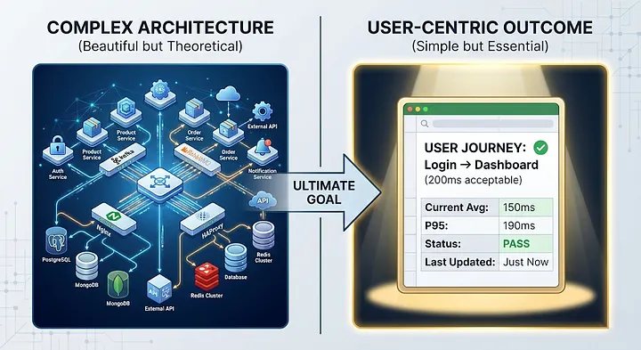
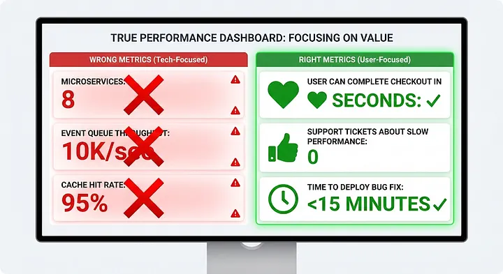
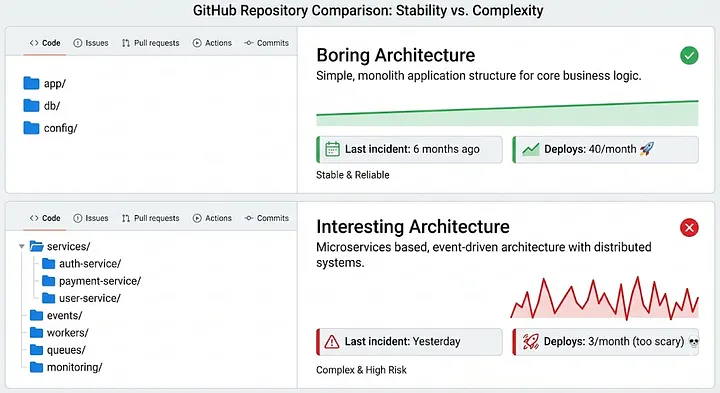

# Why I Ignore Architecture Diagrams in System Design Reviews

*By Bhavyansh Yadav · 9 min read · Feb 23, 2026*

I was in a system design review last month. The team had prepared a beautiful architecture diagram. Microservices, event buses, caching layers, read replicas. The whole enterprise playbook.

Everyone asked the usual questions: “Why Kafka over RabbitMQ?” “How do you handle eventual consistency?” “What’s your failover strategy?”

I asked: “How many users do you have right now?”

The room went quiet.

“About 300,” someone finally said.

“And what’s your growth projection?”

“We expect to hit 5,000 by end of year.”

I closed the architecture diagram. Because none of it mattered.

Here’s what I’ve learned: the first thing I ignore in any system design is the architecture itself. It’s usually the wrong thing to focus on.



*A side-by-side comparison: complex system architecture diagram vs. a simple user journey document with actual performance metrics — the simple document is what matters.*

## The Diagram That Meant Nothing
Let me show you what I mean.

Six months ago, a team showed me their proposed architecture for a new service:

```text
┌─────────────────────────────────────────────┐
│           Load Balancer (nginx)             │
└──────┬──────────────────────────────────┬───┘
       │                                   │
   ┌───▼────┐                         ┌───▼────┐
   │ API    │                         │ API    │
   │ Server │                         │ Server │
   │   1    │                         │   2    │
   └───┬────┘                         └───┬────┘
       │                                   │
       └──────────────┬────────────────────┘
                      │
              ┌───────▼────────┐
              │  Redis Cache   │
              └───────┬────────┘
                      │
    ┌─────────────────┼─────────────────┐
    │                 │                 │
┌───▼────┐       ┌───▼────┐       ┌───▼────┐
│ Read   │       │ Write  │       │ Read   │
│ Replica│       │ Master │       │ Replica│
│   1    │       │   DB   │       │   2    │
└────────┘       └────────┘       └────────┘
```
Beautiful diagram. Clearly a lot of thought went into it.

My first question wasn’t about the architecture. It was: “Show me the user flow that’s too slow right now.”

“Well, we don’t have performance issues yet — “

“Then why are we building this?”

The real answer: because it looked like what “production systems” are supposed to look like. They’d designed for scale they didn’t have, solving problems they didn’t face.

Here’s what I look at instead:

### Actual User Behavior (last 30 days)

| Metric | Value |
|---|---|
| Total users | 423 |
| Peak concurrent users | 47 |
| Average requests/second | 0.3 |
| Peak requests/second | 12 |
| 95th percentile response time | 145ms |
| Database queries per request | 3.2 |
| Current infrastructure | Single server, single database |
| Current cost | $89/month |
| Incidents | 0 |

### Proposed Architecture Cost

| Resource | Cost |
|---|---|
| 2× API servers | $100/month |
| Redis cache | $50/month |
| Read replicas (2×) | $180/month |
| Load balancer | $20/month |
| **Total** | **$350/month (+293%)** |
| Performance improvement | Negligible (already fast) |
| Complexity increase | Massive |
When I showed them this, the conversation shifted. They realized they were building for imaginary problems.

The pattern: Architecture diagrams show what you’re building. User flows show what you need.

## The Metric That Actually Matters


*A dashboard mockup: wrong metrics ("Microservices: 8", "Event Queue Throughput: 10K/sec") vs. right metrics ("User can complete checkout in <3 seconds", "Support tickets about slow performance: 0").*
Here’s what I look at first in any system design: What’s the slowest part of the user experience?

Not “what’s the slowest query.” Not “what’s the highest latency service.” What actual user action takes too long?

Most teams can’t answer this. They’ll tell you about database performance or API response times. They can’t tell you how long it takes a user to complete their core workflow.

I worked with a team that was redesigning their checkout system. They showed me an architecture with payment service, inventory service, shipping service, all communicating via message queues.

I asked: “How long does checkout take right now?”

They pulled up their metrics: “The payment API responds in 80ms.”

“That’s not what I asked. How long from when a user clicks ‘Place Order’ until they see ‘Order Confirmed’?”

Silence. They didn’t measure that.

We instrumented it. Turns out: 6.3 seconds. Not because their APIs were slow — because they made 14 sequential API calls, each waiting for the previous one to complete.

```javascript
// Their current flow (6.3 seconds total)
async function checkout(cart, user) {
    const inventory = await checkInventory(cart.items);     // 200ms
    const price = await calculatePrice(cart, user);          // 150ms
    const tax = await calculateTax(price, user.address);     // 300ms
    const shipping = await calculateShipping(cart, address); // 400ms
    const payment = await processPayment(total);             // 80ms
    const order = await createOrder(cart, user);             // 120ms
    const confirmation = await sendEmail(order);             // 500ms
    // ... 7 more sequential calls
    return order;
}
```

```javascript
// What they needed (1.2 seconds total)
async function checkout(cart, user) {
    // Parallel operations
    const [inventory, price, shipping] = await Promise.all([
        checkInventory(cart.items),
        calculatePrice(cart, user),
        calculateShipping(cart, user.address)
    ]);

    const tax = await calculateTax(price, user.address);
    const payment = await processPayment(price + tax + shipping);

    // These can happen async after user sees confirmation
    const order = await createOrder(cart, user, payment);
    sendEmail(order);  // Don't wait

    return order;
}
```
No architecture change needed. No new services. Just parallelizing what could be parallel and deferring what didn’t block the user.

They’d spent 3 weeks designing a new architecture when the real problem was sequential API calls.

The lesson: User experience metrics matter more than system metrics.

## The Question That Cuts Through Bullshit
Whenever someone shows me a system design, I ask one question:

“What happens when this part fails?”

Not in theory. In practice.

Point at any box in their architecture diagram — cache, message queue, service, database — and ask what happens when it’s down.

Most answers sound like this:

“The system continues to function with degraded performance.”
“Requests queue up and replay when it recovers.”
“We fail over to the backup.”
Great. Now show me the runbook for that.

“We don’t have one yet — “

Then your architecture isn’t real. It’s theoretical.

I learned this the hard way. We designed a system with circuit breakers, retry logic, graceful degradation. On paper, it was bulletproof.

In production, when our cache died at 2 AM, nobody knew what “graceful degradation” meant in practice. Does it serve stale data? Does it skip the cache? Does it error? We’d never documented it. We’d never tested it.

The on-call engineer guessed wrong. We served stale product prices for 3 hours before someone noticed.

Now when I review designs, I don’t care about the happy path. I want to see the failure modes documented:

### Failure Mode Documentation

**Redis Cache Down**
- Impact: Response time increases from 150ms to 400ms
- Action: Serve from database directly
- Alert: Page on-call if down >5 minutes
- Recovery: Automatic on cache restart
- Last tested: 2024-01-15

**Database Read Replica Down**
- Impact: Read traffic shifts to master
- Action: Route all reads to master temporarily
- Alert: Email DevOps (non-urgent)
- Recovery: Remove replica from rotation
- Last tested: 2024-01-20

**Payment Service Down**
- Impact: Checkouts fail
- Action: Queue orders, process when service recovers
- Alert: Page on-call immediately
- Recovery: Process queued orders on startup
- Last tested: Never (TODO)
If your architecture diagram doesn’t come with failure mode documentation, you don’t have an architecture. You have a wishlist.

## The Hidden Dependency No One Mentions
Here’s something almost every system design misses: operational complexity.

Teams design systems they can’t operate. They add services they can’t monitor. They create failure modes they can’t debug.

I saw a team propose 12 microservices. I asked: “How many people will be on-call?”

“Three engineers rotating weekly.”

“And each engineer understands all 12 services?”

Pause. “We’ll document them.”

Right. Because documentation solves everything.

Here’s the reality: operational complexity grows faster than team size. Every service is:

- Another deployment pipeline
- Another set of logs to search
- Another dashboard to check
- Another failure mode to understand
- Another 3 AM wake-up call
The math is brutal:

> **Operational Load = Services × (Deploy + Monitor + Debug + Incident)**

Example team:
- 1 service: 3 engineers can handle comfortably
- 3 services: 3 engineers start feeling stretched
- 6 services: 3 engineers are constantly firefighting
- 12 services: 3 engineers burn out or things break

You need roughly 1 engineer per 2–3 services to maintain sanity.
When I look at system designs now, I count services and divide by team size. If the ratio is above 3:1, I know they’re setting themselves up for operational hell.

The question I ask: “Can your current team operate this at 3 AM when someone’s on vacation and two people are sick?”

If the answer isn’t a confident yes, the architecture is too complex.

## The Trade-Off They Never Mention
Every architecture decision is a trade-off. But most system designs only present the benefits:

- Microservices enable independent deployment! *(Cost: distributed debugging is hell)*
- Event-driven architecture enables loose coupling! *(Cost: eventual consistency is hard to reason about)*
- Read replicas enable horizontal scaling! *(Cost: replication lag causes bugs)*
I ignore the benefits. Everyone talks about benefits. I look for what they’re not saying.

Here’s a framework I use:

### For Every Architectural Choice, Ask

1. **What problem does this solve that we have RIGHT NOW?**
   (Not "might have" or "could have" — have TODAY)
2. **What's the operational cost?**
   - How do we deploy it?
   - How do we monitor it?
   - How do we debug it when it breaks?
3. **What's the simplest alternative?**
   - Could we solve this with existing infrastructure?
   - Could we solve this with better code?
4. **How do we reverse this decision if we're wrong?**
   - Can we switch back easily?
   - What's the migration cost?
Most architecture decisions fail question 1. They’re solving future problems, not current ones.

## Boring Architecture Is Usually Right


*"Boring Architecture" (minimal folders, last incident 6 months ago, 40 deploys/month) vs. "Interesting Architecture" (complex nested folders, last incident yesterday, 3 deploys/month).*
Here’s what nobody wants to hear: boring architecture is almost always better than interesting architecture.

Monolith before microservices. Postgres before Cassandra. Synchronous before async. Direct calls before message queues.

The interesting stuff makes for good conference talks. The boring stuff makes for good sleep.

I’ve reviewed maybe 100 system designs in my career. The ones that worked long-term were boring. The ones that looked impressive usually became maintenance nightmares.

The pattern: Complex architecture is a bet that complexity will pay off. It usually doesn’t.

You’re betting that:

- You'll actually hit the scale you're designing for
- The team will grow to support the complexity
- You correctly predicted which parts need to scale
- The operational overhead is worth it
Most of these bets lose.

The teams that ship reliably aren’t using cutting-edge architecture. They’re using boring technology that’s been around for 10 years, deployed in the simplest way that solves their actual problem.

And frankly, I think that’s a sign of maturity. Junior engineers want to use everything new. Senior engineers want to use what works.

## What This Actually Means
When I review system designs now, I ignore the architecture diagram until I understand:

- What user problem are we solving? (Not technical problem — user problem)
- What's currently broken? (Not "might break at scale" — broken NOW)
- Can the team operate this? (Not "we'll hire" — current team, current knowledge)
- What's the simplest thing that works? (Not "best practice" — actual simplest)
If those questions have good answers, then we can talk about architecture.

Here’s what changed when I started ignoring the pretty diagrams:

We ship faster. We don’t spend weeks designing perfect architectures. We build the simplest thing, measure it, and improve what’s actually slow.

We sleep better. Simple systems break less. When they do break, they’re easy to debug.

We waste less money. We don’t over-provision infrastructure for scale we don’t have.

The uncomfortable truth: most system design reviews are architecture theater. We’re performing “proper engineering” instead of solving actual problems.

The best system design starts with understanding user needs, not drawing architecture diagrams — everything else is just engineering cosplay.

Three things to try this week:

- Next time someone shows you an architecture diagram, ask: "What user problem is slow right now?" before discussing any boxes.
- Look at your own system — can you explain what happens when each component fails? If not, document it.
- Count your services and divide by team size — if it's above 3:1, you're probably over-architected.
Final thought: The best architecture is the one nobody notices because it just works. The worst architecture is the one everyone admires until 3 AM when it breaks.

What architecture decision are you making based on what “should” be done instead of what needs to be done?

---

*Originally published by Bhavyansh Yadav on Medium.*