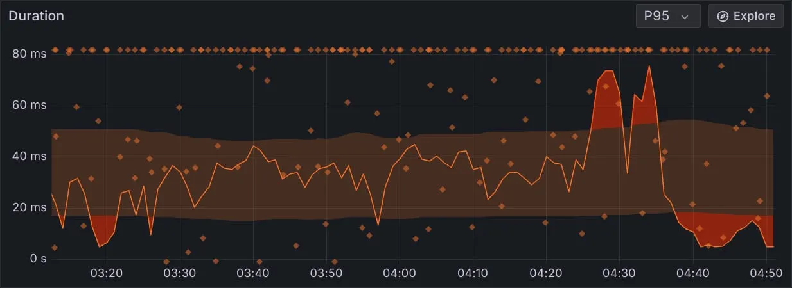
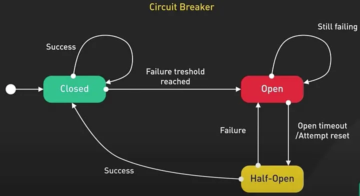
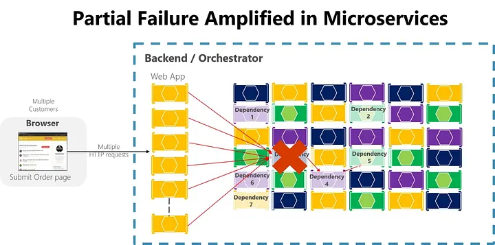
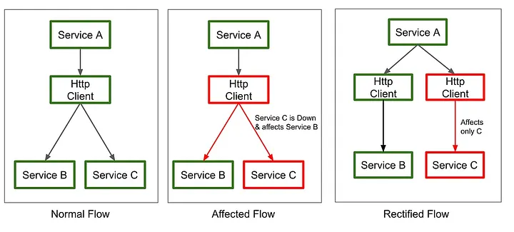

# Your Circuit Breaker Is Lying to You

> **Author**: The Atomic Architect · **Published**: Apr 23, 2026 · **7 min read**

---

The dashboard says **CLOSED**. Your users are still suffering.

I learned this the hard way.

One night, one of our downstream services started behaving like a tired employee pretending to work. It was not fully down. It was worse. It was replying just enough to keep our dashboards calm, while every real user journey felt sticky, slow, and strangely unreliable.

The scary part was not the outage. The scary part was how long we believed we were protected.

We had a circuit breaker. We had retries. We had timeouts. We had alerts. We had a green-looking board.

And still, the user experience was quietly falling apart.

That was the night I stopped treating circuit breakers like magic.

A circuit breaker is a very good tool. It watches remote calls, opens when failure or slow-call thresholds are breached, rejects calls while open, and later allows a small test window in half-open state to see whether the dependency has recovered. In libraries like Resilience4j, that behavior is built around sliding windows, thresholds, and the three familiar states of `CLOSED`, `OPEN`, and `HALF_OPEN`.

That all sounds comforting. But here is the lie: **a circuit breaker can protect a dependency path and still fail to protect your users.**

That sounds dramatic, but it is the difference between *system health* and *experience health*. A breaker can stay closed while latency gets ugly. It can look stable because your minimum call threshold has not been reached yet. It can reject calls correctly while your product still has no usable fallback. And it can sit next to retries that multiply load instead of calming it down.

---

## The First Lie: "No Errors Means No Problem"



Most teams start by watching failure rate. That is reasonable. It is also incomplete.

Resilience4j does not only care about failed calls. It also has a **slow-call rate threshold** for a reason. Calls can technically succeed and still poison the user experience. A checkout that returns after six seconds is not healthy just because it returned `200 OK`. A search page that completes after the user has already bounced is not a success worth celebrating. The library explicitly supports opening the breaker on slow-call percentage, not just exception percentage, because slowness is often the beginning of real failure, not a separate story.

This is why some production dashboards tell a soothing lie:

- They show a service that is "up."
- Users experience a feature that is "bad."
- And users do not care which graph won the argument.

---

## The Second Lie: Hidden Inside Your Window



Circuit breakers do not judge your service in some cosmic, wise, always-correct way. They judge it through a sliding window. That means your breaker is only as honest as the window you give it.

Resilience4j supports count-based and time-based windows, and both are useful. But both can mislead you when configured carelessly:

- A **tiny** count-based window can overreact to noise.
- A **large** one can smooth over a real incident.
- A time-based window can better reflect bursts over recent seconds, but it still depends on the thresholds and traffic shape you actually have.

Then comes the subtle trap almost nobody talks about enough: **`minimumNumberOfCalls`**.

Until that minimum is reached, the breaker cannot calculate failure rate or slow-call rate. The docs are explicit about this. If the minimum is 10 and only 9 terrible calls happened, the breaker still does not trip. In low-throughput flows, that can make your protection feel present on paper but absent in the one customer path that actually matters.

I have seen teams proudly say, *"The breaker never opened."*

Yes. Because your traffic politely failed below the math.

---

## The Third Lie: "A Circuit Breaker Controls Load"

It does not. A circuit breaker **decides whether a call should be attempted**. It does **not limit how many calls can run at once** while the breaker is closed.

That distinction matters more than people admit. Resilience4j's docs are blunt here: if many threads ask for permission while the breaker is closed, they can all proceed. The sliding window does not mean only that many requests run concurrently. If you want to cap concurrency, you need a **bulkhead**. The breaker and the bulkhead solve different problems, and pretending one does both is how a dependency turns into a traffic amplifier under pressure.

This was one of the biggest mindset shifts for me. I used to think of the breaker as a wall. It is not a wall. It is a **gatekeeper with delayed judgment**. If the crowd is already inside, that judgment arrives late.

---

## The Fourth Lie: "Retries Make It Safer"



Retries are useful. Retries are also dangerous in the hands of optimistic engineers.

Resilience4j's Retry defaults to multiple attempts, and the docs make it clear that `maxAttempts` includes the initial call. So one logical user request can become multiple downstream calls very quickly. That is fine for brief, rare, recoverable blips. It is terrible when the dependency is already slow or overloaded.

The composition matters too. In Spring annotation style, **aspect order is a real thing**, not an implementation detail you can ignore. Resilience4j documents the order and notes that if you need a different behavior between Retry and CircuitBreaker, you should explicitly configure aspect order or switch to functional chaining. In other words, you should never assume the breaker and retry are cooperating in the order you imagined during a whiteboard session.

This is where the "lying" feeling becomes real:

- Your dashboard says resilience.
- Your dependency sees multiplication.
- Your users see hesitation.
- Your team sees a green badge and assumes maturity.

---

## What an Honest Design Looks Like

An honest circuit breaker design does four things:

1. **It fails fast.**
2. **It measures slowness.**
3. **It limits concurrency.**
4. **It gives the user somewhere decent to land.**

That last part is where many articles get lazy. Opening the breaker is not the happy ending — it is only the start of controlled degradation.

If your breaker opens and your customer just gets a raw `500`, congratulations: you protected your downstream service. You did **not** protect the product. The whole point is to preserve a useful experience, even if the experience is smaller, older, or less personalized than normal.

### The Mental Model

This is the mental model I wish I had earlier:

```
┌──────────────────────┐
│   User Request       │
└─────────┬────────────┘
          │
          v
┌──────────────────────┐
│  API / Service Layer │─────────────────────────────┐
└─────────┬────────────┘                             │
          │                                          │
          v                                          │
┌──────────────────────┐                             │
│  TimeLimiter          │                             │
│  CircuitBreaker       │                             │
│  Bulkhead             │                             │
└─────────┬────────────┘                             │
          │                                          │
  success ├──────► Downstream Service                │
          │                                          │
          │ failure / slow / open                    │
          v                                          │
┌──────────────────────┐                             │
│  Fallback Path        │                             │
│  cache / stale data / │                             │
│  partial response     │                             │
└─────────┬────────────┘                             │
          │                                          │
          └──────────► Useful User Response ◄─────────┘
```



That picture is not fancy. But it is honest. The breaker is not the destination — the breaker is the traffic signal before the fallback.

---

## The Code I Trust More Now

I like resilience code that makes the degraded path **visible**. Not hidden. Not implied. Not left for "later."

Here is a simple Spring-style example that I would trust more than a breaker with no fallback story:

```java
package com.example.catalog;

import io.github.resilience4j.bulkhead.annotation.Bulkhead;
import io.github.resilience4j.circuitbreaker.annotation.CircuitBreaker;
import io.github.resilience4j.timelimiter.annotation.TimeLimiter;
import lombok.RequiredArgsConstructor;
import lombok.extern.slf4j.Slf4j;
import org.springframework.cache.Cache;
import org.springframework.cache.CacheManager;
import org.springframework.stereotype.Service;
import org.springframework.web.client.RestClient;

import java.util.concurrent.CompletableFuture;
import java.util.concurrent.Executor;

@Slf4j
@Service
@RequiredArgsConstructor
public class CatalogClient {

    private final RestClient catalogRestClient;
    private final CacheManager cacheManager;
    private final Executor applicationTaskExecutor;

    @TimeLimiter(name = "catalog")
    @Bulkhead(name = "catalog", type = Bulkhead.Type.SEMAPHORE)
    @CircuitBreaker(name = "catalog", fallbackMethod = "readFromCache")
    public CompletableFuture<CatalogResponse> fetchProduct(String sku) {
        return CompletableFuture.supplyAsync(() ->
                catalogRestClient.get()
                        .uri("/internal/catalog/{sku}", sku)
                        .retrieve()
                        .body(CatalogResponse.class),
                applicationTaskExecutor
        ).thenApply(response -> {
            cacheManager.getCache("catalog").put(sku, response);
            return response;
        });
    }

    private CompletableFuture<CatalogResponse> readFromCache(
            String sku, Throwable t) {
        log.warn("catalog degraded for sku={}, reason={}", sku, t.toString());

        Cache.ValueWrapper cached =
                cacheManager.getCache("catalog").get(sku);
        CatalogResponse response = cached != null
                ? (CatalogResponse) cached.get()
                : CatalogResponse.unavailable(sku);

        return CompletableFuture.completedFuture(response);
    }
}
```

This is not interesting because it is clever. It is interesting because it is **honest**:

- The **timeout** is explicit.
- The **concurrency guard** is explicit.
- The **degraded response** is explicit.
- The dependency is no longer allowed to silently define the entire user experience.

Resilience4j's Spring Boot starter supports annotations and AOP for synchronous methods, `CompletableFuture`, and Reactor types, and Spring Cloud's integration can also publish circuit-breaker metrics when Actuator and `resilience4j-micrometer` are present. That means there is no good excuse to run this pattern blind in production.

---

## The Metrics I Care About Now

I care less about whether the breaker opened today. I care more about whether the user had a decent day. So when I look at resilience now, I ask simpler questions:

- Did latency get bad before failures spiked?
- Did retries quietly multiply pressure?
- Did the fallback actually return something helpful?
- Did we cap concurrency, or did we just measure collapse more elegantly?
- Did the dashboard report breaker state, but hide the thing the customer actually felt?

That is the real maturity test. Not *"Do you have a circuit breaker?"* Almost everyone has one now.

The real question is whether your breaker is telling the truth about the experience your system is creating.

Because a `CLOSED` breaker can still hide pain. An `OPEN` breaker can still serve a useful response. And a team that worships the breaker state without checking the fallback path is one incident away from learning the same lesson I did — but at 2 a.m., with customers already angry.

---

## Summary

So yes, put in the circuit breaker. But do not stop there:

1. Teach it to notice **slowness**.
2. Pair it with a **bulkhead**.
3. Be **careful** with retries.
4. Tune the **window** like it matters.
5. And most of all, **design the degraded experience on purpose**.

Otherwise your circuit breaker will keep telling you the system is fine — while your users quietly tell the truth.
