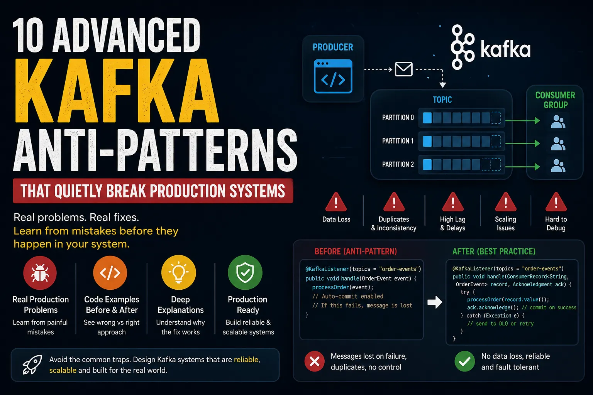

# 10 Kafka Mistakes That Are Probably Breaking Your System Right Now

*By Gaddam.Naveen · 9 min read · May 5, 2026*

> **Source**: Originally published on [Medium](https://medium.com/@gaddam.naveen/10-kafka-mistakes-that-are-probably-breaking-your-system-right-now)

---



Kafka is working. Your events are flowing. Your consumers are running. Your logs look clean.

So everything is fine… right?

**Not really.**

Because the most dangerous Kafka problems don't crash your system. They:

- **Duplicate** your data
- **Drop** critical events
- **Break ordering** silently
- Create bugs you **can't trace**

And by the time you notice… it's already too late.

This article will show you **advanced Kafka anti-patterns** that quietly break real systems — and how to fix them properly.

---

## 1. Using Kafka Like a Queue Instead of a Log

### ❌ BEFORE: What Developers Usually Do

You think of Kafka as a high-performance task queue. A service publishes a message, a consumer picks it up, does some work, and then you're done. You commit the offset automatically after successful processing. Sounds fine, right?

```java
// Producer
kafkaTemplate.send("order-events", orderPayload);

// Consumer
@KafkaListener(topics = "order-events")
public void handle(OrderEvent event) {
    processOrder(event); // if it fails, the message is gone forever
}
```

```yaml
# Configuration
spring.kafka.consumer.enable-auto-commit: true
spring.kafka.consumer.auto-offset-reset: earliest
```

### 🔴 WHAT GOES WRONG

One day, your `processOrder` throws a `SQLTransientException` or a temporary network blip. Auto-commit already removed the offset. Kafka thinks the message was consumed successfully, but your database never saw it. **The message is gone.** No replay, no recovery. You just dropped a customer order.

Even worse: if you try to manually commit only after processing, but keep auto-commit enabled, you've created a **race condition**. In a rebalance, the offset can be committed before the work completes.

> **Core issue**: You're treating Kafka like a queue that deletes messages after consumption. But Kafka is a **distributed log** — it preserves messages until retention policies kick in. If you don't use that property for fault tolerance, you're throwing away Kafka's biggest superpower.

### ✅ AFTER: Correct Approach

Switch to manual offset management. Process the message fully, and **only then commit the offset**. If processing fails, do not commit — let the message be redelivered.

```java
@KafkaListener(topics = "order-events")
public void handle(ConsumerRecord<String, OrderEvent> record,
                   Acknowledgment ack) {
    try {
        processOrder(record.value());
        ack.acknowledge(); // commit offset only after success
    } catch (NonRetryableException e) {
        // send to DLQ, then ack so we don't loop forever
        deadLetterProducer.send("order-dlq", record.value());
        ack.acknowledge();
    } catch (RetryableException e) {
        // do NOT ack, let the consumer retry or pause
        throw e; // or use a retry template with backoff
    }
}
```

```yaml
# Properties
spring.kafka.consumer.enable-auto-commit: false
spring.kafka.listener.ack-mode: manual
```

| Error Type | Strategy |
|------------|----------|
| **Transient (Retryable)** | Do NOT ack → let consumer retry with backoff |
| **Permanent (NonRetryable)** | Send to DLQ → then ack to move past it |

### 💡 WHY THIS FIX WORKS

Manual commit puts **you** in control. Until you call `ack.acknowledge()`, the offset is not moved. If your process crashes, the consumer group will read the same message again after rebalance. You're now using Kafka as a **durable log**, not a fleeting queue. Kafka retains the message for hours or days; you can replay the entire topic if you ever need to rebuild state.

This is the foundation for exactly-once semantics — not by magic, but by **idempotent processing** and careful offset control.

---

## 2. No Partition Key Strategy

### ❌ BEFORE: What Developers Usually Do

You just want to send a message, so you use `KafkaTemplate.send(topic, value)`. No key, no partitioner. Kafka's default sticky partitioner batches messages to the same partition for a while, then switches.

```java
kafkaTemplate.send("user-activity", activityEvent);
```

### 🔴 WHAT GOES WRONG

A sudden viral campaign drives 10x traffic. Because you're not specifying a key:

| Problem | Effect |
|---------|--------|
| **Ordering broken** | `UserLoggedIn` arrives before `UserCreated` — landed on different partitions |
| **Hot partition** | Partition 5 burns while partition 0 is idle |
| **No autoscaling** | Only one consumer can read a partition at a time — high lag, can't parallelize |

No key means **no ordering guarantee, no determinism, and unpredictable load distribution**.

### ✅ AFTER: Correct Approach

Identify the business identifier that requires ordering and partition affinity — typically a `userId`, `orderId`, or `sessionId`. Use it as the key.

```java
String key = activityEvent.getUserId();
kafkaTemplate.send("user-activity", key, activityEvent);
```

If you need a custom routing strategy (e.g., multi-tenancy isolation), write a custom `Partitioner`:

```java
public class TenantPartitioner implements Partitioner {
    @Override
    public int partition(String topic, Object key, byte[] keyBytes,
                         Object value, byte[] valueBytes, Cluster cluster) {
        String tenantId = extractTenant(key); // from key or headers
        int tenantHash = tenantId.hashCode();
        return Math.abs(tenantHash) % cluster.partitionCountForTopic(topic);
    }
}
```

```java
// Set in producer factory
props.put(ProducerConfig.PARTITIONER_CLASS_CONFIG,
    TenantPartitioner.class.getName());
```

### 💡 WHY THIS FIX WORKS

Kafka guarantees **ordering within a partition**. If all messages for user ID 42 always go to partition 2, they are written in order and consumed in order by the consumer assigned to that partition. You get strong consistency for a user's timeline without any extra coordination.

| With Key | Without Key |
|----------|-------------|
| Predictable load distribution (well-distributed UUID keys) | Random scattering → hot partitions |
| Per-entity ordering guaranteed | No ordering — data races |
| Scalable: consumers up to partition count | Autoscaling doesn't help |

---

## 3. Single Topic for Multiple Domains

### ❌ BEFORE: What Developers Usually Do

You have a monolithic mindset: just dump everything into one *"events"* topic. Orders, payments, user signups, emails — they all go to `main-events`. Consumers use a type field to filter.

```java
// Producer
kafkaTemplate.send("main-events", new Event("ORDER_CREATED", payload));

// Consumer
@KafkaListener(topics = "main-events")
public void handle(GenericEvent event) {
    if ("ORDER_CREATED".equals(event.getType())) { /* ... */ }
    else if ("USER_SIGNUP".equals(event.getType())) { /* ... */ }
    // a new domain arrives → someone forgets to add the if-branch
}
```

### 🔴 WHAT GOES WRONG

| Problem | Consequence |
|---------|-------------|
| **Traffic spike in one domain** | Throttles the entire pipeline — order processing competes with signup consumers |
| **Retention mismatch** | Orders need 7 days retention for auditing; signups need 1 day — can't set per-type on same topic |
| **Schema evolution** | Adding a field to `UserSignup` changes contract for `main-events` — all consumers must update |
| **Poison pill** | One bad message from a non-critical domain brings down the entire consumer group |

### ✅ AFTER: Separate Topics per Bounded Context

Create a dedicated topic per domain aggregate, following domain-driven design boundaries:

```java
// Separate topics per domain
kafkaTemplate.send("order.events", orderEvent);
kafkaTemplate.send("user.events", userEvent);
kafkaTemplate.send("payment.events", paymentEvent);
```

Consumer groups become independent:

```java
@KafkaListener(topics = "order.events", groupId = "order-service")
public void onOrder(OrderEvent event) { /* ... */ }

@KafkaListener(topics = "user.events", groupId = "user-service")
public void onUser(UserEvent event) { /* ... */ }
```

### 💡 WHY THIS FIX WORKS

| Benefit | Explanation |
|---------|-------------|
| **Independent scaling** | Each topic has its own partition count, replication factor, and retention |
| **Blast radius isolation** | Spikes in user signups never steal bandwidth from payment flows |
| **Schema independence** | Evolve `order.events` schema without touching `user.events` |
| **Access control** | Only `user-service` consumes `user.events` |
| **Data discovery** | Data catalog entries are meaningful, not a monolithic blob |

> This is the **"log per aggregate"** pattern.

---

## 4. No Schema Management

### ❌ BEFORE: What Developers Usually Do

You serialize objects to JSON using Jackson. No schema registry, no versioning. Producer and consumer share a Java DTO in a common library.

```java
// Producer
kafkaTemplate.send("inventory", new InventoryUpdate(itemId, 10));

// Consumer
InventoryUpdate update = objectMapper.readValue(
    record.value(), InventoryUpdate.class);
```

You publish a v2 of the DTO by adding a field. The shared library is updated in both services simultaneously — you think. But **deployment isn't atomic**.

### 🔴 WHAT GOES WRONG

Producer deploys first → sends `InventoryUpdate` with new `warehouseCode` field → old consumer tries to deserialize:

| Scenario | Outcome |
|----------|---------|
| `FAIL_ON_UNKNOWN_PROPERTIES = false` (lucky) | Jackson ignores unknown field — but `warehouseCode` is lost → inventory routes to wrong warehouse |
| Field renamed or type changed | `SerializationException` → entire partition blocks → consumer group hangs → lag builds |

### ✅ AFTER: Schema Registry with Avro (or Protobuf)

Adopt Confluent Schema Registry and serialize with Avro. Define schemas explicitly:

```json
{
  "type": "record",
  "name": "InventoryUpdate",
  "namespace": "com.example.inventory",
  "fields": [
    {"name": "itemId", "type": "string"},
    {"name": "quantity", "type": "int"},
    {"name": "warehouseCode", "type": ["null", "string"], "default": null}
  ]
}
```

```java
// Producer configuration
props.put(ProducerConfig.VALUE_SERIALIZER_CLASS_CONFIG,
    KafkaAvroSerializer.class);
props.put("schema.registry.url", "http://schema-registry:8081");

// Send with a generated SpecificRecord
InventoryUpdate update = InventoryUpdate.newBuilder()
    .setItemId("123")
    .setQuantity(10)
    .setWarehouseCode("WH-1")
    .build();
kafkaTemplate.send("inventory", update);
```

Consumer uses `KafkaAvroDeserializer` and handles schema evolution according to compatibility rules.

### 💡 WHY THIS FIX WORKS

| Compatibility Mode | Guarantee |
|--------------------|-----------|
| **BACKWARD** | Consumers using old schema can read messages written with new schema (new fields have defaults) |
| **FORWARD** | Consumers using new schema can read messages written with old schema |
| **FULL** | Both directions compatible |

The schema registry acts as the **source of truth**. Before a new schema version is deployed, the registry checks compatibility. The producer cannot break existing consumers. You get **contract-first development** — data inconsistency is caught at build/deployment time, not at 3 AM.

| JSON (No Schema) | Avro + Schema Registry |
|-------------------|------------------------|
| Verbose text | Compact binary (smaller payload) |
| "Who changed what?" debugging sessions | Contract-first: caught at deploy time |
| Manual coordination between teams | Automated compatibility checks |

---

## 5. Wrong Consumer Group Usage

### ❌ BEFORE: What Developers Usually Do

You copy-paste a `@KafkaListener` and forget to set a `groupId`, or give every service the same group ID thinking *"they all need to process the same messages."* Or worse, let Spring Boot auto-generate a random group on each restart.

```java
// No groupId specified — Spring auto-generates anonymous.5a3f2c9d on each restart
@KafkaListener(topics = "notifications")
public void handle(Notification note) { /* ... */ }
```

```yaml
# Multiple independent services share this!
spring.kafka.consumer.group-id: my-consumer-group
```

### 🔴 WHAT GOES WRONG

Kafka consumer groups are a **load-balancing mechanism**: each partition is assigned to exactly **one** consumer within a group.

| Mistake | Effect |
|---------|--------|
| **Same group for different services** | Email & SMS share `notif-group` → compete for partitions → only one gets the message |
| **No group specified** | Random group per restart → can't resume from last offset → duplicates or missed messages |
| **Auto-generated group** | Brand-new group on every deploy → `auto-offset-reset` determines behavior |

### ✅ AFTER: Explicit, Stable Consumer Groups per Logical Subscriber

Each independent logical subscriber should have its own, stable `groupId`. If multiple instances of the same service need to scale, they belong to the **same group** and share the load.

```java
// Email service — independent consumer group
@KafkaListener(topics = "notifications", groupId = "email-notif-service")
public void handle(Notification note) { sendEmail(note); }

// SMS service — separate consumer group
@KafkaListener(topics = "notifications", groupId = "sms-notif-service")
public void handle(Notification note) { sendSms(note); }
```

```yaml
# Per-service configuration
spring.kafka.consumer.group-id: email-notif-service
```

### 💡 WHY THIS FIX WORKS

| Group Design Principle | What You Get |
|------------------------|--------------|
| **One group per logical subscriber** | Broadcasting: each group gets a copy of every message |
| **Same group for same service (scaled)** | Load balancing: partitions distributed across instances |
| **Stable group ID** | Offset continuity: restart picks up where you left off |

```
notifications topic ─┬── email-notif-service (3 instances → load balanced)
                     └── sms-notif-service   (2 instances → load balanced)
```

Both services get every notification. Within each service, instances share the load. This is the **publish/subscribe** pattern Kafka was designed for.

---

## Summary

| # | Anti-Pattern | Root Cause | Fix |
|---|-------------|------------|-----|
| 1 | **Kafka as a queue** | Auto-commit + no error handling | Manual commit + DLQ + retry strategy |
| 2 | **No partition key** | Sending without a key | Consistent key (`userId`, `orderId`) + custom partitioner if needed |
| 3 | **Single topic for everything** | Monolithic topic design | Topic per bounded context (log-per-aggregate) |
| 4 | **No schema management** | Raw JSON with shared DTOs | Schema Registry + Avro/Protobuf with compatibility rules |
| 5 | **Wrong consumer groups** | Shared or auto-generated group IDs | One stable group per logical subscriber |

> **The Rule**: Kafka's most dangerous failures are the silent ones. No crash, no alert, no stack trace — just duplicated data, dropped events, broken ordering. Every fix above moves you from *"it seems to work"* to *"it's provably correct."*

---

*Originally published by Gaddam.Naveen on [Medium](https://medium.com/@gaddam.naveen).*

> **Source URL**: [10 Kafka Mistakes That Are Probably Breaking Your System Right Now](https://medium.com/@gaddam.naveen/10-kafka-mistakes-that-are-probably-breaking-your-system-right-now)
>
> **Taxonomy Reference**: §3.3 Event-Driven & Messaging Architecture  
> **Related**: [Kafka Concepts Every Architect Must Master](../kafka-concepts-that-every-architect-should-master.md) | [5 Kafka Design Patterns](../5-kafka-design-patterns-every-backend-engineer-should-know.md) | [System Design: Message Brokers](../../system-design-architecture/05-message-brokers-async.md)
