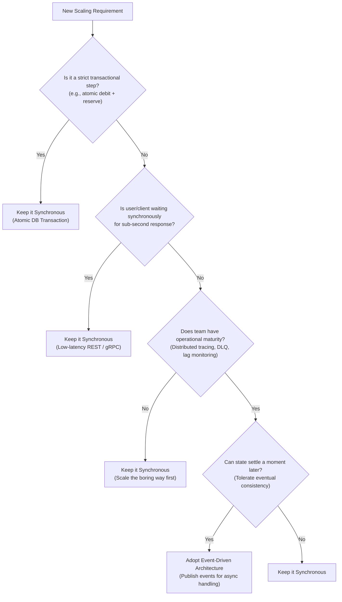

# When Should You Avoid Event-Driven Architecture Even If You Need to Scale?

> **Series**: Part of the [10 Event-Driven Architecture Questions](10-event-driven-architecture-questions.md) series (Deep Dive on Question 3: *When should you not use event-driven architecture even if scalability is required?*)  
> **Author**: Arvind Kumar  
> **Source**: [Codefarm Medium](https://codefarm0.medium.com/when-should-you-avoid-event-driven-architecture-even-if-you-need-to-scale-3743642c188e)

Scalability is the usual excuse for reaching for event-driven architecture (EDA), and it’s also the most common reason teams reach for it when they shouldn’t. This one isn’t about a mechanism like versioning or deduplication — it’s a judgment call, and it plays out less like an interrogation and more like a design review where someone has to talk a good idea out of the wrong context.

---

## The Setup

*Kavya has a ticket open: “Migrate checkout to event-driven for scale.” Arvind is reviewing it before it goes to sprint planning.*

**Arvind:** Walk me through why checkout specifically needs to be event-driven.

**Kavya:** We’re hitting load limits at peak. Everything I’ve read says decouple the services with events and you scale horizontally without the bottleneck.

**Arvind:** That’s true for a lot of things. Is it true for the part of checkout where you debit a payment method and reserve inventory in the same breath?

**Kavya:** …that part still needs to happen together, immediately.

**Arvind:** Right. So before this goes further — scale is real, but “we need to scale” doesn’t automatically mean “make it event-driven.” Let’s find the line.

---

## Where It Actively Hurts

**Arvind:** First case: a strict transactional step — debit and reserve, both or neither, right now. What happens if you make that event-driven?

**Kavya:** I’d publish a “payment requested” event, a payment service consumes it, and eventually publishes “payment captured.” But now checkout doesn’t know if it succeeded until that comes back, and I’ve turned an atomic operation into a distributed one with a window where nothing’s decided.

**Arvind:** And the user’s staring at a spinner during that window. Second case — anything on a synchronous path where a human or another service is waiting on the response.

**Kavya:** Same problem. Async messaging adds queueing delay, consumer lag, retries — all invisible to the user until it isn’t. If the response has to come back in under a second, routing it through a broker is working against the goal, not toward it.

**Arvind:** Third case, and this one’s not about the architecture at all — team size and operational maturity.

**Kavya:** If we don’t already have tracing across services, dead-letter handling, and someone comfortable debugging a stuck consumer group at 2am, we’re not buying scale — we’re buying an incident we don’t know how to run yet.

---

## Deciding, Not Guessing

**Arvind:** Notice how much of that diagram routes back to “keep it synchronous.” That’s deliberate — most teams’ checklists lean the other way.

---

## Scaling Without Going Event-Driven

**Kavya:** So if checkout stays synchronous, how do we actually fix the load problem?

**Arvind:** The same ways people scaled synchronous systems before EDA was the default answer:
1. **Horizontal scaling behind a load balancer**: Scale the stateless web/API application layer horizontally.
2. **Caching reads that don’t need to be perfectly fresh**: Offload read pressure from primary databases using Redis or distributed caches.
3. **Read replicas**: Route reporting, catalog lookups, and read queries away from the primary OLTP transaction path.
4. **Connection pooling**: Manage database connections efficiently so you aren't opening a new connection per incoming request under peak load.

**Kavya:** None of that touches the architecture at all.

**Arvind:** That’s the point. If the bottleneck is “too many synchronous requests,” the fix is usually “handle more synchronous requests,” not “stop being synchronous.”

---

## The Answer Usually Isn’t All-or-Nothing

**Arvind:** Now — does checkout have anything that *should* be async?

**Kavya:** The confirmation email, the loyalty points update, the analytics event. None of those need to happen before we respond to the user.

**Arvind:** So the real design is a **synchronous core with events fired off the back of it**, not a synchronous system converted wholesale into an event-driven one.

**Kavya:** Debit and reserve stay in the request path. Everything that isn’t in the user’s critical path publishes an event once the transaction commits.

**Arvind:** That’s the version of this ticket I’d approve.

---

## One More Thing Before You Adopt Kafka

**Arvind:** If you do go event-driven for the parts that fit — what are you actually signing up for operationally?

**Kavya:** A cluster to run, schema evolution to manage, consumer lag to monitor, dead-letter queues to triage, and a debugging story that now spans multiple services instead of one call stack.

**Arvind:** All justified, when the fit is right. Not free, even then.

---

## The Answer, Compressed

**Kavya:** Don’t reach for event-driven architecture just because something needs to scale — scale it synchronously first. Reserve EDA for steps that can tolerate settling a moment later, where decoupling is worth more than an immediate answer, and where the team can actually operate the broker, tracing, and failure handling that come with it. Everything else — especially anything transactional or on a live request path — stays synchronous and scales the boring way.

---

## Conclusion

The skill being tested here isn’t knowledge of event-driven architecture — it’s the discipline to not use it everywhere. Strict transactions, low-latency paths, and teams without the operational maturity to run distributed failure handling are all reasons to scale synchronously instead. Most real systems end up as a synchronous core with events handling everything that can afford to happen a moment later — not a wholesale migration either way.

---

## Related Resources

- [10 Event-Driven Architecture Questions That Separate Architects from Framework Users](10-event-driven-architecture-questions.md)
- [Notifications at Scale: What Breaks When You Go From 100 Users to 1,000,000](notifications-at-scale-what-breaks-100-to-1m-users.md)
- [Senior Engineers Don't Start With Kafka (They Start With This)](../software-architecture/senior-engineers-dont-start-with-kafka.md)
- [When Microservices Become Distributed Monoliths: Warning Signs and Recovery](../software-architecture/When%20Microservices%20Become%20Distributed%20Monoliths%20Warning%20Signs%20and%20Recovery.md)
- [List: 10 Event Driven Architecture Scenarios (Codefarm)](https://codefarm0.medium.com/list/10-event-driven-architecture-scenarios-c0b0f8d0ffad)