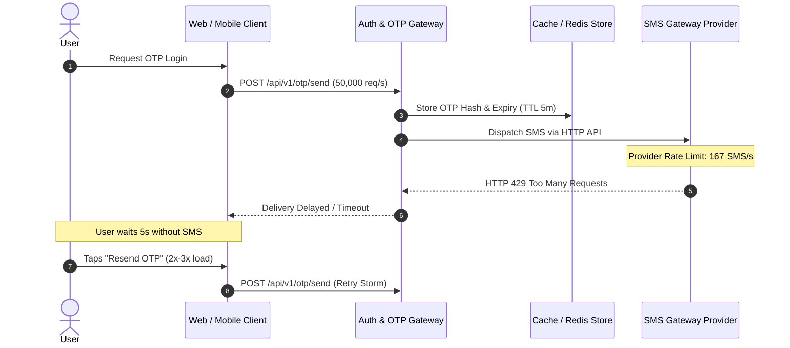
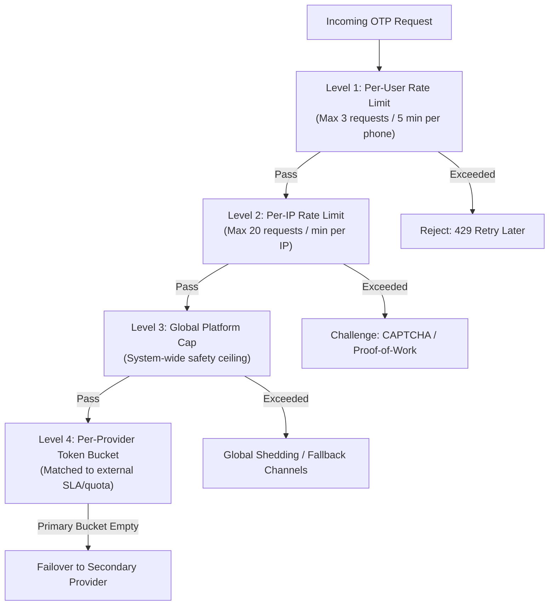
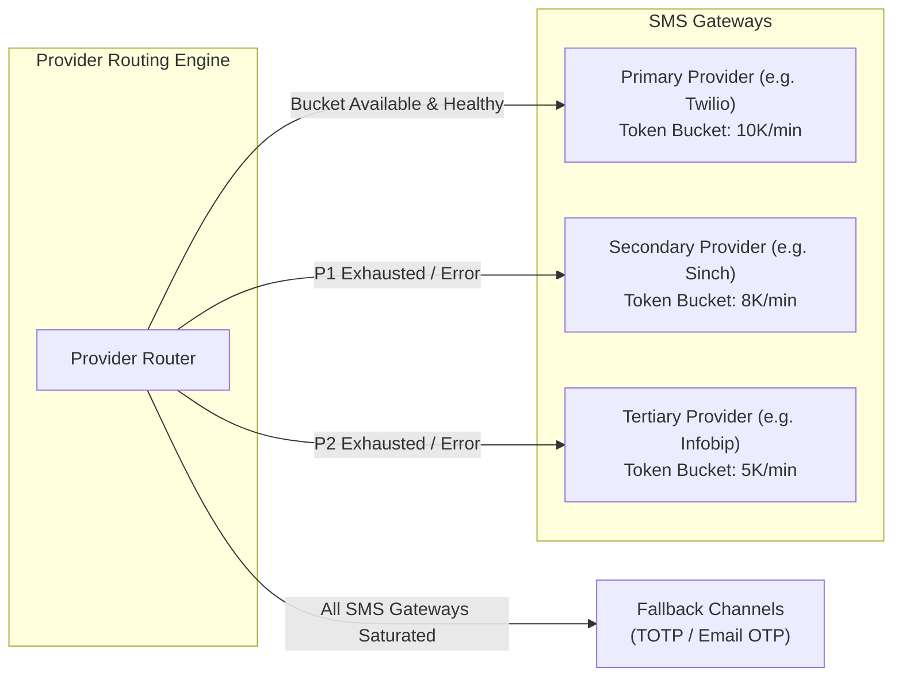

# OTP Service Fails During Peak Traffic: System Design Deep Dive on Rate Limiting, Retry Storms, Provider Failover, and Queue Buffering

> **Author**: Arvind Kumar (Codefarm)  
> **Source**: [Medium](https://codefarm0.medium.com/otp-service-fails-during-peak-traffic-system-design-deep-dive-on-rate-limiting-retry-storms-7c2677aded90)  
> **Published**: August 1, 2026  
> **Related Key Takeaways**: [OTP Service Resilience & Traffic Spikes](../../system-design-architecture/resilience/otp-service-peak-traffic-takeaways.md)

---

## Executive Summary

*A major event happens. Millions of users try to log in simultaneously. Each user requests an OTP. Many tap “Resend” when it does not arrive in 5 seconds. The OTP service receives 100x normal traffic. SMS providers rate-limit the account. Users cannot log in. The platform loses revenue.*

This is the OTP service failure problem. OTP delivery is surprisingly fragile because it sits at the intersection of user behavior (impatient tapping), provider limitations (SMS gateways have strict throughput caps and rate limits), and security requirements (rate limiting to prevent brute-force attacks).

Interviewers favor this scenario because it combines infrastructure resilience with real-world external constraints and tests:

### Concepts at a Glance

- **OTP delivery flow** and why it cascades into failure under peak load
- **Multi-level rate limiting** (per-user, per-IP, per-provider token bucket, and global cap)
- **Retry storms** — how aggressive client retry behavior amplifies traffic by $3\times\text{--}5\times$
- **Provider failover** — dynamic switching across SMS providers mid-spike with token bucket tracking
- **Queue buffering with TTL** — absorbing bursts and shedding expired payloads before dispatch
- **TOTP as an alternative** — eliminating third-party telecom provider dependencies entirely
- **Graceful degradation** — multi-channel fallbacks (TOTP, Email) when SMS gateways saturate

---

## The Scenario

**Arvind (Interviewer):**  
A social media platform experiences a surge in login attempts after a major event. Millions of users request OTPs simultaneously. Many users tap “Resend” when the OTP does not arrive within a few seconds.

The OTP service was handling 1,000 requests per second. It now receives 50,000 per second. The primary SMS provider rate-limits the account at 10,000 SMS per minute (approx. 167 SMS/sec). The secondary provider is not configured. Users cannot log in.

How would you redesign the OTP service to survive such spikes?

**Hari (Candidate):**  
Let me start by mapping the OTP flow and identifying where each failure point occurs.

The failure cascade unfolds as follows:

1. Peak event triggers millions of login attempts.
2. OTP requests flood the service at 50,000/sec.
3. The SMS provider rate-limits at 10,000 SMS/min (167/sec).
4. Users do not receive OTPs within 5 seconds.
5. Users tap “Resend” — doubling or tripling the request rate.
6. The SMS provider sees even more traffic and tightens rate limits.
7. Legitimate users cannot log in at all.

---

## Rate Limiting at Multiple Levels

**Arvind:**  
Where do you apply rate limiting?

**Hari:**  
Rate limiting must be applied across four distinct tiers, each protecting a different resource.

### Level 1 — Per-User Rate Limit
Max 3 OTP requests per 5 minutes per phone number. This prevents individual users from flooding the system by tapping “Resend” aggressively. The limit is keyed by user phone number or account identity rather than session ID, preventing attackers from bypassing it via incognito tabs or page refreshes.

### Level 2 — Per-IP Rate Limit
Max 20 OTP requests per minute per IP address. This prevents large-scale automated attacks or credential-stuffing bots from a single IP. When exceeded, present a CAPTCHA challenge before allowing further OTP requests.

### Level 3 — Global Platform Rate Limit
Platform-wide cap on OTP generation rate. This acts as the safety ceiling protecting downstream providers and internal caches from being completely overwhelmed. When exceeded, the system degrades gracefully into fallback mechanisms.

### Level 4 — Per-Provider Token Bucket Rate Limit
Dedicated token bucket tracking each SMS provider's contract quota. When the primary provider’s token bucket is empty, traffic fails over immediately to the secondary provider. When all buckets are empty, requests enter a bounded priority queue or route to alternative channels.

---

## Retry Storm Prevention

**Arvind:**  
The “Resend” button is the biggest amplifier. How do you handle it?

**Hari:**  
The resend button must not generate a new OTP or spam external SMS providers. It should reuse the existing valid OTP.

### Optimization: OTP Reuse on Resend
Instead of generating a new OTP on every “Resend” tap, reuse the existing OTP if it is still within its validity window (e.g., 5 minutes):

- **Eliminates retry storm amplification**: Resends do not generate new SMS messages if one is already in flight, or simply re-queue the existing token without resetting state.
- **Prevents user confusion**: Eliminates race conditions where multiple different OTP codes arrive out of order.
- **Reduces database writes**: No new OTP hash generation or cache record recreation.

### Client-Side Backoff & Cooldown
The client application must enforce a minimum interval between resend taps — typically 30 to 60 seconds. The “Resend” button is disabled during this period with an active countdown timer.

---

## Provider Failover

**Arvind:**  
When the primary SMS provider is rate-limited, how do you failover without losing OTPs?

**Hari:**  
Failover must be automatic, transparent to the user, and verified continuously via synthetic health probes.

### Provider Failover Architecture
- **Token bucket per provider**: Each provider is wrapped in a local token bucket reflecting its upstream rate limit. When a bucket is empty, that provider is marked saturated.
- **Ordered failover**: Primary $\rightarrow$ Secondary $\rightarrow$ Tertiary. Providers are ranked by cost, delivery latency, and reliability.
- **Active health checks**: Each provider is probed with synthetic test dispatches periodically (e.g., every 60s). Failing or degraded providers are bypassed even if tokens remain in the bucket.
- **Dual sending for critical transactions**: For high-value transactions (e.g., password reset, large financial transfers), dispatch via two independent providers concurrently; accept the first successful delivery and cancel or ignore the second.
- **Channel fallback**: When all SMS providers are rate-limited or degraded, fall back to email OTP or prompt for TOTP.

---

## Queue Buffering & TTL Discard

**Arvind:**  
The rate limit is 10,000 SMS per minute. You receive 50,000 requests per minute. The excess must go somewhere.

**Hari:**  
Queue buffering absorbs the spike, smoothing bursts so workers dispatch SMS messages at the provider's maximum allowable rate.

### Queue Design Considerations
- **TTL on queued OTPs**: OTPs have an absolute validity window (e.g., 5 minutes). If an OTP sits in the queue for more than 4 minutes, it is dropped because it will expire before the user can receive and submit it. Discarding expired queued items prevents wasted SMS costs and provider quota consumption.
- **Priority queuing**: High-priority transactions (e.g., password resets, fraud challenge verifications) jump ahead of low-priority or promotional login OTPs.
- **Queue depth alerts**: If queue depth exceeds predefined thresholds (e.g., 100,000 pending messages), trigger autoscaling and automatically switch incoming traffic to secondary channels.
- **Dead Letter Queue (DLQ)**: Expired or undeliverable messages are routed to a DLQ for audit logging and capacity analytics.

---

## TOTP as an Alternative

**Arvind:**  
Is there an alternative to SMS OTP that avoids the provider bottleneck entirely?

**Hari:**  
TOTP (Time-based One-Time Password, RFC 6238) eliminates third-party telecom and SMS dependencies completely.

### TOTP Advantages
- **Zero telecom dependency**: Operates purely on mathematical time hashing; unaffected by SMS gateway outages or rate limits.
- **Zero per-verification cost**: No per-SMS carrier fees.
- **Immune to SIM swapping & SMS interception**: Cryptographically superior security posture.
- **Works offline**: Users can generate codes without cellular connectivity.

### Recommended Multi-Tier Approach
Support both SMS OTP and TOTP. During peak traffic, prioritize and promote TOTP to users who have configured authenticator apps (Google Authenticator, Microsoft Authenticator, 1Password). For remaining users, deliver via queued SMS with email OTP fallback.

---

## Full Architecture & Design Decisions

### Strategic Guidelines

1. **OTP reuse on resend**: The “Resend” button does not create a new OTP; it re-sends the existing valid code.
2. **Multi-level rate limiting**: Per-user (3/5min), per-IP (20/1min), global cap, and per-provider token buckets.
3. **Queue with TTL expiration**: Queue bursts with strict TTL pruning to avoid delivering expired codes.
4. **Ordered provider failover**: Primary $\rightarrow$ Secondary $\rightarrow$ Tertiary with automated health checks.
5. **TOTP prioritization**: Promote authenticator apps to reduce SMS volume.
6. **Client-side countdown timers**: Enforce 30–60 second resend cooldowns in client UIs.

---

## Observability & Monitoring

Key metrics to track:

1. **OTP delivery success rate**: Target $\ge 99.5\%$. Declining rate signals gateway rate-limiting or carrier outage.
2. **End-to-end delivery latency (P50/P95/P99)**: P99 target $< 30$ seconds. Rising latency indicates queue buildup.
3. **Queue depth & message age**: Monitor backlog and sojourn time in delivery queues.
4. **Provider failover frequency**: Track transitions between primary, secondary, and tertiary providers.
5. **Resend rate**: Ratio of resend clicks to initial requests. A high resend rate is an early indicator of carrier delivery lag.
6. **OTP expiration rate**: Percentage of OTPs expired before delivery or verification.
7. **TOTP adoption share**: Percentage of authentications handled via TOTP vs. SMS.

---

## Conclusion & Key Design Rules

The OTP service failure problem is rarely caused by the SMS gateway alone. It is caused by **amplification feedback loops** where delivery delays cause impatient users to spam resend buttons, multiplying traffic by $3\times\text{--}5\times$ and choking upstream gateways.

### The Four Layers of Defense
- **Rate limiting**: User, IP, provider token buckets, and global caps with OTP reuse on resend.
- **Queue buffering**: Bounded queues with TTL discard to smooth traffic bursts without delivering expired tokens.
- **Provider failover**: Multi-provider routing with automated health checks and token bucket tracking.
- **Alternative channels**: TOTP and email fallbacks to bypass telecom bottlenecks.

> **The Golden Rule**: The "Resend" button must never generate a new OTP token or trigger unthrottled provider requests. Reusing the existing valid OTP and enforcing client-side cooldown timers stops retry storms before they start.
