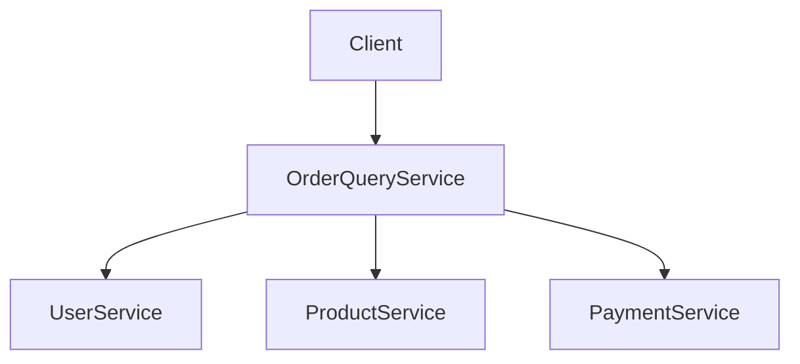
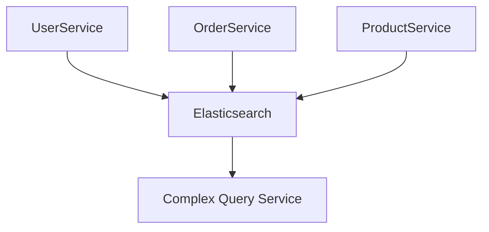
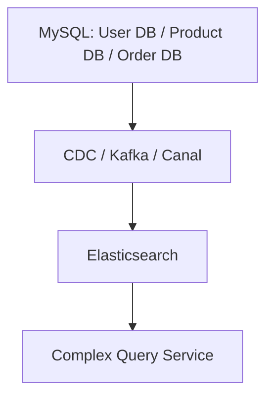

# Solving Join Queries in Microservices — API Composition vs CQRS

> **Source**: [Medium — Umesh Kumar Yadav](https://medium.com/@umeshcapg/interviewer-in-a-microservice-architecture-how-do-you-solve-the-problem-of-join-queries-64132331250c)

One of the most common microservices interview questions is:

> **"In a microservice architecture, how do you replace SQL JOIN queries?"**

Many developers love talking about how microservices are superior to monolithic architectures. But once you actually build a large distributed system, one painful reality quickly appears:

**SQL JOINs disappear.**

Something that used to take a single SQL query suddenly requires multiple network calls, data aggregation, synchronization, and eventually an entirely different architecture.

In this article, we'll explore why JOINs become difficult in microservices and the two most common solutions used in production systems:

- API Composition Pattern
- CQRS + Read Model Pattern

We'll also look at Java Spring Boot code examples for each approach.

## Why SQL JOINs Stop Working

In a monolithic application, everything usually lives inside one database.

Suppose we need to display an order with:

- Customer information
- Product details
- Payment status

A simple SQL query solves everything.

```sql
SELECT
    o.id,
    u.name,
    p.product_name,
    pay.status
FROM orders o
JOIN users u
    ON o.user_id = u.id
JOIN products p
    ON o.product_id = p.id
JOIN payments pay
    ON o.payment_id = pay.id
WHERE o.id = 100;
```

Simple. Fast. Efficient. The database optimizer does all the hard work.

## What Happens After Moving to Microservices?

Now imagine every table belongs to a different service.

```
User Service      → User Database
Order Service     → Order Database
Product Service   → Product Database
Payment Service   → Payment Database
```

The Order Service **cannot directly JOIN another service's database**. Doing so would tightly couple services and completely defeat database isolation.

Now your application must somehow combine data from multiple APIs.

## Solution 1: API Composition Pattern

The simplest solution is **API Composition**.

Instead of SQL JOINs, one service becomes responsible for calling multiple downstream services and combining their responses.



The API Composer performs the JOIN in application memory instead of inside the database.

### Example: Online Education Platform

Imagine a student opening today's schedule. To display the page we need:

- Student information
- Course details
- Teacher information
- Homework

Each belongs to a separate microservice. The Schedule Service becomes the API Composer.

### Spring Boot Example — Order DTO

```java
public record OrderDto(
        Long id,
        Long userId,
        Long productId,
        Double amount) {
}
```

### Calling Other Services

```java
@Service
public class OrderQueryService {

    private final UserClient userClient;
    private final ProductClient productClient;
    private final PaymentClient paymentClient;

    public OrderQueryService(UserClient userClient,
                             ProductClient productClient,
                             PaymentClient paymentClient) {
        this.userClient = userClient;
        this.productClient = productClient;
        this.paymentClient = paymentClient;
    }

    public OrderResponse getOrder(Long orderId) {
        OrderDto order = loadOrder(orderId);
        UserDto user = userClient.getUser(order.userId());
        ProductDto product = productClient.getProduct(order.productId());
        PaymentDto payment = paymentClient.getPayment(orderId);

        return new OrderResponse(order, user, product, payment);
    }
}
```

This works well for relatively simple queries.

### Advantages of API Composition

- ✅ Easy to implement
- ✅ No extra infrastructure
- ✅ Low operational cost
- ✅ Perfect for dashboards and detail pages

### Where API Composition Breaks Down

The real problem appears when you need **filtering and pagination** across services.

**Example**: Find 10 orders from VIP customers for fresh products.

#### Attempt 1 — Fetch then Filter

Retrieve 10 orders → Call Product Service → 7 fresh products remain → Call User Service → only 5 VIP users remain.

Oops. We only found **5 orders**, but the requirement was **10**.

#### Attempt 2 — Keep Fetching

```java
while (result.size() < 10) {
    List<Order> orders = fetchNextBatch();
    // Call Product Service
    // Call User Service
    // Filter results
}
```

Problems: many network requests, high CPU usage, huge memory consumption, poor latency, doesn't scale. Imagine millions of orders — this quickly becomes a nightmare.

## Solution 2: CQRS (Command Query Responsibility Segregation)

Instead of joining data at runtime, CQRS creates a **read model** specifically optimized for queries.

The write model remains unchanged. The read model contains pre-joined data.



Each service publishes data changes. A separate query database stores a denormalized "wide table." Instead of joining multiple services during every request, queries hit one optimized data store.

### Synchronizing Data

Common synchronization options include:

- Kafka events
- Change Data Capture (CDC)
- Debezium
- Alibaba Canal (MySQL Binlog)
- Event sourcing

Whenever data changes, the search index updates automatically.

### Example Architecture



The query service only reads Elasticsearch.

### Elasticsearch Query Example

Finding VIP customers with fresh products, returning only 10 records:

```json
POST orders/_search
{
  "size": 10,
  "query": {
    "bool": {
      "must": [
        { "term": { "userLevel": "VIP" } },
        { "term": { "category": "Fresh" } }
      ]
    }
  }
}
```

No JOINs. No multiple API calls. Everything already exists in one document.

### Spring Data Elasticsearch Example

```java
public interface OrderSearchRepository
        extends ElasticsearchRepository<OrderDocument, String> {

    List<OrderDocument> findByUserLevelAndCategory(
            String userLevel,
            String category);
}
```

Searching becomes extremely simple:

```java
List<OrderDocument> results =
        repository.findByUserLevelAndCategory("VIP", "Fresh");
```

### CQRS Advantages

- ✔ Extremely fast queries
- ✔ Supports complex filtering
- ✔ Full-text search
- ✔ Aggregations
- ✔ Pagination
- ✔ Sorting
- ✔ Analytics
- ✔ Better scalability

It works especially well for e-commerce, search platforms, reporting dashboards, BI systems, and recommendation engines.

### Drawbacks of CQRS

#### More Infrastructure

You'll likely introduce Kafka, Elasticsearch, Debezium or Canal, and additional query services. More components mean more operational complexity.

#### Eventual Consistency

The read model isn't updated instantly:

```
User updates profile → Event published → Consumer processes event
→ Elasticsearch updates → Query reflects change
```

This delay might range from milliseconds to a few seconds depending on the system. For most search and reporting use cases, that's acceptable. For workflows requiring strict consistency, you'll need to account for this trade-off.

## API Composition vs CQRS — Decision Framework

| Criteria | API Composition | CQRS |
|:---|:---|:---|
| Query complexity | Simple | Complex filtering, search |
| Number of services | Few | Many |
| Infrastructure | Minimal | Kafka, ES, CDC tools |
| Consistency | Strong (real-time) | Eventual |
| Development speed | Fast | Slower initial setup |
| Scalability | Moderate | High |
| Analytics/Reporting | Limited | Excellent |

### When to Choose API Composition

- Your queries are simple
- Only a few services are involved
- Development speed matters
- Infrastructure should remain minimal
- Your traffic is moderate

### When to Choose CQRS

- Queries involve multiple services
- Search and filtering are complex
- High throughput is required
- Reporting and analytics are important
- Low-latency reads outweigh eventual consistency

## Best Practices

- **Never allow one microservice to query another service's database directly.**
- Keep write models and read models independent.
- Use asynchronous events for data synchronization.
- Avoid premature optimization — introduce CQRS only when query complexity justifies it.
- Monitor synchronization lag to ensure read models remain acceptably fresh.

## Final Thoughts

One of the biggest trade-offs when moving from a monolith to microservices is giving up the convenience of SQL JOINs.

For **simple cross-service queries**, the **API Composition Pattern** is often the most practical solution. It keeps the architecture straightforward and avoids unnecessary infrastructure.

For **large-scale systems with complex search, filtering, reporting, or analytics**, **CQRS with a dedicated read model** provides far better performance and flexibility, albeit at the cost of added complexity and eventual consistency.

The most important lesson is this: **Don't adopt microservices — or CQRS — simply because they're popular.** Monoliths with well-designed SQL queries are often the fastest, simplest, and most maintainable solution for small to medium-sized applications. As with most architectural decisions, choose the simplest approach that satisfies your current requirements, and evolve only when real-world constraints demand it.
