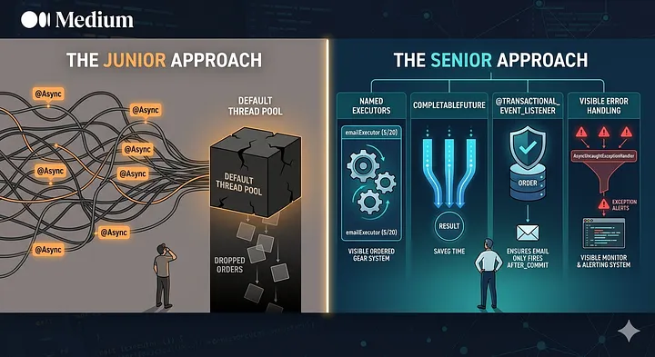

# Junior Devs Use `@Async`. Senior Devs Use These 4 Concurrency Patterns Instead

*By HabibWahid · 8 min read · May 23, 2026*

> **Source**: Originally published on [Medium](https://medium.com/@habibwahid/junior-devs-use-async-senior-devs-use-these-4-concurrency-patterns-instead)

---

`@Async` on every slow method? That's not performance — that's a thread pool waiting to explode. Here's what senior devs do instead.



I once inherited a Spring Boot application that had `@Async` sprinkled on 27 different methods. The team was proud of it. *"Everything runs in the background,"* they said. *"It's super fast."*

It was fast — right up until Black Friday, when the embedded thread pool hit its limit, new tasks started silently queuing, and then silently getting dropped. Orders were being placed. Confirmation emails were never sent. Inventory never updated. **No exceptions. No alerts. No logs. Just silence.**

The investigation took two days. The fix took twenty minutes. The real problem wasn't the code — it was the mindset. The team had treated `@Async` like a performance button. Slap it on anything slow and watch your response times drop. What they didn't understand is that **concurrency isn't a feature you add. It's a system you design.**

Senior developers don't reach for `@Async` first. They ask a harder question: *what is actually happening to this task once it leaves my thread?*

Here's what the answer looks like in code.

---

## Why Junior Devs Default to `@Async`

It's an easy sell. Method taking too long? Add `@Async`, return immediately, and the response time drops. The tutorial shows it in five lines. The annotation feels like magic.

The problem is that `@Async` **hides complexity rather than solving it**. You've moved work off your main thread — but onto what? Into a pool you probably haven't configured. With error handling you probably haven't thought about. With a task lifecycle you can't observe or control.

Senior devs don't avoid concurrency. They make it **explicit**. Every pattern below answers a question that `@Async` doesn't: *what happens when this fails, who manages these threads, and how do I know it actually ran?*

---

## The 4 Patterns Senior Devs Use Instead

### Pattern 1: Configure Your Executor — Never Use the Default

The most dangerous thing about `@Async` isn't the annotation. It's the thread pool it uses when you don't configure one.

```java
// ❌ WRONG — @Async with no executor configured
@Service
public class EmailService {

    @Async
    public void sendWelcomeEmail(String userEmail) {
        // This runs on SimpleAsyncTaskExecutor by default
        // Which creates a NEW THREAD for every single call
        // No pooling. No limits. No control.
        emailGateway.send(userEmail);
    }
}
```

Spring's default `SimpleAsyncTaskExecutor` creates a brand-new thread for every invocation. Under load, this becomes a **thread-per-request model** — the exact problem thread pools were invented to solve. Under production traffic, you're creating thousands of threads, exhausting memory, and crashing the JVM.

**What Senior Devs Do Instead:**

```java
// ✅ CORRECT — Define named executors with explicit boundaries
@Configuration
@EnableAsync
public class AsyncConfig {

    // Executor for email tasks - bounded, observable, named
    @Bean("emailExecutor")
    public Executor emailExecutor() {
        ThreadPoolTaskExecutor executor = new ThreadPoolTaskExecutor();
        executor.setCorePoolSize(5);       // Always-alive threads
        executor.setMaxPoolSize(20);       // Burst ceiling
        executor.setQueueCapacity(100);    // Wait queue before rejection
        executor.setThreadNamePrefix("email-async-");  // Visible in logs
        executor.setRejectedExecutionHandler(new ThreadPoolExecutor.CallerRunsPolicy());
        executor.initialize();
        return executor;
    }

    // Separate executor for inventory - different SLA, different pool
    @Bean("inventoryExecutor")
    public Executor inventoryExecutor() {
        ThreadPoolTaskExecutor executor = new ThreadPoolTaskExecutor();
        executor.setCorePoolSize(10);
        executor.setMaxPoolSize(50);
        executor.setQueueCapacity(500);
        executor.setThreadNamePrefix("inventory-async-");
        executor.setRejectedExecutionHandler(new ThreadPoolExecutor.AbortPolicy());
        executor.initialize();
        return executor;
    }
}
```

```java
// Now each @Async method declares which pool it belongs to
@Service
public class EmailService {

    @Async("emailExecutor")
    public CompletableFuture<Void> sendWelcomeEmail(String userEmail) {
        emailGateway.send(userEmail);
        return CompletableFuture.completedFuture(null);
    }
}
```

You now have thread counts you can reason about, names that appear in your thread dumps, and a rejection policy you chose deliberately.

| Policy | Behavior | When to Use |
|--------|----------|-------------|
| `CallerRunsPolicy` | Calling thread does the work instead of dropping it | Gentle backpressure — email, notifications |
| `AbortPolicy` | Reject and throw exception | Strict — dropping a task is unacceptable (inventory) |

> **The Rule**: If you use `@Async` without configuring a named executor, you don't have concurrency. You have a **thread leak with good intentions.**

---

### Pattern 2: `CompletableFuture` for Parallel Work That Must Complete Together

`@Async` with `void` return type is fire-and-forget. That's fine for notifications. It's **catastrophic** when you need results from multiple async operations before you can respond to the user.

```java
// ❌ WRONG — Sequential calls that should run in parallel
@GetMapping("/dashboard/{userId}")
public DashboardDTO getDashboard(@PathVariable Long userId) {
    // These three calls run one after another
    // Total time = 200ms + 150ms + 300ms = 650ms
    UserProfile profile = profileService.getProfile(userId);      // 200ms
    List<Order> orders = orderService.getRecentOrders(userId);    // 150ms
    AccountBalance balance = billingService.getBalance(userId);   // 300ms

    return new DashboardDTO(profile, orders, balance);
}
```

Three independent calls. Each waits for the last. The user pays **650ms** for work that could be completed in **300ms**.

**What Senior Devs Do Instead:**

```java
// ✅ CORRECT — Parallel execution with CompletableFuture
@Service
public class DashboardService {

    @Autowired
    private ProfileService profileService;
    @Autowired
    private OrderService orderService;
    @Autowired
    private BillingService billingService;

    public DashboardDTO buildDashboard(Long userId)
            throws ExecutionException, InterruptedException {

        // Kick off all three simultaneously
        CompletableFuture<UserProfile> profileFuture =
            CompletableFuture.supplyAsync(
                () -> profileService.getProfile(userId),
                dashboardExecutor
            );

        CompletableFuture<List<Order>> ordersFuture =
            CompletableFuture.supplyAsync(
                () -> orderService.getRecentOrders(userId),
                dashboardExecutor
            );

        CompletableFuture<AccountBalance> balanceFuture =
            CompletableFuture.supplyAsync(
                () -> billingService.getBalance(userId),
                dashboardExecutor
            );

        // Wait for all three to finish, then compose the result
        return CompletableFuture.allOf(profileFuture, ordersFuture, balanceFuture)
            .thenApply(v -> new DashboardDTO(
                profileFuture.join(),
                ordersFuture.join(),
                balanceFuture.join()
            ))
            .exceptionally(ex -> {
                logger.error("Dashboard assembly failed for user {}", userId, ex);
                return DashboardDTO.partial(); // Degrade gracefully
            })
            .get();
    }
}
```

| Before (Sequential) | After (Parallel) | Improvement |
|---------------------|------------------|-------------|
| 650ms | 300ms | **54% faster** |

Total time is now the **slowest of the three** — 300ms, not 650ms. More importantly, you have explicit error handling with `exceptionally()`. You can return a partial dashboard instead of a 500 error. The user sees something. The incident doesn't wake anyone up at 3am.

> **The Rule**: If you're making multiple independent calls to build one response, and you're doing it sequentially, you're making your users pay for laziness. Parallel execution with `CompletableFuture` is the right tool — not a void `@Async` method that you can't wait on.

---

### Pattern 3: `@TransactionalEventListener` for Post-Commit Side Effects

This is the most common `@Async` mistake senior devs see in code reviews. A new order gets saved. Before the transaction commits, an `@Async` method fires to send the confirmation email. The transaction then rolls back. **The customer receives a confirmation email for an order that doesn't exist.**

```java
// ❌ WRONG — Async side effects that ignore transaction state
@Service
public class OrderService {

    @Transactional
    public Order createOrder(OrderRequest request) {
        Order order = orderRepository.save(request.toOrder());
        // This fires immediately - even if the transaction rolls back
        eventPublisher.publishEvent(new OrderCreatedEvent(this, order));
        return order;
    }
}

@Component
public class OrderEmailListener {

    @Async
    @EventListener  // Fires before commit - wrong!
    public void onOrderCreated(OrderCreatedEvent event) {
        emailService.sendConfirmation(event.getOrder());
        // Customer gets email. Transaction rolls back. Order never existed.
    }
}
```

**What Senior Devs Do Instead:**

```java
// ✅ CORRECT — Side effects only run after the transaction successfully commits
@Component
public class OrderEmailListener {

    @Async("emailExecutor")
    @TransactionalEventListener(phase = TransactionPhase.AFTER_COMMIT)
    public void onOrderCreated(OrderCreatedEvent event) {
        // This ONLY runs if the transaction committed successfully
        // If the transaction rolled back, this never executes
        emailService.sendConfirmation(event.getOrder());
    }
}

@Component
public class InventoryListener {

    @Async("inventoryExecutor")
    @TransactionalEventListener(phase = TransactionPhase.AFTER_COMMIT)
    public void onOrderCreated(OrderCreatedEvent event) {
        // Same guarantee - inventory only updates when order is real
        inventoryService.reserveItems(event.getOrder());
    }
}

@Component
public class LoyaltyListener {

    @Async("loyaltyExecutor")
    @TransactionalEventListener(phase = TransactionPhase.AFTER_ROLLBACK)
    public void onOrderFailed(OrderCreatedEvent event) {
        // You can also react specifically to rollbacks
        loyaltyService.releaseHeldPoints(event.getOrder().getUserId());
    }
}
```

`@TransactionalEventListener` gives you four phases:

| Phase | When It Runs |
|-------|-------------|
| `AFTER_COMMIT` | Only if the transaction committed successfully ✅ |
| `AFTER_ROLLBACK` | Only if the transaction rolled back ❌ |
| `AFTER_COMPLETION` | After either commit or rollback |
| `BEFORE_COMMIT` | Just before the transaction commits |

This pattern also **decouples** your `OrderService` from email, inventory, and loyalty concerns entirely. The service publishes one event. Listeners react. Adding new post-order behavior means adding a new listener — not touching the service.

> **The Rule**: Never use `@EventListener` for side effects triggered inside a `@Transactional` method. If the transaction boundary matters — and it almost always does — use `@TransactionalEventListener`.

---

### Pattern 4: Async Error Handling You Can Actually See

This is the **silent killer** of `@Async` code. When a void `@Async` method throws an exception, it **vanishes**. No propagation. No alert. No stack trace unless you've explicitly wired an error handler. The task dies in silence.

```java
// ❌ WRONG — Exceptions disappear silently
@Async
public void syncUserToSearchIndex(Long userId) {
    User user = userRepository.findById(userId).orElseThrow();
    searchClient.index(user);  // Throws a connection timeout
    // Exception is swallowed. Search index is never updated.
    // No log. No alert. You find out from a support ticket three days later.
}
```

**What Senior Devs Do Instead:**

```java
// ✅ CORRECT — Structured error handling with an AsyncUncaughtExceptionHandler
@Configuration
@EnableAsync
public class AsyncConfig implements AsyncConfigurer {

    @Override
    public AsyncUncaughtExceptionHandler getAsyncUncaughtExceptionHandler() {
        return (throwable, method, params) -> {
            // This fires whenever a void @Async method throws
            logger.error(
                "Async method '{}' failed with params {} - {}",
                method.getName(),
                Arrays.toString(params),
                throwable.getMessage(),
                throwable
            );
            // Alert your on-call team, push to dead-letter queue, etc.
            alertingService.notifyAsync(method.getName(), throwable);
        };
    }
}
```

```java
// ✅ CORRECT — Return CompletableFuture so callers can handle errors themselves
@Async("searchExecutor")
public CompletableFuture<Void> syncUserToSearchIndex(Long userId) {
    return CompletableFuture.runAsync(() -> {
        User user = userRepository.findById(userId)
            .orElseThrow(() -> new NotFoundException("User", userId));
        try {
            searchClient.index(user);
        } catch (SearchClientException e) {
            // Log with context, then re-throw so the future carries the failure
            logger.error("Search index sync failed for userId={}", userId, e);
            throw e;
        }
    }, searchExecutor);
}
```

```java
// Caller can now handle success and failure explicitly
public void onUserUpdated(Long userId) {
    syncUserToSearchIndex(userId)
        .whenComplete((result, ex) -> {
            if (ex != null) {
                retryQueue.enqueue(new SearchSyncTask(userId));
            }
        });
}
```

With `AsyncUncaughtExceptionHandler`, every silent death becomes a visible log entry. With `CompletableFuture` return types, callers can attach `.whenComplete()`, `.exceptionally()`, or `.handle()` callbacks and react to failure intelligently — retry, enqueue, degrade — instead of wondering why something never happened.

> **The Rule**: A void `@Async` method without an `AsyncUncaughtExceptionHandler` is a **black hole**. Exceptions enter and never come out. If you can't observe a failure, you can't fix it.

---

## The Mental Model That Changes Everything

Senior developers think about async work in two dimensions that `@Async` alone doesn't force you to consider:

| Dimension | Key Questions |
|-----------|--------------|
| **Ownership** | Who owns this thread? What pool does it come from? What happens when that pool is full? |
| **Lifecycle** | When does this task run? What if the transaction rolls back? What if it throws? Who finds out? |

`@Async` answers exactly one question: *"Should this run on a different thread?"* Senior devs need answers to **all four**.

| Pattern | Solves | When to Use |
|---------|--------|-------------|
| **Named Executor** | Thread ownership & resource isolation | Always — never use the default |
| **CompletableFuture** | Results, composition, error handling | When you need results from parallel work |
| **@TransactionalEventListener** | Transaction-aware lifecycle | When side effects depend on commit/rollback |
| **AsyncUncaughtExceptionHandler** | Observability & failure recovery | Always — void methods must be monitored |

You'll still use `@Async`. But you'll use it **intentionally**, not by habit.

---

## Your Action Plan for Tomorrow

1. **Find every bare `@Async`** in your codebase. Check whether a named executor is configured. If not, create one with explicit pool limits before you do anything else.

2. **Find every `@EventListener`** inside a class that reacts to domain events from a `@Transactional` method. Replace it with `@TransactionalEventListener(phase = TransactionPhase.AFTER_COMMIT)`.

3. **Find every void `@Async` method.** If it can fail silently — and it can — add `AsyncUncaughtExceptionHandler` to your `AsyncConfig`.

4. **Find one place** where you make three or more sequential calls to build a single response. Replace it with `CompletableFuture.allOf()` and measure the difference.

Don't refactor everything this week. One change at a time. Each fix makes your async code **honest** about what it's actually doing with your threads — and that's the real difference between junior and senior concurrency.

---

*Originally published by HabibWahid on [Medium](https://medium.com/@habibwahid).*

> **Source URL**: [Junior Devs Use @Async. Senior Devs Use These 4 Concurrency Patterns Instead](https://medium.com/@habibwahid/junior-devs-use-async-senior-devs-use-these-4-concurrency-patterns-instead)
>
> **Taxonomy Reference**: §2.1 Application Architecture Patterns (Concurrency & Threading), §8.2 Delivery & Runtime  
> **Related**: [.NET Multithreading Patterns](../../../programming-languages/csharp/dotnet-multi-threading/) | [Java Concurrency Best Practices](https://docs.oracle.com/javase/tutorial/essential/concurrency/)
