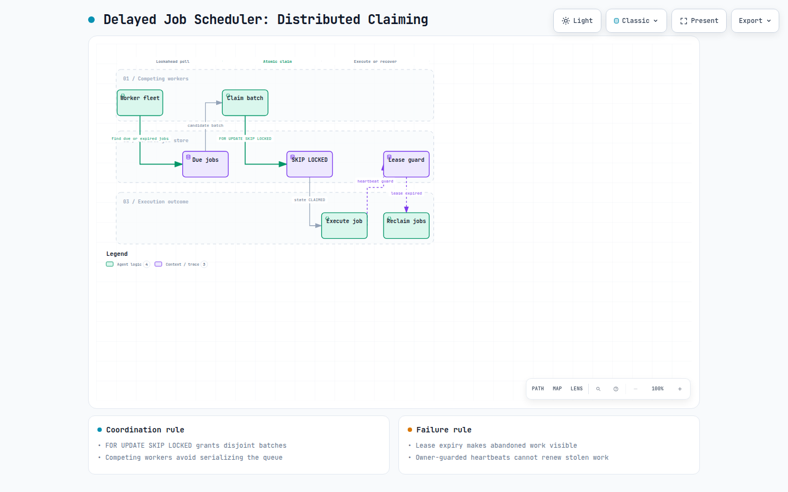
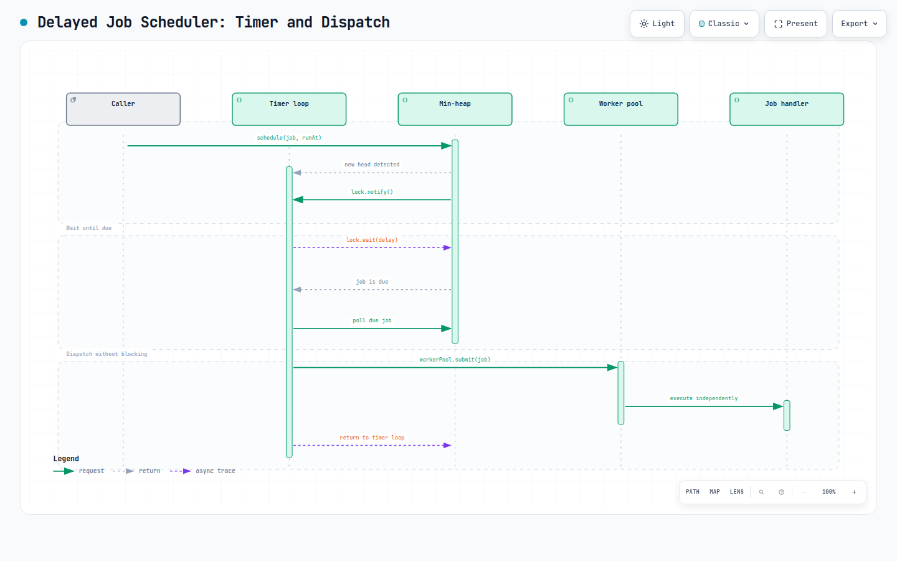

# Amazon Interview Question: Design a Delayed Job Scheduler

Every candidate can write the first version of this in about thirty seconds:

```java
new Thread(() -> {
    Thread.sleep(delayMillis);
    runJob(job);
}).start();
```


That code is correct in the narrowest possible sense. It also falls over at roughly 10,000 jobs, forgets everything the moment the process restarts, and runs a job twice the instant you add a second machine. Working out why, in that order, is the entire interview.

The prompt itself sounds fairly modest on the surface: Schedule a job to run at some future time, allow it to be cancelled, and survive at scale. Underneath that sits a timing problem, a durability problem, a distributed claiming problem, and a clock problem, and each one has a specific answer that interviewers are listening for.

## Why the Naive Version Dies

Two independent failures kill the thread-per-job approach, and naming both is worth doing before you design anything.

The first failure is plain resource exhaustion. A thread costs around a megabyte of stack, so a hundred thousand pending jobs asks for a hundred gigabytes of memory that you plainly do not have. Long before that, the OS scheduler starts spending more time context switching between sleeping threads than doing useful work.


The second failure runs deeper than the first. Everything lives in process memory, so a deploy, a crash, or a routine restart silently deletes every scheduled job. A scheduler that forgets its work during a deploy is a scheduler nobody can build a product on.

Those two failures point at two separate fixes: One thread should manage all the timing, and the queue itself has to live somewhere durable.

## The Single-Process Core

Start with one machine and get the timing right, because the distributed version is this design plus claiming.

The data structure is a min-heap ordered by execution time, which gives you the next job to fire in constant time and insertion in logarithmic time:

```java
PriorityQueue<Job> queue;      // ordered by runAt
final Object lock = new Object();
```

```java
void schedule(Job job) {
    synchronized (lock) {
        queue.add(job);
        if (queue.peek() == job) {
            lock.notify();      // this job fires sooner than the old head
        }
    }
}

void timerLoop() {
    while (running) {
        Job due;
        synchronized (lock) {
            while (queue.isEmpty()) lock.wait();
            Job head = queue.peek();
            long delay = head.runAt - clock.millis();
            if (delay > 0) { 
                lock.wait(delay); 
                continue; 
            }
            due = queue.poll();
        }
        workerPool.submit(() -> execute(due));
    }
}
```

Two lines in that loop carry the whole design, and both are places candidates lose points:

### 1. The Timer Thread Waits Rather Than Sleeps

A thread inside `Thread.sleep` cannot be woken. Schedule a job for one second from now while the timer sits inside an hour-long sleep, and that job fires an hour late. Using `lock.wait(delay)` paired with the `notify()` in `schedule()` means any newly arriving job that becomes the head interrupts the wait immediately. Interviewers ask *"what happens if a sooner job arrives while you are waiting"* precisely to see whether you already handled it.

### 2. The Timer Thread Never Executes the Job Itself

Handing the job to a worker pool looks like a small detail and is the difference between a working scheduler and a broken one. Run jobs inline on the timer thread and a single job that takes thirty seconds delays every other job in the system by thirty seconds. The timer thread has exactly one responsibility, which is deciding what is due, and it must return to that decision immediately.

Worth mentioning out loud that this is what `ScheduledThreadPoolExecutor` already does internally, pairing a `DelayQueue` with a worker pool. Naming the standard library implementation signals that you know the pattern rather than having improvised it.

## Making It Durable

The heap has to be a cache rather than the source of truth:

```sql
CREATE TABLE jobs (
  job_id           UUID PRIMARY KEY,
  payload_ref      TEXT        NOT NULL,
  run_at           TIMESTAMPTZ NOT NULL,
  state            TEXT        NOT NULL,
  attempt          INT         NOT NULL DEFAULT 0,
  lease_owner      TEXT,
  lease_expires_at TIMESTAMPTZ,
  idempotency_key  TEXT UNIQUE,
  created_at       TIMESTAMPTZ NOT NULL DEFAULT now()
);
```

```sql
CREATE INDEX idx_jobs_due ON jobs (run_at)
  WHERE state = 'PENDING';
```

The partial index deserves a sentence, since it is the kind of detail that reads as production experience. You only ever query jobs that are pending and due soon, so indexing the ten million completed rows alongside them wastes memory and slows every write. Restricting the index to `state = 'PENDING'` keeps it small enough to stay resident even when the table is enormous.


Now the hybrid that makes this both durable and precise: Polling the database every hundred milliseconds for millisecond accuracy is wasteful, and polling every ten seconds gives you ten seconds of jitter. So do both at different layers:

1. Every few seconds, each worker pulls the jobs due in the next thirty seconds into its local heap.
2. The in-memory timer loop fires them with millisecond precision inside that window.

The database provides durability and the heap provides accuracy, and the poll interval only needs to be shorter than the lookahead window.

## Exactly-Once Across Many Workers

Add a second worker and the interesting problem arrives: Both machines poll the same table, both see the same due jobs, and without coordination both run them.

The primitive that solves this is one clause that a surprising number of candidates have never used:

```sql
UPDATE jobs
   SET state            = 'CLAIMED',
       lease_owner      = :worker_id,
       lease_expires_at = now() + interval '60 seconds',
       attempt          = attempt + 1
 WHERE job_id IN (
     SELECT job_id
       FROM jobs
      WHERE state = 'PENDING'
        AND run_at <= now() + interval '30 seconds'
      ORDER BY run_at
      LIMIT 100
      FOR UPDATE SKIP LOCKED
 )
RETURNING *;
```

`FOR UPDATE SKIP LOCKED` tells the database to lock the rows it selects and silently step over any row another transaction has already locked. Twenty workers can run that identical query simultaneously, and each one walks away with a disjoint set of a hundred jobs. Without `SKIP LOCKED` they serialise behind each other and your throughput collapses to a single worker. With plain `SELECT` and no locking at all, they all claim the same rows.

Say the alternative you rejected too, because interviewers like hearing the comparison: A distributed lock in Redis works and adds a second system that can fail independently, along with all the lease and fencing problems that come with it. The database row you already have is a lock with better durability guarantees, and reaching past it for infrastructure you do not need reads as inexperience.

## Leases, Heartbeats, and the Guard People Forget

A claimed job whose worker dies must eventually run somewhere else, which is what `lease_expires_at` is for. Extend the claim query to sweep up abandoned work:

```sql
WHERE (state = 'PENDING' AND run_at <= now() + interval '30 seconds')
   OR (state IN ('CLAIMED', 'RUNNING') AND lease_expires_at < now())
```

A job that takes longer than the lease has to extend it, or another worker will steal it mid-execution and run it concurrently:

```sql
UPDATE jobs
   SET lease_expires_at = now() + interval '60 seconds'
 WHERE job_id = :job_id
   AND lease_owner = :worker_id;      -- the guard that matters
```

That second condition is the line to point at: If the lease already expired and another worker took ownership, this update affects zero rows, and the original worker must treat that as a signal to abort immediately rather than carrying on. A heartbeat without an ownership check silently lets two workers believe they own the same job, which is the exact failure the lease existed to prevent.

## The Honest Answer About Exactly-Once

At some point the interviewer will ask whether this guarantees exactly-once execution. The correct answer is that it does not, and that nothing does.

Walk through the scenario that proves it: A worker claims a job, executes it completely and successfully, and then loses power before it can write `SUCCEEDED`. The lease expires, another worker legitimately picks the job up, and the work happens twice. Closing that window requires the execution and the state write to be atomic across two systems, which is the distributed transaction problem, and it remains unsolved in the general case.

So state the contract you can actually deliver: **at-least-once execution paired with idempotent handlers.** The job payload carries a stable `job_id`, handlers deduplicate on it, and a repeated execution becomes a no-op rather than a second charge or a second email.

Framing this as at-least-once plus idempotency, rather than claiming exactly-once, is one of the clearest seniority signals available in this question. Candidates who promise exactly-once are usually describing a system they have never operated.


## Retry is Just Rescheduling

Failure handling gets pleasantly small once the scheduler exists, and this is the observation worth making explicitly:

```sql
UPDATE jobs
   SET state       = 'PENDING',
       run_at      = now() + :backoff,
       lease_owner = NULL
 WHERE job_id = :job_id;
```

A retry is a job scheduled for slightly later, and the machinery for running something later is the entire system you already built. Rather than bolting on a retry queue, you set the state back and move the timestamp forward.

The backoff itself follows the usual shape, doubling with a cap and randomised to avoid synchronised retry storms:

```text
delay = min(BASE * 2^attempt, CAP)
run_at = now() + random(delay / 2, delay)
```

Bound it on both attempts and wall-clock age, since a job that was supposed to run on Tuesday is often worse than useless by Friday. Exhausted jobs move to a terminal state carrying the last error, where an operator can inspect and replay them.

Working through more problems framed this way, with explicit sub-parts and follow-ups, is easier when you can see the [**original prompts companies actually used**](https://prachub.com/interview-questions/design-delayed-job-scheduler-lld?utm_source=medium&utm_campaign=v1012) rather than a cleaned-up retelling, because the constraints in the real wording are usually what the interviewer intends to press on.

## The Two Scaling Problems That Actually Bite

### 1. The Poll Query Becomes the Bottleneck

At tens of millions of rows, `ORDER BY run_at LIMIT 100` under heavy contention from twenty workers stops being cheap even with the partial index.

The fix for that is time bucketing: Add a `bucket` column derived from `run_at` truncated to the minute, and have workers scan only the current and next bucket. The working set shrinks from the whole table to a few minutes of jobs, and completed buckets can be dropped wholesale instead of deleted row by row.

### 2. Everybody Schedules for Midnight

This one is more interesting and rarely anticipated: Humans and cron expressions cluster hard on round numbers, so a million jobs land on exactly `00:00:00` and your scheduler faces a stampede at that instant while sitting idle at `00:00:30`.

Two mitigations, and the choice between them is a product question: Where the caller tolerates approximate timing, add jitter at schedule time and spread the work across the minute. Where exact timing genuinely matters, keep the timestamps and rate-limit dispatch out of the bucket, accepting that some jobs start late and making that lateness a metric you watch rather than a surprise.

## Whose Clock Is It

Several machines comparing `run_at` against their own idea of the current time will disagree, and a worker whose clock runs two seconds fast fires jobs two seconds early.

The clean answer is to let the database clock be the only clock that matters: Every comparison uses `now()` evaluated server-side inside the query rather than a timestamp computed in application code. Skew between workers stops affecting correctness because no worker's opinion of the time is ever consulted.

Where application-side timing is unavoidable, run NTP, define an explicit tolerance band, and state plainly that sub-second ordering across machines is outside what the system promises. Claiming precision you cannot deliver is worse than documenting the bound.

## Cancellation, and Being Honest About Its Limits

```sql
UPDATE jobs SET state = 'CANCELLED'
 WHERE job_id = :job_id AND state = 'PENDING';
```

One row affected means the cancellation won cleanly. Zero rows means the job was already claimed, and now you have to say something uncomfortable and correct: **work already in flight cannot be reliably cancelled without the job’s cooperation.**

The options are to accept that a job claimed before the cancellation arrived will complete, or to set a cancellation flag that long-running handlers poll at checkpoints and exit voluntarily. Cooperative cancellation is the only version that actually works, and pretending otherwise invites a follow-up you will lose.

## Testing Something Built Entirely Out of Time

One decision determines whether this system is testable, and it should be made on the first day:

### Never Call the System Clock Directly

Inject a `Clock` everywhere, so tests can advance time instantly rather than waiting for it. A scheduler tested with real sleeps produces a suite that takes twenty minutes and still fails intermittently.

```java
class Scheduler {
    private final Clock clock;      // tests inject a controllable clock
}
```

With that in place, the tests worth naming are the concurrent ones:

- **Claim Contention**: Twenty threads run the claim query against the same due jobs across ten thousand iterations, asserting every job is claimed exactly once and none are skipped.
- **Crash After Execution**: Kill a worker between finishing the work and writing `SUCCEEDED`, then assert the job is re-run after lease expiry and that the idempotent handler makes the second run harmless. This is the scenario from the exactly-once discussion, and testing it proves you meant it.
- **Heartbeat vs. Expiry**: Race a heartbeat against a lease expiring, asserting that the losing worker sees zero rows updated and aborts rather than continuing.
- **Midnight Stampede**: Schedule a hundred thousand jobs at an identical timestamp and assert that dispatch spreads without the poll query timing out.


## Archify diagrams



> **Interactive Archify diagram**: [Distributed job claiming workflow](resources/delayed-job-scheduler/distributed-claiming-workflow.html)



> **Interactive Archify diagram**: [Timer and worker dispatch sequence](resources/delayed-job-scheduler/timer-dispatch-sequence.html)

## What Decides This Interview

Six moments, and they arrive roughly in this order:

1. Handing execution to a worker pool instead of running jobs on the timer thread is the first fork, and running them inline is an immediate signal that the candidate has not built one of these.
2. Using wait and notify rather than sleep shows you thought about a job arriving sooner than the current head.
3. Reaching for `SKIP LOCKED` rather than a distributed lock demonstrates that you know the database you already have is a coordination primitive.
4. Guarding the heartbeat with an ownership check is a small line that proves you traced the failure path all the way through.
5. Describing the contract as at-least-once with idempotent handlers, rather than promising exactly-once, is the clearest seniority marker in the whole question.
6. Anticipating the midnight stampede before being asked separates people who have run a scheduler in production from people who have designed one on a whiteboard.

The problem is labelled low level design, which makes it sound like a data structures exercise. What it actually tests is whether you can keep two machines from doing the same work twice while a clock ticks and processes die underneath you, and that is a far better question than its title suggests.
