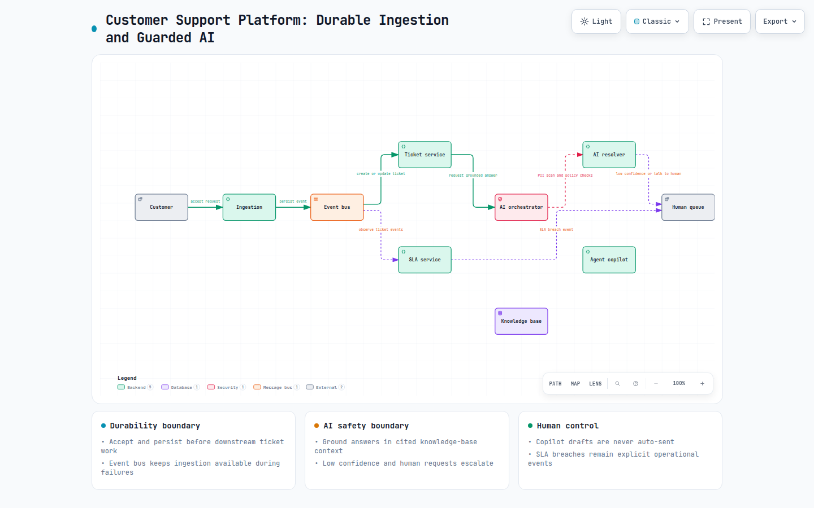
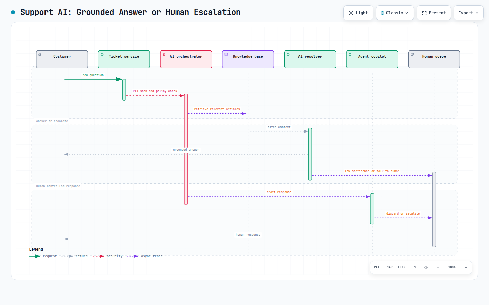

# Customer Support System Design Interview: Building an AI-Powered Support Platform (From MVP to GenAI)

The idea behind this series is straightforward: generative AI isn’t the product itself; it’s a capability you introduce *where an existing system has a real weakness*. Too often, teams take a system that already works, add an LLM on top, and label it innovation. In the process, they skip the harder work of building the underlying system properly, understanding where it falls short of *interpreting* information rather than simply *storing* it, and then deciding where generation can genuinely add value.

That’s the purpose of this interview: to bring those decisions and tradeoffs into the open. Because ideas only prove their worth when they have to work within the constraints of real budgets, real customers, and real-world systems.


**The room:**

- **Daniel Cole** — Interviewer, Engineering Manager
- **Meera Iyer** — Candidate, Senior Backend Engineer

The system under design: a **customer support platform** — ticketing, SLAs, agent workflows — that eventually needs to resolve more without ever trapping a frustrated customer in a dead end. Let’s sit in.

## 1. Problem Statement

**Daniel:** Let’s design a customer support platform — think Zendesk or Intercom. Customers open tickets across email, chat, and phone. Agents pick them from queues, respond, and manage SLAs. That’s the baseline. Where it gets interesting is what happens *after* the baseline works: the same twenty questions come in ten thousand times a day, customers wait too long for answers the knowledge base already has, and every ticket routes through the same manual triage. I want the core system first, and then we’ll talk about where — and whether — AI belongs.

**Meera:** So two phases. *Phase one*: a ticketing engine that is *boringly reliable* — every ticket lands somewhere, nothing is lost, SLAs are computed correctly and enforced. *Phase two*: AI-first-level resolution, agent copilots, auto-classification — without turning a frustrated customer’s one shot at help into a chatbot maze.

**Daniel:** Exactly. Don’t design for the AI part yet. Design for the platform first.

## 2. Requirement Discussion

**Meera:** Before I draw anything, scope.

**Functional requirements:**

- Ticket ingestion from multiple channels — email, chat, phone, web form
- Ticket lifecycle — create, assign, respond, resolve, reopen
- Queue management for agents — routing, priorities, assignment
- SLA tracking — compute deadlines, detect breaches, escalate
- Knowledge base — articles agents and (later) customers use
- Notifications — customer replies, agent escalations

**Meera:** Clarifying questions —

- **Scale:** How many tickets a day, and how many agents?
- **Channels:** Is email the dominant channel, or is real-time chat? That changes whether agents work asynchronously or live.
- **SLA model:** Do SLAs run on business hours or calendar hours, and do they differ by tier/plan?
- **Self-service:** Do customers ever reach the knowledge base directly today, or is it purely agent-facing?
- **Compliance:** Are we supporting regulated industries (finance, healthcare) where tickets contain sensitive PII and must be retained and audited?

**Daniel:** Roughly **50,000 tickets a day**, about **400 agents** across shifts, mostly email but a fast-growing chat channel. SLAs are per-plan, computed on business hours — and they’re contractual, so they must be *exactly* right. The knowledge base is agent-facing today and barely used. And yes, a meaningful slice of customers are in regulated industries, so PII handling and audit trails are real constraints, not afterthoughts.

**Non-functional requirements (Meera, summarizing on the board):**

- Write-heavy at the edges (ingestion bursts), read-heavy in the middle (agents querying queues, history, customer context)
- Ticket ingestion must be durable — an email that arrives must never silently vanish
- Strong consistency where it matters: ticket state transitions, SLA deadlines, assignment
- Cost-sensitive — the support org’s headcount is the biggest cost, and later, LLM inference is the new one that scales with usage
- Data privacy — PII in tickets, retention policies, audit trails for regulated customers

**Daniel:** Good. Show me the system — no AI yet.

## 3. Initial Architecture (MVP — No AI Yet)

**Meera:** Same discipline as always: domain-driven microservices split by bounded context, each owning its data.


**Meera:** Key decisions:

- **Ingestion is durable-first.** An email hits an inbox, gets queued, and only then is a ticket created. If any downstream service is down, the message waits — it never disappears. Ingestion and ticket creation are decoupled by the event bus.
- **The Ticket Service owns the state machine** — every transition (new → assigned → responded → resolved → reopened) is an append-only event. History is audit, not a nice-to-have, because our regulated customers demand it.
- **The SLA Service is a pure function of state.** It consumes ticket events, computes deadlines on business hours, and emits breach/escalation events. It never mutates the ticket — it only observes and warns. That keeps the contractual logic isolated and testable.

**Daniel:** Reasonable MVP. Now let’s break it.

## 4. Where This Architecture Struggles

**Daniel:** Six months in, 50,000 tickets a day. What surfaces?

**Meera:** Four things, and they’re visible in the queue metrics before anyone feels them:

1. **High volume of repetitive queries.** The same questions — “how do I reset my password?”, “where’s my refund?” — flood in thousands of times a day, and every one of them occupies an agent for minutes. The platform stores these as tickets, but nothing recognizes that they’re the *same* question wearing different sentences.
2. **Slow response cycles.** First-response time misses the SLA target on the busiest days, because 400 agents are chewing through volume that’s 80% routine. The knowledge base has the answers; agents don’t have the time to find and paste them.
3. **The knowledge base is underused.** Agents search it and get documents, not answers — and the KB is never told *why* tickets weren’t resolved by an article. Nothing in this diagram connects “this ticket was resolved by agent knowledge” back to “we’re missing an article on this topic.”
4. **Classification and routing are manual.** Every new ticket lands in a general queue and a human decides what it is, how urgent, and who owns it. It’s slow, it’s inconsistent — one agent calls something P1, another calls it P3 — and it doesn’t scale with the channel mix.

**Daniel:** All four are really one problem wearing different clothes.

**Meera:** Right. The platform is excellent at moving tickets and enforcing SLAs, but it cannot *understand* a ticket — what it’s about, how urgent it really is, whether the answer already exists. That’s the gap. And before I reach for the LLM, the failure mode: an AI resolver that answers confidently and wrong will damage customer trust faster than a slow human — a customer who’s been told the wrong thing by a bot is angrier than one who waited. So the design rule here is different from “impress me with speed”: **every AI answer must be grounded in the KB, and every path must end in an easy hand-off to a human.**

**Daniel:** Hold that thought — we’ll come back to it in step 7. Contracts and data first.

## 5. API Contracts and Database Design

**Meera:** The core contracts, before any AI:

```c
POST /v1/tickets
  body: { customerId, channel: "email"|"chat"|"web", subject, body, priority? }
  → 201 { ticketId, status: "new", queue: "general", sla: { dueAt } }

GET /v1/tickets/{ticketId}
  → 200 { ticketId, status, queue, priority,
          sla: { dueAt, breached: false } }

POST /v1/tickets/{ticketId}/responses
  body: { authorType: "agent"|"system", body }
  → 201 { responseId }

POST /v1/knowledge/articles
  body: { title, body, tags: [...] }
  → 201 { articleId }
```

**Meera:** One deliberate choice: ticket creation returns the **SLA due date** immediately. That’s what makes the later triage capability possible — whether it’s a human or an LLM proposing a priority, the SLA computation stays in one place, and a proposal that would blow a deadline is visible to the rule layer, not buried in prose.

**Daniel:** And storage — tradeoffs.

**Meera:**


**Meera:** I’d resist a document store for tickets. The temptation is “tickets are documents,” but tickets are really *state machines with text attached* — you query them by status, queue, customer, and SLA, and you transition them transactionally. That’s Postgres-shaped, not document-shaped. JSONB covers the schema flexibility need. A document store only earns its keep if ticket *content* search starts dominating and needs independent scaling — and the ES index already covers that.

**Daniel:** Fair. Before the fun part — how do you trust code in this system when half of it is written by an AI coding assistant?

## 6. AI-Assisted Development: Guardrails on the Code Itself

**Daniel:** Your team uses Copilot or Claude for a chunk of this. What stops it from quietly degrading a system where SLAs are contractual?

**Meera:** Two failure modes — AI writing *wrong* code, and AI writing code that passes tests but *drifts from intent*. The SLA engine is the domain where being “approximately right” is a contractual breach, so:

- **TDD for anything that computes time or money.** SLA deadline computation (business hours, holidays, plan tiers), escalation timers, and billing/plan changes get tests written *first*, by a human. The test is the spec — the AI can’t quietly redefine what “2 business hours” means.
- **BDD for user-facing workflows**, in Gherkin, reviewed by product and the support org before implementation:

```gherkin
Feature: SLA escalation
  Scenario: Priority-1 ticket escalates when its deadline passes
    Given a ticket with priority "P1"
    And the business-hours SLA for P1 is 2 hours
    When 2 business hours pass without a response
    Then the ticket status becomes "overdue"
    And an escalation event is emitted to the on-call queue
```

- **Unit tests** on business logic (state transitions, SLA math, queue assignment), **integration tests** across service boundaries (does an email ingestion actually produce a ticket event on the bus? does a breach event actually reach the on-call queue?), and a **coverage floor in CI** — 80% on new code, enforced on the diff.
- **Load testing the predictable spike**: incident days. A single product outage triples ticket volume in an hour — model that explicitly, plus the Black-Friday-style seasonal peak.
- **Chaos testing**: kill the email ingestion pipeline mid-burst — messages must queue, not drop. Kill the event bus during a resolution wave — ticket state must not corrupt. Kill the KB during agent response — agents must still see the ticket, just without article suggestions.
- **Performance testing with explicit budgets**: ticket create p95 < 300ms, queue view p95 < 400ms, SLA breach detection propagation < 1s — numbers a reviewer can be held to.

**Daniel:** Why does this matter *more* because AI wrote it, versus a human?

**Meera:** Because the AI assistant is most confident exactly where it’s most dangerous here: time arithmetic. Business-hours computation across timezones, holidays, and plan tiers is a logic maze — an AI will generate a version that passes a happy-path test and is wrong at 11:59pm on a Friday before a holiday weekend. Tests and BDD specs make “correct” an external, checkable artifact instead of a shared assumption.

## 7. Where GenAI Actually Solves the Problems From Step 4

**Daniel:** Back to your four problems. Which ones does AI actually fix — and which just *sound* like AI problems?

**Meera:** One at a time, feasibility over enthusiasm.

**High volume of repetitive queries →** The clearest GenAI win, *if* it’s grounded and *if* it can’t trap anyone. An **AI resolver** answers first-level queries via RAG over the knowledge base — retrieve the relevant articles, answer from them, cite the source. But two guardrails are non-negotiable: the answer must always carry a citation and a one-tap “talk to a human” path, and if retrieval confidence is low, the resolver escalates instead of guessing. A wrong bot answer to a customer who’s already frustrated is the single fastest way to burn trust in this system.

**Slow response cycles →** Not by making the bot faster at answering everything — by making the *agent* faster at answering the rest. An **agent copilot** drafts responses grounded in the KB and the ticket’s own history: “Based on this customer’s plan and the KB article on refunds, here’s a draft.” The agent reviews and edits; **nothing auto-sends**. That’s the guardrail against the second failure mode — a plausible-sounding draft that drifted from the customer’s actual question.

**KB underused →** This becomes a *data* problem once the resolver and copilot exist, because they generate the missing signal. Log every ticket’s resolution: resolved by article X, resolved by agent knowledge (no article cited), or unresolved. A **KB-gap detector** (batch, not interactive) mines resolved-by-agent tickets for recurring topics with no matching article, and flags stale or contradicted articles. The LLM proposes the new article draft; a human publishes it.

**Manual classification and routing →** Auto-triage, but with a strict division of labor: the LLM *proposes* the intent, priority, and queue from the ticket text; a **deterministic rule layer enforces** it — it refuses an LLM-proposed P1 that violates SLA policy, and low-confidence proposals route to the general queue instead of being guessed. The LLM can misinterpret a ticket; the rule layer cannot miscompute a deadline.

**Meera:** Here’s the revised architecture — AI placed only where step 4’s interpretation gaps actually live:


**Daniel:** Why an orchestrator instead of letting the customer chat directly with the LLM provider?

**Meera:** Three reasons: it’s the single place to enforce grounding, the PII scan, and the escalation path consistently across every AI feature; it’s where cost control lives (caching common answers, routing by complexity); and it’s where the feedback loop closes — every outcome (resolved, escalated, thumbs-down, reopened) is logged in one place and feeds both retrieval quality and the KB-gap detector.

## 8. Observability and Cost

**Daniel:** Last thing. How do you know this is working, and what does it cost?

**Meera:** Two lenses — correctness and cost — because if you watch only one, the other gets quietly gamed.

**Observability:**

- **Auto-resolution rate, measured honestly.** The naive metric — “X% of tickets answered by the bot” — lies, because a ticket that comes back reopened in 7 days wasn’t resolved, it was deferred. Track *resolution with no reopen within 7 days*, and watch that number against the auto-resolution rate. A gap between them is the silent failure.
- **Escalation rate.** Too low can mean the confidence threshold is too permissive, not that the bot got better. Correlate it against reopen rate and customer satisfaction.
- **First-response time and SLA compliance**, split by channel and tier — the thing that was contractual before AI stays the headline metric after it.
- **Grounding rate** — % of resolver answers that cited a retrieved article vs. fell back to ungrounded generation. A drop here is a trust-risk canary.
- **Copilot acceptance rate** — of agent-facing suggestions, how many were used as-is, edited, or discarded. This is how you know the copilot is earning agent time, not costing it.
- **Distributed tracing** (OpenTelemetry) across Orchestrator → Retrieval → LLM → Guardrail, plus the audit trail of *every* AI interaction for regulated customers.

**Cost:**

- **Token cost per resolved ticket is the unit of truth**, not total spend — it lets you compare the AI resolver against the cost of a human handling the same ticket.
- **Cache aggressively.** A huge fraction of repetitive queries are the same question reworded — cache (question-cluster, topic) → grounded answer rather than hitting the LLM per customer.
- **The KB-gap detector and article drafting are batch workloads** — run them on a schedule, budget them separately from interactive chat tokens.
- **Model routing by task**: a refund-status answer with a cached article doesn’t need the largest model; an ambiguous multi-issue ticket does. Route by complexity, don’t default to the expensive model.
- **Per-feature cost dashboards** — resolver, copilot, triage, KB-gap — as separate line items, because they’ll evolve independently.
- **Hard ceilings with graceful degradation** — as monthly LLM spend approaches a threshold, degrade the resolver to “send the top 3 KB links” (no generation, zero tokens) before blowing the budget. The MVP still works with zero LLM calls, which is exactly why we built it first.

**Daniel:** Good place to stop. And the discipline held — most teams would have shipped a chatbot on day one and called it AI. You built the ticketing engine, made the SLA math exact, and only then added generation where understanding was the gap.

**Meera:** That was the trap, right? Steps 1 through 5 have no AI in them at all — ingestion, state, and SLAs *are* the product. The LLM is a layer on top that finally lets the platform see what a ticket is *about*, instead of just moving it around.

## Key Takeaways

- Ingestion, ticket state, and SLA computation are the product. GenAI is a layer placed where the platform fails to *interpret* — what a ticket is about, whether the answer already exists, how urgent it really is.
- Every AI answer must be grounded in the knowledge base and carry an easy path to a human. A wrong bot answer to a frustrated customer is worse than a slow one — so confidence-gating and escalation are features, not cautions.
- Split proposal from enforcement: the LLM proposes intent, priority, and queue; the deterministic SLA rule layer enforces it. The LLM can misread a ticket; the rule layer can’t miscompute a deadline.
- The KB-gap detector turns the AI’s existence into the missing data signal — resolution events feed back into article coverage, closing the loop that makes the KB self-improving.
- The engineering discipline transfers wholesale: TDD for time-and-money logic, BDD for customer workflows, load tests for incident spikes, chaos tests for ingestion failure, and per-feature AI cost dashboards.

## Archify diagrams



> **Interactive Archify diagram**: [Support platform architecture](resources/customer-support-ai-platform/support-platform-architecture.html)



> **Interactive Archify diagram**: [Support AI escalation sequence](resources/customer-support-ai-platform/escalation-sequence.html)
