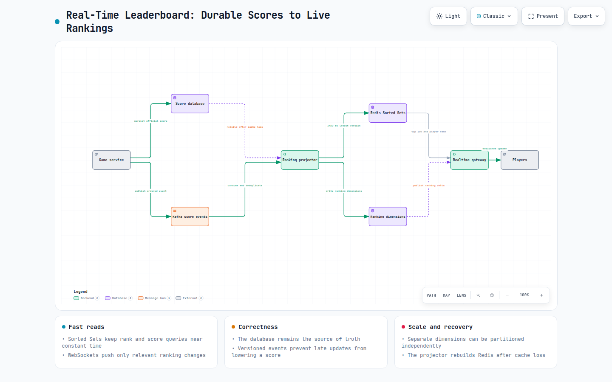

# System Design Interview — Real-Time Leaderboard for Millions of Users

Leaderboards look deceptively simple.

Every player has a score.

Sort everyone by score.

Display the top players.

Done.

Until your game suddenly has:

- 50 million registered players
- 2 million concurrent users
- Hundreds of thousands of score updates every second

Now imagine every kill, every race, every quest, and every tournament updates a player’s score.

Players expect to see the leaderboard update almost instantly.

How do you continuously update rankings without sorting millions of rows every second?

This isn’t a database problem.

It’s a data structure problem.

Let’s walk through how this discussion unfolds in a Staff Engineer interview.


## The Question

**Aadvik:** Imagine we’re building an online gaming platform.

Millions of players are earning points every second.

Players expect the leaderboard to update in real time.

How would you design such a system?

**Unnati:** Before jumping into technologies, I’d first clarify what “real-time” actually means.

Do we mean:

- updates within milliseconds?
- within one second?
- within five seconds?

Because that answer changes the architecture significantly.

**Aadvik:** Fair point.

Let’s assume users expect to see rankings update almost instantly.

**Unnati:** Then my next question is:

Do users always need the entire leaderboard?

Or do they usually need:

- Top 100 players
- Their own rank
- Nearby players

Most applications don’t display 50 million rows.

**Aadvik:** Let’s assume we need:

- Top 100 globally
- A player’s own rank
- Ten players above and below them

**Unnati:** Perfect.

That dramatically changes the solution.

## The Naive Solution

**Aadvik:** Suppose I store scores in MySQL.

Whenever someone scores points, I update the score.

When someone opens the leaderboard:

```c
SELECT *
FROM player_score
ORDER BY score DESC;
```

Would that work?

**Unnati:** For a few thousand players?

Yes.

For millions?

Absolutely not.

**Aadvik:** Why?

**Unnati:** Because every score update changes the ordering.

Imagine:

```c
2 Million Score Updates / Second
```

Now imagine continuously executing:

```c
ORDER BY score DESC
```

over tens of millions of rows.

The database spends more time sorting than serving requests.

## The First Observation

**Aadvik:** So what’s wrong with using a relational database?

**Unnati:** Relational databases are optimized for persistence.

Leaderboards require continuous ranking.

Those are different workloads.

## Which Data Structure?

**Aadvik:** So what would you use instead?

**Unnati:** I’d immediately think about sorted data structures.

Redis Sorted Sets are an excellent fit.

**Aadvik:** Why?

**Unnati:** Because Redis stores:

```c
Member
Score
```

and automatically maintains ordering.

Example:

```c
Player-A -> 9800
Player-B -> 10200
Player-C -> 9950
```

Whenever a score changes:

```c
A
```

Redis automatically updates the ranking.

No manual sorting required.


## How Does Ranking Work?

**Aadvik:** How would you fetch the top players?

**Unnati:** Redis already maintains sorted order.

For example:

```c
ZREVRANGE leaderboard 0 99 WITHSCORES
```

returns:

```c
Top 100 Players
```

without scanning the entire dataset.

**Aadvik:** What about a player’s rank?

**Unnati:**

```c
ZREVRANK leaderboard Player-123
```

returns:

```c
Rank = 157
```

Again, without sorting millions of records.

## The Interview Trap

**Aadvik:** Great.

Let’s ship it.

**Unnati:** Not yet.

**Aadvik:** What’s missing?

**Unnati:** Durability.

Redis is fast.

But it shouldn’t be our only source of truth.

If Redis crashes, we’ve lost the leaderboard.

## Source of Truth

**Aadvik:** So where should scores live?

**Unnati:** I’d separate:

Persistent storage

from

Serving storage.


The database stores official scores.

Redis stores rankings optimized for fast reads.

## Why Kafka?

**Aadvik:** Why introduce Kafka?

Why not update Redis directly?

**Unnati:** Coupling.

The Game Service shouldn’t depend on leaderboard availability.

Suppose Redis is temporarily unavailable.

Should gameplay stop?

Definitely not.

Instead:

```c
Player Scores
↓
Kafka
↓
Leaderboard Service
```

Leaderboard updates become asynchronous.

Gameplay remains unaffected.

## Event Ordering

**Aadvik:** Suppose Player A earns:

```c
+20
```

then immediately earns:

```c
+10
```

Could Kafka process them out of order?

**Unnati:** If events for the same player land in different partitions, yes.

That’s dangerous.

**Aadvik:** Why?

**Unnati:** Imagine:

Current Score:

```c
100
```

Events:

```c
+20
```
```c
+10
```

Correct result:

```c
130
```

If processed in reverse using absolute values:

we could temporarily produce inconsistent rankings.

**Aadvik:** How would you solve it?

**Unnati:** Partition Kafka using:

```c
PlayerId
```

Now every player’s events always reach the same partition.

Kafka guarantees ordering within a partition.

## Another Interview Trap

**Aadvik:** Suppose Redis receives:

```c
Player Score = 500
```

Then receives:

```c
Player Score = 450
```

Should we blindly overwrite?

**Unnati:** No.

That indicates stale data.

I’d include:

```c
Version
or
Timestamp
```

inside every event.

Example:

```c
{
  "playerId":"123",
  "score":500,
  "version":42
}
```

Redis should ignore older updates.

## Global Leaderboards

**Aadvik:** Let’s make this larger.

Suppose we have:

- Global leaderboard
- Country leaderboard
- Friends leaderboard
- Weekly leaderboard
- Monthly leaderboard

Would you maintain one Redis Sorted Set?

**Unnati:** No.

Each ranking dimension becomes its own sorted set.

For example:

```c
leaderboard:global
leaderboard:india
leaderboard:weekly
leaderboard:friends:123
```

Each serves a different query pattern.

## Millions of Updates

**Aadvik:** Imagine:

```c
500,000 score updates/sec
```

Would Redis become a bottleneck?

**Unnati:** Eventually.

Then I’d partition leaderboards.


Sharding distributes write load.

## Real-Time Notifications

**Aadvik:** A player enters the Top 10.

How would everyone know immediately?

**Unnati:** Leaderboard updates should generate events.


Connected users receive updates through WebSockets.

No polling required.

## The Top 100 Problem

**Aadvik:** Here’s another challenge.

Millions of players are updating scores.

Do we really recompute the Top 100 every time?

**Unnati:** Fortunately, Redis Sorted Sets maintain ordering continuously.

Fetching:

```c
Top 100
```

is inexpensive.

The expensive part is writing millions of updates.

That’s why leaderboard updates should be lightweight and incremental.

## Multi-Region Gaming

**Aadvik:** Let’s say players are located across:

- India
- Europe
- US

How would you design the leaderboard?

**Unnati:** Latency becomes important.

Regional gameplay should stay local.

Global leaderboards can be computed asynchronously.


Regional leaderboards remain highly responsive.

Global rankings eventually converge.

## The Real Production Architecture

**Aadvik:** If you were designing this for production, what would your architecture look like?

**Unnati:**


Each component has a clear responsibility.

- Game Servers generate score events.
- Kafka absorbs spikes.
- Leaderboard Service computes rankings.
- Redis provides ultra-fast reads.
- WebSockets push updates instantly.

## Final Question

**Aadvik:** Summarize your solution.

**Unnati:**

1. Keep the database as the source of truth.
2. Publish score updates asynchronously.
3. Partition Kafka by PlayerId to preserve ordering.
4. Use Redis Sorted Sets for ranking.
5. Maintain separate leaderboards for different dimensions.
6. Ignore stale updates using versions or timestamps.
7. Scale Redis through sharding.
8. Push leaderboard changes using WebSockets instead of polling.
9. Design assuming millions of writes and reads happen simultaneously.

The challenge isn’t calculating rankings.

The challenge is continuously maintaining accurate rankings while hundreds of thousands of score updates are arriving every second.

That’s why large-scale gaming platforms separate persistence, event processing, ranking, and real-time delivery into dedicated components.

## Archify diagrams



> **Interactive Archify diagram**: [Real-time leaderboard architecture](resources/real-time-leaderboard-design/leaderboard-architecture.html)

## Lets Conclude

Most engineers think a leaderboard is just:

```c
ORDER BY score DESC
```

At scale, it becomes a distributed systems problem involving:

- Event streaming
- Ordering guarantees
- Real-time data structures
- Sharding
- Caching
- WebSockets
- Eventual consistency

The leaderboard isn’t difficult because of the ranking algorithm.

It’s difficult because millions of players expect those rankings to update instantly without ever noticing the complexity happening behind the scenes.
