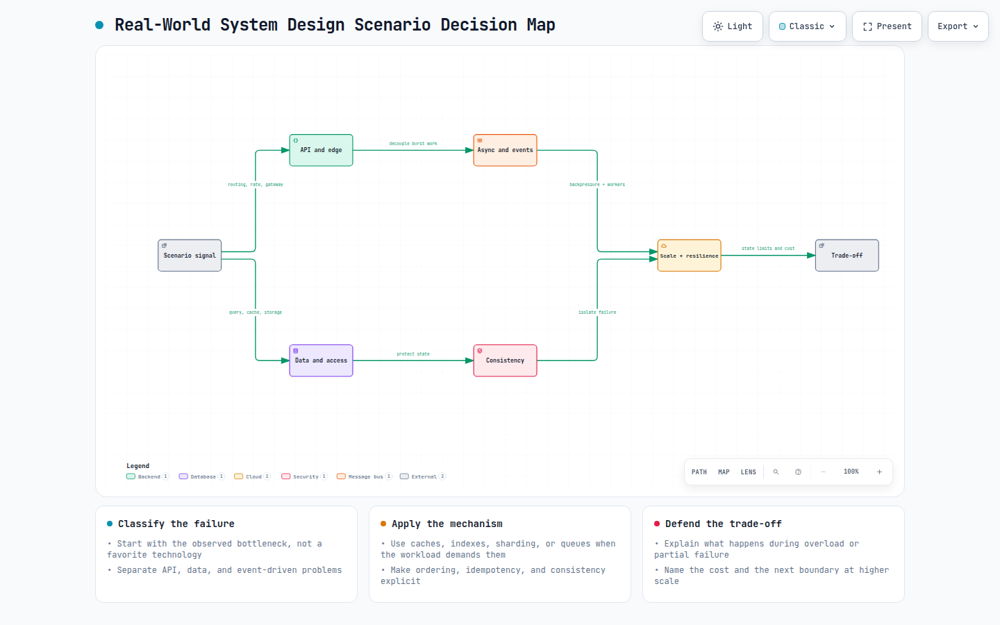

# 60+ Real-World System Design Scenarios to Prepare for Your Next Interview (Part 1)

## 30 practical architecture problems covering APIs, databases, caching, queues, payments, reliability, and scaling.


System design interviews can feel confusing at first. You may understand databases, APIs, caching, queues, and load balancers individually but the real challenge begins when an interviewer gives you a practical situation:

> *“How would you design this system?”*

Suddenly, you need to think about scale, performance, reliability, security, storage, and trade-offs all at the same time.

That is why scenario-based practice is one of the best ways to prepare for a system design interview. Instead of memorizing definitions, you learn how to apply system design concepts to real problems. You start understanding why one database might be better than another, when caching is useful, where a message queue is needed, and how a system should behave when millions of users arrive at once.

This story is based on the excellent work of [**Joud Awad**](https://www.linkedin.com/in/joud-awad/), the author who created this collection of system design questions and explanations. If you’d like to learn more system design concepts like these, you can also follow [***Joud Awad’s YouTube channel***](https://www.youtube.com/@system-design-lab) for practical explanations and more helpful content.

***The resource contains:***

**Contents:** 60 questions and 240 explanations  
**Format:** Attempt the question first, then turn the page to study the complete breakdown.

In this story, I will walk through more than 60 scenario-based system design questions in a beginner-friendly and practical way.

The goal is not simply to give you answers. The goal is to help you develop the thinking process required to break down a problem, ask the right questions, compare possible solutions, identify trade-offs, and confidently explain your design during an interview. So, before reading each explanation, pause for a moment and try to solve the scenario yourself.

Take a notebook, draw a simple architecture, write down your assumptions, and think about what could fail. Then compare your approach with the breakdown. That is where the real learning begins.

Let’s get started.

> **IMP Note** : This story is **Part 1 of a two-part system design series**. To keep the article practical and comfortable to read, I have divided the complete collection into two parts:  
> **Part 2:** 30 more scenario-based system design questions and breakdowns (**Coming Soon)**

## Archify diagrams



> **Interactive Archify diagram**: [Real-world system design scenario decision map](resources/real-world-system-design-scenarios-part-1/scenario-family-decision-map.html)

## 1\. Decoupling a Mobile App from Backend Services


Your mobile app currently communicates directly with three backend services:

```text
Mobile → UserService
Mobile → OrderService
Mobile → PaymentService
```

A fourth service, ***NotificationService***, will be released next sprint.

Every new service means another domain to configure, another authentication flow to handle, and another error format for the mobile team to support. The client is now doing routing work that should belong to the backend.

## What would you do?

**A. Add an API Gateway:** Create one entry point and hide all services behind a single domain.

**B. Build a BFF:** Add a backend layer designed specifically for the mobile application.

**C. Add a Load Balancer:** Use one IP address and distribute traffic between services.

**D. Use GraphQL Federation:** Combine all services under one unified GraphQL schema.

### Correct Answer: A Add an API Gateway


An API Gateway gives the mobile application one stable entry point:

```text
api.yourapp.com/users
api.yourapp.com/orders
api.yourapp.com/payments
```

The gateway handles routing and forwards each request to the correct service. When ***NotificationService*** arrives, the backend team only adds:

```text
api.yourapp.com/notifications
```

The mobile app requires no infrastructure-level changes.

The gateway can also centralize authentication, authorization, rate limiting, logging, TLS termination, API versioning, and consistent error responses.

This reduces client-to-service coupling and allows backend services to change without constantly affecting the mobile team.

### Why B Is the Trap Answer

A Backend for Frontend is useful when mobile and web clients need different payloads or client-specific data aggregation. However, the main problem here is not the shape of the data. It is the growing number of service domains and direct client connections. A BFF could work, but it would introduce another service that must be developed, deployed, secured, and maintained. That is unnecessary for this problem.

### Why C Is Wrong

A load balancer distributes traffic across multiple instances of the same service. It does not normally decide that `/users` should go to `UserService` while `/orders` should go to `OrderService`. That is service routing, which is the responsibility of an API Gateway.

### Why D Is Wrong

GraphQL Federation solves schema unification across GraphQL services. Using it here would require a much larger migration, including new schemas, subgraphs, a federation gateway, and client-side changes. It is an overly complex solution for a routing and coupling problem that an API Gateway can solve directly.

### Interview Takeaway

*Choose the technology that solves the actual problem not the most advanced option. Here, the problem is direct coupling between the mobile application and multiple backend services. An API Gateway provides the simplest and most appropriate solution.*

## 2\. Killing the N+1 Query Problem


Your `/orders` endpoint returns 50 orders, but the P95 latency is **2.4 seconds**. The database looks healthy. The application server is fine. Then you check the query log:

```text
1 query to fetch 50 orders
50 queries to fetch each customer
```

That is **51 queries for one request**. The ORM is lazily loading `order.customer` inside a loop a classic **N+1 query problem**.

### What would you do?

**A. Eager-load the customer relation**: Fetch orders and customers together using a JOIN.

**B. Add a DataLoader:** Batch all customer IDs into one `WHERE id IN (...)` query.

**C. Cache customers in Redis:** Read each customer from cache before querying the database.

**D. Denormalize customer data**: Store `customer_name` directly in the orders table.

### Correct Answer: (A) Eager-Load the Relation


Fetch the customer relation in the original query:

```text
const orders = await prisma.order.findMany({
  include: {
    customer: true,
  },
});
```

The ORM can now retrieve the orders and their customers in one database round trip instead of running 50 additional queries.

***The same option exists in most ORMs:***

```text
Prisma   → include
Sequelize → include
TypeORM  → relation
```

The simplest fix for an N+1 problem is usually to remove the lazy-loaded relation.

### Why B Is the Trap

DataLoader is valuable in GraphQL, where many nested resolvers may request the same records. But this endpoint has one list and one predictable relation. A JOIN is simpler, faster, and easier to maintain.

### Why C Is Wrong

Redis may reduce database traffic, but it does not fix the query pattern. You may still perform 50 cache lookups and must now handle cache expiration, misses, and invalidation whenever customer data changes. Caching is a scaling strategy not the first solution for N+1 queries.

### Why D Is Risky

Denormalization can improve reads by storing customer data directly in the order row. However, duplicated data must be updated everywhere when the customer changes their name. This creates write amplification and consistency problems. Use denormalization only when JOINs cannot meet your latency requirements at your actual scale.

### Interview Takeaway

When an ORM creates one query per record, first check for lazy-loaded relationships.

***Fix the query pattern before adding caching, batching, or duplicated data****.*

## 3\. Rate Limiting Without Boundary Bursts


Your SaaS API allows each API key to send **100 requests per minute** to:

```text
POST /v1/messages
```

But the current limiter resets its counter at every minute boundary:

```text
12:59:58 → 90 requests
13:00:00 → counter resets
13:00:02 → 90 more requests
```

Both bursts pass, allowing **180 requests in four seconds** and overwhelming the downstream database.

### What would you choose?

**A. Fixed Window:** Maintain one counter for each API key per minute.

**B. Sliding Window Log**: Store every request timestamp and count requests from the previous 60 seconds.

**C. Token Bucket**: Give each key 100 tokens and refill them gradually at roughly 1.66 tokens per second.

**D. Leaky Bucket:** Queue requests and process them at a constant rate.

### Correct Answer: (C)Token Bucket


Each API key receives a bucket containing 100 tokens. Every request consumes one token, while tokens refill continuously:

```text
Refill rate = 100 ÷ 60 ≈ 1.66 tokens/second
```

There is no sudden reset at the start of a new minute.

After the first 90-request burst, only a small number of tokens will have returned four seconds later. Most of the second burst is therefore rejected instead of receiving a fresh 100-request allowance.

Token Bucket provides:

- Controlled short bursts
- A stable long-term request rate
- O(1) storage and checks per API key
- Straightforward distributed implementation

Token-bucket-style limiting is widely used by mature public APIs and API gateway platforms.

### Why B Is the Trap

A Sliding Window Log is highly accurate, but it stores a timestamp for every request. At a large scale, this increases Redis memory usage and can add latency during counting and cleanup.

### Why A Is Wrong

Fixed Window is the source of the problem. Because the counter resets at a fixed boundary, customers can send nearly twice their limit within a few seconds.

### Why D Is Wrong Here

Leaky Bucket processes requests at a constant rate by delaying or dropping excess traffic. That is useful when protecting a fragile downstream system, but it adds latency to valid customer bursts. For a public API, quickly rejecting excess traffic is usually better than silently delaying requests.

### Interview Takeaway

Use **Token Bucket** when you want to permit reasonable bursts while enforcing a smooth average rate without fixed-window boundary bugs.

## 4\. Preventing Duplicate Payment Charges


A user taps **“Pay $499”**, but the request appears stuck. They tap again and once more.

```text
Mobile → POST /payments
{ orderId: "ord_8821", amount: 499 }
```

Three nearly identical requests reach the Payments API within four seconds. Multiple requests succeed, charging the customer more than once.

### What would you do?

**A. Add a unique constraint** on `(orderId, amount)` in the payments table.

**B. Require an** `**Idempotency-Key**` and return the original result for repeated requests.

**C. Add a distributed Redis lock** using `orderId` so only one request runs at a time.

**D. Use a** `**SERIALIZABLE**` **database transaction** around the charge and database write.

### Correct Answer: (B) Use an Idempotency Key


The client generates a unique key before the first attempt and reuses it for every retry of the same payment:

```text
Idempotency-Key: 7f3e-...
```

The server processes the payment once and stores:

```text
Idempotency key → Status code + Response body
```

When the same key arrives again, the server returns the stored response without charging the customer again. If another request with the same key arrives while the first is still processing, it should wait or receive a conflict response never start a second charge. For stronger protection, persist the key durably and pass the same idempotency key to the payment provider whenever supported. Stripe, PayPal, Shopify, and AWS expose similar idempotency mechanisms for retry-safe operations.

### Why A Is the Trap

A unique constraint may prevent a duplicate database row, but it cannot undo an external payment charge. Request two might charge Stripe successfully and only then fail while inserting the duplicate row. Your database looks correct, but the customer was still charged twice. Use the constraint as an additional safeguard, not the primary solution.

### Why C Is Wrong

A distributed lock prevents requests from running concurrently, but not from repeating later. If the first payment succeeds and its response is lost, the client may retry after the lock has expired and the payment could run again. Locks prevent simultaneous execution. Idempotency prevents repeated execution across time.

### Why D Is Wrong

A database transaction protects database operations, not external side effects. The transaction may roll back, but the request already sent to the payment provider cannot be rolled back with it.

### Interview Takeaway

For payment creation and other retryable write operations: ***Give every logical operation a durable idempotency key, execute it once, and replay the original response for retries.***

## 5\. Choosing a Database Sharding Strategy


Your PostgreSQL `orders` table has crossed **500 million rows**, and range queries that once took 40ms now take more than 800ms. Vertical scaling is no longer enough.

### Workload

```text
500M orders, growing by 3M per week
80% reads → One customer’s recent orders
15% reads → Analytics across date ranges
5% writes → Around 400 RPS, doubling on sale days
```

### Which sharding strategy would you choose?

**A. Hash sharding on** `**order_id**`: Evenly distribute orders across shards.

**B. Range sharding on** `**created_at**` Keep nearby time ranges together.

**C. Directory-based sharding**: Maintain a mapping from each customer to a specific shard.

**D. Consistent hashing with virtual nodes:** Make shard additions and rebalancing easier.

### Correct Answer: (C) Directory-Based Sharding

Because 80% of reads are customer-specific, all orders belonging to one customer should live on the same shard.

```text
customer_id → shard_id
```

A customer lookup reaches one shard instead of searching every shard. The mapping can be stored in a durable table and cached for faster routing. Directory-based sharding also supports targeted rebalancing. When one shard becomes overloaded, heavy customers can be moved individually without redistributing the entire dataset. The trade-off is that date-range analytics may still require queries across multiple shards.

### Why A Is the Trap

Hashing by `order_id` distributes rows evenly, but one customer’s orders may land on several shards. A simple customer history request becomes a scatter-gather query, and its latency depends on the slowest shard.

### Why B Is Wrong

Sharding by `created_at` sends every new order to the newest shard. That shard receives nearly all writes and most recent-order reads, creating a predictable hotspot during major sales.

### Why D Is Not the Best Fit

Consistent hashing simplifies general rebalancing, but offers less control over individual high-traffic customers. Several large customers could still overload the same shard, and moving only those customers becomes difficult.

### Interview Takeaway

Choose the shard key according to the dominant access pattern.

*Since most requests retrieve orders by customer, route and store each customer’s data on one shard.*

## 6\. Safe Distributed Locks for Cron Jobs


Your scheduler runs on three application instances. Every five minutes, all three try to execute the same `generate-daily-report` job. A Redis lock appears to solve it:

```text
SET job:daily-report locked NX EX 300
```

Only one instance acquires the lock but failures create a dangerous edge case. A process may pause or crash, the TTL may expire, and another instance may acquire the lock while the original process still believes it owns it. Now both can write to the same output.

### What would you choose?

**A. Redis** `**SETNX**` **with a short TTL and fencing token**: Every lock acquisition receives an increasing token that downstream systems validate.

**B. Redlock:** Acquire the lock across five independent Redis nodes and require a majority.

**C. Database pessimistic lock:** Hold `SELECT ... FOR UPDATE` during the job.

**D. Optimistic concurrency:** Let every instance run and use a unique database key to reject duplicates.

### Correct Answer: (A) Lock with a Fencing Token


A distributed lock alone cannot guarantee that an old lock holder has stopped working.

Each successful acquisition should therefore receive a monotonically increasing fencing token:

```text
Instance A → token 42
Instance C → token 43
```

The database, storage service, or output queue remembers the highest token accepted. If instance A resumes after losing its lock and attempts to write with token `42`, the downstream resource rejects it because token `43` has already taken ownership.

The important idea is:

***The protected resource must verify ownership not simply trust the lock holder.***

This approach protects against crashes, network partitions, long garbage-collection pauses, and expired leases. Fencing tokens are also discussed in systems such as Google’s Chubby and Martin Kleppmann’s work on distributed locking.

### Why B Is the Trap

Redlock uses multiple Redis nodes, but without fencing tokens, a paused process may still continue writing after losing ownership. More Redis nodes do not solve the stale-owner problem by themselves.

### Why C Is Wrong Here

`SELECT ... FOR UPDATE` automatically releases the lock when the transaction or connection ends. However, holding a database transaction open during a long report involving external APIs or object storage can block rows, consume connections, and place unnecessary pressure on the primary database.

### Why D Is Not Enough

Optimistic concurrency works well when the entire operation is one idempotent database write.

A report job may perform expensive computation, upload files, send notifications, and call external services before the final insert. Allowing every instance to run still duplicates those side effects and costs.

### Interview Takeaway

For long-running distributed jobs, use a lease with a **fencing token**, and require every protected write to validate that token. A lock decides who may start. The fencing token prevents an expired owner from continuing safely.

## 7\. Preserving Event Order in a Message Queue


Your Order Service publishes three events:

```text
order.created → order.paid → order.cancelled
```

The events enter a standard SQS queue and are processed by five workers. Although they were published in the correct order, different workers processed them in parallel. `order.cancelled` ran first, and the state machine later rejected `order.created`, leaving incorrect data.

### What would you choose?

**A. Use SQS FIFO with** `**MessageGroupId = order_id : **`Preserve ordering independently for every order.

**B. Add sequence numbers and a consumer-side reorder buffer**: Hold later events until missing earlier events arrive.

**C. Replace the event flow with a Saga:** Make every step wait for confirmation from the previous one.

**D. Add event versions and make the state machine order-agnostic:** Reject stale transitions regardless of arrival order.

### Correct Answer: (A) SQS FIFO with a Message Group per Order


You need ordering **within each order**, not across the entire queue.

```text
MessageGroupId = order_id
```

Messages belonging to the same order are delivered in sequence:

```text
created → paid → cancelled
```

Different orders still use different group IDs, allowing the five workers to process them concurrently. This provides the required ordering without sacrificing system-wide parallelism.

### Why B Is the Trap

A reorder buffer requires sequence tracking, timeouts, missing-event handling, crash recovery, monitoring, and durable storage. You would effectively rebuild FIFO ordering inside your application and own every failure case.

### Why C Is Wrong

A Saga coordinates long-running transactions across multiple services using compensating actions. This scenario involves ordered events for one entity, not a distributed transaction. A Saga would add unnecessary coupling and complexity.

### Why D Is Not Enough

Versioning can reject stale events, but it does not reconstruct missing earlier transitions. If `cancelled` arrives first, the system may still end with a cancelled order that was never recorded as created. Solving that properly would require a more extensive event-sourcing design.

### Interview Takeaway

When events must remain ordered for each entity, partition them by that entity’s identifier. *Use an SQS FIFO queue with* `*order_id*` *as the* `*MessageGroupId*` *to preserve per-order ordering while keeping different orders parallel.*

## 8\. Keeping Cache and Database in Sync


Your e-commerce catalog uses Redis in front of PostgreSQL and handles around **40K requests per second** at peak.

Staging looks perfect:

```text
Cache hit ratio → 94%
Response time → Under 20ms
```

But after launching to production, customers begin seeing outdated prices, incorrect stock counts, and unavailable products marked as available.

### Current Architecture

```text
Node.js App → Redis Cache → PostgreSQL
```

Multiple systems update product data:

- Admin panel updates prices
- Inventory Service decreases stock
- Order Service processes purchases

### What would you choose?

**A. Write-through**: Update Redis and PostgreSQL during every write.

**B. Write-behind:** Write to Redis first and asynchronously flush changes to PostgreSQL.

**C. Cache-aside**: Update PostgreSQL, delete the related cache key, and let the next read repopulate it.

**D. Read-through**: Redis automatically loads missing data from PostgreSQL.

### Correct Answer: (C) Cache-Aside


Each service updates PostgreSQL first and then invalidates the related Redis key:

```text
Update PostgreSQL
        ↓
DEL product:123
        ↓
Next read misses the cache
        ↓
Fetch fresh data and repopulate Redis
```

PostgreSQL remains the source of truth, while Redis stays a disposable read accelerator. If Redis becomes unavailable, the application can still read from PostgreSQL slower, but with correct data. Cache-aside is commonly used in production architectures, including patterns associated with Shopify, Etsy, and AWS reference designs.

### Why A Is the Trap

Redis and PostgreSQL cannot be updated in one normal atomic transaction. If the database update succeeds but the Redis update fails, the stale cache remains. Write-through also makes every writer dependent on Redis, meaning a cache outage could affect the entire write path.

### Why B Is Wrong

Write-behind makes Redis the temporary source of truth and sends updates to PostgreSQL later. A Redis failure, persistence delay, or memory issue could lose recent price or inventory updates. That risk is unacceptable when real purchases are involved.

### Why D Is Not Enough

Read-through only handles cache misses. It does not automatically know when the admin panel, Inventory Service, or Order Service changes PostgreSQL. You would still need explicit invalidation, which effectively brings you back to cache-aside.

### Interview Takeaway

When several services write to the same database:

*Keep the database as the source of truth, invalidate the cache after successful writes, and repopulate it lazily on the next read.*

## 9\. Splitting Read and Write Data Models


Your Orders Service uses one PostgreSQL database for:

```text
8K writes per minute
40K reads per minute
```

The write side needs normalized tables such as:

```text
orders
line_items
payments
shipments
addresses
```

But the read side needs something completely different. Rendering one dashboard card requires seven joins, while reporting queries push CPU usage to 85%.

Indexes and caching are already optimized. The real issue is that reads and writes need different data shapes.

### What would you choose?

**A. Full CQRS**: Keep separate write and read models, projecting changes into a denormalized read store.

**B. Add read replicas:** Send dashboards and reports to replicas while writes remain on the primary.

**C. Denormalize the write schema:** Flatten related data directly into the orders table.

**D. Add GraphQL and DataLoader**: Batch application-layer reads without changing the database.

### Correct Answer: (A) CQRS


CQRS separates the models used for commands and queries. The write side remains normalized and strongly consistent:

```text
orders → line_items → payments → shipments
```

The read side becomes a projection optimized for fast queries:

```text
order_view
```

One dashboard card can now be loaded from a single denormalized record instead of joining seven tables.

Changes can flow through:

```text
Write DB
   ↓
Transactional Outbox or CDC
   ↓
Kafka
   ↓
Read-model projector
   ↓
Postgres read DB or Elasticsearch
```

The trade-off is eventual consistency. Most dashboards, reports, and searches can tolerate a small delay. Operations requiring immediate consistency can still read directly from the write database.

### Why B Is the Trap

Read replicas reduce pressure on the primary, but they do not remove expensive joins. The same seven-table query still runs just on another machine. This helps when the query structure is acceptable but traffic is too high, not when the read model itself is wrong.

### Why C Is Wrong

Denormalizing the write model improves reads but damages the write path. Updates create duplicated data, write amplification, difficult migrations, and consistency risks. The transactional model should not be reshaped only to satisfy dashboards.

### Why D Is Wrong

GraphQL and DataLoader can reduce application-level N+1 requests. They cannot eliminate expensive joins already happening inside PostgreSQL. This is a database-model problem, not a client-query problem.

### Interview Takeaway

When reads and writes require fundamentally different structures:

*Keep a normalized transactional model for writes and build a separate denormalized projection for reads.*

## 10\. Distributed Transactions Across Services


Order `#4471` moves through four services:

```text
Order created ✅
Payment charged ✅
Inventory reservation failed ❌
Shipping never started
```

The customer has paid, but there is no inventory available. Unlike a monolith, you cannot roll back four independent services and databases with one transaction.

### What would you choose?

**A. Choreography Saga**: Services publish events and trigger compensating events when something fails.

**B. Orchestration Saga**: A central workflow coordinates every step and runs compensating actions on failure.

**C. Two-Phase Commit:** Lock all participating systems and commit or abort together.

**D. Outbox with eventual consistency:** Persist local changes and reliably publish events afterward.

### Correct Answer: (B) Orchestration Saga


A checkout has a clear sequence and specific rollback actions:

```text
Create Order
   ↓
Charge Payment
   ↓
Reserve Inventory
   ↓
Create Shipment
```

An orchestrator such as Temporal, AWS Step Functions, or Camunda tracks the workflow and its compensations:

```text
Inventory fails
   ↓
Refund Payment
   ↓
Cancel Order
```

The workflow state remains durable, observable, and recoverable. The team can quickly see which step failed and which compensations were executed.

### Why A Is the Trap

Choreography works well for loosely connected events, but complex checkout logic becomes spread across several services. As the number of steps and failure paths grows, it becomes difficult to understand who owns the workflow and what state the transaction is currently in.

### Why C Is Wrong

Two-Phase Commit requires every participant to support the protocol. External services such as Stripe and shipping providers do not participate in database-style 2PC. It can also hold locks while waiting for slow services, creating serious availability and scalability problems.

### Why D Is Not Enough

The Outbox Pattern ensures that an event is published reliably after a local database transaction. However, it does not define workflow order or compensation logic. It may support the saga, but it does not replace it.

### Interview Takeaway

For an ordered multi-service workflow with clear rollback actions:

*Use an orchestration-based Saga to coordinate steps and execute compensations when something fails.*

## 11\. Handling Webhook Retries Idempotently


Stripe has just sent a `charge.succeeded` webhook to your server. At the same moment, one of your pods is restarting. The webhook request times out, so Stripe schedules a retry. Now the original request and the retry may be processed at the same time.

### Here’s the setup

Your NestJS API runs on ECS with four tasks behind an Application Load Balancer. Stripe sends `charge.succeeded` events to:

```text
POST /webhooks/stripe
```

Your endpoint has roughly 10 seconds to return a successful `200` response. If it takes longer, Stripe treats the delivery as failed and queues another attempt. During Black Friday, the system handles around:

```text
80 webhooks per second
```

Three failure cases are already happening in production.

### Failure 1: A pod restarts during deployment

A pod receives the webhook but restarts before completing the request. Stripe does not receive a response, so it retries the event. Another pod processes the retry, while the first pod may have already processed the original event.

The result is a duplicate payment confirmation email.

### Failure 2: The database becomes slow

At peak traffic, the database slows down and the webhook handler takes 12 seconds. Stripe times out and retries the event. The first request is still running, so two pods may now process the same webhook at the same time.

### Failure 3: Related events arrive out of order

Stripe sends:

```text
charge.succeeded
charge.refunded
```

only 200 milliseconds apart.

Your queue delivers `charge.refunded` first, so the order is correctly marked as refunded. Later, `charge.succeeded` is processed, and the order is incorrectly changed back to `PAID` after the refund has already happened. The current handler is only 30 lines long and behaves correctly 99% of the time. Unfortunately, the remaining 1% is causing serious production problems.

### What would you do?

**A. Idempotency key with a deduplication table**: Store every event ID when it arrives and skip the event if that ID has already been seen.

**B. Retry with exponential backoff and a dead-letter queue**: Keep retrying failed webhooks and move permanently failing events to a DLQ.

**C. Verify the signature, return** `**200**` **immediately, and push the event to an internal queue**: Separate webhook receipt from webhook processing.

**D. Add sequence numbers and a reorder buffer:** Hold out-of-order events until the earlier event arrives, then process them in strict order.

### Correct Answer: (C)Verify the Signature, Return 200, and Queue the Event


The core problem is that Stripe’s delivery deadline and your internal processing time are tied together. Stripe gives your endpoint around 10 seconds to acknowledge the webhook. Database updates, fraud checks, email delivery, and other business logic should not run inside that limited window.

The safer pattern is:

```text
Verify the HMAC signature
        ↓
Write the raw payload to SQS, Kafka, or Redis Streams
        ↓
Return 200 immediately
```

Signature validation should take only a few milliseconds. Once the event is safely stored in a durable queue, the webhook endpoint can return a successful response without waiting for the rest of the system. Your response time now depends mainly on network latency and signature verification not on database speed, email delivery, or downstream services.

If a pod restarts during processing, the message remains in the queue and another worker can pick it up. If the database is slow, the webhook receiver is unaffected because it may have already returned `200` in around 8 milliseconds. This is the pattern Stripe, Shopify, and GitHub recommend in their webhook documentation.

### Why A Is the Trap Answer: Idempotency Key and Deduplication Table

This answer is not wrong. It is simply incomplete. Stripe may deliver the same event ID more than once, so idempotent processing is essential. A common solution is to create a deduplication table keyed by:

```text
event.id
```

and protect it with a unique constraint. When a worker receives an event, it checks whether that event ID has already been processed. If it has, the worker skips the event.

But this does not solve the original architectural problem. The webhook handler is still synchronous. It is still running on Stripe’s critical 10-second path, and it can still be interrupted by a pod restart while writing to the database.

If you implement only option A, you may prevent duplicate processing, but the endpoint can still time out. Stripe will still retry, and the system will continue creating the conditions that cause these races.

Idempotency is a property the handler needs. It is not the complete architecture. Option C provides the architecture, while option A should exist inside the asynchronous processing flow.

The trap is treating idempotency as the entire solution when it is only one of the required layers.

### Why B Is Wrong as the Main Answer: Retry and Dead-Letter Queue

Stripe already retries failed webhook deliveries using exponential backoff. That retry responsibility belongs to the provider. Stripe may continue retrying failed webhooks for up to three days. You do not need to build another retry system for the incoming webhook request because doing so would duplicate behavior Stripe already provides.

Retries and a dead-letter queue are useful after the event has entered your internal queue. For example, if a worker fails to process a queued event, you can retry it several times and move it to a DLQ after the maximum number of attempts. That is a downstream processing concern.

Adding retry logic directly to the webhook receiver mixes two separate concepts:

```text
Provider retries for webhook delivery
Internal retries for queued-event processing
```

Option B belongs inside the architecture created by option C, but it is not the main answer.

### Why D Is Wrong: Sequence Numbers and a Reorder Buffer

A reorder buffer sounds like a strong solution, especially after you have experienced out-of-order processing. The idea is to hold later events until the earlier sequence number arrives.

The problem is that most webhook providers do not provide reliable sequence numbers. Stripe does not provide them. GitHub does not provide them either.

Even when a provider includes an event identifier, such as Shopify’s `X-Shopify-Webhook-Id`, those identifiers do not form a continuous sequence. You cannot reliably determine whether “event 47” is missing or whether no such event was ever meant to exist. More importantly, webhook ordering should not be handled only at the receiver. It should be handled at the domain level.

When processing `charge.refunded`, the application should check the current order state before applying the transition. If the order is already marked as refunded, the operation should do nothing. The same rule protects the system when a late `charge.succeeded` event arrives. It should not move an already refunded order back to `PAID`. A state machine is more reliable than a reorder buffer because it handles both cases:

```text
Events arrive out of order
An expected event never arrives
```

A reorder buffer may wait forever when an event is dropped upstream. A state-aware transition can still protect the final business state.

### Interview Takeaway

The correct architecture is to keep the public webhook endpoint fast:

```text
Verify signature
        ↓
Store the event in a durable internal queue
        ↓
Return 200 immediately
        ↓
Process the event asynchronously
```

The asynchronous worker should still use idempotency, internal retries, a dead-letter queue, and domain-level state validation.

*The webhook receiver should acknowledge quickly. The worker should handle the complexity safely.*

## 12\. Indexing a High-Ingest Table


Your PostgreSQL 15 `events` table has just crossed **200 million rows**. A Kafka consumer is inserting around **8,000 records per second**. P99 write latency used to stay near 12ms, but it has now climbed to 140ms and it is still getting worse. At the same time, the dashboard team is struggling with slow queries. Their main query filters by:

```text
tenant_id
event_type
created_at
```

Without a suitable index, PostgreSQL scans nearly 40 million rows for every request. The dashboard team wants another index immediately.

But there is a problem. You check `pg_stat_user_indexes` and discover that the table already has four indexes. Every new insert must update all four of them. Adding a fifth full-table index could push the system from ingestion lag into complete ingestion failure.

Then you study the query pattern more carefully:

***Around 92% of dashboard requests ask for one tenant’s signup events from the last seven days.***

That query touches only a very small portion of the entire table.

### What would you choose?

**A. Add a composite B-tree index**

Create an index on:

```text
(tenant_id, event_type, created_at)
```

This is the standard solution and directly supports the dashboard query.

**B. Add a covering index**

Use the same indexed columns, but include `user_id` and `payload` so PostgreSQL can use an index-only scan without reading the main table.

**C. Stop adding indexes to the primary**

Create a read replica and send dashboard traffic there while keeping the primary database optimized for writes.

**D. Add a partial index**

Index the same columns, but only for recent signup events:

```text
WHERE event_type = 'signup'
AND created_at > now() - interval '7 days'
```

Only the small, frequently queried portion of the table is indexed.

### Correct Answer: (D) Add a Partial Index


A partial index stores only rows that satisfy its `WHERE` condition. In this case, most dashboard requests need:

```text
One tenant
Signup events
Last seven days
```

There is no reason to index every event type across the entire 200-million-row table when almost all dashboard traffic targets this small subset. Suppose signup events represent around 4% of the incoming stream, and the most recent seven days represent about 5% of the full table.

The index would cover roughly:

```text
4% × 5% = 0.2% of all rows
```

That means most of the 8,000 writes per second would not need to update this index at all. Rows that do not match the predicate are inserted into the table normally, without paying the maintenance cost of the partial index. This removes most of the extra write amplification while still making the dashboard query much faster.

PostgreSQL’s query planner can use the partial index when the query conditions match the index predicate.

The dashboard gets the index it needs, while the ingestion pipeline avoids maintaining another large index over all 200 million rows. There is one known limitation: if the dashboard team later changes the requirement from seven days to thirty days, the index may need to be rebuilt or redesigned.

But that is a visible and manageable trade-off, not a hidden performance cost affecting every write.

### Why B Is the Trap: Covering Index with INCLUDE

A covering index can look extremely attractive when you inspect the query plan. By including all required columns inside the index, PostgreSQL may answer the query using an index-only scan instead of reading the main table.

For example:

```text
INCLUDE (user_id, payload)
```

The problem is the size of the included data. The `payload` column is likely a JSONB object that may contain several kilobytes of data. Every new event would now require PostgreSQL to:

```text
Write the full row to the table
        +
Write a large index entry containing the payload
```

If `user_id` or `payload` changes, PostgreSQL must also rewrite the related index entry. Instead of reducing write cost, this design significantly increases it. On a table already receiving 8,000 writes per second and maintaining four indexes, adding a large covering index could push P99 write latency from 140ms toward 800ms. `INCLUDE` works well when the additional columns are small and the table is mostly read-heavy.

This table is neither of those things.

### Why A Is Wrong: Full Composite B-Tree

A full composite index on:

```text
(tenant_id, event_type, created_at)
```

would certainly improve the dashboard query. But it would also index every row written to the table, regardless of tenant, event type, or date. Every one of the 8,000 inserts per second would have to update this new index. You would be paying the full storage and write-maintenance cost across the entire dataset to optimize a query pattern that touches only about 0.2% of the rows. The query becomes faster, but the ingestion pipeline becomes slower. That is the wrong trade-off for a high-write table.

### Why C Is Wrong: Read Replica

A read replica can reduce query traffic on the primary database, but it does not eliminate index-maintenance work.

The required index still needs to exist somewhere. If you create the index on the primary, every insert continues paying the same index-update cost. If you maintain the index on the replica, that replica must replay the primary’s WAL changes while also updating its indexes. Under heavy ingestion, it may begin falling behind.

Read replicas solve a different problem:

***The primary cannot handle the volume of read traffic****.*

They do not solve this problem:

***The write path is becoming slow because every insert must maintain too many indexes.***

### Interview Takeaway

On a high-ingest table, do not build a full index when most queries target a tiny and predictable subset of the data.

*Use a partial index to accelerate the hot query path without making every incoming write pay the cost.*

## 13\. Managing a Shared Connection Pool


You are running three different workloads against the same PostgreSQL RDS instance.

The database has:

```text
max_connections = 300
```

Every workload needs a connection pool, but none of them can safely use the same pooling behavior.

### Current Setup

**NestJS REST API on ECS Fargate**

```text
800 requests per second
10 ECS tasks
40 connections per task
```

That means the API alone may request:

```text
10 × 40 = 400 connections
```

The API uses short transactions and releases connections quickly.

**Background workers**

These workers run long analytics queries and may hold a database connection for 30 to 90 seconds.

**AWS Lambda functions**

Lambda traffic is bursty and cold-start heavy, with anywhere from 0 to 200 concurrent invocations.

So you have:

```text
REST API
Background workers
Lambda functions
        ↓
One PostgreSQL database
        ↓
Maximum 300 connections
```

The numbers simply do not fit.

You need a pooling strategy that keeps the total connection count below the database limit without breaking any workload.

### What would you choose?

**A. PgBouncer transaction mode for everyone**: Put one PgBouncer instance in front of RDS and use maximum connection multiplexing for all clients.

**B. PgBouncer session mode for workers and transaction mode for the REST API**: Use different pool configurations depending on the workload. Route Lambda through one of them.

**C. RDS Proxy for Lambda and PgBouncer transaction mode for ECS:** Use a hybrid approach based on client type.

**D. A separate read replica for analytics workers, plus PgBouncer transaction mode for the REST API and Lambda:** Isolate analytics at the database level.

### Correct Answer: (B) Session Mode for Workers and Transaction Mode for the REST API


The main purpose of PgBouncer is connection multiplexing.

One real PostgreSQL connection can serve many client connections, but only when it is safe to return that connection to the pool after each transaction.

That is exactly how **transaction mode** works.

### Why Transaction Mode Fits the REST API

Transaction mode is a strong match for the NestJS API because its requests use short-lived transactions.

The API does not depend on long-running session state, persistent temporary tables, session-level advisory locks, or prepared statements that must survive between transactions.

Instead of opening 400 real PostgreSQL connections, the REST API can send its client connections through PgBouncer.

```text
400 requested client connections
        ↓
PgBouncer transaction pool
        ↓
Around 30–50 backend PostgreSQL connections
```

The API still handles high traffic, but the database sees only a much smaller number of active backend connections.

The connection numbers now fit within the RDS limit.

### Why Transaction Mode Does Not Fit the Workers

The analytics workers have a completely different connection pattern.

Their jobs run for 30 to 90 seconds and may depend on state that must remain attached to the same database session.

Some workers may use:

```text
Temporary tables
Session variables
SET search_path
Prepared statements
Cursors
Multiple transactions in one session
```

In transaction mode, PgBouncer returns the database connection to the pool as soon as a transaction finishes.

When the worker starts its next transaction, it may receive a completely different PostgreSQL connection.

Any session state stored on the previous connection is now gone.

At 800 requests per second from the REST API, the chance of a worker receiving the same backend connection again is extremely small.

The worker may fail silently or produce incorrect results.

### Give Workers Their Own Session Pool

The background workers should use a separate PgBouncer configuration running in **session mode**.

In session mode:

```text
One client connection
        =
One backend PostgreSQL connection
for the complete session
```

The workers receive fewer connections, but they keep those connections for as long as their jobs need them.

That is the behavior required by long-running analytics work.

### Where Lambda Fits

Lambda requests are stateless and short-lived, which makes them similar to the REST API workload. They can use the same transaction-mode pool as the API. The complete configuration becomes:

```text
REST API
Lambda
   ↓
PgBouncer transaction mode
   ↓
Shared backend connection pool
   ↓
Analytics workers
   ↓
PgBouncer session mode
   ↓
Dedicated backend connections
```

PgBouncer supports multiple pool configurations and listening ports, so one pooler can expose separate paths for these two workload types.

The final result is:

```text
API receives strong multiplexing
Workers keep stable sessions
Lambda does not create a connection storm
Total backend connections stay below 300
```

This is the practical solution that protects the database without changing how each workload behaves.

### Why A Is the Trap: Transaction Mode for Everyone

Transaction mode provides the best multiplexing, which makes it look like the obvious answer.

It works extremely well for the REST API. But it can quietly break the background workers. Suppose a worker creates a temporary table during one transaction. When that transaction ends, PgBouncer returns the connection to the shared pool.

The worker starts another transaction and receives a different backend connection. The temporary table does not exist there.

The same problem can happen with:

```text
Session variables
Prepared statements
Cursors
SET commands
Session-level settings
```

The dangerous part is that this may not fail immediately. In development, concurrency is low, so the worker may receive the same connection by chance. The same can happen in staging when traffic is light.

In production, the REST API is constantly using the pool. The worker is much less likely to receive its previous connection again. That is when the analytics job fails, often during a busy reporting period or financial close. Transaction mode is not wrong. It is simply wrong for workloads that depend on session state.

### Why C Is Wrong: RDS Proxy for Lambda and PgBouncer for ECS

RDS Proxy is a reasonable tool for Lambda. It handles cold-start connection spikes, supports IAM authentication, and integrates well with AWS networking. If the only problem were Lambda connecting to PostgreSQL, this option would be a strong answer.

But it does not solve the background worker problem.

The workers still run long queries, hold connections for 30 to 90 seconds, and may depend on session-level state. You would also introduce a second connection-pooling product that must be operated, monitored, configured, and paid for. RDS Proxy is generally more expensive than running PgBouncer, and it does not provide the same session-mode behavior needed by these workers. This option solves the easiest workload while leaving the hardest one unchanged.

### Why D Is the Senior-Engineer Trap: Move Workers to a Read Replica

Moving analytics to a read replica is a valid strategy when the goal is to isolate heavy reads from transactional traffic.

It can reduce competition for:

```text
CPU
Disk I/O
Buffer cache
Query execution resources
```

But that is not the main problem here. The problem is the number of database connections. A read replica has its own `max_connections` limit. The analytics workers will still hold connections for 30 to 90 seconds.

You have moved the connection-exhaustion problem from the primary database to the replica. You are also paying for another RDS instance without fixing the original connection-pooling design. A read replica would be the right choice if analytics queries were starving the transactional workload through CPU, I/O, or cache pressure. Here, the immediate problem is that the workloads need different connection-pooling behavior. A read replica may become useful later, after the connection pools are configured correctly and analytics still create resource contention.

### Interview Takeaway

Do not force every workload through the same pool mode.

*Use PgBouncer transaction mode for short, stateless REST and Lambda requests, and session mode for long-running workers that need stable connection state.*

## 14\. Safely Rolling Out a Risky Change


You are preparing to release a rewritten checkout write path on Friday.

The application runs on Node.js with ECS Fargate and handles around **3,000 requests per second** at peak. PostgreSQL uses row-level locking on the `orders` table.

The risky part is that this change touches the exact code responsible for charging the customer’s card.

The old flow uses Stripe’s **Charges API**. The new flow uses **PaymentIntents with 3D Secure**.

The QA environment is green. Load testing passed. Your staff engineer approved the release.

But this is checkout.

If something fails, real money is affected. More importantly, rolling back the application does not reverse a payment that has already been charged.

### Which deployment strategy would you choose?

**A. Blue/Green Deployment:** Create a parallel green environment with the new code, run smoke tests, and then switch the load balancer. Roll back by switching traffic to the old environment.

**B. Canary Deployment**: Send 1% of live traffic to the new version, monitor error rates and P99 latency for 30 minutes, and then gradually increase traffic from 5% to 25% and finally 100%.

**C. Rolling Deployment:** Replace ECS tasks one at a time. Old and new versions continue serving traffic together until the rollout finishes.

**D. Feature Flag**: Deploy the new code to every task with the flag disabled. Enable it gradually for internal users, then 1%, 10%, and finally 100% of customers, while keeping an immediate kill switch.

### Correct Answer: (D) Feature Flag


Feature flags separate **deployment** from **release**.

The new code can be deployed to 100% of ECS tasks, but it remains inactive until the flag is enabled.

This gives you much more control over how the checkout change is introduced.

### Rollback becomes a configuration change

With a feature flag, rollback does not require another deployment.

You simply disable the flag.

That can happen almost instantly, without restarting ECS tasks, waiting for load balancer draining, or dealing with DNS delays.

### You control which users receive the new path

A feature flag allows you to choose specific users or customer groups.

This is better than randomly sending a percentage of requests to the new version.

A customer making a `$0.99` payment and a business customer processing `$40,000` should not be treated as equal random traffic.

With targeted rollout, you can start with internal users, low-risk customers, or selected accounts before expanding further.

### The old flow can remain available

You can keep the previous checkout path active for days or weeks.

Suppose a 3D Secure issue appears only for a certain issuing bank in Brazil. You can move those users back to the old path while allowing everyone else to continue using the new version.

That kind of selective rollback is difficult with traditional deployment strategies.

### Why B Is the Trap: Canary Deployment

Canary deployment looks like the obvious safe option because only a small percentage of traffic reaches the new version.

But payment systems create two important problems.

### Canary routing works by request, not by customer

A single B2B billing job may send many requests in a short period.

Even with only 1% canary traffic, the same customer could hit the new version repeatedly.

If the new flow has a bug for that customer’s card type, the system may charge them many times before the monitoring dashboard shows a clear problem.

### Payment bugs may not appear as server errors

A dangerous payment failure does not always return a `500`.

The API may return `200 OK` while charging the wrong amount or processing the payment incorrectly.

Your standard error-rate alarm may remain green because, technically, the request succeeded.

That makes ordinary canary metrics less reliable for money-related changes.

### Why A Is Wrong: Blue/Green Deployment

Blue/Green provides a clean environment switch and a fast rollback path.

The problem is the cutover itself.

When you switch the load balancer, 100% of live traffic immediately moves to the new version.

At the same time, Stripe webhooks may still be arriving for PaymentIntents or Charges created by the old code path.

This creates a cross-version race condition.

The old system may create the payment, while the new system receives and processes the related webhook.

Those two versions may not interpret or store payment state in exactly the same way.

Even if you switch traffic back, the rollback cannot undo a payment that has already been charged.

### Why C Is Wrong: Rolling Deployment

During a rolling deployment, old and new ECS tasks run together for several minutes.

That means one step of checkout may be handled by version 1, while the next step is handled by version 2.

For example:

```text
Create order → v1
Confirm payment webhook 800ms later → v2
```

Now two versions that were never tested together are writing to the same order and payment state.

This can create inconsistent data, especially when the change affects the payment flow itself.

### Interview Takeaway

For a risky payment change, the safest option is to deploy the code everywhere but release it gradually through a feature flag.

*Feature flags provide targeted rollout, instant rollback, and the ability to keep the previous payment path available while the new one proves itself in production.*

## 15\. Fast “Has the User Seen This?” Checks


You are running a content recommendation feed for **50 million users**. For every recommendation, the API asks one simple question:

***Has this user already seen post X?*** Right now, every check goes to PostgreSQL. The table has already grown to **80 billion rows**, and it continues to increase:

```text
user_seen_posts(
  user_id,
  post_id,
  seen_at
)
```

The table is partitioned and indexed, but the feed endpoint’s P99 latency has still crossed **600ms**. Your DBA is now sending database CPU graphs at 2am.

### Current setup

```text
Feed Service: Node.js
Peak traffic: ~120K requests/second
Seen check: PostgreSQL SELECT for every recommendation
Table size: 80B rows and growing
```

The normal cache hit ratio is not the main issue. The problem comes from the long tail of cold lookups that still reach PostgreSQL.

The product team has also clarified the accuracy requirements:

- A false positive is acceptable. You may occasionally skip a post the user has not actually seen.
- A false negative is less desirable because the user may see the same post again, but it is still survivable.

The goal is to bring P99 latency below **100ms**, and you have one sprint to solve it.

### What would you choose?

**A. Store a Bloom filter per user in Redis**: Perform a sub-millisecond “definitely not seen” check and query PostgreSQL only when the result is “maybe seen.”

**B. Store the complete** `**user_seen_posts**` **set for each user in Redis**: Use a Redis SET for an exact answer with no false positives.

**C. Move the entire table to Cassandra**: Use a wide-column database that can handle extremely large row counts.

**D. Add a PostgreSQL read replica and connection pooler**: Keep the same data model but add more read capacity.

### Correct Answer: (A) Bloom Filter per User in Redis

A Bloom filter provides one important guarantee:

***If it says an item is not present, the item is definitely not present.***

If the Bloom filter returns **no**, the feed service can skip PostgreSQL completely. If it returns **maybe**, the service can query PostgreSQL to confirm whether the user has actually seen the post. This works especially well for the current access pattern because around **97% of feed checks are for posts the user has never seen**. For those requests, Redis can return a sub-millisecond “definitely not seen” result, and PostgreSQL is never touched.

## Why it works here

The memory requirement is much smaller than storing exact sets. For a user who has seen around 10,000 posts:

```text
Bloom filter at 1% false-positive rate → approximately 12 KB
Redis SET with the same data          → 80 KB or more
```

Across 50 million users, the difference becomes significant:

```text
Bloom filters → approximately 600 GB
Redis SETs    → approximately 4 TB
```

That memory gap is the main reason Bloom filters are a better fit at this scale.

Similar patterns appear in Medium’s “have you read this?” checks, Cassandra’s SSTable lookup short-circuiting, and Bitcoin SPV wallets.

The 1% false-positive rate means the system may occasionally believe a user has already seen a post when they have not. In that case, the post may be skipped.

The product team has already said this is acceptable.

Bloom filters do not produce false negatives. If the filter says the post has definitely not been seen, that answer is reliable. This avoids incorrectly showing the same post again because the filter missed an existing entry.

### Why B Is the Senior-Engineer Trap: Redis SET per User

A Redis SET appears better at first.

It provides:

```text
O(1) membership checks
Exact answers
No false positives
```

`SISMEMBER` is fast and widely used.

The problem is memory consumption, especially for highly active users.

A user who has seen 50,000 posts may require around **3–4 MB** in a Redis SET. When the top 5% of users reach that level, the Redis cluster can grow very quickly.

The team then has two difficult choices:

```text
Over-provision Redis → expensive
Evict active users   → defeats the purpose of the cache
```

A useful rule is:

- Use a Redis SET when the number of items per key is small, usually below 1,000, or when false positives are unacceptable.
- Use a Bloom filter when the set is large and a “probably present” result is acceptable.

### Why C Is the Right Pattern for the Wrong Problem: Move to Cassandra

Cassandra is capable of handling wide-column data and extremely large row counts.

However, storage capacity is not the main problem here.

PostgreSQL can still hold this dataset when it is properly partitioned. The real issue is the cost of performing one point lookup for every recommendation at **120K requests per second**. Moving to Cassandra would not remove that read pattern. You would still perform a lookup for every recommendation, but now you would also introduce:

```text
A multi-quarter migration
A new operational model
A new database skill set
Additional production complexity
```

That is too much work for a problem that can be reduced within one sprint using a small Bloom filter for each user. Cassandra would be more appropriate if the main bottleneck were massive write throughput or wide-row scans. It is not the best answer for this hot path of repeated point lookups.

### Why D Is Wrong: Capacity Is Not Efficiency

A read replica and connection pooler would provide more database capacity. But they would not make each lookup cheaper. The system would still perform:

```text
One database round trip
One B-tree lookup
One storage read for every check
```

Adding three replicas may provide roughly 2.5 times more read throughput before replication lag and connection limits begin creating new problems. But the requirement is to reach P99 below 100ms while handling around 120K requests per second. The better solution is not to add more databases.

It is to avoid hitting the database for the 97% of requests where the answer is simply “not seen.”

### Interview Takeaway

Do not treat every performance problem as a capacity problem.

*When most checks are negative and a small false-positive rate is acceptable, use a Bloom filter to eliminate unnecessary database lookups.*

## 16\. Taming a Hot Partition Key


You are running a multi-tenant analytics pipeline on DynamoDB. The system serves **200 tenants** and handles around **12,000 writes per second** in total. Everything works well until one tenant suddenly brings in a very large customer. Their event volume increases by 100 times overnight. Now that single tenant is generating almost **9,000 writes per second**, while the remaining 199 tenants produce only around 15 writes per second each. Soon, production starts showing:

```text
ProvisionedThroughputExceeded errors
P99 write latency: 8ms → 400ms
Repeated throttling
On-call alerts
```

One tenant is consuming most of the write capacity because every event uses the same partition key.

### Current Setup

```text
Table: events
Database: DynamoDB
Capacity mode: On-demand
Partition Key: tenant_id
Sort Key: event_timestamp
```

The traffic distribution looks like this:

```text
Hot tenant:        ~9,000 writes/second
Every other tenant: ~15 writes/second
```

All 9,000 writes from the hot tenant are being sent to one partition key.

DynamoDB uses the partition key to decide where data is physically stored. Because all events share the same `tenant_id`, one physical partition is forced to handle nearly the entire workload.

This is the classic **hot partition problem**.

### What would you choose?

**A. Write sharding**: Add a random suffix to the partition key, such as `tenant_id#0` through `tenant_id#9`.

**B. Jitter the writes:** Add a random delay between 0 and 500 milliseconds on the producer side.

**C. Partition splitting:** Increase the table capacity and allow DynamoDB to automatically split the overloaded partition.

**D. Time-bucket the key:** Change the partition key to something like `tenant_id#YYYY-MM-DD-HH`.

### Correct Answer: (A) Write Sharding


DynamoDB hashes the partition key to decide which physical partition receives a write.

With the current design:

```text
tenant_id = tenant_123
```

every event for that tenant maps to the same partition key.

That creates one clear limitation:

```text
One partition key
        ↓
One physical partition
        ↓
One throughput limit
```

When the tenant reaches 9,000 writes per second, that single partition becomes the bottleneck. The solution is to split the tenant’s traffic across several partition keys by adding a random suffix.

Instead of writing every event to:

```text
tenant_123
```

you write to one of several keys:

```text
tenant_123#0
tenant_123#1
tenant_123#2
tenant_123#3
...
tenant_123#9
```

The application randomly selects one suffix for each new event. Now DynamoDB sees ten different partition keys instead of one. Its hash function can distribute those keys across multiple physical partitions.

The 9,000 writes per second are spread approximately like this:

```text
tenant_123#0 → ~900 writes/second
tenant_123#1 → ~900 writes/second
tenant_123#2 → ~900 writes/second
...
tenant_123#9 → ~900 writes/second
```

Each logical shard now receives much less traffic and stays below the partition limit.

As a result:

```text
Throttling stops
Write latency drops
Traffic becomes distributed
One tenant no longer overloads one partition
```

The trade-off appears on the read side.

To retrieve all events for that tenant, the application must query every suffix and combine the results:

```text
Query tenant_123#0
Query tenant_123#1
Query tenant_123#2
...
Query tenant_123#9
        ↓
Merge the results
```

This is a scatter-gather read.

For a write-heavy analytics pipeline, that is usually the correct trade-off. The system accepts slightly more complex reads in exchange for reliable and scalable writes.

Write sharding is also the standard pattern AWS recommends for handling hot DynamoDB partition keys.

### Why C Is the Senior-Engineer Trap: Partition Splitting

DynamoDB can automatically split partitions as table size and throughput grow. That makes option C sound reasonable. The problem is that automatic partition splitting does not divide one partition-key value across multiple destinations. If the same partition key produces all 9,000 writes per second, those writes still hash to the same location. Even if DynamoDB splits the physical partition, the hot key remains hot.

The system still sees:

```text
tenant_123
        ↓
One hash destination
        ↓
9,000 writes/second
```

DynamoDB can distribute many different keys across additional partitions, but it cannot automatically split one key’s traffic across multiple physical shards.

You may see a partition split in CloudWatch and assume the issue has been resolved. Then the same throttling alerts appear again because the key distribution never changed.

Increasing table capacity does not fix a low-cardinality partition-key design. The application must create more partition-key values so DynamoDB has something it can distribute.

### Why B Is Wrong: Jittering the Writes

Adding jitter means delaying each write by a random amount of time.

For example:

```text
Write 1 → delay 40ms
Write 2 → delay 210ms
Write 3 → delay 470ms
```

This is useful for the **thundering herd problem**, where many clients send requests at exactly the same moment.

Suppose thousands of clients retry at the same millisecond. Adding random delays spreads those requests across a wider time window and reduces the sudden spike.

But that is not what is happening here. The hot tenant is generating a sustained rate of 9,000 writes per second. This is not a temporary burst that disappears after a few hundred milliseconds. Adding a delay does not reduce the total write rate:

```text
Before jitter → 9,000 writes/second
After jitter  → Still 9,000 writes/second
```

All writes still use the same partition key, so DynamoDB still sends them to the same physical partition. The only result is that every event becomes slightly slower while the hot-partition problem remains unchanged. Jitter smooths short bursts. It does not solve sustained traffic on one key.

### Why D Is Wrong: Time-Bucketed Partition Keys

Time bucketing is a valid pattern for time-series data. Instead of using only the tenant ID, the partition key could include the current hour:

```text
tenant_123#2026-05-21-14
```

The next hour would use another key:

```text
tenant_123#2026-05-21-15
```

This helps keep each time bucket smaller and can make retention or TTL-based cleanup easier. However, it does not solve the current write hotspot. During a particular hour, all 9,000 writes per second still go to one key:

```text
tenant_123#2026-05-21-14
```

You have only renamed the hot partition. Instead of one hot tenant key, you now have one hot tenant-hour key. The same partition still receives the full write load for that hour. Time bucketing also makes reads more complicated. To retrieve one full day of events, the application may need to query 24 different partition keys:

```text
tenant_123#2026-05-21-00
tenant_123#2026-05-21-01
tenant_123#2026-05-21-02
...
tenant_123#2026-05-21-23
```

That extra read complexity would be acceptable if the design solved the write bottleneck, but it does not. The hot tenant still overloads one key at any given time.

### Interview Takeaway

A DynamoDB hot partition cannot be fixed only by adding capacity or delaying requests.

*When one partition-key value receives too much sustained traffic, split that value into multiple write shards so DynamoDB can distribute the load across several partitions.*

## 17\. Backpressure on an Overwhelmed Consumer


Your Kafka consumer is currently processing around **800 events per second**. Suddenly, the producer increases its rate to **5,000 events per second**, and it is not slowing down.

The warning signs are already visible:

```text
Consumer lag: 12 minutes behind and increasing
Consumer memory: 89% and rising
On-call alert: Triggered
```

You have roughly four minutes before the JVM begins spending most of its time on garbage collection and the pod eventually gets killed because of an out-of-memory error.

### Current Setup

```text
Producer
   ↓
Kafka topic
5,000 events/second and growing
   ↓
Spring Kafka Consumer
@KafkaListener
Batch size: 500
Processing rate: ~800 events/second
   ↓
PostgreSQL write
External HTTP request
```

The PostgreSQL operation and external HTTP call are the real bottlenecks. The producer continues publishing because it does not know that the consumer is struggling.

The SLA is also clear:

***Every event must eventually be processed. Events cannot be silently discarded.***

The consumer cannot keep up with the incoming traffic. What should you do?

### Available Options

**A. Drop events immediately:** Return early and discard some events so the consumer can recover and reduce its lag.

**B. Block the producer**: Make the consumer send a backpressure signal to the producer and force it to slow down until the consumer catches up.

**C. Add more buffering**: Increase the in-memory queue, use larger batches, and scale the number of consumers to absorb the traffic spike.

**D. Rate-limit and load-shed:** Limit how quickly the primary consumer accepts work and route excess events to a durable secondary topic or dead-letter queue for later processing.

### Correct Answer: (D) Rate-Limit and Load-Shed


The SLA says that events must be processed. They cannot be dropped, and the producer cannot simply be blocked through normal Kafka consumer backpressure. The safer approach is to keep the primary consumer running at a controlled and sustainable rate.

For example, you could limit its intake to approximately:

```text
1,000 events per second
```

This gives the consumer some headroom without allowing memory usage and downstream pressure to grow without control.

Events that cannot be processed by the primary consumer immediately are sent to a durable secondary topic, such as:

```text
events.overflow
```

The flow becomes:

```text
Kafka Topic
   ↓
Primary Consumer
Processes at a controlled rate
   ├── Normal events → PostgreSQL + HTTP call
   └── Overflow events → events.overflow
                              ↓
                      Secondary consumer group
                              ↓
                      Process during lower traffic
```

The producer can continue publishing events. The primary consumer remains healthy, continues sending heartbeats, and avoids being killed because of uncontrolled memory growth.

The overflow events are not lost. They remain safely stored and can be processed later when traffic decreases or more downstream capacity becomes available. This is graceful degradation.

Instead of allowing the entire consumer to fail, the system protects the main processing path while delaying part of the workload. Stripe and Shopify have discussed similar patterns in their architecture content.

### Why B Is the Trap Answer: Block the Producer

Blocking-based backpressure works well in systems where the communication protocol can carry a slowdown signal directly upstream.

Frameworks such as Reactor, RxJava, and Akka can support this because the producer and consumer are connected through a flow that understands backpressure.

Kafka works differently. Kafka is a pull-based, brokered, and decoupled system. The producer writes events to the Kafka topic without knowing which consumers exist or how quickly they are processing messages.

There is no direct socket-level signal from the consumer saying:

```text
I am overloaded. Stop producing.
```

The producer and consumer are intentionally separated through the Kafka broker. Engineers who have worked with gRPC streaming, reactive streams, or RxJava may choose this option because producer slowdown works in those systems.

But that pattern does not directly apply to a decoupled Kafka pipeline. The consumer can reduce how quickly it polls or processes records, but it cannot automatically force an independent Kafka producer to slow down.

### Why A Is Wrong: Drop Events

Dropping events would certainly reduce pressure on the consumer.

However, it directly violates the SLA:

***Events must be processed and cannot be silently lost.***

If the consumer simply ignores events or returns without processing them, those events may disappear from the business workflow.

For systems handling payments, orders, inventory changes, notifications, or audit records, silent data loss is unacceptable. This option protects the consumer by sacrificing correctness, which is not allowed in this scenario.

### Why C Is Wrong: Buffer More and Scale Consumers

Adding a larger in-memory buffer may help during a short traffic spike.

For example, if the producer sends extra traffic for only 20 or 30 seconds, a larger buffer could temporarily absorb it. But this is not a short burst. The producer is continuously sending:

```text
5,000 events/second
```

while the consumer can process only:

```text
800 events/second
```

The backlog grows by:

```text
5,000 - 800 = 4,200 events/second
```

Even a buffer capable of storing one million events would only provide approximately four minutes before it becomes full.

After that, the system returns to the same problem — but now it also has severe memory pressure.

Increasing the batch size does not remove the real bottleneck either. The consumer still needs to write to PostgreSQL and call an external HTTP service for every event.

Scaling the consumer count may also fail to help.

If the external service begins rate-limiting requests after a certain threshold, running five times more consumers only creates more pressure on the same downstream dependency.

The consumer layer is not necessarily the true capacity limit.

Buffering can delay failure, but it cannot solve a sustained difference between the incoming rate and the processing rate.

### Interview Takeaway

When a Kafka consumer cannot keep up with sustained traffic, avoid silently dropping events or filling memory with an ever-growing buffer.

*Process at a safe, controlled rate and move excess work to a durable overflow topic so it can be replayed and completed later.*

## 18\. Surviving a Cache Stampede


Your Redis cache has just expired for a key that receives around **8,000 requests every second**. The moment the key disappears, all of those requests bypass the cache and hit PostgreSQL at the same time.

This is the classic **thundering herd problem**. You did not originally have a traffic problem. You had a cache-expiration problem. Now the sudden database spike has created both.

### Current Setup

```text
Service → Node.js API
Traffic → 8,000 requests/second on /feed
Cache → Redis with a 60-second TTL
Database → PostgreSQL, comfortable at around 200 requests/second
```

At peak traffic, the feed cache key expires. Instead of reading the response from Redis, all 8,000 requests immediately query PostgreSQL. The database is now under extreme pressure, and the same situation could happen again when the next cache entry expires in another 60 seconds.

### What would you choose?

**A. Mutex lock:** Allow only one request to query PostgreSQL and rebuild the cache while all other requests wait.

**B. Probabilistic early expiry**: Randomly refresh the cache before its TTL reaches zero.

**C. Request coalescing:** Combine all active requests for the same key into one database query and return the same result to everyone.

**D. Cache pre-warming**: Use a background job to rebuild the cache before the current value expires.

### Correct Answer: (D) Cache Pre-Warming


Cache pre-warming removes the thundering herd at its source.

Instead of waiting for the key to expire, a background process refreshes it on a schedule that is shorter than the cache TTL.

The process could be:

```text
Cron job
Scheduled Lambda
Background worker
Sidekiq worker
```

For example, if the cache TTL is 60 seconds, the background job could refresh the key approximately every 45 seconds.

The cache value is replaced before it becomes unavailable:

```text
Cache key created
      ↓
Background refresh after ~45 seconds
      ↓
New value replaces old value
      ↓
TTL never reaches zero during normal traffic
```

Because the key never becomes cold, there is no sudden moment when 8,000 requests fall through to PostgreSQL.

The database avoids the traffic spike, and users continue receiving cached responses. This approach works especially well because the system already knows three important things:

- The feed data is extremely popular.
- The cache expiry time is predictable.
- The value can be rebuilt in advance.

The cost is simply running a background refresh job every few seconds. The benefit is that PostgreSQL never receives the full traffic spike.

Netflix uses cache pre-warming for content metadata, while Twitter has used similar ideas to prepare timelines for accounts with large numbers of followers.

One important detail is to combine pre-warming with **stale-while-revalidate**. If the refresh job runs slightly late, the application can continue serving the previous cached value while the new value is being rebuilt. This prevents a small delay in the background job from causing another cache miss.

### Why C Is the Trap: Request Coalescing

Request coalescing looks like the most elegant solution. When thousands of requests ask for the same missing key, the application runs only one database query. All other requests wait for that same in-progress result and then receive the shared response.

Instead of:

```text
8,000 requests
      ↓
8,000 database queries
```

you get:

```text
8,000 requests
      ↓
One in-flight database query
      ↓
One result returned to everyone
```

The problem is that request coalescing usually coordinates requests only inside one application process. It works very well when the system runs on a single server. But imagine the Node.js API is running on 50 instances behind a load balancer. Each instance performs its own coalescing independently. Instead of one database query, you now get:

```text
50 application instances
      ↓
50 separate database queries
```

That is much better than 8,000 queries, but it still creates a 50-times traffic spike every time the cache expires.

To coalesce requests across all instances, you would need a distributed coordination mechanism. At that point, the design becomes nearly as complicated as a distributed lock.

Request coalescing is a strong solution for a single process, but at larger scale it is only a partial fix unless coordination also works across instances.

### Why A Is Wrong: Mutex Lock

A mutex appears straightforward. The first request that discovers the missing key acquires the lock and rebuilds the cache. Every other request waits until the lock holder finishes. This prevents duplicate queries from reaching PostgreSQL. However, the main problem becomes the waiting requests. At 8,000 requests per second, thousands of requests may be blocked behind one lock. The API request queue begins growing, available workers become occupied, and P99 response times can increase to several seconds.

You have protected PostgreSQL, but the application itself is now overloaded. The situation becomes worse if the lock holder is slow. For example, if PostgreSQL is already struggling and rebuilding the cache takes 500 milliseconds, every request waiting behind the lock is delayed for that entire period. The database may survive, but the user experience becomes extremely poor.

### Why B Is Wrong: Probabilistic Early Expiry

Probabilistic early expiry, sometimes implemented through patterns such as XFetch or expiry jitter, tries to refresh a value before it officially expires. As the remaining TTL becomes smaller, cache reads receive a gradually increasing random chance of triggering a refresh.

This can reduce the chance that the key reaches zero while still serving heavy traffic. It is attractive because it requires no central lock and no explicit coordination between application instances. The problem is that it is based on probability rather than a guarantee.

Consider this traffic pattern:

```text
Low traffic before expiry
      ↓
No request triggers an early refresh
      ↓
Cache reaches zero
      ↓
A sudden traffic spike arrives
```

The cache can still expire completely, and the thundering herd can still happen. Probabilistic early expiry lowers the chance of a stampede, but it does not eliminate the possibility. For an endpoint consistently receiving 8,000 requests per second, the system needs a predictable solution rather than favourable odds.

### Interview Takeaway

When a known hot cache key has a predictable expiration time, do not wait for user requests to rebuild it.

***Refresh the key proactively before it expires, and continue serving the stale value while the refresh is happening.***

## 19\. Read-Your-Writes with Read Replicas


Your checkout endpoint has a P95 latency of around **400ms**. After profiling the request, you discover that nearly **70% of the time is spent on database reads**. To reduce the latency, the team adds a read replica and sends every `SELECT` query to it.

The result looks excellent:

```text
Before read replica → P95 around 400ms
After read replica  → P95 around 90ms
```

The team celebrates.

Two hours later, support tickets begin arriving. Customers update their shipping address, but the confirmation screen still shows the previous address.

One customer is even charged twice because the system checks whether the order already exists using stale replica data. The replica does not yet contain the first order, so the duplicate request is treated as a new one.

### Current Setup

```text
Primary database
→ Handles all writes
→ Replication lag around 200ms
Read replica
→ Handles 100% of SELECT queries
```

The stale reads are affecting important flows such as:

```text
Profile updates
Order deduplication
Payment idempotency
```

The replica is not broken. It is behaving exactly as read replicas normally behave.

That delay is the problem.

### What would you choose?

**A. Read-your-writes consistency:** After a user performs a write, temporarily route that user’s following reads to the primary.

**B. Synchronous replication**: Make the primary wait until the replica confirms the write before returning success.

**C. Monitor replica lag and retry:** When lag crosses a threshold, retry the read against the primary.

**D. Route critical reads to the primary**: Use replicas only for non-critical reads such as analytics.

### Correct Answer: (A) Read-Your-Writes Consistency


After a user performs a write, their next reads should temporarily go to the primary database.

For example:

```text
User updates shipping address
        ↓
Write goes to primary
        ↓
User opens confirmation screen
        ↓
Read temporarily goes to primary
```

This routing can continue for a short period, usually a few seconds, or until the replica is expected to have caught up. Other users who have not recently written anything can continue reading from the replica. This preserves the performance benefit of the read replica for most traffic while ensuring that a user can immediately see their own latest changes.

The same rule should apply when a request depends on a write that just happened, such as checking whether an order was already created or whether a payment operation was already processed.

### Why D Is the Trap: Route Critical Reads to the Primary

Sending “critical” reads to the primary sounds reasonable. The problem is that **critical** is not a stable or clearly defined category. At first, the team may correctly route payment checks, order deduplication, and profile confirmation reads to the primary. Later, another feature is added and someone forgets that its read also requires fresh data. Over time, the list becomes inconsistent. Some important queries go to the primary while others accidentally remain on the replica.

The stale-read bugs return, and the team keeps fixing them one feature at a time. This replaces a consistent system-level solution with repeated manual decisions across the codebase.

### Why B Is Wrong: Synchronous Replication

Synchronous replication removes the replica delay by making the primary wait until the replica confirms each write. The data is immediately available on the replica, but the cost is added latency on every write. A write that previously completed in around 20ms may now take 80–120ms. It also creates a stronger dependency between the primary and the replica.

If the replica becomes slow or unhealthy, the primary may also be unable to complete writes normally. You remove replication lag, but you increase write latency and reduce availability.

### Why C Is Wrong: Monitor Replica Lag and Retry

Monitoring replica lag is useful, but it does not solve this specific problem. A lag of around 200ms may be completely normal and remain below every alert threshold. However, if a user reads their own data only 50ms after writing it, the new value may still be travelling to the replica. The monitoring dashboard says the replica is healthy, but the user still receives stale data.

The issue is not unusually high average lag. The issue is that a particular read happens immediately after its related write.

### Interview Takeaway

Read replicas improve performance, but they introduce eventual consistency.

*After a user writes data, temporarily route their following reads to the primary so they can immediately see their own changes, while the rest of the traffic continues using the replica.*

## 20\. Containing a Failing Downstream Dependency


Your checkout service calls a third-party fraud detection API for every order. Under normal conditions, the API responds in around **200ms**. But it has now started timing out after **30 seconds**.

Your Node.js checkout pods have a connection pool of 50. Within 90 seconds, every connection is stuck waiting for the fraud service.

New checkout requests begin filling the queue.

```text
Normal P99 latency: 300ms
Current P99 latency: 28 seconds
```

Customers assume checkout has failed and retry their requests. Memory usage rises, pods start running out of memory, and the entire checkout system becomes unavailable because one external dependency is degraded.

### Current Setup

```text
Checkout Service (NestJS)
        ↓
Third-party Fraud API
        ↓
30-second timeouts
```

The same application pods also handle:

```text
/cart
/orders
/health
```

Those endpoints and their dependencies are healthy, but they are failing because the fraud API is consuming the shared resources.

The provider’s status page says the fraud service should recover in around 10 minutes. Unfortunately, your quarterly SLO budget is already close to being exhausted.

You need to contain the failure without taking down the rest of checkout.

### What would you choose?

**A. Reduce the timeout to two seconds and add three retries with exponential backoff.**

**B. Add a Circuit Breaker**: Open it after a failure threshold is reached, then move to half-open mode and allow one test request before closing it again.

**C. Add a Bulkhead**: Give fraud API calls a separate connection or thread pool so they cannot consume resources needed by other endpoints.

**D. Use both a Circuit Breaker and a Bulkhead:** Stop calls to the failing dependency and isolate its resource usage from the rest of the system.

### Correct Answer: (D) Circuit Breaker and Bulkhead Together


These two resilience patterns solve different parts of the failure, and this situation requires both.

### How the Circuit Breaker Helps

A Circuit Breaker prevents your checkout service from repeatedly calling a dependency that is already failing.

After a configured number of consecutive failures, or after the failure rate crosses a threshold within a rolling time window, the breaker changes to the **OPEN** state.

While it is open, every new call to the fraud API fails immediately or uses a fallback.

```text
Request
   ↓
Circuit Breaker OPEN
   ↓
Fail fast without calling Fraud API
```

There is no 30-second wait, and no connection remains occupied by a request that is unlikely to succeed.

After a cooldown period, such as 30 seconds, the breaker moves into the **HALF-OPEN** state.

In this state, it allows only one test request to reach the fraud API.

```text
Probe succeeds → Circuit Breaker closes
Probe fails    → Circuit Breaker opens again
```

If the test request succeeds, normal traffic can resume. If it fails, the breaker returns to the open state for another cooldown period.

The half-open state is especially important because it prevents every waiting request from reaching the recovering service at the same time. Without it, a thundering herd could overload the fraud API again just as it begins to recover.

### How the Bulkhead Helps

The Bulkhead Pattern isolates resources between different parts of the application.

Instead of allowing fraud requests to use the same connection pool as every other endpoint, give the fraud integration its own smaller pool.

For example:

```text
Fraud API calls → 10 dedicated connections
/cart, /orders, /health
               → 40 separate connections
```

If the fraud API hangs, it may consume all 10 of its dedicated connections, but it cannot take the remaining 40.

As a result:

```text
Fraud checks may fail
/cart continues working
/orders continues working
/health continues working
```

The failure stays limited to the fraud-checking feature instead of spreading across the entire checkout application.

The term “bulkhead” comes from ships. A ship is divided into separate compartments so that flooding in one section does not sink the whole vessel.

Resilience4j, Polly for.NET, and the older Hystrix library provide both Circuit Breaker and Bulkhead patterns. AWS App Mesh and Envoy can also provide similar isolation at the proxy layer.

Netflix created Hystrix after experiencing cases where one slow dependency consumed shared thread pools and caused failures to spread into other parts of the system.

### Why B Alone Is the Staff-Engineer Trap: Circuit Breaker Only

A Circuit Breaker sounds like a complete answer because it directly stops calls to the failing fraud service.

Once the breaker opens, fraud requests fail quickly instead of waiting 30 seconds and holding connections. However, the breaker does not open after the first failed request. It must first observe enough failures to cross its configured threshold.

Suppose the breaker is configured to open after 20 failures within 10 seconds. Before those 20 failures are recorded, each request is still waiting on the fraud API and using a connection from the shared pool.

With only 50 total connections, the application may still exhaust the entire pool before the Circuit Breaker reacts.

The breaker reduces the length of the outage, but it does not completely prevent the cascade.

A Bulkhead gives the breaker time to detect the failure safely. Even while the breaker is collecting enough failures to open, only the fraud-specific pool is affected. The remaining endpoints keep their own resources. That is why a Circuit Breaker is correct but incomplete in this case.

### Why C Alone Is Only a Partial Solution: Bulkhead Only

A Bulkhead limits the damage.

If the fraud API has a dedicated pool of 10 connections, it cannot consume the resources needed by `/cart`, `/orders`, or `/health`.

The rest of the application survives.

But those 10 fraud connections are still waiting 30 seconds for requests that are likely to fail.

Customers still experience slow checkout requests. The only difference is that the failure no longer takes down every other endpoint.

A Bulkhead contains the problem, but it does not stop the application from repeatedly calling the unhealthy service.

In simple terms:

***The flooding is contained, but the compartment is still filling with water.***

The Circuit Breaker is needed to stop those calls and make them fail quickly.

### Why A Is Wrong and Dangerous: Shorter Timeout with Retries

Reducing the timeout may sound helpful because requests stop waiting for 30 seconds.

But adding three retries creates a much bigger problem.

The fraud API is already degraded and needs less traffic in order to recover.

Retries send it more traffic.

```text
One checkout request
        ↓
Original fraud request
        +
Three retries
```

Every checkout pod now sends several requests for one operation. When all pods do this together, they create a retry storm against an already struggling dependency.

A partial outage can quickly become a complete outage.

The provider may have recovered in 10 minutes under normal traffic, but the retry storm can keep it overloaded and extend the incident for hours.

Retries are useful for temporary failures such as:

```text
One connection reset
A single 503 response
A brief network interruption
```

They are dangerous during continuous system-wide degradation.

Retries should also sit behind a Circuit Breaker so the application has a limit on how much additional traffic it can send to the failing service.

When incident reports say that a “retry storm extended recovery time,” this is the failure pattern they are describing.

### Interview Takeaway

A Circuit Breaker and a Bulkhead protect the system in different ways:

```text
Circuit Breaker
→ Stops calling the failing service
Bulkhead
→ Prevents that service from consuming shared resources
```

*Use them together so the unhealthy dependency fails quickly while the rest of the checkout application continues working.*

## 21\. Choosing the Right Real-Time Streaming Transport


You are launching an AI chat application. The LLM streams around **40 tokens per second for each user**, and you expect nearly **50,000 concurrent users** on launch day. The clients are browser-based, and the data moves in only one direction:

```text
Server → Browser
```

The server sends generated tokens, and the browser simply displays them.

### Current Setup

```text
Frontend → React in the browser
Backend → Python with FastAPI behind an ALB
Payload → UTF-8 text tokens, around 5–20 bytes each
Direction → Server pushes, client renders
```

The connection must also recover smoothly because mobile networks frequently switch between Wi-Fi and cellular data.

During the architecture meeting, the team lead immediately recommends WebSockets because the product is “real-time.” The platform engineer disagrees.

### What would you choose?

**A. WebSockets:** Full-duplex communication and the common choice for real-time chat applications.

**B. Server-Sent Events:** A one-way HTTP stream with native browser support and automatic reconnection.

**C. gRPC server streaming:** HTTP/2 streaming with binary frames and built-in flow control.

**D. Long polling**: A simple, widely supported technique that works through most proxies.

### Correct Answer: (B) Server-Sent Events


The communication pattern is one-way.

The server streams tokens, and the browser displays them. The browser does not need to send messages back through the same connection while the response is being generated.

The user prompt can be submitted through a separate `POST` request.

```text
User prompt → POST request
Generated tokens → SSE stream
```

Because the connection is not truly bidirectional, using a full-duplex protocol adds complexity that the application does not need. Server-Sent Events are designed for this exact use case. The server keeps one HTTP connection open with the following content type:

```text
text/event-stream
```

The FastAPI server writes events to the stream, and the browser reads them using its native `EventSource` API. There is no protocol upgrade, no custom message framing, and no separate communication model to maintain.

### Automatic Reconnection

The strongest benefit of SSE is its built-in reconnection behavior.

If the user’s connection drops or the device switches from Wi-Fi to LTE, the browser automatically reconnects.

SSE also supports:

```text
Last-Event-ID
```

When reconnecting, the browser can tell the server which event it received last. The server can then continue streaming from that point instead of restarting the entire response.

With WebSockets, the team would need to build reconnection, state recovery, and replay logic manually. OpenAI and Anthropic both use SSE for their streaming APIs.

### Why A Is the Trap: WebSockets

The word “chat” often pushes engineers toward WebSockets. That is understandable for applications such as Slack or WhatsApp, where both sides continuously send messages over the same connection. An AI chat product has a different communication shape. The user sends one prompt, usually through an HTTP request, and the server streams the generated response back.

```text
User → POST prompt
Server → Stream tokens
```

This does not require full-duplex communication. At 50,000 concurrent connections, WebSockets also introduce additional operational work:

```text
Sticky sessions on the ALB
Custom reconnect and replay logic
Heartbeat and ping/pong handling
Extra per-connection memory and buffers
```

These are valid costs when bidirectional communication is required. In this case, however, the system would be paying that complexity for features it does not use.

### Why C Is Wrong: gRPC Server Streaming

gRPC server streaming is a strong option for communication between backend services. It uses HTTP/2, supports binary Protobuf messages, and provides useful flow-control behavior.

The problem is browser support. Browsers do not directly support standard gRPC connections. You would need an additional layer such as Envoy and gRPC-Web.

That creates another proxy hop and changes the streaming behavior. The team would also need to operate Envoy and debug Protobuf-based traffic simply to deliver small UTF-8 text tokens.

For service-to-service streaming, gRPC is a strong choice. For a browser-based AI token stream, it adds unnecessary infrastructure.

### Why D Is Wrong: Long Polling

Long polling is reliable and works through almost every proxy. The browser sends a request, waits for data, receives a response, and then immediately sends another request. But the LLM is producing around 40 tokens per second. At 50,000 concurrent users, polling at that rate could create:

```text
50,000 users × 40 requests/second
= 2,000,000 requests/second
```

That is an enormous amount of HTTP request overhead just to display text as it is generated.

Long polling can remain a fallback when SSE or WebSockets are unavailable, but it should not be the primary transport for this workload.

### Interview Takeaway

Choose the transport according to the actual communication pattern, not the product label.

***Since AI token streaming is one-way and browser-based, Server-Sent Events provide the simplest solution with native support and automatic reconnection.***

## 22\. Reliable Messaging Across Services


Your Payment Service has successfully charged a customer and saved the payment in PostgreSQL. Now it needs to tell the Notification Service:

***“Send the payment confirmation email.”***

The Payment Service makes an HTTP request, but the request times out.

Did the Notification Service receive it? Did it send the email? Or did the request fail before reaching it?

You cannot know for certain.

You retry the request, and the customer receives two confirmation emails.

This is related to the **Two Generals Problem**. It is not simply an implementation bug. It shows that two systems communicating through an unreliable channel cannot always know with complete certainty whether both sides agree on the final result.

HTTP, TCP, retries, and additional acknowledgements cannot completely remove that uncertainty.

### Current Setup

```text
PaymentService
Node.js + PostgreSQL
        ↓
NotificationService
Go
```

The connection usually has around **40ms P99 latency**, but occasionally returns `504` errors under load.

The requirement is clear:

```text
One confirmation email per payment
No duplicate emails
No missed emails
```

### What would you choose?

**A. Retry with exponential backoff until the Notification Service returns** `**200 : **`Continue retrying until an acknowledgement proves that the request arrived.

**B. Use a distributed transaction with Two-Phase Commit:** Make the Payment Service and Notification Service commit together or both abort.

**C. Use the Outbox Pattern:** Write the notification event into an outbox table in the same database transaction as the payment, then deliver it through a separate relay process.

**D. Publish to SQS with at-least-once delivery:** Let the Notification Service deduplicate messages using a stable idempotency key.

### Correct Answer: (D) SQS with At-Least-Once Delivery and an Idempotency Key


This option accepts that duplicate delivery may happen and designs the system to handle it safely.

At-least-once delivery means the message will be delivered, but it may arrive more than once.

The Notification Service uses a stable idempotency key such as:

```text
payment_id:email:v1
```

Before sending the email, it stores that key in a deduplication table.

When the same message arrives again, the service sees that the key has already been processed and treats the duplicate as a no-op.

```text
Payment completed
        ↓
Message published to SQS
        ↓
Notification Service receives message
        ↓
Check idempotency key
   ├── New key → Send email
   └── Existing key → Skip duplicate
```

The queue handles delivery uncertainty, while idempotency handles duplicate messages.

In practice, this gives you no missed notifications and no duplicate emails. This is the same general approach used by systems such as Stripe and AWS.

### Why A Is the Trap: Retry Until You Receive an Acknowledgement

This option feels reliable because you keep retrying until the Notification Service returns `200`. But consider what happens when the response is lost rather than the request.

```text
Payment Service sends request
        ↓
Notification Service receives it
        ↓
Email is sent
        ↓
Notification Service returns 200
        ↓
The response times out before reaching Payment Service
```

The Payment Service never sees the successful response, so it retries. The Notification Service receives the request again and sends another email. You could add another acknowledgement confirming that the first acknowledgement was received, but then you would need to confirm that acknowledgement as well.

This creates the same uncertainty repeatedly. No finite number of retries or acknowledgements completely closes the loop. Additional handshakes add more latency and more possible failure points, but not complete certainty.

### Why B Is Wrong: Two-Phase Commit

Two-Phase Commit tries to make both services behave like one distributed transaction.

During the first phase, the coordinator asks each participant to prepare. During the second phase, it tells them to commit or abort.

The problem appears when the coordinator fails between those phases.

```text
Phase 1: Prepare completed
        ↓
Coordinator crashes
        ↓
Phase 2 decision never arrives
```

Both services may remain stuck while holding locks and waiting for a final decision. The coordinator also becomes a central failure point. You have replaced message-delivery uncertainty with coordinator-failure uncertainty while adding more locking and operational complexity.

### Why C Is Correct but Heavier: The Outbox Pattern

The Outbox Pattern is also a reliable solution.

The Payment Service writes both the payment and the notification event in the same PostgreSQL transaction:

```text
Payment row
+
Outbox event
        ↓
Single database transaction
```

This guarantees that the payment and its notification event remain consistent. Either both are saved or neither is saved. A relay process later reads the outbox table and delivers the event to the Notification Service. The trade-off is additional infrastructure:

```text
Outbox table
Relay process
CDC or polling pipeline
Outbox cleanup
Monitoring and retries
```

The Outbox Pattern is valuable at larger scale or when strict ordering and database-level atomicity are required.

However, when SQS is already available, at-least-once delivery with consumer-side idempotency provides most of the required reliability with much less infrastructure.

### Interview Takeaway

Reliable distributed messaging does not mean pretending duplicate delivery can never happen.

*Use durable at-least-once delivery, then make the consumer idempotent so repeated messages produce the same final result only once.*

## 23\. Feed Fanout for Celebrity Accounts


Your feed service used to return results in around **20ms**. Then a celebrity with **2 million followers** published a post. Suddenly, response time jumped to nearly **4 seconds**, and P99 latency became a serious production problem.

### Current Setup

```text
Total users: 10 million
Posts created daily: Around 50,000
Celebrity account: 2 million followers
```

Whenever the celebrity publishes something, the feed system processes data across nearly 2 million follower records, sorts the results by timestamp, and puts heavy pressure on the read replicas.

The team is no longer discussing small query optimizations. The real problem is the feed-delivery architecture.

### What would you choose?

**A. Fanout on Write:** When someone publishes a post, immediately push it into every follower’s feed cache. Reads become fast, but one celebrity post creates 2 million cache writes.

**B. Fanout on Read:** Do not precompute feeds. Fetch and merge followed accounts’ posts whenever the user opens the feed. Writes stay simple, but reads become expensive.

**C. Hybrid Fanout:** Use fanout on write for normal accounts and fanout on read for celebrities. Merge the celebrity posts into the feed only when the user reads it.

**D. Materialized Feed Table:** Maintain a denormalized feed record for every user and update it asynchronously through an event stream.

### Correct Answer: (C) Hybrid Fanout


Hybrid fanout combines both delivery models based on the number of followers an account has.

This is the approach Twitter described when explaining how it handled feeds at scale. The important idea is that neither fanout strategy works perfectly for every type of account.

Fanout on write gives users very fast reads, but it becomes extremely expensive when an account has millions of followers.

Fanout on read keeps publishing simple, but it makes every feed request slower because the system must fetch and combine posts at request time.

Hybrid fanout accepts both trade-offs and applies each strategy only where it fits.

When a user creates a post, the system first checks their follower count.

```text
Follower count below 10,000
        ↓
Push the post into followers’ Redis feed caches
Follower count above 10,000
        ↓
Do not fan out the post
```

For regular accounts, the post is added to each follower’s precomputed feed cache. This keeps normal feed reads fast. For celebrity accounts, the system skips millions of cache writes. When a user opens the feed, the service reads from two sources:

```text
Precomputed feed cache for regular accounts
                    +
Live query for followed celebrity accounts
                    ↓
Merge and remove duplicates
```

The number of celebrity accounts a user follows is normally much smaller and easier to control than the full list of followed accounts.

This keeps the additional read-time work limited while avoiding millions of writes whenever a celebrity publishes something.

The result is faster P99 latency without creating 2 million synchronous cache updates for one post.

### Why A Is the Trap: Fanout on Write

Fanout on write looks ideal because feed reads become almost instant. Every post is already sitting inside the follower’s feed cache before they open the application. The problem appears when a very large account publishes something. A celebrity with 2 million followers creates:

```text
One post
   ↓
2 million cache writes
```

For an account with hundreds of millions of followers, the number becomes even more extreme.

Even if each cache write took only one millisecond, millions of writes would still create a huge amount of work.

The cache cluster can become saturated, the write queue begins growing, and every celebrity post creates another traffic spike.

This architecture often works well when the platform is smaller. The problem appears later, after high-follower accounts become active and the system is already running in production.

That is why fanout on write is the tempting answer but not the complete solution.

### Why B Is Wrong: Fanout on Read

With fanout on read, nothing is prepared when someone publishes a post. Instead, the feed service builds the timeline whenever the user opens it. Suppose a user follows 500 accounts. The system may need to perform 500 separate queries, or one very large join, and then sort all returned posts in memory before sending the response.

```text
Fetch posts from followed accounts
        ↓
Combine the results
        ↓
Sort by timestamp
        ↓
Return the feed
```

You could cache the final feed, but generating that cache is still expensive.

If the cache expires every 30 seconds, the system repeatedly performs the same heavy computation simply to rebuild it.

This becomes similar to doing fanout on write, except the expensive work now happens while the user is waiting.

At the scale of 10 million users, this approach cannot maintain fast feed latency.

### Why D Is Wrong: Materialized Feed Table

A materialized feed table sounds clean because every user gets a denormalized feed record.

The table can be updated asynchronously through an event stream, and reading the feed may require only one table lookup.

However, a celebrity post still needs to update the feed rows of 2 million followers.

The updates may happen asynchronously, but the write amplification remains:

```text
Celebrity publishes one post
        ↓
2 million feed-row updates
```

The architecture has delayed the work rather than removed it.

It also introduces the operational complexity of maintaining an event stream and making every update idempotent.

### Interview Takeaway

Neither fanout on write nor fanout on read works well for every account.

***Precompute feeds for regular users, but handle celebrity posts at read time so one popular account cannot trigger millions of writes.***

## 24\. Paginating Large Result Sets Efficiently


Your API is working with millions of orders, and the frontend asks for **page 5**. The current query uses offset pagination:

```text
OFFSET 40
LIMIT 10
```

It seems simple — until your DBA messages you at 2 AM.

```text
Query time: 4.2 seconds
Table scans: increasing
Production database: falling behind
```

### Here’s the setup

You are using PostgreSQL with around **50 million rows** in the `orders` table.

Results are sorted by:

```text
created_at DESC
```

Support agents can also filter orders by `status`. The admin dashboard is used by around **200 concurrent agents**, and the current implementation relies on offset pagination. Offset pagination worked well when the table contained only 10,000 rows. At 50 million rows, deep pages become expensive because PostgreSQL must read and discard every earlier row before returning the requested results.

For example, a deep request may scan and skip millions of rows just to return ten records.

The customer-facing version is planned for the next sprint and is expected to receive ten times more traffic.

### Current requirements

```text
Table: orders — 50 million rows
Indexes: created_at, user_id, status
Sorting: created_at DESC
Filtering: status
Navigation: previous, next, and jump-to-page
SLA: P99 below 200ms
```

Four engineers suggest four different solutions.

### What would you choose?

**A. Cursor pagination:** Encode the last returned `created_at` and `id` into a token and use that token as the starting point for the next query.

**B. Keyset pagination**: Use `WHERE (created_at, id) < (last_created_at, last_id)` directly in the query.

**C. Deferred join:** Use offset pagination to fetch only the matching IDs first, then join those IDs back to the table to retrieve the complete rows.

**D. Keep offset pagination with a covering index**: Add an index on `(status, created_at, id)` to make the existing queries faster.

### Correct Answer: (A) Cursor Pagination


Cursor pagination stores the position of the last returned row instead of calculating the next page using an offset.

The cursor can contain:

```text
created_at
id
```

These values are encoded into an opaque token and returned to the client.

When the client requests the next page, the server decodes the cursor and uses it as the query anchor:

```text
WHERE created_at < :last_created_at
   OR (
        created_at = :last_created_at
        AND id < :last_id
      )
ORDER BY created_at DESC, id DESC
LIMIT 10;
```

The `id` is included as a tie-breaker because multiple orders may have the same `created_at` value.

### Why cursor pagination works here

The query starts from a known position in the index. PostgreSQL does not need to read and discard all previous rows before returning the next ten results. That means the query cost stays relatively stable whether the user is viewing the first page or a very deep page.

It also works with the status filter:

```text
WHERE status = 'pending'
  AND (
       created_at < :last_created_at
       OR (
            created_at = :last_created_at
            AND id < :last_id
          )
      )
```

Cursor pagination is also more stable when new orders are inserted. With offset pagination, inserting new rows near the beginning can shift the records between pages. A user may see duplicate rows or accidentally skip some results. A cursor remains anchored to the last row the user actually received, so newly inserted records do not shift that position. The main UX limitation is that cursor pagination does not naturally support jumping directly to a random page.

It works best with:

```text
Previous
Next
Load more
Infinite scrolling
```

But for this support dashboard, that is an acceptable trade-off. Agents usually move through orders sequentially rather than jumping directly to page 3,847. At 50 million rows with concurrent filtering, cursor pagination is the most reliable option for keeping P99 latency below 200ms.

### Why B Is the Trap: Keyset Pagination

Keyset pagination looks almost identical to cursor pagination.

It uses a query such as:

```text
WHERE (created_at, id) < (:last_created_at, :last_id)
```

The difference is that keyset pagination is mainly a SQL query pattern, while cursor pagination also defines how that position is safely represented and passed between the server and client. A cursor wraps the pagination position inside an opaque token. The client does not need to understand or manually change the underlying values. The status filter also makes the index design important.

A query such as:

```text
WHERE status = 'pending'
  AND (created_at, id) < (:last_created_at, :last_id)
```

may not use the available index efficiently unless the equality filter and ordering columns are designed together.

Without an appropriate composite index, PostgreSQL may perform a wider index scan than expected, especially when `status` has many possible values. Cursor pagination can encode the complete query context, including the filter and the position, so the next request continues using the same conditions safely. That is the practical difference: keyset is the database technique, while cursor pagination turns it into a complete API contract.

### Why C Is Only a Partial Improvement: Deferred Join

Deferred join is a real optimization for offset-based pagination.

Instead of selecting full rows while PostgreSQL walks through the offset, the inner query selects only order IDs:

```text
SELECT o.*
FROM orders o
JOIN (
    SELECT id
    FROM orders
    WHERE status = 'pending'
    ORDER BY created_at DESC
    OFFSET 500000
    LIMIT 10
) ids ON o.id = ids.id;
```

The inner query can scan a smaller index containing only the required columns. After finding the ten IDs, the outer query fetches the complete order rows.

This can be much faster than reading full rows throughout the offset scan. Shopify has used variations of this approach for large pagination workloads. However, the algorithm still depends on the offset.

At page 50,000, PostgreSQL must still walk through hundreds of thousands of index entries before finding the requested IDs. Deferred join reduces the cost of each skipped row, but it does not remove the need to skip them. It may eliminate a large part of the overhead, but the query still becomes slower as the page number increases. It improves offset pagination. It does not solve its fundamental scaling problem.

### Why D Is Not Enough: Covering Index

A covering index such as:

```text
CREATE INDEX idx_orders_status_created_id
ON orders(status, created_at DESC, id DESC);
```

is useful.

It can help PostgreSQL filter by `status`, preserve the requested sort order, and avoid some unnecessary heap lookups. This index may improve performance regardless of which pagination approach you choose.

But it does not change how `OFFSET` works. For a deep page, PostgreSQL must still read and discard every earlier index entry. The index makes that scan faster, but it does not make the scan shorter. As the dataset and page depth continue growing, the latency will rise again.

### Interview Takeaway

Indexes can improve offset pagination, but they cannot remove its increasing cost.

*For very large datasets, use an encoded cursor based on the last returned sorting values so every request starts directly from its previous position instead of scanning and discarding earlier rows.*

## 25\. Queue Backpressure During a Traffic Spike


Your order-processing service uses Amazon SQS. Under normal traffic, the system receives around:

```text
200 orders per minute
```

The consumers process messages at roughly the same speed, so the queue remains stable. Then Black Friday begins. Producers suddenly start sending:

```text
4,000 orders per minute
```

Within 20 minutes, the queue has grown to nearly **80,000 messages**.

At the same time:

```text
Downstream database CPU → 95%
Queue depth → Increasing continuously
Consumers → Falling further behind
```

The producers are creating messages much faster than the consumers can safely process them. You need to introduce backpressure before the queue and database become completely overwhelmed.

### What would you choose?

**A. Scale consumers horizontally:** Add more Lambda functions or EC2 workers to process the backlog faster.

**B. Configure visibility timeouts and a dead-letter queue:** Prevent duplicate processing and isolate messages that repeatedly fail.

**C. Rate-limit producers at the source:** Use a Token Bucket or Sliding Window to control how quickly messages enter the queue.

**D. Use SQS delay queues:** Delay when messages become visible so consumers receive them more slowly.

## Correct Answer: (C) Rate-Limit the Producers


The queue keeps growing because the producer is winning the throughput race:

```text
4,000 messages entering per minute
200 messages leaving per minute
```

As long as messages enter faster than consumers can process them, the backlog will continue increasing.

Adding more consumers does not automatically solve the problem, especially when PostgreSQL is already running at 95% CPU. More consumers would simply send even more concurrent work to an already overloaded database.

The control needs to happen upstream. Use a Token Bucket or Sliding Window limiter to cap the rate at which the producer publishes messages into SQS.

In an AWS environment, this could be implemented using:

```text
API Gateway usage plans
Lambda reserved concurrency
Throttling middleware inside the producer service
```

Once the incoming rate is controlled, queue growth stabilizes. Consumers can process the backlog at a sustainable speed, and the database receives time to recover.

The simplest mental model is:

***Reduce the incoming flow instead of only increasing the outgoing capacity.***

### Why This Does Not Necessarily Hurt Checkout UX

The producer is not always the customer-facing checkout request itself.

In many systems, the order flow is already separated:

```text
Customer submits order
        ↓
Order is saved to the database
        ↓
Customer receives a success response
        ↓
A separate process reads the new order
        ↓
The process publishes an event to SQS
```

That separate publisher may use polling or Change Data Capture to find new orders and send them to the queue.

This is the producer that should be rate-limited. The customer has already received confirmation that the order was accepted. You are only controlling how quickly background events move from the database into the processing queue.

That means checkout remains responsive while downstream processing catches up safely.

This is what backpressure means in practice: the downstream system communicates that the upstream flow must slow down. The growing queue depth becomes the signal that triggers throttling.

### Why A Is the Trap: Scale More Consumers

Adding consumers is the most natural first reaction. More workers usually mean more processing capacity. However, this situation is not only a compute shortage. It is a sustained mismatch between the producer rate and the safe downstream processing rate. If producers continue generating messages faster than consumers can handle them, scaling becomes an endless race. For example, increasing the number of Lambda consumers by ten times could create new problems:

```text
More database connections
Higher write concurrency
RDS connection-pool exhaustion
Downstream rate limits
Larger infrastructure costs
```

The queue may still continue growing, only more slowly. Consumer scaling works when the real bottleneck is available compute. It does not solve an unlimited producer rate when the database or another downstream dependency is already at capacity.

### Why B Is Wrong: Visibility Timeout and Dead-Letter Queue

Visibility timeouts and dead-letter queues are important SQS features, but they solve failure handling rather than backpressure.

A visibility timeout controls how long a message remains hidden after a consumer receives it. This helps prevent another consumer from processing the same message while the first attempt is still running.

A dead-letter queue stores messages that repeatedly fail processing, such as malformed events or poison messages.

Neither feature reduces the rate at which producers add new messages.

```text
Producer rate → Still 4,000 messages/minute
Consumer rate → Still around 200 messages/minute
```

The queue continues growing at almost the same speed.

Backpressure and retry handling are different concerns. One controls traffic flow, while the other manages failed messages.

### Why D Is Wrong: SQS Delay Queues

A delay queue postpones when a message becomes visible to consumers. It does not prevent the producer from creating the message. The producer still sends 4,000 messages every minute. Those messages simply remain hidden for a while before becoming available. When the delay expires, large groups of messages may become visible together, creating another traffic spike. You have not reduced the incoming rate. You have only postponed when the pressure reaches the consumers. It is similar to hiding an overflowing queue rather than stopping it from filling.

### Interview Takeaway

When a queue grows because producers are consistently faster than consumers, do not rely only on more workers or larger buffers.

*Use the queue depth as a backpressure signal and throttle the upstream event publisher so messages enter the system at a rate the consumers and database can safely handle.*

## 26\. Write-Path Cache Consistency


Your cache and database are out of sync again. A user updates their profile, but Redis continues serving the old name for the next 10 minutes. Support receives a complaint, the team manually flushes the cache, and everything appears fixed.

Then the same issue happens again the following week. After three incidents in one month, the team needs a write-consistency strategy that can survive retries, race conditions, crashes, and partial failures.

### Current Setup

```text
NestJS API
   ├── PostgreSQL — source of truth
   └── Redis — read cache
```

Traffic at peak:

```text
Reads  → ~600 requests/second
Writes → ~80 requests/second
```

The current write flow is:

```text
Update PostgreSQL
        ↓
Manually invalidate the Redis key
```

This works when both operations succeed.

But if the database update completes and the cache invalidation fails, Redis continues returning stale data.

### What would you choose?

**A. Write-through:** Update PostgreSQL and Redis synchronously during every write so the cache always contains the latest value.

**B. Write-behind**: Write to Redis first and asynchronously persist the change to PostgreSQL later.

**C. Write-around**: Write only to PostgreSQL and allow Redis to repopulate the value after the next cache miss.

**D. Dual-write with an Outbox:** Write the database change and an outbox event in one transaction. A consumer later updates Redis from the event.

### Correct Answer: (D) Dual-Write with an Outbox


The real problem is not simply deciding whether PostgreSQL or Redis should be updated first.

The important question is:

***What happens when one operation succeeds and the other fails?***

Every normal dual-write flow has a failure window.

```text
Update PostgreSQL
        ↓
Application crashes
        ↓
Redis is never updated or invalidated
```

The database now contains the correct profile, but Redis keeps serving the previous value. The Outbox Pattern changes the cache update from a separate sibling operation into a reliable consequence of the database write. The application performs one atomic PostgreSQL transaction:

```text
Update profile row
        +
Insert cache-update event into outbox table
```

Either both records are committed, or neither is. A separate consumer reads the outbox event and updates or invalidates the Redis entry.

```text
PostgreSQL transaction
   ├── Updated profile
   └── Outbox event
            ↓
       Event consumer
            ↓
       Update Redis
```

If the consumer crashes, the event remains in the outbox and can be retried. If Redis is unavailable, the event can be processed again after Redis recovers.

The outbox also gives the system replay capability. When Redis comes back online, the consumer can reprocess the pending events instead of depending on someone to manually flush or repair the cache.

### Why A Fails: Write-Through

Write-through appears to be the safest option because both PostgreSQL and Redis are updated during the same request. However, these two systems do not share one atomic transaction. The write path now depends on two synchronous network operations:

```text
Write to PostgreSQL
        +
Write to Redis
```

If Redis becomes slow, the entire profile-update endpoint becomes slow.

If Redis goes down, the team must decide whether to reject the user’s update or allow PostgreSQL to succeed while Redis remains stale.

This turns Redis from an optional performance layer into a hard dependency of the write path.

At scale, that can make cache failures affect valid database writes.

### Why B Fails: Write-Behind

Write-behind sends the update to Redis first and saves it to PostgreSQL asynchronously.

This creates fast write responses because the request does not wait for the database.

But Redis temporarily becomes the source of truth.

If the background worker crashes before flushing the change to PostgreSQL, the update may be lost completely. That risk may be acceptable for analytics counters or non-critical metrics. It is not acceptable for profile information or any data that must be stored reliably in the primary database.

### Why C Is Only a Partial Fix: Write-Around

Write-around avoids updating Redis during the write. The application writes only to PostgreSQL, and the cache is populated again when a later read misses. This reduces some dual-write risk, but it does not completely solve consistency. If the old Redis value is not removed successfully, reads can still return stale data until the key expires.

Read-after-write behavior may also fail when reads are served from a lagging database replica. For workloads with frequent updates, constantly bypassing or invalidating the cache can also reduce the cache hit ratio and send more traffic back to the database.

### Interview Takeaway

The safest write path is not one that assumes both PostgreSQL and Redis will always succeed together.

*Commit the database update and an outbox event atomically, then update the cache asynchronously with retries and replay support.*

## 27\. Keeping an LLM’s Answers Up to Date


Your customer-support bot is giving incorrect answers. The problem is not hallucination. The answers were once accurate, but they are now outdated.

You built the bot using GPT-4, whose existing knowledge does not include the latest changes to your product. Since then, your product has changed 14 times. Every week, customers receive answers that were correct eight months ago but are completely wrong today.

### Current Setup

```text
NestJS API
   ↓
OpenAI GPT-4
   +
PostgreSQL product knowledge base
```

The bot handles approximately:

```text
2,000 support questions per day
```

Around **15% of its incorrect answers** are caused by outdated product knowledge.

Your knowledge base changes every week because of:

```text
New pricing
New product features
Deprecated workflows
Updated support policies
```

The company is a mid-sized startup and does not have the budget to train a custom model from scratch.

The system needs to provide accurate and current answers without retraining the model every time the product changes.

### What would you choose?

**A. Retrieval-Augmented Generation (RAG)**: Convert the knowledge base into embeddings, retrieve the most relevant sections for every question, and add them to the model’s context.

**B. Fine-tune the model:** Train GPT-4 or an open-source model using the company’s product documentation so it learns the domain.

**C. Fine-tuning with RAG:** Fine-tune the model for tone and domain behavior while using RAG to provide current facts.

**D. Prompt engineering only**: Use a detailed system prompt and a few examples without adding new infrastructure or training.

### Correct Answer: (A) Retrieval-Augmented Generation


The actual problem is **knowledge freshness**.

The model already understands customer-support questions and can generate useful explanations. What it does not know is what changed in your product after its training data ended.

RAG separates the model’s reasoning ability from the knowledge it uses.

The model remains unchanged, while your latest product information stays in an external knowledge base.

```text
Product documents
        ↓
Split into smaller chunks
        ↓
Create embeddings
        ↓
Store them in a vector database
```

When a user asks a question, the runtime flow becomes:

```text
User asks a question
        ↓
Create an embedding for the question
        ↓
Retrieve the top relevant document chunks
        ↓
Add those chunks to the prompt
        ↓
The model answers using current information
```

The model does not need to memorize every product update.

If pricing changes on Monday, you update the relevant document and generate a new embedding. The bot can use that information immediately without another training cycle or model deployment.

This turns the problem from repeated model training into a manageable data-pipeline problem.

The engineering team only needs to keep the knowledge base, chunking process, embeddings, and retrieval index updated.

### Why B Is the Trap: Fine-Tuning

Fine-tuning may look like the obvious way to teach the model about your product. But for frequently changing information, it can make the problem harder. Fine-tuning stores learned patterns inside the model’s weights. Those weights remain unchanged until another training job is completed. If your product documentation changes every week, you may need to repeat the fine-tuning process every week.

That introduces:

```text
Additional training cost
Longer update cycles
Testing and evaluation work
New model deployments
Risk of reducing older knowledge
```

New training data can also affect how well the model remembers previously learned information if the process is not carefully managed. Fine-tuning is more suitable for changing model behavior, such as:

```text
Tone of voice
Response structure
Domain vocabulary
Company terminology
Preferred formatting
```

It teaches the model **how to respond**, not how to stay continuously updated with changing facts. For a knowledge-freshness problem, fine-tuning is the wrong primary tool.

### Why C Is Overkill: Fine-Tuning with RAG

A combination of fine-tuning and RAG can be a powerful architecture. RAG can provide current and verifiable information, while fine-tuning can improve tone, formatting, domain fluency, and response behavior. However, this should not be the first step. The immediate issue is that 15% of answers are wrong because the knowledge is outdated. RAG directly addresses that problem.

Fine-tuning adds more work:

```text
Training-data preparation
Model evaluation
Fine-tuning cost
Version management
Deployment and monitoring
```

The hybrid approach becomes useful after RAG is already working well and the team discovers that retrieval alone cannot provide the desired style or domain behavior.

For a mid-sized startup, building the complete hybrid system could take months, while a focused RAG implementation may solve the actual freshness problem in a much shorter period.

### Why D Reaches Its Limit Quickly: Prompt Engineering Only

Prompt engineering is the fastest option to try. A detailed system prompt can improve:

```text
Tone
Formatting
Response structure
Safety rules
Support behavior
```

But it cannot give the model facts that are not included in its existing knowledge or the current prompt. You could manually paste updated product documents into the prompt, but the knowledge base may contain hundreds of pages. That quickly creates token-limit and cost problems.

You would also need to decide manually which documents belong in each request. At that point, you are effectively trying to perform retrieval without building a proper retrieval system.

Prompt engineering works when the model already has the required information and only needs clearer instructions. It cannot reliably solve missing or outdated knowledge.

### Interview Takeaway

When information changes frequently, avoid repeatedly training that information into the model.

***Use RAG to retrieve current product knowledge at request time, while keeping the underlying model unchanged.***

## 28\. Choosing a Vector Store for Semantic Search


You are building a semantic search feature for a B2B SaaS product. The dataset contains around **4 million support articles, documentation pages, and user-generated tickets**. Users search with natural-language questions and expect results that feel closer to Google not simple keyword matching.

### Current Setup

```text
Database → PostgreSQL 15
Cache → Redis
Backend → Node.js
```

The search team has already tried `ILIKE` and `pg_trgm`, but the results are not good enough. The next step is to generate embeddings and perform semantic similarity search.

Each document uses a **1,536-dimensional embedding** created with OpenAI’s `ada-002` model.

```text
Total vectors → 4 million
Raw embedding size → Around 24 GB
Normal traffic → 300 queries/second
Weekend peak → 900 queries/second
Target latency → P99 below 100ms
```

Now you need to decide where these vectors should be stored and searched.

### What would you choose?

**A. pgvector on the existing PostgreSQL database:** Store embeddings in a vector column and query them using cosine similarity with the `<->` operator.

**B. Pinecone:** Use a fully managed, serverless vector database with no infrastructure to operate.

**C. Weaviate:** Run an open-source vector database on Kubernetes with full control over indexing.

**D. Qdrant**: Use a Rust-based open-source vector database, available as self-hosted or managed cloud, designed for fast vector search and metadata filtering.

### Correct Answer: (D) Qdrant


Qdrant is built specifically for this type of workload.

Its Rust-based core provides low latency and more predictable memory usage under heavy traffic. At around 300 requests per second, with peaks reaching 900, the system needs an index that can handle many concurrent approximate-nearest-neighbour searches without performance dropping sharply.

Qdrant’s HNSW implementation is designed for this type of high-throughput semantic search.

The most important feature for this B2B use case is **payload filtering**. Users usually do not search across every document in the entire platform. Their search is normally limited to a specific:

```text
Workspace
Tenant
Product line
Customer account
```

Qdrant can apply the metadata filter while performing the vector search.

```text
User query
   ↓
Vector similarity search
   +
tenant_id / workspace_id filter
   ↓
Relevant results from the correct workspace
```

This avoids retrieving global results first and filtering them afterward. Post-filtering can reduce recall because the nearest vectors may belong to other tenants, leaving too few useful results after they are removed. It can also add extra processing and network round trips.

Self-hosting Qdrant also gives the team control over HNSW settings such as:

```text
m
ef_construction
```

You can also configure memory mapping and on-disk indexing, which becomes important when the dataset grows beyond the available RAM.

### Why A Is the Trap: pgvector

pgvector is an excellent option for starting semantic search because it works inside PostgreSQL, which your team already operates.

For smaller datasets and lower traffic, it can be the simplest and most practical choice.

However, at around **4 million vectors and 300 queries per second**, the vector index runs inside the same PostgreSQL environment as the transactional workload.

The HNSW index competes with normal database activity for:

```text
Buffer-pool memory
CPU
Disk I/O
Database connections
```

As concurrency increases, search latency may rise quickly and affect the rest of the application.

Maintaining a large embeddings table also makes operations such as `VACUUM` more difficult and expensive.

A useful rule of thumb is:

```text
Below roughly 500,000 vectors
+
Low query concurrency
→ pgvector is often enough
```

Beyond that level, especially under sustained concurrent traffic, using PostgreSQL for both transactional data and large-scale vector search can create future performance problems.

### Why B Loses: Pinecone

Pinecone is fully managed and allows teams to launch semantic search quickly without running their own vector infrastructure.

It is a valid product, and many teams successfully use it.

The main issue in this scenario is cost.

At a sustained rate of around 300 queries per second, with weekend peaks reaching 900, serverless query-unit pricing can grow into thousands of dollars each month.

There is also the risk of proprietary lock-in.

Pinecone does not provide a standard wire protocol that can be reused directly with another vector database. Moving away later may require changes to the ingestion pipeline, indexing process, and query integration.

Pinecone is a stronger fit when:

```text
Speed to market matters more than infrastructure cost
Query traffic is relatively low
The team does not want to operate a vector database
```

For sustained high query volume, the long-term cost may become difficult for a mid-sized B2B product.

### Why C Loses: Weaviate

Weaviate is also a strong open-source vector database. It provides useful features such as:

```text
Hybrid BM25 + vector search
Multimodal search
Semantic relationships
```

However, its Kubernetes deployment and operational footprint can be heavier than Qdrant for this particular workload.

If the team is not already operating Kubernetes for its vector-search layer, it must take responsibility for additional infrastructure, scaling, upgrades, monitoring, and cluster management.

Weaviate is especially useful when the product needs multimodal search or more complex semantic graph relationships.

For a straightforward dense-vector search system with strong tenant and metadata filtering, Qdrant provides a leaner fit.

### Interview Takeaway

Choose the vector store according to dataset size, traffic, filtering needs, operational cost, and existing infrastructure.

***For millions of vectors, high concurrent query volume, and tenant-based filtering, Qdrant provides the strongest balance of performance, control, and operational efficiency.***

## 29\. Coordinating a Multi-Agent Workflow


Your AI product uses four specialized agents:

```text
Planner
Researcher
Coder
Reviewer
```

The intended workflow looks simple.

The Planner breaks the task into smaller steps. The Researcher collects the required context. The Coder creates the implementation. Finally, the Reviewer checks the output for mistakes.

But in production, the workflow is becoming unreliable.

### What is going wrong?

- The Researcher sometimes finishes before the Planner, so the Coder starts with incomplete context.
- The Reviewer detects problems, but there is no retry path back to the Coder, so the faulty result still gets released.
- If one agent times out, the complete workflow remains stuck for around 40 seconds.
- There is no clear visibility into which agent failed or what caused the failure.

The orchestration layer needs to be redesigned.

### What would you choose?

**A. Centralized orchestrator**: One controller calls every agent in sequence, manages retries, stores workflow state in a database, and applies separate timeouts to each step.

**B. Choreography through an event bus:** Agents publish and subscribe to events. There is no central controller, and each agent independently triggers the next one.

**C. DAG-based execution:** Represent the workflow as a [directed acyclic graph](../../reference-dictionary/architecture-patterns.md#directed-acyclic-graph-dag), run independent steps in parallel, and wait only for real dependencies.

**D. Supervisor pattern:** Add a meta-agent that watches the other agents, detects failures, and decides whether to retry, reroute, or involve a human.

### Correct Answer: (C) DAG-Based Execution


This workflow contains clear dependencies.

The Coder cannot begin until both the Planner and the Researcher have completed their work. The system also needs a retry path from the Reviewer back to the Coder when a problem is found.

A DAG makes these relationships explicit:

```text
Planner ─────┐
             ├──► Coder ───► Reviewer
Researcher ──┘         ▲         │
                       └─────────┘
                         Retry on failure
```

### How the DAG solves each problem

**Race condition**

The DAG does not allow the Coder to start until both upstream nodes Planner and Researcher have completed.

There is no need to add manual checks inside the Coder.

**One timeout blocking the entire workflow**

Every node can have its own deadline. If the Researcher times out, the system can fail, retry, or handle that node independently instead of leaving the entire workflow hanging without explanation.

**No retry loop** The Reviewer-to-Coder retry path becomes a defined edge in the graph rather than extra logic added later.

If the Reviewer finds a problem, the workflow can return to the Coder and run the review again after the fix.

**No visibility**

DAG execution engines provide a clear trace for every workflow run. You can see which nodes completed, which one failed, how long each step took, and where a retry happened. Tools such as **LangGraph, Temporal, AWS Step Functions, Prefect, and Dagster** follow this type of model because it makes dependencies visible, keeps failures local, and makes the workflow easier to test.

### Why A Is the Senior-Engineer Trap: Centralized Orchestrator

A centralized controller is the closest alternative. It can manage timeouts, retries, database state, and execution history. At first, it appears to solve almost every problem. The weakness is that it is usually sequential by default.

The Planner and Researcher may still run one after another unless you manually write parallel-execution logic. As the workflow grows, every new dependency requires another code change inside the controller. You are effectively building a DAG using imperative code, but without the clarity of an actual graph.

That is why this option looks like a structured architecture but can slowly become a large collection of custom orchestration rules.

### Why B Is Wrong: Choreography Through an Event Bus

Choreography works well when the steps are loosely connected.

For example:

```text
Order placed
   ↓
Invoice generated
   ↓
Confirmation email sent
```

Each service can react to an event without needing to know the complete workflow. But this multi-agent pipeline has strict dependencies.

The Coder must wait until both the Planner and Researcher are finished. A pure event-driven design does not naturally provide a simple “wait for these two agents” operation. You would need to add coordination logic inside the Coder or another agent. That means the agents themselves begin handling orchestration, which creates even more coupling and complexity.

A useful rule is:

*Use choreography for independent steps and orchestration when steps depend on one another.*

### Why D Is Not the Base Solution: Supervisor Pattern

A supervisor agent can be useful for watching the workflow, detecting unusual failures, rerouting work, or escalating difficult cases to a human.

But it works better as an additional layer on top of the DAG.

Using it as the main orchestration model creates several problems:

- Every decision may need to pass through the supervisor, adding latency.
- The supervisor becomes a central point of failure.
- It still needs to understand which agent must run before another.

That execution order is simply an implicit DAG stored inside the supervisor’s decision-making process.

Use the Supervisor Pattern for advanced recovery and escalation, but use a DAG to define the core workflow.

### Interview Takeaway

When an agent workflow contains parallel steps, strict dependencies, retries, and per-step failures, model those relationships directly.

*Use a DAG so independent agents can run together, dependent agents wait correctly, retries become part of the workflow, and every execution remains visible.*

## 30\. Choosing a File Storage Backend


You are building a file-upload service. Today, the platform stores around **10TB of user files**. Within the next 12 months, that number is expected to reach **100TB**.

The team is already debating which storage system to use.

The backend lead says:

***“Just use S3. Problem solved.”***

The DevOps engineer disagrees:

***“Mount an EBS volume. It is simpler and faster.”***

The platform architect suggests:

***“We need EFS because several services must access the same files.”***

And the startup CTO argues:

***“Cloud storage will become too expensive. We should self-host MinIO.”***

All four options have been used successfully in production. The challenge is choosing the one that best matches this workload.

### Current Setup

```text
Upload Service → NestJS
Clients → Mobile and web applications
Current storage → 10TB
Expected storage → 100TB within one year
Cloud provider → AWS
```

Several systems need access to the uploaded files:

```text
Upload Service
ML Processing Pipeline
Audit Service
```

The file sizes also vary widely:

```text
Small profile pictures → Around 5KB
Large video exports    → Up to 2GB
```

### What would you choose?

**A. Amazon S3**: Managed object storage with large-scale capacity, pay-per-GB pricing, and no storage servers to operate.

**B. Amazon EBS**: SSD-backed block storage attached to an EC2 instance, offering low-latency disk access.

**C. Amazon EFS:** Managed network file storage that multiple EC2 instances can mount and access at the same time.

**D. MinIO on EC2**: Self-hosted, S3-compatible object storage where your team manages the infrastructure.

### Correct Answer: (A) Amazon S3


S3 gives the platform one shared storage layer without requiring manual capacity planning.

Each uploaded file is stored in an S3 bucket, while the application keeps the object key in the database.

```text
Upload file to S3
        ↓
Store S3 object key in PostgreSQL
        ↓
Other services read the same object using that key
```

The Upload Service, ML pipeline, and Audit Service can all access the same files without depending on one application server or one attached disk. At around **100TB**, the storage cost is approximately **$2,300 per month**. S3 lifecycle policies can also move older or less frequently accessed files into Glacier automatically, reducing long-term storage costs. When a new file is uploaded, S3 events can trigger the ML pipeline immediately.

Other capabilities are already included:

```text
Versioning
Encryption
Access control
Audit logging
Lifecycle management
```

For a new cloud-based application, S3 is usually the default choice.

You should move away from it only when the workload has a clear requirement that object storage cannot satisfy.

### Why B Quietly Breaks the Architecture: EBS

EBS is a disk. It is a fast and reliable disk, but it is normally attached to one EC2 instance at a time. Suppose the Upload Service runs on one EC2 instance and saves files to its EBS volume. Later, the ML pipeline runs on another instance. That second instance cannot automatically access the first instance’s disk.

```text
Upload Service Instance
        ↓
EBS VolumeML Worker on another instance
        ↓
Cannot access the same files directly
```

The same issue appears when the application scales horizontally.

Every new EC2 instance receives its own storage setup. It does not automatically see the files written to another instance’s EBS volume.

Deploying across multiple Availability Zones creates another limitation because the volume is tied to a specific zone.

EBS may work perfectly during development, when the application runs on one machine.

The problem appears later when the platform adds auto-scaling, multiple services, or multi-AZ deployment.

That often leads to a difficult migration while the system is already under production pressure.

### Why C Is Powerful but Too Expensive Here: EFS

EFS is a managed network file system. Multiple EC2 instances can mount the same file system at the same time, which solves the shared-access problem.

It also provides normal filesystem behavior through POSIX-style operations such as:

```text
open()
read()
write()
```

That makes EFS useful for applications that expect files to behave like they are stored on a traditional shared disk. The problem in this scenario is cost.

EFS may cost around:

```text
$0.30 per GB per month
```

At 100TB, that becomes approximately:

```text
$30,000 per month
```

Compared with S3 at around $2,300 per month, the difference is close to **13 times more expensive**.

EFS is a strong option when a legacy application is deeply dependent on filesystem operations and cannot easily be redesigned.

But this is a new NestJS service that can use the AWS S3 SDK directly.

The platform would be paying much more for filesystem behavior that it does not actually need.

### Why D Is a Cost-Saving Trap: MinIO

MinIO is a real and capable object-storage platform.

It provides an S3-compatible API, supports high throughput, and can run on infrastructure owned by your team.

However, self-hosting changes who is responsible for reliability.

With MinIO, your team must manage:

```text
Server availability
Disk failures
Replication
Backups
Capacity planning
Software upgrades
Monitoring
Disaster recovery
3am production incidents
```

At a storage size between 10TB and 100TB, the engineering effort required to operate MinIO reliably can cost more than simply using S3. The company may reduce part of its AWS storage bill, but it replaces that bill with infrastructure work and engineering time.

That is not always a real saving. MinIO becomes more attractive at petabyte scale, especially when a company has a dedicated infrastructure team or very high cloud-egress costs.

For this workload, it adds unnecessary operational responsibility.

### Interview Takeaway

Choose storage based on access patterns, scale, cost, and operational responsibility.

*For a cloud-based file service shared by multiple applications, S3 provides the simplest combination of scale, availability, cost, and managed infrastructure.*

## Final Thoughts

Thanks for reading this story.

I hope these 30 real-world system design scenarios helped you understand not only **which solution is correct**, but also **why the other options may fail in production**.

System design interviews are not about memorizing tools or choosing the most advanced architecture. They are about understanding the actual problem, identifying the trade-offs, and selecting the simplest solution that fits the workload.

This was **Part 1** of the complete 60+ scenario-based system design series.

> ***Part 2: 30 More Real-World System Design Scenarios (Coming Soon)***

Once Part 2 is published, I will add the link here.

If you found this story useful, please **clap, share, and repost it** so more developers can learn from it. Follow me for more beginner-friendly stories about system design, AI, programming, and real-world software engineering.

See you in Part 2.

> **Editor’s note**: This story includes some AI-assisted content, including custom graphics, a few examples, and minor wording improvements to communicate the ideas more clearly. The core concepts, technical explanations, research, and final review were carefully checked and organized by me. If you notice any mistake or have a suggestion, please share it in the comments.
