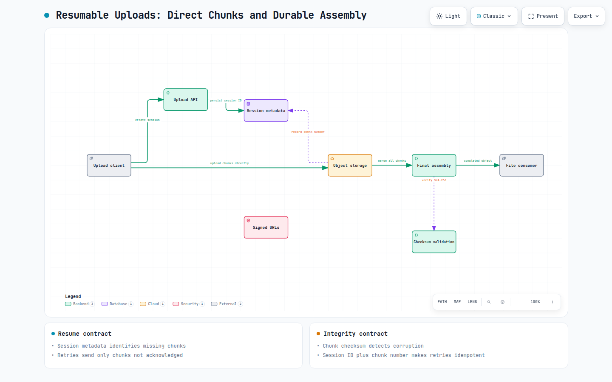
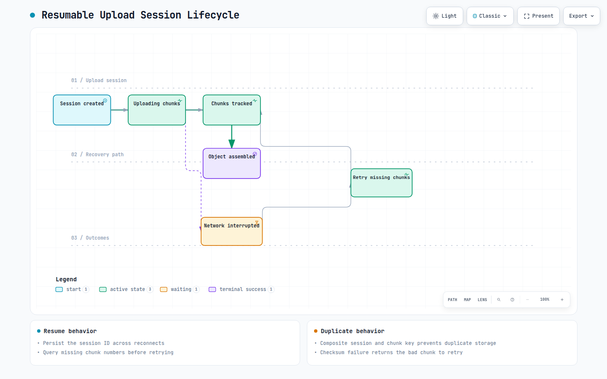

# System Design Interview: Resumable Uploads for Huge Files

> **Source**: Originally published on [Medium](https://medium.com/@codefarm0/system-design-interview-how-would-you-let-users-upload-huge-files-even-if-the-internet-disconnects-cab5a3b0abae) by Arvind Kumar

---

Uploading a file sounds simple:

- Select file.
- Click Upload.
- Wait for completion.

But things become much more interesting when the file is 1 GB, 5 GB, or even 50 GB.


Now imagine a user is uploading a 5 GB video.

After:

```text
4.8 GB
```

has already been uploaded, their internet connection drops.

Do we really want to tell them:

> *“Sorry. Please start again from the beginning.”*

Most users would simply close the browser and never return.

Platforms like Google Drive, Dropbox, YouTube, OneDrive, and AWS S3 don’t work that way.

They allow uploads to continue from exactly where they stopped.

Let’s explore how.

## The Question

**Aadvik:** Imagine we’re building something like Google Drive.

A user uploads a 5 GB video.

After 4.8 GB has been uploaded, the network disconnects.

How would you ensure the upload can resume instead of starting from scratch?

**Neha:** Before discussing solutions, I’d first challenge the assumption.

The problem isn’t the network failure.

The problem is that we’re treating the entire file as a single upload operation.

**Aadvik:** What do you mean?

**Neha:** Most naive implementations do something like:

```text
POST /upload

File = 5GB
```

The server expects the entire file in one request.

If the connection breaks:

```text
Request Failed
```

Everything is lost.

The upload must restart.

**Aadvik:** So what’s the alternative?

**Neha:** Don’t upload the file.

Upload pieces of the file.

## Breaking the File into Chunks

**Aadvik:** Explain.

**Neha:** Instead of sending:

```text
5 GB File
```

as a single request,

we split it into smaller chunks.

For example:

```text
Chunk 1 = 8 MB

Chunk 2 = 8 MB
Chunk 3 = 8 MB
...
Chunk N = 8 MB
```


Now every chunk becomes an independent upload.

## Why Is This Better?

**Aadvik:** Why does chunking help?

**Neha:** Because failures become smaller.

Imagine:

```text
Chunk 1 Uploaded

Chunk 2 Uploaded

Chunk 3 Uploaded

Chunk 4 Failed
```

Only Chunk 4 must be retried.

Not the entire 5 GB file.

After reconnecting:

```text
Resume From Chunk 4
```

instead of:

```text
Restart Entire Upload
```

## Upload Session

**Aadvik:** How does the server know these chunks belong to the same file?

**Neha:** We introduce an upload session.

The client first creates an upload session.


Example:

```text
UPLOAD-12345
```

Every chunk now carries:

```text
UploadSessionId

ChunkNumber
```

For example:

```text
{
  "uploadSessionId":"UPLOAD-12345",
  "chunkNumber":42
}
```

The server can now track progress.

## Where Is Progress Stored?

**Aadvik:** What exactly does the server store?

**Neha:** Typically metadata.

Something like:

```text
{
  "sessionId":"UPLOAD-12345",
  "fileName":"video.mp4",
  "totalChunks":640,
  "uploadedChunks":[1,2,3,4,5]
}
```

This allows the system to know:

- Which chunks exist
- Which chunks are missing
- Whether upload is complete

## The Interview Trap

**Aadvik:** Let’s say the user refreshes the browser.

What happens now?

**Neha:** Good question.

If progress only exists in browser memory:

```text
Upload Lost
```

We have a problem.

Instead, the Upload Session ID must be persisted.

Common options:

```text
Local Storage

Database
Redis
Upload Metadata Store
```

Now even after:

- Browser refresh
- App restart
- Laptop reboot

the client can continue using the same upload session.

## Resume Logic

**Aadvik:** Walk me through the resume flow.

**Neha:** Suppose:

```text
640 Chunks Total
```

The network disconnects after:

```text
Chunk 512
```

When the client reconnects:


Only missing chunks are uploaded.

Everything else is skipped.

## What About Duplicate Chunks?

**Aadvik:** What if Chunk 513 was uploaded successfully but the acknowledgment got lost?

The client retries.

**Neha:** That’s a classic distributed systems problem.

The client doesn’t know whether:

```text
Chunk Uploaded

or
Chunk Failed
```

The server must make chunk uploads idempotent.

**Aadvik:** How?

**Neha:** Every chunk should have:

```text
UploadSessionId

ChunkNumber
```

as a unique identifier.

```text
UPLOAD-12345

Chunk-513
```

If the same chunk arrives twice:

```text
Ignore Duplicate
```

or

```text
Return Success Again
```

without storing it twice.

Exactly the same principle we discussed for payment idempotency.

## Storage Layer

**Aadvik:** Where are these chunks stored?

**Neha:** Usually object storage.

Examples:

- S3
- GCS
- Azure Blob Storage


The Upload Service manages metadata.

The actual bytes live in object storage.

## The Next Scaling Problem

**Aadvik:** Let’s say 100,000 users are uploading videos simultaneously.

Would all uploads pass through application servers?

**Neha:** Ideally no.

Application servers would become a bottleneck.

**Aadvik:** What’s the alternative?

**Neha:** Direct uploads.

The application generates a temporary upload URL.

The browser uploads directly to object storage.


This is how many cloud-native systems work today.

The application handles metadata.

Storage handles the file transfer.

## Chunk Size Selection

**Aadvik:** How do we choose chunk size?

**Neha:** That’s always a tradeoff.

Small chunks:

```text
More Requests

More Metadata
Better Recovery
```

Large chunks:

```text
Fewer Requests

Less Overhead
More Rework On Failure
```

Common sizes:

```text
5 MB
8 MB
16 MB
64 MB
```

depending on workload.

## File Assembly

**Aadvik:** Once all chunks arrive, what happens?

**Neha:** The system assembles them.


Many cloud storage providers perform this merge operation automatically.

## Data Integrity

**Aadvik:** What if a chunk gets corrupted during transmission?

**Neha:** We verify integrity.

Every chunk typically contains:

```text
Checksum
Hash
ETag
```

Example:

```text
SHA-256
```

The server validates the chunk before accepting it.

If validation fails:

```text
Retry Chunk
```

instead of accepting corrupted data.

## Multi-Region Uploads

**Aadvik:** Let’s make this global.

Users upload from:

- India
- Europe
- US

Any concerns?

**Neha:** Latency.

Uploading a 10 GB file across continents is painful.

Most platforms use:


Uploads happen close to users.

Replication occurs later.

## The Real Production Architecture

**Aadvik:** If you were designing this today, what would your architecture look like?

**Neha:**


Every component solves a specific problem:

- Session tracking enables resumability.
- Chunking isolates failures.
- Object storage scales file transfer.
- Metadata enables recovery.
- Checksums ensure integrity.
- Assembly creates the final file.

## Archify diagrams



> **Interactive Archify diagram**: [Resumable upload architecture](resources/resumable-uploads-chunking-large-files/upload-architecture.html)



> **Interactive Archify diagram**: [Resumable upload session lifecycle](resources/resumable-uploads-chunking-large-files/upload-session-lifecycle.html)

## Summary

1. Split large files into chunks.
2. Create an Upload Session ID.
3. Track uploaded chunks.
4. Resume only missing chunks after failure.
5. Make chunk uploads idempotent.
6. Store files in object storage.
7. Use checksums for validation.
8. Prefer direct uploads at scale.
9. Design assuming networks will fail.

The challenge isn’t uploading large files — it’s ensuring users never lose progress when networks inevitably fail.

That’s why modern platforms rely on chunked uploads, resumable uploads, upload sessions, and object storage to deliver a seamless upload experience.
