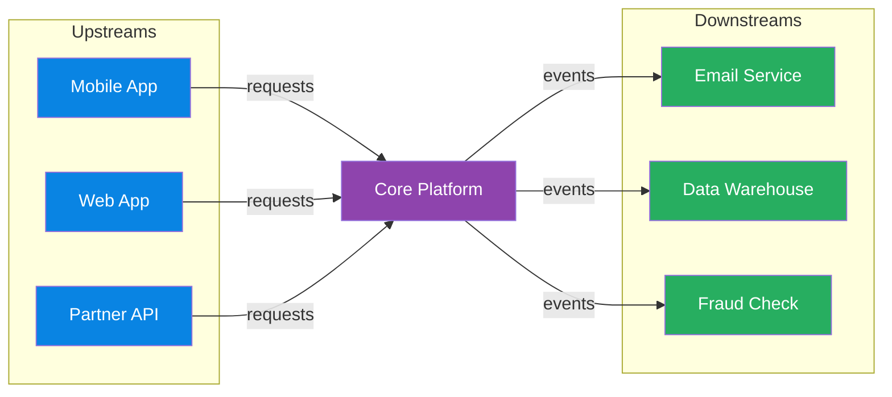

# Architecture & Cloud Patterns

> **Domain**: Software architecture patterns, cloud adoption frameworks, networking topology, system design concepts, and migration strategies.
> **Parent**: [Reference Dictionary](index.md)

---

## Contents

| Term | Anchor |
|:---|:---|
| DDD | [`#ddd`](#ddd) |
| Bounded Context | [`#bounded-context`](#bounded-context) |
| Ubiquitous Language | [`#ubiquitous-language`](#ubiquitous-language) |
| Database Per Service | [`#database-per-service`](#database-per-service) |
| Strangler Fig | [`#strangler-fig`](#strangler-fig) |
| Anti-Corruption Layer | [`#anti-corruption-layer`](#anti-corruption-layer) |
| Sidecar Pattern | [`#sidecar-pattern`](#sidecar-pattern) |
| Ambassador Pattern | [`#ambassador-pattern`](#ambassador-pattern) |
| Well-Architected Framework | [`#well-architected-framework`](#well-architected-framework) |
| CAF | [`#caf`](#caf) |
| Virtual File System (VFS) | [`#virtual-file-system-vfs`](#virtual-file-system-vfs) |
| Microservices | [`#microservices`](#microservices) |
| Monolith | [`#monolith`](#monolith) |
| Distributed Monolith | [`#distributed-monolith`](#distributed-monolith) |
| Deployment Coupling | [`#deployment-coupling`](#deployment-coupling) |
| Native Extension | [`#native-extension`](#native-extension) |
| Technical Debt | [`#technical-debt`](#technical-debt) |
| Upstream System | [`#upstream-system`](#upstream-system) |
| Downstream System | [`#downstream-system`](#downstream-system) |
| Upstream/Downstream Relationship | [`#upstreamdownstream-relationship`](#upstreamdownstream-relationship) |
| Circular Dependency | [`#circular-dependency`](#circular-dependency) |
| Base62 Encoding | [`#base62-encoding`](#base62-encoding) |
| URL Shortener | [`#url-shortener`](#url-shortener) |
| Snowflake ID | [`#snowflake-id`](#snowflake-id) |
| Key Generation Service | [`#key-generation-service`](#key-generation-service) |
| Presence Service | [`#presence-service`](#presence-service) |
| Read/Write Path Separation | [`#readwrite-path-separation`](#readwrite-path-separation) |
| Back-of-the-Envelope Estimation | [`#back-of-the-envelope-estimation`](#back-of-the-envelope-estimation) |
## DDD

**Domain-Driven Design** — a software design approach centered on domain modeling. The team builds a shared model of the business domain using a precise, agreed-upon language.

**Also see**: [Bounded Context](#bounded-context), [Ubiquitous Language](#ubiquitous-language)

---

## Bounded Context

An **explicit boundary** around a domain model with its own ubiquitous language. Inside the boundary, terms have precise meanings. "Account" in Banking may differ from "Account" in CRM — bounded contexts resolve this.

**Also see**: [DDD](#ddd), [Ubiquitous Language](#ubiquitous-language)

---

## Ubiquitous Language

A **shared, precise terminology** between developers and domain experts within a bounded context. The same word means the same thing to everyone — no translation gaps.

**Also see**: [DDD](#ddd), [Bounded Context](#bounded-context) · [Fintech: Financial States](fintech.md#financial-states)

---

## Database Per Service

A **microservices data pattern** where each service owns and manages its own database. No two services share the same logical data store, enforcing service boundaries and independent deployability.

### Key Characteristics
- **Private schema per service** — other services access data only through the service's API or events
- **Technology fit** — each service can choose SQL, NoSQL, or a specialized store based on its access patterns
- **No shared locks or joins** — cross-service consistency is achieved via APIs, sagas, or events
- **Independent scaling and recovery** — one service's database load does not starve another

### When to Use
- Microservices where teams need autonomous deployment and schema evolution
- Domains with heterogeneous data access patterns (e.g., ACID balances + high-write event logs)

### When NOT to Use
- Early-stage monoliths where cross-table joins and transactions dramatically simplify correctness
- When the organization lacks mature API/event contracts and saga compensation design

### Also see
- [Bounded Context](#bounded-context) · [Saga Pattern](data-concurrency.md#saga-pattern) · [Outbox Pattern](cqrs-event-driven.md#outbox-pattern)

---

## Strangler Fig

An **incremental migration pattern** — gradually replace a legacy system by building new functionality around it until the old system is "strangled" and can be removed. Named after the fig tree that grows around a host tree.

**Also see**: [Anti-Corruption Layer](#anti-corruption-layer)

---

## Anti-Corruption Layer

A **translation layer** that protects a bounded context from external model corruption. Translates between the external model and the internal domain model so neither leaks into the other.

**Also see**: [Bounded Context](#bounded-context), [Strangler Fig](#strangler-fig)

---

## Sidecar Pattern

A **co-located helper container** that supports the main application. Deployed alongside in the same pod (Kubernetes). Example: Envoy proxy handling TLS, routing, and observability for the app container.

**Also see**: [Ambassador Pattern](#ambassador-pattern)

---

## Ambassador Pattern

A **proxy service** that handles connectivity concerns (retry, routing, authentication) on behalf of the main service. Offloads cross-cutting network concerns from the application.

**Also see**: [Sidecar Pattern](#sidecar-pattern)

---

## Well-Architected Framework

Azure's **five pillars** of architectural excellence:

| Pillar | Focus |
|:---|:---|
| **Reliability** | Recover from failures, high availability |
| **Security** | Protect data, identities, and infrastructure |
| **Cost Optimization** | Maximize value, minimize waste |
| **Operational Excellence** | Run and monitor systems in production |
| **Performance Efficiency** | Adapt to changing workload demands |

**Also see**: [CAF](#caf)

---

## CAF

**Cloud Adoption Framework** — Microsoft's structured methodology for cloud adoption: Strategy → Plan → Ready → Adopt → Govern → Manage.

**Also see**: [Well-Architected Framework](#well-architected-framework)

---

## Virtual File System (VFS)

A kernel-level abstraction layer in Linux that provides a single unified interface (`struct file_operations`) for all filesystem operations, allowing hundreds of different filesystem implementations (ext4, btrfs, NFS, etc.) to coexist behind a common contract. One of the most elegant examples of clean abstraction at scale.

### Key Characteristics

- **Unified interface**: Every filesystem implements the same `file_operations` struct — `open`, `read`, `write`, `release` — regardless of underlying storage
- **Contract-enforced**: The abstraction doesn't leak; it defines a contract and enforces it, enabling Linux to grow for 30+ years without collapsing under its own weight
- **Pluggable backends**: New filesystems can be added without modifying any calling code, making the kernel extensible at the storage layer

### When to Use

- Designing systems where multiple backend implementations must be interchangeable behind a stable API
- When the data model (what is stored) should remain stable while storage strategies (how it's stored) evolve
- Architectural patterns requiring the Strategy pattern at the OS or platform layer

### When NOT to Use

- When the abstraction overhead (vtable dispatch, indirection) is unacceptable for hot-path performance
- Simple systems with only one storage backend where the abstraction cost outweighs flexibility gains
- When backend-specific features need to be exposed directly to callers (the abstraction hides them)

### Also see

- [Event Loop](concurrency-runtimes.md#event-loop) — another example of deliberate architectural simplicity
- [Content-Addressable Storage](ai-ml-llm.md) — Git's complementary data model

---

## Microservices

An architectural style that structures an application as a **collection of loosely coupled services**, each aligned to a business capability, owning its own data and deployable independently.

### Key Characteristics
- **Service boundaries**: usually aligned to bounded contexts or business capabilities
- **Independent deployability**: teams can release, scale and fail over services separately
- **Polyglot persistence**: each service may choose the data store that fits its access patterns
- **Operational overhead**: requires observability, CI/CD, service discovery and graceful degradation

### When to Use
- Large engineering organizations with multiple autonomous teams
- Domains with independently scaling or evolving subsystems

### When NOT to Use
- Early-stage products where a monolith is faster to build and iterate
- When the organization lacks the platform maturity to operate dozens of services

**Also see**: [Monolith](#monolith), [Database Per Service](#database-per-service), [Bounded Context](#bounded-context)

---

## Monolith

A single deployable unit in which all functionality, data access and business logic runs together. A well-factored monolith is often the fastest and simplest path to product-market fit.

### Key Characteristics
- **Single codebase and deployment unit**: everything ships together
- **In-process communication**: no network calls between modules
- **Simpler transactions and consistency**: ACID across the whole data model
- **Can be modular**: a “modular monolith” has clear internal boundaries without service boundaries

### When to Use
- Small teams, early-stage products and rapid iteration
- Domains where cross-module transactions and joins are frequent

### When NOT to Use
- When multiple teams are blocked by a shared deployment cadence
- When one component needs to scale independently by orders of magnitude

**Also see**: [Microservices](#microservices), [Strangler Fig](#strangler-fig)

---

## Distributed Monolith

A **microservices anti-pattern** in which a system is decomposed into separate deployable services but retains tight coupling across service boundaries — delivering the operational complexity of microservices (network overhead, independent deployments, distributed tracing) without the primary benefit: **team and deployment independence**.

### Key Characteristics
- **Shared database schemas** across service boundaries — services join across tables they do not own
- **Synchronous call chains**: Service A calls B calls C; a failure in C propagates to A
- **Coordinated deployments**: deploying one service requires deploying or approving others
- **Implicit contract coupling**: changes to shared libraries or schemas ripple across all consumers
- **Cascading failures**: a single slow downstream service saturates upstream thread pools

### Warning Signs
- You maintain a deployment order spreadsheet
- An on-call incident involves engineers from 3+ services simultaneously
- A two-line config change requires a multi-team Slack war room
- Services share a Postgres schema or an ORM model class

### When to Use
Not applicable — this is an anti-pattern to detect and remediate.

### When NOT to Use
Always avoid. Prefer bounded contexts with database-per-service and async event integration.

### Also see
- [Microservices](#microservices) · [Monolith](#monolith) · [Deployment Coupling](#deployment-coupling) · [Database Per Service](#database-per-service) · [Bounded Context](#bounded-context) · [Strangler Fig](#strangler-fig)
- [Microservices & Service Design — Key Takeaways](../system-design-architecture/48-svc-distributed-monolith-key-takeaways.md#svc-01-distributed-monolith-anti-pattern)

---

## Deployment Coupling

A condition in which deploying one service requires **coordinating the deployment of one or more other services**, eliminating independent deployability — a core benefit of microservices.

### Key Characteristics
- **Deployment order dependencies**: Service B must be deployed before Service A can start
- **Shared schema migrations**: database schema changes must be applied across service boundaries simultaneously
- **Synchronized release trains**: teams are forced to align release schedules rather than deploying on their own cadence
- **Rollback propagation**: rolling back one service breaks others that depend on the new API or schema

### When to Use
Not applicable — this is an anti-pattern.

### When NOT to Use
Always avoid in microservices architectures. Use async events, versioned API contracts, and database-per-service to eliminate deployment dependencies.

### Also see
- [Distributed Monolith](#distributed-monolith) · [Microservices](#microservices) · [Database Per Service](#database-per-service)
- [Microservices & Service Design — Key Takeaways](../system-design-architecture/48-svc-distributed-monolith-key-takeaways.md#svc-02-deployment-coupling-via-synchronous-call-chains)

---

## Native Extension

A **compiled module** (written in a language such as Rust, C, C++, or Cython) that is called from a higher-level runtime to execute a hot or CPU-bound function without rewriting the entire application.

### Key Characteristics
- **Surgical optimization**: targets a single bottleneck function or small module rather than the whole service.
- **FFI boundary**: the extension exposes a callable interface to the host runtime (e.g., Python via PyO3/Cython, Node.js via N-API, Ruby via C extensions).
- **Lower operational churn**: the existing service boundary, deployment pipeline, and team fluency stay mostly intact.

### When to Use
- A profile shows that one CPU-bound function dominates latency or cost.
- The service changes frequently and a full rewrite would impose an unacceptable velocity tax.
- The team needs most of the rewrite’s performance win with a fraction of its cost.

### When NOT to Use
- When the bottleneck is I/O, an algorithm, or a missing index — fixing the root cause is cheaper than adding a foreign build.
- When the FFI and build-tooling complexity outweighs the savings (small or rarely executed functions).

### Also see
- [Strangler Fig](#strangler-fig) · [Anti-Corruption Layer](#anti-corruption-layer) · [Tokio](concurrency-runtimes.md#tokio) · [Microservices Runtime Performance — Python to Rust Rewrite Takeaways](../system-design-architecture/60-perf-key-takeaways.md#perf-11-native-extension-as-middle-path)

---

## Technical Debt

The **accumulated cost of shortcuts or suboptimal design decisions** that make future changes slower, riskier or more expensive. Like financial debt, it can be strategic if it is tracked and paid down.

### Key Characteristics
- **Visible inventory**: a debt register with estimated impact, risk and payback plan
- **Intentional and accidental**: some debt is taken deliberately to meet a deadline; some is discovered later
- **Interest grows**: untreated debt compounds as the system evolves around it

### When to Use
- Strategic short-term trade-offs with a clear repayment plan
- Refactoring work prioritized by risk and velocity impact

### When NOT to Use
- As an excuse to skip testing, documentation or security in every sprint
- Without a plan to pay it down — unchecked debt becomes a rewrite trigger

**Also see**: [Strangler Fig](#strangler-fig), [Monolith](#monolith), [Microservices](#microservices)

---

## Upstream System

A system or component that **produces data, events or requests that flow into another system**. The upstream direction is the source side of a dependency: if system A calls or emits data that system B consumes, A is upstream of B.

### Key Characteristics
- **Caller / producer / source** in a data or control flow
- **Depends on by downstream**: changes in upstream output can break downstream consumers
- **Context-relative**: the same service can be upstream to one system and downstream to another

### When to Use
- Talking about service dependencies, data lineage, event pipelines or API call chains
- Defining ownership and SLOs (upstream availability affects downstream reliability)

### When NOT to Use
- As a synonym for “client” or “server” without explaining the direction of data flow
- In isolation without clarifying what the dependency relationship actually is

**Also see**: [Downstream System](#downstream-system), [API Gateway](#api-gateway), [Microservices](#microservices)

---

## Downstream System

A system or component that **consumes data, events or requests from another system**. The downstream direction is the consumer side of a dependency: it receives what upstream systems produce.

### Key Characteristics
- **Callee / consumer / sink** in a data or control flow
- **Affected by upstream changes**: schema changes, latency or outages upstream propagate downstream
- **Context-relative**: the same service can be downstream to one system and upstream to another

### When to Use
- Discussing consumers of events, API clients, data subscribers or pipeline outputs
- Planning backward compatibility, fan-out and error handling

### When NOT to Use
- As a synonym for “backend” or “frontend” without describing the flow direction
- When the relationship is peer-to-peer and has no clear producer/consumer direction

### Also see
- [Upstream System](#upstream-system) · [Messaging](messaging.md) · [Event-Driven Architecture](cqrs-event-driven.md#event-driven-architecture)

---

## Upstream/Downstream Relationship

**Diagram description**: Upstream systems (Mobile App, Web App, Partner API) send requests into a Core Platform (purple). The Core Platform then emits events to downstream systems (Email Service, Data Warehouse, Fraud Check) shown in green. Arrows follow the direction of data/control flow from upstream producers to downstream consumers.

---

## Circular Dependency

A situation where two or more components **mutually depend on each other**, directly or transitively. In distributed systems, circular dependencies are especially dangerous when they cross infrastructure boundaries — for example, an observability stack that depends on the same service-discovery layer it monitors. When the dependency fails, the monitoring goes dark, and operators lose the ability to diagnose the very failure that took it down.

### Key Characteristics
- **Direct**: A depends on B, B depends on A
- **Transitive**: A → B → C → A (harder to detect)
- **Infrastructure coupling**: the monitoring plane shares fate with the data plane it observes

### When to Use
- Never intentionally — circular dependencies are an anti-pattern. Always break them with an intermediate abstraction, event bus, or separate infrastructure plane.

### When NOT to Use
- Circular dependencies should be eliminated, not tolerated. Even "stable" circular dependencies create fragility under failure conditions.

### Also see
- [Observability](../reference-dictionary/resilience.md#observability) · [Bulkhead](../reference-dictionary/resilience.md#bulkhead) · [Sidecar Pattern](#sidecar-pattern)

---

## Base62 Encoding

A binary-to-text encoding scheme that uses 62 characters: `0-9`, `a-z`, and `A-Z`. It produces shorter strings than Base64 (which uses 64 characters including `+` and `/`) while remaining URL-safe and human-readable. Commonly used to compress large numeric IDs into short tokens.

### Key Characteristics
- **Alphabet**: 62 URL-friendly characters
- **Compactness**: `62^7 ≈ 3.5 trillion` unique 7-character codes
- **Lexicographic ambiguity**: Case-sensitive (`a` ≠ `A`)

### When to Use
- Short URL aliases, invite codes, reference numbers
- Anywhere a large numeric ID needs a compact, shareable string

### When NOT to Use
- When case insensitivity is required (use Base36)
- When cryptographic entropy is required (use random tokens or hashes)

**Also see**: [URL Shortener](#url-shortener) · [Snowflake ID](#snowflake-id)

---

## URL Shortener

A system that maps long URLs to short, unique aliases and redirects users from the alias to the original URL. The classic design problem separates a write-heavy shortening path from a read-heavy redirect path, using pre-generated IDs, cache-aside reads, and asynchronous analytics.

### Key Characteristics
- **Read-heavy**: Redirect traffic dominates writes (often 100:1)
- **Immutable mappings**: Short codes rarely change after creation
- **Global uniqueness**: No two long URLs may share the same alias
- **Low-latency redirects**: Served from cache at the edge

### When to Use
- Link sharing, tracking, branding (e.g., `short.ly/abc123`)
- Any scenario requiring compact, memorable references to long resources

### When NOT to Use
- When the original URL must be hidden from the service operator
- When deterministic, collision-free generation is impossible to guarantee

**Also see**: [Base62 Encoding](#base62-encoding) · [Key Generation Service](#key-generation-service) · [Cache-Aside Pattern](../reference-dictionary/caching.md#cache-aside-pattern)

---

## Snowflake ID

A distributed unique ID generation algorithm introduced by Twitter. Each ID is a 64-bit integer composed of a timestamp, datacenter ID, worker ID, and sequence number. IDs are roughly time-ordered and unique without coordination beyond worker registration.

### Key Characteristics
- **64-bit**: Fits in a `BIGINT` / `long`
- **Time-ordered**: High bits encode millisecond timestamp
- **Distributed**: Datacenter and worker IDs allow independent generation
- **Sequence number**: Handles up to 4096 IDs per worker per millisecond

### When to Use
- Distributed systems needing unique, sortable IDs
- Primary keys where monotonic time ordering aids indexing

### When NOT to Use
- When strict global monotonicity is required (clock drift can break ordering)
- When IDs must be unpredictable (Snowflake IDs are guessable)

**Also see**: [Key Generation Service](#key-generation-service) · [Base62 Encoding](#base62-encoding)

---

## Key Generation Service

A dedicated service responsible for producing unique identifiers or tokens at scale. In a URL shortener, it pre-allocates disjoint ranges of numeric IDs to workers, who encode them locally as short aliases. This eliminates collision checks on the write path.

### Key Characteristics
- **Range allocation**: Coordinator assigns blocks of IDs to workers
- **Local incrementing**: Workers generate IDs without network calls
- **Fault tolerance**: Lost unused ranges are acceptable at large namespace sizes

### When to Use
- Systems requiring billions of unique, short tokens
- Workloads where write latency and collision-freedom are both critical

### When NOT to Use
- When UUIDs or database sequences are sufficient
- When centralized ID assignment is acceptable and simpler

**Also see**: [Snowflake ID](#snowflake-id) · [URL Shortener](#url-shortener)

---

## Presence Service

A component that tracks which users are currently online, on which devices, and which server or gateway holds their active connection.

### Key Characteristics
- Updated by heartbeats, WebSocket pong events, or explicit connect/disconnect
- Typically uses TTL-backed storage to survive unclean disconnects
- Essential for routing real-time messages and showing online status

### When to Use
- Chat, gaming, collaboration, and live collaboration tools
- Any system that needs connection-aware routing

### When NOT to Use
- Stateless request/response APIs without long-lived connections
- When approximate presence is unacceptable

### Also see
- [Redis Streams](messaging.md#redis-streams) · [Fanout on Write](#fanout-on-write)

---

## Read/Write Path Separation

**Read/Write Path Separation** is an architectural pattern where the systems handling write operations are physically or logically separated from those handling read operations. Each path is optimized for fundamentally different concerns: the write path prioritizes durability, consistency, and correctness; the read path prioritizes low latency, massive throughput, and responsiveness.

### Key Characteristics
- **Write path** focuses on: durability, consistency, ordering, data correctness, transactional integrity
- **Read path** focuses on: low latency, massive throughput, fast responses, eventual consistency
- **Asymmetric scaling**: Read replicas can scale horizontally independently of the write master
- **CQRS is the formalized version**: Command Query Responsibility Segregation explicitly separates command (write) models from query (read) models

### When to Use
- Read-heavy workloads where reads outnumber writes by 100:1 or more (e.g., election results, news feeds, leaderboards)
- Systems where write consistency requirements conflict with read performance requirements
- National-scale events where millions of concurrent reads would overwhelm a single database

### When NOT to Use
- Write-heavy OLTP systems where read volume is low and read-your-writes consistency is critical
- Simple CRUD applications where the added complexity of separate paths exceeds the benefit
- Early-stage products where the read/write ratio is unknown or unvalidated

### Also see
- [CQRS](cqrs-event-driven.md#cqrs) · [Read Model](cqrs-event-driven.md#read-model) · [Caching](caching.md) · [Database Per Service](#database-per-service)

---

## Back-of-the-Envelope Estimation

A **rough, order-of-magnitude calculation** performed before designing any architecture. Uses simplified math to estimate traffic (QPS), storage, bandwidth, and memory requirements — typically converting DAU into reads/sec using the approximation `daily total / 86,400 ≈ average QPS`, then multiplying by a peak factor (3–5×) for worst-case planning.

### Key Characteristics
- **Order-of-magnitude precision**: The goal is within 2× of reality, not exact numbers — this is sufficient for architectural decisions
- **Peak multiplier**: Average QPS × (3–5) for peak load; 80/20 rule for cache coverage estimation
- **Guides component selection**: Tells you whether a single database, cache, queue, or CDN is plausible
- **Prevents over-engineering**: If a single PostgreSQL instance can handle the load, don't propose sharding

### When to Use
- System design interviews: BEFORE drawing any architecture diagram
- Early-stage capacity planning: do you need 1 server or 100?
- Reality-checking architectural proposals: "We need multi-region active-active for 1K DAU" — the math says no

### When NOT to Use
- As a substitute for load testing with real traffic patterns
- When exact numbers are available from production monitoring (use real data)
- For latency guarantees (estimation covers throughput and storage, not p99 latency)

### Also see
- [Scalability Principles](#) · [Read/Write Path Separation](#read-write-path-separation) · [Latency vs Throughput](#)
- [System Design Interview Roadmap](../system-design-architecture/system-design-interview/interview-roadmap.md#sdi-05-back-of-the-envelope-math)

---

