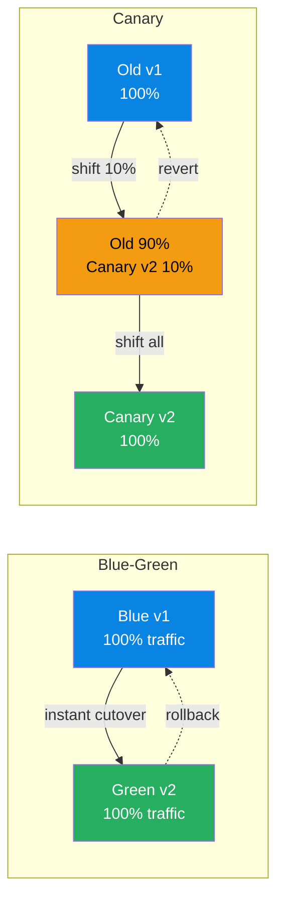
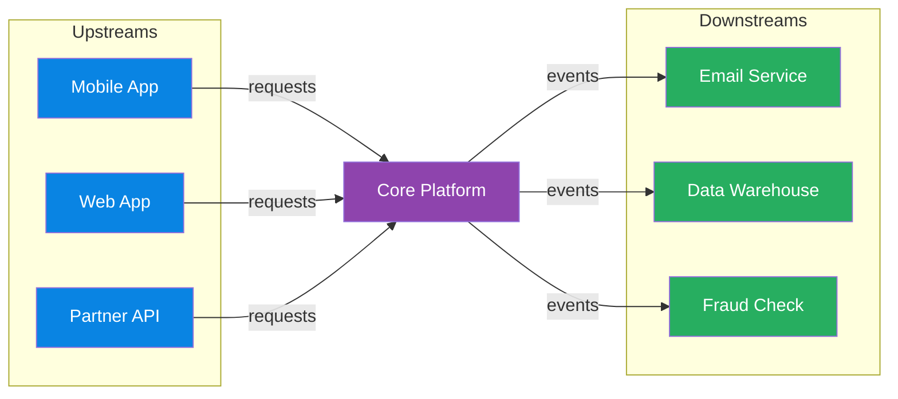

# Architecture & Design Patterns

> **Domain**: Software architecture patterns, domain-driven design, cloud adoption frameworks, and migration strategies.
> **Parent**: [Reference Dictionary](index.md)

---

## Contents

| Term | Anchor |
|:---|:---|
| Domain-Driven Design (DDD) | [`#ddd`](#ddd) |
| Bounded Context | [`#bounded-context`](#bounded-context) |
| Ubiquitous Language | [`#ubiquitous-language`](#ubiquitous-language) |
| Database Per Service | [`#database-per-service`](#database-per-service) |
| Strangler Fig Pattern | [`#strangler-fig`](#strangler-fig) |
| Anti-Corruption Layer | [`#anti-corruption-layer`](#anti-corruption-layer) |
| Sidecar Pattern | [`#sidecar-pattern`](#sidecar-pattern) |
| Ambassador Pattern | [`#ambassador-pattern`](#ambassador-pattern) |
| Competing Consumers | [`#competing-consumers`](#competing-consumers) |
| Claim Check Pattern | [`#claim-check`](#claim-check) |
| Blue-Green Deployment | [`#blue-green`](#blue-green) |
| Canary Deployment | [`#canary-deployment`](#canary-deployment) |
| Blue-Green vs Canary Deployment | [`#blue-green-vs-canary-deployment`](#blue-green-vs-canary-deployment) |
| Well-Architected Framework | [`#well-architected-framework`](#well-architected-framework) |
| Cloud Adoption Framework (CAF) | [`#caf`](#caf) |
| Hub-and-Spoke Topology | [`#hub-and-spoke`](#hub-and-spoke) |
| DMZ | [`#dmz`](#dmz) |
| Virtual Threads (Project Loom) | [`#virtual-threads`](#virtual-threads) |
| Leyden AOT | [`#leyden-aot`](#leyden-aot) |
| Medallion Architecture | [`#medallion-architecture`](#medallion-architecture) |
| Helidon SE | [`#helidon-se`](#helidon-se) |
| GOMAXPROCS | [`#gomaxprocs`](#gomaxprocs) |
| Semantic Layer | [`#semantic-layer`](#semantic-layer) |
| Vertical vs Horizontal Scaling | [`#vertical-vs-horizontal-scaling`](#vertical-vs-horizontal-scaling) |
| CAP Theorem | [`#cap-theorem`](#cap-theorem) |
| Replication | [`#replication`](#replication) |
| Sharding | [`#sharding`](#sharding) |
| Data Catalog | [`#data-catalog`](#data-catalog) |
| Data Fabric | [`#data-fabric`](#data-fabric) |
| Data Mesh | [`#data-mesh`](#data-mesh) |
| Data Product | [`#data-product`](#data-product) |
| Federated Governance | [`#federated-governance`](#federated-governance) |
| Practical Decentralization | [`#practical-decentralization`](#practical-decentralization) |
| Event Loop | [`#event-loop`](#event-loop) |
| Virtual File System (VFS) | [`#virtual-file-system-vfs`](#virtual-file-system-vfs) |
| Authentication | [`#authentication`](#authentication) |
| Authorization | [`#authorization`](#authorization) |
| JWT (JSON Web Token) | [`#jwt-json-web-token`](#jwt-json-web-token) |
| OAuth2 | [`#oauth2`](#oauth2) |
| Zero Trust | [`#zero-trust`](#zero-trust) |
| RBAC (Role-Based Access Control) | [`#rbac-role-based-access-control`](#rbac-role-based-access-control) |
| ABAC (Attribute-Based Access Control) | [`#abac-attribute-based-access-control`](#abac-attribute-based-access-control) |
| API Gateway | [`#api-gateway`](#api-gateway) |
| Microservices | [`#microservices`](#microservices) |
| Monolith | [`#monolith`](#monolith) |
| Progressive Delivery | [`#progressive-delivery`](#progressive-delivery) |
| Feature Flag | [`#feature-flag`](#feature-flag) |
| A/B Testing | [`#ab-testing`](#ab-testing) |
| Active-Active | [`#active-active`](#active-active) |
| Shadow Testing | [`#shadow-testing`](#shadow-testing) |
| OpenTelemetry | [`#opentelemetry`](#opentelemetry) |
| Golden Signals | [`#golden-signals`](#golden-signals) |
| Error Budget | [`#error-budget`](#error-budget) |
| Blameless Postmortem | [`#blameless-postmortem`](#blameless-postmortem) |
| Technical Debt | [`#technical-debt`](#technical-debt) |
| Upstream System | [`#upstream-system`](#upstream-system) |
| Downstream System | [`#downstream-system`](#downstream-system) |

---

## DDD

**Domain-Driven Design** — a software design approach centered on domain modeling. The team builds a shared model of the business domain using a precise, agreed-upon language.

**Also see**: [Bounded Context](#bounded-context), [Ubiquitous Language](#ubiquitous-language)

---

## Bounded Context

An **explicit boundary** around a domain model with its own ubiquitous language. Inside the boundary, terms have precise meanings. "Account" in Banking may differ from "Account" in CRM — bounded contexts resolve this.

**Also see**: [DDD](#ddd), [Ubiquitous Language](#ubiquitous-language)

---

## Ubiquitous Language

A **shared, precise terminology** between developers and domain experts within a bounded context. The same word means the same thing to everyone — no translation gaps.

**Also see**: [DDD](#ddd), [Bounded Context](#bounded-context) · [Fintech: Financial States](fintech.md#financial-states)

---

## Database Per Service

A **microservices data pattern** where each service owns and manages its own database. No two services share the same logical data store, enforcing service boundaries and independent deployability.

### Key Characteristics
- **Private schema per service** — other services access data only through the service's API or events
- **Technology fit** — each service can choose SQL, NoSQL, or a specialized store based on its access patterns
- **No shared locks or joins** — cross-service consistency is achieved via APIs, sagas, or events
- **Independent scaling and recovery** — one service's database load does not starve another

### When to Use
- Microservices where teams need autonomous deployment and schema evolution
- Domains with heterogeneous data access patterns (e.g., ACID balances + high-write event logs)

### When NOT to Use
- Early-stage monoliths where cross-table joins and transactions dramatically simplify correctness
- When the organization lacks mature API/event contracts and saga compensation design

### Also see
- [Bounded Context](#bounded-context) · [Saga Pattern](data-concurrency.md#saga-pattern) · [Outbox Pattern](cqrs-event-driven.md#outbox-pattern)

---

## Strangler Fig

An **incremental migration pattern** — gradually replace a legacy system by building new functionality around it until the old system is "strangled" and can be removed. Named after the fig tree that grows around a host tree.

**Also see**: [Anti-Corruption Layer](#anti-corruption-layer)

---

## Anti-Corruption Layer

A **translation layer** that protects a bounded context from external model corruption. Translates between the external model and the internal domain model so neither leaks into the other.

**Also see**: [Bounded Context](#bounded-context), [Strangler Fig](#strangler-fig)

---

## Sidecar Pattern

A **co-located helper container** that supports the main application. Deployed alongside in the same pod (Kubernetes). Example: Envoy proxy handling TLS, routing, and observability for the app container.

**Also see**: [Ambassador Pattern](#ambassador-pattern)

---

## Ambassador Pattern

A **proxy service** that handles connectivity concerns (retry, routing, authentication) on behalf of the main service. Offloads cross-cutting network concerns from the application.

**Also see**: [Sidecar Pattern](#sidecar-pattern)

---

## Competing Consumers

Multiple consumers **pull from a single queue** for load-balanced processing. If one consumer is slow, others pick up the slack. Core pattern for scaling message processing horizontally.

**Also see**: [Messaging](messaging.md)

---

## Claim Check

Store a **large payload in external storage** and pass only a reference (the "claim check") in the message. Avoids bloating message brokers with large payloads.

**Also see**: [Messaging](messaging.md)

---

## Blue-Green

Two **identical environments** — Blue (current) and Green (new version). Traffic is switched from Blue to Green for zero-downtime deployments. Rollback is instant: switch back to Blue.

**Also see**: [Canary Deployment](#canary-deployment)

---

## Canary Deployment

Route a **small percentage of traffic** to the new version before full rollout. If error rates spike, the canary is killed and traffic reverts. Safer than Blue-Green for high-risk changes.

**Also see**: [Blue-Green](#blue-green)

---

## Blue-Green vs Canary Deployment

Both strategies separate **deployment** (installing the new version) from **release** (exposing it to users). The difference is how traffic moves:

| Aspect | Blue-Green | Canary Deployment |
|:---|:---|:---|
| Traffic shift | Instant 0% → 100% | Gradual 0% → small % → 100% |
| Rollback speed | Immediate (switch back) | Fast (drain canary) |
| Blast radius | All users if the new version fails | Only canary users |
| Best for | Low-risk changes, predictable rollbacks | High-risk changes, sensitive services |

They are often combined: a Blue-Green pair gives you an isolated environment to canary into before committing all traffic.

**Diagram description**: Two deployment patterns shown side by side. Blue-Green (left) switches all traffic instantly from Blue v1 (blue) to Green v2 (green) with a dashed rollback arrow. Canary (right) gradually shifts traffic from Old v1 (blue) to a mix of Old 90% + Canary v2 10% (yellow), then to Canary v2 100% (green), with a dashed revert arrow to the old version.

---

## Well-Architected Framework

Azure's **five pillars** of architectural excellence:

| Pillar | Focus |
|:---|:---|
| **Reliability** | Recover from failures, high availability |
| **Security** | Protect data, identities, and infrastructure |
| **Cost Optimization** | Maximize value, minimize waste |
| **Operational Excellence** | Run and monitor systems in production |
| **Performance Efficiency** | Adapt to changing workload demands |

**Also see**: [CAF](#caf)

---

## CAF

**Cloud Adoption Framework** — Microsoft's structured methodology for cloud adoption: Strategy → Plan → Ready → Adopt → Govern → Manage.

**Also see**: [Well-Architected Framework](#well-architected-framework)

---

## Hub-and-Spoke

A **network topology** where a central hub VNet hosts shared services (firewall, gateway, DNS) and spoke VNets host workloads. All spoke-to-spoke traffic routes through the hub for inspection and control.

**Also see**: [Azure Services: VNet](azure-services.md#vnet)

---

## DMZ

**Demilitarized Zone** — an isolated network segment between the untrusted internet and trusted internal network. Hosts internet-facing services that should not have direct access to internal systems.

**Also see**: [Azure Services: Azure Firewall](azure-services.md#azure-firewall)

---

## Virtual Threads

**Project Loom Virtual Threads** — lightweight JVM-managed threads introduced in Java 21. Unlike platform threads (1:1 mapped to OS threads, ~1 MB stack each), virtual threads are managed by the JVM and mapped many-to-few onto platform threads (~hundreds of bytes each). When a virtual thread blocks on I/O, the JVM unmounts it and reassigns the carrier platform thread to another virtual thread.

### Key Characteristics
- Available since Java 21 (JEP 444) as a standard feature
- `Thread.ofVirtual().start(task)` or `Executors.newVirtualThreadPerTaskExecutor()`
- No pool needed — virtual threads are cheap enough to create one-per-task
- Automatic unmounting on blocking I/O (socket read/write, `Thread.sleep()`, `LockSupport.park()`)
- **Pinning risk**: `synchronized` blocks and native calls (JNI) pin the virtual thread to its carrier, blocking the OS thread

### When to Use
- High-concurrency I/O-bound services (HTTP handlers, database calls, message consumers)
- Replacing reactive/async programming models (callback hell) with synchronous-style code
- When you need goroutine-level concurrency scale in Java without rearchitecting to reactive streams

### When NOT to Use
- CPU-bound workloads (virtual threads don't add CPU parallelism — use platform threads + ForkJoinPool)
- Code with pervasive `synchronized` blocks (pinning degrades throughput)
- Pre-Java 21 runtimes (not available; use reactive or CompletableFuture)

### Also see
- [Task / async-await](dotnet-multithreading.md#task) — .NET equivalent async pattern
- [Leyden AOT](#leyden-aot) — complementary startup optimization
- [Helidon SE](#helidon-se) — framework that uses virtual threads for request handling

---

## Leyden AOT

**Project Leyden Ahead-of-Time Compilation** — a JVM feature that captures JIT-optimized native code during training runs and replays it on subsequent starts via an AOT cache. Reduces the JVM warmup penalty (interpreting bytecode, C1/C2 profiling) while retaining peak throughput.

### Key Characteristics
- Two-phase workflow: **training** (record) → **production** (replay from cache)
- JVM flags: `-XX:AOTTraining` (record), `-XX:AOTCache` (replay)
- Cache is version-specific: same JDK version, JVM flags, and classpath required
- Complementary to GraalVM Native Image (Leyden improves JVM startup; GraalVM compiles ahead-of-time to a standalone binary)
- Part of Project Leyden (JEP 483), targeting JDK 24+

### When to Use
- Serverless / containerized Java services with cold-start constraints
- Auto-scaling scenarios where new instances must reach peak throughput quickly
- Services with predictable code paths (training covers production behavior)

### When NOT to Use
- Long-running monolithic services with stable load (JIT eventually reaches similar peak)
- Frequently changing codebases (cache invalidation overhead)
- Environments where cache portability is required (cache is JDK-version-specific)

### Also see
- [Virtual Threads](#virtual-threads) — complementary concurrency optimization
- [Helidon SE](#helidon-se) — lightweight framework that benefits from AOT

---

## Helidon SE

**Helidon SE** — Oracle's lightweight, reactive Java microservices framework. Helidon SE (Standard Edition) provides a minimal web server without dependency injection, designed for small footprint and fast startup. Helidon 4 uses Java virtual threads for request handling, making blocking code efficient at high concurrency.

### Key Characteristics
- Two editions: **SE** (minimal, no DI) and **MP** (MicroProfile, full Jakarta EE)
- Helidon SE WebServer is a compact, programmatic API — no annotations, no classpath scanning
- Built-in support for virtual threads (Helidon 4+)
- ~5 MB hello-world JAR; fast startup even without AOT
- Native integration with Oracle JDK and Leyden AOT

### When to Use
- Small, high-throughput HTTP services where framework overhead matters
- When comparing Java microservice performance to Go (Helidon SE is the closest Java equivalent to Go's `net/http` in terms of framework weight)
- Greenfield services that want virtual threads without Spring Boot's dependency graph

### When NOT to Use
- Teams invested in Spring Boot ecosystem (Spring Boot 3.2+ also supports virtual threads)
- Applications requiring extensive middleware (Helidon MP is the fuller alternative)
- When you need a large ecosystem of third-party integrations (Spring has more)

### Also see
- [Virtual Threads](#virtual-threads) — the concurrency model Helidon SE uses
- [Leyden AOT](#leyden-aot) — complementary startup optimization
- [Azure App Service](azure-services.md#app-service) — deployment target

---

## GOMAXPROCS

**GOMAXPROCS** — a Go runtime environment variable that sets the maximum number of OS threads that can execute Go code simultaneously. Controls the parallelism of the Go scheduler's work-stealing across goroutines.

### Key Characteristics
- Default: `runtime.NumCPU()` (all available CPUs)
- Set via `GOMAXPROCS=N` environment variable or `runtime.GOMAXPROCS(n)` in code
- Does NOT limit goroutine count (goroutines are multiplexed onto GOMAXPROCS OS threads)
- Critical for containerized environments where the container's CPU limit is less than the host's CPU count

### When to Use
- Explicit CPU affinity in benchmarks (matching Java's `ActiveProcessorCount`)
- Containerized Go services where `runtime.NumCPU()` sees the host CPUs, not container limits
- Performance tuning: reducing GOMAXPROCS can reduce GC pressure in CPU-saturated services

### When NOT to Use
- Default is usually correct for non-containerized deployments on dedicated hardware
- Setting GOMAXPROCS > actual available CPUs provides no benefit and may increase scheduling overhead

### Also see
- [Virtual Threads](#virtual-threads) — Java's concurrency model counterpart
- [Azure Container Apps](azure-services.md#container-apps) — containerized deployment target

---

## Vertical vs Horizontal Scaling

Two strategies for handling increased load:
- **Vertical scaling (scale up)**: Buy a bigger machine — more CPU, RAM, disk. Simple but hits physical limits and becomes exponentially expensive. Single point of failure.
- **Horizontal scaling (scale out)**: Add more machines behind a load balancer. Scales infinitely, adds fault tolerance, but requires stateless design and data partitioning.

| | Vertical (Scale Up) | Horizontal (Scale Out) |
|:---|:---|:---|
| **Complexity** | Low | High (requires LB, stateless services) |
| **Cost curve** | Linear then exponential | Linear per node |
| **Fault tolerance** | Single point of failure | Tolerates node failures |
| **Scaling limit** | Hardware ceiling | Theoretically infinite |

### When to Use
- **Vertical**: Early-stage apps, legacy monoliths, databases with licensing per-core
- **Horizontal**: Cloud-native apps, stateless services, high-availability requirements

**Also see**: [CAP Theorem](#cap-theorem) · [Replication](#replication) · [Sharding](#sharding)

---

## CAP Theorem

In a distributed system, you can guarantee only **two of three**: **C**onsistency (all nodes see the same data), **A**vailability (every request gets a response), **P**artition Tolerance (system works despite network partitions). Since network partitions are inevitable, the real choice is CP (sacrifice availability during partition) or AP (sacrifice strong consistency during partition).

| Choice | Use Case | Example |
|:---|:---|:---|
| **CP** | Financial ledgers, inventory counts | HBase, Zookeeper, etcd |
| **AP** | Social feeds, shopping carts, search indexes | Cassandra, DynamoDB, Cosmos DB |

### Key Characteristics
- **PACELC extension**: When Partitioned, choose A or C. Else (no partition), choose Latency or Consistency
- **Tunable consistency**: Modern databases offer configurable consistency levels (e.g., Cosmos DB 5 levels, Cassandra QUORUM)
- **Not binary**: CAP is a spectrum — most systems are neither purely CP nor purely AP

**Also see**: [Replication](#replication) · [Sharding](#sharding) · [Vertical vs Horizontal Scaling](#vertical-vs-horizontal-scaling)

---

## Replication

Copying data to multiple servers so that **reads can scale horizontally** and the system survives individual server failures. Writes go to the primary; reads can go to any replica. The tradeoff is **replication lag** — replicas may return stale data for milliseconds to seconds after a write.

### Key Characteristics
- **Read scalability**: N replicas = up to N× read throughput
- **Fault tolerance**: Primary fails → promote replica
- **Replication lag**: Asynchronous replication means stale reads from replicas

### When to Use
- Read-heavy workloads where slightly stale data is acceptable
- Disaster recovery and geographic distribution

### When NOT to Use
- Write-heavy workloads (replication adds overhead, doesn't help write throughput)
- When every read must reflect the latest write (use primary reads or synchronous replication)

**Also see**: [Sharding](#sharding) · [CAP Theorem](#cap-theorem)

---

## Sharding

Splitting a database into **smaller, independent pieces (shards)** so that writes and storage scale horizontally. Each shard handles a subset of data — typically by key range or hash. Enables write scalability beyond what a single machine can handle.

### Key Characteristics
- **Write scalability**: N shards = up to N× write throughput
- **Key-based routing**: Same key → same shard → consistent data locality
- **No cross-shard joins**: Application must handle data that spans shards

### When to Use
- Write-heavy workloads exceeding single-machine capacity
- Data volumes too large for a single database

### When NOT to Use
- When cross-shard queries are frequent (complexity may outweigh benefit)
- Small datasets that fit on a single machine (premature optimization)

**Also see**: [Replication](#replication) · [Vertical vs Horizontal Scaling](#vertical-vs-horizontal-scaling) · [CAP Theorem](#cap-theorem)

---

## Data Catalog

A **centralized inventory of data assets** with searchable metadata, ownership, lineage, and schema information. A real data catalog is not a dusty Confluence page — it is a living system that helps producers and consumers discover, understand, and trust data.

### Key Characteristics
- Searchable metadata and documentation
- Ownership and stewardship assignments
- Data lineage and provenance tracking
- Integration with data quality and governance tools

### When to Use
- More than a handful of data producers or consumers
- Compliance or audit requirements demand traceability
- Teams waste time hunting for the "right" dataset or its owner

### When NOT to Use
- Very small, static datasets with one consumer
- When curation discipline is absent (becomes stale metadata graveyard)

### Also see
- [Data Mesh](#data-mesh)
- [Federated Governance](#federated-governance)

---

## Data Fabric

A **metadata-driven, automation-focused data architecture** that connects disparate data sources and tools through unified discovery, governance, and integration layers. Data Fabric is not a replacement for Data Mesh — it solves different layers, mostly automation and metadata.

### Key Characteristics
- Unified metadata layer across distributed data
- AI/ML-driven data discovery and classification
- Automated data integration and pipeline generation
- Governance and policy enforcement across silos

### When to Use
- Heterogeneous data landscape with many sources and tools
- Need for automated discovery, lineage, and policy enforcement
- Data Mesh alone leaves metadata and integration gaps

### When NOT to Use
- As a silver bullet to fix organizational ownership problems
- When the real issue is lack of data-product discipline, not integration plumbing

### Also see
- [Data Mesh](#data-mesh)
- [Practical Decentralization](#practical-decentralization)

---

## Data Mesh

A **decentralized socio-technical approach to data architecture** where domain-oriented teams own their data as products. Data Mesh shifts data ownership from central data teams to domain teams, supported by federated governance and a self-serve data platform.

### Key Characteristics
- Domain-oriented decentralized data ownership
- Data as a product (governed, versioned, documented, with SLAs)
- Self-serve data infrastructure platform
- Federated computational governance

### When to Use
- Organization has mature domain teams with stable ownership
- Central data team is a persistent bottleneck
- Domains are willing and able to treat data as a product

### When NOT to Use
- Teams rotate frequently or lack data-engineering skills
- Governance culture is weak (becomes "decentralized chaos with documentation")
- Organization expects platform purchase to substitute for operating-model change

### Also see
- [Data Product](#data-product)
- [Federated Governance](#federated-governance)
- [Practical Decentralization](#practical-decentralization)

---

## Data Product

A **curated, reusable data asset** exposed with clear semantics, quality guarantees, versioning, documentation, and ownership. A data product is not a dashboard, a random table, or a CSV that happens to be in S3.

### Key Characteristics
- Defined owner and consumers
- Explicit SLAs (freshness, quality, availability)
- Versioned schema and interface
- Documented semantics and usage contracts

### When to Use
- Data is consumed by multiple teams or systems
- Data quality and reliability directly affect decisions
- Data Mesh or decentralized ownership model is in use

### When NOT to Use
- One-off exploratory analysis
- Ad-hoc exports with no clear consumer or maintenance owner

### Also see
- [Data Mesh](#data-mesh)
- [Data Catalog](#data-catalog)

---

## Federated Governance

A **governance model** where central standards are set globally but applied locally by domain teams. It combines centralized policy definition with domain-level execution, automated enforcement, and audit-friendly evidence.

### Key Characteristics
- Central standards + domain-applied rules
- Automation-first enforcement (schema checks, quality gates, access controls)
- Audit-friendly logs and lineage
- Not 17 Notion pages no one will ever read

### When to Use
- Decentralized data ownership with compliance or audit requirements
- Need to balance standardization with domain autonomy
- Policy-as-code and automated checks are feasible

### When NOT to Use
- When central team tries to enforce everything manually
- When governance is treated as documentation theater rather than executable policy

### Also see
- [Data Mesh](#data-mesh)
- [Data Fabric](#data-fabric)

---

## Practical Decentralization

A **hybrid data-architecture approach** that keeps the benefits of decentralized domain ownership while retaining centralized platform, security, and governance guardrails. It solves most Data Mesh pain with a smaller organizational leap: domains own logic, not the whole planet.

### Key Characteristics
- Central platform team owns infrastructure, tooling, security, and cost guardrails
- Domain teams own transformations, business logic, data definitions, and data contracts
- Shared semantic layer aligns metrics across domains
- Federated governance with automation-first enforcement

### When to Use
- Organization wants decentralized data but lacks full Data Mesh maturity
- Repeated attempts at pure decentralization produced chaos
- Need a pragmatic middle ground between centralization and domain autonomy

### When NOT to Use
- As an excuse to skip governance entirely
- When the central platform team is too weak to provide reliable guardrails

### Also see
- [Data Mesh](#data-mesh)
- [Semantic Layer](#semantic-layer)
- [Federated Governance](#federated-governance)

---

## Medallion Architecture

A **data architecture pattern** that organizes data processing into three sequential stages: **Bronze** (raw, ingested data), **Silver** (cleaned, transformed data), and **Gold** (business-ready, analytics-friendly data). Originally popularized by Databricks' lakehouse architecture, it provides a simple mental model for data quality progression.

### Key Characteristics
- Three canonical layers: Bronze (raw/immutable), Silver (cleansed/enriched), Gold (aggregated/business-ready)
- Each layer adds structure and quality — Bronze is schema-on-read, Silver is validated, Gold is modeled for consumption
- Pipeline-centric by design: organizes data by processing stage, not by business domain
- Best suited for batch-oriented, centralized, stable-source environments

### When to Use
- Small to mid-scale data platforms with stable data sources
- Batch workloads dominate (daily/hourly ETL/ELT)
- Centralized data engineering team with clear ownership
- Getting started with a lakehouse architecture — it's an excellent starting point

### When NOT to Use
- As a permanent organizational model — layers should not become team boundaries
- Streaming-first or real-time workloads without adapting to Kappa architecture
- Multi-domain, multi-team platforms without adding data-product and contract layers
- As a substitute for domain-driven ownership, semantic layers, or schema contracts

### Also see
- [Data Mesh](#data-mesh)
- [Data Product](#data-product)
- [Semantic Layer](#semantic-layer)
- [Practical Decentralization](#practical-decentralization)

---

## Semantic Layer

A **shared abstraction layer** that centralizes metric definitions, dimensions, and business logic so consumers query consistent, governed semantics instead of each domain reinventing metrics.

### Key Characteristics
- Canonical metric definitions and calculations
- Reusable dimensions, filters, and aggregations
- Decouples BI tools from raw data models
- Reduces tribal knowledge and metric drift

### When to Use
- Multiple teams or tools consume the same KPIs
- Metric definitions vary by domain or dashboard
- Self-serve analytics is hampered by inconsistent semantics

### When NOT to Use
- Single-consumer analytics with simple, stable metrics
- When central team cannot keep up with domain change velocity

### Also see
- [Data Mesh](#data-mesh)
- [Data Product](#data-product)

---

> **Convention**: Every term anchor follows `domain-file.md#lowercase-hyphenated-term`. Always link to the primary definition, never to a cross-reference.

---

## Event Loop

A concurrency pattern where a single thread continuously polls for and dispatches events or I/O operations, avoiding the need for locks by processing work sequentially. Redis's `ae.c` is a canonical example: ~300 lines of C that powers millions of production systems.

### Key Characteristics

- **Single-threaded by design**: Eliminates lock contention and race conditions entirely — complexity requires justification, not the other way around
- **Event-driven polling**: Continuously checks for network I/O, timers, and signals in a main loop (`aeProcessEvents`)
- **Non-blocking I/O**: Uses mechanisms like `epoll`/`kqueue`/`select` to handle many connections without thread-per-connection overhead

### When to Use

- CPU-light, I/O-heavy workloads where request processing is fast relative to I/O wait time
- Systems where data structure access benefits from lock-free semantics (e.g., in-memory data stores)
- When operational simplicity and debuggability outweigh raw throughput on multi-core machines

### When NOT to Use

- CPU-bound workloads that cannot saturate a single core fast enough for latency requirements
- When vertical scaling limits are hit and horizontal scaling across cores is the only option
- Systems with blocking operations that cannot be offloaded to background threads or async I/O

### Also see

- [Single-Threaded Architecture](../reference-dictionary/dotnet-multithreading.md#single-threaded-architecture)
- [Async I/O patterns](../reference-dictionary/dotnet-multithreading.md)

---

## Virtual File System (VFS)

A kernel-level abstraction layer in Linux that provides a single unified interface (`struct file_operations`) for all filesystem operations, allowing hundreds of different filesystem implementations (ext4, btrfs, NFS, etc.) to coexist behind a common contract. One of the most elegant examples of clean abstraction at scale.

### Key Characteristics

- **Unified interface**: Every filesystem implements the same `file_operations` struct — `open`, `read`, `write`, `release` — regardless of underlying storage
- **Contract-enforced**: The abstraction doesn't leak; it defines a contract and enforces it, enabling Linux to grow for 30+ years without collapsing under its own weight
- **Pluggable backends**: New filesystems can be added without modifying any calling code, making the kernel extensible at the storage layer

### When to Use

- Designing systems where multiple backend implementations must be interchangeable behind a stable API
- When the data model (what is stored) should remain stable while storage strategies (how it's stored) evolve
- Architectural patterns requiring the Strategy pattern at the OS or platform layer

### When NOT to Use

- When the abstraction overhead (vtable dispatch, indirection) is unacceptable for hot-path performance
- Simple systems with only one storage backend where the abstraction cost outweighs flexibility gains
- When backend-specific features need to be exposed directly to callers (the abstraction hides them)

### Also see

- [Event Loop](#event-loop) — another example of deliberate architectural simplicity
- [Content-Addressable Storage](../reference-dictionary/ai-ml-llm.md) — Git's complementary data model

- TODO: When Virtual File System (VFS) is the wrong choice

### Also see

- TODO: Related terms

---

## Authentication

The process of **proving that a claimed identity is genuine**. Authentication answers the question "Are you really who you say you are?" using credentials such as passwords, one-time codes, biometrics, or cryptographic tokens.

### Key Characteristics

- Verifies identity claims, not permissions
- Can be knowledge-based (password), possession-based (OTP device), or inherence-based (biometric)
- Produces an authentication artifact (session cookie, token, certificate) used on subsequent requests

### When to Use

- Every system that must distinguish one user or service from another
- Before any authorization decision is made

### When NOT to Use

- Do not use authentication alone to decide what actions are permitted
- Do not confuse authentication with identity proofing or account recovery

### Also see

- [Authorization](#authorization)
- [JWT](#jwt-json-web-token)
- [OAuth2](#oauth2)

---

## Authorization

The process of **deciding what an authenticated identity is allowed to do**. Authorization evaluates permissions, roles, policies, or attributes against a requested action and resource.

### Key Characteristics

- Operates only after authentication succeeds
- Can be coarse-grained (roles) or fine-grained (attributes, policies)
- Common models include RBAC, ABAC, and ACLs

### When to Use

- Enforcing least privilege
- Multi-tenant or multi-role systems

### When NOT to Use

- Before authentication is completed
- As a substitute for input validation or encryption

### Also see

- [Authentication](#authentication)
- [RBAC](#rbac-role-based-access-control)
- [ABAC](#abac-attribute-based-access-control)

---

## JWT (JSON Web Token)

A compact, URL-safe token format used to transmit **signed claims** between parties. A JWT consists of `header.payload.signature`.

### Key Characteristics

- **Signed, not encrypted** — anyone can read the payload; the signature prevents tampering
- Self-contained: services can validate locally with the right key
- Usually short-lived via the `exp` claim
- Common Bearer token format for stateless API authentication

### When to Use

- Stateless authentication in distributed systems
- Propagating identity and scope claims across microservices

### When NOT to Use

- As a confidential data container (use JWE or server-side storage instead)
- When instant revocation is required without a blocklist or short TTL
- For long-lived server-to-server trust (prefer mTLS)

### Also see

- [OAuth2](#oauth2)
- [mTLS](hsm-cryptography.md#mtls-mutual-tls)

---

## OAuth2

An **authorization framework** that enables a third-party application to obtain limited access to a user's resources without exposing the user's credentials. OAuth2 delegates authorization to a trusted authorization server.

### Key Characteristics

- Roles: Resource Owner, Client, Authorization Server, Resource Server
- Issues access tokens (often JWT) scoped to specific resources
- **Is not an authentication protocol by itself**

### When to Use

- "Login with..." integrations
- Delegating API access on behalf of users
- Third-party client authorization

### When NOT to Use

- As a direct authentication mechanism without OpenID Connect
- When the resource owner and client are the same trusted entity

### Also see

- [JWT](#jwt-json-web-token)
- [Authentication](#authentication)

---

## Zero Trust

A security architecture principle that assumes **no user, device, or service is trustworthy by default**, even inside the network perimeter. Every request must be authenticated, authorized, and encrypted.

### Key Characteristics

- "Trust nothing, verify everything"
- Per-request, per-service authentication and authorization
- Encrypt all communication (TLS/mTLS)
- Least-privilege access

### When to Use

- Microservices and cloud-native architectures
- Regulated environments
- When lateral movement risk must be minimized

### When NOT to Use

- As an excuse to ignore usability and latency budgets
- In simple monoliths where the operational overhead outweighs the threat model

### Also see

- [mTLS](hsm-cryptography.md#mtls-mutual-tls)
- [Authentication](#authentication)

---

## RBAC (Role-Based Access Control)

An authorization model where **permissions are assigned to roles**, and users inherit permissions by being assigned to roles.

### Key Characteristics

- Simplifies permission management for groups of users
- Roles reflect job functions
- Less flexible than ABAC for dynamic or context-aware policies

### When to Use

- Organizations with stable, well-defined roles
- When permission changes follow role changes

### When NOT to Use

- When access decisions need fine-grained context (time, location, device)
- In highly dynamic environments where roles proliferate

### Also see

- [ABAC](#abac-attribute-based-access-control)
- [Authorization](#authorization)

---

## ABAC (Attribute-Based Access Control)

An authorization model where access decisions are based on **attributes of the user, resource, action, and environment**.

### Key Characteristics

- Fine-grained and context-aware
- Policies are expressed as rules over attributes
- More expressive but more complex than RBAC

### When to Use

- Dynamic authorization requirements
- Policy based on context (time, location, data sensitivity)

### When NOT to Use

- When simple role-based access is sufficient
- When policy authoring and debugging overhead is unacceptable

### Also see

- [RBAC](#rbac-role-based-access-control)
- [Authorization](#authorization)

---

## API Gateway

An infrastructure component that sits between clients and backend services, providing cross-cutting concerns such as **authentication, rate limiting, request routing, SSL termination, and protocol translation**.

### Key Characteristics

- Single entry point for external clients
- Centralizes auth validation, logging, and monitoring
- Hides internal service topology
- Often paired with load balancers and WAFs

### When to Use

- Multiple client types (mobile, web, third-party) access the same backend
- Need centralized authentication, rate limiting, or routing

### When NOT to Use

- As a single point of failure without redundancy
- For internal service-to-service communication (prefer service mesh or direct mTLS)

### Also see

- [Rate Limiting](api-design.md#rate-limiting)
- [Reverse Proxy, LB & API Gateway](../system-design-architecture/16-reverse-proxy-lb-api-gateway.md)

---

## Microservices

An architectural style that structures an application as a **collection of loosely coupled services**, each aligned to a business capability, owning its own data and deployable independently.

### Key Characteristics
- **Service boundaries**: usually aligned to bounded contexts or business capabilities
- **Independent deployability**: teams can release, scale and fail over services separately
- **Polyglot persistence**: each service may choose the data store that fits its access patterns
- **Operational overhead**: requires observability, CI/CD, service discovery and graceful degradation

### When to Use
- Large engineering organizations with multiple autonomous teams
- Domains with independently scaling or evolving subsystems

### When NOT to Use
- Early-stage products where a monolith is faster to build and iterate
- When the organization lacks the platform maturity to operate dozens of services

**Also see**: [Monolith](#monolith), [Database Per Service](#database-per-service), [Bounded Context](#bounded-context)

---

## Monolith

A single deployable unit in which all functionality, data access and business logic runs together. A well-factored monolith is often the fastest and simplest path to product-market fit.

### Key Characteristics
- **Single codebase and deployment unit**: everything ships together
- **In-process communication**: no network calls between modules
- **Simpler transactions and consistency**: ACID across the whole data model
- **Can be modular**: a “modular monolith” has clear internal boundaries without service boundaries

### When to Use
- Small teams, early-stage products and rapid iteration
- Domains where cross-module transactions and joins are frequent

### When NOT to Use
- When multiple teams are blocked by a shared deployment cadence
- When one component needs to scale independently by orders of magnitude

**Also see**: [Microservices](#microservices), [Strangler Fig](#strangler-fig)

---

## Progressive Delivery

An umbrella term for **gradually exposing new code to users** using techniques such as canary releases, feature flags, blue-green deployments, A/B testing and load-balanced rollouts. It decouples deployment from release.

### Key Characteristics
- **Controlled blast radius**: new code reaches a small subset first
- **Measurable gating**: promote or rollback based on error rates, latency and business metrics
- **User segmentation**: target by region, device, customer tier or random percentage

### When to Use
- High-risk changes in large-scale services
- Products where business metrics must validate a change before full rollout

### When NOT to Use
- For trivial changes where the overhead of gating exceeds the risk
- Without automated rollback and clear success criteria

**Also see**: [Canary Deployment](#canary-deployment), [Blue-Green](#blue-green), [Feature Flag](#feature-flag), [A/B Testing](#ab-testing)

---

## Feature Flag

A software development technique that wraps functionality in a **runtime-controllable toggle**, allowing teams to enable, disable or gradually roll out features without deploying new code.

### Key Characteristics
- **Decouples deploy from release**: code can ship dark and be enabled later
- **Targeted rollout**: per user, per segment, per region or percentage-based
- **Kill switch**: problematic features can be turned off instantly

### When to Use
- Long-running features that must be merged incrementally
- High-risk changes requiring instant rollback
- A/B tests and phased rollouts

### When NOT to Use
- As a substitute for branch-based development discipline (flag debt accumulates)
- When the flag adds runtime complexity without clear value

**Also see**: [Progressive Delivery](#progressive-delivery), [A/B Testing](#ab-testing)

---

## A/B Testing

A controlled experiment where **two or more variants of a product experience are served to different user groups** to measure the impact on a business or user-experience metric.

### Key Characteristics
- **Randomized assignment**: users are bucketed to reduce selection bias
- **Hypothesis and metric**: every test has a primary success metric and stopping criteria
- **Statistical rigor**: requires sufficient sample size and significance testing

### When to Use
- Validating product changes, algorithms or UI designs with real user behavior
- Decisions where multiple options are defensible and data should break the tie

### When NOT to Use
- For changes with clear correctness or safety requirements (prefer canary metrics instead)
- When sample sizes are too small to reach statistical significance

**Also see**: [Feature Flag](#feature-flag), [Progressive Delivery](#progressive-delivery)

---

## Active-Active

A high-availability deployment pattern where **multiple data centers or regions actively serve traffic and accept writes simultaneously**, rather than one being on standby.

### Key Characteristics
- **Traffic served from multiple regions**: lower latency and better fault tolerance
- **Data synchronization**: replicas exchange writes, requiring conflict resolution
- **Complexity trade-off**: adds consistency challenges in exchange for resilience

### When to Use
- Globally distributed users requiring low-latency writes
- Mission-critical systems where a single region failure must be transparent

### When NOT to Use
- When strong consistency is more important than availability during partitions
- Without a clear conflict-resolution strategy (e.g., CRDTs, last-write-wins, custom merge)

**Also see**: [CRDT](data-concurrency.md#crdt-conflict-free-replicated-data-type), [CAP Theorem](#cap-theorem)

---

## Shadow Testing

A validation technique where production traffic is **duplicated and sent to a new version or service without affecting real users**. Responses are compared between the old and new systems to detect regressions.

### Key Characteristics
- **Non-impactful**: users see only the production response; the shadow result is discarded
- **High-fidelity workload**: tests against real traffic patterns, not synthetic loads
- **Comparison metrics**: latency, errors, response payloads and resource usage

### When to Use
- Refactoring or re-platforming systems where behavioral equivalence must be proven
- Load-testing new versions with production-scale traffic

### When NOT to Use
- When the operation has side effects (e.g., payments, writes) that cannot be isolated
- Without a safe way to capture, compare and discard shadow responses

**Also see**: [Canary Deployment](#canary-deployment), [Progressive Delivery](#progressive-delivery)

---

## OpenTelemetry

An **open observability standard and toolchain** for collecting distributed traces, metrics and logs. It provides vendor-neutral APIs, SDKs and the OpenTelemetry Collector for telemetry pipelines.

### Key Characteristics
- **Vendor-neutral**: single instrumentation emits data to many backends (Jaeger, Prometheus, cloud vendors)
- **Three pillars**: traces, metrics and logs under one semantic convention
- **Auto and manual instrumentation**: libraries, agents and explicit code annotations

### When to Use
- Microservices and serverless architectures needing distributed tracing
- Organizations wanting to avoid vendor lock-in for observability tools

### When NOT to Use
- As a replacement for thoughtful SLI/SLO design — telemetry without intent creates noise
- When the operational overhead of collectors and agents is not justified

**Also see**: [Golden Signals](#golden-signals), [Distributed Tracing](azure-services.md#distributed-tracing)

---

## Golden Signals

The four key metrics that provide a **high-level view of system health** in production: latency, traffic, errors and saturation. Popularized by Google’s SRE book.

| Signal | Question it answers |
|:---|:---|
| **Latency** | How long is it taking? |
| **Traffic** | How much demand is hitting the system? |
| **Errors** | How many requests are failing? |
| **Saturation** | How close to full capacity is the system? |

### When to Use
- Defining SLIs and dashboards for any user-facing service
- Incident triage and capacity planning

### When NOT to Use
- As the only metrics — business metrics, cost metrics and custom SLIs are also needed
- Without setting explicit SLO thresholds and alerting policies

**Also see**: [Error Budget](#error-budget), [OpenTelemetry](#opentelemetry)

---

## Error Budget

The amount of **acceptable unreliability** over a period, derived from an SLO. It frames trade-offs between velocity and stability: as long as budget remains, teams can launch freely; when it is exhausted, launches pause until reliability improves.

### Key Characteristics
- **1 - SLO = budget**: a 99.9% SLO leaves a 0.1% error budget
- **Product-level contract**: aligns engineering and product on risk tolerance
- **Policy-driven**: defines when launches are blocked and how to prioritize reliability work

### When to Use
- Services with explicit reliability targets and frequent releases
- Organizations where product wants speed and engineering wants stability guardrails

### When NOT to Use
- For systems without meaningful SLOs or measurable availability
- As a rigid blocker without executive buy-in and a path to restore budget

**Also see**: [Golden Signals](#golden-signals), [Blameless Postmortem](#blameless-postmortem)

---

## Blameless Postmortem

A retrospective practice focused on **understanding systemic causes and improving processes** rather than assigning individual blame. It is foundational to a healthy reliability culture.

### Key Characteristics
- **Psychological safety**: participants can describe mistakes without fear of punishment
- **Actionable outputs**: concrete remediation items with owners and timelines
- **Shared learning**: findings are published broadly so other teams can prevent similar incidents

### When to Use
- After every significant incident or near-miss
- When introducing chaos engineering or major architecture changes

### When NOT to Use
- As a checkbox exercise without follow-through on action items
- When leadership uses it to indirectly assign blame

**Also see**: [Error Budget](#error-budget), [Chaos Engineering](resilience.md#chaos-engineering)

---

## Technical Debt

The **accumulated cost of shortcuts or suboptimal design decisions** that make future changes slower, riskier or more expensive. Like financial debt, it can be strategic if it is tracked and paid down.

### Key Characteristics
- **Visible inventory**: a debt register with estimated impact, risk and payback plan
- **Intentional and accidental**: some debt is taken deliberately to meet a deadline; some is discovered later
- **Interest grows**: untreated debt compounds as the system evolves around it

### When to Use
- Strategic short-term trade-offs with a clear repayment plan
- Refactoring work prioritized by risk and velocity impact

### When NOT to Use
- As an excuse to skip testing, documentation or security in every sprint
- Without a plan to pay it down — unchecked debt becomes a rewrite trigger

**Also see**: [Strangler Fig](#strangler-fig), [Monolith](#monolith), [Microservices](#microservices)

---

## Upstream System

A system or component that **produces data, events or requests that flow into another system**. The upstream direction is the source side of a dependency: if system A calls or emits data that system B consumes, A is upstream of B.

### Key Characteristics
- **Caller / producer / source** in a data or control flow
- **Depends on by downstream**: changes in upstream output can break downstream consumers
- **Context-relative**: the same service can be upstream to one system and downstream to another

### When to Use
- Talking about service dependencies, data lineage, event pipelines or API call chains
- Defining ownership and SLOs (upstream availability affects downstream reliability)

### When NOT to Use
- As a synonym for “client” or “server” without explaining the direction of data flow
- In isolation without clarifying what the dependency relationship actually is

**Also see**: [Downstream System](#downstream-system), [API Gateway](#api-gateway), [Microservices](#microservices)

---

## Downstream System

A system or component that **consumes data, events or requests from another system**. The downstream direction is the consumer side of a dependency: it receives what upstream systems produce.

### Key Characteristics
- **Callee / consumer / sink** in a data or control flow
- **Affected by upstream changes**: schema changes, latency or outages upstream propagate downstream
- **Context-relative**: the same service can be downstream to one system and upstream to another

### When to Use
- Discussing consumers of events, API clients, data subscribers or pipeline outputs
- Planning backward compatibility, fan-out and error handling

### When NOT to Use
- As a synonym for “backend” or “frontend” without describing the flow direction
- When the relationship is peer-to-peer and has no clear producer/consumer direction

### Also see
- [Upstream System](#upstream-system) · [Messaging](messaging.md) · [Event-Driven Architecture](cqrs-event-driven.md#event-driven-architecture)

---

## Upstream/Downstream Relationship

**Diagram description**: Upstream systems (Mobile App, Web App, Partner API) send requests into a Core Platform (purple). The Core Platform then emits events to downstream systems (Email Service, Data Warehouse, Fraud Check) shown in green. Arrows follow the direction of data/control flow from upstream producers to downstream consumers.
