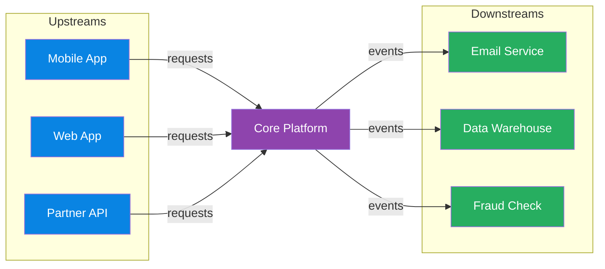

# Architecture & Cloud Patterns

> **Domain**: Software architecture patterns, cloud adoption frameworks, networking topology, system design concepts, and migration strategies.
> **Parent**: [Reference Dictionary](index.md)

---

## Contents

| Term | Anchor |
|:---|:---|
| Business Capability | [`#business-capability`](#business-capability) |
| Business Boundary | [`#business-boundary`](#business-boundary) |
| Service Decomposition | [`#service-decomposition`](#service-decomposition) |
| Service Discovery | [`#service-discovery`](#service-discovery) |
| DDD | [`#ddd`](#ddd) |
| Bounded Context | [`#bounded-context`](#bounded-context) |
| Ubiquitous Language | [`#ubiquitous-language`](#ubiquitous-language) |
| Database Per Service | [`#database-per-service`](#database-per-service) |
| Strangler Fig | [`#strangler-fig`](#strangler-fig) |
| Anti-Corruption Layer | [`#anti-corruption-layer`](#anti-corruption-layer) |
| Architecture Tests | [`#architecture-tests`](#architecture-tests) |
| Modular Monolith | [`#modular-monolith`](#modular-monolith) |
| Shared Kernel | [`#shared-kernel`](#shared-kernel) |
| Sidecar Pattern | [`#sidecar-pattern`](#sidecar-pattern) |
| Ambassador Pattern | [`#ambassador-pattern`](#ambassador-pattern) |
| Well-Architected Framework | [`#well-architected-framework`](#well-architected-framework) |
| CAF | [`#caf`](#caf) |
| Virtual File System (VFS) | [`#virtual-file-system-vfs`](#virtual-file-system-vfs) |
| Microservices | [`#microservices`](#microservices) |
| Monolith | [`#monolith`](#monolith) |
| Distributed Monolith | [`#distributed-monolith`](#distributed-monolith) |
| Native Extension | [`#native-extension`](#native-extension) |
| Technical Debt | [`#technical-debt`](#technical-debt) |
| Upstream System | [`#upstream-system`](#upstream-system) |
| Downstream System | [`#downstream-system`](#downstream-system) |
| Upstream/Downstream Relationship | [`#upstreamdownstream-relationship`](#upstreamdownstream-relationship) |
| Circular Dependency | [`#circular-dependency`](#circular-dependency) |
| Base62 Encoding | [`#base62-encoding`](#base62-encoding) |
| URL Shortener | [`#url-shortener`](#url-shortener) |
| Key Generation Service | [`#key-generation-service`](#key-generation-service) |
| Presence Service | [`#presence-service`](#presence-service) |
| Read/Write Path Separation | [`#readwrite-path-separation`](#readwrite-path-separation) |
| Back-of-the-Envelope Estimation | [`#back-of-the-envelope-estimation`](#back-of-the-envelope-estimation) |
| Coordination Cost | [`#coordination-cost`](#coordination-cost) |
| Forward Deployed Engineer (FDE) | [`#forward-deployed-engineer-fde`](#forward-deployed-engineer-fde) |
| InnerSource | [`#innersource`](#innersource) |
| MoSCoW Method | [`#moscow-method`](#moscow-method) |
| Flash Sale | [`#flash-sale`](#flash-sale) |
| Surge Pricing | [`#surge-pricing`](#surge-pricing) |
| Cooldown | [`#cooldown`](#cooldown) |
| URL Frontier | [`#url-frontier`](#url-frontier) |
| Acceptance-Delivery Separation | [`#acceptance-delivery-separation`](#acceptance-delivery-separation) |
| Frequency Capping | [`#frequency-capping`](#frequency-capping) |
| Transient Metadata Registry | [`#transient-metadata-registry`](#transient-metadata-registry) |
| Route-to-Data Pattern | [`#route-to-data-pattern`](#route-to-data-pattern) |

---

## Business Capability

A cohesive area of business responsibility that delivers a recognizable outcome and can own its rules, data, and change decisions. Business capabilities are a useful starting point for service boundaries because they describe what the organization does rather than how the code is currently layered.

### Key Characteristics
- Has a clear business outcome and vocabulary
- Can be assigned to an accountable team or domain owner
- Groups related rules and data while minimizing cross-boundary coordination

### When to Use
- Decomposing a monolith into services or bounded contexts
- Evaluating whether a proposed service boundary represents a meaningful business unit

### When NOT to Use
- As the only boundary signal; scaling, consistency, team ownership, and operational cost also matter
- For technical utilities that do not represent independent business responsibility

### Also see
- [Bounded Context](#bounded-context) · [Microservices](#microservices) · [Service Decomposition](#service-decomposition)

---

## Service Decomposition

The process of dividing a system into independently owned modules or services using boundaries such as business capabilities, bounded contexts, data ownership, and scaling needs. Good decomposition reduces coordination; splitting by technical layers usually creates a distributed monolith.

### Key Characteristics
- Starts from business responsibilities rather than controllers or implementation layers
- Assigns ownership of behavior and data to one boundary
- Measures coupling through synchronous calls, shared schemas, and coordinated releases

### When to Use
- When team ownership, independent scaling, or release coupling creates a demonstrated need for separate services
- During incremental extraction from a monolith

### When NOT to Use
- Before the domain boundaries and operational requirements are understood
- When a modular monolith can provide the needed boundaries with less operational overhead

### Also see
- [Business Capability](#business-capability) · [Bounded Context](#bounded-context) · [Distributed Monolith](#distributed-monolith)

---

## Service Discovery

A runtime mechanism for locating healthy instances of a service as instances are created, removed, or moved. Discovery replaces hardcoded endpoints with a registry, platform naming layer, or client-side lookup process.

### Key Characteristics
- Tracks service membership and health
- Resolves logical service names to reachable instances
- Requires policies for stale registrations, timeouts, and registry failure

### When to Use
- Dynamically scaled or frequently redeployed service environments
- Systems where static endpoint configuration cannot keep pace with instance changes

### When NOT to Use
- Small, static deployments where stable platform DNS or a load balancer already provides the needed resolution
- Without health checks, timeouts, and a plan for stale discovery data

### Also see
- [Service Mesh](networking.md#service-mesh) · [Load Balancer](networking.md#load-balancer) · [Microservices](#microservices)

---

## DDD

**Domain-Driven Design** — a software design approach centered on domain modeling. The team builds a shared model of the business domain using a precise, agreed-upon language.

**Also see**: [Bounded Context](#bounded-context), [Ubiquitous Language](#ubiquitous-language)

---

## Bounded Context

An **explicit boundary** around a domain model with its own ubiquitous language. Inside the boundary, terms have precise meanings. "Account" in Banking may differ from "Account" in CRM — bounded contexts resolve this.

> **Note**: A bounded context is a *design-time, semantic* boundary (what terms mean). A [Business Boundary](#business-boundary) is a *runtime, operational* boundary (where correctness is enforced). They complement each other: a Payments bounded context defines the language; the business boundary at the database enforces idempotency.

**Also see**: [DDD](#ddd), [Ubiquitous Language](#ubiquitous-language), [Business Boundary](#business-boundary)

---

## Ubiquitous Language

A **shared, precise terminology** between developers and domain experts within a bounded context. The same word means the same thing to everyone — no translation gaps.

**Also see**: [DDD](#ddd), [Bounded Context](#bounded-context) · [Fintech: Financial States](fintech.md#financial-states)

---

## Database Per Service

A **microservices data pattern** where each service owns and manages its own database. No two services share the same logical data store, enforcing service boundaries and independent deployability.

### Key Characteristics
- **Private schema per service** — other services access data only through the service's API or events
- **Technology fit** — each service can choose SQL, NoSQL, or a specialized store based on its access patterns
- **No shared locks or joins** — cross-service consistency is achieved via APIs, sagas, or events
- **Independent scaling and recovery** — one service's database load does not starve another

### When to Use
- Microservices where teams need autonomous deployment and schema evolution
- Domains with heterogeneous data access patterns (e.g., ACID balances + high-write event logs)

### When NOT to Use
- Early-stage monoliths where cross-table joins and transactions dramatically simplify correctness
- When the organization lacks mature API/event contracts and saga compensation design

### Also see
- [Bounded Context](#bounded-context) · [Saga Pattern](data-concurrency.md#saga-pattern) · [Outbox Pattern](cqrs-event-driven.md#outbox-pattern)

---

## Strangler Fig

An **incremental migration pattern** — gradually replace a legacy system by building new functionality around it until the old system is "strangled" and can be removed. Named after the fig tree that grows around a host tree.

**Also see**: [Anti-Corruption Layer](#anti-corruption-layer)

---

## Anti-Corruption Layer

A **translation layer** that protects a bounded context from external model corruption. Translates between the external model and the internal domain model so neither leaks into the other.

**Also see**: [Bounded Context](#bounded-context), [Strangler Fig](#strangler-fig)

---

## Architecture Tests

Automated tests that verify a codebase obeys its declared **architectural boundaries** — for example, that a module's Core project does not reference another module's Infrastructure project. Often implemented with reflection or dependency-analysis libraries (NetArchTest, ArchUnit, NDepend).

### Key Characteristics
- **Rule-driven**: encode constraints such as "Catalog.Core may not reference Orders.Core"
- **Fast feedback**: run in CI like unit tests and fail the build on violation
- **Living documentation**: make the intended architecture explicit and enforceable
- **Boundary preservation**: prevent the gradual erosion that turns a modular monolith into a big ball of mud

### When to Use
- Modular monoliths or layered architectures where compile-time project structure enforces boundaries
- Codebases where implicit dependencies historically caused regressions
- Teams that want architecture review to be automated and deterministic

### When NOT to Use
- Trivial prototypes where project structure overhead outweighs boundary risk
- When rules are too coarse and produce false positives that teams bypass
- As a substitute for clear domain modeling — tests cannot fix wrong boundaries

### Also see
- [Modular Monolith](#modular-monolith) · [Bounded Context](#bounded-context) · [Separation of Concerns](design-patterns.md#separation-of-concerns)

---

## Modular Monolith

A **single deployment unit** organized internally into clear, self-contained modules aligned to business capabilities or bounded contexts. Each module owns its own domain logic, data access and public contract, but the application is built and deployed as one artifact.

### Key Characteristics
- **Single deployable unit**: one build, one deployment, one runtime process
- **Strong internal boundaries**: modules communicate only through published contracts or events
- **In-process performance**: cross-module calls are method calls, avoiding network latency and serialization
- **Optional extraction path**: a well-isolated module can later be extracted into a separate service when scale or team autonomy demands it

### When to Use
- New products where domain boundaries are still emerging
- Teams without the platform maturity to operate many services
- Workloads where cross-module transactions and joins are common
- Scenarios that need the simplicity of a monolith with the maintainability of clean boundaries

### When NOT to Use
- When independent scaling, deployment or technology choice for a module is already a hard requirement
- Large organizations where multiple autonomous teams are blocked by a shared deployment cadence
- When a single component must scale by orders of magnitude independently

### Also see
- [Monolith](#monolith) · [Microservices](#microservices) · [Bounded Context](#bounded-context) · [Shared Kernel](#shared-kernel) · [Architecture Tests](#architecture-tests)

---

## Shared Kernel

A small, stable subset of the domain model that is **intentionally shared across bounded contexts** because duplicating it would be more costly than coordinating changes. Contains cross-cutting infrastructure, common data types and base classes — but never business logic that belongs inside a specific module.

### Key Characteristics
- **Minimal surface area**: only truly common concepts live in the shared kernel
- **Stable and carefully governed**: changes affect every consumer, so they require coordination
- **No domain logic**: business rules stay inside their owning bounded contexts
- **Infrastructure-friendly**: authentication, logging, base entity types and common DTO primitives are typical residents

### When to Use
- Multiple bounded contexts need the same fundamental concepts (e.g., money, identifiers, base entity behavior)
- Cross-cutting infrastructure concerns are genuinely reused and stable
- The cost of coordination is lower than the cost of duplication and drift

### When NOT to Use
- As a dumping ground for code that does not clearly belong anywhere
- To share business logic that should live inside one bounded context
- When teams cannot agree on ownership and change governance

### Also see
- [Bounded Context](#bounded-context) · [DDD](#ddd) · [Ubiquitous Language](#ubiquitous-language) · [Modular Monolith](#modular-monolith)

---

## Sidecar Pattern

A **co-located helper container** that supports the main application. Deployed alongside in the same pod (Kubernetes). Example: Envoy proxy handling TLS, routing, and observability for the app container.

**Also see**: [Ambassador Pattern](#ambassador-pattern)

---

## Ambassador Pattern

A **proxy service** that handles connectivity concerns (retry, routing, authentication) on behalf of the main service. Offloads cross-cutting network concerns from the application.

**Also see**: [Sidecar Pattern](#sidecar-pattern)

---

## Well-Architected Framework

Azure's **five pillars** of architectural excellence:

| Pillar | Focus |
|:---|:---|
| **Reliability** | Recover from failures, high availability |
| **Security** | Protect data, identities, and infrastructure |
| **Cost Optimization** | Maximize value, minimize waste |
| **Operational Excellence** | Run and monitor systems in production |
| **Performance Efficiency** | Adapt to changing workload demands |

**Also see**: [CAF](#caf)

---

## CAF

**Cloud Adoption Framework** — Microsoft's structured methodology for cloud adoption: Strategy → Plan → Ready → Adopt → Govern → Manage.

**Also see**: [Well-Architected Framework](#well-architected-framework)

---

## Virtual File System (VFS)

A kernel-level abstraction layer in Linux that provides a single unified interface (`struct file_operations`) for all filesystem operations, allowing hundreds of different filesystem implementations (ext4, btrfs, NFS, etc.) to coexist behind a common contract. One of the most elegant examples of clean abstraction at scale.

### Key Characteristics

- **Unified interface**: Every filesystem implements the same `file_operations` struct — `open`, `read`, `write`, `release` — regardless of underlying storage
- **Contract-enforced**: The abstraction doesn't leak; it defines a contract and enforces it, enabling Linux to grow for 30+ years without collapsing under its own weight
- **Pluggable backends**: New filesystems can be added without modifying any calling code, making the kernel extensible at the storage layer

### When to Use

- Designing systems where multiple backend implementations must be interchangeable behind a stable API
- When the data model (what is stored) should remain stable while storage strategies (how it's stored) evolve
- Architectural patterns requiring the Strategy pattern at the OS or platform layer

### When NOT to Use

- When the abstraction overhead (vtable dispatch, indirection) is unacceptable for hot-path performance
- Simple systems with only one storage backend where the abstraction cost outweighs flexibility gains
- When backend-specific features need to be exposed directly to callers (the abstraction hides them)

### Also see

- [Event Loop](concurrency-runtimes.md#event-loop) — another example of deliberate architectural simplicity
- [Content-Addressable Storage](ai-ml-llm.md) — Git's complementary data model

---

## Microservices

An architectural style that structures an application as a **collection of loosely coupled services**, each aligned to a business capability, owning its own data and deployable independently.

### Key Characteristics
- **Service boundaries**: usually aligned to bounded contexts or business capabilities
- **Independent deployability**: teams can release, scale and fail over services separately
- **Polyglot persistence**: each service may choose the data store that fits its access patterns
- **Operational overhead**: requires observability, CI/CD, service discovery and graceful degradation

### When to Use
- Large engineering organizations with multiple autonomous teams
- Domains with independently scaling or evolving subsystems

### When NOT to Use
- Early-stage products where a monolith is faster to build and iterate
- When the organization lacks the platform maturity to operate dozens of services

**Also see**: [Monolith](#monolith), [Database Per Service](#database-per-service), [Bounded Context](#bounded-context)

---

## Monolith

A single deployable unit in which all functionality, data access and business logic runs together. A well-factored monolith is often the fastest and simplest path to product-market fit.

### Key Characteristics
- **Single codebase and deployment unit**: everything ships together
- **In-process communication**: no network calls between modules
- **Simpler transactions and consistency**: ACID across the whole data model
- **Can be modular**: a “modular monolith” has clear internal boundaries without service boundaries

### When to Use
- Small teams, early-stage products and rapid iteration
- Domains where cross-module transactions and joins are frequent

### When NOT to Use
- When multiple teams are blocked by a shared deployment cadence
- When one component needs to scale independently by orders of magnitude

**Also see**: [Microservices](#microservices), [Modular Monolith](#modular-monolith), [Strangler Fig](#strangler-fig)

---

## Distributed Monolith

A **microservices anti-pattern** in which a system is decomposed into separate deployable services but retains tight coupling across service boundaries — delivering the operational complexity of microservices (network overhead, independent deployments, distributed tracing) without the primary benefit: **team and deployment independence**.

### Key Characteristics
- **Shared database schemas** across service boundaries — services join across tables they do not own
- **Synchronous call chains**: Service A calls B calls C; a failure in C propagates to A
- **Coordinated deployments**: deploying one service requires deploying or approving others
- **Implicit contract coupling**: changes to shared libraries or schemas ripple across all consumers
- **Cascading failures**: a single slow downstream service saturates upstream thread pools

### Warning Signs
- You maintain a deployment order spreadsheet
- An on-call incident involves engineers from 3+ services simultaneously
- A two-line config change requires a multi-team Slack war room
- Services share a Postgres schema or an ORM model class

### When to Use
Not applicable — this is an anti-pattern to detect and remediate.

### When NOT to Use
Always avoid. Prefer bounded contexts with database-per-service and async event integration.

### Also see
- [Microservices](#microservices) · [Monolith](#monolith) · [Deployment Coupling](deployment-patterns.md#deployment-coupling) · [Database Per Service](#database-per-service) · [Bounded Context](#bounded-context) · [Strangler Fig](#strangler-fig)
- [Microservices & Service Design — Key Takeaways](../system-design-architecture/48-svc-distributed-monolith-key-takeaways.md#svc-01-distributed-monolith-anti-pattern)

---

## Native Extension

A **compiled module** (written in a language such as Rust, C, C++, or Cython) that is called from a higher-level runtime to execute a hot or CPU-bound function without rewriting the entire application.

### Key Characteristics
- **Surgical optimization**: targets a single bottleneck function or small module rather than the whole service.
- **FFI boundary**: the extension exposes a callable interface to the host runtime (e.g., Python via PyO3/Cython, Node.js via N-API, Ruby via C extensions).
- **Lower operational churn**: the existing service boundary, deployment pipeline, and team fluency stay mostly intact.

### When to Use
- A profile shows that one CPU-bound function dominates latency or cost.
- The service changes frequently and a full rewrite would impose an unacceptable velocity tax.
- The team needs most of the rewrite’s performance win with a fraction of its cost.

### When NOT to Use
- When the bottleneck is I/O, an algorithm, or a missing index — fixing the root cause is cheaper than adding a foreign build.
- When the FFI and build-tooling complexity outweighs the savings (small or rarely executed functions).

### Also see
- [Strangler Fig](#strangler-fig) · [Anti-Corruption Layer](#anti-corruption-layer) · [Tokio](concurrency-runtimes.md#tokio) · [Microservices Runtime Performance — Python to Rust Rewrite Takeaways](../system-design-architecture/60-perf-key-takeaways.md#perf-11-native-extension-as-middle-path)

---

## Technical Debt

The **accumulated cost of shortcuts or suboptimal design decisions** that make future changes slower, riskier or more expensive. Like financial debt, it can be strategic if it is tracked and paid down.

### Key Characteristics
- **Visible inventory**: a debt register with estimated impact, risk and payback plan
- **Intentional and accidental**: some debt is taken deliberately to meet a deadline; some is discovered later
- **Interest grows**: untreated debt compounds as the system evolves around it

### When to Use
- Strategic short-term trade-offs with a clear repayment plan
- Refactoring work prioritized by risk and velocity impact

### When NOT to Use
- As an excuse to skip testing, documentation or security in every sprint
- Without a plan to pay it down — unchecked debt becomes a rewrite trigger

**Also see**: [Strangler Fig](#strangler-fig), [Monolith](#monolith), [Microservices](#microservices)

---

## Upstream System

A system or component that **produces data, events or requests that flow into another system**. The upstream direction is the source side of a dependency: if system A calls or emits data that system B consumes, A is upstream of B.

### Key Characteristics
- **Caller / producer / source** in a data or control flow
- **Depends on by downstream**: changes in upstream output can break downstream consumers
- **Context-relative**: the same service can be upstream to one system and downstream to another

### When to Use
- Talking about service dependencies, data lineage, event pipelines or API call chains
- Defining ownership and SLOs (upstream availability affects downstream reliability)

### When NOT to Use
- As a synonym for “client” or “server” without explaining the direction of data flow
- In isolation without clarifying what the dependency relationship actually is

**Also see**: [Downstream System](#downstream-system), [API Gateway](#api-gateway), [Microservices](#microservices)

---

## Downstream System

A system or component that **consumes data, events or requests from another system**. The downstream direction is the consumer side of a dependency: it receives what upstream systems produce.

### Key Characteristics
- **Callee / consumer / sink** in a data or control flow
- **Affected by upstream changes**: schema changes, latency or outages upstream propagate downstream
- **Context-relative**: the same service can be downstream to one system and upstream to another

### When to Use
- Discussing consumers of events, API clients, data subscribers or pipeline outputs
- Planning backward compatibility, fan-out and error handling

### When NOT to Use
- As a synonym for “backend” or “frontend” without describing the flow direction
- When the relationship is peer-to-peer and has no clear producer/consumer direction

### Also see
- [Upstream System](#upstream-system) · [Messaging](messaging.md) · [Event-Driven Architecture](cqrs-event-driven.md#event-driven-architecture)

---

## Upstream/Downstream Relationship

**Diagram description**: Upstream systems (Mobile App, Web App, Partner API) send requests into a Core Platform (purple). The Core Platform then emits events to downstream systems (Email Service, Data Warehouse, Fraud Check) shown in green. Arrows follow the direction of data/control flow from upstream producers to downstream consumers.

---

## Circular Dependency

A situation where two or more components **mutually depend on each other**, directly or transitively. In distributed systems, circular dependencies are especially dangerous when they cross infrastructure boundaries — for example, an observability stack that depends on the same service-discovery layer it monitors. When the dependency fails, the monitoring goes dark, and operators lose the ability to diagnose the very failure that took it down.

### Key Characteristics
- **Direct**: A depends on B, B depends on A
- **Transitive**: A → B → C → A (harder to detect)
- **Infrastructure coupling**: the monitoring plane shares fate with the data plane it observes

### When to Use
- Never intentionally — circular dependencies are an anti-pattern. Always break them with an intermediate abstraction, event bus, or separate infrastructure plane.

### When NOT to Use
- Circular dependencies should be eliminated, not tolerated. Even "stable" circular dependencies create fragility under failure conditions.

### Also see
- [Observability](../reference-dictionary/observability.md#observability) · [Bulkhead](../reference-dictionary/resilience.md#bulkhead) · [Sidecar Pattern](#sidecar-pattern)

---

## Base62 Encoding

A binary-to-text encoding scheme that uses 62 characters: `0-9`, `a-z`, and `A-Z`. It produces shorter strings than Base64 (which uses 64 characters including `+` and `/`) while remaining URL-safe and human-readable. Commonly used to compress large numeric IDs into short tokens.

### Key Characteristics
- **Alphabet**: 62 URL-friendly characters
- **Compactness**: `62^7 ≈ 3.5 trillion` unique 7-character codes
- **Lexicographic ambiguity**: Case-sensitive (`a` ≠ `A`)

### When to Use
- Short URL aliases, invite codes, reference numbers
- Anywhere a large numeric ID needs a compact, shareable string

### When NOT to Use
- When case insensitivity is required (use Base36)
- When cryptographic entropy is required (use random tokens or hashes)

**Also see**: [URL Shortener](#url-shortener) · [Database ID Generation Strategies](../system-design-architecture/databases/database-id-strategy.md)

---

## URL Shortener

A system that maps long URLs to short, unique aliases and redirects users from the alias to the original URL. The classic design problem separates a write-heavy shortening path from a read-heavy redirect path, using pre-generated IDs, cache-aside reads, and asynchronous analytics.

### Key Characteristics
- **Read-heavy**: Redirect traffic dominates writes (often 100:1)
- **Immutable mappings**: Short codes rarely change after creation
- **Global uniqueness**: No two long URLs may share the same alias
- **Low-latency redirects**: Served from cache at the edge

### When to Use
- Link sharing, tracking, branding (e.g., `short.ly/abc123`)
- Any scenario requiring compact, memorable references to long resources

### When NOT to Use
- When the original URL must be hidden from the service operator
- When deterministic, collision-free generation is impossible to guarantee

**Also see**: [Base62 Encoding](#base62-encoding) · [Key Generation Service](#key-generation-service) · [Cache-Aside Pattern](../reference-dictionary/caching.md#cache-aside-pattern) · [Database ID Generation Strategies](../system-design-architecture/databases/database-id-strategy.md)

---

## Key Generation Service

A dedicated service responsible for producing unique identifiers or tokens at scale. In a URL shortener, it pre-allocates disjoint ranges of numeric IDs to workers, who encode them locally as short aliases. This eliminates collision checks on the write path.

### Key Characteristics
- **Range allocation**: Coordinator assigns blocks of IDs to workers
- **Local incrementing**: Workers generate IDs without network calls
- **Fault tolerance**: Lost unused ranges are acceptable at large namespace sizes

### When to Use
- Systems requiring billions of unique, short tokens
- Workloads where write latency and collision-freedom are both critical

### When NOT to Use
- When UUIDs or database sequences are sufficient
- When centralized ID assignment is acceptable and simpler

**Also see**: [URL Shortener](#url-shortener) · [Database ID Generation Strategies](../system-design-architecture/databases/database-id-strategy.md)

---

## Presence Service

A component that tracks which users are currently online, on which devices, and which server or gateway holds their active connection.

### Key Characteristics
- Updated by heartbeats, WebSocket pong events, or explicit connect/disconnect
- Typically uses TTL-backed storage to survive unclean disconnects
- Essential for routing real-time messages and showing online status

### When to Use
- Chat, gaming, collaboration, and live collaboration tools
- Any system that needs connection-aware routing

### When NOT to Use
- Stateless request/response APIs without long-lived connections
- When approximate presence is unacceptable

### Also see
- [Redis Streams](messaging.md#redis-streams) · [Fanout on Write](#fanout-on-write)

---

## Read/Write Path Separation

**Read/Write Path Separation** is an architectural pattern where the systems handling write operations are physically or logically separated from those handling read operations. Each path is optimized for fundamentally different concerns: the write path prioritizes durability, consistency, and correctness; the read path prioritizes low latency, massive throughput, and responsiveness.

### Key Characteristics
- **Write path** focuses on: durability, consistency, ordering, data correctness, transactional integrity
- **Read path** focuses on: low latency, massive throughput, fast responses, eventual consistency
- **Asymmetric scaling**: Read replicas can scale horizontally independently of the write master
- **CQRS is the formalized version**: Command Query Responsibility Segregation explicitly separates command (write) models from query (read) models

### When to Use
- Read-heavy workloads where reads outnumber writes by 100:1 or more (e.g., election results, news feeds, leaderboards)
- Systems where write consistency requirements conflict with read performance requirements
- National-scale events where millions of concurrent reads would overwhelm a single database

### When NOT to Use
- Write-heavy OLTP systems where read volume is low and read-your-writes consistency is critical
- Simple CRUD applications where the added complexity of separate paths exceeds the benefit
- Early-stage products where the read/write ratio is unknown or unvalidated

### Also see
- [CQRS](cqrs-event-driven.md#cqrs) · [Read Model](cqrs-event-driven.md#read-model) · [Caching](caching.md) · [Database Per Service](#database-per-service)

---

## Back-of-the-Envelope Estimation

A **rough, order-of-magnitude calculation** performed before designing any architecture. Uses simplified math to estimate traffic (QPS), storage, bandwidth, and memory requirements — typically converting DAU into reads/sec using the approximation `daily total / 86,400 ≈ average QPS`, then multiplying by a peak factor (3–5×) for worst-case planning.

### Key Characteristics
- **Order-of-magnitude precision**: The goal is within 2× of reality, not exact numbers — this is sufficient for architectural decisions
- **Peak multiplier**: Average QPS × (3–5) for peak load; 80/20 rule for cache coverage estimation
- **Guides component selection**: Tells you whether a single database, cache, queue, or CDN is plausible
- **Prevents over-engineering**: If a single PostgreSQL instance can handle the load, don't propose sharding

### When to Use
- System design interviews: BEFORE drawing any architecture diagram
- Early-stage capacity planning: do you need 1 server or 100?
- Reality-checking architectural proposals: "We need multi-region active-active for 1K DAU" — the math says no

### When NOT to Use
- As a substitute for load testing with real traffic patterns
- When exact numbers are available from production monitoring (use real data)
- For latency guarantees (estimation covers throughput and storage, not p99 latency)

### Also see
- [Scalability Principles](#) · [Read/Write Path Separation](#read-write-path-separation) · [Latency vs Throughput](#)
- [System Design Interview Roadmap](../system-design-architecture/system-design-interview/interview-roadmap.md#sdi-05-back-of-the-envelope-math)

---

## Business Boundary

The **layer or component within a distributed system where business correctness is enforced**. In event-driven payment systems, the business boundary is the database — not the message broker. Kafka provides delivery guarantees, but idempotency, deduplication, and transaction integrity must be enforced at the database/application layer, because exactly-once semantics stop at Kafka's boundary.

> **Key insight**: "Kafka will deliver it once" is not a correctness guarantee. The question is always "What happens if it doesn't?"

### Key Characteristics
- **Separation of concerns**: Event delivery (messaging), business correctness (database), external side effects (gateway wrappers) are three independent responsibilities
- **Database as authority**: The database's unique constraints on business identifiers are the single source of truth — not the message broker's delivery guarantees
- **Offset-agnostic**: Offset management tracks progress, not correctness; idempotency must live outside the messaging layer
- **Testable**: Correctness becomes independently verifiable without depending on the message broker

### When to Use
- Payment systems and financial applications where duplicate processing is unacceptable
- Any distributed system where at-least-once delivery is the norm and consumers run in parallel
- When integrating with external systems (payment gateways, ledgers) that may not be natively idempotent

### When NOT to Use
- Systems where the message broker and database are the same system (e.g., using Kafka Streams state stores exclusively)
- Truly fire-and-forget workloads where duplicates have no business consequence
- When the messaging infrastructure provides end-to-end transactional guarantees that extend to all external systems (rare in practice)

### Also see
- [Idempotency](cqrs-event-driven.md#idempotency) · [Exactly-Once Semantics](messaging.md#exactly-once-semantics) · [Idempotent Consumer](messaging.md#idempotent-consumer) · [At-Least-Once Delivery](messaging.md#at-least-once-delivery) · [Database-as-Guardrail Pattern](data-architecture.md#database-as-guardrail-pattern)
- [Bounded Context](#bounded-context) — the semantic counterpart: bounded context defines *what terms mean*; business boundary defines *where correctness is enforced*

---

---

## Coordination Cost

The **organizational and runtime overhead required to keep multiple components, services, or teams aligned** as a system grows. Coordination cost rises with the number of interaction paths — every new service, repository, or team boundary adds potential failure modes, communication delays, and deployment dependencies.

### Key Characteristics

- **Compounds through interactions**: complexity grows with relationships, not just component count
- **Spans technology and people**: includes service-to-service contracts, cross-team approvals, and shared release schedules
- **Hidden until it hurts**: often manifests as slow delivery, production incidents, or duplicated work rather than obvious technical debt
- **Reduced by boundaries and contracts**: modular monoliths, stable APIs, and event-driven decoupling lower coordination pressure

### When to Use

- Evaluating whether to split a monolith or keep modules in-process
- Designing ownership boundaries so teams can ship independently
- Explaining why a "simple" microservice architecture is slowing the organization down

### When NOT to Use

- As an excuse to avoid necessary distribution when genuine scale, regulatory, or team-autonomy constraints exist
- When the real bottleneck is implementation quality rather than cross-component coordination

### Also see

- [Modular Monolith](#modular-monolith) · [Distributed Monolith](#distributed-monolith) · [Microservices](#microservices) · [Loose Coupling](../design-patterns.md#loose-coupling)
- [Architecture Principles](../system-design-architecture/software-architecture/architecture-principles.md) · [29-arch-key-takeaways.md](../system-design-architecture/29-arch-key-takeaways.md)

---

## Forward Deployed Engineer (FDE)

An engineering role where the engineer **embeds directly within customer ecosystems**, writing production code alongside the customer's own engineering teams to customize solutions, perform intense troubleshooting, and accelerate product adoption in high-stakes environments — as opposed to providing professional services on an on-demand basis.

### Key Characteristics
- Works hand-in-hand with customer engineering teams rather than at arm's length
- Writes production-grade code, not just demos or prototypes
- Acts as enterprise architect, high-trust client partner, and hands-on engineer simultaneously
- Tightly integrated into customer ecosystem to solve real-world problems realistically
- Bridges the gap between customer deployment realities and long-term platform engineering health

### When to Use
- Enterprise SaaS/platform companies selling to B2B and B2C/B2B2C customers
- High-stakes deployments with aggressive timelines and shifting requirements
- When customers need deep technical customization beyond what professional services can provide

### When NOT to Use
- Simple product implementations that standard customer success teams can handle
- When the customer does not have the engineering maturity to collaborate at a code level
- Short-term, transactional engagements that don't require deep integration

### Also see
- [InnerSource](#innersource)
- [Technical Debt](#technical-debt)
- [Anti-Corruption Layer](#anti-corruption-layer)

---

## InnerSource

Applying **open-source collaboration practices** (transparent code reviews, shared repositories, cross-team contributions) **within an organization's firewall**. InnerSource enables teams to contribute improvements back to core platforms rather than creating isolated forks or workarounds.

### Key Characteristics
- Code is visible and searchable across the organization
- Contributions follow structured review processes like open-source pull requests
- Encourages cross-team collaboration without sacrificing organizational boundaries
- Reduces duplication by making platform improvements discoverable and reusable

### When to Use
- Large organizations with multiple engineering teams building on shared platforms
- When forward-deployed or field teams need to upstream customer-driven improvements
- Platform teams wanting to scale contributions beyond their immediate team

### When NOT to Use
- Tiny organizations where everyone already works in the same repo
- Highly regulated environments where code visibility must be strictly compartmentalized
- When the overhead of cross-team review outweighs the benefit of shared contributions

### Also see
- [Forward Deployed Engineer (FDE)](#forward-deployed-engineer)
- [Shared Kernel](#shared-kernel)
- [Single Source of Truth](design-patterns.md#single-source-of-truth)

---

## MoSCoW Method

A **prioritization framework** that classifies requirements into four buckets: **M**ust have (non-negotiable), **S**hould have (high priority but can be deferred if necessary), **C**ould have (desirable but not critical), and **W**on't have (explicitly out of scope for the current iteration). Used to manage scope under tight deadlines.

### Key Characteristics
- Forces explicit trade-off discussions rather than treating all requirements as equal
- Tier-1 (Must have) items represent the minimum viable delivery
- Provides a structured vocabulary for negotiating scope with stakeholders
- Can be applied to data attributes, features, or any decomposable requirement set

### When to Use
- High-pressure projects with aggressive, non-negotiable deadlines
- When stakeholders keep adding requirements without acknowledging timeline impact
- Data pipeline projects where some fields are compliance-critical and others are nice-to-have analytics

### When NOT to Use
- Exploratory projects where priorities are genuinely unknown and need discovery
- When stakeholders will simply mark everything as "Must" — the framework only works with honest classification
- Trivial projects with few requirements and no prioritization pressure

### Also see
- [YAGNI](design-patterns.md#yagni)
- [Separation of Concerns](design-patterns.md#separation-of-concerns)
- [Technical Debt](#technical-debt)

---

## flash sale

A time-limited, high-traffic sales event where a limited quantity of inventory is offered at significant discount, creating extreme concurrency contention as thousands of buyers compete for a small number of items simultaneously.

### Key Characteristics

- Extreme read/write contention on hot SKUs — orders of magnitude more requests than available inventory
- Requires multi-layer defense: edge traffic shaping → queue serialization → atomic reservation → authoritative DB
- Inventory correctness is paramount; selling the 101st of 100 items is worse than rejecting legitimate buyers
- Typically paired with reservation-expiry workflows to handle payment failures and abandoned checkouts

### When to Use

- Time-limited promotional events with fixed, known inventory caps
- Scenarios where inventory correctness trumps latency (selling too many is worse than being slow)
- Systems that can preload inventory into a fast edge cache (Redis) before the event

### When NOT to Use

- Continuously available inventory with no time pressure — standard e-commerce patterns suffice
- Unbounded or dynamically restocked inventory where exact counts are less critical
- Low-traffic systems where the overhead of multi-layer defense outweighs the risk

### Also see

- [Overselling](data-concurrency.md#overselling)
- [Inventory Reservation](data-concurrency.md#inventory-reservation)
- [Atomic Conditional Update](data-concurrency.md#atomic-conditional-update)
- [Cache-Aside Pattern](caching.md#cache-aside)

---

## Surge Pricing

---

## Surge Pricing

A dynamic pricing strategy that adjusts prices in real time based on the ratio of demand to supply within a geographic region. When demand exceeds supply, prices rise to incentivize more supply (drivers) and reduce demand (price-sensitive riders), clearing the market at a new equilibrium.

### Key Characteristics

- **Market-clearing mechanism**: Prices rise until supply matches demand — ensures service availability even during demand spikes
- **Per-region computation**: Demand and supply are measured per geographic cell (geohash/H3), not globally — a rainstorm in one neighborhood does not affect prices city-wide
- **Real-time feedback loop**: Rider acceptance rates and driver movement are continuously monitored to tune the multiplier — the system is constantly seeking equilibrium
- **Smoothing required**: Without damping (EMA, cooldown, adjacency adjustment), aggressive price changes cause driver/rider oscillation and price whiplash

### When to Use

- Ride-hailing and delivery platforms where supply (drivers/couriers) is elastic but responds to price signals
- Any marketplace with real-time supply-demand mismatch and elastic supply-side participation
- Event-driven demand spikes (concerts, sports, weather) where fixed pricing would cause service degradation

### When NOT to Use

- Markets where supply is inelastic (cannot respond to price signals in relevant timeframe)
- Essential services where price discrimination raises ethical or regulatory concerns (emergency services, healthcare)
- Situations where the latency of price computation exceeds the event duration (pricing updates slower than the demand spike itself)

### Also see

- [Geohash](geospatial.md#geohash) · [Exponential Moving Average](../reference-dictionary/ai-ml-llm.md#exponential-moving-average) · [Cooldown](#cooldown) · [Sliding Window](../reference-dictionary/api-design.md#sliding-window)

---

## Cooldown

A minimum interval between successive state changes in a control system. In dynamic pricing, a cooldown period (typically 2–5 minutes) prevents a surge multiplier from changing more than once per cycle — blocking rapid see-sawing caused by positive feedback between price signals and driver/rider behavior.

### Key Characteristics

- **Minimum hold time**: Once a value is set, it cannot change again until the cooldown interval elapses — regardless of new input
- **Oscillation prevention**: Primary defense against control-system instability in feedback loops where output (price) influences input (driver/rider behavior)
- **Configurable per domain**: Shorter cooldowns (2 min) for fast-moving urban markets; longer (5 min) for suburban areas with slower driver response
- **Works with damping**: Typically paired with EMA smoothing — cooldown is a hard gate, EMA is a soft blend

### When to Use

- Dynamic pricing systems where user behavior creates a feedback loop with the pricing signal
- Auto-scaling policies to prevent thrashing (scale-up followed immediately by scale-down)
- Feature flag toggles or circuit breaker state transitions to prevent rapid flapping

### When NOT to Use

- Systems where instantaneous response to genuine state changes is safety-critical (e.g., emergency shutdown)
- Low-latency trading systems where cooldown would create arbitrage opportunities
- Situations where the cooldown duration exceeds the timescale of the phenomenon being controlled

### Also see

- [Exponential Moving Average](../reference-dictionary/ai-ml-llm.md#exponential-moving-average) · [Surge Pricing](#surge-pricing) · [Circuit Breaker](../reference-dictionary/resilience.md#circuit-breaker)

---

## URL Frontier

The **central URL queue and scheduling subsystem of a distributed web crawler** that manages the collection of URLs to be crawled, ensuring both crawl **politeness** (never overloading any single web server) and **prioritization** (crawling the most relevant, high-quality, or frequently updated pages first).

### Key Characteristics
- **Dual-Queue Architecture (Mercator pattern)**:
  - **Priority Queues (Front Queues)**: Assigns URLs to priority levels based on PageRank, freshness, domain authority, or update frequency
  - **Politeness Queues (Back Queues)**: Organizes URLs by target domain/host name, ensuring that each host queue is drained by at most one worker with a mandatory polite inter-request delay
- **Deduplication Filter**: Integrated Bloom filters and fingerprint stores prevent re-enqueueing previously crawled or queued URLs
- **Queue Router & Selector**: Continuously maps prioritized URLs from front queues into host-specific back queues

### When to Use
- Large-scale distributed web search crawlers (Google, Bing, Common Crawl)
- E-commerce price intelligence spiders and enterprise knowledge discovery engines
- Security vulnerability scanners and web archive indexing

### When NOT to Use
- Simple single-site scrapers crawling a handful of static pages
- Direct API ingestion pipelines with structured feeds (RSS, Kafka)

### Also see
- [Politeness Policy](networking.md#politeness-policy) · [Robots Exclusion Protocol](networking.md#robots-exclusion-protocol) · [SimHash](databases.md#simhash)

---

## Acceptance-Delivery Separation

An architectural design principle that decouples the fast, synchronous request-acceptance boundary from the slow, high-latency execution and delivery boundary in fanout and bulk operation systems.

### Key Characteristics
- **Bounded API latency**: The API validates the request, records the intent into a durable store/queue, and returns immediately (e.g., HTTP 202 Accepted) in milliseconds.
- **Independent tier scaling**: The API tier scales based on request volume, while the worker delivery tier scales independently based on downstream throughput and queue depth.
- **Failure boundary isolation**: Slowdowns, retries, or rate limiting in downstream third-party delivery do not block client request threads or degrade API availability.

### When to Use
- Workloads where a single client action triggers massive follow-up work (bulk notifications, marketing campaigns, report generation, video transcoding).
- Any API endpoint where downstream dependencies have variable or high network latency.

### When NOT to Use
- Synchronous transactional operations (e.g. ATM cash withdrawal) where the client requires immediate, strict confirmation of completion.
- Trivial, sub-millisecond computations where introducing asynchronous queuing adds unnecessary infrastructure complexity.

### Also see
- [Worker Self-Throttling](messaging.md#worker-self-throttling) · [Progressive Enqueuing](messaging.md#progressive-enqueuing) · [Dead Letter Queue (DLQ)](messaging.md#dead-letter-queue-dlq) · [Microservices](#microservices)

---

## Frequency Capping

An advertising and rate-limiting policy that restricts the number of times a specific advertisement, creative, or campaign is shown to a given user, household, or profile within a defined time window (e.g., maximum 3 impressions per user per 24 hours).

### Key Characteristics
- **Real-time Stateful Counting**: Tracks impression events across user profiles and campaigns with low-latency rolling counters (typically stored in Redis, Hazelcast, or stream-state stores)
- **Closed-Loop Feedback**: Downstream ad impression events feed near real-time state back to the ad selection/decision engine to prevent over-exposure on subsequent ad breaks
- **Multi-Level Scoping**: Configurable across diverse hierarchy levels — per ad creative, per campaign, per advertiser, or per network category

### When to Use
- Ad-supported video streaming platforms (AVOD/SVOD), display networks, and sponsored product engines
- Marketing automation and promotional push campaigns to prevent user notification fatigue
- Budget pacing systems where over-delivery burns advertiser budgets prematurely

### When NOT to Use
- Mandatory service announcements or security alerts (e.g., 2FA codes, password reset confirmations) where delivery cannot be throttled
- Simple static rate limiting on API keys where standard fixed/sliding window algorithms suffice without business hierarchy scoping

### Also see
- [Rate Limiting](api-design.md#rate-limiting) · [Stream Sessionization](messaging.md#stream-sessionization) · [Server-Side Ad Insertion (SSAI)](media-processing.md#server-side-ad-insertion-ssai)

---

## Transient Metadata Registry

An architectural pattern (a specialized application of the Claim Check pattern) where rich, contextual metadata generated during synchronous request decisioning is persisted into a low-latency, transient Key-Value store, while client devices or message payloads receive only lightweight reference identifiers.

### Key Characteristics
- **Lightweight Reference Tokens**: Clients cache and exchange opaque tokens containing minimal identifiers (e.g., `ad_id`, `record_id`, `event_name`) instead of fat JSON/Protobuf tracking payloads
- **Mitigates Client Memory & Bandwidth Bloat**: Prevents large tracking URL arrays and verification configurations from bloating mobile/smart TV heap memory and cellular network data
- **Asynchronous Hydration**: Downstream telemetry handlers fetch full tracking records from the transient store on-demand when client callbacks arrive
- **TTL-Based Storage**: Records are automatically evicted after the maximum allowable session duration (e.g., 2–6 hours), keeping infrastructure lightweight

### When to Use
- Telemetry and event tracking systems where complex verification, attribution, or third-party callback URLs must be mapped to device actions
- Systems communicating with memory-constrained client runtimes (embedded devices, smart TVs, mobile SDKs)
- Microservice pipelines where passing large payload blobs through intermediate message hops would degrade network and queue throughput

### When NOT to Use
- Immutable historical audit logs requiring permanent durable persistence
- Systems where the metadata is tiny (<100 bytes) and the additional network round-trip to the KV store outweighs the serialization saving

### Also see
- [Claim Check](messaging.md#claim-check) · [Read/Write Path Separation](#readwrite-path-separation) · [Server-Side Ad Insertion (SSAI)](media-processing.md#server-side-ad-insertion-ssai)

---

## Route-to-Data Pattern

A distributed systems architecture pattern where requests or telemetry events are routed to the specific region, cluster, or node that holds the authoritative state, rather than replicating the entire state globally across all regions.

### Key Characteristics
- **Origin-Tagged Tokens / Metadata**: Requests or opaque client tokens are embedded with an immutable origin tag (e.g., `serving_region: "us-east-1"`) during initial interaction.
- **Edge Region Inspection & Forwarding**: When a roaming client lands in a different region (e.g., cellular handover), regional ingress gateways inspect the origin tag and forward the request across the cloud backbone to the state-holding region.
- **Eliminates Global State Replication Overhead**: Avoids broadcasting ephemeral data across multi-region databases or Kafka clusters, eliminating >99% of cross-region storage, synchronization, and compute costs.
- **Localised In-Memory Joins**: Keeps stateful processing engines (such as Flink stream joins or cache lookups) strictly local to each region while still supporting globally mobile clients.

### When to Use
- Multi-region event streaming architectures where client devices frequently roam across geographical boundaries during an active session (streaming video, live gaming, IoT fleet tracking).
- Stateful stream joins where decision logs or transient state reside locally in the original serving region.
- Workloads where the volume of local interactions drastically exceeds the volume of cross-region roamers (>99% vs <1%).

### When NOT to Use
- Highly read-heavy global static content where edge CDN caching or multi-region read replicas provide superior latency for all users.
- Mission-critical disaster recovery where state must be continuously active in multiple standby regions simultaneously.

### Also see
- [Transient Metadata Registry](#transient-metadata-registry) · [Stream-Stream Join](messaging.md#stream-stream-join) · [Message Routing](messaging.md#message-ordering) · [Sidecar Pattern](#sidecar-pattern)

