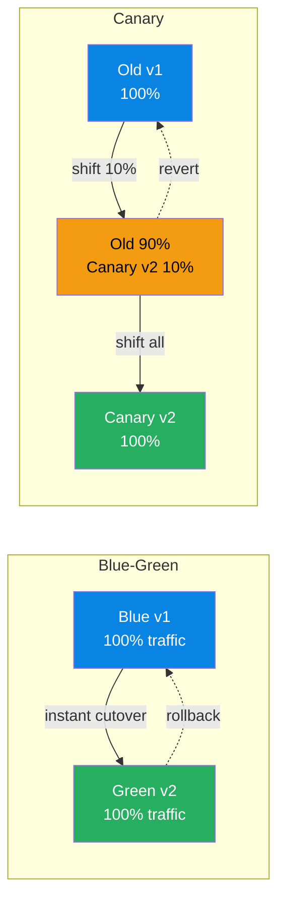
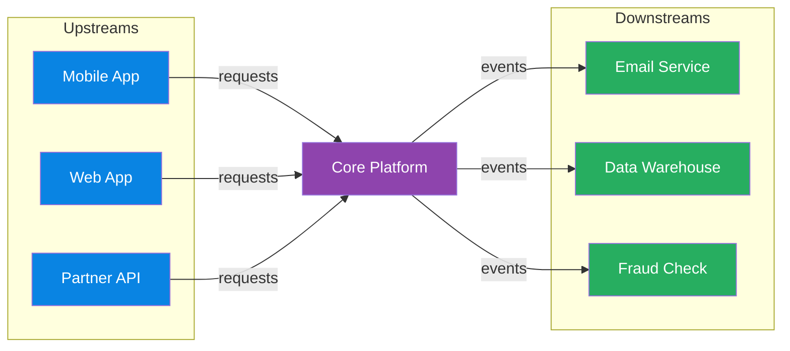

# Architecture & Design Patterns

> **Domain**: Software architecture patterns, domain-driven design, cloud adoption frameworks, and migration strategies.
> **Parent**: [Reference Dictionary](index.md)

---

## Contents

| Term | Anchor |
|:---|:---|
| DDD | [`#ddd`](#ddd) |
| Bounded Context | [`#bounded-context`](#bounded-context) |
| Ubiquitous Language | [`#ubiquitous-language`](#ubiquitous-language) |
| Database Per Service | [`#database-per-service`](#database-per-service) |
| Strangler Fig | [`#strangler-fig`](#strangler-fig) |
| Anti-Corruption Layer | [`#anti-corruption-layer`](#anti-corruption-layer) |
| Sidecar Pattern | [`#sidecar-pattern`](#sidecar-pattern) |
| Ambassador Pattern | [`#ambassador-pattern`](#ambassador-pattern) |
| Blue-Green | [`#blue-green`](#blue-green) |
| Canary Deployment | [`#canary-deployment`](#canary-deployment) |
| Blue-Green vs Canary Deployment | [`#blue-green-vs-canary-deployment`](#blue-green-vs-canary-deployment) |
| Well-Architected Framework | [`#well-architected-framework`](#well-architected-framework) |
| Leaderboard Pattern | [`#leaderboard-pattern`](#leaderboard-pattern) |
| CAF | [`#caf`](#caf) |
| Hub-and-Spoke | [`#hub-and-spoke`](#hub-and-spoke) |
| DMZ | [`#dmz`](#dmz) |
| GOMAXPROCS | [`#gomaxprocs`](#gomaxprocs) |
| Goroutine | [`#goroutine`](#goroutine) |
| M:N Scheduling | [`#mn-scheduling`](#mn-scheduling) |
| Tokio | [`#tokio`](#tokio) |
| Event Loop | [`#event-loop`](#event-loop) |
| Virtual File System (VFS) | [`#virtual-file-system-vfs`](#virtual-file-system-vfs) |
| Microservices | [`#microservices`](#microservices) |
| Monolith | [`#monolith`](#monolith) |
| Distributed Monolith | [`#distributed-monolith`](#distributed-monolith) |
| Deployment Coupling | [`#deployment-coupling`](#deployment-coupling) |
| Native Extension | [`#native-extension`](#native-extension) |
| Progressive Delivery | [`#progressive-delivery`](#progressive-delivery) |
| Feature Flag | [`#feature-flag`](#feature-flag) |
| A/B Testing | [`#ab-testing`](#ab-testing) |
| Active-Active | [`#active-active`](#active-active) |
| Shadow Testing | [`#shadow-testing`](#shadow-testing) |
| Technical Debt | [`#technical-debt`](#technical-debt) |
| Upstream System | [`#upstream-system`](#upstream-system) |
| Downstream System | [`#downstream-system`](#downstream-system) |
| Upstream/Downstream Relationship | [`#upstream-downstream-relationship`](#upstream-downstream-relationship) |
| Circular Dependency | [`#circular-dependency`](#circular-dependency) |
| Singleton | [`#singleton`](#singleton) |
| Factory Method | [`#factory-method`](#factory-method) |
| Builder Pattern | [`#builder-pattern`](#builder-pattern) |
| Adapter Pattern | [`#adapter-pattern`](#adapter-pattern) |
| Decorator Pattern | [`#decorator-pattern`](#decorator-pattern) |
| Proxy Pattern | [`#proxy-pattern`](#proxy-pattern) |
| Strategy Pattern | [`#strategy-pattern`](#strategy-pattern) |
| Observer Pattern | [`#observer-pattern`](#observer-pattern) |
| Command Pattern | [`#command-pattern`](#command-pattern) |
| Repository Pattern | [`#repository-pattern`](#repository-pattern) |
| Golden Hammer | [`#golden-hammer`](#golden-hammer) |
| YAGNI | [`#yagni`](#yagni) |
| Separation of Concerns | [`#separation-of-concerns`](#separation-of-concerns) |
| Fail Fast | [`#fail-fast`](#fail-fast) |
| Single Source of Truth | [`#single-source-of-truth`](#single-source-of-truth) |
| Loose Coupling | [`#loose-coupling`](#loose-coupling) |
| Immutability | [`#immutability`](#immutability) |
| Scalability | [`#scalability`](#scalability) |
| Architecture Decision Record | [`#architecture-decision-record`](#architecture-decision-record) |
| Anti-pattern | [`#anti-pattern`](#anti-pattern) |
| Base62 Encoding | [`#base62-encoding`](#base62-encoding) |
| URL Shortener | [`#url-shortener`](#url-shortener) |
| Snowflake ID | [`#snowflake-id`](#snowflake-id) |
| Key Generation Service | [`#key-generation-service`](#key-generation-service) |
| Fanout on Write | [`#fanout-on-write`](#fanout-on-write) |
| Fanout on Read | [`#fanout-on-read`](#fanout-on-read) |
| Context Switching | [`#context-switching`](#context-switching) |
| Amdahl's Law | [`#amdahls-law`](#amdahls-law) |
| Actor Model | [`#actor-model`](#actor-model) |
| I/O-bound vs CPU-bound | [`#io-bound-vs-cpu-bound`](#io-bound-vs-cpu-bound) |
| Race Condition | [`#race-condition`](#race-condition) |
| PRG Pattern | [`#prg-pattern`](#prg-pattern) |
| Hybrid Fanout | [`#hybrid-fanout`](#hybrid-fanout) |
| Presence Service | [`#presence-service`](#presence-service) |
| Zero-Copy Transfer | [`#zero-copy-transfer`](#zero-copy-transfer) |
| Preemption | [`#preemption`](#preemption) |
| Fair Sharing | [`#fair-sharing`](#fair-sharing) |
| Tenant Hierarchy | [`#tenant-hierarchy`](#tenant-hierarchy) |
| Durability | [`#durability`](#durability) |
| Read/Write Path Separation | [`#read-write-path-separation`](#read-write-path-separation) |
| Apache Flink | [`#apache-flink`](#apache-flink) |
| Apache Cassandra | [`#apache-cassandra`](#apache-cassandra) |
| MongoDB | [`#mongodb`](#mongodb) |
| Masterless Architecture | [`#masterless-architecture`](#masterless-architecture) |

---

## DDD

**Domain-Driven Design** — a software design approach centered on domain modeling. The team builds a shared model of the business domain using a precise, agreed-upon language.

**Also see**: [Bounded Context](#bounded-context), [Ubiquitous Language](#ubiquitous-language)

---

## Bounded Context

An **explicit boundary** around a domain model with its own ubiquitous language. Inside the boundary, terms have precise meanings. "Account" in Banking may differ from "Account" in CRM — bounded contexts resolve this.

**Also see**: [DDD](#ddd), [Ubiquitous Language](#ubiquitous-language)

---

## Ubiquitous Language

A **shared, precise terminology** between developers and domain experts within a bounded context. The same word means the same thing to everyone — no translation gaps.

**Also see**: [DDD](#ddd), [Bounded Context](#bounded-context) · [Fintech: Financial States](fintech.md#financial-states)

---

## Database Per Service

A **microservices data pattern** where each service owns and manages its own database. No two services share the same logical data store, enforcing service boundaries and independent deployability.

### Key Characteristics
- **Private schema per service** — other services access data only through the service's API or events
- **Technology fit** — each service can choose SQL, NoSQL, or a specialized store based on its access patterns
- **No shared locks or joins** — cross-service consistency is achieved via APIs, sagas, or events
- **Independent scaling and recovery** — one service's database load does not starve another

### When to Use
- Microservices where teams need autonomous deployment and schema evolution
- Domains with heterogeneous data access patterns (e.g., ACID balances + high-write event logs)

### When NOT to Use
- Early-stage monoliths where cross-table joins and transactions dramatically simplify correctness
- When the organization lacks mature API/event contracts and saga compensation design

### Also see
- [Bounded Context](#bounded-context) · [Saga Pattern](data-concurrency.md#saga-pattern) · [Outbox Pattern](cqrs-event-driven.md#outbox-pattern)

---

## Strangler Fig

An **incremental migration pattern** — gradually replace a legacy system by building new functionality around it until the old system is "strangled" and can be removed. Named after the fig tree that grows around a host tree.

**Also see**: [Anti-Corruption Layer](#anti-corruption-layer)

---

## Anti-Corruption Layer

A **translation layer** that protects a bounded context from external model corruption. Translates between the external model and the internal domain model so neither leaks into the other.

**Also see**: [Bounded Context](#bounded-context), [Strangler Fig](#strangler-fig)

---

## Sidecar Pattern

A **co-located helper container** that supports the main application. Deployed alongside in the same pod (Kubernetes). Example: Envoy proxy handling TLS, routing, and observability for the app container.

**Also see**: [Ambassador Pattern](#ambassador-pattern)

---

## Ambassador Pattern

A **proxy service** that handles connectivity concerns (retry, routing, authentication) on behalf of the main service. Offloads cross-cutting network concerns from the application.

**Also see**: [Sidecar Pattern](#sidecar-pattern)

---

## Blue-Green

Two **identical environments** — Blue (current) and Green (new version). Traffic is switched from Blue to Green for zero-downtime deployments. Rollback is instant: switch back to Blue.

**Also see**: [Canary Deployment](#canary-deployment)

---

## Canary Deployment

Route a **small percentage of traffic** to the new version before full rollout. If error rates spike, the canary is killed and traffic reverts. Safer than Blue-Green for high-risk changes.

**Also see**: [Blue-Green](#blue-green)

---

## Blue-Green vs Canary Deployment

Both strategies separate **deployment** (installing the new version) from **release** (exposing it to users). The difference is how traffic moves:

| Aspect | Blue-Green | Canary Deployment |
|:---|:---|:---|
| Traffic shift | Instant 0% → 100% | Gradual 0% → small % → 100% |
| Rollback speed | Immediate (switch back) | Fast (drain canary) |
| Blast radius | All users if the new version fails | Only canary users |
| Best for | Low-risk changes, predictable rollbacks | High-risk changes, sensitive services |

They are often combined: a Blue-Green pair gives you an isolated environment to canary into before committing all traffic.



**Diagram description**: Two deployment patterns shown side by side. Blue-Green (left) switches all traffic instantly from Blue v1 (blue) to Green v2 (green) with a dashed rollback arrow. Canary (right) gradually shifts traffic from Old v1 (blue) to a mix of Old 90% + Canary v2 10% (yellow), then to Canary v2 100% (green), with a dashed revert arrow to the old version.

---

## Well-Architected Framework

Azure's **five pillars** of architectural excellence:

| Pillar | Focus |
|:---|:---|
| **Reliability** | Recover from failures, high availability |
| **Security** | Protect data, identities, and infrastructure |
| **Cost Optimization** | Maximize value, minimize waste |
| **Operational Excellence** | Run and monitor systems in production |
| **Performance Efficiency** | Adapt to changing workload demands |

**Also see**: [CAF](#caf)

---

## CAF

**Cloud Adoption Framework** — Microsoft's structured methodology for cloud adoption: Strategy → Plan → Ready → Adopt → Govern → Manage.

**Also see**: [Well-Architected Framework](#well-architected-framework)

---

## Hub-and-Spoke

A **network topology** where a central hub VNet hosts shared services (firewall, gateway, DNS) and spoke VNets host workloads. All spoke-to-spoke traffic routes through the hub for inspection and control.

**Also see**: [Azure Services: VNet](azure-services.md#vnet)

---

## DMZ

**Demilitarized Zone** — an isolated network segment between the untrusted internet and trusted internal network. Hosts internet-facing services that should not have direct access to internal systems.

**Also see**: [Azure Services: Azure Firewall](azure-services.md#azure-firewall)

---

## GOMAXPROCS

**GOMAXPROCS** — a Go runtime environment variable that sets the maximum number of OS threads that can execute Go code simultaneously. Controls the parallelism of the Go scheduler's work-stealing across goroutines.

### Key Characteristics
- Default: `runtime.NumCPU()` (all available CPUs)
- Set via `GOMAXPROCS=N` environment variable or `runtime.GOMAXPROCS(n)` in code
- Does NOT limit goroutine count (goroutines are multiplexed onto GOMAXPROCS OS threads)
- Critical for containerized environments where the container's CPU limit is less than the host's CPU count

### When to Use
- Explicit CPU affinity in benchmarks (matching Java's `ActiveProcessorCount`)
- Containerized Go services where `runtime.NumCPU()` sees the host CPUs, not container limits
- Performance tuning: reducing GOMAXPROCS can reduce GC pressure in CPU-saturated services

### When NOT to Use
- Default is usually correct for non-containerized deployments on dedicated hardware
- Setting GOMAXPROCS > actual available CPUs provides no benefit and may increase scheduling overhead

### Also see
- [Virtual Threads](#virtual-threads) — Java's concurrency model counterpart
- [Azure Container Apps](azure-services.md#container-apps) — containerized deployment target

---

## Goroutine

**Goroutine** — Go's fundamental unit of concurrency. A goroutine is a user-space, lightweight execution context managed entirely by the Go runtime scheduler. It starts with a ~2 KB stack (compared to ~512 KB–1 MB for OS threads) and grows dynamically. When a goroutine blocks on I/O, the Go scheduler parks it and runs another goroutine on the same OS thread — no kernel context switch required.

```go
func getOrder(w http.ResponseWriter, r *http.Request) {
    id := r.URL.Query().Get("id")
    order := db.FindOrder(id) // goroutine yields here, does not block OS thread
    json.NewEncoder(w).Encode(order)
}
// 10,000 of these running costs ~20 MB total stack
// Java platform threads equivalent: ~10 GB
```

### Key Characteristics
- Initial stack ~2 KB; grows in small increments as needed (unlike fixed OS thread stacks)
- Multiplexed onto OS threads via the Go runtime's M:N scheduler (see [M:N Scheduling](#mn-scheduling))
- Channels provide goroutine-safe communication and synchronization — no `synchronized` locks, no pinning risk
- Count is not limited by OS constraints: 50,000+ goroutines is routine in production
- Managed by `GOMAXPROCS` OS-thread pool (see [GOMAXPROCS](#gomaxprocs))

### When to Use
- Any concurrent I/O operation in Go — the idiomatic model is one goroutine per task
- High-concurrency HTTP handlers, background workers, pipeline stages

### When NOT to Use
- Not applicable outside Go (Java equivalent: [Virtual Threads](#virtual-threads); .NET equivalent: async/await tasks)
- Goroutines shared across FFI/CGo boundaries require extra care — CGo calls block the OS thread

### Also see
- [GOMAXPROCS](#gomaxprocs) — controls the OS-thread pool goroutines run on
- [M:N Scheduling](#mn-scheduling) — the scheduling model behind goroutines
- [Virtual Threads](#virtual-threads) — Java's closest equivalent

---

## M:N Scheduling

**M:N Scheduling** (also: *many-to-many threading*) — a concurrency model where M user-space execution contexts (goroutines, virtual threads, fibers) are multiplexed onto N OS threads, where M >> N. The user-space scheduler decides which lightweight context runs on which OS thread, yielding cooperatively or preemptively when a context blocks.

```
M:N Model (e.g., Go goroutines)
================================
Goroutine-1  ╲
Goroutine-2   ╲
Goroutine-3    ──▶  OS Thread-1  (user-space scheduling; no syscall on yield)
Goroutine-4   ╱
Goroutine-5  ╱

vs.

1:1 Model (Java platform threads, pre-Loom)
============================================
Request-1  ──▶  OS Thread-1  (kernel scheduler; syscall on every context switch)
Request-2  ──▶  OS Thread-2
Request-3  ──▶  OS Thread-3
```

### Key Characteristics
- **Low memory footprint**: user-space contexts start at KBs vs OS thread stacks at hundreds of KBs
- **Cheap context switch**: switching between user-space contexts is a function call, not a kernel syscall
- **High multiplexing**: tens of thousands of logical tasks can share a handful of OS threads
- **Implementations**: Go goroutines (runtime scheduler), Java Virtual Threads (JVM carrier threads), Erlang processes, Kotlin coroutines

### When to Use
- I/O-bound, high-concurrency services where tasks spend most of their time waiting
- When per-task memory cost matters (microservices, serverless, embedded)

### When NOT to Use
- Pure CPU-bound workloads benefit more from N = CPU-count platform threads; extra scheduling overhead from M:N adds no value
- When the runtime does not support M:N natively (pre-Loom Java with platform threads is 1:1)

### Also see
- [Goroutine](#goroutine) — Go's implementation of M:N scheduling
- [Virtual Threads](#virtual-threads) — JVM's M:N implementation (Java 21+)
- [GOMAXPROCS](#gomaxprocs) — controls N (OS thread count) in Go's M:N model

---

## Tokio

**Tokio** — Rust’s asynchronous runtime, providing the event loop, task scheduler, I/O driver, and timer infrastructure needed to run async Rust code in production.

### Key Characteristics
- **Work-stealing scheduler**: tasks are distributed across a pool of OS threads; idle threads steal work from busy threads.
- **Async/await**: built on Rust `async`/`await` and `Future`; the runtime polls tasks to completion.
- **Zero-cost abstractions**: async code compiles to state machines without pervasive runtime allocation.
- **Ecosystem**: `tokio::sync` (channels, locks), `tokio::time`, `tokio::net`, and `tokio::task` cover most async service needs.

### When to Use
- High-concurrency network services in Rust where many connections are handled concurrently on a small thread pool.
- CPU- and latency-sensitive services that benefit from Rust’s ownership model plus async I/O.

### When NOT to Use
- For blocking or CPU-bound work without spawning it on a dedicated thread pool (`spawn_blocking`), or it will stall the async runtime.
- As a default choice when the team has no Rust operational experience; the safety gains come with a learning curve.

### Also see
- [Virtual Threads](#virtual-threads) · [Goroutine](#goroutine) · [Event Loop](#event-loop) · [Global Interpreter Lock](../reference-dictionary/data-concurrency.md#global-interpreter-lock)

---

## Event Loop

A concurrency pattern where a single thread continuously polls for and dispatches events or I/O operations, avoiding the need for locks by processing work sequentially. Redis's `ae.c` is a canonical example: ~300 lines of C that powers millions of production systems.

### Key Characteristics

- **Single-threaded by design**: Eliminates lock contention and race conditions entirely — complexity requires justification, not the other way around
- **Event-driven polling**: Continuously checks for network I/O, timers, and signals in a main loop (`aeProcessEvents`)
- **Non-blocking I/O**: Uses mechanisms like `epoll`/`kqueue`/`select` to handle many connections without thread-per-connection overhead

### When to Use

- CPU-light, I/O-heavy workloads where request processing is fast relative to I/O wait time
- Systems where data structure access benefits from lock-free semantics (e.g., in-memory data stores)
- When operational simplicity and debuggability outweigh raw throughput on multi-core machines

### When NOT to Use

- CPU-bound workloads that cannot saturate a single core fast enough for latency requirements
- When vertical scaling limits are hit and horizontal scaling across cores is the only option
- Systems with blocking operations that cannot be offloaded to background threads or async I/O

### Also see

- [Single-Threaded Architecture](../reference-dictionary/dotnet-multithreading.md#single-threaded-architecture)
- [Async I/O patterns](../reference-dictionary/dotnet-multithreading.md)

---

## Virtual File System (VFS)

A kernel-level abstraction layer in Linux that provides a single unified interface (`struct file_operations`) for all filesystem operations, allowing hundreds of different filesystem implementations (ext4, btrfs, NFS, etc.) to coexist behind a common contract. One of the most elegant examples of clean abstraction at scale.

### Key Characteristics

- **Unified interface**: Every filesystem implements the same `file_operations` struct — `open`, `read`, `write`, `release` — regardless of underlying storage
- **Contract-enforced**: The abstraction doesn't leak; it defines a contract and enforces it, enabling Linux to grow for 30+ years without collapsing under its own weight
- **Pluggable backends**: New filesystems can be added without modifying any calling code, making the kernel extensible at the storage layer

### When to Use

- Designing systems where multiple backend implementations must be interchangeable behind a stable API
- When the data model (what is stored) should remain stable while storage strategies (how it's stored) evolve
- Architectural patterns requiring the Strategy pattern at the OS or platform layer

### When NOT to Use

- When the abstraction overhead (vtable dispatch, indirection) is unacceptable for hot-path performance
- Simple systems with only one storage backend where the abstraction cost outweighs flexibility gains
- When backend-specific features need to be exposed directly to callers (the abstraction hides them)

### Also see

- [Event Loop](#event-loop) — another example of deliberate architectural simplicity
- [Content-Addressable Storage](../reference-dictionary/ai-ml-llm.md) — Git's complementary data model

- TODO: When Virtual File System (VFS) is the wrong choice

### Also see

- TODO: Related terms

---

## Microservices

An architectural style that structures an application as a **collection of loosely coupled services**, each aligned to a business capability, owning its own data and deployable independently.

### Key Characteristics
- **Service boundaries**: usually aligned to bounded contexts or business capabilities
- **Independent deployability**: teams can release, scale and fail over services separately
- **Polyglot persistence**: each service may choose the data store that fits its access patterns
- **Operational overhead**: requires observability, CI/CD, service discovery and graceful degradation

### When to Use
- Large engineering organizations with multiple autonomous teams
- Domains with independently scaling or evolving subsystems

### When NOT to Use
- Early-stage products where a monolith is faster to build and iterate
- When the organization lacks the platform maturity to operate dozens of services

**Also see**: [Monolith](#monolith), [Database Per Service](#database-per-service), [Bounded Context](#bounded-context)

---

## Monolith

A single deployable unit in which all functionality, data access and business logic runs together. A well-factored monolith is often the fastest and simplest path to product-market fit.

### Key Characteristics
- **Single codebase and deployment unit**: everything ships together
- **In-process communication**: no network calls between modules
- **Simpler transactions and consistency**: ACID across the whole data model
- **Can be modular**: a “modular monolith” has clear internal boundaries without service boundaries

### When to Use
- Small teams, early-stage products and rapid iteration
- Domains where cross-module transactions and joins are frequent

### When NOT to Use
- When multiple teams are blocked by a shared deployment cadence
- When one component needs to scale independently by orders of magnitude

**Also see**: [Microservices](#microservices), [Strangler Fig](#strangler-fig)

---

## Distributed Monolith

A **microservices anti-pattern** in which a system is decomposed into separate deployable services but retains tight coupling across service boundaries — delivering the operational complexity of microservices (network overhead, independent deployments, distributed tracing) without the primary benefit: **team and deployment independence**.

### Key Characteristics
- **Shared database schemas** across service boundaries — services join across tables they do not own
- **Synchronous call chains**: Service A calls B calls C; a failure in C propagates to A
- **Coordinated deployments**: deploying one service requires deploying or approving others
- **Implicit contract coupling**: changes to shared libraries or schemas ripple across all consumers
- **Cascading failures**: a single slow downstream service saturates upstream thread pools

### Warning Signs
- You maintain a deployment order spreadsheet
- An on-call incident involves engineers from 3+ services simultaneously
- A two-line config change requires a multi-team Slack war room
- Services share a Postgres schema or an ORM model class

### When to Use
Not applicable — this is an anti-pattern to detect and remediate.

### When NOT to Use
Always avoid. Prefer bounded contexts with database-per-service and async event integration.

### Also see
- [Microservices](#microservices) · [Monolith](#monolith) · [Deployment Coupling](#deployment-coupling) · [Database Per Service](#database-per-service) · [Bounded Context](#bounded-context) · [Strangler Fig](#strangler-fig)
- [Microservices & Service Design — Key Takeaways](../system-design-architecture/48-svc-distributed-monolith-key-takeaways.md#svc-01-distributed-monolith-anti-pattern)

---

## Deployment Coupling

A condition in which deploying one service requires **coordinating the deployment of one or more other services**, eliminating independent deployability — a core benefit of microservices.

### Key Characteristics
- **Deployment order dependencies**: Service B must be deployed before Service A can start
- **Shared schema migrations**: database schema changes must be applied across service boundaries simultaneously
- **Synchronized release trains**: teams are forced to align release schedules rather than deploying on their own cadence
- **Rollback propagation**: rolling back one service breaks others that depend on the new API or schema

### When to Use
Not applicable — this is an anti-pattern.

### When NOT to Use
Always avoid in microservices architectures. Use async events, versioned API contracts, and database-per-service to eliminate deployment dependencies.

### Also see
- [Distributed Monolith](#distributed-monolith) · [Microservices](#microservices) · [Database Per Service](#database-per-service)
- [Microservices & Service Design — Key Takeaways](../system-design-architecture/48-svc-distributed-monolith-key-takeaways.md#svc-02-deployment-coupling-via-synchronous-call-chains)

---

## Native Extension

A **compiled module** (written in a language such as Rust, C, C++, or Cython) that is called from a higher-level runtime to execute a hot or CPU-bound function without rewriting the entire application.

### Key Characteristics
- **Surgical optimization**: targets a single bottleneck function or small module rather than the whole service.
- **FFI boundary**: the extension exposes a callable interface to the host runtime (e.g., Python via PyO3/Cython, Node.js via N-API, Ruby via C extensions).
- **Lower operational churn**: the existing service boundary, deployment pipeline, and team fluency stay mostly intact.

### When to Use
- A profile shows that one CPU-bound function dominates latency or cost.
- The service changes frequently and a full rewrite would impose an unacceptable velocity tax.
- The team needs most of the rewrite’s performance win with a fraction of its cost.

### When NOT to Use
- When the bottleneck is I/O, an algorithm, or a missing index — fixing the root cause is cheaper than adding a foreign build.
- When the FFI and build-tooling complexity outweighs the savings (small or rarely executed functions).

### Also see
- [Strangler Fig](#strangler-fig) · [Anti-Corruption Layer](#anti-corruption-layer) · [Tokio](#tokio) · [Microservices Runtime Performance — Python to Rust Rewrite Takeaways](../system-design-architecture/60-perf-key-takeaways.md#perf-11-native-extension-as-middle-path)

---

## Progressive Delivery

An umbrella term for **gradually exposing new code to users** using techniques such as canary releases, feature flags, blue-green deployments, A/B testing and load-balanced rollouts. It decouples deployment from release.

### Key Characteristics
- **Controlled blast radius**: new code reaches a small subset first
- **Measurable gating**: promote or rollback based on error rates, latency and business metrics
- **User segmentation**: target by region, device, customer tier or random percentage

### When to Use
- High-risk changes in large-scale services
- Products where business metrics must validate a change before full rollout

### When NOT to Use
- For trivial changes where the overhead of gating exceeds the risk
- Without automated rollback and clear success criteria

**Also see**: [Canary Deployment](#canary-deployment), [Blue-Green](#blue-green), [Feature Flag](#feature-flag), [A/B Testing](#ab-testing)

---

## Feature Flag

A software development technique that wraps functionality in a **runtime-controllable toggle**, allowing teams to enable, disable or gradually roll out features without deploying new code.

### Key Characteristics
- **Decouples deploy from release**: code can ship dark and be enabled later
- **Targeted rollout**: per user, per segment, per region or percentage-based
- **Kill switch**: problematic features can be turned off instantly

### When to Use
- Long-running features that must be merged incrementally
- High-risk changes requiring instant rollback
- A/B tests and phased rollouts

### When NOT to Use
- As a substitute for branch-based development discipline (flag debt accumulates)
- When the flag adds runtime complexity without clear value

**Also see**: [Progressive Delivery](#progressive-delivery), [A/B Testing](#ab-testing)

---

## A/B Testing

A controlled experiment where **two or more variants of a product experience are served to different user groups** to measure the impact on a business or user-experience metric.

### Key Characteristics
- **Randomized assignment**: users are bucketed to reduce selection bias
- **Hypothesis and metric**: every test has a primary success metric and stopping criteria
- **Statistical rigor**: requires sufficient sample size and significance testing

### When to Use
- Validating product changes, algorithms or UI designs with real user behavior
- Decisions where multiple options are defensible and data should break the tie

### When NOT to Use
- For changes with clear correctness or safety requirements (prefer canary metrics instead)
- When sample sizes are too small to reach statistical significance

**Also see**: [Feature Flag](#feature-flag), [Progressive Delivery](#progressive-delivery)

---

## Active-Active

A high-availability deployment pattern where **multiple data centers or regions actively serve traffic and accept writes simultaneously**, rather than one being on standby.

### Key Characteristics
- **Traffic served from multiple regions**: lower latency and better fault tolerance
- **Data synchronization**: replicas exchange writes, requiring conflict resolution
- **Complexity trade-off**: adds consistency challenges in exchange for resilience

### When to Use
- Globally distributed users requiring low-latency writes
- Mission-critical systems where a single region failure must be transparent

### When NOT to Use
- When strong consistency is more important than availability during partitions
- Without a clear conflict-resolution strategy (e.g., CRDTs, last-write-wins, custom merge)

**Also see**: [CRDT](data-concurrency.md#crdt-conflict-free-replicated-data-type), [CAP Theorem](#cap-theorem)

---

## Shadow Testing

A validation technique where production traffic is **duplicated and sent to a new version or service without affecting real users**. Responses are compared between the old and new systems to detect regressions.

### Key Characteristics
- **Non-impactful**: users see only the production response; the shadow result is discarded
- **High-fidelity workload**: tests against real traffic patterns, not synthetic loads
- **Comparison metrics**: latency, errors, response payloads and resource usage

### When to Use
- Refactoring or re-platforming systems where behavioral equivalence must be proven
- Load-testing new versions with production-scale traffic

### When NOT to Use
- When the operation has side effects (e.g., payments, writes) that cannot be isolated
- Without a safe way to capture, compare and discard shadow responses

**Also see**: [Canary Deployment](#canary-deployment), [Progressive Delivery](#progressive-delivery)

---

## Technical Debt

The **accumulated cost of shortcuts or suboptimal design decisions** that make future changes slower, riskier or more expensive. Like financial debt, it can be strategic if it is tracked and paid down.

### Key Characteristics
- **Visible inventory**: a debt register with estimated impact, risk and payback plan
- **Intentional and accidental**: some debt is taken deliberately to meet a deadline; some is discovered later
- **Interest grows**: untreated debt compounds as the system evolves around it

### When to Use
- Strategic short-term trade-offs with a clear repayment plan
- Refactoring work prioritized by risk and velocity impact

### When NOT to Use
- As an excuse to skip testing, documentation or security in every sprint
- Without a plan to pay it down — unchecked debt becomes a rewrite trigger

**Also see**: [Strangler Fig](#strangler-fig), [Monolith](#monolith), [Microservices](#microservices)

---

## Upstream System

A system or component that **produces data, events or requests that flow into another system**. The upstream direction is the source side of a dependency: if system A calls or emits data that system B consumes, A is upstream of B.

### Key Characteristics
- **Caller / producer / source** in a data or control flow
- **Depends on by downstream**: changes in upstream output can break downstream consumers
- **Context-relative**: the same service can be upstream to one system and downstream to another

### When to Use
- Talking about service dependencies, data lineage, event pipelines or API call chains
- Defining ownership and SLOs (upstream availability affects downstream reliability)

### When NOT to Use
- As a synonym for “client” or “server” without explaining the direction of data flow
- In isolation without clarifying what the dependency relationship actually is

**Also see**: [Downstream System](#downstream-system), [API Gateway](#api-gateway), [Microservices](#microservices)

---

## Downstream System

A system or component that **consumes data, events or requests from another system**. The downstream direction is the consumer side of a dependency: it receives what upstream systems produce.

### Key Characteristics
- **Callee / consumer / sink** in a data or control flow
- **Affected by upstream changes**: schema changes, latency or outages upstream propagate downstream
- **Context-relative**: the same service can be downstream to one system and upstream to another

### When to Use
- Discussing consumers of events, API clients, data subscribers or pipeline outputs
- Planning backward compatibility, fan-out and error handling

### When NOT to Use
- As a synonym for “backend” or “frontend” without describing the flow direction
- When the relationship is peer-to-peer and has no clear producer/consumer direction

### Also see
- [Upstream System](#upstream-system) · [Messaging](messaging.md) · [Event-Driven Architecture](cqrs-event-driven.md#event-driven-architecture)

---

## Upstream/Downstream Relationship



**Diagram description**: Upstream systems (Mobile App, Web App, Partner API) send requests into a Core Platform (purple). The Core Platform then emits events to downstream systems (Email Service, Data Warehouse, Fraud Check) shown in green. Arrows follow the direction of data/control flow from upstream producers to downstream consumers.

---

## Circular Dependency

A situation where two or more components **mutually depend on each other**, directly or transitively. In distributed systems, circular dependencies are especially dangerous when they cross infrastructure boundaries — for example, an observability stack that depends on the same service-discovery layer it monitors. When the dependency fails, the monitoring goes dark, and operators lose the ability to diagnose the very failure that took it down.

### Key Characteristics
- **Direct**: A depends on B, B depends on A
- **Transitive**: A → B → C → A (harder to detect)
- **Infrastructure coupling**: the monitoring plane shares fate with the data plane it observes

### When to Use
- Never intentionally — circular dependencies are an anti-pattern. Always break them with an intermediate abstraction, event bus, or separate infrastructure plane.

### When NOT to Use
- Circular dependencies should be eliminated, not tolerated. Even "stable" circular dependencies create fragility under failure conditions.

### Also see
- [Observability](../reference-dictionary/resilience.md#observability) · [Bulkhead](../reference-dictionary/resilience.md#bulkhead) · [Sidecar Pattern](#sidecar-pattern)

---

## Singleton

A **creational pattern** that ensures a class has only one instance and provides a global access point to it. Used for shared resources — configuration managers, connection pools, cache managers — where a single source-of-truth is required.

### Key Characteristics
- Private constructor prevents external instantiation
- Static volatile field + double-checked locking for thread safety
- Lazy initialization: instance created on first access

### When to Use
- JVM-scoped shared resources: feature-flag services, config managers
- Framework-managed singletons (Spring `@Bean`, CDI) preferred over hand-rolled ones

### When NOT to Use
- When the "single instance" assumption will change (e.g., tests need separate instances)
- For objects with mutable state accessed by many threads — leads to contention and hidden coupling

### Also see
- [Design Patterns Key Takeaways](../system-design-architecture/39-design-patterns-key-takeaways.md#dp-01-shared-resource-multiple-instantiation)

---

## Factory Method

A **creational pattern** that defines an interface for creating objects but lets subclasses or a factory function decide which concrete class to instantiate. Clients are decoupled from the creation logic.

### Key Characteristics
- Static factory function or an abstract `createX()` method in a base class
- Returns an interface type, not a concrete type
- Creation logic is centralised — easy to extend via new cases

### When to Use
- Creating protocol-specific clients (HTTP/gRPC/Kafka) based on config
- Plugin architectures where the set of implementations varies at runtime
- When mocking in tests requires swapping implementations

### When NOT to Use
- For trivial, unconditional `new Foo()` calls — the indirection adds no value

### Also see
- [Builder Pattern](#builder-pattern) · [Design Patterns Key Takeaways](../system-design-architecture/39-design-patterns-key-takeaways.md#dp-02-complex-object-creation-scattered-across-clients)

---

## Builder Pattern

A **creational pattern** that constructs complex objects step-by-step using a fluent API, separating construction from representation and enabling immutability.

### Key Characteristics
- Nested `Builder` class accumulates optional/required fields
- `build()` validates and returns the fully constructed, immutable object
- Eliminates telescoping constructors and invalid intermediate states

### When to Use
- Complex DTOs or value objects with many optional fields
- Constructing requests to external services or configuration objects
- When immutability is required and setter-based construction is unsafe

### When NOT to Use
- Simple objects with ≤2 fields — a plain constructor is clearer
- When the object is mutable by design

### Also see
- [Factory Method](#factory-method) · [Design Patterns Key Takeaways](../system-design-architecture/39-design-patterns-key-takeaways.md#dp-03-telescoping-constructors-for-complex-objects)

---

## Adapter Pattern

A **structural pattern** that converts the interface of an existing class into the interface that clients expect. Used to integrate legacy systems or third-party SDKs without modifying them.

### Key Characteristics
- Implements the target interface; holds a reference to the adaptee
- Translates method calls from the target contract to the legacy API
- Encapsulates all integration/translation code in one place

### When to Use
- Wrapping legacy `CSVReader`, third-party SDKs, or external APIs to match internal contracts
- When a domain abstraction must remain clean and external changes should be isolated

### When NOT to Use
- When the interfaces are already compatible — adds unnecessary indirection
- When the legacy code will be replaced soon and temporary coupling is acceptable

### Also see
- [Anti-Corruption Layer](#anti-corruption-layer) · [Design Patterns Key Takeaways](../system-design-architecture/39-design-patterns-key-takeaways.md#dp-04-integrating-incompatible-interfaces)

---

## Decorator Pattern

A **structural pattern** that adds behavior to an object dynamically by wrapping it with another object that implements the same interface. Used for cross-cutting concerns (logging, caching, metrics) without modifying the original class.

### Key Characteristics
- Decorator implements the same interface as the wrapped component
- Delegates the core operation to the inner component, adding behavior before/after
- Decorators can be composed in chains

### When to Use
- Adding logging, metrics, caching, or audit to repository or service implementations
- When subclassing would create class explosion for each combination of behaviors

### When NOT to Use
- Deep chains (>3 layers) — hard to debug; prefer an AOP framework instead
- When the added behavior is unconditional and permanent — just modify the class

### Also see
- [Proxy Pattern](#proxy-pattern) · [Design Patterns Key Takeaways](../system-design-architecture/39-design-patterns-key-takeaways.md#dp-05-adding-cross-cutting-behaviors-without-subclassing)

---

## Proxy Pattern

A **structural pattern** that provides a surrogate for another object to control access, enable lazy initialization, or intercept calls for security/logging. The proxy and the real object share the same interface.

### Key Characteristics
- Virtual proxy: defers creation of the real object until first use
- Protection proxy: checks permissions before delegating
- Remote proxy: marshals calls to a remote object (gRPC stubs)

### When to Use
- Lazy loading of expensive resources (images, large datasets)
- Security checkpoints before delegating to a sensitive operation
- gRPC/stub proxies and remote service clients

### When NOT to Use
- When the proxy introduces unexpected latency that callers cannot anticipate
- When caching is the main goal — prefer the [Decorator Pattern](#decorator-pattern) for explicit caching wrappers

### Also see
- [Decorator Pattern](#decorator-pattern) · [Ambassador Pattern](#ambassador-pattern) · [Design Patterns Key Takeaways](../system-design-architecture/39-design-patterns-key-takeaways.md#dp-06-controlling-access-and-lazy-initialization)

---

## Strategy Pattern

A **behavioral pattern** that defines a family of algorithms, encapsulates each as an object, and makes them interchangeable. Clients select or inject the desired strategy at construction or runtime.

### Key Characteristics
- Common interface implemented by each concrete strategy
- Strategy is injected into the context (composition over inheritance)
- Open/Closed Principle: add new strategies without modifying the client

### When to Use
- Payment routing: choose strategy based on currency, region, or dynamic rules
- Discount calculation, sorting, risk scoring where the algorithm varies by context
- When algorithm variants need independent testing

### When NOT to Use
- When only one strategy will ever exist — inline the algorithm
- When the strategy selection logic itself becomes more complex than the algorithms

### Also see
- [Design Patterns Key Takeaways](../system-design-architecture/39-design-patterns-key-takeaways.md#dp-07-swappable-algorithms-at-runtime)

---

## Observer Pattern

A **behavioral pattern** that defines a one-to-many dependency between objects so that when one object (the subject) changes state, all its dependents (observers) are notified automatically.

### Key Characteristics
- Subject maintains a list of observers (listeners); observers register/unregister
- Decouples the event source from its handlers — the publisher knows nothing about consumers
- `CopyOnWriteArrayList` or similar thread-safe collection for concurrent listener registration

### When to Use
- Domain events within a single JVM (user registered, payment processed)
- Reactive UIs where model changes must propagate to multiple view components
- Simple pub/sub within a monolith

### When NOT to Use
- Cross-service events — use an explicit message broker (Kafka, Service Bus) for durability, ordering, and replay
- When listener ordering matters — Observer does not guarantee it
- Watch for memory leaks: always deregister listeners when the consumer is destroyed

### Also see
- [Messaging Dictionary](messaging.md) · [Design Patterns Key Takeaways](../system-design-architecture/39-design-patterns-key-takeaways.md#dp-08-decoupling-producers-from-consumers)

---

## Command Pattern

A **behavioral pattern** that encapsulates a request as a standalone object containing all information needed to execute the action. Enables queuing, scheduling, auditing, retry, and undo.

### Key Characteristics
- Command object holds the action, its parameters, and a reference to the receiver
- Commands can be serialized, stored, and replayed
- An `execute()` method is the single invocation point

### When to Use
- Job schedulers and message-based work queues
- GUI actions with undo/redo support
- Audit logs where each state-changing action must be persisted

### When NOT to Use
- Trivial, synchronous, non-replayable operations — the object creation overhead is not justified
- When all you need is a `Runnable` lambda — avoid the formalism

### Also see
- [Design Patterns Key Takeaways](../system-design-architecture/39-design-patterns-key-takeaways.md#dp-09-encapsulating-requests-for-queuing-and-undo)

---

## Repository Pattern

An **enterprise pattern** that abstracts data access behind a domain-oriented interface. The repository maps domain objects to and from the persistence store, keeping the domain model pure and decoupled from persistence technology.

### Key Characteristics
- Interface exposes domain-specific query methods (`findByEmail`, `findActiveOrders`)
- The implementation encapsulates JPA/JDBC/NoSQL details
- Trivially mockable in unit tests — swap with an in-memory implementation

### When to Use
- Any domain where you want to swap persistence technology without touching business logic
- Domain-Driven Design contexts where the domain model must remain clean
- When unit-testing domain logic without a database

### When NOT to Use
- Anemic repositories that only mirror CRUD add indirection with no benefit — use the ORM directly
- Leaky abstractions that expose `EntityManager` or query builders negate the purpose

### Also see
- [DDD](#ddd) · [Database Per Service](#database-per-service) · [CQRS](cqrs-event-driven.md#cqrs) · [Design Patterns Key Takeaways](../system-design-architecture/39-design-patterns-key-takeaways.md#dp-10-leaky-data-access-in-domain-logic)

---

## Golden Hammer

An **anti-pattern** where a familiar pattern or tool is applied to every problem regardless of fit. The name comes from "if all you have is a hammer, everything looks like a nail."

### Key Characteristics
- Pattern applied out of habit or comfort, not because it solves the current problem
- Results in over-engineered, hard-to-understand codebases
- Often accompanied by over-abstraction

### When to Use
- N/A — this is an anti-pattern. Recognise and avoid it.

### When NOT to Use
- Always — prefer matching the solution to the actual problem

### Also see
- [YAGNI](#yagni) · [Design Patterns Key Takeaways](../system-design-architecture/39-design-patterns-key-takeaways.md#dp-12-choosing-the-right-pattern) · [Pragmatic System Design](../system-design-architecture/18-pragmatic-system-design-takeaways.md)

---

## YAGNI

**You Aren't Gonna Need It** — an extreme programming principle stating that a feature or abstraction should not be added until it is actually needed. Prevents speculative complexity.

### Key Characteristics
- Defer implementation until there is a concrete, current requirement
- Refactor into a pattern when the need arises, not in anticipation of it
- Pairs with KISS (Keep It Simple, Stupid) and incremental design

### When to Use
- When considering whether to add CQRS, Saga, or a complex pattern to a simple domain
- When tempted to build a "framework" for a one-time use case

### When NOT to Use
- Security and compliance requirements — do not defer security controls under YAGNI
- Public API contracts — breaking changes are expensive; design them carefully upfront

### Also see
- [Golden Hammer](#golden-hammer) · [Design Patterns Key Takeaways](../system-design-architecture/39-design-patterns-key-takeaways.md#dp-12-choosing-the-right-pattern)

---

## Separation of Concerns

A design principle that assigns each module, class, or service one well-defined responsibility, keeping internal cohesion high and external coupling low.

### Key Characteristics
- Each component has a single reason to change
- Boundaries are drawn along responsibilities, not along implementation details
- Changes in one concern do not cascade into unrelated concerns

### When to Use
- When a module grows large enough that its tests, reviews, and deployments span multiple teams
- When business capabilities can be clearly distinguished

### When NOT to Use
- When over-separation creates more interfaces and deployment units than a small team can operate
- When premature abstraction hides a simple, cohesive workflow

### Also see
- [Loose Coupling](#loose-coupling) · [Bounded Context](#bounded-context) · [Architecture Principles Key Takeaways](../system-design-architecture/40-arch-key-takeaways.md#arch-02-separation-of-concerns)

---

## Fail Fast

A reliability principle that detects invalid state or unexpected conditions as early as possible, at the closest boundary to where the problem originates.

### Key Characteristics
- Validates inputs and assumptions at system boundaries
- Rejects bad state before it can propagate downstream
- Surfaces failures loudly rather than swallowing exceptions

### When to Use
- At API boundaries, message consumers, and dependency calls
- In distributed systems where defect cost grows exponentially with distance from source

### When NOT to Use
- When aggressive failure prevents graceful degradation that users depend on
- When it replaces proper error handling with panic-driven code

### Also see
- [Defense in Depth](resilience.md#defense-in-depth) · [Circuit Breaker](resilience.md#circuit-breaker) · [Architecture Principles Key Takeaways](../system-design-architecture/40-arch-key-takeaways.md#arch-04-fail-fast)

---

## Single Source of Truth

A data principle stating that every important fact has exactly one authoritative location. Derived stores may cache or project the fact, but they do not redefine it.

### Key Characteristics
- One system owns writes for each fact
- Read replicas, caches, search indices, and warehouses are fed from the source
- Eliminates reconciliation drift between competing authorities

### When to Use
- When multiple teams or systems need consistent views of the same entity
- In event-sourced or CDC-driven architectures

### When NOT to Use
- When the single writer becomes a contention or availability bottleneck that cannot be partitioned
- When the domain genuinely requires independent bounded contexts with their own truths

### Also see
- [CQRS](cqrs-event-driven.md#cqrs-command-query-responsibility-segregation) · [Event Sourcing](cqrs-event-driven.md#event-sourcing) · [Dual-Write Problem](cqrs-event-driven.md#dual-write-problem) · [Architecture Principles Key Takeaways](../system-design-architecture/40-arch-key-takeaways.md#arch-05-single-source-of-truth)

---

## Loose Coupling

An architectural principle in which components interact through stable, well-defined contracts so that changes to one component do not force changes in others.

### Key Characteristics
- Contracts are explicit: schemas, APIs, event schemas, or protocols
- Components can be deployed, scaled, and replaced independently
- Asynchronous communication is preferred where eventual consistency is acceptable

### When to Use
- Microservices, modular monoliths, and multi-team codebases
- Any system where deployment independence is a goal

### When NOT to Use
- When a tightly-knit algorithm or transaction must remain consistent and fast
- When contract governance overhead exceeds the value of independence

### Also see
- [Separation of Concerns](#separation-of-concerns) · [API Gateway](#api-gateway) · [Message Brokers](../system-design-architecture/05-message-brokers-async.md) · [Architecture Principles Key Takeaways](../system-design-architecture/40-arch-key-takeaways.md#arch-06-loose-coupling)

---

## Immutability

A design principle that avoids mutating state in place by creating new versions of data and preserving history.

### Key Characteristics
- State changes produce new values rather than modifying existing ones
- Eliminates a large class of concurrency bugs and reproducibility issues
- Enables event sourcing, audit trails, and content-addressed artifacts

### When to Use
- Distributed systems with shared state
- ML/AI pipelines where reproducibility depends on frozen datasets, models, and prompts

### When NOT to Use
- When storage cost or query patterns make append-only data impractical
- When every operation must update a single current value and history adds no value

### Also see
- [Event Sourcing](cqrs-event-driven.md#event-sourcing) · [Immutability in Java](../reference-dictionary/java-jvm.md) · [Architecture Principles Key Takeaways](../system-design-architecture/40-arch-key-takeaways.md#arch-07-immutability)

---

## Scalability

The ability of a system to absorb growth in load — 10x, 100x, or more — without requiring fundamental architectural changes.

### Key Characteristics
- Horizontal scale: add more nodes rather than bigger nodes
- Stateless services, careful partitioning, and elastic resources
- Caching, asynchronous processing, and database sharding planned before they are urgently needed

### When to Use
- Products with planned growth, viral potential, or seasonal spikes
- Any architecture review that asks "what happens if this succeeds?"

### When NOT to Use
- As premature optimization for products with unproven demand
- When horizontal elasticity adds more operational complexity than the team can support

### Also see
- [Vertical vs Horizontal Scaling](#vertical-vs-horizontal-scaling) · [Caching](caching.md) · [Sharding](#sharding) · [Architecture Principles Key Takeaways](../system-design-architecture/40-arch-key-takeaways.md#arch-09-scalability-by-design)

---

## Architecture Decision Record

A **lightweight document** that captures a significant architectural decision, the context in which it was made, the options considered, and the consequences of the chosen option. Often abbreviated as **ADR**.

### Key Characteristics
- One ADR per decision, kept close to the code or in a dedicated `docs/adr/` folder
- Explains not just *what* was decided but *why*, including rejected alternatives
- Provides a durable record for future maintainers and reviewers

### When to Use
- When choosing between technologies, patterns, or tradeoffs that will be hard to reverse
- When deliberately violating a standard principle, to document the rationale

### When NOT to Use
- For trivial decisions that are obvious to the whole team
- As a substitute for discussion — ADRs capture consensus, not replace it

### Also see
- [Architecture Principles Key Takeaways](../system-design-architecture/40-arch-key-takeaways.md) · [Technical Debt](#technical-debt)

---

## Anti-pattern

A **common response to a recurring problem** that is usually ineffective and risks being highly counterproductive. Anti-patterns look like solutions but create more problems than they solve.

### Key Characteristics
- Repeatedly observed in real systems
- Often arises from deadline pressure, habit, or misunderstanding a pattern
- Naming an anti-pattern helps teams recognize and avoid it

### When to Use
- In code reviews and architecture reviews to label recurring problematic solutions
- When teaching patterns by contrasting them with what *not* to do

### When NOT to Use
- As a vague insult for any code you dislike — label only well-documented, recurring problems
- To discourage pragmatic shortcuts that are explicitly temporary and tracked

### Also see
- [Golden Hammer](#golden-hammer) · [Architecture Principles Key Takeaways](../system-design-architecture/40-arch-key-takeaways.md)

---

## Base62 Encoding

A binary-to-text encoding scheme that uses 62 characters: `0-9`, `a-z`, and `A-Z`. It produces shorter strings than Base64 (which uses 64 characters including `+` and `/`) while remaining URL-safe and human-readable. Commonly used to compress large numeric IDs into short tokens.

### Key Characteristics
- **Alphabet**: 62 URL-friendly characters
- **Compactness**: `62^7 ≈ 3.5 trillion` unique 7-character codes
- **Lexicographic ambiguity**: Case-sensitive (`a` ≠ `A`)

### When to Use
- Short URL aliases, invite codes, reference numbers
- Anywhere a large numeric ID needs a compact, shareable string

### When NOT to Use
- When case insensitivity is required (use Base36)
- When cryptographic entropy is required (use random tokens or hashes)

**Also see**: [URL Shortener](#url-shortener) · [Snowflake ID](#snowflake-id)

---

## URL Shortener

A system that maps long URLs to short, unique aliases and redirects users from the alias to the original URL. The classic design problem separates a write-heavy shortening path from a read-heavy redirect path, using pre-generated IDs, cache-aside reads, and asynchronous analytics.

### Key Characteristics
- **Read-heavy**: Redirect traffic dominates writes (often 100:1)
- **Immutable mappings**: Short codes rarely change after creation
- **Global uniqueness**: No two long URLs may share the same alias
- **Low-latency redirects**: Served from cache at the edge

### When to Use
- Link sharing, tracking, branding (e.g., `short.ly/abc123`)
- Any scenario requiring compact, memorable references to long resources

### When NOT to Use
- When the original URL must be hidden from the service operator
- When deterministic, collision-free generation is impossible to guarantee

**Also see**: [Base62 Encoding](#base62-encoding) · [Key Generation Service](#key-generation-service) · [Cache-Aside Pattern](../reference-dictionary/caching.md#cache-aside-pattern)

---

## Snowflake ID

A distributed unique ID generation algorithm introduced by Twitter. Each ID is a 64-bit integer composed of a timestamp, datacenter ID, worker ID, and sequence number. IDs are roughly time-ordered and unique without coordination beyond worker registration.

### Key Characteristics
- **64-bit**: Fits in a `BIGINT` / `long`
- **Time-ordered**: High bits encode millisecond timestamp
- **Distributed**: Datacenter and worker IDs allow independent generation
- **Sequence number**: Handles up to 4096 IDs per worker per millisecond

### When to Use
- Distributed systems needing unique, sortable IDs
- Primary keys where monotonic time ordering aids indexing

### When NOT to Use
- When strict global monotonicity is required (clock drift can break ordering)
- When IDs must be unpredictable (Snowflake IDs are guessable)

**Also see**: [Key Generation Service](#key-generation-service) · [Base62 Encoding](#base62-encoding)

---

## Key Generation Service

A dedicated service responsible for producing unique identifiers or tokens at scale. In a URL shortener, it pre-allocates disjoint ranges of numeric IDs to workers, who encode them locally as short aliases. This eliminates collision checks on the write path.

### Key Characteristics
- **Range allocation**: Coordinator assigns blocks of IDs to workers
- **Local incrementing**: Workers generate IDs without network calls
- **Fault tolerance**: Lost unused ranges are acceptable at large namespace sizes

### When to Use
- Systems requiring billions of unique, short tokens
- Workloads where write latency and collision-freedom are both critical

### When NOT to Use
- When UUIDs or database sequences are sufficient
- When centralized ID assignment is acceptable and simpler

**Also see**: [Snowflake ID](#snowflake-id) · [URL Shortener](#url-shortener)

---

## Fanout on Write

A distribution model where a new event is propagated to all consumers at write time. In social media, posting a message writes the post ID into every follower's timeline cache immediately. Reads are fast because results are pre-computed.

### Key Characteristics
- **Read-optimized**: Feed loads are O(1)
- **Write amplification**: Each post generates N writes for N followers
- **Latency to readers**: Near zero (data is already present)

### When to Use
- Small-to-medium follower counts
- Read latency is the dominant SLO

### When NOT to Use
- Celebrity accounts with millions of followers (write amplification explodes)
- Systems where producers significantly outnumber consumers

**Also see**: [Fanout on Read](#fanout-on-read) · [Hybrid Fanout](#hybrid-fanout) · [Timeline Cache](../reference-dictionary/caching.md#timeline-cache)

---

## Fanout on Read

A distribution model where events are stored centrally and consumers collect relevant items at read time. In social media, a follower loads their feed by fetching recent posts from each account they follow. Writes are cheap; reads are more expensive.

### Key Characteristics
- **Write-optimized**: Each post generates O(1) writes
- **Read cost grows with followees**: Feed load is O(followees)
- **No write amplification**: Ideal for celebrity producers

### When to Use
- Highly skewed graphs where a few producers have massive audiences
- Systems where reads are infrequent relative to writes

### When NOT to Use
- Feeds with strict latency SLOs and many followees
- Uniform graphs where push would be simpler and faster

**Also see**: [Fanout on Write](#fanout-on-write) · [Hybrid Fanout](#hybrid-fanout)

---

## Hybrid Fanout

A distribution model that combines fanout-on-write for normal users and fanout-on-read for high-follower celebrities. Balances read latency against write amplification by choosing the fanout strategy per producer based on follower count.

### Key Characteristics
- **Threshold-based**: Users below a follower count are pushed; celebrities are pulled
- **Best of both worlds**: Fast reads for most users, bounded write amplification
- **Operational complexity**: Requires separate code paths and caches

### When to Use
- Social networks with highly skewed follower distributions
- Any fanout problem where neither pure push nor pure pull is affordable

### When NOT to Use
- Simple graphs where one strategy clearly dominates
- When operational complexity outweighs the fanout savings

**Also see**: [Fanout on Write](#fanout-on-write) · [Fanout on Read](#fanout-on-read) · [Celebrity Cache](../reference-dictionary/caching.md#celebrity-cache)

---

## Presence Service

A component that tracks which users are currently online, on which devices, and which server or gateway holds their active connection.

### Key Characteristics
- Updated by heartbeats, WebSocket pong events, or explicit connect/disconnect
- Typically uses TTL-backed storage to survive unclean disconnects
- Essential for routing real-time messages and showing online status

### When to Use
- Chat, gaming, collaboration, and live collaboration tools
- Any system that needs connection-aware routing

### When NOT to Use
- Stateless request/response APIs without long-lived connections
- When approximate presence is unacceptable

### Also see
- [Redis Streams](messaging.md#redis-streams) · [Fanout on Write](#fanout-on-write)

---

## Zero-Copy Transfer

An OS-level optimization that transfers data directly from **disk cache to the network socket** without copying it through application memory. In Kafka, the `sendfile()` system call eliminates CPU copies and context switches between kernel and user space, dramatically reducing CPU usage during high-throughput data serving.

### Key Characteristics
- Data path: disk → page cache → network socket (no application buffer involved)
- Eliminates redundant CPU copies and kernel/user context switches
- Available when data is served directly from the OS page cache (not from application-managed buffers)
- Used by Kafka for consumer fetch requests; also employed by Nginx and other high-performance servers

### When to Use
- High-throughput streaming systems where CPU is the bottleneck for data serving
- When consumers read data that is already in the OS page cache (recently produced or frequently read)

### When NOT to Use
- When messages require application-level transformation or encryption before sending
- When data is not in the page cache (misses still require disk reads into application memory first)

### Also see
- [Distributed Commit Log](#distributed-commit-log) · [Message Batching](#message-batching) · [Partition](messaging.md#partition)

---

## Preemption

In batch scheduling, **preemption** is the ability to evict a running, lower-priority workload to admit a higher-priority one or to reclaim resources for their owning tenant. Unlike queuing (which decides admission order), preemption operates on already-running jobs — it forcibly stops and requeues them.

### Key Characteristics
- **Priority-based**: Higher-priority jobs can displace lower-priority ones already consuming resources
- **Reclamation**: Idle reserved capacity lent to other tenants can be reclaimed when the owning tenant needs it
- **Graceful vs forceful**: Preempted jobs may receive a SIGTERM with a grace period or an immediate kill
- **Restartable workloads only**: Preemption is safe for batch/idempotent jobs but destructive for serving workloads

### When to Use
- Multi-tenant batch platforms where reserved capacity sits idle while other tenants starve
- Systems requiring priority-based scheduling where business-critical jobs must jump the queue
- Kubernetes-native batch scheduling via Kueue's `reclaimWithinCohort` and `withinClusterQueue` policies

### When NOT to Use
- Serving workloads (HTTP, gRPC) where eviction causes user-visible errors or data loss
- Systems without checkpointing or idempotent job design — preempted jobs lose all progress
- When preemption frequency causes thrashing (jobs repeatedly preempted before completion)

### Also see
- [Fair Sharing](#fair-sharing) · [Tenant Hierarchy](#tenant-hierarchy) · [Kueue (Kubernetes-native job queueing)](azure-services.md) · [Resilience Patterns](../reference-dictionary/resilience.md)

---

## Fair Sharing

A resource allocation strategy where **competing tenants receive a weighted share of available capacity** proportional to their configured weight. When demand exceeds supply, each tenant gets roughly `(weight / total_weight) × total_capacity`. Fair sharing prevents a single heavy tenant from starving others while allowing tenants to burst into unused capacity from others.

### Key Characteristics
- **Weighted allocation**: Tenants with higher weight get proportionally more resources under contention
- **Work-conserving**: Idle capacity from one tenant is immediately available to others — no stranded resources
- **Fairness over time**: Short-term unfairness is acceptable; the guarantee is long-term weighted proportionality
- **With preemption**: When combined with preemption, fair sharing becomes dynamic — lower-priority work can be evicted to restore fair shares

### When to Use
- Multi-tenant platforms where capacity must be divided across teams or business units
- Batch scheduling systems (Kueue, YARN, Mesos) managing heterogeneous workloads
- Cloud resource management where cost attribution and fair access are both required

### When NOT to Use
- Single-tenant systems where the concept of "fairness across tenants" is meaningless
- When strict capacity guarantees (not proportional sharing) are required — use reserved capacity instead
- Very short-term allocation where the overhead of tracking weighted usage exceeds the fairness benefit

### Also see
- [Preemption](#preemption) · [Tenant Hierarchy](#tenant-hierarchy) · [Reserved Capacity](azure-services.md)

---

## Tenant Hierarchy

A **tree-structured organizational model** for multi-tenant systems where tenants are arranged in a parent-child hierarchy. Internal (non-leaf) tenants aggregate capacity for their subtree but don't accept work directly; leaf tenants accept jobs and have associated queues. Capacity can be reserved at any level of the tree.

### Key Characteristics
- **Tree topology**: Internal tenants group and aggregate; leaf tenants execute work
- **Capacity inheritance**: Reserved capacity at an internal tenant is fair-shared across its subtree
- **Organizational mapping**: The hierarchy reflects team structure — an org can use a flat tenant or a deep tree matching ownership boundaries
- **Two capacity pools**: Reserved (partitioned, guaranteed) and Shared (global pool, burst-eligible)

### When to Use
- Large organizations with complex team structures needing hierarchical resource allocation
- Platforms where different business units need guaranteed capacity while sharing a common pool
- Batch compute platforms (Netflix CMB/Titus, Kueue Cohorts/ClusterQueues)

### When NOT to Use
- Small teams where a flat priority queue suffices
- When organizational structure is too fluid — constant hierarchy changes create operational churn
- Without preemption: hierarchical reserved capacity without preemption leaves idle resources stranded

### Also see
- [Fair Sharing](#fair-sharing) · [Preemption](#preemption) · [Cohort/ClusterQueue (Kueue concepts)](https://kueue.sigs.k8s.io/docs/concepts/)

---

## Durability

**Durability** is the guarantee that once a write operation has been acknowledged as successful, the data will persist and survive system failures (power loss, crashes, restarts). It is the "D" in ACID transactions and a fundamental property of any system that cannot afford data loss.

### Key Characteristics
- **Write-ahead logging (WAL)**: Changes are recorded in an append-only log before being applied, enabling recovery after crashes
- **Replication**: Data is copied to multiple nodes/disks so no single failure loses committed writes
- **fsync/Flush**: The system forces data to durable storage (disk) before acknowledging the write to the client — in-memory acknowledgment is NOT durability
- **Separate from availability**: A system can be durable but unavailable (e.g., during recovery); durability guarantees that data will eventually be accessible

### When to Use
- Financial systems where lost transactions are unacceptable
- Event pipelines where every event must be recoverable (Kafka's `acks=all`, replication factor ≥ 3)
- Any system where the cost of data loss exceeds the cost of durability mechanisms

### When NOT to Use
- Ephemeral caches where data is reconstructed from a durable source on restart (Redis as cache, not as primary store)
- Real-time metrics where occasional data loss is acceptable and throughput is prioritized
- Prototypes and experiments where simplicity outweighs data safety

### Also see
- [Idempotency](cqrs-event-driven.md#idempotency) · [Event Sourcing](cqrs-event-driven.md#event-sourcing) · [Consistency](data-concurrency.md)

---

## Read/Write Path Separation

**Read/Write Path Separation** is an architectural pattern where the systems handling write operations are physically or logically separated from those handling read operations. Each path is optimized for fundamentally different concerns: the write path prioritizes durability, consistency, and correctness; the read path prioritizes low latency, massive throughput, and responsiveness.

### Key Characteristics
- **Write path** focuses on: durability, consistency, ordering, data correctness, transactional integrity
- **Read path** focuses on: low latency, massive throughput, fast responses, eventual consistency
- **Asymmetric scaling**: Read replicas can scale horizontally independently of the write master
- **CQRS is the formalized version**: Command Query Responsibility Segregation explicitly separates command (write) models from query (read) models

### When to Use
- Read-heavy workloads where reads outnumber writes by 100:1 or more (e.g., election results, news feeds, leaderboards)
- Systems where write consistency requirements conflict with read performance requirements
- National-scale events where millions of concurrent reads would overwhelm a single database

### When NOT to Use
- Write-heavy OLTP systems where read volume is low and read-your-writes consistency is critical
- Simple CRUD applications where the added complexity of separate paths exceeds the benefit
- Early-stage products where the read/write ratio is unknown or unvalidated

### Also see
- [CQRS](cqrs-event-driven.md#cqrs) · [Read Model](cqrs-event-driven.md#read-model) · [Caching](caching.md) · [Database Per Service](#database-per-service)

---

## Apache Flink

**Apache Flink** is an open-source, distributed stream processing framework designed for stateful computations over unbounded and bounded data streams. It provides exactly-once consistency guarantees, high throughput with low latency, and sophisticated state management — making it ideal for continuously evolving results like real-time aggregations, leaderboards, and fraud detection.

### Key Characteristics
- **Stateful processing**: Maintains and updates state over time (running totals, session windows, pattern detection) with exactly-once guarantees
- **Event-time processing**: Handles out-of-order events correctly using watermarks, not just processing-time
- **Checkpointing**: Asynchronous, incremental snapshots of operator state for failure recovery without reprocessing the entire stream
- **Unified batch/streaming**: Batch is treated as a special case of streaming (bounded streams), enabling the same code for both paradigms

### When to Use
- Continuously changing results that depend on accumulated state (election totals, leaderboards, real-time dashboards)
- Complex event processing with windowed aggregations, pattern matching (CEP), and multi-stream joins
- Pipelines requiring exactly-once semantics end-to-end (with transactional sinks like Kafka or Iceberg)

### When NOT to Use
- Simple stateless transformations where Kafka Streams or a few Kafka consumers + a database suffice
- When the team lacks operational experience with distributed stream processors — Flink's checkpointing and state backend configuration require expertise
- Batch-only workloads where Spark or a SQL engine provides simpler alternatives

### Also see
- [Kafka (Decoupling)](messaging.md) · [Stream Processing](../system-design-architecture/stream-processing/) · [Event-Driven Architecture](cqrs-event-driven.md#event-driven-architecture)

---

## Apache Cassandra

**Apache Cassandra** — a distributed, masterless NoSQL database designed for high write throughput and continuous availability across multiple regions. Every node is equal: any node can accept writes, any node can serve reads, and there is no single point of failure. Node failures reduce capacity but do not halt the system.

### Key Characteristics
- **Masterless / peer-to-peer architecture**: No primary node — all nodes are equal peers in a ring topology
- **Tunable consistency**: Per-operation consistency level (ANY, ONE, QUORUM, ALL) lets you trade consistency for availability at the query level
- **Linear scalability**: Adding nodes increases capacity linearly; no single bottleneck
- **Multi-region native**: Data can be replicated across regions with local reads and writes; no region is "in charge"
- **Write-optimized**: Append-only commit log + memtable → SSTable design favors writes over complex reads

### When to Use
- High-write-throughput systems where write availability must never pause (streaming, IoT, time-series)
- Multi-region deployments where users expect local-latency reads and writes
- Workloads with known, simple access patterns (key-value lookups, time-range scans) — no ad-hoc joins or aggregations

### When NOT to Use
- Workloads requiring ad-hoc queries, complex joins, or rich aggregations (use SQL or MongoDB)
- Systems where strong consistency is non-negotiable during network partitions (fintech, banking)
- Small datasets where operational complexity of Cassandra outweighs its scaling benefits

### Also see
- [Masterless Architecture](#masterless-architecture) · [Eventual Consistency](../reference-dictionary/cqrs-event-driven.md#eventual-consistency) · [CAP Theorem](../reference-dictionary/data-architecture.md#cap-theorem) · [MongoDB](#mongodb)

---

## MongoDB

**MongoDB** — a document-oriented NoSQL database that uses a single-primary replication model. One primary node accepts all writes; secondary nodes replicate and can serve reads. When the primary fails, an election selects a new primary — during this pause, writes are blocked.

### Key Characteristics
- **Document model**: JSON-like documents (BSON) with schema flexibility — one document per entity with nested sub-documents
- **Single-primary replication**: Writes always go to the primary; secondaries replicate via oplog
- **Rich query language**: Supports joins (`$lookup`), aggregations, secondary indexes, and ad-hoc queries
- **Leader election**: When the primary fails, an automated election (typically 5–30 seconds) selects a new primary; writes are unavailable during election
- **Horizontal scaling via sharding**: Distributes data across shards by shard key; each shard is its own replica set

### When to Use
- Rapidly evolving schemas where business requirements change frequently
- Document-shaped data (user profiles, loan applications, catalogs) where one document = one entity
- Applications that benefit from rich ad-hoc queries and aggregations

### When NOT to Use
- Systems where write availability during node failure is critical — the election pause is a real operational concern
- Multi-region write-everywhere deployments — primary must be in one region; cross-region writes add latency
- Workloads requiring complex multi-document ACID transactions at high throughput (use SQL)

### Also see
- [Apache Cassandra](#apache-cassandra) · [Masterless Architecture](#masterless-architecture) · [Database Per Service](#database-per-service)

---

## Masterless Architecture

**Masterless Architecture** — a distributed system design where every node is an equal peer with no designated leader. Any node can accept writes and serve reads; node failures reduce total capacity but do not require leader election or halt operations.

### Key Characteristics
- **Peer-to-peer topology**: All nodes share the same role — no primary, no standby, no hierarchy
- **No leader election**: When a node fails, the remaining nodes continue operating without pausing to elect a new leader
- **Graceful degradation**: Failure reduces throughput by ~1/N (where N = node count) rather than causing a full write stall
- **Gossip protocol**: Nodes discover topology and health via peer-to-peer gossip, not a central coordinator

### When to Use
- Write-availability-critical systems where any pause in write acceptance is unacceptable (streaming, CDN control planes)
- Multi-region deployments where no single region can be the write authority
- Systems that must survive arbitrary node failures without operator intervention

### When NOT to Use
- Systems requiring strong consistency guarantees (ACID transactions across nodes) during network partitions
- Small deployments (3–5 nodes) where the operational complexity of masterless coordination outweighs the availability benefit
- Workloads that depend on global ordering or strict serializability

### Also see
- [Apache Cassandra](#apache-cassandra) · [Eventual Consistency](../reference-dictionary/cqrs-event-driven.md#eventual-consistency) · [CAP Theorem](../reference-dictionary/data-architecture.md#cap-theorem) · [Active-Active](#active-active)

---

## Write-Ahead Buffer

A **local, durable staging area** placed between an application and a remote message broker (e.g., Kafka). Events are first written synchronously to this local buffer, then asynchronously published to the broker. If the broker is unavailable or the async publish fails, events remain safe in the local buffer and are retried later.

> "Write to local disk first, publish to Kafka second."

### Key Characteristics
- **Durable before publish**: Events survive application crashes, restarts, and extended broker outages
- **Decouples user latency from broker availability**: The user-facing request is acknowledged once the local write completes, not when Kafka confirms
- **Append-only with compaction**: Events are appended, then compacted (deleted) after successful broker publish
- **Common implementations**: Local file on disk, embedded SQLite, RocksDB, or a dedicated WAL library

### When to Use
- Zero-data-loss requirements where async publishing is used to avoid blocking user requests
- Systems where Kafka may experience extended unavailability and in-memory buffers would overflow
- High-throughput ingestion pipelines where every event must be accounted for

### When NOT to Use
- When the broker itself is the system of record and local durability adds unnecessary complexity
- Low-throughput systems where synchronous producer acks with retries are sufficient
- When disk I/O on the producer side would become a bottleneck (measure first)

### Also see
- [Producer Acknowledgement](../messaging.md#producer-acknowledgement) · [At-Least-Once Semantics](../messaging.md#at-least-once-semantics) · [Idempotent Consumer](../messaging.md#idempotent-consumer)

---

## Context Switching

Also called **time-slicing** — the operating system's mechanism for achieving concurrency on a single CPU core. The OS assigns small time slots (quanta) to each task, pauses the task, saves its state (registers, program counter), and switches to the next task. From the outside it looks like parallel work; under the hood it is extremely fast turn-taking.

### Key Characteristics
- **Single-core**: only one instruction executes at any given clock cycle.
- **Responsiveness, not throughput**: total wall-clock time is not reduced — tasks simply don't wait in line.
- **Overhead**: each switch costs CPU cycles to save/restore context; excessive switching causes thrashing.

### When to Use
- I/O-bound workloads where the CPU would otherwise sit idle during waits.
- Any modern OS scheduler — it is the default mechanism for multitasking.

### When NOT to Use
- As a replacement for true parallelism when CPU-bound work needs throughput, not just responsiveness.

### Also see
- [Concurrency](../databases.md#concurrency) · [Parallelism](../ai-ml-llm.md#parallelism) · [Event Loop](#event-loop)

---

## Amdahl's Law

A formula that defines the **maximum theoretical speedup** achievable by parallelizing a program, given that a fraction of it remains serial. If fraction $p$ can be parallelized and $N$ processors are available, the speedup $S$ is:

$$S = \frac{1}{(1-p) + \frac{p}{N}}$$

### Key Characteristics
- **Serial bottleneck**: the $(1-p)$ term dominates as $N \to \infty$.
- **Hard ceiling**: if 50% of code is sequential, max speedup is **2×** — even with infinite cores.
- **Profiling prerequisite**: you must measure the serial fraction before investing in parallelization.

### When to Use
- As a sanity check before any parallelization effort.
- Capacity planning: estimate how many cores are worth paying for.

### When NOT to Use
- When the workload is I/O-bound — Amdahl's Law models CPU parallelism, not I/O concurrency.

### Also see
- [I/O-bound vs CPU-bound](#io-bound-vs-cpu-bound) · [Parallelism](../ai-ml-llm.md#parallelism) · [Concurrency](../databases.md#concurrency)

---

## Actor Model

A concurrency model where **actors** are the universal primitives. Each actor has its own private state, processes messages sequentially from its mailbox, and communicates only via asynchronous message passing — never through shared memory. This eliminates shared-state concurrency bugs by design.

### Key Characteristics
- **No shared state**: each actor's state is private; messages are the only communication channel.
- **Isolation**: actors can fail independently without corrupting other actors.
- **Examples**: Erlang/Elixir processes, Akka (JVM), Ruby Ractors, Orleans (.NET).

### When to Use
- Systems requiring high fault tolerance and isolation (telecom, financial middleware).
- Workloads with naturally independent units of work that communicate via messages.

### When NOT to Use
- Simple single-threaded applications where actor overhead adds complexity without benefit.
- CPU-bound workflows that need shared-memory parallelism for maximum throughput.

### Also see
- [Ractor](#) (Ruby-specific) · [Concurrency](../databases.md#concurrency) · [Race Condition](#race-condition)

---

## I/O-bound vs CPU-bound

A fundamental classification of workloads that determines which concurrency model to apply:

| Type | Bottleneck | Best Approach |
|:---|:---|:---|
| **I/O-bound** | Waiting for disk, network, or database | Concurrency (async I/O, event loop) |
| **CPU-bound** | Processor throughput | Parallelism (multiple cores, worker pools) |

### Key Characteristics
- **I/O-bound**: CPU sits idle during waits — measured by response time, not CPU utilization.
- **CPU-bound**: CPU is the limiting resource — measured by throughput, not latency.
- **Most web apps are I/O-bound**: database, cache, and external APIs account for 80–95% of response time.

### When to Use
- As the first diagnostic step in any performance investigation: profile to determine which bottleneck you have before choosing a concurrency model.

### When NOT to Use
- As a rigid rule — many real workloads are mixed. Profile, don't assume.

### Also see
- [Amdahl's Law](#amdahls-law) · [Concurrency](../databases.md#concurrency) · [Parallelism](../ai-ml-llm.md#parallelism)

---

## Leaderboard Pattern

An architectural pattern for systems that rank entities by a mutable score and serve top-N or rank-of-entity queries at scale. Rather than sorting a full dataset on every request, the pattern separates persistence (database as source of truth), ranking computation (event-driven pipeline), and serving (in-memory sorted data structure).

### Key Characteristics
- **Ranking as a separate concern**: Ranking is computed asynchronously from game/application logic via an event stream (Kafka)
- **Sorted data structure for serving**: Redis Sorted Sets maintain continuous ordering — O(log N) writes, O(log N) rank lookups
- **Multi-dimension ranking**: Separate sorted sets per dimension (global, regional, friends, weekly) to avoid per-query filtering
- **Optimistic concurrency**: Version/timestamp on score events to discard stale updates
- **Push over poll**: WebSocket or SSE push ranking changes to connected clients rather than requiring polling

### When to Use
- Real-time leaderboards with millions of entities and thousands of score updates per second
- Gaming platforms where players expect sub-second ranking updates after every action
- Any system requiring top-N queries over a large, frequently mutating dataset

### When NOT to Use
- Static rankings or infrequent updates (a simple `ORDER BY` with a database index suffices)
- Small datasets (<10K entities) — the architectural overhead outweighs the benefit
- When strict transactional consistency between score and ranking is required (use a single transactional store instead)

### Also see
- [Redis Sorted Sets](../caching.md#redis-sorted-sets) · [Event-Driven Architecture](../cqrs-event-driven.md) · [WebSocket](../api-design.md#websocket) · [CQRS](../cqrs-event-driven.md#cqrs) · [Eventual Consistency](../data-concurrency.md#eventual-consistency)

---

## Race Condition

A bug where the correctness of a program depends on the **relative timing or interleaving** of concurrent operations. When two threads or processes access shared mutable state without proper synchronization, the result is non-deterministic and depends on which operation "wins the race."

### Key Characteristics
- **Non-deterministic**: the same input can produce different outputs on different runs.
- **Hard to reproduce**: timing-dependent bugs may pass unit tests and only appear under load.
- **Caused by shared mutable state**: single-threaded event loops and actor models avoid this by design.

### When to Use
- The term is diagnostic, not prescriptive. Recognize race conditions as a signal to add synchronization (mutex, atomic operation) or to redesign to avoid shared state.

### When NOT to Use
- Do not accept race conditions as "rare" — they tend to manifest at the worst possible time (production peak load).

### Also see
- [Lock Contention](../data-concurrency.md#lock-contention) · [Actor Model](#actor-model) · [Mutex](../dotnet-multithreading.md#mutex)

---

## PRG Pattern

The **POST-Redirect-GET** pattern — a web application design pattern that prevents duplicate form submissions caused by page refreshes. After processing a POST request, the server responds with a 302 redirect to a GET endpoint, so that subsequent page refreshes only repeat the safe GET request.

### Key Characteristics
- **Prevents double-submission on refresh**: The browser's address bar points to the GET URL after redirect, not the POST endpoint
- **Two HTTP round-trips**: POST → 302 Redirect → GET (adds latency compared to a direct POST response)
- **Server-side state needed**: The GET endpoint must have access to the result of the POST operation (via session, query params, or path params)
- **UX improvement, not security**: PRG prevents accidental resubmissions from the same user on the same browser; it does NOT prevent duplicate requests from other clients, network retries, or API consumers

### When to Use
- Traditional server-rendered web applications with HTML form submissions
- Any flow where the user might refresh the page after submitting (order confirmation, payment, registration)
- Combined with token-based idempotency as a defense-in-depth strategy

### When NOT to Use
- SPAs and mobile apps — these use client-side routing and API calls, not browser form submissions; token-based idempotency is the primary mechanism
- As the sole idempotency mechanism — it only protects against browser refresh, not against network retries, message queue redelivery, or concurrent API requests

### Also see
- [Idempotency-Key](../api-design.md#idempotency-key) · [API Idempotency](../cqrs-event-driven.md#api-idempotency) · [Token-Based Idempotency](../cqrs-event-driven.md#token-based-idempotency)

