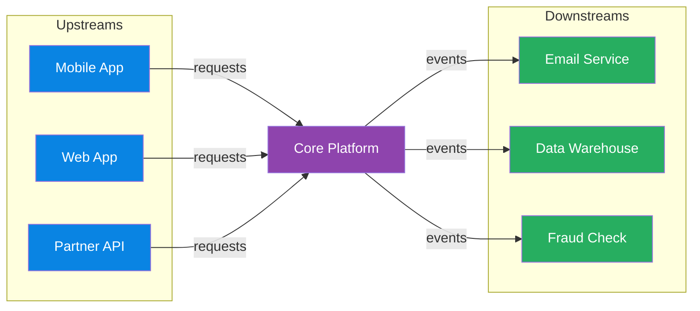

# Architecture & Cloud Patterns

> **Domain**: Software architecture patterns, cloud adoption frameworks, networking topology, system design concepts, and migration strategies.
> **Parent**: [Reference Dictionary](index.md)

---

## Contents

| Term | Anchor |
|:---|:---|
| DDD | [`#ddd`](#ddd) |
| Bounded Context | [`#bounded-context`](#bounded-context) |
| Ubiquitous Language | [`#ubiquitous-language`](#ubiquitous-language) |
| Database Per Service | [`#database-per-service`](#database-per-service) |
| Strangler Fig | [`#strangler-fig`](#strangler-fig) |
| Anti-Corruption Layer | [`#anti-corruption-layer`](#anti-corruption-layer) |
| Sidecar Pattern | [`#sidecar-pattern`](#sidecar-pattern) |
| Ambassador Pattern | [`#ambassador-pattern`](#ambassador-pattern) |
| Well-Architected Framework | [`#well-architected-framework`](#well-architected-framework) |
| Leaderboard Pattern | [`#leaderboard-pattern`](#leaderboard-pattern) |
| CAF | [`#caf`](#caf) |
| Hub-and-Spoke | [`#hub-and-spoke`](#hub-and-spoke) |
| DMZ | [`#dmz`](#dmz) |
| Virtual File System (VFS) | [`#virtual-file-system-vfs`](#virtual-file-system-vfs) |
| Microservices | [`#microservices`](#microservices) |
| Monolith | [`#monolith`](#monolith) |
| Distributed Monolith | [`#distributed-monolith`](#distributed-monolith) |
| Deployment Coupling | [`#deployment-coupling`](#deployment-coupling) |
| Native Extension | [`#native-extension`](#native-extension) |
| Technical Debt | [`#technical-debt`](#technical-debt) |
| Upstream System | [`#upstream-system`](#upstream-system) |
| Downstream System | [`#downstream-system`](#downstream-system) |
| Upstream/Downstream Relationship | [`#upstream-downstream-relationship`](#upstream-downstream-relationship) |
| Circular Dependency | [`#circular-dependency`](#circular-dependency) |
| Base62 Encoding | [`#base62-encoding`](#base62-encoding) |
| URL Shortener | [`#url-shortener`](#url-shortener) |
| Snowflake ID | [`#snowflake-id`](#snowflake-id) |
| Key Generation Service | [`#key-generation-service`](#key-generation-service) |
| Presence Service | [`#presence-service`](#presence-service) |
| Read/Write Path Separation | [`#read-write-path-separation`](#read-write-path-separation) |
| CDN | [`#cdn`](#cdn) |
| Service Mesh | [`#service-mesh`](#service-mesh) |
| Preemption | [`#preemption`](#preemption) |
| Fair Sharing | [`#fair-sharing`](#fair-sharing) |
| Tenant Hierarchy | [`#tenant-hierarchy`](#tenant-hierarchy) |
| Write-Ahead Buffer | [`#write-ahead-buffer`](#write-ahead-buffer) |
| PRG Pattern | [`#prg-pattern`](#prg-pattern) |
| HyperLogLog | [`#hyperloglog`](#hyperloglog) |
| Back-of-the-Envelope Estimation | [`#back-of-the-envelope-estimation`](#back-of-the-envelope-estimation) |
| Load Balancer | [`#load-balancer`](#load-balancer) |
| Lazy Subscription | [`#lazy-subscription`](#lazy-subscription) |
| Stateful Gateway | [`#stateful-gateway`](#stateful-gateway) |

---

## DDD

**Domain-Driven Design** — a software design approach centered on domain modeling. The team builds a shared model of the business domain using a precise, agreed-upon language.

**Also see**: [Bounded Context](#bounded-context), [Ubiquitous Language](#ubiquitous-language)

---

## Bounded Context

An **explicit boundary** around a domain model with its own ubiquitous language. Inside the boundary, terms have precise meanings. "Account" in Banking may differ from "Account" in CRM — bounded contexts resolve this.

**Also see**: [DDD](#ddd), [Ubiquitous Language](#ubiquitous-language)

---

## Ubiquitous Language

A **shared, precise terminology** between developers and domain experts within a bounded context. The same word means the same thing to everyone — no translation gaps.

**Also see**: [DDD](#ddd), [Bounded Context](#bounded-context) · [Fintech: Financial States](fintech.md#financial-states)

---

## Database Per Service

A **microservices data pattern** where each service owns and manages its own database. No two services share the same logical data store, enforcing service boundaries and independent deployability.

### Key Characteristics
- **Private schema per service** — other services access data only through the service's API or events
- **Technology fit** — each service can choose SQL, NoSQL, or a specialized store based on its access patterns
- **No shared locks or joins** — cross-service consistency is achieved via APIs, sagas, or events
- **Independent scaling and recovery** — one service's database load does not starve another

### When to Use
- Microservices where teams need autonomous deployment and schema evolution
- Domains with heterogeneous data access patterns (e.g., ACID balances + high-write event logs)

### When NOT to Use
- Early-stage monoliths where cross-table joins and transactions dramatically simplify correctness
- When the organization lacks mature API/event contracts and saga compensation design

### Also see
- [Bounded Context](#bounded-context) · [Saga Pattern](data-concurrency.md#saga-pattern) · [Outbox Pattern](cqrs-event-driven.md#outbox-pattern)

---

## Strangler Fig

An **incremental migration pattern** — gradually replace a legacy system by building new functionality around it until the old system is "strangled" and can be removed. Named after the fig tree that grows around a host tree.

**Also see**: [Anti-Corruption Layer](#anti-corruption-layer)

---

## Anti-Corruption Layer

A **translation layer** that protects a bounded context from external model corruption. Translates between the external model and the internal domain model so neither leaks into the other.

**Also see**: [Bounded Context](#bounded-context), [Strangler Fig](#strangler-fig)

---

## Sidecar Pattern

A **co-located helper container** that supports the main application. Deployed alongside in the same pod (Kubernetes). Example: Envoy proxy handling TLS, routing, and observability for the app container.

**Also see**: [Ambassador Pattern](#ambassador-pattern)

---

## Ambassador Pattern

A **proxy service** that handles connectivity concerns (retry, routing, authentication) on behalf of the main service. Offloads cross-cutting network concerns from the application.

**Also see**: [Sidecar Pattern](#sidecar-pattern)

---

## Well-Architected Framework

Azure's **five pillars** of architectural excellence:

| Pillar | Focus |
|:---|:---|
| **Reliability** | Recover from failures, high availability |
| **Security** | Protect data, identities, and infrastructure |
| **Cost Optimization** | Maximize value, minimize waste |
| **Operational Excellence** | Run and monitor systems in production |
| **Performance Efficiency** | Adapt to changing workload demands |

**Also see**: [CAF](#caf)

---

## CAF

**Cloud Adoption Framework** — Microsoft's structured methodology for cloud adoption: Strategy → Plan → Ready → Adopt → Govern → Manage.

**Also see**: [Well-Architected Framework](#well-architected-framework)

---

## Hub-and-Spoke

A **network topology** where a central hub VNet hosts shared services (firewall, gateway, DNS) and spoke VNets host workloads. All spoke-to-spoke traffic routes through the hub for inspection and control.

**Also see**: [Azure Services: VNet](azure-services.md#vnet)

---

## DMZ

**Demilitarized Zone** — an isolated network segment between the untrusted internet and trusted internal network. Hosts internet-facing services that should not have direct access to internal systems.

**Also see**: [Azure Services: Azure Firewall](azure-services.md#azure-firewall)

---

## GOMAXPROCS

**GOMAXPROCS** — a Go runtime environment variable that sets the maximum number of OS threads that can execute Go code simultaneously. Controls the parallelism of the Go scheduler's work-stealing across goroutines.

### Key Characteristics
- Default: `runtime.NumCPU()` (all available CPUs)
- Set via `GOMAXPROCS=N` environment variable or `runtime.GOMAXPROCS(n)` in code
- Does NOT limit goroutine count (goroutines are multiplexed onto GOMAXPROCS OS threads)
- Critical for containerized environments where the container's CPU limit is less than the host's CPU count

### When to Use
- Explicit CPU affinity in benchmarks (matching Java's `ActiveProcessorCount`)
- Containerized Go services where `runtime.NumCPU()` sees the host CPUs, not container limits
- Performance tuning: reducing GOMAXPROCS can reduce GC pressure in CPU-saturated services

### When NOT to Use
- Default is usually correct for non-containerized deployments on dedicated hardware
- Setting GOMAXPROCS > actual available CPUs provides no benefit and may increase scheduling overhead

### Also see
- [Virtual Threads](#virtual-threads) — Java's concurrency model counterpart
- [Azure Container Apps](azure-services.md#container-apps) — containerized deployment target

---

## Goroutine

**Goroutine** — Go's fundamental unit of concurrency. A goroutine is a user-space, lightweight execution context managed entirely by the Go runtime scheduler. It starts with a ~2 KB stack (compared to ~512 KB–1 MB for OS threads) and grows dynamically. When a goroutine blocks on I/O, the Go scheduler parks it and runs another goroutine on the same OS thread — no kernel context switch required.

```go
func getOrder(w http.ResponseWriter, r *http.Request) {
    id := r.URL.Query().Get("id")
    order := db.FindOrder(id) // goroutine yields here, does not block OS thread
    json.NewEncoder(w).Encode(order)
}
// 10,000 of these running costs ~20 MB total stack
// Java platform threads equivalent: ~10 GB
```

### Key Characteristics
- Initial stack ~2 KB; grows in small increments as needed (unlike fixed OS thread stacks)
- Multiplexed onto OS threads via the Go runtime's M:N scheduler (see [M:N Scheduling](#mn-scheduling))
- Channels provide goroutine-safe communication and synchronization — no `synchronized` locks, no pinning risk
- Count is not limited by OS constraints: 50,000+ goroutines is routine in production
- Managed by `GOMAXPROCS` OS-thread pool (see [GOMAXPROCS](#gomaxprocs))

### When to Use
- Any concurrent I/O operation in Go — the idiomatic model is one goroutine per task
- High-concurrency HTTP handlers, background workers, pipeline stages

### When NOT to Use
- Not applicable outside Go (Java equivalent: [Virtual Threads](#virtual-threads); .NET equivalent: async/await tasks)
- Goroutines shared across FFI/CGo boundaries require extra care — CGo calls block the OS thread

### Also see
- [GOMAXPROCS](#gomaxprocs) — controls the OS-thread pool goroutines run on
- [M:N Scheduling](#mn-scheduling) — the scheduling model behind goroutines
- [Virtual Threads](#virtual-threads) — Java's closest equivalent

---

## M:N Scheduling

**M:N Scheduling** (also: *many-to-many threading*) — a concurrency model where M user-space execution contexts (goroutines, virtual threads, fibers) are multiplexed onto N OS threads, where M >> N. The user-space scheduler decides which lightweight context runs on which OS thread, yielding cooperatively or preemptively when a context blocks.

```
M:N Model (e.g., Go goroutines)
================================
Goroutine-1  ╲
Goroutine-2   ╲
Goroutine-3    ──▶  OS Thread-1  (user-space scheduling; no syscall on yield)
Goroutine-4   ╱
Goroutine-5  ╱

vs.

1:1 Model (Java platform threads, pre-Loom)
============================================
Request-1  ──▶  OS Thread-1  (kernel scheduler; syscall on every context switch)
Request-2  ──▶  OS Thread-2
Request-3  ──▶  OS Thread-3
```

### Key Characteristics
- **Low memory footprint**: user-space contexts start at KBs vs OS thread stacks at hundreds of KBs
- **Cheap context switch**: switching between user-space contexts is a function call, not a kernel syscall
- **High multiplexing**: tens of thousands of logical tasks can share a handful of OS threads
- **Implementations**: Go goroutines (runtime scheduler), Java Virtual Threads (JVM carrier threads), Erlang processes, Kotlin coroutines

### When to Use
- I/O-bound, high-concurrency services where tasks spend most of their time waiting
- When per-task memory cost matters (microservices, serverless, embedded)

### When NOT to Use
- Pure CPU-bound workloads benefit more from N = CPU-count platform threads; extra scheduling overhead from M:N adds no value
- When the runtime does not support M:N natively (pre-Loom Java with platform threads is 1:1)

### Also see
- [Goroutine](#goroutine) — Go's implementation of M:N scheduling
- [Virtual Threads](#virtual-threads) — JVM's M:N implementation (Java 21+)
- [GOMAXPROCS](#gomaxprocs) — controls N (OS thread count) in Go's M:N model

---

## Tokio

**Tokio** — Rust’s asynchronous runtime, providing the event loop, task scheduler, I/O driver, and timer infrastructure needed to run async Rust code in production.

### Key Characteristics
- **Work-stealing scheduler**: tasks are distributed across a pool of OS threads; idle threads steal work from busy threads.
- **Async/await**: built on Rust `async`/`await` and `Future`; the runtime polls tasks to completion.
- **Zero-cost abstractions**: async code compiles to state machines without pervasive runtime allocation.
- **Ecosystem**: `tokio::sync` (channels, locks), `tokio::time`, `tokio::net`, and `tokio::task` cover most async service needs.

### When to Use
- High-concurrency network services in Rust where many connections are handled concurrently on a small thread pool.
- CPU- and latency-sensitive services that benefit from Rust’s ownership model plus async I/O.

### When NOT to Use
- For blocking or CPU-bound work without spawning it on a dedicated thread pool (`spawn_blocking`), or it will stall the async runtime.
- As a default choice when the team has no Rust operational experience; the safety gains come with a learning curve.

### Also see
- [Virtual Threads](#virtual-threads) · [Goroutine](#goroutine) · [Event Loop](#event-loop) · [Global Interpreter Lock](../reference-dictionary/data-concurrency.md#global-interpreter-lock)

---

## Event Loop

A concurrency pattern where a single thread continuously polls for and dispatches events or I/O operations, avoiding the need for locks by processing work sequentially. Redis's `ae.c` is a canonical example: ~300 lines of C that powers millions of production systems.

### Key Characteristics

- **Single-threaded by design**: Eliminates lock contention and race conditions entirely — complexity requires justification, not the other way around
- **Event-driven polling**: Continuously checks for network I/O, timers, and signals in a main loop (`aeProcessEvents`)
- **Non-blocking I/O**: Uses mechanisms like `epoll`/`kqueue`/`select` to handle many connections without thread-per-connection overhead

### When to Use

- CPU-light, I/O-heavy workloads where request processing is fast relative to I/O wait time
- Systems where data structure access benefits from lock-free semantics (e.g., in-memory data stores)
- When operational simplicity and debuggability outweigh raw throughput on multi-core machines

### When NOT to Use

- CPU-bound workloads that cannot saturate a single core fast enough for latency requirements
- When vertical scaling limits are hit and horizontal scaling across cores is the only option
- Systems with blocking operations that cannot be offloaded to background threads or async I/O

### Also see

- [Single-Threaded Architecture](../reference-dictionary/dotnet-multithreading.md#single-threaded-architecture)
- [Async I/O patterns](../reference-dictionary/dotnet-multithreading.md)

---

## Virtual File System (VFS)

A kernel-level abstraction layer in Linux that provides a single unified interface (`struct file_operations`) for all filesystem operations, allowing hundreds of different filesystem implementations (ext4, btrfs, NFS, etc.) to coexist behind a common contract. One of the most elegant examples of clean abstraction at scale.

### Key Characteristics

- **Unified interface**: Every filesystem implements the same `file_operations` struct — `open`, `read`, `write`, `release` — regardless of underlying storage
- **Contract-enforced**: The abstraction doesn't leak; it defines a contract and enforces it, enabling Linux to grow for 30+ years without collapsing under its own weight
- **Pluggable backends**: New filesystems can be added without modifying any calling code, making the kernel extensible at the storage layer

### When to Use

- Designing systems where multiple backend implementations must be interchangeable behind a stable API
- When the data model (what is stored) should remain stable while storage strategies (how it's stored) evolve
- Architectural patterns requiring the Strategy pattern at the OS or platform layer

### When NOT to Use

- When the abstraction overhead (vtable dispatch, indirection) is unacceptable for hot-path performance
- Simple systems with only one storage backend where the abstraction cost outweighs flexibility gains
- When backend-specific features need to be exposed directly to callers (the abstraction hides them)

### Also see

- [Event Loop](#event-loop) — another example of deliberate architectural simplicity
- [Content-Addressable Storage](../reference-dictionary/ai-ml-llm.md) — Git's complementary data model

- TODO: When Virtual File System (VFS) is the wrong choice

### Also see

- TODO: Related terms

---

## Microservices

An architectural style that structures an application as a **collection of loosely coupled services**, each aligned to a business capability, owning its own data and deployable independently.

### Key Characteristics
- **Service boundaries**: usually aligned to bounded contexts or business capabilities
- **Independent deployability**: teams can release, scale and fail over services separately
- **Polyglot persistence**: each service may choose the data store that fits its access patterns
- **Operational overhead**: requires observability, CI/CD, service discovery and graceful degradation

### When to Use
- Large engineering organizations with multiple autonomous teams
- Domains with independently scaling or evolving subsystems

### When NOT to Use
- Early-stage products where a monolith is faster to build and iterate
- When the organization lacks the platform maturity to operate dozens of services

**Also see**: [Monolith](#monolith), [Database Per Service](#database-per-service), [Bounded Context](#bounded-context)

---

## Monolith

A single deployable unit in which all functionality, data access and business logic runs together. A well-factored monolith is often the fastest and simplest path to product-market fit.

### Key Characteristics
- **Single codebase and deployment unit**: everything ships together
- **In-process communication**: no network calls between modules
- **Simpler transactions and consistency**: ACID across the whole data model
- **Can be modular**: a “modular monolith” has clear internal boundaries without service boundaries

### When to Use
- Small teams, early-stage products and rapid iteration
- Domains where cross-module transactions and joins are frequent

### When NOT to Use
- When multiple teams are blocked by a shared deployment cadence
- When one component needs to scale independently by orders of magnitude

**Also see**: [Microservices](#microservices), [Strangler Fig](#strangler-fig)

---

## Distributed Monolith

A **microservices anti-pattern** in which a system is decomposed into separate deployable services but retains tight coupling across service boundaries — delivering the operational complexity of microservices (network overhead, independent deployments, distributed tracing) without the primary benefit: **team and deployment independence**.

### Key Characteristics
- **Shared database schemas** across service boundaries — services join across tables they do not own
- **Synchronous call chains**: Service A calls B calls C; a failure in C propagates to A
- **Coordinated deployments**: deploying one service requires deploying or approving others
- **Implicit contract coupling**: changes to shared libraries or schemas ripple across all consumers
- **Cascading failures**: a single slow downstream service saturates upstream thread pools

### Warning Signs
- You maintain a deployment order spreadsheet
- An on-call incident involves engineers from 3+ services simultaneously
- A two-line config change requires a multi-team Slack war room
- Services share a Postgres schema or an ORM model class

### When to Use
Not applicable — this is an anti-pattern to detect and remediate.

### When NOT to Use
Always avoid. Prefer bounded contexts with database-per-service and async event integration.

### Also see
- [Microservices](#microservices) · [Monolith](#monolith) · [Deployment Coupling](#deployment-coupling) · [Database Per Service](#database-per-service) · [Bounded Context](#bounded-context) · [Strangler Fig](#strangler-fig)
- [Microservices & Service Design — Key Takeaways](../system-design-architecture/48-svc-distributed-monolith-key-takeaways.md#svc-01-distributed-monolith-anti-pattern)

---

## Deployment Coupling

A condition in which deploying one service requires **coordinating the deployment of one or more other services**, eliminating independent deployability — a core benefit of microservices.

### Key Characteristics
- **Deployment order dependencies**: Service B must be deployed before Service A can start
- **Shared schema migrations**: database schema changes must be applied across service boundaries simultaneously
- **Synchronized release trains**: teams are forced to align release schedules rather than deploying on their own cadence
- **Rollback propagation**: rolling back one service breaks others that depend on the new API or schema

### When to Use
Not applicable — this is an anti-pattern.

### When NOT to Use
Always avoid in microservices architectures. Use async events, versioned API contracts, and database-per-service to eliminate deployment dependencies.

### Also see
- [Distributed Monolith](#distributed-monolith) · [Microservices](#microservices) · [Database Per Service](#database-per-service)
- [Microservices & Service Design — Key Takeaways](../system-design-architecture/48-svc-distributed-monolith-key-takeaways.md#svc-02-deployment-coupling-via-synchronous-call-chains)

---

## Native Extension

A **compiled module** (written in a language such as Rust, C, C++, or Cython) that is called from a higher-level runtime to execute a hot or CPU-bound function without rewriting the entire application.

### Key Characteristics
- **Surgical optimization**: targets a single bottleneck function or small module rather than the whole service.
- **FFI boundary**: the extension exposes a callable interface to the host runtime (e.g., Python via PyO3/Cython, Node.js via N-API, Ruby via C extensions).
- **Lower operational churn**: the existing service boundary, deployment pipeline, and team fluency stay mostly intact.

### When to Use
- A profile shows that one CPU-bound function dominates latency or cost.
- The service changes frequently and a full rewrite would impose an unacceptable velocity tax.
- The team needs most of the rewrite’s performance win with a fraction of its cost.

### When NOT to Use
- When the bottleneck is I/O, an algorithm, or a missing index — fixing the root cause is cheaper than adding a foreign build.
- When the FFI and build-tooling complexity outweighs the savings (small or rarely executed functions).

### Also see
- [Strangler Fig](#strangler-fig) · [Anti-Corruption Layer](#anti-corruption-layer) · [Tokio](#tokio) · [Microservices Runtime Performance — Python to Rust Rewrite Takeaways](../system-design-architecture/60-perf-key-takeaways.md#perf-11-native-extension-as-middle-path)

---

## Technical Debt

The **accumulated cost of shortcuts or suboptimal design decisions** that make future changes slower, riskier or more expensive. Like financial debt, it can be strategic if it is tracked and paid down.

### Key Characteristics
- **Visible inventory**: a debt register with estimated impact, risk and payback plan
- **Intentional and accidental**: some debt is taken deliberately to meet a deadline; some is discovered later
- **Interest grows**: untreated debt compounds as the system evolves around it

### When to Use
- Strategic short-term trade-offs with a clear repayment plan
- Refactoring work prioritized by risk and velocity impact

### When NOT to Use
- As an excuse to skip testing, documentation or security in every sprint
- Without a plan to pay it down — unchecked debt becomes a rewrite trigger

**Also see**: [Strangler Fig](#strangler-fig), [Monolith](#monolith), [Microservices](#microservices)

---

## Upstream System

A system or component that **produces data, events or requests that flow into another system**. The upstream direction is the source side of a dependency: if system A calls or emits data that system B consumes, A is upstream of B.

### Key Characteristics
- **Caller / producer / source** in a data or control flow
- **Depends on by downstream**: changes in upstream output can break downstream consumers
- **Context-relative**: the same service can be upstream to one system and downstream to another

### When to Use
- Talking about service dependencies, data lineage, event pipelines or API call chains
- Defining ownership and SLOs (upstream availability affects downstream reliability)

### When NOT to Use
- As a synonym for “client” or “server” without explaining the direction of data flow
- In isolation without clarifying what the dependency relationship actually is

**Also see**: [Downstream System](#downstream-system), [API Gateway](#api-gateway), [Microservices](#microservices)

---

## Downstream System

A system or component that **consumes data, events or requests from another system**. The downstream direction is the consumer side of a dependency: it receives what upstream systems produce.

### Key Characteristics
- **Callee / consumer / sink** in a data or control flow
- **Affected by upstream changes**: schema changes, latency or outages upstream propagate downstream
- **Context-relative**: the same service can be downstream to one system and upstream to another

### When to Use
- Discussing consumers of events, API clients, data subscribers or pipeline outputs
- Planning backward compatibility, fan-out and error handling

### When NOT to Use
- As a synonym for “backend” or “frontend” without describing the flow direction
- When the relationship is peer-to-peer and has no clear producer/consumer direction

### Also see
- [Upstream System](#upstream-system) · [Messaging](messaging.md) · [Event-Driven Architecture](cqrs-event-driven.md#event-driven-architecture)

---

## Upstream/Downstream Relationship



**Diagram description**: Upstream systems (Mobile App, Web App, Partner API) send requests into a Core Platform (purple). The Core Platform then emits events to downstream systems (Email Service, Data Warehouse, Fraud Check) shown in green. Arrows follow the direction of data/control flow from upstream producers to downstream consumers.

---

## Circular Dependency

A situation where two or more components **mutually depend on each other**, directly or transitively. In distributed systems, circular dependencies are especially dangerous when they cross infrastructure boundaries — for example, an observability stack that depends on the same service-discovery layer it monitors. When the dependency fails, the monitoring goes dark, and operators lose the ability to diagnose the very failure that took it down.

### Key Characteristics
- **Direct**: A depends on B, B depends on A
- **Transitive**: A → B → C → A (harder to detect)
- **Infrastructure coupling**: the monitoring plane shares fate with the data plane it observes

### When to Use
- Never intentionally — circular dependencies are an anti-pattern. Always break them with an intermediate abstraction, event bus, or separate infrastructure plane.

### When NOT to Use
- Circular dependencies should be eliminated, not tolerated. Even "stable" circular dependencies create fragility under failure conditions.

### Also see
- [Observability](../reference-dictionary/resilience.md#observability) · [Bulkhead](../reference-dictionary/resilience.md#bulkhead) · [Sidecar Pattern](#sidecar-pattern)

---

## Base62 Encoding

A binary-to-text encoding scheme that uses 62 characters: `0-9`, `a-z`, and `A-Z`. It produces shorter strings than Base64 (which uses 64 characters including `+` and `/`) while remaining URL-safe and human-readable. Commonly used to compress large numeric IDs into short tokens.

### Key Characteristics
- **Alphabet**: 62 URL-friendly characters
- **Compactness**: `62^7 ≈ 3.5 trillion` unique 7-character codes
- **Lexicographic ambiguity**: Case-sensitive (`a` ≠ `A`)

### When to Use
- Short URL aliases, invite codes, reference numbers
- Anywhere a large numeric ID needs a compact, shareable string

### When NOT to Use
- When case insensitivity is required (use Base36)
- When cryptographic entropy is required (use random tokens or hashes)

**Also see**: [URL Shortener](#url-shortener) · [Snowflake ID](#snowflake-id)

---

## URL Shortener

A system that maps long URLs to short, unique aliases and redirects users from the alias to the original URL. The classic design problem separates a write-heavy shortening path from a read-heavy redirect path, using pre-generated IDs, cache-aside reads, and asynchronous analytics.

### Key Characteristics
- **Read-heavy**: Redirect traffic dominates writes (often 100:1)
- **Immutable mappings**: Short codes rarely change after creation
- **Global uniqueness**: No two long URLs may share the same alias
- **Low-latency redirects**: Served from cache at the edge

### When to Use
- Link sharing, tracking, branding (e.g., `short.ly/abc123`)
- Any scenario requiring compact, memorable references to long resources

### When NOT to Use
- When the original URL must be hidden from the service operator
- When deterministic, collision-free generation is impossible to guarantee

**Also see**: [Base62 Encoding](#base62-encoding) · [Key Generation Service](#key-generation-service) · [Cache-Aside Pattern](../reference-dictionary/caching.md#cache-aside-pattern)

---

## Snowflake ID

A distributed unique ID generation algorithm introduced by Twitter. Each ID is a 64-bit integer composed of a timestamp, datacenter ID, worker ID, and sequence number. IDs are roughly time-ordered and unique without coordination beyond worker registration.

### Key Characteristics
- **64-bit**: Fits in a `BIGINT` / `long`
- **Time-ordered**: High bits encode millisecond timestamp
- **Distributed**: Datacenter and worker IDs allow independent generation
- **Sequence number**: Handles up to 4096 IDs per worker per millisecond

### When to Use
- Distributed systems needing unique, sortable IDs
- Primary keys where monotonic time ordering aids indexing

### When NOT to Use
- When strict global monotonicity is required (clock drift can break ordering)
- When IDs must be unpredictable (Snowflake IDs are guessable)

**Also see**: [Key Generation Service](#key-generation-service) · [Base62 Encoding](#base62-encoding)

---

## Key Generation Service

A dedicated service responsible for producing unique identifiers or tokens at scale. In a URL shortener, it pre-allocates disjoint ranges of numeric IDs to workers, who encode them locally as short aliases. This eliminates collision checks on the write path.

### Key Characteristics
- **Range allocation**: Coordinator assigns blocks of IDs to workers
- **Local incrementing**: Workers generate IDs without network calls
- **Fault tolerance**: Lost unused ranges are acceptable at large namespace sizes

### When to Use
- Systems requiring billions of unique, short tokens
- Workloads where write latency and collision-freedom are both critical

### When NOT to Use
- When UUIDs or database sequences are sufficient
- When centralized ID assignment is acceptable and simpler

**Also see**: [Snowflake ID](#snowflake-id) · [URL Shortener](#url-shortener)

---

## Presence Service

A component that tracks which users are currently online, on which devices, and which server or gateway holds their active connection.

### Key Characteristics
- Updated by heartbeats, WebSocket pong events, or explicit connect/disconnect
- Typically uses TTL-backed storage to survive unclean disconnects
- Essential for routing real-time messages and showing online status

### When to Use
- Chat, gaming, collaboration, and live collaboration tools
- Any system that needs connection-aware routing

### When NOT to Use
- Stateless request/response APIs without long-lived connections
- When approximate presence is unacceptable

### Also see
- [Redis Streams](messaging.md#redis-streams) · [Fanout on Write](#fanout-on-write)

---

## Preemption

In batch scheduling, **preemption** is the ability to evict a running, lower-priority workload to admit a higher-priority one or to reclaim resources for their owning tenant. Unlike queuing (which decides admission order), preemption operates on already-running jobs — it forcibly stops and requeues them.

### Key Characteristics
- **Priority-based**: Higher-priority jobs can displace lower-priority ones already consuming resources
- **Reclamation**: Idle reserved capacity lent to other tenants can be reclaimed when the owning tenant needs it
- **Graceful vs forceful**: Preempted jobs may receive a SIGTERM with a grace period or an immediate kill
- **Restartable workloads only**: Preemption is safe for batch/idempotent jobs but destructive for serving workloads

### When to Use
- Multi-tenant batch platforms where reserved capacity sits idle while other tenants starve
- Systems requiring priority-based scheduling where business-critical jobs must jump the queue
- Kubernetes-native batch scheduling via Kueue's `reclaimWithinCohort` and `withinClusterQueue` policies

### When NOT to Use
- Serving workloads (HTTP, gRPC) where eviction causes user-visible errors or data loss
- Systems without checkpointing or idempotent job design — preempted jobs lose all progress
- When preemption frequency causes thrashing (jobs repeatedly preempted before completion)

### Also see
- [Fair Sharing](#fair-sharing) · [Tenant Hierarchy](#tenant-hierarchy) · [Kueue (Kubernetes-native job queueing)](azure-services.md) · [Resilience Patterns](../reference-dictionary/resilience.md)

---

## Fair Sharing

A resource allocation strategy where **competing tenants receive a weighted share of available capacity** proportional to their configured weight. When demand exceeds supply, each tenant gets roughly `(weight / total_weight) × total_capacity`. Fair sharing prevents a single heavy tenant from starving others while allowing tenants to burst into unused capacity from others.

### Key Characteristics
- **Weighted allocation**: Tenants with higher weight get proportionally more resources under contention
- **Work-conserving**: Idle capacity from one tenant is immediately available to others — no stranded resources
- **Fairness over time**: Short-term unfairness is acceptable; the guarantee is long-term weighted proportionality
- **With preemption**: When combined with preemption, fair sharing becomes dynamic — lower-priority work can be evicted to restore fair shares

### When to Use
- Multi-tenant platforms where capacity must be divided across teams or business units
- Batch scheduling systems (Kueue, YARN, Mesos) managing heterogeneous workloads
- Cloud resource management where cost attribution and fair access are both required

### When NOT to Use
- Single-tenant systems where the concept of "fairness across tenants" is meaningless
- When strict capacity guarantees (not proportional sharing) are required — use reserved capacity instead
- Very short-term allocation where the overhead of tracking weighted usage exceeds the fairness benefit

### Also see
- [Preemption](#preemption) · [Tenant Hierarchy](#tenant-hierarchy) · [Reserved Capacity](azure-services.md)

---

## Tenant Hierarchy

A **tree-structured organizational model** for multi-tenant systems where tenants are arranged in a parent-child hierarchy. Internal (non-leaf) tenants aggregate capacity for their subtree but don't accept work directly; leaf tenants accept jobs and have associated queues. Capacity can be reserved at any level of the tree.

### Key Characteristics
- **Tree topology**: Internal tenants group and aggregate; leaf tenants execute work
- **Capacity inheritance**: Reserved capacity at an internal tenant is fair-shared across its subtree
- **Organizational mapping**: The hierarchy reflects team structure — an org can use a flat tenant or a deep tree matching ownership boundaries
- **Two capacity pools**: Reserved (partitioned, guaranteed) and Shared (global pool, burst-eligible)

### When to Use
- Large organizations with complex team structures needing hierarchical resource allocation
- Platforms where different business units need guaranteed capacity while sharing a common pool
- Batch compute platforms (Netflix CMB/Titus, Kueue Cohorts/ClusterQueues)

### When NOT to Use
- Small teams where a flat priority queue suffices
- When organizational structure is too fluid — constant hierarchy changes create operational churn
- Without preemption: hierarchical reserved capacity without preemption leaves idle resources stranded

### Also see
- [Fair Sharing](#fair-sharing) · [Preemption](#preemption) · [Cohort/ClusterQueue (Kueue concepts)](https://kueue.sigs.k8s.io/docs/concepts/)

---

## Read/Write Path Separation

**Read/Write Path Separation** is an architectural pattern where the systems handling write operations are physically or logically separated from those handling read operations. Each path is optimized for fundamentally different concerns: the write path prioritizes durability, consistency, and correctness; the read path prioritizes low latency, massive throughput, and responsiveness.

### Key Characteristics
- **Write path** focuses on: durability, consistency, ordering, data correctness, transactional integrity
- **Read path** focuses on: low latency, massive throughput, fast responses, eventual consistency
- **Asymmetric scaling**: Read replicas can scale horizontally independently of the write master
- **CQRS is the formalized version**: Command Query Responsibility Segregation explicitly separates command (write) models from query (read) models

### When to Use
- Read-heavy workloads where reads outnumber writes by 100:1 or more (e.g., election results, news feeds, leaderboards)
- Systems where write consistency requirements conflict with read performance requirements
- National-scale events where millions of concurrent reads would overwhelm a single database

### When NOT to Use
- Write-heavy OLTP systems where read volume is low and read-your-writes consistency is critical
- Simple CRUD applications where the added complexity of separate paths exceeds the benefit
- Early-stage products where the read/write ratio is unknown or unvalidated

### Also see
- [CQRS](cqrs-event-driven.md#cqrs) · [Read Model](cqrs-event-driven.md#read-model) · [Caching](caching.md) · [Database Per Service](#database-per-service)

---

## Write-Ahead Buffer

A **local, durable staging area** placed between an application and a remote message broker (e.g., Kafka). Events are first written synchronously to this local buffer, then asynchronously published to the broker. If the broker is unavailable or the async publish fails, events remain safe in the local buffer and are retried later.

> "Write to local disk first, publish to Kafka second."

### Key Characteristics
- **Durable before publish**: Events survive application crashes, restarts, and extended broker outages
- **Decouples user latency from broker availability**: The user-facing request is acknowledged once the local write completes, not when Kafka confirms
- **Append-only with compaction**: Events are appended, then compacted (deleted) after successful broker publish
- **Common implementations**: Local file on disk, embedded SQLite, RocksDB, or a dedicated WAL library

### When to Use
- Zero-data-loss requirements where async publishing is used to avoid blocking user requests
- Systems where Kafka may experience extended unavailability and in-memory buffers would overflow
- High-throughput ingestion pipelines where every event must be accounted for

### When NOT to Use
- When the broker itself is the system of record and local durability adds unnecessary complexity
- Low-throughput systems where synchronous producer acks with retries are sufficient
- When disk I/O on the producer side would become a bottleneck (measure first)

### Also see
- [Producer Acknowledgement](../messaging.md#producer-acknowledgement) · [At-Least-Once Semantics](../messaging.md#at-least-once-semantics) · [Idempotent Consumer](../messaging.md#idempotent-consumer)

---

## PRG Pattern

The **POST-Redirect-GET** pattern — a web application design pattern that prevents duplicate form submissions caused by page refreshes. After processing a POST request, the server responds with a 302 redirect to a GET endpoint, so that subsequent page refreshes only repeat the safe GET request.

### Key Characteristics
- **Prevents double-submission on refresh**: The browser's address bar points to the GET URL after redirect, not the POST endpoint
- **Two HTTP round-trips**: POST → 302 Redirect → GET (adds latency compared to a direct POST response)
- **Server-side state needed**: The GET endpoint must have access to the result of the POST operation (via session, query params, or path params)
- **UX improvement, not security**: PRG prevents accidental resubmissions from the same user on the same browser; it does NOT prevent duplicate requests from other clients, network retries, or API consumers

### When to Use
- Traditional server-rendered web applications with HTML form submissions
- Any flow where the user might refresh the page after submitting (order confirmation, payment, registration)
- Combined with token-based idempotency as a defense-in-depth strategy

### When NOT to Use
- SPAs and mobile apps — these use client-side routing and API calls, not browser form submissions; token-based idempotency is the primary mechanism
- As the sole idempotency mechanism — it only protects against browser refresh, not against network retries, message queue redelivery, or concurrent API requests

### Also see
- [Idempotency-Key](../api-design.md#idempotency-key) · [API Idempotency](../cqrs-event-driven.md#api-idempotency) · [Token-Based Idempotency](../cqrs-event-driven.md#token-based-idempotency)

---

## HyperLogLog {#hyperloglog}

A **probabilistic cardinality estimator** that counts unique elements in a multiset using O(M) memory regardless of dataset size — typically ~12 KB for Redis-grade accuracy (<1% error). Based on the observation that the maximum number of leading zeros in hashed values estimates cardinality.

### Key Characteristics
- **Bounded memory**: Uses `M` buckets (e.g., 16,384 in Redis), each storing a small integer (6 bits); total memory is fixed regardless of input size
- **Harmonic mean aggregation**: Uses harmonic mean across buckets to naturally dampen outlier bias — no need to discard extreme values like predecessor algorithms (SuperLogLog)
- **Mergeable**: Multiple HLL structures can be combined (union) without loss of accuracy — PFMERGE takes the max of corresponding buckets
- **Standard error**: $1.04 / \sqrt{M}$ — with M=16,384, approximately 0.81%
- **Not enumerable**: You cannot retrieve which elements were added, only the estimated count

### When to Use
- Approximate unique counts over massive datasets (analytics dashboards, real-time monitoring)
- When memory efficiency is critical and 1-2% error is acceptable
- Merging unique counts across time windows or dimensions (daily → weekly → monthly)
- Built-in support in Redis (PFADD/PFCOUNT/PFMERGE), PostgreSQL, and Cassandra

### When NOT to Use
- Exact counts required (billing, voting, legal compliance, financial ledgers)
- Dataset is small enough to count exactly in memory (<100K unique items)
- You need to enumerate or retrieve the actual unique elements
- Error tolerance is below 0.5%

### Also see
- [Cardinality Estimation](../databases.md#cardinality-estimation) · [Bloom Filter](../databases.md#bloom-filter) · [Morris Probabilistic Counter](../caching.md#morris-probabilistic-counter) · [Redis Internals Takeaways](../../system-design-architecture/caching/redis-internals.md#cache-12)

---

## CDN

A **Content Delivery Network** — a geographically distributed network of edge servers that cache static and dynamic content close to end users, reducing latency and offloading origin infrastructure.

### Key Characteristics
- **Edge caching**: Content replicated to points of presence (PoPs) worldwide; users fetch from the nearest edge
- **Origin offload**: 90%+ of requests served from edge cache, never reaching origin servers
- **DDoS absorption**: Distributed edge footprint absorbs volumetric attacks before they reach origin
- **Modern capabilities**: Edge compute (Cloudflare Workers, AWS Lambda@Edge), image optimization, A/B testing, SSL termination

### When to Use
- Global user base where latency to a single origin region is unacceptable
- Static assets (images, CSS, JS, videos) that benefit from caching at the edge
- DDoS protection at the network edge before traffic reaches application infrastructure

### When NOT to Use
- Intranet applications with all users in one geographic region
- Highly dynamic, personalized content that cannot be cached (though edge compute can help)
- When TLS private keys must never leave your infrastructure (some CDNs require key sharing)

**Also see**: [Edge Computing](#edge-computing) · [Caching](caching.md) · [Latency Optimization](#latency-optimization) · [Azure Front Door](../azure-services.md#azure-front-door)

---

## Service Mesh

A **dedicated infrastructure layer** that handles service-to-service communication transparently, outside application code. Deployed as sidecar proxies alongside each service, providing observability, traffic management, and security without application changes.

### Key Characteristics
- **Sidecar proxy**: Each service instance gets a co-located proxy (Envoy, Linkerd-proxy) that intercepts all network traffic
- **Control plane + data plane**: Control plane (Istiod, Linkerd control plane) configures the data plane proxies
- **mTLS**: Automatic mutual TLS between services — encryption and identity without application code
- **Traffic management**: Retries, timeouts, circuit breaking, traffic splitting (canary), fault injection
- **Observability**: Automatic metrics (request rate, latency, error rate), distributed tracing, access logs

### When to Use
- Large microservice deployments (50+ services) where consistent observability and security are required
- Organizations with a dedicated platform team that can operate the mesh
- Compliance requirements mandating encryption-in-transit for all service-to-service traffic

### When NOT to Use
- Small deployments (under 10 services) — the operational overhead exceeds the benefit
- Teams without platform engineering capacity to operate the control plane
- When the extra latency hop per request (typically <1ms with Envoy) is unacceptable
- Monoliths or services communicating over message queues rather than synchronous HTTP/gRPC

**Also see**: [Sidecar Pattern](#sidecar-pattern) · [Microservices](#microservices) · [Circuit Breaker](resilience.md#circuit-breaker) · [Istio / Linkerd](https://istio.io/latest/about/service-mesh/)

---

## Back-of-the-Envelope Estimation

A **rough, order-of-magnitude calculation** performed before designing any architecture. Uses simplified math to estimate traffic (QPS), storage, bandwidth, and memory requirements — typically converting DAU into reads/sec using the approximation `daily total / 86,400 ≈ average QPS`, then multiplying by a peak factor (3–5×) for worst-case planning.

### Key Characteristics
- **Order-of-magnitude precision**: The goal is within 2× of reality, not exact numbers — this is sufficient for architectural decisions
- **Peak multiplier**: Average QPS × (3–5) for peak load; 80/20 rule for cache coverage estimation
- **Guides component selection**: Tells you whether a single database, cache, queue, or CDN is plausible
- **Prevents over-engineering**: If a single PostgreSQL instance can handle the load, don't propose sharding

### When to Use
- System design interviews: BEFORE drawing any architecture diagram
- Early-stage capacity planning: do you need 1 server or 100?
- Reality-checking architectural proposals: "We need multi-region active-active for 1K DAU" — the math says no

### When NOT to Use
- As a substitute for load testing with real traffic patterns
- When exact numbers are available from production monitoring (use real data)
- For latency guarantees (estimation covers throughput and storage, not p99 latency)

### Also see
- [Scalability Principles](#) · [Read/Write Path Separation](#read-write-path-separation) · [Latency vs Throughput](#)
- [System Design Interview Roadmap](../system-design-architecture/system-design-interview/interview-roadmap.md#sdi-05-back-of-the-envelope-math)

---

## Load Balancer

A **traffic distribution component** that sits between clients and backend servers, distributing incoming requests across multiple server instances to maximize throughput, minimize response time, and avoid overloading any single resource.

### Key Characteristics
- **L4 (Transport Layer)**: Operates on TCP/UDP — fast, no payload inspection, distributes by IP:port
- **L7 (Application Layer)**: Operates on HTTP/HTTPS — can route by URL path, headers, cookies; supports TLS termination
- **Health checks**: Continuously verifies backend health; removes unhealthy instances from the pool
- **Algorithms**: Round-robin, least connections, IP hash, weighted, least response time
- **Consistent hashing**: Minimizes rebalancing when servers are added/removed — critical for stateful backends and caching

### When to Use
- Any multi-instance service behind a single endpoint
- SSL termination at the edge before traffic reaches application servers
- Gradual traffic shifting during deployments (canary, blue-green)

### When NOT to Use
- Single-instance deployments (the load balancer itself becomes a single point of failure without HA pairs)
- Peer-to-peer architectures where clients connect directly to any node
- When request affinity (sticky sessions) is required but the balancer doesn't support it

### Also see
- [API Gateway](api-design.md#api-gateway) · [Reverse Proxy](#reverse-proxy) · [Consistent Hashing](api-design.md#consistent-hashing) · [Azure Load Balancer / Application Gateway](azure-services.md)

---

## Lazy Subscription

A **presence and real-time subscription strategy** where clients subscribe only to the entities currently rendered on screen (visible friends, visible chunk of member list, active DMs) rather than subscribing to the entire social graph. When the user scrolls or opens a new DM, the subscription set updates dynamically.

### Key Characteristics
- **Viewport-bounded**: Subscriptions cover ~50–200 entities, not the full social graph (which may contain 100K+ entities per user)
- **Dynamic**: Subscribe/unsubscribe as the UI changes (scroll, tab switch, DM open/close)
- **Decouples fanout from graph size**: System load scales with concurrent user count, not with total social connections
- **Client-driven**: The client tracks what's visible and issues subscribe/unsubscribe calls

### When to Use
- Presence systems where fanout would otherwise multiply by thousands of watchers per status change
- Real-time indicators (typing, read receipts, live cursors, viewer counts) at scale
- Any system where the set of "things I care about right now" is much smaller than "things I could theoretically care about"

### When NOT to Use
- Small social graphs where full subscription is simpler and the fanout is manageable
- Systems where the full set of subscriptions must always be known (e.g., notification delivery to all followers)
- When the subscription churn (rapid scroll, rapid tab switching) overwhelms the subscription management system

### Also see
- [Presence Service](#presence-service) · [Fanout on Write](messaging.md#fanout-on-write) · [Fanout on Read](messaging.md#fanout-on-read) · [WebSocket](api-design.md#websocket)

---

## Stateful Gateway

A **connection-termination pattern** where each gateway server holds live session state in memory — which users are connected, their current status, and what subscriptions they hold. This is the opposite of a stateless gateway that must query a database or cache for every event.

### Key Characteristics
- **In-memory session state**: Connection, status, subscriptions held in process memory; no external lookup per event
- **Connection affinity**: A user's WebSocket is pinned to one gateway for the session duration
- **Pub/sub for cross-gateway communication**: Events are published to an internal message bus; other gateways subscribe to topics relevant to their connected clients
- **No cross-gateway discovery needed**: Gateways only need to know what topics to subscribe to, not which other gateways exist

### When to Use
- Real-time systems with persistent connections (chat, presence, collaborative editing, gaming)
- When per-event database lookups would bottleneck at scale
- Platforms where connection count dominates event count (games, chat apps)

### When NOT to Use
- Request/response APIs where connections are ephemeral (stateless gateways are simpler)
- When gateway failure would cause unacceptable data loss (stateful gateways risk losing session state on crash)
- Small systems where the operational complexity of pub/sub coordination exceeds the benefit

### Also see
- [Presence Service](#presence-service) · [WebSocket](api-design.md#websocket) · [API Gateway](api-design.md#api-gateway) · [Load Balancer](#load-balancer) · [Exponential Backoff](resilience.md#exponential-backoff)

