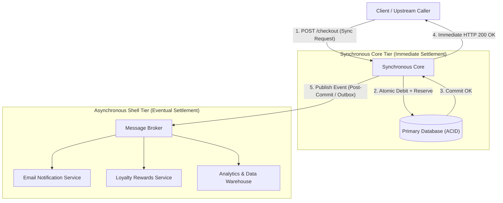

# CQRS, Event Sourcing & Event-Driven Patterns

> **Domain**: Command/query separation, event-driven architecture, projections, and related patterns.
> **Parent**: [Reference Dictionary](index.md)

---

## Contents

| Term | Anchor |
|:---|:---|
| CQRS | [`#cqrs`](#cqrs) |
| Command Side | [`#command-side`](#command-side) |
| Command Model | [`#command-model`](#command-model) |
| Query Side | [`#query-side`](#query-side) |
| Query Model | [`#query-model`](#query-model) |
| Event Sourcing | [`#event-sourcing`](#event-sourcing) |
| Projection | [`#projection`](#projection) |
| Read Model | [`#read-model`](#read-model) |
| Ledger | [`#ledger`](#ledger) |
| Outbox Pattern | [`#outbox-pattern`](#outbox-pattern) |
| Post-Commit Dispatch | [`#post-commit-dispatch`](#post-commit-dispatch) |
| Idempotency | [`#idempotency`](#idempotency) |
| Cross-Shard Query | [`#cross-shard-query`](#cross-shard-query) |
| Idempotency State Explosion | [`#idempotency-state-explosion`](#idempotency-state-explosion) |
| API Idempotency | [`#api-idempotency`](#api-idempotency) |
| Token-Based Idempotency | [`#token-based-idempotency`](#token-based-idempotency) |
| Dual-Write Problem | [`#dual-write-problem`](#dual-write-problem) |
| Event-Driven Architecture | [`#event-driven-architecture`](#event-driven-architecture) |
| Event Carried State Transfer | [`#event-carried-state-transfer`](#event-carried-state-transfer) |
| Aggregate Snapshot | [`#aggregate-snapshot`](#aggregate-snapshot) |
| Cryptographic Erasure | [`#cryptographic-erasure`](#cryptographic-erasure) |
| Event ID | [`#event-id`](#event-id) |
| Event Replay | [`#event-replay`](#event-replay) |
| Eventual Consistency | [`#eventual-consistency`](#eventual-consistency) |
| Event Backbone | [`#event-backbone`](#event-backbone) |
| Async Workflow | [`#async-workflow`](#async-workflow) |
| Deterministic Processing | [`#deterministic-processing`](#deterministic-processing) |
| Orchestrator-based Saga | [`#orchestrator-based-saga`](#orchestrator-based-saga) |
| Compensating Event | [`#compensating-event`](#compensating-event) |
| Event vs Message | [`#event-vs-message`](#event-vs-message) |
| Versioned Aggregates | [`#versioned-aggregates`](#versioned-aggregates) |
| Synchronous Core, Asynchronous Shell | [`#synchronous-core-asynchronous-shell`](#synchronous-core-asynchronous-shell) |
| Window of Uncertainty | [`#window-of-uncertainty`](#window-of-uncertainty) |
| Side-Effect Gating | [`#side-effect-gating`](#side-effect-gating) |
| Synthetic Event Key | [`#synthetic-event-key`](#synthetic-event-key) |
| Polling Relay | [`#polling-relay`](#polling-relay) |
| Transaction Log Tailing | [`#transaction-log-tailing`](#transaction-log-tailing) |
| Outbox Pruning | [`#outbox-pruning`](#outbox-pruning) |
| State-Effect Separation | [`#state-effect-separation`](#state-effect-separation) |
| Event Upcasting | [`#event-upcasting`](#event-upcasting) |
| Rebuild-and-Cutover | [`#rebuild-and-cutover`](#rebuild-and-cutover) |
| Correlation ID | [`#correlation-id`](#correlation-id) |
| Causation ID | [`#causation-id`](#causation-id) |
| Event Envelope | [`#event-envelope`](#event-envelope) |
| Distributed Context Propagation | [`#distributed-context-propagation`](#distributed-context-propagation) |
| Disguised Command Anti-Pattern | [`#disguised-command-anti-pattern`](#disguised-command-anti-pattern) |
| Naming Litmus Test | [`#naming-litmus-test`](#naming-litmus-test) |


---

## CQRS

**Command Query Responsibility Segregation** — an architectural pattern that separates write operations (commands, which change state) from read operations (queries, which serve data).

| Side | Responsibility | Consistency | Personality |
|:---|:---|:---|:---|
| **Command** | Change financial state | Strong (transactional) | Strict, boring, predictable |
| **Query** | Explain financial state | Eventually consistent | Flexible, fast, human-shaped |

> **Key insight**: Commands protect truth. Queries explain truth. Never confuse the two.

**When to use**: Money-facing systems where the same data must answer fundamentally different questions (can money move? vs what should the customer see?).

**When NOT**: Simple CRUD apps where read and write models are identical.

**Also see**: [Projection](#projection), [Read Model](#read-model), [Ledger](#ledger) · [Fintech Dictionary](fintech.md)

---

## Command Side

The **write path** in CQRS — responsible for accepting, validating, and persisting state changes using strong consistency. The command side protects correctness; it must never depend on read models for approval decisions.

**Command flow**:
```
Receive command → Check idempotency → Validate → Check risk →
Reserve limit → Create ledger entries → Validate balanced →
Commit transaction → Save outbox event → Return result
```

**Must NOT**: Build dashboard responses, perform search queries, depend on cached/projection data for approvals.

**Also see**: [CQRS](#cqrs), [Idempotency](#idempotency), [Ledger](#ledger)

---

## Command Model

The **write-side data model** in CQRS — the structure and validation rules optimized for accepting, validating, and persisting state-changing commands. The command model is the authoritative source of truth for business decisions and is usually strongly consistent.

**Also see**: [Command Side](#command-side), [CQRS](#cqrs)

---

## Query Side

The **read path** in CQRS — responsible for serving data to humans, optimized for speed and UX. Query models can be denormalized, cached, and purpose-built. They are replaceable and eventually consistent.

**Consumers**: Customer app, support dashboard, risk analyst view, operations reconciliation, finance reports.

**Must NOT**: Become the source of financial truth. Never use a query-side value to approve money movement.

**Also see**: [CQRS](#cqrs), [Projection](#projection), [Read Model](#read-model)

---

## Query Model

The **read-side data model** in CQRS — a structure optimized for serving queries quickly, often denormalized, cached, and purpose-built. In most CQRS discussions, "query model" is synonymous with [Read Model](#read-model) or [Projection](#projection).

**Also see**: [Query Side](#query-side), [Read Model](#read-model), [Projection](#projection)

---

## Event Sourcing

A persistence pattern where **state changes are stored as an immutable sequence of events** rather than as a mutable current state. The current state is derived by replaying (projecting) events.

| Aspect | Traditional CRUD | Event Sourcing |
|:---|:---|:---|
| **Storage** | Current state (mutable row) | Sequence of events (append-only) |
| **History** | Lost on update | Every change preserved |
| **Correction** | Overwrite | Append a compensating event |
| **Audit** | Separate log needed | Built-in |

> **Guidance**: Most fintech teams need clean ledger entries and projections before they need full event sourcing. Start with a ledger. Add projections. Adopt event sourcing only when replay and audit requirements demand it.

**Also see**: [Ledger](#ledger), [Projection](#projection) · [Data & Concurrency](data-concurrency.md#acid-transactions)

---

## Projection

A **read-optimized, denormalized view** of event or ledger data, built by consuming and transforming events from an authoritative source. Projections are **derived**, **replaceable**, and **eventually consistent**.

### Key Characteristics

| Characteristic | Meaning |
|:---|:---|
| **Derived** | Built from ledger/event data — does not originate truth |
| **Replaceable** | Can be dropped, rebuilt, or re-materialized at any time |
| **Eventually consistent** | May lag behind the ledger — acceptable for display, unacceptable for decisions |
| **Purpose-built** | Optimized for one specific consumer (dashboard, support screen, mobile timeline) |
| **Disposable** | If corrupted, delete and rebuild — no financial data is lost |

### What a Projection Is NOT

| ❌ Is NOT | Why |
|:---|:---|
| The source of truth | The ledger/event store holds truth; the projection reflects it |
| Used for money-movement decisions | Never ask a projection "can this money move?" |
| Immutable | Projections are rebuilt; immutability belongs to the ledger |
| Authoritative for limits | Limits must be reserved on the command side |

### Projection vs Ledger

| Aspect | Ledger (Source of Truth) | Projection (Derived View) |
|:---|:---|:---|
| **Role** | Records financial facts | Tells a story about those facts |
| **Consistency** | Strong, transactional | Eventually consistent |
| **Mutability** | Append-only, immutable | Freely rebuildable |
| **If lost** | Financial disaster | Rebuild from ledger |
| **Examples** | `ledger_entries` table | Balance view, transaction timeline, risk dashboard |

> **The Golden Rule**: A projection tells the story. The ledger holds the truth. Never confuse the two.

**Also see**: [Read Model](#read-model), [CQRS](#cqrs), [Ledger](#ledger) · [Fintech Dictionary](fintech.md)

---

## Read Model

Synonymous with **projection** in most CQRS contexts. The query-side representation of data — shaped around human understanding rather than financial correctness. Read models answer "what happened?" Projections are the technical mechanism; read models are the conceptual result.

**Also see**: [Projection](#projection), [Query Side](#query-side)

---

## Ledger

An **append-only, immutable record of financial movement** where every entry is balanced (debit = credit). The ledger is the single source of financial truth in a CQRS fintech system.

| Principle | Detail |
|:---|:---|
| **Append-only** | Entries are never mutated after posting |
| **Balanced** | Every transaction has matching debit and credit |
| **Immutable history** | The past is evidence, not garbage |
| **Source of truth** | All projections and read models derive from it |

> Corrections are posted as **new entries** — existing entries are **never** edited or deleted. A reversal is a new entry, not a deletion.

**Also see**: [Projection](#projection), [CQRS](#cqrs) · [Fintech Dictionary](fintech.md#ledger-double-entry)

---

## Outbox Pattern

An architectural pattern that solves the **dual-write problem** by atomically persisting state mutations and outbound event notifications within the exact same database transaction, decoupling the relational write from external network publishing.

```
WRONG:   DB write → Publish event (Gap: crash between steps leaves state out of sync)
RIGHT:   DB write + Outbox row (same ACID TX) → Relay publisher dispatches to broker
```

### Key Characteristics
- **Local Transactional Atomicity**: Both the aggregate record and the outbox row commit together or roll back together, eliminating silent event loss.
- **At-Least-Once Delivery**: Because a relay may crash after publishing but before marking the outbox row published, downstream consumers **must** be idempotent.
- **Relay Decoupling**: Relay mechanism is decoupled from the transaction path, implemented either via a polling worker ([Polling Relay](#polling-relay)) or log-based Change Data Capture ([Transaction Log Tailing](#transaction-log-tailing)).
- **Scope Boundary**: Solves single-service write atomicity only; does **not** solve distributed multi-service consensus (requires Sagas) or consumer ordering across multiple partitions.

### When to Use
- Any microservice or bounded context that updates a database and must notify external consumers via an asynchronous message broker (Kafka, RabbitMQ, Service Bus).
- Event-driven systems requiring guaranteed event emission without distributed two-phase commit (2PC / XA) transactions.

### When NOT to Use
- High-throughput ingestion where the extra database write amplification of inserting and deleting outbox rows creates a storage or I/O bottleneck (prefer direct event stream ingestion like Event Hubs or Kafka).
- Workflows spanning multiple independent services that require coordinated rollback (use the Saga pattern instead).
- When events do not represent committed transactional facts.

**Also see**: [Dual-Write Problem](#dual-write-problem), [Polling Relay](#polling-relay), [Transaction Log Tailing](#transaction-log-tailing), [Outbox Pruning](#outbox-pruning), [Post-Commit Dispatch](#post-commit-dispatch), [Idempotency](#idempotency) · [Messaging](messaging.md)

---

## Post-Commit Dispatch

The rule that side effects such as events, notifications, and confirmations must be emitted only after the originating database transaction has successfully committed.

```
WRONG:  Check inventory → Emit event → Commit DB  (event may describe a failed write)
RIGHT:  Check inventory → Commit DB → Emit event  (event is a fact)
```

### Key Characteristics
- Prevents confirmations or downstream events for rolled-back transactions
- Often implemented via outbox pattern, CDC, or database post-commit hooks
- Requires idempotency on the consumer side because at-least-once delivery is common

### When to Use
- Sending booking confirmations, payment receipts, or inventory updates
- Any workflow where an external observable must reflect committed state

### When NOT to Use
- When the side effect is purely in-process and does not outlive the transaction
- Do not use this as an excuse to delay user feedback; return a `202 Accepted` or equivalent while the post-commit path completes

**Also see**: [Outbox Pattern](#outbox-pattern), [Dual-Write Problem](#dual-write-problem) · [Data & Concurrency: Change Data Capture](../reference-dictionary/data-concurrency.md#change-data-capture)

---

## Idempotency

The property that ensures **the same business action performed multiple times produces the same result as performing it once**.

```
Client sends:    Transfer { idempotencyKey: "txn-abc-123" }
Server checks:   Have I seen "txn-abc-123" before?
  → If YES:      Return the original result (do NOT process again)
  → If NO:       Process, store key + result, return
```

| Principle | Detail |
|:---|:---|
| **Key belongs to business action** | Not the HTTP request, not the session — the exact intent |
| **Sits before the dangerous part** | Before money moves, before the ledger command |
| **Uses `SELECT FOR UPDATE`** | Prevents race conditions on idempotency key lookup |

> In fintech, idempotency is a financial seatbelt — fastened before the engine starts, not a best-effort log check.

### Hidden Costs at Scale

Idempotency does not remove complexity — it **moves it into time**. Instead of fast, visible failures, systems get slow, invisible ones.

| Hidden Cost | Description |
|:---|:---|
| **State explosion** | Storing keys + outcomes + TTLs at scale creates a secondary datastore with independent failure modes |
| **False confidence** | Teams add more retries once a system is "idempotent," amplifying risk instead of reducing it |
| **Money bugs** | Compensating transactions and auto-reconciliation can temporarily violate financial invariants — the books look right eventually, but the path between states erodes trust |
| **Observability gaps** | Idempotent retries produce successful responses, so standard dashboards show green while failures accumulate as support tickets |
| **Incomplete execution** | A cached "success" response may be returned while downstream side effects are still in progress |

> **Core insight**: If an operation cannot be safely replayed, do not pretend it can. Idempotency must be end-to-end with explicitly modeled side effects, and "success" must mean execution complete — not merely accepted.

**Also see**: [API Idempotency](#api-idempotency), [Token-Based Idempotency](#token-based-idempotency), [Idempotency State Explosion](#idempotency-state-explosion), [Outbox Pattern](#outbox-pattern), [Dual-Write Problem](#dual-write-problem) · [API Design](api-design.md#idempotency-key) · [Data & Concurrency](data-concurrency.md) · [Reconciliation](fintech.md#reconciliation)

---

## Idempotency State Explosion

The **hidden infrastructure cost** of idempotency at scale — storing every idempotency key, its outcome, and managing TTLs creates a secondary datastore that must be as reliable as the primary database.

### Key Characteristics
- **Linear growth**: Storage grows as `request volume × TTL duration` — every unique request consumes a row
- **Independent failure domain**: When the idempotency store is unavailable, the system must either reject requests (fail closed) or risk double execution
- **TTL is a correctness constraint**: Keys must live longer than the maximum retry window plus reconciliation lag; too-short TTLs reintroduce duplicate-processing risk
- **Cleanup is non-trivial**: Premature key deletion is dangerous; deterministic GC processes are safer than request-time eviction

### When to Use
- Planning idempotency storage capacity and failure modes before deploying to production
- Auditing existing idempotent systems for hidden operational risk

### When NOT to Use
- As a reason to avoid idempotency — the alternative (duplicate execution with no safety net) is worse
- As justification for arbitrarily long TTLs — balance safety against storage cost

### Also see
- [Idempotency](#idempotency) · [Outbox Pattern](#outbox-pattern)

---

## Dual-Write Problem

The problem where a service must write to **two independent systems** (e.g., database and message broker) and a failure between the two writes leaves the system in an inconsistent state.

| Scenario | Consequence |
|:---|:---|
| DB write succeeds, event publish fails | Ledger knows; read models don't |
| Event published, DB transaction rolls back | Read models believe a transfer that never happened |

**Solution**: [Outbox Pattern](#outbox-pattern) — write both in the same database transaction.

**Also see**: [Outbox Pattern](#outbox-pattern) · [Data & Concurrency](data-concurrency.md)

---

## Event-Driven Architecture

An architectural style where services communicate by producing and consuming **events** — immutable facts about what happened. Events describe state changes that have already occurred.

| Principle | Detail |
|:---|:---|
| **Events are facts** | "TransferAccepted" not "PleaseTransfer" |
| **Source of truth first** | The ledger commits → the event describes what happened |
| **Events amplify, not fix** | A confused ledger + events = confusion distributed faster |

> **Key insight**: "Let's make it event-driven" does not fix a confused financial model. The question is: "What exactly is the source of truth?" Events are excellent after a trusted command has committed. They are dangerous when used to avoid making the command boundary clear.

**Also see**: [CQRS](#cqrs), [Outbox Pattern](#outbox-pattern) · [Messaging](messaging.md)

---

## Event Carried State Transfer

An event design pattern where events include **all the state information that downstream consumers need** — not just an identifier. This eliminates the need for consumers to call back to the producing service to fetch associated data.

### Key Characteristics
- **Self-contained events**: Each event carries a complete, consumer-usable snapshot of the relevant entity state
- **Eliminates round-trips**: Consumers can act immediately without synchronous back-calls
- **Producer-defined contract**: The producer decides what context to include; consumers cannot request more
- **Payload size growth**: Rich payloads increase message size; combine with the Claim Check pattern for payloads over the broker limit

### When to Use
- Consumers consistently need the same contextual fields alongside the event notification
- Low-latency systems where every additional network call is unacceptable
- Decoupling services so the producer's internal model can evolve independently of consumers (as long as the event contract holds)

### When NOT to Use
- Event payloads would exceed broker message size limits (use [Claim Check](messaging.md#claim-check) instead)
- Sensitive data fields should not be broadcast to all consumers
- The producer state is so large or varied that different consumers need entirely different subsets

### Also see
- [Event-Driven Architecture](#event-driven-architecture) · [CQRS](#cqrs) · [Messaging: Claim Check](messaging.md#claim-check)

---

## Aggregate Snapshot

A **point-in-time serialisation of an event-sourced aggregate's current state**, stored externally alongside the Kafka offset at which it was captured. On consumer restart or new deployment, the snapshot is loaded first and only events after the snapshot offset are replayed — bounding rebuild time to a fixed interval regardless of total event history.

### Key Characteristics
- **Offset-tagged**: the snapshot records the exact Kafka partition offset (or event sequence number) at which it was taken so replay can resume precisely
- **Frequency trade-off**: more frequent snapshots → faster rebuild, higher storage cost; typical intervals are every 1 000 events or every 5 minutes
- **Storage**: DynamoDB (for fast key lookup) or S3 (for large aggregates or cost-sensitivity)
- **Atomicity**: the snapshot must be written in the same transaction as the offset bookmark; a partial snapshot is corrupted state

### When to Use
- Aggregates with millions of events where cold-start replay is unacceptably slow
- Event-sourced consumers that must restart quickly (e.g., serverless or auto-scaling deployments)

### When NOT to Use
- Aggregates with a small event history where full replay takes < 1 second
- Systems where snapshot storage is not available or adds unacceptable operational overhead

### Also see
- [Event Sourcing](#event-sourcing) · [Projection](#projection) · [Messaging: Compacted Topic](messaging.md#compacted-topic)

---

## Cryptographic Erasure

A GDPR compliance technique for **immutable event logs**: encrypt each event containing PII with a **per-user symmetric key**. When the user requests deletion, destroy the key. The events remain physically in the log but are permanently unreadable — satisfying the erasure obligation without mutating the log.

### Key Characteristics
- **Key granularity**: one encryption key per data-subject (user); deleting the key erases all their events across all topics
- **Accepted by regulators**: most Data Protection Authorities accept cryptographic erasure as equivalent to physical deletion when the encryption is provably unrecoverable (AES-256)
- **Key store**: AWS KMS (Customer Managed Keys), HashiCorp Vault, or a dedicated secrets table with strict access controls
- **Performance overhead**: AES-256 GCM encryption adds < 1 ms per event write; key lookup adds one extra service call

### When to Use
- Event-sourced systems subject to GDPR, CCPA, or similar right-to-erasure regulations
- Any immutable log (blockchain, audit trail) where physical deletion would corrupt the chain

### When NOT to Use
- Systems where PII can be kept in a separate, mutable store (simpler: just delete the record)
- When regulatory guidance in the applicable jurisdiction does not accept cryptographic erasure as equivalent to deletion

### Also see
- [Event Sourcing](#event-sourcing) · [Outbox Pattern](#outbox-pattern) · [HSM](../reference-dictionary/hsm-cryptography.md)

---

## Event ID

A **globally unique identifier** assigned to every business event at production time, used by consumers for idempotent deduplication. The Event ID remains unchanged across producer retries so that the same business event always carries the same identifier.

### Key Characteristics
- **Deterministic per business event**: Same logical event → same Event ID across retries, regardless of how many times the producer publishes
- **Consumer-facing**: The Event ID is the key consumers use to check "have I already processed this?"
- **Analogous to idempotency keys**: Functions identically to an idempotency key in payment APIs — the same key means "this is the same action"
- **Producer responsibility**: The producer must generate the ID before the first publish attempt and reuse it on retries

### When to Use
- Any at-least-once messaging system where producers may retry after acknowledgment loss
- Event-driven architectures where duplicate events must not cause duplicate business side-effects
- Payment systems, inventory updates, order processing — any workflow where double-processing is unacceptable

### When NOT to Use
- In systems with true exactly-once delivery guarantees (rare in practice)
- When the consumer can derive idempotency from natural business keys (e.g., `order_id` + `version`)

### Also see
- [Idempotency](#idempotency) · [Token-Based Idempotency](#token-based-idempotency) · [Outbox Pattern](#outbox-pattern) · [Idempotent Consumer](../reference-dictionary/messaging.md#idempotent-consumer) · [Atomic Deduplication](../reference-dictionary/messaging.md#atomic-deduplication)

---

## Event Replay

A validation technique that replays captured production event logs through a system in a staging environment to prove idempotency holds under real failure conditions. The same batch of historical events is replayed multiple times with injected duplicates and out-of-order delivery, and the final database state must be identical after every replay.

### Key Characteristics
- **Production-scale data**: Uses real event volume and patterns, not synthetic test data
- **Chaos injection**: Artificially duplicates events and shuffles delivery order to simulate network partitions
- **Deterministic outcome**: Row counts, checksums, and counter values must match between replays
- **Side-effect isolation**: Downstream notifications and external API calls are mocked to avoid impacting real users

### When to Use
- Validating that an event-driven system is truly idempotent before deploying to production
- After retrofitting idempotency into an existing system that was not originally designed for it
- As a regression test after changes to consumer logic or retry policies

### When NOT to Use
- As a substitute for unit and integration tests (it complements them, not replaces them)
- When the staging environment cannot match production data volumes

### Also see
- [Idempotency](#idempotency) · [Event Sourcing](#event-sourcing) · [Change Data Capture](../reference-dictionary/data-concurrency.md#change-data-capture) · [Deduplication Store](../reference-dictionary/messaging.md#deduplication-store)

---

## Eventual Consistency

**Eventual Consistency** — a consistency model where updates to a distributed system propagate asynchronously. If no new updates are made, all replicas eventually converge to the same value. During the propagation window, different nodes may serve different (stale) values.

### Key Characteristics
- **Asynchronous replication**: Writes to one node are propagated to other nodes in the background — there is no synchronous quorum wait
- **Convergence guarantee**: Given enough time without new writes, all replicas agree
- **Staleness window**: The period between write and full propagation — milliseconds to seconds in practice
- **Conflict resolution**: Requires a strategy (last-write-wins, CRDTs, application-level merge) when concurrent writes conflict

### When to Use
- High-availability systems where serving any data is better than serving no data (streaming, social feeds, CDN metadata)
- Read-heavy workloads where occasional staleness is acceptable and low latency is paramount
- Multi-region systems where synchronous cross-region writes would add unacceptable latency

### When NOT to Use
- Financial systems where showing a stale balance could mean approving a transaction the account cannot cover
- Any system where consistency is a legal or compliance requirement (audit trails, medical records)
- When the application cannot implement meaningful conflict resolution for concurrent writes

### Also see
- [Masterless Architecture](../reference-dictionary/architecture-patterns.md#masterless-architecture) · [Apache Cassandra](../reference-dictionary/architecture-patterns.md#apache-cassandra) · [CAP Theorem](../reference-dictionary/data-architecture.md#cap-theorem) · [CQRS](#cqrs) · [Projection](#projection)

---

## Event Backbone

An architectural pattern where **Kafka (or an equivalent distributed log) serves as the central nervous system** connecting all services in a domain. Services publish domain events to topics and react to events from other services — they never call each other directly via synchronous APIs. The log is the single source of truth for what happened in the system.

> "Instead of services calling each other, they publish and react to events independently."

### Key Characteristics
- **Loose coupling**: Services don't know about each other — they only know about event types and topic names
- **Independent deployability**: Each service can be deployed, scaled, and evolved independently
- **Resilience through buffering**: Kafka absorbs downstream slowdowns; producers are never blocked by slow consumers
- **Multi-consumer fan-out**: One event is consumed by N downstream services without additional producer effort

### When to Use
- Microservice ecosystems where synchronous call chains have become a distributed monolith
- Domain-driven systems where bounded contexts produce and consume domain events
- Organizations where different teams own different services and deploy independently

### When NOT to Use
- Simple systems with 2-3 services where direct REST calls are simpler and sufficient
- Latency-sensitive request-response flows where eventual consistency is unacceptable
- Systems where strict transactional consistency across services is required

### Also see
- [Event-Driven Architecture](#event-driven-architecture) · [Event Sourcing](#event-sourcing) · [Eventual Consistency](#eventual-consistency) · [CQRS](#cqrs)

---

## API Idempotency

The guarantee that **multiple identical API requests produce the same side effect as a single request** — regardless of how many times the client sends them. API idempotency is enforced at the server boundary using idempotency keys, token validation, or natural business identifiers, and is essential for safe retries in distributed systems where network failures, timeouts, and at-least-once delivery are the norm.

### Key Characteristics
- **Client-supplied key**: The client generates a unique `Idempotency-Key` header per business action and reuses it across retries
- **Server-enforced**: The server stores processed keys and returns cached results for duplicates — the client never decides "this is a duplicate"
- **Time-bound**: Keys expire after a configurable window (typically 24 hours); retries outside the window are treated as new requests
- **Atomic validation**: Key lookup and business execution must be atomic or use compare-and-swap to prevent race conditions under concurrency

### When to Use
- Payment APIs, order creation, inventory deductions — any mutating endpoint where double-execution causes financial or data corruption
- Any API exposed to mobile clients, retry-happy SDKs, or unreliable networks
- Message consumers processing at-least-once delivery from Kafka, RabbitMQ, or Event Hubs

### When NOT to Use
- Read-only GET endpoints (already idempotent by HTTP semantics)
- Low-stakes operations where occasional duplicates are acceptable and cheaper to clean up than to prevent
- When the idempotency store (Redis, DB) becomes a bigger reliability risk than the duplicate operations it prevents

### Also see
- [Idempotency](#idempotency) · [Token-Based Idempotency](#token-based-idempotency) · [Idempotency-Key](../api-design.md#idempotency-key) · [PRG Pattern](../api-design.md#prg-pattern)

---

## Token-Based Idempotency

A **concrete idempotency strategy** where each mutating request carries a unique, single-use token. The server atomically validates and consumes the token before executing business logic — if the token is missing or already consumed, the request is rejected. Under high concurrency, the token check-and-consume must be a single atomic operation (e.g., Redis Lua script, `SETNX`, or `SELECT FOR UPDATE`) to prevent race-condition-based double execution.

### Key Characteristics
- **Token lifecycle**: Generate → store with TTL → submit with request → atomically validate + delete → reject if missing
- **Atomic consume**: Redis Lua scripts (`GET` + `DEL` in one operation) or database row-level locks prevent concurrent token reuse
- **ULID preferred**: Universally Unique Lexicographically Sortable Identifiers provide time-sortable, globally unique tokens without coordination
- **Short TTL**: Tokens typically expire in 5 minutes — long enough for a single request lifecycle, short enough to limit storage

### When to Use
- High-concurrency scenarios where simple database unique constraints are insufficient (e.g., flash sales, ticket booking)
- APIs where the client cannot provide a natural business key (order creation before an order number exists)
- Combined with state machines and optimistic locking as a defense-in-depth idempotency strategy

### When NOT to Use
- When a natural business key already provides idempotency (e.g., `transaction_id` from a payment gateway)
- Low-throughput systems where a database unique constraint on `request_id` is simpler and sufficient
- When Redis availability is lower than the service's availability target — a token store outage blocks all mutating operations

### Also see
- [API Idempotency](#api-idempotency) · [Idempotency](#idempotency) · [Idempotency-Key](../api-design.md#idempotency-key) · [Optimistic Locking](../data-concurrency.md#optimistic-locking)

---

## Async Workflow

A **coordination pattern that breaks a long-running business process into independent steps executed in response to events**, rather than chaining them inside a single synchronous request. Each step publishes an event when it finishes, and downstream consumers subscribe to those events to perform the next action.

### Key Characteristics

- **Event-driven decomposition**: the initiating request only creates the initial record and publishes an event
- **Loose coupling**: consumers evolve and fail independently without blocking the originating operation
- **Eventual consistency**: downstream state catches up asynchronously rather than in the original transaction
- **Failure isolation**: a failed consumer can retry or land in a DLQ without rolling back upstream work

### When to Use

- Multi-step workflows where steps have different reliability, latency, or scaling requirements
- Cross-service processes where synchronous chaining creates cascading failures
- Checkout, order fulfillment, billing, or notification pipelines

### When NOT to Use

- When the user must observe the final result before the API returns
- When strong transactional consistency across steps is required and cannot be relaxed
- Very short processes where synchronous handling is simpler and fast enough

### Also see

- [Outbox Pattern](#outbox-pattern) · [Event-Driven Architecture](#event-driven-architecture) · [Eventual Consistency](#eventual-consistency) · [CQRS](#cqrs)
- [29-arch-key-takeaways.md](../system-design-architecture/29-arch-key-takeaways.md)

---

## Cross-Shard Query

A database query that must read data from multiple shards to produce a complete result. Cross-shard queries occur when the query filter does not include the shard key — the database cannot determine which single shard holds the relevant data and must broadcast the query to all shards (scatter-gather).

### Key Characteristics
- **Scatter-gather execution**: Query is sent to every shard, partial results are merged at the coordinator or application layer
- **Linear cost scaling**: Query latency and resource consumption grow proportionally with shard count
- **Pagination complexity**: `LIMIT 10 OFFSET 100` across shards requires fetching `(OFFSET + LIMIT)` rows from every shard, merging, sorting, and slicing
- **Mitigation strategies**: Secondary indexes (Elasticsearch), global secondary indexes, or denormalized query-specific tables

### When to Use
- Identifying queries that need cross-shard optimization before they become production bottlenecks
- Designing secondary index strategies when the shard key cannot cover all query patterns

### When NOT to Use
- As the default query pattern — cross-shard queries should be the exception, not the norm
- When a query can be restructured to include the shard key

### Also see
- [Global Secondary Index](../reference-dictionary/messaging.md#global-secondary-index) · [Shard Key](../reference-dictionary/data-concurrency.md#shard-key) · [Sharding](../reference-dictionary/data-architecture.md#sharding) · [Sharding & Partitioning Strategies](../system-design-architecture/databases/sharding-partitioning-strategies.md)

---

## Deterministic Processing

A design constraint on event-processing logic requiring that **the same input always produces the same output**, regardless of when or how many times processing occurs. Non-deterministic functions (`NOW()`, `UUID()`, external API calls) are replaced with values carried in the event payload or derived deterministically from it.

### Key Characteristics
- **Event-derived values only**: All processing inputs come from the event payload — no ambient state (clock, random, network)
- **Replay-safe**: The same event stream replayed N times produces identical final state
- **Enables event sourcing**: Deterministic processing is a prerequisite for event replay as a recovery and auditing mechanism
- **Event-carried state transfer**: Events must carry sufficient data for consumers to process without external calls

### When to Use
- Event-sourced systems where replay is used for recovery, migration, or auditing
- Idempotent consumers where non-determinism would break the idempotency guarantee
- Systems requiring provable correctness through replay verification

### When NOT to Use
- When external API enrichment is essential and caching is not feasible (accept that replay may produce slightly different results)
- Simple CRUD consumers where replay is never needed
- When event size constraints prevent carrying all required data in the payload

### Also see
- [Event Sourcing](#event-sourcing) · [Event Replay](#event-replay) · [Idempotency](#idempotency)

---

## Orchestrator-based Saga

A **Saga implementation pattern** where a central orchestrator service maintains the workflow state machine, issuing commands to participant services and handling failures through compensating transactions. Unlike choreography-based sagas where each service listens for events and decides its next action, the orchestrator explicitly knows which step is active, which steps completed, and which compensations to execute on failure.

### Key Characteristics
- **Centralized workflow logic**: The orchestrator owns the sequence, retry policies, timeout handling, and compensation triggers
- **Durable state machine**: Saga state is persisted in a database — the orchestrator can crash and recover by scanning for incomplete sagas
- **Explicit audit trail**: Every step, command, and compensation is recorded centrally, critical for payment and financial workflows
- **Idempotency-gated commands**: Every command carries an idempotency key so retries never produce duplicate side effects
- **Outbox pattern**: State updates and outgoing events are written in the same database transaction for atomic publication

### When to Use
- Payment workflows and financial systems where audit trails and explicit state tracking are mandatory
- Sagas with complex branching, conditional steps, or partial-failure handling
- When you need to pause, resume, retry, or manually intervene in an in-flight workflow
- When the workflow logic changes frequently — centralized orchestration is easier to version and test

### When NOT to Use
- Simple, linear event chains where choreography's lower operational overhead is sufficient
- When the orchestrator would become a scalability bottleneck (mitigate with partitioning by saga ID)
- When the team lacks the operational maturity to manage an additional stateful service

### Also see
- [Saga Pattern](data-concurrency.md#saga-pattern) · [Compensating Transaction](data-concurrency.md#compensating-transaction) · [Idempotency](#idempotency) · [Outbox Pattern](#outbox-pattern) · [Choreography-based Saga](messaging.md#choreography-based-saga)

---

## Compensating Event

A domain event published to semantically revert, counteract, or adjust the state changes of a previously emitted event in an append-only event log. Rather than mutating or deleting historical records in an event stream, the system preserves complete historical auditability by recording corrections as explicit new facts.

### Key Characteristics
- **Preserves Log Immutability**: The historical event stream remains unmodified; corrections are forward-only state transitions.
- **Audit Compliance**: Financial, medical, and legal regulations mandate a permanent record of both the initial (erroneous) action and its subsequent correction.
- **Explicit Domain Modeling**: Modeled as first-class domain occurrences (e.g., `PaymentRefunded`, `OrderQuantityAdjusted`, `InventoryReservationReleased`) rather than generic rollback markers.
- **Projection Reconciliation**: Downstream read models and materialized views apply the compensating event to transition to the corrected state.

### When to Use
- Correcting bad data, bugs, or user errors in event-sourced or ledger-based architectures.
- Managing rollbacks in choreography-based Sagas when a multi-step business transaction fails midway.
- Financial systems, payment gateways, inventory allocation, and compliance workflows.

### When NOT to Use
- Transient in-memory errors that occur prior to committing an event to the persistent event log (use standard exception handling).
- Purely ephemeral cache invalidations or telemetry streams where exact historical accuracy is not required.

### Also see
- [Event Sourcing](#event-sourcing) · [Ledger](#ledger) · [Compensating Transaction](data-concurrency.md#compensating-transaction) · [Orchestrator-based Saga](#orchestrator-based-saga)

---

## Event vs Message

The fundamental architectural distinction between **Events** (notifications that an immutable domain fact has occurred in the past) and **Messages / Commands** (instructions directed to a specific recipient requesting a future action).

| Dimension | Event | Message / Command |
|:---|:---|:---|
| **Semantics** | Past fact: *"This happened"* (`OrderPlaced`) | Future intent: *"Do this"* (`ProcessPayment`) |
| **Addressing** | Broadcast / Pub-Sub (publisher is unaware of consumers) | Point-to-Point / Queue (sender targets specific handler) |
| **Coupling** | Loose (consumers adapt to the publisher's domain event) | Tight (sender expects a specific handler and contract) |
| **Mutability** | Strictly immutable historical fact | Ephemeral instruction consumed upon execution |
| **Expectation** | Zero expectation of a specific outcome or direct response | Expects execution and potential acknowledgement/result |

### Key Characteristics
- **Prevents Orchestration Drift**: Conflating events with commands leads to "event-driven architecture in name only", creating tight coupling masked by asynchronous transport.
- **Clear Routing Semantics**: Events belong on broadcast topics (Kafka, Event Grid); Commands belong on dedicated work queues (RabbitMQ, Service Bus Queues).

### When to Use
- Use **Events** for state synchronization, cross-domain notifications, analytics, and read-model projections.
- Use **Messages/Commands** for task execution, worker job queues, and explicit Saga orchestration.

### When NOT to Use
- Do not use broadcast events when you require guaranteed single-worker execution with direct response (use Commands).
- Do not use targeted command queues for public cross-boundary domain notifications.

### Also see
- [Event-Driven Architecture](#event-driven-architecture) · [Event Carried State Transfer](#event-carried-state-transfer) · [Disguised Command Anti-Pattern](#disguised-command-anti-pattern) · [Naming Litmus Test](#naming-litmus-test) · [Kafka vs RabbitMQ](messaging.md#kafka-vs-rabbitmq)

---

## Versioned Aggregates

A domain-driven design and concurrency pattern where an aggregate root maintains a strictly monotonically increasing version number (`version: int` or sequence counter). When domain events are emitted or applied, the version number is incremented and validated to ensure causal consistency, prevent lost updates, and detect out-of-order event arrivals.

### Core Mechanics & Examples

#### 1. Write Path: Optimistic Concurrency Control (OCC)
Prevents write-write race conditions when concurrent requests modify the same entity:
```sql
-- Thread A & Thread B both load order 'ord-101' at version 2
-- Thread A succeeds:
UPDATE orders 
SET status = 'CANCELLED', version = 3 
WHERE id = 'ord-101' AND version = 2; -- 1 row updated (Success)

-- Thread B fails (avoids overwriting Thread A's cancellation):
UPDATE orders 
SET status = 'PAID', version = 3 
WHERE id = 'ord-101' AND version = 2; -- 0 rows updated (OptimisticLockException)
```

#### 2. Read Path: Out-of-Order Consumer Gating
Guards async read models/search indexes when events arrive out of sequence (e.g., `v3: Discontinued` arrives before `v2: PriceDiscounted`):
- **Stale / Duplicate (`event.version <= doc.version`)**: Drop silently (prevents old price from overwriting final archived state).
- **Sequential (`event.version == doc.version + 1`)**: Apply mutation and advance `doc.version = event.version`.
- **Gap Detected (`event.version > doc.version + 1`)**: Buffer event in a retry store until missing version arrives.

#### 3. Role Summary Across Layers

| Architecture Layer | Version Mechanism | Failure Prevented |
|:---|:---|:---|
| **Write Model (Transactional DB)** | Atomic check-and-increment (`WHERE version = expected`) | Lost updates & race conditions |
| **Read Model (Materialized Views)** | Version gating (`WHERE version < event.version`) | Stale overwrites from out-of-order events |
| **Event Store (Event Sourcing)** | `PRIMARY KEY(aggregate_id, version)` constraint | Branching/forked history on the same entity |

### Key Characteristics
- **Optimistic Concurrency Control (OCC)**: Validates state versions at commit time rather than holding heavy distributed locks.
- **Out-of-Order Detection**: Provides downstream consumers with a mathematical signal to detect gaps or drop obsolete records.
- **Causal Consistency**: Establishes unambiguous lineage for all state mutations across distributed boundaries.

### When to Use
- Event-sourced entities, financial accounts, order lifecycles, and distributed state machines.
- Distributed event consumers where network reordering or partition rebalancing delivers events out of sequence.
- Materialized read-model projections requiring strict version gating.

### When NOT to Use
- Simple append-only time-series metrics where order between independent samples does not impact domain state.
- Write-heavy telemetry streams where OCC conflicts would cause excessive retry contention.

### Also see
- [Event Sourcing](#event-sourcing) · [Optimistic Concurrency Control](data-concurrency.md#optimistic-concurrency-control) · [Idempotency](#idempotency) · [Event Replay](#event-replay) · [Deterministic Consumer](messaging.md#deterministic-consumer)

---

## Synchronous Core, Asynchronous Shell

An architectural integration pattern that bifurcates operations into two distinct execution tiers:
1. **Synchronous Core**: Strict, transactional business operations (such as payment authorization, inventory reservation, and invariant validation) executed atomically within the immediate client request/response path against an authoritative ACID database.
2. **Asynchronous Shell**: Non-critical, decoupled side effects (such as confirmation notifications, loyalty point accruals, analytics ingestion, and search index updates) emitted as events off the back of the committed transaction and processed asynchronously via message brokers.



### Key Characteristics
- **Bifurcated Execution Boundary**: Critical state changes occur under immediate strong consistency; peripheral reactions occur under eventual consistency.
- **Latency Protection**: Keeps slow, external, or rate-limited integrations (email APIs, analytics) off the end-user request path.
- **Cognitive Simplicity**: Eliminates the need for complex distributed compensating sagas on the core transactional path while retaining the decoupled scalability of event-driven architecture for downstream reactions.
- **Post-Commit Emission**: Events are published only *after* the local transaction successfully commits (typically utilizing the Transactional Outbox pattern or change data capture).

### When to Use
- E-commerce checkout flows (immediate debit + stock reservation; async receipt email + points accrual).
- Financial ledger postings (immediate balance deduction; async fraud reporting + notification).
- User onboarding (immediate credential storage and session creation; async welcome email + CRM sync).

### When NOT to Use
- Pure read-only reporting workloads with no side effects.
- Completely asynchronous batch/stream ETL pipelines where no immediate user interaction or client blocking exists.
- Workflows where all downstream steps are strictly transactional and must succeed or fail in lockstep with the core (requires two-phase commit or immediate synchronous orchestration).

### Also see
- [Outbox Pattern](#outbox-pattern) · [Post-Commit Dispatch](#post-commit-dispatch) · [Event-Driven Architecture](#event-driven-architecture) · [CQRS](#cqrs)

---

## Window of Uncertainty

The temporal interval in a distributed or asynchronously integrated system during which an operation has been initiated, but its eventual outcome (success, failure, or compensation) remains undecided and cannot yet be authoritatively confirmed to the caller.

### Key Characteristics
- **Indeterminate State**: Neither the initiating service nor the waiting client knows whether the operation will ultimately settle successfully or require rollback.
- **UX Degradation**: Forces interactive frontends into artificial blocking states (spinners, "processing your order" dialogs) or polling loops.
- **Failure Ambiguity**: If a timeout, network partition, or consumer crash occurs during this window, recovery requires querying idempotency state stores, reconciling against compensating transactions, or human intervention.
- **Inherent to Distributed Sagas**: Converting an atomic local transaction into an asynchronous choreography across multiple services introduces this window between each event hop.

### When to Consider
- Designing distributed transaction workflows, choreographies, and sagas.
- Evaluating whether a business workflow can tolerate eventual consistency or requires an atomic synchronous core.
- Defining client timeout, retry, and polling policies for asynchronous job endpoints (`202 Accepted`).

### When to Eliminate
- High-stakes customer checkout, instant fund transfers, and live booking flows where users expect immediate deterministic confirmation.
- Sub-second SLA APIs where client contracts forbid indeterminate pending states.

### Also see
- [Eventual Consistency](#eventual-consistency) · [Orchestrator-based Saga](#orchestrator-based-saga) · [Synchronous Core, Asynchronous Shell](#synchronous-core-asynchronous-shell) · [Idempotency](#idempotency)

---

## Side-Effect Gating

An architectural pattern and execution guard in event-driven architecture and event sourcing where event consumers explicitly distinguish between live stream processing and historical event replay, suppressing external, non-idempotent real-world actions (such as credit card charges, email/SMS dispatch, or third-party webhooks) while executing pure internal state derivation.

### Key Characteristics
- **Separation of Concerns**: Decouples mathematical state transitions ($\text{State}_t = f(\text{State}_{t-1}, \text{Event}_t)$) from external I/O dispatch.
- **Context-Aware Suppression**: Uses execution context flags (e.g., `is_replay = true`) or distinct consumer group topologies to disable downstream notification and payment triggers during offset rewinds.
- **Safe Disaster Recovery & Projections**: Enables operators to rewind offsets and rebuild read models from historical event logs without spamming users or triggering duplicate billing.
- **Pure Function State**: Ensures that aggregate state machines depend solely on the event history rather than external side-effect responses.

### When to Use
- Rebuilding materialized read models or projections from the beginning of an event stream.
- Replaying historical Kafka/Event Hubs topics after deploying a bug fix to domain logic.
- Event-sourced architectures where aggregates emit external side-effect commands.

### When NOT to Use
- Simple CRUD applications without event replay capabilities.
- Pure stream transformations where every event is meant for external forwarding and no state derivation exists.

### Also see
- [Event Replay](#event-replay) · [Deterministic Processing](#deterministic-processing) · [Deterministic Consumer](messaging.md#deterministic-consumer) · [Idempotency](#idempotency)

---

## Synthetic Event Key

A deterministically generated unique identifier produced by hashing immutable business payload fields (e.g., entity ID, event type, sequence/version, and creation timestamp) or concatenating natural business components when events emitted by legacy systems or third-party sources lack an explicit unique ID.

### Key Characteristics
- **Deterministic Derivation**: Produces identical keys for duplicate deliveries of the same business event: $\text{Key} = \text{SHA256}(\text{payload})$.
- **Consumer-Side Uniqueness Contract**: Enables downstream consumers to construct an idempotency key and maintain a deduplication store even when producers fail to assign UUIDs.
- **Collision Resistance**: Relies on cryptographic hashing (e.g., SHA-256) across all immutable attributes to prevent distinct events from colliding into the same dedup key.
- **Producer Assignment Preference**: Best treated as a fallback; assigning a UUID at producer creation time is always preferred over retrofitting synthetic keys downstream.

### When to Use
- Ingesting events from legacy, third-party, or webhook sources that do not provide unique message or event IDs.
- Constructing deduplication keys for idempotent consumers processing unkeyed event streams.

### When NOT to Use
- When events already carry a natural, globally unique producer-generated UUID or message ID.
- Mutable payloads where field values change between retries, which would produce conflicting hashes for the same business event.

### Also see
- [Event ID](#event-id) · [Idempotency](#idempotency) · [Token-Based Idempotency](#token-based-idempotency) · [Atomic Deduplication](messaging.md#atomic-deduplication)

---

## Polling Relay

An implementation strategy for the **Outbox Pattern** where an asynchronous background worker process periodically queries the database outbox table for unpublished events, publishes them to a message broker (e.g., Kafka, Service Bus), and marks them as published or deletes them.

### Key Characteristics
- **Simplicity**: Implemented entirely within standard application code using standard SQL queries (`SELECT ... WHERE status = 'PENDING' ORDER BY created_at LIMIT N`).
- **Database Query Overhead**: Continuously issues read queries against the operational database, which can create connection pool pressure and table lock contention at high volumes.
- **Latency Floor**: Publishing latency is bounded by the polling frequency (typically 500ms to 5 seconds); sub-second real-time streaming is not achieved.
- **Indexing Requirement**: Requires composite indexes (e.g., `(status, created_at)`) to prevent full table scans as outbox rows accumulate.

### When to Use
- Low-to-moderate transactional throughput (< 500 transactions per second).
- Teams seeking minimal operational complexity without managing additional infrastructure like CDC connectors.
- Environments where sub-second publishing latency is not a strict business SLA.

### When NOT to Use
- High-throughput, write-heavy platforms where continuous polling queries degrade primary database transaction throughput.
- Ultra-low latency pipelines requiring instant downstream event dispatch (prefer [Transaction Log Tailing](#transaction-log-tailing)).

### Also see
- [Outbox Pattern](#outbox-pattern) · [Transaction Log Tailing](#transaction-log-tailing) · [Outbox Pruning](#outbox-pruning) · [Post-Commit Dispatch](#post-commit-dispatch)

---

## Transaction Log Tailing

An outbox publisher implementation where an external agent or connector (such as Debezium or Kafka Connect) directly tails the database transaction log or write-ahead log (WAL in PostgreSQL, binlog in MySQL, Change Feed in Cosmos DB) to stream committed outbox table insertions to the message broker without executing application-level SQL polling queries.

### Key Characteristics
- **Zero Polling Overhead**: Does not execute `SELECT` queries or compete with application transactions for connection pools or query execution slots.
- **Near Real-Time Latency**: Events are streamed almost immediately after the database transaction commits to disk, achieving sub-second end-to-end dispatch.
- **Infrastructure Dependency**: Requires running and monitoring dedicated streaming infrastructure (e.g., Kafka Connect, Debezium clusters, replication slots).
- **Transaction Log Management**: Requires tuning WAL/binlog disk retention to avoid database disk saturation if connector lag or network outages stall consumption.

### When to Use
- High-throughput transactional systems (> 1,000 transactions per second) where polling queries would saturate database compute.
- Latency-sensitive event-driven architectures requiring immediate downstream propagation of state changes.

### When NOT to Use
- Low-throughput or simple architectures where the operational overhead of managing Debezium or Kafka Connect outweighs the benefits of log streaming (use [Polling Relay](#polling-relay)).
- Cloud databases or shared database-as-a-service tiers that restrict access to low-level replication slots or binary logs.

### Also see
- [Outbox Pattern](#outbox-pattern) · [Polling Relay](#polling-relay) · [Data & Concurrency: Change Data Capture](../reference-dictionary/data-concurrency.md#change-data-capture) · [Event Backbone](#event-backbone)

---

## Outbox Pruning

The operational practice and lifecycle management of deleting, truncating, or archiving published records from an outbox table to prevent table bloat, maintain index efficiency, and keep polling queries performant.

### Key Characteristics
- **Table Bloat Mitigation**: Prevents unbounded table growth that degrades database query cache hit rates and bloats storage.
- **Pruning Strategies**:
  - *Immediate Deletion*: Deleting the outbox row within the same transaction that confirms publication to the broker.
  - *Scheduled Batch Deletion*: Running an off-peak background cleanup job to remove rows where `status = 'PUBLISHED' AND published_at < NOW() - INTERVAL '7 DAYS'`.
  - *Partition Truncation*: Partitioning the outbox table by day or week and dropping expired partitions instantaneously without row-level lock contention.
- **Transient Buffer Model**: Enforces the architectural rule that the outbox table is a transient delivery queue, not a permanent business audit log.

### When to Use
- Any production implementation of the Outbox Pattern, especially when utilizing a Polling Relay where query speed directly correlates with outbox table size.
- Systems with high transaction velocity generating millions of events per week.

### When NOT to Use
- Systems where the outbox table is explicitly designed as the immutable, authoritative event store (e.g., in strict Event Sourcing implementations where events are never deleted).

### Also see
- [Outbox Pattern](#outbox-pattern) · [Polling Relay](#polling-relay) · [Databases: Write Amplification](../reference-dictionary/databases.md) · [Databases: Table Partitioning](../reference-dictionary/databases.md)

---

## State-Effect Separation

An architectural boundary pattern in event-driven systems where consumers that derive state (e.g., read models, projections, search indexes, caches) are strictly decoupled from consumers that trigger external, irreversible real-world side effects (e.g., sending emails, invoking payment gateways, dispatching push notifications).

### Key Characteristics
- **Pure State Derivation**: The state consumer behaves as a pure mathematical function of the immutable event log ($S_t = f(S_{t-1}, E_t)$), relying on zero live database queries, zero current timestamps, and zero non-deterministic inputs. It can safely be replayed arbitrarily many times.
- **Dedicated Side-Effect Consumers**: Side effects are owned by a dedicated, independent consumer group tracking its own broker offsets.
- **Effect Ledgers**: Side-effect consumers enforce idempotency via an explicit ledger table (`hasFired(eventId)`), ensuring external actions execute at most once even during stream replays or retries.
- **Replay Isolation**: Replaying historical events to rebuild or repair a read model never touches or triggers the side-effect consumer.

### When to Use
- Any event-driven architecture where event consumption involves both internal materialized view updates and external real-world actions.
- Systems requiring the capability to reprocess historical Kafka/broker topics from offset zero without re-emailing or re-charging customers.

### When NOT to Use
- Pure stateless notification dispatchers where no internal state or read model is maintained.
- Simple synchronous architectures where state changes and side effects are coordinated via immediate request-response workflows.

### Also see
- [Side-Effect Gating](#side-effect-gating) · [Deterministic Processing](#deterministic-processing) · [Ledger](#ledger) · [Read Model](#read-model) · [Idempotent Consumer](messaging.md#idempotent-consumer)

---

## Event Upcasting

A deterministic transformation pattern in event sourcing and event-driven architectures where historical event payloads conforming to older schema versions are updated in-memory to the current schema version during consumer deserialization, prior to executing state transition or projection logic.

### Key Characteristics
- **Log Immutability Preservation**: Historical events on the persistent broker log or event store remain permanently unaltered in their original serialized form.
- **Stateless In-Memory Chaining**: Upcasters operate as a pipeline of incremental transformation functions ($v1 \to v2 \to v3$), injecting backward-compatible defaults or restructuring fields deterministically.
- **Self-Contained Transformations**: Upcasters do not perform live database lookups or depend on volatile system context, ensuring identical output across any replay.
- **Elimination of One-Off Migration Scripts**: Embedding upcasting directly into application consumer logic eliminates the need for out-of-band batch database migration scripts.

### When to Use
- Event sourcing and CQRS systems where schema contracts evolve over time and aggregate streams or read models must be replayed from genesis.
- Long-retention event streaming platforms (Kafka, Event Hubs) storing multi-year immutable audit histories.

### When NOT to Use
- Ephemeral messaging queues where messages are consumed immediately and deleted, with zero historical retention or replay requirements.
- Systems utilizing Schema Registries with strict backward/forward schema compatibility where additive optional fields suffice without structural transformations.

### Also see
- [Event Sourcing](#event-sourcing) · [Projection](#projection) · [Deterministic Processing](#deterministic-processing) · [Schema Evolution](messaging.md#schema-evolution)

---

## Rebuild-and-Cutover

An operational and architectural deployment pattern for event-driven read models (also known as Blue-Green Read Model Rebuild) where historical event logs are replayed into an isolated shadow database table or index while live traffic continues querying the active read model, followed by an atomic read cutover once the shadow store reaches stream parity.

### Key Characteristics
- **Zero Query Degradation**: Avoids in-place table truncation or mutation, ensuring client applications never see incomplete or half-rebuilt state during multi-hour replay operations.
- **Isolated Shadow Storage**: The replay worker writes exclusively to a newly provisioned table, collection, or search index (e.g., `orders_summary_v2`).
- **Atomic Pointer Switch**: Read traffic is redirected instantaneously using a database view, synonym, alias, or application configuration toggle.
- **Zero-Downtime Rollback**: If verification tests detect inconsistencies in the newly rebuilt store, operators can revert the view/alias pointer back to the previous version with zero latency impact.

### When to Use
- Rebuilding materialized projections or search indexes following logic bug fixes, indexing strategy overhauls, or schema refactoring.
- High-availability event-driven systems where read models must remain fully available to queries during massive historical replays.

### When NOT to Use
- Very small, ephemeral datasets where in-place table re-creation takes milliseconds and can be executed within a scheduled maintenance window.
- Systems constrained by extreme database storage limits that cannot accommodate a temporary 2x storage footprint during the rebuild phase.

### Also see
- [Read Model](#read-model) · [Projection](#projection) · [Event Replay](#event-replay) · [State-Effect Separation](#state-effect-separation)

---

## Correlation ID

A globally unique identifier generated at the initiation of a business workflow and carried across all distributed microservices, message brokers, and database operations belonging to that single end-to-end transaction.

### Key Characteristics
- **Workflow-Scoped Invariant**: Unlike an Event ID (unique per message), a Correlation ID remains constant across the entire multi-service lifecycle of a request or business event flow.
- **Cross-Boundary Thread**: Propagates through HTTP headers, broker record headers (Kafka/Event Hubs), and logging contexts (MDC), turning disjoint per-service log streams into a single queryable timeline.
- **Root Cause Localization**: Enables operators to execute a single query (e.g., `correlation_id = 'abc123'`) to narrow down an incident spanning dozens of services to the exact component where the flow stopped or failed.
- **Non-Invasive Protocol**: Typically carried in transport headers/envelopes rather than domain payload schemas, avoiding domain model pollution.

### When to Use
- Distributed microservices, event-driven architectures, and asynchronous message flows spanning multiple service boundaries.
- Auditing, end-to-end request tracing, customer support ticket investigation, and distributed root cause analysis.

### When NOT to Use
- Monolithic, single-process applications where local in-memory call stacks and thread IDs provide complete execution context.
- High-frequency low-level metric telemetry where individual events are purely statistical and not part of an identifiable user or business transaction.

### Also see
- [Causation ID](#causation-id) · [Event Envelope](#event-envelope) · [Distributed Context Propagation](#distributed-context-propagation) · [Event ID](#event-id) · [Event-Driven Architecture](#event-driven-architecture)

---

## Causation ID

An identifier attached to an event or command that explicitly references the `event_id` of the immediate predecessor event or action that caused it, enabling the reconstruction of a hierarchical cause-and-effect tree (DAG).

### Key Characteristics
- **Direct Parent Reference**: Points specifically to the single event that directly triggered the current processing action ($E_{\text{parent}} \to E_{\text{child}}$).
- **DAG Lineage Reconstruction**: While a Correlation ID groups all events in a workflow as a flat set, Causation IDs allow observability platforms to construct the exact directed acyclic graph of concurrent branches, retries, and cascading effects.
- **Tripartite Identity Triad**: Forms a complete lineage triad alongside Event ID (self identity) and Correlation ID (root workflow identity).
- **Branch Fault Attribution**: Unambiguously isolates which parallel branch in a fan-out workflow produced an error or timed out.

### When to Use
- Complex event-driven topologies with asynchronous fan-out, saga choreography, or multi-step reactive pipelines.
- Systems requiring forensic auditability, lineage tracking, and automated failure attribution in distributed workflows.

### When NOT to Use
- Purely linear, single-threaded synchronous pipelines where parent-child relationships map 1:1 to chronological timestamps without branching.
- Architectures with minimal metadata budgets where flat correlation IDs provide sufficient operational visibility.

### Also see
- [Correlation ID](#correlation-id) · [Event ID](#event-id) · [Event Envelope](#event-envelope) · [Event-Driven Architecture](#event-driven-architecture)

---

## Event Envelope

An architectural messaging pattern that encapsulates a pure domain business payload within a standardized outer structure containing transport, routing, governance, and observability metadata.

### Key Characteristics
- **Domain-Infrastructure Decoupling**: Business domain entities (payloads) remain focused purely on domain state, while transport headers (metadata) manage infrastructure concerns.
- **Standardized Metadata Header Set**: Carries universal governance fields such as `event_id`, `correlation_id`, `causation_id`, `traceparent`, `event_type`, `schema_version`, and `published_at`.
- **Zero-Deserialization Routing**: Enables message brokers, API gateways, stream routers, and audit collectors to filter, route, or index events by inspecting headers without deserializing the business payload.
- **Independent Schema Evolution**: Domain payload schemas can evolve using Avro/Protobuf without breaking infrastructure monitoring or routing components.

### When to Use
- Enterprise event-driven architectures, event backbones, and event streaming platforms (Kafka, Event Hubs, Service Bus).
- Systems implementing polyglot microservices where a uniform message envelope standardizes cross-team communication and observability.

### When NOT to Use
- Ultra-low-latency financial market data or high-frequency IoT sensor telemetry where every byte of bandwidth and serialization overhead is constrained.
- Internal in-memory messaging or intra-aggregate event handling within a single domain boundary.

### Also see
- [Correlation ID](#correlation-id) · [Distributed Context Propagation](#distributed-context-propagation) · [Event Carried State Transfer](#event-carried-state-transfer) · [Schema Evolution](messaging.md#schema-evolution)

---

## Distributed Context Propagation

The systematic mechanism of injecting, transmitting, and extracting distributed tracing and correlation metadata across asynchronous and synchronous boundaries in a distributed system.

### Key Characteristics
- **Async Boundary Traversal**: Bridges the gap where synchronous thread-local request contexts terminate upon publishing a message to a broker log, re-establishing span continuity on the consumer side.
- **W3C Standards Compliance**: Standardizes trace representation using W3C TraceContext specifications (`traceparent`, `tracestate`) across heterogeneous technologies and languages.
- **Orphan Trace Prevention**: Explicitly links downstream consumer spans to remote producer spans as child spans, preventing fractured traces and ensuring complete distributed flamegraphs.
- **Automated / Interceptor Instrumentation**: Implemented via middleware, client interceptors, or OpenTelemetry SDK hooks to eliminate manual header parsing in application business logic.

### When to Use
- Distributed microservices communicating over asynchronous messaging brokers (Kafka, RabbitMQ, Event Hubs, Service Bus) or HTTP/gRPC networks.
- End-to-end APM distributed tracing, latency profiling, bottleneck identification, and SLO monitoring.

### When NOT to Use
- Monolithic applications where in-process call stacks and profilers already provide unbroken execution traces.
- Offline batch processing of unindexed file archives where requests are decoupled from live business interactions.

### Also see
- [Event Envelope](#event-envelope) · [Correlation ID](#correlation-id) · [Event-Driven Architecture](#event-driven-architecture)

---

## Disguised Command Anti-Pattern

An architectural anti-pattern in event-driven systems where an imperative instruction targeted at a single specific actor (e.g., `PaymentShouldBeCharged`, `InventoryShouldReserve`) is wrapped in event-shaped pub/sub clothing and published to a broadcast topic. This creates tight point-to-point coupling between producer and consumer while hiding the dependency inside a topic name rather than an explicit API interface or queue contract.

### Key Characteristics
- **Hidden Coupling (Invisible RPC)**: The producer implicitly depends on a specific consumer reacting in an exact way, but the dependency is invisible in source code and compile-time type checks.
- **Fragile Failure Modes**: If the target service's subscription drops or fails silently, no direct error is returned to the upstream caller; if a second subscriber is attached, actions execute multiple times (e.g., double-charging).
- **Misused Pub/Sub Infrastructure**: Uses a 1-to-many broadcast broker construct (topic) to execute a 1-to-1 targeted command workflow.

### When to Use
- **Never**: This is an anti-pattern. If command execution is required, use point-to-point queues or explicit Saga orchestration; if event notification is desired, use past-tense domain facts (`OrderPlaced`).

### When NOT to Use
- Avoid whenever designing asynchronous messaging contracts or topic naming conventions.

### Also see
- [Event vs Message](#event-vs-message) · [Naming Litmus Test](#naming-litmus-test) · [Orchestrator-based Saga](#orchestrator-based-saga) · [Event-Driven Architecture](#event-driven-architecture)

---

## Naming Litmus Test

A design-time heuristic used during architecture and code reviews to verify whether a proposed asynchronous message payload represents an authentic domain event or a disguised command.

### Key Characteristics
- **Multi-Subscriber Invariant Check**: Evaluates the question: *"If two or more independent services subscribed to this topic tomorrow, would each reaction be valid, or would it corrupt business state / double-execute side effects?"*
- **Past-Tense vs Imperative Validation**: Genuine events represent immutable past facts (`OrderPlaced`, past-tense noun phrase); disguised commands represent future intentions or modal instructions (`PaymentShouldBeCharged`, imperative/modal verb phrase).
- **Topology Alignment**: Ensures genuine events map to broadcast topics (Kafka, Event Grid) while commands map to point-to-point queues (Service Bus Queues, SQS) or direct RPC.

### When to Use
- Pull request reviews, schema registry contract reviews, and event modeling workshops (EventStorming).
- Auditing legacy event brokers for hidden point-to-point coupling.

### When NOT to Use
- Internal method or function signatures within a single process where compiler type-checking and direct invocations are already explicit.

### Also see
- [Event vs Message](#event-vs-message) · [Disguised Command Anti-Pattern](#disguised-command-anti-pattern) · [Event-Driven Architecture](#event-driven-architecture)

