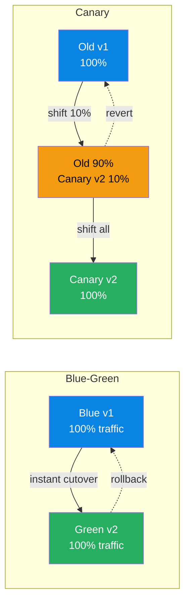

# Deployment & Release Patterns

> **Domain**: Deployment strategies, progressive delivery, feature flags, and release management patterns.
> **Parent**: [Reference Dictionary](index.md)

---

## Contents

| Term | Anchor |
|:---|:---|
| Blue-Green | [`#blue-green`](#blue-green) |
| Canary Deployment | [`#canary-deployment`](#canary-deployment) |
| Blue-Green vs Canary Deployment | [`#blue-green-vs-canary-deployment`](#blue-green-vs-canary-deployment) |
| Progressive Delivery | [`#progressive-delivery`](#progressive-delivery) |
| Feature Flag | [`#feature-flag`](#feature-flag) |
| A/B Testing | [`#ab-testing`](#ab-testing) |
| Active-Active | [`#active-active`](#active-active) |
| Shadow Testing | [`#shadow-testing`](#shadow-testing) |
| Deployment Coupling | [`#deployment-coupling`](#deployment-coupling) |
| Pod Affinity | [`#pod-affinity`](#pod-affinity) |
| Node Affinity | [`#node-affinity`](#node-affinity) |
| Topology Spread Constraints | [`#topology-spread-constraints`](#topology-spread-constraints) |
| Deterministic Traffic Dialing | [`#deterministic-traffic-dialing`](#deterministic-traffic-dialing) |
| Canary Deployment vs Deterministic Traffic Dialing | [`#canary-deployment-vs-deterministic-traffic-dialing`](#canary-deployment-vs-deterministic-traffic-dialing) |

---

## Blue-Green

Two **identical environments** — Blue (current) and Green (new version). Traffic is switched from Blue to Green for zero-downtime deployments. Rollback is instant: switch back to Blue.

**Also see**: [Canary Deployment](#canary-deployment)

---

## Canary Deployment

Route a **small percentage of traffic** to the new version before full rollout. If error rates spike, the canary is killed and traffic reverts. Safer than Blue-Green for high-risk changes.

**Also see**: [Blue-Green](#blue-green)

---

## Blue-Green vs Canary Deployment

Both strategies separate **deployment** (installing the new version) from **release** (exposing it to users). The difference is how traffic moves:

| Aspect | Blue-Green | Canary Deployment |
|:---|:---|:---|
| Traffic shift | Instant 0% → 100% | Gradual 0% → small % → 100% |
| Rollback speed | Immediate (switch back) | Fast (drain canary) |
| Blast radius | All users if the new version fails | Only canary users |
| Best for | Low-risk changes, predictable rollbacks | High-risk changes, sensitive services |

They are often combined: a Blue-Green pair gives you an isolated environment to canary into before committing all traffic.



**Diagram description**: Two deployment patterns shown side by side. Blue-Green (left) switches all traffic instantly from Blue v1 (blue) to Green v2 (green) with a dashed rollback arrow. Canary (right) gradually shifts traffic from Old v1 (blue) to a mix of Old 90% + Canary v2 10% (yellow), then to Canary v2 100% (green), with a dashed revert arrow to the old version.

---

## Progressive Delivery

An umbrella term for **gradually exposing new code to users** using techniques such as canary releases, feature flags, blue-green deployments, A/B testing and load-balanced rollouts. It decouples deployment from release.

### Key Characteristics
- **Controlled blast radius**: new code reaches a small subset first
- **Measurable gating**: promote or rollback based on error rates, latency and business metrics
- **User segmentation**: target by region, device, customer tier or random percentage

### When to Use
- High-risk changes in large-scale services
- Products where business metrics must validate a change before full rollout

### When NOT to Use
- For trivial changes where the overhead of gating exceeds the risk
- Without automated rollback and clear success criteria

**Also see**: [Canary Deployment](#canary-deployment), [Blue-Green](#blue-green), [Feature Flag](#feature-flag), [A/B Testing](#ab-testing)

---

## Feature Flag

A software development technique that wraps functionality in a **runtime-controllable toggle**, allowing teams to enable, disable or gradually roll out features without deploying new code.

### Key Characteristics
- **Decouples deploy from release**: code can ship dark and be enabled later
- **Targeted rollout**: per user, per segment, per region or percentage-based
- **Kill switch**: problematic features can be turned off instantly

### When to Use
- Long-running features that must be merged incrementally
- High-risk changes requiring instant rollback
- A/B tests and phased rollouts

### When NOT to Use
- As a substitute for branch-based development discipline (flag debt accumulates)
- When the flag adds runtime complexity without clear value

**Also see**: [Progressive Delivery](#progressive-delivery), [A/B Testing](#ab-testing)

---

## A/B Testing

A controlled experiment where **two or more variants of a product experience are served to different user groups** to measure the impact on a business or user-experience metric.

### Key Characteristics
- **Randomized assignment**: users are bucketed to reduce selection bias
- **Hypothesis and metric**: every test has a primary success metric and stopping criteria
- **Statistical rigor**: requires sufficient sample size and significance testing

### When to Use
- Validating product changes, algorithms or UI designs with real user behavior
- Decisions where multiple options are defensible and data should break the tie

### When NOT to Use
- For changes with clear correctness or safety requirements (prefer canary metrics instead)
- When sample sizes are too small to reach statistical significance

**Also see**: [Feature Flag](#feature-flag), [Progressive Delivery](#progressive-delivery)

---

## Active-Active

A high-availability deployment pattern where **multiple data centers or regions actively serve traffic and accept writes simultaneously**, rather than one being on standby.

### Key Characteristics
- **Traffic served from multiple regions**: lower latency and better fault tolerance
- **Data synchronization**: replicas exchange writes, requiring conflict resolution
- **Complexity trade-off**: adds consistency challenges in exchange for resilience

### When to Use
- Globally distributed users requiring low-latency writes
- Mission-critical systems where a single region failure must be transparent

### When NOT to Use
- When strong consistency is more important than availability during partitions
- Without a clear conflict-resolution strategy (e.g., CRDTs, last-write-wins, custom merge)

**Also see**: [CRDT](data-concurrency.md#crdt-conflict-free-replicated-data-type), [CAP Theorem](data-architecture.md#cap-theorem)

---

## Shadow Testing

A validation technique where production traffic is **duplicated and sent to a new version or service without affecting real users**. Responses are compared between the old and new systems to detect regressions.

### Key Characteristics
- **Non-impactful**: users see only the production response; the shadow result is discarded
- **High-fidelity workload**: tests against real traffic patterns, not synthetic loads
- **Comparison metrics**: latency, errors, response payloads and resource usage

### When to Use
- Refactoring or re-platforming systems where behavioral equivalence must be proven
- Load-testing new versions with production-scale traffic

### When NOT to Use
- When the operation has side effects (e.g., payments, writes) that cannot be isolated
- Without a safe way to capture, compare and discard shadow responses

**Also see**: [Canary Deployment](#canary-deployment), [Progressive Delivery](#progressive-delivery)

---

## Deployment Coupling

A condition in which deploying one service requires **coordinating the deployment of one or more other services**, eliminating independent deployability — a core benefit of microservices.

### Key Characteristics
- **Deployment order dependencies**: Service B must be deployed before Service A can start
- **Shared schema migrations**: Database schema changes must be applied across service boundaries simultaneously
- **Synchronized release trains**: Teams are forced to align release schedules rather than deploying on their own cadence
- **Rollback propagation**: Rolling back one service breaks others that depend on the new API or schema

### When to Use
Not applicable — this is an anti-pattern.

### When NOT to Use
Always avoid in microservices architectures. Use async events, versioned API contracts, and database-per-service to eliminate deployment dependencies.

### Also see
- [Canary Deployment](#canary-deployment) · [Blue-Green](#blue-green) · [Distributed Monolith](architecture-patterns.md#distributed-monolith) · [Database Per Service](architecture-patterns.md#database-per-service)

---

## Pod Affinity

A **Kubernetes scheduling rule** that attracts pods to nodes where other specified pods are already running, based on label selectors. Used to colocate frequently communicating workloads on the same node to minimize network latency.

### Key Characteristics
- **Preferred vs Required**: Preferred affinity is a soft constraint (scheduler tries but falls back); Required affinity is a hard constraint (pod won't schedule if unmet)
- **Label-selector based**: Uses `matchLabels` or `matchExpressions` to identify target pods
- **Topology key**: Defines the scope of colocation — `kubernetes.io/hostname` (same node), `topology.kubernetes.io/zone` (same AZ)
- **Namespaces**: Can match pods across namespaces via `namespaceSelector`

### When to Use
- Services that communicate with high frequency (gRPC, REST, caching, database proxies)
- Latency-sensitive workloads where same-node communication (~tens of microseconds) is critical
- Shared cache or sidecar patterns where data locality improves hit rates

### When NOT to Use
- When node failure would take down all colocated replicas of a critical service — prefer spreading across nodes
- CPU or memory-intensive colocated services that would contend for the same node resources
- When the scheduler cannot place pods due to overly restrictive affinity rules (pod starvation)

### Also see
- [Node Affinity](#node-affinity) · [Topology Spread Constraints](#topology-spread-constraints) · [Blast Radius](resilience.md#blast-radius)

---

## Node Affinity

A **Kubernetes scheduling rule** that constrains which nodes a pod can be placed on, based on node labels. Used to target workloads to specific hardware (GPU, SSD, high-memory) or node pools.

### Key Characteristics
- **Preferred vs Required**: Same soft/hard semantics as Pod Affinity — `preferredDuringSchedulingIgnoredDuringExecution` vs `requiredDuringSchedulingIgnoredDuringExecution`
- **Node-selector evolution**: More expressive than the older `nodeSelector` field; supports `In`, `NotIn`, `Exists`, `DoesNotExist`, `Gt`, `Lt` operators
- **Static at schedule time**: Affinity is evaluated at scheduling time only; `IgnoredDuringExecution` means running pods are not evicted if node labels change

### When to Use
- GPU-accelerated inference or training workloads that require specific hardware
- SSD-backed persistent storage nodes for database or stateful workloads
- Dedicated node pools for compliance isolation (PCI-DSS, HIPAA)

### When NOT to Use
- When the required hardware type is available on all nodes — adds unnecessary scheduling constraints
- For simple CPU/memory requirements — use resource `requests` and `limits` instead
- When it limits the scheduler's ability to pack workloads efficiently across the cluster

### Also see
- [Pod Affinity](#pod-affinity) · [Topology Spread Constraints](#topology-spread-constraints)

---

## Topology Spread Constraints

A **Kubernetes scheduling mechanism** that controls how pods are distributed across failure domains (nodes, zones, regions). Balances availability (spreading to survive domain failures) against latency (colocating to minimize network cost).

### Key Characteristics
- **maxSkew**: The maximum allowed imbalance — e.g., `maxSkew: 1` means no domain can have more than 1 extra pod vs the least-populated domain
- **Topology key**: Defines the domain boundary — `topology.kubernetes.io/zone` (AZ-level), `kubernetes.io/hostname` (node-level)
- **WhenUnsatisfiable**: `DoNotSchedule` (hard) or `ScheduleAnyway` (soft — schedules but skew may exceed maxSkew)
- **Counterbalance to affinity**: Where Pod Affinity pulls pods together, Topology Spread pushes them apart

### When to Use
- Ensuring high availability by distributing replicas across availability zones
- Preventing correlated failures where all replicas land on a single node
- Multi-zone deployments where zone-level redundancy is required

### When NOT to Use
- When colocation is more important than spread (use Pod Affinity instead)
- Small clusters where the number of domains exceeds the number of replicas
- When `maxSkew: 1` is too strict for the workload and causes scheduling failures

### Also see
- [Pod Affinity](#pod-affinity) · [Node Affinity](#node-affinity) · [Correlated Failure Domain](resilience.md#correlated-failure-domain)

---

## Deterministic Traffic Dialing

A zero-downtime progressive migration and canary release pattern where live traffic is partitioned between legacy and next-generation processing engines based on a deterministic hash of an immutable transaction key (e.g., `Hash(event_id) % 100 < Threshold`), ensuring exactly-once execution per entity while allowing fine-grained dial-up and instant rollback.

### Key Characteristics
- **Deterministic Key Hashing**: Rather than random coin-flip routing, an immutable entity identifier (e.g., `user_id`, `ad_id`, `order_id`) is hashed into a bucket `[0..99]`.
- **Single Authoritative Publisher**: In dual-running shadow architectures, both systems may process the stream in parallel for automated diff auditing, but only the system designated by the deterministic threshold publishes the authoritative output downstream.
- **Granular Dial-Up**: Traffic volume shifted to the new pipeline increases incrementally (0% → 1% → 10% → 50% → 100%) by simply turning up the threshold.
- **Instant Rollback**: If anomalies or data drift are detected, lowering the threshold instantly reverts traffic to the legacy system without state corruption.

### When to Use
- Migrating high-throughput, revenue-critical pipelines (billing, payment processing, ad event tracking) where downtime or duplicate message publishing is intolerable.
- State-sensitive migrations where the same business entity must consistently be processed by the same system version throughout its lifecycle.
- Zero-downtime cutover between distinct storage or streaming processing architectures (e.g., KV datastore lookup to Apache Flink streaming join).

### When NOT to Use
- Stateless web endpoints where simple weighted load balancer routing (round-robin canary) is sufficient.
- Minor internal service deployments where brief maintenance windows or standard Blue-Green cutovers are acceptable.

### Also see
- [Canary Deployment](#canary-deployment) · [Shadow Testing](#shadow-testing) · [Progressive Delivery](#progressive-delivery) · [Feature Flag](#feature-flag)

---

## Canary Deployment vs Deterministic Traffic Dialing

While both strategies are progressive delivery patterns designed to minimize blast radius and validate new software versions against live traffic, they differ fundamentally in **routing mechanisms**, **entity/state affinity**, and **how they handle asynchronous dual-running pipelines**:

| Dimension | Standard Canary Deployment | Deterministic Traffic Dialing |
|:---|:---|:---|
| **Routing Mechanism** | **Probabilistic / Weighted**: Ingress load balancer routes e.g. 5% of incoming HTTP connections at random or round-robin to canary pods. | **Deterministic Hash Partitioning**: `Hash(entity_id) % 100 < Threshold` routes by immutable transaction key. |
| **Entity & Session Affinity** | **None (or IP/Cookie Sticky)**: Two separate events belonging to the same business entity or ad break may hit different versions. | **Strict & Repeatable**: The same entity (`ad_id`, `order_id`, `user_id`) *always* resolves to the same pipeline version across time, retries, and sessions. |
| **Shadow / Dual-Run Support** | Usually standalone: canary instances process traffic independently and emit responses directly. | Designed for **shadow pipelines**: both legacy and next-gen engines process 100% of live traffic for real-time diff auditing, but **only one authoritatively publishes** downstream. |
| **Duplicate Prevention** | Not designed for stream publisher deduplication; random splits on event streams risk double-publishing. | **Guarantees single-publisher semantics**: an event is never published by both old and new engines downstream. |
| **Primary Domain** | Stateless web APIs, microservices, frontends, and REST endpoints. | Stateful stream processing (Apache Flink, Kafka), financial billing, ad event tracking, payment pipelines. |

```
[Standard Canary: Probabilistic Request Routing]

Incoming Traffic ──► [ Load Balancer (95% / 5% Weight) ]
                            │
                            ├──── (95%) ──► [ Service v1 (Stable) ]
                            └──── ( 5%) ──► [ Service v2 (Canary) ]

[Deterministic Traffic Dialing: Shadow Audit & Hash-Partitioned Publishing]

                             Live Event Stream (100%)
                                        │
                    ┌───────────────────┴───────────────────┐
                    ▼                                       ▼
        +───────────────────────+               +───────────────────────+
        │ Legacy Pipeline (v1)  │               │ Modern Pipeline (v2)  │
        +───────────────────────+               +───────────────────────+
                    │                                       │
                    ├──────────► [ Automated Audit ] ◄──────┤ (Diff Comparison)
                    │            (Compares outputs)         │
                    │                                       │
        +───────────────────────────────────────────────────────────────+
        │ Deterministic Hash Dial: Bucket = Hash(entity_id) % 100       │
        │ - If Bucket < Dial_Threshold: Modern (v2) publishes           │
        │ - If Bucket >= Dial_Threshold: Legacy (v1) publishes          │
        +───────────────────────────────────────────────────────────────+
                                        │
                                        ▼ Exactly-Once Authoritative Output
                             Downstream Sinks / Billing
```

### Also see
- [Canary Deployment](#canary-deployment) · [Deterministic Traffic Dialing](#deterministic-traffic-dialing) · [Shadow Testing](#shadow-testing) · [Blue-Green vs Canary Deployment](#blue-green-vs-canary-deployment)


